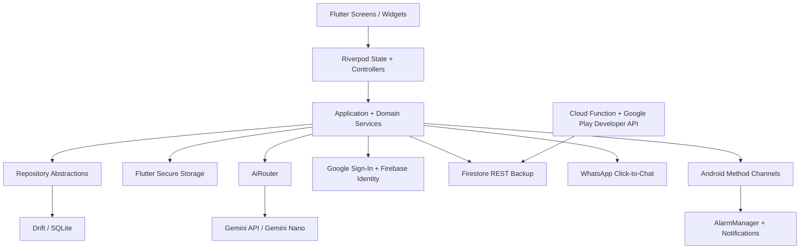

# ARCHITECTURE

## 1. Purpose

This document describes the architecture that is actually wired in the repository. It is not a plan. Runtime behavior and source code are authoritative over older documentation.

## 2. Runtime architecture

## 3. Source-of-truth ownership

| Concern | Runtime owner |
|---|---|
| Application routing | `lib/app/router.dart` |
| Dependency injection | `lib/app/providers.dart` + `lib/core/core_providers.dart` |
| Local persistence | `AppDatabase` / Drift SQLite |
| People persistence | `DriftPeopleRepository` |
| Birthday persistence | `DriftBirthdaysRepository` |
| Draft persistence | `DriftDraftsRepository` |
| Birthday cycle rollover | `BirthdayLifecycleService` |
| Reminder scheduling | Reminder application services + Android bridge |
| AI routing | `AiRouter` |
| Gemini BYOK | `UserGeminiApiProvider` + `SecureCredentialStorage` |
| Gemini Nano | `GeminiNanoProvider` + `MethodChannelGeminiNanoPlatform` |
| Authentication | `LiveGoogleAuthGateway` |
| Cloud backup/restore | `CloudSyncService` + Firestore security rules |
| Subscription entitlement | `SubscriptionNotifier` + `verifyPurchase` Cloud Function |
| Play verification | `GooglePlaySubscriptionClient` |
| WhatsApp handoff | `WhatsAppHandoffBuilder` |
| Logging | `core/loggerProvider` and `AppLogger` |

The `InMemory*Repository` implementations are test doubles. Production Riverpod providers are wired to Drift repositories.

## 4. Critical user flows

### Add and remember a birthday

`PeopleScreen`
→ `PersonFormScreen`
→ `PersonService` / `DriftPeopleRepository`
→ SQLite
→ `BirthdayLifecycleService`
→ birthday stream
→ dashboard/calendar/reminder scheduling.

When the birthday month/day changes, the current cycle status and draft are invalidated so a draft from a different date cannot remain attached to the new occurrence.

### AI message generation

`MessageStudioScreen`
→ `AiRouter`
→ entitlement check
→ user Gemini API key check
→ Gemini Nano when available without a user key
→ otherwise user Gemini API
→ `AiGenerationResult`
→ draft persistence.

AI entitlement is mandatory before either provider is used. AI failure does not invalidate non-AI birthday management.

### WhatsApp delivery

Draft
→ open WhatsApp / WhatsApp Business
→ user reviews and sends
→ user returns to AI-Birthday
→ explicit confirmation
→ birthday/draft status becomes completed.

Opening WhatsApp is not treated as delivery confirmation.

### Birthday cycle rollover

`birthdaysStreamProvider`
→ load current active people
→ `BirthdayLifecycleService.refresh`
→ create missing occurrences or roll stale occurrences into the next calendar year
→ preserve same-cycle completed drafts/status
→ expose the live birthday stream.

## 5. Authentication

Google Sign-In is implemented through `LiveGoogleAuthGateway`. A successful Google identity is exchanged with Firebase Identity Platform when Firebase configuration is present, then the resulting Firebase UID and ID token are stored in secure storage.

The current client persists an ID token but does not implement an explicit refresh-token lifecycle. Cloud and subscription calls therefore require a currently usable Firebase ID token.

## 6. Cloud backup

Cloud backup is opt-in and account-scoped.

The mobile client writes:

- `users/{uid}/people`
- `users/{uid}/birthdays`
- `users/{uid}/drafts`
- `users/{uid}/reminderSettings`

Firestore rules permit an authenticated owner to access only these backup collections under their own UID. Entitlement data and coordination state remain server-only.

The backup includes version/timestamp fields and compares `updatedAt` during restore to avoid replacing newer local data with older remote data.

**Important privacy boundary:** this implementation currently stores backup records as Firestore fields. It is not an encrypted zero-PII envelope implementation. The README and UI must not claim otherwise.

## 7. Subscription verification

The client never grants Pro merely because a purchase token is non-empty.

Flow:

Google Play purchase
→ purchase stream
→ authenticated server request
→ Cloud Function
→ Google Play Developer API `subscriptionsv2`
→ verify product/package/account binding/state/expiry
→ write entitlement
→ client unlocks AI.

The verification endpoint currently requires Firebase authentication. Firebase App Check is not yet enabled on this endpoint because the client does not initialize App Check.

## 8. AI provider routing

`AiRouter` is the only component allowed to select the AI provider.

Rules:

1. No active entitlement → AI locked.
2. User Gemini API key exists → route to user Gemini.
3. No user key + Gemini Nano is usable → route to Nano.
4. Otherwise → truthful provider-unavailable error.

The user's Gemini key is never stored in the SQLite database or sent to Firestore backup.

## 9. Delivery boundaries

WhatsApp uses a user-controlled deep-link handoff. No unofficial automation or background message sending is implemented.

Android alarms and notifications are handled through platform services. The Flutter UI does not directly own alarm scheduling internals.

## 10. Security invariants

- API keys and session credentials stay in secure storage.
- Application logs redact credential and PII-like parameter keys.
- User backup collections are scoped by Firebase UID.
- Entitlement documents are readable by the owner but writable only by server code.
- Purchase entitlement is denied until the Play token is verified.
- The app never reports WhatsApp delivery without explicit user confirmation.
- Release builds no longer fall back to the debug signing key.

## 11. Known production risks

These are real unresolved items, not hypothetical tasks:

1. Firebase App Check is disabled for the purchase verification callable.
2. Authentication currently relies on a stored Firebase ID token and has no explicit client refresh lifecycle.
3. Android release signing requires `android/key.properties` or equivalent CI signing configuration; CI must provide it for a Play-ready artifact.
4. Gemini Nano availability depends on the native Android AICore bridge and device/model support.
5. Full Flutter/backend runtime verification must be executed in CI or a development environment; repository inspection alone is not evidence that every integration test passes.

## 12. Architectural rule

Prefer the smallest coherent implementation that preserves the core loop:

`REMEMBER → PREPARE → PERSONALIZE → REVIEW → SEND → CONFIRM → COMPLETE → RETURN`

Do not introduce a new service, state layer, cache, or abstraction unless it removes a real product or reliability problem.
