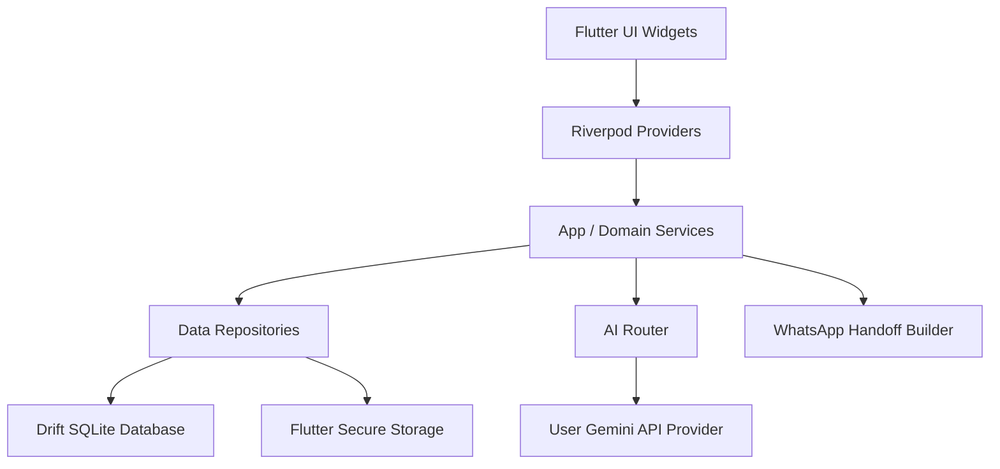

# ARCHITECTURE

## 1. Document Purpose

This document serves as the architectural Single Source of Truth for the `ai_birthday` application. It governs implementation decisions that cannot be safely inferred from reading individual files alone. It explicitly documents boundaries, ownership, critical paths, and strict rules that AI coding agents and human developers must respect to prevent architectural drift.

This document does _not_ outline planned features or hypothetical components; it describes the architecture that actually exists in this repository today.

## 2. Architecture At A Glance

The application follows a clean-architecture-inspired Flutter structure, utilizing Riverpod for dependency injection and state management, and a local SQLite database for offline-first persistence.

**Major Components:**

- **Presentation Layer:** Flutter UI components (e.g., `DashboardScreen`, `MessageStudioScreen`) and Riverpod state controllers.
- **Domain Layer:** Business logic, models (e.g., `Birthday`, `Person`), routing policies (`AiRouter`), and prompt building (`AiPromptBuilder`).
- **Data/Infrastructure Layer:** Repositories (`InMemoryPeopleRepository`, `AppDatabase` via Drift), HTTP API clients (`UserGeminiApiProvider`), and native integrations (`FlutterSecureStorageDriver`).

## 3. System Boundary

| Area                | Responsibility                          | Inside System? | Notes                                                                                     |
| ------------------- | --------------------------------------- | -------------- | ----------------------------------------------------------------------------------------- |
| Flutter Application | Presentation, Routing, App State        | Yes            | `lib/` directory                                                                          |
| Local Database      | Persistence (People, Birthdays, Drafts) | Yes            | Drift/SQLite (`app_database.dart`)                                                        |
| Secrets Storage     | Storing User API Keys securely          | Yes            | `flutter_secure_storage`                                                                  |
| Native Layer        | Android-specific wrappers / bridges     | Yes            | `android/app/src/main/kotlin/`                                                            |
| Authentication      | User Login / Firebase Auth              | No             | **ARCHITECTURAL RISK**: Defined in SSOT but no Firebase implementation found in codebase. |
| AI Inference        | Gemini Cloud API                        | No             | Accessed via user-provided API keys.                                                      |
| Message Delivery    | WhatsApp                                | No             | Uses official Click-to-Chat deep links (`WhatsAppHandoffBuilder`); no automation.         |
| Subscription State  | Google Play Billing / Backend           | No             | Handled externally, simulated locally via `entitlementProvider`.                          |

## 4. QUESTION 01 — WHAT'S IN THE SYSTEM?

### Core Application Layers

- **`app/`**: Application bootstrap, global routing (`appRouter` via `go_router`), and global service injection (`providers.dart`).
- **`core/`**: Shared infrastructure.
  - `AppDatabase`: Owns SQLite schema and persistence.
  - `CredentialStorage`: Owns secure persistence of sensitive keys.
  - `AppLogger`: Standardized, safe logging.
  - `AppFailure`: Typed application errors.
- **`features/`**: Bounded contexts for domain functionality.
  - `ai`: Owns prompt generation, AI routing rules (`AiRouter`), and API integrations (`UserGeminiApiProvider`).
  - `birthdays`: Owns birthday lifecycle management and status tracking.
  - `dashboard`: Owns the home view and aggregated birthday lists.
  - `delivery`: Owns external handoff construction (WhatsApp).
  - `message_studio`: Owns the drafting, reviewing, and editing UI for messages.
  - `people`: Owns recipient profiles and relationship management.
  - `settings`: Owns user configuration UI.
  - `subscription`: Owns entitlement state models.

## 5. QUESTION 02 — WHO'S RESPONSIBLE FOR WHAT?

| Responsibility           | Single Owner              | Location                                                               | Notes                                        |
| ------------------------ | ------------------------- | ---------------------------------------------------------------------- | -------------------------------------------- |
| AI Provider Routing      | `AiRouter`                | `lib/features/ai/domain/ai_router.dart`                                | The only class allowed to decide if AI runs. |
| Gemini API Communication | `UserGeminiApiProvider`   | `lib/features/ai/data/user_gemini_api_provider.dart`                   |                                              |
| Secure Data Storage      | `SecureCredentialStorage` | `lib/core/security/credential_storage.dart`                            | Wraps `flutter_secure_storage`.              |
| Prompt Construction      | `AiPromptBuilder`         | `lib/features/ai/domain/ai_prompt_builder.dart`                        |                                              |
| People Persistence       | `PeopleRepository`        | `lib/features/people/domain/repositories/people_repository.dart`       | (Currently `InMemory` provider fallback)     |
| Birthday Persistence     | `BirthdaysRepository`     | `lib/features/birthdays/domain/repositories/birthdays_repository.dart` | (Currently `InMemory` provider fallback)     |
| Global Navigation        | `appRouter`               | `lib/app/router.dart`                                                  | GoRouter implementation.                     |
| Global State Injection   | `providers.dart`          | `lib/app/providers.dart`                                               | Riverpod root providers.                     |
| Logging                  | `AppLogger`               | `lib/core/logging/app_logger.dart`                                     | Centralized structured logging.              |

**ARCHITECTURAL RISK:** Repositories (`peopleRepositoryProvider`, `birthdaysRepositoryProvider`) are currently wired to `InMemory` implementations in `providers.dart`, despite a robust `AppDatabase` (Drift) schema existing in `core/database/`. This requires human confirmation to complete the migration to SQLite.

## 6. QUESTION 03 — WHY IS IT BUILT THIS WAY?

- **Decision: Riverpod for State Management**
  - **Status:** KNOWN DECISION
  - **Reason:** Provides robust dependency injection, reactive state, and easy mocking for tests.
- **Decision: Drift (SQLite) for Data**
  - **Status:** KNOWN DECISION
  - **Reason:** Offline-first architecture constraint (SSOT §13). Requires robust schema migration and type-safe queries.
- **Decision: User-provided Gemini Credentials**
  - **Status:** KNOWN DECISION
  - **Reason:** The app intentionally avoids spending application-owned Gemini quota.
- **Decision: WhatsApp Click-to-Chat over Automation**
  - **Status:** KNOWN DECISION
  - **Reason:** Banned unofficial automation (SSOT §9). Uses deep links requiring the user to physically press "Send".
- **Decision: No Firebase Implementation**
  - **Status:** UNKNOWN — HUMAN DECISION REQUIRED
  - **Reason:** SSOT mandates Firebase for Sync and Auth, but the codebase entirely lacks Firebase dependencies. It currently operates completely locally/offline.

## 7. QUESTION 04 — WHAT'S ALLOWED TO TOUCH WHAT?

**Allowed Direction:**
UI Widget → Riverpod Provider → Application Service / Repository → Database / External API

**Forbidden Dependencies:**
| Source | Must Not Depend On | Reason |
|---|---|---|
| UI Widgets | `AppDatabase` (Drift) | Abstraction boundary; must use Repositories. |
| UI Widgets | HTTP Clients (`dart:io`, `http`) | Logic leakage; must use Providers/Services. |
| `AiRouter` | Specific UI contexts | UI agnosticism. |
| `UserGeminiApiProvider`| Local Database | Separation of concerns; receives data, does not query it. |

## 8. QUESTION 05 — HOW DOES DATA ACTUALLY MOVE?

### Critical Flow: AI Message Generation

**Trigger:** User taps "Generate with AI" in `MessageStudioScreen`
→ UI calls `_generateWithAi()`
→ `AiRouter.generate()` checks `entitlementProvider`
→ If entitled, `AiRouter` checks `CredentialStorage` for API key.
→ `AiRouter` routes to `UserGeminiApiProvider.generateMessage()`
→ `UserGeminiApiProvider` calls `AiPromptBuilder`
→ Network request to Gemini API (`generativelanguage.googleapis.com`)
→ Result mapped to `AiGenerationResult`
→ UI state updates with new message text.

### Critical Flow: WhatsApp Handoff

**Trigger:** User taps "Send on WhatsApp" in `MessageStudioScreen`
→ UI validates draft body is not empty.
→ UI calls `WhatsAppHandoffBuilder.buildHandoffUrl()`
→ `WhatsAppHandoffBuilder` constructs `https://wa.me/...` URL.
→ UI launches URL via `url_launcher`.
→ User confirms send in dialog.
→ UI calls `BirthdaysRepository.updateBirthdayStatus(completed)`.
→ UI updates and navigates back.

## 9. QUESTION 06 — WHAT CAN NEVER BREAK?

- **INVARIANT:** Entitlement _must_ be validated by `AiRouter` before any AI request is processed.
- **INVARIANT:** The Gemini API key must _never_ be logged, hardcoded, or stored in plaintext databases. It must only live in `CredentialStorage`.
- **INVARIANT:** WhatsApp integration must remain a strict "handoff" (deep link). No automated sending is permitted.
- **INVARIANT:** Exceptions from external APIs must not leak raw error strings to the user; they must be wrapped in `AppFailure`.

## 10. QUESTION 07 — WHERE DOES NEW CODE BELONG?

| New Requirement     | Correct Location                      | Existing Pattern              | Must Not Do                                       |
| ------------------- | ------------------------------------- | ----------------------------- | ------------------------------------------------- |
| New screen/page     | `lib/features/<name>/presentation/`   | Hook into `appRouter`         | Do not create multiple top-level routers.         |
| New local table     | `lib/core/database/app_database.dart` | Drift `Table` classes         | Do not use raw SQLite strings outside Drift.      |
| New AI Provider     | `lib/features/ai/domain/`             | Implement `AiMessageProvider` | Do not bypass `AiRouter`.                         |
| New Delivery Method | `lib/features/delivery/data/`         | Implement handoff builder     | Do not automate the delivery without user review. |

## 11. QUESTION 08 — WHEN DOES THE AGENT STOP AND ASK?

**AI AGENTS MUST DEFAULT TO THE FOLLOWING:**
If completing a task means breaking one of the architectural rules above:

1. STOP before writing code.
2. Name the conflict directly in the prompt.
3. Identify the affected files/modules.
4. Identify the affected architectural boundary.
5. Identify the affected responsibility owner.
6. Explain the smallest change required to resolve the conflict.
7. Do not silently bypass the rule.
8. Do not introduce an alternative architecture without human approval.

**Also STOP and ask when:**

- Modifying `pubspec.yaml` to add Firebase, since it involves a major architectural shift currently missing from the codebase.
- Implementing Gemini Nano natively, as Kotlin/Android structure is present but the bridge is not yet established.
- Connecting Repositories to `AppDatabase` instead of InMemory mocks, as it fundamentally changes state lifecycle.

## 12. AUTHENTICATION & AUTHORIZATION ARCHITECTURE

- **Status:** NOT IMPLEMENTED (Stubbed)
- The codebase relies entirely on local unauthenticated state. SSOT references Firebase Auth, but it is entirely absent from implementation.

## 13. DATA ARCHITECTURE

- **Primary Database:** Drift / SQLite (`AppDatabase`).
- **Data Access:** Repositories (e.g., `BirthdaysRepository`).
- **NOTE:** The implementation currently injects `InMemory` repositories via Riverpod (`providers.dart`), bypassing Drift at runtime. Drift schema exists but is disconnected from the UI.

## 14. API ARCHITECTURE

- **External Client:** `UserGeminiApiProvider`.
- **Error Handling:** Centralized via `AppFailure.providerError` and `AppFailure.credentialInvalid`.
- **Rate Limiting/Auth:** Handled explicitly by catching 429/401 HTTP codes.

## 15. FRONTEND ARCHITECTURE

- **Framework:** Flutter.
- **Routing:** `go_router` utilizing `StatefulShellRoute` for bottom navigation (Dashboard, People, Settings).
- **State Management:** Riverpod (`ConsumerWidget`, `StreamProvider`).
- **Global Theme:** `AppTheme`.

## 16. BACKEND ARCHITECTURE

- **Status:** NOT APPLICABLE
- Entirely local client application.

## 17. EXTERNAL SYSTEMS & INTEGRATIONS

**System: Google Gemini API**

- **Purpose:** AI Draft Generation.
- **Owner:** `UserGeminiApiProvider`.
- **Authentication:** User-supplied API key via URL param.
- **Failure Behavior:** Maps specific HTTP codes to `AppFailure`.

**System: WhatsApp**

- **Purpose:** Message Delivery.
- **Owner:** `WhatsAppHandoffBuilder`.
- **Integration:** Deep links (`wa.me`).

## 18. ASYNCHRONOUS ARCHITECTURE

- Heavily relies on Dart Futures/Streams and Riverpod `AsyncValue` for UI state updates. No complex background workers or queues are currently implemented.

## 19. ERROR & FAILURE ARCHITECTURE

- **Canonical Model:** `AppFailure` (Exception subclass).
- **Rule:** Catch generic exceptions at the boundaries (e.g., in `UserGeminiApiProvider`), log them via `AppLogger`, and throw a sanitized `AppFailure` for the UI to display.

## 20. SECURITY ARCHITECTURE

- **Secrets:** Handled via `CredentialStorage` backed by `flutter_secure_storage`.
- **Logging Restrictions:** High-frequency/sensitive params must not be logged. Raw exception strings from HTTP requests are logged internally but sanitized before throwing to the UI.

## 21. OBSERVABILITY & OPERATIONS

- **Logging:** `AppLogger` (`ConsoleAppLogger`).

## 22. TESTING ARCHITECTURE

- Testing is handled via standard Flutter `test` (unit) and `flutter_test` (widget).

## 23. DEPLOYMENT & RUNTIME ARCHITECTURE

- Standard Flutter Android deployment. No complex CI/CD found in the tree natively.

## 24. ARCHITECTURAL RISKS & DRIFT

**CRITICAL**

- **Issue:** Missing Gemini Nano Kotlin Bridge.
- **Evidence:** `android/app/src/main/kotlin/` only contains `MainActivity.kt`.
- **Current State:** SSOT dictates Nano is a fallback, but no platform channels or native Kotlin code exist to support it.

**HIGH**

- **Issue:** Repositories use `InMemory` instead of `Drift`.
- **Evidence:** `providers.dart` injects `InMemoryPeopleRepository` instead of utilizing `AppDatabase`.
- **Current State:** Data does not persist across application restarts.

**HIGH**

- **Issue:** Missing Firebase Sync/Auth.
- **Evidence:** Missing from `pubspec.yaml` and code.
- **Current State:** Code is fully offline.

## 25. ARCHITECTURAL INVARIANTS

- **INVARIANT-001:** `AiRouter` is the absolute gatekeeper for AI requests. UI must never talk to `UserGeminiApiProvider` directly.
- **INVARIANT-002:** API Keys must only be read from `CredentialStorage` at the exact moment of request and immediately discarded from memory.
- **INVARIANT-003:** WhatsApp must always use Click-to-Chat; no scraping or accessibility-service automation is allowed.

## 26. DECISION REGISTER

| ID      | Decision               | Reason                                 | Trade-off                 | Revisit When                           |
| ------- | ---------------------- | -------------------------------------- | ------------------------- | -------------------------------------- |
| ADR-001 | Use Riverpod for State | Best fit for declarative Flutter apps. | Slight learning curve.    | N/A                                    |
| ADR-002 | Use Drift (SQLite)     | Robust local persistence per SSOT.     | Requires code generation. | N/A                                    |
| ADR-003 | User Gemini API Key    | Avoids app spending its own quota.     | Friction for users.       | If Nano becomes universally available. |

## 27. QUICK REFERENCE FOR AI CODING AGENTS

**Before changing code:**

1. Identify the responsibility involved.
2. Identify its owner.
3. Identify the architectural layer.
4. Identify the existing extension point.
5. Check dependency direction.
6. Check relevant invariants.
7. Check critical data flow.
8. Check whether the requested change conflicts with a rule.

**Before adding new code - Ask:**

- Does this capability already exist?
- Who owns it?
- Where does similar code already live?
- What is the existing extension point?
- Am I creating a second implementation?
- Am I crossing a forbidden boundary?
- Am I introducing a new architectural pattern?

**STOP CONDITIONS**
Explicitly stop and request human input when:

- Ownership is ambiguous (e.g., adding Firebase Auth vs keeping it local).
- Architecture conflicts with the request (e.g., automating WhatsApp).
- Implementation and documentation disagree materially (e.g., Native Kotlin Nano code is requested but the bridge doesn't exist).
- A security invariant would be violated (e.g., logging a user API key).
- A new infrastructure dependency is required.

**DO NOT:**

- Do not automate WhatsApp.
- Do not bypass `AiRouter` for AI requests.
- Do not hardcode API keys.
- Do not query Drift directly from UI Widgets.

## 28. EVIDENCE & CONFIDENCE

- **CONFIRMED:** Riverpod State Management (`lib/app/providers.dart`).
- **CONFIRMED:** Drift Database Schema (`lib/core/database/app_database.dart`).
- **CONFIRMED:** `AiRouter` policy (`lib/features/ai/domain/ai_router.dart`).
- **CONFIRMED:** WhatsApp Handoff via `url_launcher` (`lib/features/message_studio/presentation/message_studio_screen.dart`).
- **INFERRED:** Missing Firebase / Native Nano. (Checked `pubspec.yaml` and `android/` directory; confirmed absent).
