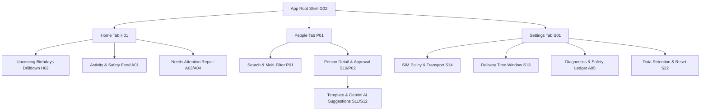

# Birthday Autopilot — User Flows & Stitch MCP Screen Mapping

**Stitch MCP Project**: `projects/3119246805913699827` (`Birthday Autopilot App`)  
**Design System Asset**: `assets/18258546519984416487` (`Birthday Autopilot Design System`)  
**Generation Model**: `GEMINI_3_1_PRO`  
**Authority**: `PROJECT_ABOUT.md` & `stitch/SCREEN_MANIFEST.md`

---

## 1. Global Navigation Architecture

The app uses a strict **3-tab bottom navigation bar** as its root shell. All primary sections are accessible with one tap, while deep task flows (e.g., Onboarding, Contact Approval, Repair, Settings sub-panels) present as full-screen stacks or modal bottom sheets with unambiguous back/dismiss buttons.

---

## 2. Core User Flows & Journeys

### 2.1 First-Time Setup & Onboarding Flow

1. **Welcome & Compatibility (S01)**: System capability checks (Telephony, Google Play Services, battery optimization exemptions).
2. **Google Account Connection (S02)**: Native Google Sign-In button creating Firebase Identity and requesting read-only Google Contacts access.
3. **Contacts Authorization & Sync (S04 -> S06)**: In-context permission disclosure and sync progress summary.
4. **Initial Recipient Selection (S07 -> S10)**: Multi-select contact picker (all contacts start _Off_ by default) + template assignment.
5. **Background & SIM Verification (S14 -> S19)**: SIM card confirmation and background battery optimization exemption guide.
6. **Activation (S20 -> S21)**: Final review summary -> Enable Global Automation.

### 2.2 Routine Daily / Weekly Monitoring Flow

1. User opens app -> Lands on **Home (H01)** (`projects/3119246805913699827/sessions/7759590777852409302`).
2. Glance at **Status Hero Card**:
   - `Green`: _"Automation Active — Sending from this phone"_.
   - `Amber`: _"Attention Required — 1 issue needs repair"_.
   - `Neutral`: _"Automation Paused"_.
3. Review **Upcoming Queue (H02)**: Next 7 days of upcoming birthdays with contact initials, scheduled delivery time, and template snippet.
4. Tap any card to preview exact SMS payload, SIM used, and segment count (**Approved Message Preview H03**).

### 2.3 Contact Customization & Gemini AI Flow

1. User navigates to **People (P01)** (`projects/3119246805913699827/sessions/846231095308439648`) -> Selects a contact.
2. Opens **Person Detail & Approval (P02 / S10)** (`projects/3119246805913699827/sessions/8661775396951016161`).
3. Taps **Edit Template (S11)** -> Taps **Gemini Suggestions (S12)**.
4. Selects tone (_Warm_, _Casual_, _Professional_, _Short_) -> Tap _Generate_ -> View 3 candidate variations (zero PII sent).
5. Select candidate -> Real-time Unicode / SMS segment calculation -> Tap **Approve Person**.

### 2.4 Issue Detection & Repair Flow

1. Notification or Home badge flags **Needs Your Attention (A03)**.
2. User taps issue item -> Navigates to **Issue Repair (A04)**.
3. Plain-language explanation + one-tap action (resolve ambiguous phone number, confirm leap-year birthday rule, or fix background permission).
4. System automatically re-checks status and clears the warning.

---

## 3. Screen Mapping to Stitch MCP & Source Code

| Screen ID | Screen Title                     | Stitch MCP Design Reference (Gemini 3.1 Pro)                | React Native Source File                             |
| :-------- | :------------------------------- | :---------------------------------------------------------- | :--------------------------------------------------- |
| **G01**   | Secure Startup & Ledger Recovery | `projects/3119246805913699827`                              | `src/app/NativeAppBoundary.tsx`                      |
| **G02**   | Main Shell & 3-Tab Navigator     | `projects/3119246805913699827/sessions/7759590777852409302` | `src/features/live/LiveAppShell.tsx`                 |
| **S01**   | Welcome & Compatibility          | `projects/3119246805913699827`                              | `src/features/live/LiveSetupScreen.tsx`              |
| **S02**   | Connect with Google              | `projects/3119246805913699827`                              | `src/features/live/LiveSetupScreen.tsx`              |
| **S04**   | Contacts Permission Disclosure   | `projects/3119246805913699827`                              | `src/features/setup/SetupFlow.tsx`                   |
| **S06**   | First Contacts Sync              | `projects/3119246805913699827`                              | `src/features/setup/ContactsSyncState.tsx`           |
| **S07**   | Choose People                    | `projects/3119246805913699827`                              | `src/features/people/ChoosePeopleScreen.tsx`         |
| **S10**   | Approve Person                   | `projects/3119246805913699827/sessions/8661775396951016161` | `src/features/people/ApprovePersonScreen.tsx`        |
| **S11**   | Template Editor                  | `projects/3119246805913699827`                              | `src/features/people/TemplateEditorScreen.tsx`       |
| **S12**   | Gemini Suggestions               | `projects/3119246805913699827`                              | `src/features/people/GeminiSuggestionsModal.tsx`     |
| **S13**   | Delivery Window Settings         | `projects/3119246805913699827`                              | `src/features/settings/DeliveryWindowScreen.tsx`     |
| **S14**   | SIM Policy Configuration         | `projects/3119246805913699827`                              | `src/features/settings/SimPolicyScreen.tsx`          |
| **S19**   | Background Readiness             | `projects/3119246805913699827`                              | `src/features/setup/BackgroundReadinessScreen.tsx`   |
| **S20**   | Final Activation Review          | `projects/3119246805913699827`                              | `src/features/setup/FinalActivationReviewScreen.tsx` |
| **H01**   | Home Dashboard                   | `projects/3119246805913699827/sessions/7759590777852409302` | `src/features/home/HomeScreen.tsx`                   |
| **H02**   | Upcoming Birthdays Queue         | `projects/3119246805913699827`                              | `src/features/home/UpcomingBirthdaysScreen.tsx`      |
| **H03**   | Approved Message Preview         | `projects/3119246805913699827`                              | `src/features/home/ApprovedMessagePreviewModal.tsx`  |
| **P01**   | People Directory & Filter        | `projects/3119246805913699827/sessions/846231095308439648`  | `src/features/people/PeopleScreen.tsx`               |
| **P02**   | Person Detail Card               | `projects/3119246805913699827/sessions/8661775396951016161` | `src/features/people/PersonDetailScreen.tsx`         |
| **A01**   | Activity & Audit Feed            | `projects/3119246805913699827`                              | `src/features/activity/ActivityScreen.tsx`           |
| **A03**   | Needs Your Attention             | `projects/3119246805913699827`                              | `src/features/activity/NeedsAttentionScreen.tsx`     |
| **A04**   | Issue Repair                     | `projects/3119246805913699827`                              | `src/features/activity/IssueRepairScreen.tsx`        |
| **A05**   | Diagnostics & Safety Ledger      | `projects/3119246805913699827`                              | `src/features/activity/DiagnosticsScreen.tsx`        |
