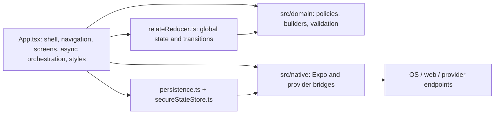

# RelateAI Whole-Codebase Improvement Assessment

**Assessment date:** 10 July 2026  
**Repository surface assessed:** the active React Native/Expo replacement, its domain and native adapters, configuration, tests, generated-native plugin, and current documentation  
**Decision:** **Not ready for a production release**

This document is an implementation-neutral improvement plan. It does not change the product's established review-first behavior or its current visual design. Recommendations that affect internals use compatibility adapters, migrations, or feature flags so existing user data, public deep links, widget routes, and approved interaction semantics can remain valid.

## 1. Executive Summary

RelateAI has a promising domain foundation: review-first message handling, explicit privacy controls, encrypted portable backups, safe manual channel handoff, permission minimization, localized copy, and 348 passing automated tests. The pure functions under `src/domain/` are generally cohesive and well tested. Android permissions explicitly block direct SMS, call-log, exact-alarm, and AccessibilityService capabilities, which is a strong policy baseline.

The active application is nevertheless not production-ready. Seven release-blocking concerns dominate the assessment:

1. A clean checkout cannot reliably compile because `src/App.tsx:3` statically imports `reports/react-native-release-evidence.json`, while `/reports/` is ignored and the file is not tracked.
2. Fresh installs and the production Settings surface contain real-looking demo relationships and a “Reset demo data” path. This conflicts with the release checklist and makes personal-data state ambiguous.
3. Private relationship state silently falls back from SecureStore to plaintext AsyncStorage on any SecureStore error, including on web.
4. The Expo 57 Contacts and Calendar adapters import legacy `*Async` methods from package root entry points whose installed implementations explicitly throw at runtime.
5. Birthdays and anniversaries are stored as one absolute timestamp without a recurrence model. A birthday without a year becomes a one-time event in the current year and eventually disappears from future planning.
6. “Clear local data” and backup restore update memory before durable storage and native side effects are verified. Data or scheduled artifacts can survive, reappear, or diverge.
7. Provider email has no idempotency key or “delivery unknown” state. A timeout after a successful remote send can lead to a duplicate retry.

Several high-impact implementation gaps sit immediately behind those blockers: Google sync is a UI mode rather than a completed provider integration; “fully auto” does not have a durable background execution pipeline; notification reconciliation is user-triggered; navigation is a hand-written screen flag with incorrect back behavior; React Native Web confirmations use an `Alert.alert` implementation that is effectively inert; large lists render through `ScrollView` and `.map`; and most native/UI tests assert source text rather than executable behavior.

The safest path is not a rewrite. First close the release and privacy blockers, then introduce a repository boundary, deterministic actions, structured navigation, recurring occasion semantics, and runtime integration tests behind the current UI. Preserve current colors, typography, labels, review gates, safe deep-link allowlist, and manual handoff rules while these internals change.

### Assessment method and evidence

- Inspected all active TypeScript/TSX, Expo configuration, the config plugin, package scripts, tests, and operational/security/architecture documents.
- The active codebase contains approximately 37,000 lines across 137 TypeScript/TSX source and test files; `src/App.tsx` alone is 6,557 lines.
- On Node 24.18.0: `npm run typecheck` passed; all **348 tests in 66 suites** passed; `npm audit --audit-level=moderate` reported zero known vulnerabilities; Expo's offline dependency check reported dependencies up to date.
- The same `npm test` command fails immediately on Node 20.19.6 and Node 22.23.0 because `--test-isolation=none` is unsupported, while no Node version is pinned.
- The local passes depend on an ignored generated report already present in this working directory. They do not demonstrate a clean-clone build.
- No signed Android/iOS build, physical-device smoke result, store-submission result, native backup/restore result, or end-to-end browser suite is recorded. The report therefore does not treat source-contract tests as device evidence.

### Severity and effort definitions

| Rating | Meaning |
|---|---|
| Critical | Release blocker, credible privacy/data-loss risk, or failure of a defining product behavior |
| High | Major functional, reliability, compatibility, or maintainability gap that should be addressed before broad release |
| Medium | Material quality or scale limitation that can follow the release blockers with a controlled workaround |
| Low | Hygiene or consistency improvement with limited immediate user impact |

Effort is an engineering estimate, not elapsed calendar time: **XS** (<1 engineer-day), **S** (1–3 days), **M** (about 1–2 weeks), **L** (about 3–6 weeks), and **XL** (multi-phase or >6 weeks), including proportional tests and documentation.

## 2. Overall Project Health Assessment

### Health scorecard

| Area | Assessment | Evidence-based rationale |
|---|---:|---|
| Product completeness | 4/10 | Core review flows exist, but recurrence, provider identity/sync, durable automation, event lifecycle management, and production backends are incomplete. |
| Architecture | 5/10 | Pure domain modules are a good seam; the app shell, reducer, persistence orchestration, and navigation remain highly centralized. |
| Code quality | 6/10 | TypeScript and extensive pure-function tests are strengths; deterministic boundaries, runtime schemas, component boundaries, and tooling are weak. |
| Security and privacy | 4/10 | Strong permission policy and backup cryptography are offset by plaintext fallback, incomplete deletion semantics, provider trust gaps, and session-lock behavior. |
| Reliability and data integrity | 4/10 | Reconciliation planners exist, but saves can race, restore/delete are not transactional, imported identities can merge incorrectly, and delivery lacks idempotency. |
| Performance and scale | 3/10 | No list virtualization or incremental persistence; global updates can rewrite and re-inspect the full dataset. The large-data test covers only pure builders. |
| Accessibility | 5/10 | Labels, roles, and selected/checked states are present; touch size, focus, announcements, large text, keyboard, and reduced-motion behavior are unverified. |
| Compatibility | 4/10 | Android/iOS/web are declared, but web dialogs fail, native behavior is source-tested, and the custom config plugin is not compile-tested. |
| Developer/release experience | 4/10 | Typecheck and tests exist, but there is no CI, lint/format/coverage gate, Node pin, clean-clone proof, or trustworthy evidence provenance. |
| Documentation | 6/10 | Documentation is unusually broad, but active React Native guidance still conflicts with legacy Kotlin instructions and the environment template. |

**Overall health: 4.5/10 — a substantial prototype/implementation shell with good domain intent, not a production release candidate.** This score is a diagnostic summary rather than a business KPI. The current test pass should be retained as a regression baseline while closing the gaps below.

### Strengths to preserve

- Review-first approval remains the default; direct SMS and inaccessible automation techniques are explicitly prohibited.
- AI request construction excludes private memories and direct contact routing data, bounds feedback, validates returned language/content, and has local-template recovery.
- Deep links, launcher shortcuts, notifications, and the widget are designed around safe navigation rather than hidden execution.
- Calendar and notification planners attempt idempotent reconciliation rather than deleting unrelated device data.
- Backup encryption uses AES-GCM with PBKDF2-SHA-256, random salt/IV, passphrase validation, versions, and tamper tests.
- Analytics exports and provider observations are deliberately redacted.
- Domain functions are independently testable, and the suite covers many adverse and privacy cases.
- Three locale catalogs have parity checks and locale-aware date/currency formatting.

### Release gates

Production release should remain blocked until all of these are true:

- REL-01, DATA-01, SEC-01, NATIVE-01, CORE-01, DATA-02, and NET-01 are closed with runtime tests.
- A clean checkout installs, type-checks, tests, prebuilds, and compiles without a generated artifact being present first.
- Signed Android and iOS builds complete the documented physical-device smoke matrix.
- Web has a working, keyboard-accessible confirmation dialog or web is explicitly removed from supported release surfaces.
- Product language accurately distinguishes manual review, scheduled reminders, provider email, and any genuinely durable automatic execution.
- Release evidence is bound to the exact commit and produced by commands that actually ran.

## 3. Architecture Review

### Current architecture

The domain layer is the strongest architectural element. It should remain platform-independent. The main weakness is that `App.tsx` is simultaneously the composition root, navigation controller, screen catalog, async use-case layer, persistence trigger, localization adapter, and design-system implementation. The reducer also performs time/ID generation and broad cross-feature side effects in a single 2,333-line switch. This prevents independent screen testing, creates broad re-render and persistence blast radii, and makes future sync/conflict handling risky.

The target should use four explicit boundaries while retaining the existing UI:

1. **Presentation:** screen components, reusable controls, localized view models, navigation routes.
2. **Application:** use cases/commands that inject clock, ID generator, network clients, permission service, scheduler, and repository.
3. **Domain:** the current pure policies plus recurring-occasion semantics and structured result codes.
4. **Infrastructure:** a versioned local repository, secure key management, Expo/native adapters, provider API clients, and optional sync.

### ARCH-01 — Monolithic application shell and screen catalog

- **Description:** `src/App.tsx` is 6,557 lines and contains the root shell, custom navigation, every primary and detail screen, dozens of local workflow states, async provider/native orchestration, localization mapping helpers, and the full stylesheet. `MoreScreen` alone owns many unrelated operational panels and local drafts.
- **Root cause:** The React Native replacement was assembled through one composition file to preserve feature parity quickly, without enforcing screen/module ownership boundaries.
- **Impact:** Small changes have a large regression surface; screens cannot be mounted or profiled independently; global state updates re-evaluate unrelated reports; ownership and review become difficult.
- **Severity:** High.
- **Recommended improvement:** Extract the existing JSX without redesign into `src/app`, `src/screens/<feature>`, and `src/ui` modules. Introduce screen-level presenters/hooks and a typed navigation adapter. Keep `App.tsx` as a small composition root and retain stable domain/native interfaces during the move.
- **Expected benefits:** Smaller reviews, targeted component tests, isolated rendering, clearer dependency direction, and safer parallel feature work.
- **Estimated effort:** L, delivered incrementally screen by screen.
- **Potential risks:** Moving JSX can change hook lifetimes or transient state. Use characterization tests and migrate one route at a time behind the same state/actions.

### ARCH-02 — Impure and oversized reducer

- **Description:** `src/state/relateReducer.ts` contains the global action union and a very large switch. It calls `new Date()` and `Date.now()` internally for timestamps and IDs (for example activity, message, memory, gift, blackout, and backup records).
- **Root cause:** Command orchestration, entity construction, and deterministic state transition logic were combined in a single reducer.
- **Impact:** The same action and state can produce different output; replay, debugging, migration, conflict resolution, and deterministic tests are harder; millisecond-based IDs can collide.
- **Severity:** High.
- **Recommended improvement:** Move entity construction to application commands that inject `Clock` and `IdGenerator`; make reducer actions carry final IDs/timestamps; split transition handlers by aggregate while preserving a compatibility root reducer.
- **Expected benefits:** Deterministic replay/tests, collision-resistant IDs, clearer invariants, and a foundation for queued persistence and optional sync.
- **Estimated effort:** M–L.
- **Potential risks:** Changing action payloads can break tests and deep internal call sites. Add action creators/adapters first and migrate cases in bounded batches.

### ARCH-03 — No application-service boundary for multi-system operations

- **Description:** Operations such as send email, clear data, restore backup, import contacts, schedule reminders, and calendar export are coordinated directly in React handlers through sequential dispatches and `Alert.alert` calls.
- **Root cause:** UI handlers became the transaction boundary because there is no command/use-case layer returning typed progress and outcomes.
- **Impact:** Durable state, OS artifacts, network outcomes, and UI feedback can disagree; operations cannot be retried or tested as a unit; error and cancellation handling is duplicated.
- **Severity:** High.
- **Recommended improvement:** Add use cases such as `ClearLocalData`, `RestoreBackup`, `SendProviderEmail`, `ImportContacts`, and `ReconcileReminders`. Each should return a typed state machine (`idle/running/succeeded/failed/unknown`) and define commit/compensation behavior. The UI should only render these outcomes.
- **Expected benefits:** Transactional semantics, reusable runtime tests, accurate progress feedback, controlled retries, and reduced screen complexity.
- **Estimated effort:** L, starting with clear/restore and provider email.
- **Potential risks:** Over-generalized service layers can add ceremony. Keep each use case focused and derive interfaces from current behavior.

### ARCH-04 — Generated release evidence coupled to runtime UI

- **Description:** Setup Check data is compiled into the app by importing a generated JSON report. A development/release artifact therefore becomes a runtime dependency.
- **Root cause:** Build-time evidence was reused as application state instead of being exposed through a stable, checked-in capability description or an optional build metadata injection.
- **Impact:** Clean builds fail, stale local evidence can be displayed as current, and release tooling concerns leak into product code.
- **Severity:** Critical; tracked as release blocker **REL-01** in Sections 11 and 13.
- **Recommended improvement:** Give Setup Check a checked-in safe default and compile-time feature/capability metadata. Keep evidence external to the app; if display is required, inject a sanitized, commit-bound summary during an explicit release build with a stale/missing state.
- **Expected benefits:** Reproducible builds, honest diagnostics, and separation of release operations from runtime behavior.
- **Estimated effort:** S.
- **Potential risks:** Setup Check may lose useful local details. Preserve them in developer tooling or an optional debug-only adapter.

## 4. Code Quality Analysis

The code uses TypeScript consistently and contains many useful pure functions. Naming is generally domain-oriented, tests are readable, and risky flows often use discriminated results. Quality concerns are concentrated in state construction, runtime validation, localization boundaries, and component organization rather than syntax.

### CODE-01 — Brittle string-based localization of domain results

- **Description:** Domain and reducer code emits English display text for activity, setup, preparation, and diagnostics. `App.tsx` then translates some results by exact string or regular-expression matching. New or slightly changed domain copy can silently fall back to English.
- **Root cause:** User-facing strings were embedded in domain results before the multi-locale UI boundary was established.
- **Impact:** Hindi/Hinglish experiences can become partially English; punctuation changes break mapping; translators cannot reliably discover or validate dynamic messages.
- **Severity:** Medium.
- **Recommended improvement:** Return structured message codes and typed parameters from domain/application layers, translate only at the presentation boundary, and split locale catalogs by feature. Add an extraction/parity check and a pseudolocale.
- **Expected benefits:** Complete localization, safer copy changes, smaller catalogs, and compile-time validation of parameters.
- **Estimated effort:** M–L.
- **Potential risks:** Historical activity text and persisted diagnostics need backward-compatible rendering. Support legacy raw text as a migration fallback.

### CODE-02 — Runtime data is only shallowly validated

- **Description:** Persistence normalization checks top-level object/array shapes but accepts array members without validating required fields or relationships. Backup envelope parsing validates only selected fields before expensive decode/decrypt and state deserialization.
- **Root cause:** TypeScript types are being treated as runtime schemas for data that originates from storage and user-selected files.
- **Impact:** Well-formed JSON with malformed records can crash views, corrupt derived reports, reference missing entities, or consume excessive resources.
- **Severity:** High.
- **Recommended improvement:** Define versioned runtime schemas for every persisted aggregate and backup envelope. Validate sizes and scalar bounds before allocation/crypto, validate referential integrity after parse, and migrate into a canonical state with explicit rejected-record reporting.
- **Expected benefits:** Predictable recovery, safer imports, actionable diagnostics, and reliable migrations.
- **Estimated effort:** M.
- **Potential risks:** Strict validation could reject recoverable historical data. Use version-specific tolerant decoders and preserve a redacted recovery report.

### CODE-03 — Entity identity and temporal semantics are inconsistent

- **Description:** Several IDs use `Date.now()` plus collection length, contact/calendar IDs derive from source strings, and date comparisons mix UTC slices with local `toDateString()`/local setters.
- **Root cause:** Identity and date handling grew feature by feature without central `Id`, `LocalDate`, `Instant`, and time-zone policies.
- **Impact:** IDs can collide, events can shift around time-zone boundaries, tests depend on ambient time, and future sync conflict resolution becomes ambiguous.
- **Severity:** High.
- **Recommended improvement:** Use collision-resistant IDs; distinguish `LocalDate` for occasions from `Instant` for activity/delivery; centralize parsing/formatting/next-occurrence logic; inject clocks into all time-dependent builders.
- **Expected benefits:** Deterministic behavior across time zones and DST, stable imports, and sync-ready identifiers.
- **Estimated effort:** L, coordinated with CORE-01.
- **Potential risks:** Persisted IDs/dates cannot be rewritten casually. Add new fields and migrations while retaining legacy identifiers as aliases.

### CODE-04 — Missing automated style and static-quality gates

- **Description:** There is no lint script, formatter configuration, import-boundary enforcement, dead-code check, or complexity/size guard. Typecheck is the only static gate.
- **Root cause:** Migration effort prioritized behavior and source-contract tests over a complete JavaScript/TypeScript toolchain.
- **Impact:** Large files and dependency-direction violations grow unnoticed; formatting/import drift increases review cost; unsafe patterns require manual discovery.
- **Severity:** Medium.
- **Recommended improvement:** Add a pinned formatter and ESLint configuration appropriate for Expo/React/TypeScript, architectural import rules, and focused rules for floating promises, hooks, unhandled catches, accessibility, and file-size exceptions. Ratchet existing debt rather than mass-reformatting unrelated code.
- **Expected benefits:** Faster reviews, earlier defects, consistent modules, and enforceable target architecture.
- **Estimated effort:** S–M.
- **Potential risks:** A broad initial lint rollout can create noisy churn. Establish a baseline and enforce only changed files while burning it down.

## 5. Performance Analysis

The current performance test measures selected pure builders over roughly 900 synthetic contacts and allows five seconds. It does not render React Native views, exercise SecureStore, traverse native bridges, measure memory, or run on a low-tier device. The most serious bottleneck is likely persistence rather than the pure selectors.

### PERF-01 — Unvirtualized primary lists and month content

- **Description:** Contacts, events, messages, activity, setup panels, and many sublists render with `.map()` inside a root `ScrollView`; the codebase does not use `FlatList`, `SectionList`, or `VirtualizedList`.
- **Root cause:** Screens were built as a single scrollable implementation shell and the large-data contract only benchmarks domain builders.
- **Impact:** Render time, memory use, reconciliation work, and accessibility traversal grow with the entire dataset; lower-end devices can stutter or terminate the app.
- **Severity:** High.
- **Recommended improvement:** Convert unbounded collections to virtualized lists with stable keys, memoized rows, appropriate batch/window settings, and list headers for existing controls. Profile before tuning. Preserve card styling and layout exactly.
- **Expected benefits:** Bounded mounted views, faster first content, lower memory use, and smoother scrolling. React Native's [FlatList guidance](https://reactnative.dev/docs/optimizing-flatlist-configuration) documents the responsiveness/memory trade-offs to measure.
- **Estimated effort:** M.
- **Potential risks:** Nested scrolling, row local state, and focus retention can regress. Migrate one screen at a time and add scroll/focus restoration tests.

### PERF-02 — Full-state persistence and verification on every change

- **Description:** After hydration, each state change serializes the full `AppState`, writes all normalized singleton and collection entries, then reads the persisted entries again through `inspectPersistedState`. There is no debounce, serialized write queue, or cancellation of obsolete saves.
- **Root cause:** Persistence is driven by a single React effect with snapshot comparison rather than repository-level change tracking.
- **Impact:** Typing into globally stored settings can trigger repeated secure writes; concurrent saves may complete out of order; I/O, crypto/keychain calls, battery use, and latency scale with total data rather than the changed entity.
- **Severity:** High; the ordered-write safeguard is a precondition for broad beta scale.
- **Recommended improvement:** Immediately serialize saves through a monotonic queue and debounce noncritical edits; then introduce entity-level repository transactions, dirty-set persistence, checkpointing, and health inspection on startup/explicit diagnostics rather than every action.
- **Expected benefits:** Ordered durable state, dramatically fewer writes, responsive typing, longer storage life, and scalable datasets.
- **Estimated effort:** S for the queue/debounce safeguard; L for an incremental repository.
- **Potential risks:** Debouncing can lose the latest edit on termination. Flush on app background and critical commands, and test crash points with a journal/version marker.

### PERF-03 — Broad recomputation and re-render scope

- **Description:** A single root reducer feeds every screen. `MoreScreen` constructs setup, analytics, privacy, storage, activity, and provider reports during render; rows and callbacks are not memoized; contact search is written into global persisted state.
- **Root cause:** There are no feature selectors, scoped stores, memoized presenters, or distinction between transient UI state and durable domain state.
- **Impact:** Any unrelated action can re-run large builders and recreate extensive JSX. Search/typing can cause both global render work and persistence I/O.
- **Severity:** Medium.
- **Recommended improvement:** Keep transient query/filter/draft state local, introduce memoized feature selectors keyed by relevant revisions, memoize expensive rows/presenters after profiling, and split screens so inactive features are not evaluated.
- **Expected benefits:** Lower JavaScript-frame time, fewer renders and writes, clearer state ownership, and easier performance budgets.
- **Estimated effort:** M.
- **Potential risks:** Incorrect memo dependencies can show stale data. Prefer explicit selector inputs and behavioral tests over blanket `useMemo`/`React.memo` usage.

### PERF-04 — Unbounded histories and SecureStore entry growth

- **Description:** Activity and message histories have no retention/archive policy. Normalized persistence creates one or more SecureStore keys per entry and chunks larger records into approximately 1.4 KB values.
- **Root cause:** SecureStore is used as a general-purpose database and the domain has no lifecycle policy for operational history.
- **Impact:** Key count, startup reads, save time, backup size, diagnostics cost, and failure probability grow indefinitely.
- **Severity:** High.
- **Recommended improvement:** Store encrypted data in a transactional local database/file store with a key held in platform secure storage; add user-visible retention/export rules for activity and delivery metadata; paginate history and compact old operational records without deleting meaningful relationship history silently.
- **Expected benefits:** Predictable scale, efficient queries/migrations, fewer keychain operations, and transparent data lifecycle.
- **Estimated effort:** L–XL.
- **Potential risks:** Storage migration is high risk. Build dual-read/single-write migration, verify counts/checksums, keep a rollback backup, and test interruption at every phase.

## 6. Security Review

Security intent is stronger than implementation maturity. Permission minimization, request redaction, review gates, HTTPS enforcement, backup encryption, and safe notification/widget payloads should be preserved. The following issues affect confidentiality, deletion guarantees, authentication, and provider trust.

### SEC-01 — Silent plaintext fallback for private relationship data

- **Description:** `src/native/secureStateStore.ts:8-33` catches any SecureStore read/write failure and silently reads or writes `fallback.<key>` in AsyncStorage. On web, this is the normal path. The store interface cannot report which backend protected a value.
- **Root cause:** Cross-platform usability was prioritized through an unconditional fallback, while the UI comment claiming that fallback status is surfaced is not implemented.
- **Impact:** Contacts, private memories, message bodies, routes, gifts, and activity can be stored unencrypted without informed consent. A transient native error can change the protection level silently. This conflicts with [OWASP MASVS-STORAGE-1](https://mas.owasp.org/MASVS/controls/MASVS-STORAGE-1/).
- **Severity:** Critical.
- **Recommended improvement:** Fail closed for sensitive state when the encrypted backend is unavailable. Use envelope encryption for a database/file store with a non-exportable key in Android Keystore/iOS Keychain. If web remains supported, require a documented encrypted-web-storage design or clearly support a non-sensitive demo mode only. Expose verified backend/protection state in Setup Check without leaking data.
- **Expected benefits:** Truthful privacy guarantees, consistent protection across failures, safer web positioning, and auditable storage behavior.
- **Estimated effort:** L.
- **Potential risks:** Users on unsupported environments can be locked out of existing fallback data. Detect and migrate it only after explicit confirmation and verified encrypted write, then securely remove the fallback.

### SEC-02 — Biometric session does not relock on background or timeout

- **Description:** Successful authentication sets `sessionUnlocked` to `true`; no React Native `AppState` listener, inactivity deadline, or protected-action reauthentication resets it when the app backgrounds.
- **Root cause:** Biometric support is modeled as a one-time in-memory screen gate rather than a session policy.
- **Impact:** A user who returns to an unlocked process can access private notes without reauthentication, including after device sharing or task switching.
- **Severity:** High.
- **Recommended improvement:** Define a documented lock policy: reset on background, optionally allow a short user-configurable grace period, and require fresh authentication for backup export/restore and destructive data operations. Never imply that biometric lock encrypts data by itself.
- **Expected benefits:** Meaningful session privacy and predictable platform behavior.
- **Estimated effort:** S–M.
- **Potential risks:** Aggressive relocking can interrupt share sheets and permission dialogs. Track external-system transitions and test grace-period behavior on both platforms.

### SEC-03 — App permission records can diverge from operating-system truth

- **Description:** The UI can dispatch “Granted” or “Denied” decisions as application state; checks are updated opportunistically from exception text rather than consistently querying OS permission APIs on focus. Settings changes outside the app can remain stale.
- **Root cause:** Permission preference/history and current device authorization are represented by the same state without a capability service.
- **Impact:** Setup Check can report readiness that the OS will reject, or continue to report denial after access is granted. Users may misunderstand what data the app can currently access.
- **Severity:** High.
- **Recommended improvement:** Separate `userIntent`, `lastPromptOutcome`, and live `systemAuthorization`; query native status on app focus and before each operation; model limited/restricted/unavailable states; provide an OS Settings route where appropriate.
- **Expected benefits:** Accurate consent/readiness, fewer failed operations, and clearer privacy explanations.
- **Estimated effort:** M.
- **Potential risks:** Platform status models differ. Normalize without discarding platform-specific detail needed for recovery copy.

### SEC-04 — Backup input is not resource-bounded or fully schema-validated

- **Description:** The document picker accepts any file type and reads the entire file into memory. Backup parsing does not cap raw/base64/ciphertext size, PBKDF2 iterations, decoded record counts, salt/IV lengths, or full restored state shape before expensive work.
- **Root cause:** Backup tests focus on valid round trips, wrong passphrases, and simple tampering rather than hostile or accidental oversized inputs.
- **Impact:** A crafted or huge file can cause memory exhaustion or excessive CPU use; malformed restored records can destabilize the app. Crypto behavior is proven in Node, not Hermes/native release builds.
- **Severity:** High.
- **Recommended improvement:** Enforce extension/MIME advisory checks plus strict byte, iteration, array-count, and field-length limits before decode/derivation; stream/read bounded content where possible; validate the complete versioned state schema; run round-trip/tamper/resource tests in signed native builds.
- **Expected benefits:** Resilient restore, controlled resource use, reliable cross-runtime crypto, and actionable rejection messages.
- **Estimated effort:** M.
- **Potential risks:** Legitimate large backups may exceed initial caps. Base limits on measured supported dataset size, display them, and support future versioned increases.

### SEC-05 — Provider endpoint and client trust are incomplete

- **Description:** Clients require HTTPS and block obvious localhost/private IPv4 hosts, but public Expo environment endpoints are extractable and requests carry no app/user authentication or attestation. Host checks omit IPv6 private/link-local ranges, `169.254.0.0/16`, unusual IP encodings, and DNS rebinding concerns. Response content type and size are unbounded.
- **Root cause:** Client-side endpoint validation is being used as a production-readiness signal without a completed server trust protocol.
- **Impact:** An exposed endpoint can be abused unless the server independently authenticates/quotas callers; misconfiguration can reach unintended networks; oversized or unexpected responses can consume resources.
- **Severity:** High.
- **Recommended improvement:** Make the backend authoritative: authenticate short-lived app/user sessions, enforce server-side rate limits/schema/size limits, restrict egress and resolved addresses, validate response content type/length, rotate credentials server-side, and log only redacted request identifiers. Treat client host validation as defense in depth.
- **Expected benefits:** Abuse resistance, controlled cost, safer networking, and trustworthy readiness status.
- **Estimated effort:** L including backend work.
- **Potential risks:** Authentication can break local development and offline templates. Keep explicit development profiles and retain the current local fallback path.

### SEC-06 — Exported backup artifacts persist in application storage

- **Description:** Encrypted backups are written to `documentDirectory` when available and are not deleted after sharing; picked files are copied to cache without explicit cleanup. The envelope also exposes a plaintext digest of the decrypted payload even though AES-GCM already authenticates it.
- **Root cause:** File lifecycle and metadata minimization were not included in the export/restore transaction.
- **Impact:** Encrypted archives accumulate and increase exposure to offline passphrase guessing; stale cache consumes storage; envelope metadata reveals stable equality information unnecessarily.
- **Severity:** Medium.
- **Recommended improvement:** Prefer a temporary cache file for sharing, delete it after completion/timeout, offer intentional “save backup” separately, clean imported cache, remove the plaintext digest in a backward-compatible backup version, and keep only authenticated minimal metadata.
- **Expected benefits:** Smaller residual footprint, clearer ownership of saved backups, and less metadata leakage.
- **Estimated effort:** S–M.
- **Potential risks:** Deleting too early can interrupt a share target. Use platform completion semantics plus delayed cleanup and retain user-explicit saved exports.

## 7. Accessibility Review

The source includes labels for touchables and inputs, roles for many controls, and selected/checked state; tests enforce these patterns. These are meaningful strengths. The tests are regex/source contracts, however, and no TalkBack, VoiceOver, keyboard, switch-control, contrast, or dynamic-type evidence is recorded.

### A11Y-01 — Touch targets, headings, and large-text layout are insufficiently robust

- **Description:** Primary buttons use a 40-pixel minimum height, pills lack a minimum target size, widget controls are approximately 30–32 dp, and section titles are plain text without heading semantics. The fixed seven-column month grid uses small text and truncation.
- **Root cause:** Visual compactness and source-level labels were implemented without a runtime accessibility layout budget.
- **Impact:** Users with motor or vision impairments can miss targets; screen-reader navigation lacks hierarchy; large font sizes can clip event labels and make the grid unusable.
- **Severity:** High.
- **Recommended improvement:** Increase interactive hit areas to at least the applicable platform target without visually enlarging cards where `hitSlop` suffices; add heading roles; make the calendar expose an accessible agenda alternative; test at maximum supported font scaling and narrow widths; verify widget targets in generated Android layout.
- **Expected benefits:** Easier touch use, meaningful screen-reader landmarks, and usable dynamic type while preserving visual styling.
- **Estimated effort:** M.
- **Potential risks:** Larger targets can change wrapping/density. Separate visual bounds from hit bounds and provide list/agenda fallback for the month grid.

### A11Y-02 — No focus, announcement, keyboard, or reduced-motion system

- **Description:** The app has no `accessibilityHint`, live-region announcements, focus transfer after navigation/validation, `KeyboardAvoidingView`, or keyboard focus model for web. It does not consult `AccessibilityInfo` for reduced motion.
- **Root cause:** Accessibility coverage checks static props rather than full task journeys and state transitions.
- **Impact:** Screen-reader users may not know that async work succeeded/failed or where a new screen/error began; keyboards can obscure fields; future animation may trigger discomfort or disorientation.
- **Severity:** High.
- **Recommended improvement:** Add a screen-focus/heading utility, error-summary focus, polite/assertive announcements, keyboard-aware forms, visible web focus styles and dialog trapping, and a shared reduced-motion hook. React Native's [Accessibility API](https://reactnative.dev/docs/accessibility) and `AccessibilityInfo` should drive the behavior.
- **Expected benefits:** Understandable state changes, usable forms/dialogs, better external-keyboard navigation, and safe motion preferences.
- **Estimated effort:** M.
- **Potential risks:** Duplicate announcements can be noisy. Centralize announcements and test real journeys with TalkBack/VoiceOver rather than announcing every state mutation.

### A11Y-03 — Contrast and runtime assistive-technology behavior are not verified

- **Description:** Theme tokens exist, but hardcoded widget/native colors differ from the app and there is no automated contrast, screenshot-at-font-scale, or assistive-technology test evidence.
- **Root cause:** Accessibility validation is based on source patterns and localization parity rather than rendered output.
- **Impact:** Some muted/warning/selected states may fail contrast or become indistinguishable; generated native UI may drift; regressions can pass all current tests.
- **Severity:** Medium.
- **Recommended improvement:** Add token-level contrast tests, rendered component tests, screenshot matrices for font scale/light-dark/high contrast where supported, and a manual signed-device checklist for TalkBack/VoiceOver/switch access.
- **Expected benefits:** Verifiable conformance, consistent widget/app presentation, and fewer late accessibility defects.
- **Estimated effort:** M.
- **Potential risks:** Screenshot tests can be brittle. Use them for a small stable matrix and keep semantic runtime assertions primary.

## 8. User Experience Improvements

The current design is calm, card-based, and review-oriented. Improvements should keep those visual choices and focus on state clarity, task continuity, recovery, and perceived responsiveness.

### UX-01 — Navigation does not preserve origin or platform back behavior

- **Description:** Navigation is an `activeScreen` flag. `routeBack` hardcodes a few destinations and sends most detail screens to Home; Wish Preview opened from Messages therefore loses its origin. There is no Android `BackHandler`, browser history integration, route stack, focus restoration, or protected unsaved-draft handling.
- **Root cause:** A minimal manual router was used to connect migrated screens without modeling navigation history.
- **Impact:** Back is surprising, hardware/browser back can exit or diverge, deep-link recovery loses context, and form state may be abandoned without warning.
- **Severity:** High.
- **Recommended improvement:** Introduce typed stack/tab navigation behind the current route/action API. Preserve deep-link and widget route names, record origin for review screens, integrate hardware/browser back, restore focus/scroll, and prompt only for genuinely dirty drafts.
- **Expected benefits:** Predictable task continuity across Android, iOS, and web with no visual redesign.
- **Estimated effort:** M–L.
- **Potential risks:** Route/state migration can break existing links. Add an adapter from current `Screen` values and exhaustive route/deep-link tests before changing call sites.

### UX-02 — Async operations lack explicit in-flight and retry states

- **Description:** AI generation, email send, imports, backup, scheduling, calendar operations, and provider tests generally remain pressable during work. Most feedback arrives only through an alert or silent catch; no cancellation or request correlation is shown.
- **Root cause:** Async work is implemented as local event handlers rather than typed operation state machines.
- **Impact:** Double taps can create duplicate requests/cost, users cannot distinguish slow from frozen, and network loss produces abrupt fallback without clear retry guidance.
- **Severity:** High.
- **Recommended improvement:** Give each operation an in-flight ID, disable only conflicting controls, show inline progress and recovery, cancel obsolete AI requests, and distinguish retryable, permanent, and unknown outcomes. Maintain local templates/manual handoff during offline states.
- **Expected benefits:** Higher trust on slow and fast networks, fewer duplicate actions, clearer fallback, and accessible announcements.
- **Estimated effort:** M.
- **Potential risks:** Disabling whole screens can block recovery. Scope locks to the entity/action and always retain safe navigation/cancel options.

### UX-03 — Missing global error boundary and visible reconciliation failures

- **Description:** There is no root error boundary. Widget sync, initial-link reads, notification history, and other effects sometimes use empty catches. Persistence errors are stored, but many bridge failures do not have a durable recovery surface.
- **Root cause:** Error handling was added per feature, with “best effort” behavior for secondary integrations.
- **Impact:** Rendering faults can blank the app; widget/reminder/app state can drift silently; support cannot distinguish a user configuration issue from a bridge defect.
- **Severity:** High.
- **Recommended improvement:** Add privacy-safe root and screen error boundaries, a centralized operational issue queue, retry/reconcile actions, and redacted diagnostics with correlation IDs. Secondary bridge failures should remain non-blocking but visible in Setup Check.
- **Expected benefits:** Recoverable sessions, honest status, easier support, and lower silent-drift risk.
- **Estimated effort:** M.
- **Potential risks:** Overexposing technical failures can alarm users. Map typed errors to concise user actions and reserve diagnostics for an expandable panel.

### UX-04 — No progressive loading or subtle motion language

- **Description:** Hydration begins with seed state and has no dedicated loading shell; expensive screens appear synchronously. The app has no motion system, skeletons, or reduced-motion alternative.
- **Root cause:** Functional migration did not include perceived-performance states or a motion accessibility policy.
- **Impact:** Private/demo content can flash before hydration; slow storage/network work feels unresponsive; state changes lack gentle continuity.
- **Severity:** Medium (the seed-data flash contributes to Critical DATA-01).
- **Recommended improvement:** Render a neutral branded hydration shell; use subtle 120–200 ms press/fade/expand transitions and bounded skeleton placeholders for genuine waits; use opacity/cross-fade or no motion when reduced motion is enabled. Do not animate sensitive content previews or delay critical actions.
- **Expected benefits:** Faster perceived response, clearer hierarchy changes, and polished feedback without changing layout or visual identity.
- **Estimated effort:** S–M after A11Y-02.
- **Potential risks:** Decorative motion can impair accessibility or performance. Centralize duration/easing tokens, respect system preference, and profile low-tier devices.

### UX-05 — Core contact/event lifecycle controls are incomplete

- **Description:** A contact can be created incidentally through Add Event, but Contacts lacks a clear standalone add workflow. Event cards offer preparation, message, contact, and reminder actions but no edit, delete, merge, or verification lifecycle. Import conflicts mainly allow “keep separate.”
- **Root cause:** The implementation prioritized discovery/review dashboards over complete CRUD and identity-resolution journeys.
- **Impact:** Users cannot correct wrong dates/types cleanly, remove obsolete events, or resolve duplicates confidently; imported mistakes become durable and influence reminders/messages.
- **Severity:** High.
- **Recommended improvement:** Add explicit Add Contact, Edit/Delete Event, archive/delete contact with impact preview, and merge/verify workflows. Preserve review-first semantics and require confirmation for destructive/cascade actions. Reconcile reminders/calendar/widget after commits.
- **Expected benefits:** Trustworthy data, recoverable imports, fewer duplicate reminders, and a complete daily-use loop.
- **Estimated effort:** L.
- **Potential risks:** Cascades can destroy history. Prefer archive where appropriate, preview affected records, keep an undo window, and make operations transactional.

## 9. Developer Experience Improvements

### DX-01 — No reproducible runtime/toolchain contract or CI

- **Description:** `package.json` has no `engines` or `packageManager`; there is no `.nvmrc`, CI workflow, lint/format/coverage step, or clean-clone gate. The test script passes on Node 24/25 but fails on Node 20.19 and 22.23.
- **Root cause:** Local migration validation assumed an ambient recent Node installation and was not encoded in repository automation.
- **Impact:** Contributors and release runners can fail before tests, and local success is not independently reproducible. Regressions may merge without any gate.
- **Severity:** High.
- **Recommended improvement:** Pin a supported Node LTS/current version and package manager, document bootstrap, and add CI jobs for clean install, typecheck, lint, test/coverage, audit, Expo dependency check, generated-native prebuild/compile, web build/E2E, and diff cleanliness. If Node 20/22 support is desired, change the test runner invocation instead of pinning only.
- **Expected benefits:** Repeatable onboarding, trustworthy validation, early integration failures, and consistent release evidence.
- **Estimated effort:** S–M.
- **Potential risks:** A strict pin can inconvenience existing environments. Use common version-manager files and give a clear compatibility error.

### DX-02 — Test suite lacks coverage reporting and executable UI/native layers

- **Description:** The 348 tests are a strong logical baseline, but many UI, accessibility, navigation, calendar, reminder, and plugin tests read source text or match regexes. There is no coverage threshold, component-testing library, end-to-end suite, or signed-device automated smoke.
- **Root cause:** Source contracts provided fast migration confidence without native build/device infrastructure.
- **Impact:** Tests can pass while web alerts do nothing, focus is wrong, native APIs fail, or the config plugin produces uncompilable code. Coverage volume overstates runtime assurance.
- **Severity:** High.
- **Recommended improvement:** Retain pure-domain tests; add rendered component tests for states/interactions, web E2E for keyboard/dialog/back behavior, native adapter tests with controlled fakes, temporary-directory Expo prebuild plus Android compile, and a small signed-device smoke suite. Publish branch/changed-line coverage and critical-flow mutation results.
- **Expected benefits:** Evidence aligned to user behavior, safer upgrades, and a more meaningful release gate.
- **Estimated effort:** L.
- **Potential risks:** End-to-end tests can be slow/flaky. Keep a small critical path on every change and broader device matrices nightly/release-bound.

### DX-03 — Generated-native plugin is version-fragile

- **Description:** `plugins/with-relateai-home-widget.js` generates Kotlin/resources and modifies `MainApplication` through template/regex assumptions. Tests assert generated strings but do not run Expo prebuild and compile the result.
- **Root cause:** The widget has no first-party Expo module and the plugin was validated structurally rather than against actual SDK output.
- **Impact:** Expo/RN template changes can break production builds; manifest/resource registration can drift; hardcoded native presentation can escape the JavaScript contract.
- **Severity:** High.
- **Recommended improvement:** Refactor toward supported config-plugin mod APIs and an isolated Expo module where practical; run prebuild in a temporary workspace for every supported SDK and compile Android debug/release candidates; snapshot only stable generated contracts.
- **Expected benefits:** Upgrade confidence, early native build failures, and clearer native ownership.
- **Estimated effort:** M.
- **Potential risks:** Prebuild tests increase CI time and native tooling requirements. Cache dependencies and separate fast structural tests from required integration jobs.

### DX-04 — Configuration and operational documentation drift

- **Description:** `.env.example` instructs developers to embed a Gemini API key through a Gradle plugin, while active code requires public endpoint URLs and states that provider secrets belong server-side. The release checklist still references deleted Kotlin tests/files, legacy direct-SMS/exact-alarm behaviors, and old CI assumptions.
- **Root cause:** The React Native replacement updated implementation and selected docs without a single active-document ownership/validation process.
- **Impact:** Developers can expose credentials, run nonexistent commands, or sign off against irrelevant evidence. Documentation becomes a release risk rather than a control.
- **Severity:** High.
- **Recommended improvement:** Mark one active architecture/operations index, update the environment template to endpoint-only non-secret variables, archive historical Android instructions clearly, and add docs-as-code checks for referenced paths/scripts/config keys.
- **Expected benefits:** Safer setup, accurate releases, faster onboarding, and less false confidence.
- **Estimated effort:** S.
- **Potential risks:** Historical design context can be lost. Preserve it in an explicitly historical archive linked from the active index.

## 10. Scalability Assessment

### Scale outlook

| Dimension | Current limiting factor | Required scale boundary |
|---|---|---|
| Contacts/events | Whole-array scans, unvirtualized JSX, first 500 device contacts only | Indexed repository queries, paged import, virtualized UI |
| Messages/activity | Unbounded arrays and per-record SecureStore keys | Pagination, retention/archive policy, transactional storage |
| Persistence | Full rewrite + full verification per state change | Dirty-entity transactions, ordered journal/checkpoints |
| Network | In-memory local rate limit and no durable request identity | Server quotas, idempotency, retry/unknown outcomes |
| Sync | Account-mode string only | Authenticated provider, change log, conflict policy, tombstones |
| Team/codebase | 6.5k-line shell and single reducer | Feature modules, application services, enforced dependency rules |

### SCALE-01 — SecureStore normalization is not a scalable database

- **Description:** Every aggregate is serialized into direct/chunked secure key-value entries, and whole manifests are replaced. There are no indexed queries, transactions across entities, incremental migrations, or efficient pagination.
- **Root cause:** Secure key-value storage was extended to handle complete application state after the original prototype outgrew a single value.
- **Impact:** Startup and saves degrade with record count; partial failures are difficult to recover; future sync and selective retention require full-array manipulation.
- **Severity:** High.
- **Recommended improvement:** Adopt a transactional local repository (for example SQLite-backed) with explicit schemas, indexes for contact/date/status, encrypted data at rest, and a platform-secured master key. Keep domain repository interfaces storage-agnostic and migrate with verified checkpoints.
- **Expected benefits:** Query and write costs proportional to the task, reliable transactions, practical pagination, and a foundation for sync.
- **Estimated effort:** XL.
- **Potential risks:** Migration and encryption design can cause data loss. Prototype against copied data, publish a migration ADR/threat model, dual-read during rollout, and never delete the old store until verification succeeds.

### SCALE-02 — No durable sync/change-conflict model

- **Description:** “Google sync” only changes a setting and records that provider sign-in still must complete. Entities lack revisions, tombstones, server IDs, change cursors, or conflict metadata.
- **Root cause:** The UI surface was implemented before authenticated provider/backend architecture.
- **Impact:** Multi-device use cannot be delivered safely; last-write-wins would overwrite relationship history; disconnect/delete semantics are undefined.
- **Severity:** High and a release-scope decision.
- **Recommended improvement:** Either hide/label the option “coming later” for the first release or build it fully: OAuth/provider adapter, server authorization, per-entity versions, encrypted transport, tombstones, deterministic merge policy, conflict review, revocation, export/delete, and offline change queue.
- **Expected benefits:** Honest product scope now and safe multi-device growth later.
- **Estimated effort:** XL.
- **Potential risks:** Sync greatly expands privacy, compliance, backend, and data-loss risk. Do not infer it from a toggle; ship behind a remotely controllable feature flag only after migration and conflict tests.

### SCALE-03 — Large-data assurance does not model production workload

- **Description:** The large-dataset test times selected builders under a very loose five-second Node threshold. It omits rendering, storage, backup, import, startup, scheduler reconciliation, and low-memory devices.
- **Root cause:** No performance budget or representative device benchmark harness has been defined.
- **Impact:** Regressions can pass while users experience multi-second input delay, long startup, memory pressure, or save races.
- **Severity:** Medium.
- **Recommended improvement:** Establish measured budgets for cold start, hydration, interaction latency, list scroll frames, memory, 95th-percentile save time, backup time/size, and reminder reconciliation at small/typical/large datasets on a reference low-tier Android device and supported iPhone.
- **Expected benefits:** Objective scale limits, targeted optimization, and defensible device support.
- **Estimated effort:** M.
- **Potential risks:** Arbitrary targets encourage gaming. Baseline first, publish hardware/dataset fixtures, then ratchet realistic thresholds.

## 11. Compatibility & Integration Review

### Supported-surface matrix

| Surface | Current evidence | Readiness |
|---|---|---|
| Android | Expo configuration and adapter/source contracts; no signed build/device record | Blocked pending prebuild/compile and physical-device journeys |
| iOS | Expo configuration and pure/native-adapter logic; no signed build/device record | Blocked pending signed build, crypto, permissions, calendar, notification, sharing, and biometric journeys |
| Web | Build dependencies and RN Web surface; no E2E suite; confirmation API is nonfunctional | Not releasable without COMP-01 or explicit scope removal |
| AI provider | Sanitized request and local fallback; no production backend/auth evidence | Local fallback usable; provider release blocked |
| Email provider | Approved-message validation; no idempotency/auth/production evidence | Provider release blocked |
| Contacts | Adapter calls a root-exported legacy method that throws in Expo 57; it would also cap import to one 500-record page | Broken until NATIVE-01; identity/paging remains partial afterward |
| Calendar | Adapter calls root-exported legacy methods that throw in Expo 57; pure reconciliation plans exist | Broken until NATIVE-01; recurrence/time-zone semantics remain blocked |
| Notifications | Safe payload and reconciliation planner; user-triggered native scheduling | Partial; automatic durability not proven |
| Android widget/shortcuts | Privacy-filtered payload and config-plugin source tests | Partial; generated native compile/device behavior unproven |

### NATIVE-01 — Expo 57 Contacts and Calendar adapters call methods that throw at runtime

- **Description:** `src/native/contactImporter.ts` imports `expo-contacts` from the package root and calls `getContactsAsync`; `src/native/calendarBridge.ts` imports `expo-calendar` from the package root and calls legacy methods including `requestCalendarPermissionsAsync`, `getCalendarsAsync`, `getEventsAsync`, and create/update/delete `*Async` APIs. In the installed Expo 57 packages, these root exports are deprecation shims whose bodies throw an error instructing consumers to use the new class API or `/legacy` entry point.
- **Root cause:** The project upgraded to Expo 57-compatible packages without migrating native adapters or executing them in tests; TypeScript declarations remain valid, so typecheck and source-regex tests pass.
- **Impact:** Device contact import and calendar import/export fail when invoked, before their domain/reconciliation behavior can run. These are advertised core integrations and permission/readiness records may be misleading.
- **Severity:** Critical.
- **Recommended improvement:** Prefer migrating to Expo 57's class-based Contacts and Calendar APIs using the official [Contacts migration guide](https://docs.expo.dev/guides/sdk-libraries-migration/contacts/) and [Calendar migration guide](https://docs.expo.dev/guides/sdk-libraries-migration/calendar/). If a short-lived compatibility patch uses `expo-contacts/legacy` and `expo-calendar/legacy`, isolate it behind existing adapters, add a removal deadline, and still implement paging/semantic fixes. Execute real adapter calls against controlled native fakes and signed devices.
- **Expected benefits:** Restored contact/calendar functionality, upgrade-safe adapters, and tests capable of detecting runtime API removal.
- **Estimated effort:** S for explicit legacy imports plus runtime tests; M–L for the recommended new APIs and semantic/paging work.
- **Potential risks:** The class APIs use different object lifecycles and return shapes; a hurried migration can change reconciliation behavior. Keep domain DTOs stable, map in the adapter, and certify create/read/update/delete/permission denial on both platforms.

### REL-01 — Clean checkout depends on an ignored generated report

- **Description:** `src/App.tsx:3` imports `../reports/react-native-release-evidence.json`. `.gitignore:68-70` ignores `/reports/`, and `git ls-files` shows the report is not tracked. The README validation order runs typecheck/test before evidence generation.
- **Root cause:** Runtime Setup Check was coupled to a local generated artifact without declaring generation as a build prerequisite or committing a safe input.
- **Impact:** A clean clone can fail module resolution/typecheck/bundle; local success depends on stale workspace state; CI cannot be trustworthy until it recreates an undocumented prerequisite.
- **Severity:** Critical.
- **Recommended improvement:** Remove the static runtime import. Use checked-in safe defaults or an optional typed build-metadata module generated into an explicit build directory with a documented fallback. Make clean-clone CI prove that no ignored file is required.
- **Expected benefits:** Reproducible builds, correct bootstrap order, smaller runtime coupling, and honest Setup Check status.
- **Estimated effort:** S.
- **Potential risks:** Removing the report can reduce Setup Check detail. Keep the external evidence report for release operations and expose only a sanitized optional summary marked with commit/time.

### COMP-01 — React Native Web confirmations and action alerts do not execute

- **Description:** Approximately 40 flows use `Alert.alert`, including callbacks for destructive confirmation, manual-handoff completion, and multi-option actions. The installed React Native Web Alert export has an empty `alert` method, so these callbacks are not a usable web interaction.
- **Root cause:** A native-only imperative API was treated as a cross-platform dialog abstraction, and no web runtime test exercises it.
- **Impact:** Confirmed actions may never run on web; users receive no error/success feedback; destructive and sent-status workflows behave differently by platform.
- **Severity:** High.
- **Recommended improvement:** Replace imperative alerts with a shared in-app dialog/notification system supporting native and web, focus trap/restore, Escape, keyboard buttons, accessible titles/descriptions, action callbacks, and nonmodal toasts/inline status where confirmation is unnecessary.
- **Expected benefits:** Functional parity, testable workflows, better accessibility, and consistent copy/styling.
- **Estimated effort:** M.
- **Potential risks:** Replacing all alerts at once can alter sequencing. Provide an `AppDialogService` compatibility API and migrate by risk, starting with destructive and sent-status actions.

### COMP-02 — Theme, assets, and native presentation are incomplete

- **Description:** `userInterfaceStyle` is automatic, but the React Native palette and `StatusBar` are effectively light-only. No production app icon/splash asset configuration was found. Widget resources use hardcoded colors that differ from the app theme, and base Android shortcut/resource strings lack Hindi variants.
- **Root cause:** Native branding and theme integration lagged behind the migration; generated widget resources cannot consume JavaScript theme/i18n catalogs directly.
- **Impact:** Dark-mode devices can receive inconsistent system chrome/readability; builds may use placeholders; widget/shortcut identity and localization drift from the app.
- **Severity:** Medium.
- **Recommended improvement:** Either declare light-only intentionally for the current release or implement complete light/dark tokens and system-bar behavior. Add approved icon/splash assets, export shared color/string inputs into the plugin, and add Android resource locale variants/fallback tests.
- **Expected benefits:** Predictable appearance, production branding, localized native surfaces, and fewer platform-specific visual defects.
- **Estimated effort:** S for light-only/assets; M for full dark theme and generated resource parity.
- **Potential risks:** Dark theme can unintentionally redesign screens or fail contrast. Treat it as a token substitution project with visual regression review, not ad-hoc component changes.

### CORE-02 — Contact import truncates and can merge different people

- **Description:** `src/native/contactImporter.ts` requests one page of 500 contacts and uses only the first phone/email. Domain deduplication favors normalized phone and then name-based fallback; same-name people can be merged, while multiple valid routes are discarded.
- **Root cause:** A simplified import record and automatic deduplication policy were chosen without an ambiguity-review model or paged adapter.
- **Impact:** Large address books are silently incomplete; a birthday or route can attach to the wrong person; users can message an unintended recipient or lose alternate contact methods.
- **Severity:** High.
- **Recommended improvement:** Page until completion using the supported Expo contacts API, preserve source IDs and multiple normalized routes, separate exact from probable matches, and present an ambiguity review with create/merge/skip choices. Never merge on name alone without user confirmation.
- **Expected benefits:** Complete imports, safer identity resolution, accurate routes, and alignment with review-first principles. Expo's [Contacts documentation](https://docs.expo.dev/versions/latest/sdk/contacts/) exposes paged query behavior.
- **Estimated effort:** L.
- **Potential risks:** More choices can make onboarding heavy. Auto-accept only high-confidence exact source/route matches and batch the ambiguous remainder.

### CORE-03 — Calendar interoperability has incorrect occasion semantics

- **Description:** Exports create one-hour timed events rather than all-day recurring occasions. Import title parsing defaults unknown types to Birthday, and title extraction checks “anniversary” before “work anniversary,” which can misname contacts. Date handling spans local and UTC operations.
- **Root cause:** Calendar synchronization maps the absolute internal event model directly to device event timestamps and uses heuristic title parsing.
- **Impact:** Time-zone changes can shift dates; birthdays do not repeat; imported custom events can be mislabeled as birthdays; names/types can be corrupted.
- **Severity:** High.
- **Recommended improvement:** After CORE-01, export birthdays/anniversaries as all-day annual events with stable RelateAI metadata, preserve nonrecurring custom semantics, parse longest/specific tokens first, treat unknown types as Custom/Unverified, and show import previews before commit.
- **Expected benefits:** Correct calendar behavior, safer round trips, and fewer duplicate/misclassified occasions.
- **Estimated effort:** M–L.
- **Potential risks:** Updating existing mirrored events can duplicate or alter user-edited calendar data. Use owned metadata, preview the migration, and reconcile only events unequivocally created by RelateAI.

### COMP-03 — File imports are not bounded or platform-normalized

- **Description:** Event/backup document picking accepts broad types and reads entire files into memory. CSV/vCard parsing is tested as pure text, but platform URI, encoding, line-ending, large-file, and malformed-file behavior is not exercised.
- **Root cause:** File adapters are thin wrappers around pure parsers without an import transport contract.
- **Impact:** Large files can freeze/terminate the app; encodings can corrupt names/dates; web/native pickers may behave differently; error feedback can be inconsistent.
- **Severity:** Medium (backup-specific hostile input is SEC-04 High).
- **Recommended improvement:** Define supported extensions/MIME/encodings and maximum bytes/rows, preflight asset size, stream or cap reads, normalize BOM/line endings, isolate parsing off the critical render path, and present a review report with imported/skipped/error counts.
- **Expected benefits:** Predictable cross-platform imports, bounded resources, and transparent recovery.
- **Estimated effort:** M.
- **Potential risks:** Strict MIME checks are unreliable on some pickers. Treat MIME as a hint and validate bounded content signatures/schema.

## 12. Technical Debt Analysis

Technical debt should be paid down in dependency order. Release/data safety comes first; extracting screens before fixing a clean-build or deletion failure would improve organization without reducing the largest risks.

### DATA-01 — Production initial state and settings expose demo data

- **Description:** `createInitialState()` clones `src/data/seed.ts`, which includes Asha, Rajesh, Mira, private-looking notes/routes/messages/activity/backups. Settings exposes “Reset demo data,” and More offers sample contact import.
- **Root cause:** Test/demo fixtures became the production default during the replacement migration.
- **Impact:** Fresh installs show fabricated personal history, hydration can flash it, “clear” and “reset” semantics are confusing, analytics/readiness are falsely populated, and screenshots/support may expose realistic sample PII.
- **Severity:** Critical.
- **Recommended improvement:** Create a production `emptyInitialState` with neutral onboarding and no relationship records. Move rich seeds to test factories, Storybook/development fixtures, or an explicitly labeled opt-in demo build unavailable in production. Replace reset with a transactional “clear local data” that returns to true first-run state.
- **Expected benefits:** Trustworthy first launch, accurate onboarding/metrics, no fake personal-data ambiguity, and compliance with the release checklist.
- **Estimated effort:** S–M because many tests currently rely on the seed factory.
- **Potential risks:** Refactoring fixtures can touch many tests and make empty states newly visible. Introduce `makeTestState()` first, add empty-state UI tests, then switch production initialization.

### DATA-03 — Recovery is all-or-nothing and quarantine can retain private payload fragments

- **Description:** A missing/corrupt normalized entry can cause the entire active state to be quarantined/cleared even though aggregates are normalized. Direct/legacy quarantine stores up to 1,800 characters of raw payload, which can contain private content.
- **Root cause:** Recovery operates at the outer envelope level and optimizes diagnostic preservation over data classification.
- **Impact:** One damaged record can erase all visible relationships; diagnostic storage can duplicate sensitive data; users receive limited selective-recovery options.
- **Severity:** High.
- **Recommended improvement:** Recover per aggregate/record with referential validation, retain good records, produce a redacted issue manifest, and never quarantine raw private values. Offer encrypted export of damaged storage only through explicit support action.
- **Expected benefits:** Lower data-loss blast radius, privacy-safe diagnostics, and actionable recovery.
- **Estimated effort:** M–L.
- **Potential risks:** Partial recovery can create misleadingly incomplete state. Clearly mark recovered datasets, list excluded record counts, and require confirmation before overwriting the source.

### REL-02 — Release evidence trusts environment claims and lacks provenance

- **Description:** `src/config/releaseEvidenceCli.ts:31-53` maps `RELATEAI_RELEASE_*_STATUS` environment strings to Passed/Failed but does not execute the listed commands. The report lacks commit SHA, dirty-state fingerprint, build IDs, runner identity, logs/attestations, and artifact hashes.
- **Root cause:** The generator is a report assembler rather than an evidence-producing pipeline.
- **Impact:** Any process can mark checks Passed without proof; a report can be stale or refer to a different commit; Setup Check can display false confidence.
- **Severity:** High.
- **Recommended improvement:** Generate evidence inside CI from actual command exit codes and captured redacted logs; bind it to commit SHA, lockfile hash, dirty flag, Node/package versions, build artifact IDs/hashes, device matrix, timestamps, and immutable CI links. Fail closed on missing required evidence.
- **Expected benefits:** Auditable releases, reproducible signoff, and trustworthy diagnostics.
- **Estimated effort:** M.
- **Potential risks:** Evidence can expose paths or secrets. Store only redacted summaries/hashes and keep detailed logs in access-controlled CI.

### PROD-01 — Provider identity, sync, and production services are UI contracts, not completed integrations

- **Description:** Account mode can be set to “Google sync,” but no sign-in/token/sync adapter exists. Migration status explicitly leaves production AI/email backends, signed builds, and device smoke pending.
- **Root cause:** Product surfaces were built to the intended roadmap before backend and identity implementation.
- **Impact:** Users can select a mode that does not connect; readiness wording can overpromise; provider security, deletion, quotas, observability, and support behavior remain undefined.
- **Severity:** High.
- **Recommended improvement:** For the initial release, hide or explicitly label unavailable provider modes and keep local templates/manual routes functional. For later release, complete a threat-modeled backend/identity design, privacy notices/consent, token lifecycle, server deletion/export, rate limits, telemetry, support runbooks, and failure drills before enabling flags.
- **Expected benefits:** Honest scope, reduced user confusion, safe incremental launch, and controlled backend risk.
- **Estimated effort:** S to scope/label; XL to implement fully.
- **Potential risks:** Hiding roadmap features can affect positioning. Prefer accurate staged availability over a nonfunctional control.

### CORE-04 — Automation and reminder durability are overstated

- **Description:** The “Fully auto” preference is visible, but the active app has no durable background message-generation/dispatch worker. Reminder plans are built and reconciled with native notifications only when a user invokes schedule actions; event/settings changes do not automatically run native reconciliation.
- **Root cause:** Domain scheduling policies and UI settings were migrated without an OS-constrained execution engine and durable job state.
- **Impact:** Users may believe work will happen unattended when it will not; edited/deleted events can leave stale native reminders; reinstall/reboot/permission changes are not reconciled automatically.
- **Severity:** High.
- **Recommended improvement:** Immediately rename/help-text modes to match actual behavior and keep provider/manual sends review-controlled. Reconcile notification schedules after committed event/settings changes, hydration, permission changes, and app foreground. Implement any future durable automation as explicit jobs with leases, idempotency, audit history, OS constraints, and review/quality gates.
- **Expected benefits:** Accurate expectations, fewer stale reminders, reliable recovery, and safe future automation.
- **Estimated effort:** M for truthful reminder reconciliation; XL for durable background automation.
- **Potential risks:** Frequent reconciliation can prompt permissions or consume resources. Never prompt in background; diff desired vs actual and run only at controlled lifecycle points.

### MAINT-01 — Legacy repository and documentation residue obscures the active surface

- **Description:** The worktree contains a large migration deletion set, legacy Android-oriented ignore rules, a historical root SSOT, and active docs that still refer to removed paths. Metadata/config language also drifts from the current architecture.
- **Root cause:** Replacement work retained historical material for safety without completing an archive/active-surface boundary.
- **Impact:** Searches, onboarding, release audits, and automated checks can target obsolete behavior; contributors may reintroduce incompatible assumptions.
- **Severity:** Low for code execution, Medium for release operations (covered by DX-04).
- **Recommended improvement:** After explicit approval of the migration changes, tag/archive the legacy implementation, keep historical ADRs clearly labeled, simplify ignore/config files for the active repo, and make the active documentation index authoritative.
- **Expected benefits:** Faster navigation, fewer false findings, and clearer maintenance ownership.
- **Estimated effort:** S–M.
- **Potential risks:** Destructive cleanup can remove useful history. Preserve it in version control/tagged archive and do not delete uncommitted user work as part of this recommendation.

## 13. Risk Assessment

### Critical product/data risks

### CORE-01 — Birthdays and anniversaries are not recurring occasions

- **Description:** `RelationshipEvent` stores only an absolute ISO `date`; manual entry requires `YYYY-MM-DD`; imported yearless birthdays are assigned the current year. Reminder/event queries treat that timestamp as a one-time occurrence.
- **Root cause:** The active data model represents every occasion as an instant/date instance and does not distinguish recurring rules from occurrence materialization.
- **Impact:** After the stored date passes, a person's birthday/anniversary is no longer upcoming and will not generate next-year reminders. This breaks the product's defining use case.
- **Severity:** Critical.
- **Recommended improvement:** Add a versioned occasion model with `kind`, local month/day, optional original year, recurrence rule/time zone, verification/source metadata, and explicit nonrecurring events. Materialize the next occurrence deterministically, including leap-day policy, DST, locale, and schedule horizon. Migrate existing birthdays/anniversaries conservatively and review ambiguous records.
- **Expected benefits:** Correct annual planning, stable calendar/reminder behavior, and a foundation for event discovery and sync.
- **Estimated effort:** L.
- **Potential risks:** Migration can change dates or duplicate notifications. Build an ADR, property tests across years/zones, dry-run migration report, and staged reminder/calendar reconciliation.

### DATA-02 — Clear and restore are not durable multi-system transactions

- **Description:** Clear local data primarily dispatches an in-memory reducer action and relies on the general async persistence effect. It does not synchronously verify storage removal, cancel native notifications, clear widget data, remove backup/temp files, or revoke provider state. Restore reports success immediately after a dispatch, before the new state is durably committed.
- **Root cause:** React state transition is treated as completion for operations spanning storage and native/external systems.
- **Impact:** A crash or failed save can resurrect cleared private data; reminders/widget summaries can survive deletion; restore can appear successful and later revert. This creates a serious privacy and trust failure.
- **Severity:** Critical.
- **Recommended improvement:** Implement transactional `ClearLocalData` and `RestoreBackup` use cases with operation journal/status. For clear: block mutation, cancel owned notifications, clear widget/cache/provider tokens as in scope, remove and verify durable data, then install empty state. For restore: validate/migrate into staging, persist/verify atomically, reconcile owned native artifacts, then publish state. Show partial failure and retry/complete-cleanup actions.
- **Expected benefits:** Verifiable deletion, crash-safe restore, aligned native/app state, and defensible privacy behavior.
- **Estimated effort:** L.
- **Potential risks:** Cross-system atomicity is impossible in the strict database sense. Use idempotent phases and a recoverable journal so interrupted work resumes safely rather than claiming success.

### NET-01 — Provider email has no idempotency or delivery-unknown outcome

- **Description:** Email POSTs include the message payload but no stable idempotency key. On timeout/network failure, the client marks failure even though the provider may have accepted and sent the message; retrying can deliver a duplicate.
- **Root cause:** The delivery model assumes an HTTP response is equivalent to send outcome and has no durable attempt identity/status reconciliation.
- **Impact:** Recipients can receive duplicate personal messages, users lose trust, and activity history can be inaccurate. The current local duplicate guard runs before the remote ambiguity and cannot solve it.
- **Severity:** Critical for enabling provider email.
- **Recommended improvement:** Generate a durable delivery-attempt ID/idempotency key before POST; require the backend/provider adapter to return the same result for repeats; persist `queued/accepted/sent/failed/unknown`; reconcile unknown attempts by status endpoint/webhook before retry; never automatically retry non-idempotent sends.
- **Expected benefits:** At-most-once user intent, accurate recovery, safe slow-network behavior, and auditable delivery.
- **Estimated effort:** L including backend.
- **Potential risks:** A provider may not offer native idempotency. Enforce it in the RelateAI backend with a unique key and durable outbox; define retention and replay security.

### Consolidated risk register

| Risk | Likelihood now | Impact | Primary controls required | Release disposition |
|---|---:|---:|---|---|
| Clean clone/build failure (REL-01) | High | High | Remove ignored runtime import; clean CI | Block |
| Plaintext private state (SEC-01) | High on web; possible on native error | Critical | Fail closed/envelope encryption/migration | Block |
| Annual occasion missed (CORE-01) | Certain over time | Critical | Recurrence model and migration | Block |
| Cleared data/artifacts reappear (DATA-02) | Medium | Critical | Journaled transactional clear/restore | Block |
| Duplicate provider email (NET-01) | Medium on timeout/retry | High | Idempotency + unknown reconciliation | Block provider email |
| Fake personal state on first launch (DATA-01) | Certain | High | Empty production state | Block |
| Contact/calendar actions throw on Expo 57 (NATIVE-01) | Certain when invoked | High | Supported API adapter and executable device tests | Block |
| Wrong-person import merge (CORE-02) | Medium | High | Paged import and ambiguity review | Block broad contact import |
| Web actions unavailable (COMP-01) | Certain | High | Cross-platform dialog or remove web scope | Block web |
| Stale/missing reminders (CORE-04) | High | High | Lifecycle reconciliation and truthful modes | Block automation claims |
| Out-of-order persistence (PERF-02) | Medium under rapid actions | High | Serialized transactional writes | Block scale/broad beta |
| Malicious/oversized restore (SEC-04) | Low–Medium | High | Bounds and runtime schemas | Block untrusted restore |
| Provider abuse/unauthenticated backend (SEC-05) | Depends on deployment | High | Server authentication/quotas/egress | Block provider launch |

### Risk treatment principles

- **Do not accept** Critical risks for a public release.
- **Do not transfer** privacy/deletion responsibility to platform defaults or user documentation.
- **Mitigate** High risks with runtime evidence and rollback plans, not source-pattern assertions alone.
- **Avoid** advertising unavailable automation/sync/provider behavior until its operational controls exist.
- **Monitor** only redacted technical signals; never include message bodies, contact routes, names, or private memories in crash/performance telemetry.

## 14. Priority Matrix (Critical/High/Medium/Low)

### Critical — release must remain blocked

| ID | Priority rationale | First acceptance evidence |
|---|---|---|
| REL-01 / ARCH-04 | Clean checkout requires an ignored runtime JSON file | Fresh clone succeeds without `/reports/`; Setup Check shows safe missing/stale state |
| DATA-01 | Every production first launch contains fake personal data | Production build starts with zero relationship records and tested empty states |
| SEC-01 | Sensitive state can silently be plaintext | Runtime storage inventory proves encrypted backend; fail-closed/migration tests pass |
| NATIVE-01 | Expo 57 contact/calendar root legacy calls throw at runtime | Adapter integration tests and signed-device import/export pass on the supported SDK |
| CORE-01 | Defining birthday/anniversary behavior expires after one date | Annual/leap-day/time-zone occurrence properties and migrated-data tests pass |
| DATA-02 | Delete/restore can claim success before durable/native completion | Fault-injection tests prove resumable phases and verified storage/notification/widget outcomes |
| NET-01 | Timeout retry can duplicate provider email | Same idempotency key produces one delivery; unknown state reconciles before retry |

### High — close before broad production use of the affected surface

| ID | Area | Dependency/order |
|---|---|---|
| ARCH-01 | App/screen monolith | Start characterization now; extract after critical state semantics stabilize |
| ARCH-02, CODE-03 | Deterministic reducer, IDs, dates | Required for recurrence, persistence, and sync |
| ARCH-03 | Transactional use-case boundary | Begin with DATA-02 and NET-01 |
| CODE-02, DATA-03 | Runtime schemas and selective recovery | Before accepting backups/migrations at scale |
| PERF-01, PERF-02, PERF-04, SCALE-01 | Render/storage scale | Queue writes immediately; database migration after threat-model/ADR |
| SEC-02, SEC-03, SEC-04, SEC-05 | Lock, permissions, backup, provider trust | Before claiming secure/device/provider readiness |
| A11Y-01, A11Y-02 | Targets, large text, focus, announcements, keyboard/motion | Before accessibility signoff |
| UX-01, UX-02, UX-03, UX-05 | Navigation, async state, recovery, complete lifecycle | Runtime component/E2E evidence required |
| DX-01, DX-02, DX-03, DX-04 | Reproducibility, runtime tests, native plugin, docs | CI/toolchain precede release evidence |
| SCALE-02 | Google sync contract | Hide/label now or fully implement before enabling |
| REL-02 | Evidence provenance | Build only after clean CI commands exist |
| PROD-01 | Production provider/identity services | Scope out or complete before feature enablement |
| CORE-02, CORE-03, CORE-04 | Import/calendar/reminder correctness | CORE-01 and application services first |
| COMP-01 | Web dialogs | Before web release |

### Medium — address after critical/high foundations or in the same touched area

| ID | Area | Suggested timing |
|---|---|---|
| CODE-01 | Structured localization | During screen/application result extraction |
| CODE-04 | Lint/format/import rules | Early quick win, ratcheted |
| PERF-03, SCALE-03 | Selectors and performance budgets | Baseline before/after virtualization/repository work |
| SEC-06 | Backup artifact lifecycle | With backup input hardening |
| A11Y-03 | Contrast/runtime matrix | With shared tokens and rendered tests |
| UX-04 | Hydration shell and accessible subtle motion | After empty state and reduced-motion utility |
| COMP-02, COMP-03 | Theme/assets/native resources and bounded file transport | Before store/web polish signoff |

### Low — controlled hygiene

| ID | Area | Suggested timing |
|---|---|---|
| MAINT-01 | Archive/ignore/metadata cleanup | Only after migration work is approved and preserved in history |

## 15. Quick Wins

These actions are small relative to their risk reduction. “Quick” does not mean bypassing tests or changing product semantics.

1. **Decouple ignored evidence (REL-01):** remove the runtime JSON requirement, add a checked-in missing-evidence default, and add a clean-checkout test. Target: 1–2 days.
2. **Separate production state from fixtures (DATA-01):** introduce `emptyInitialState` and `makeTestState`; hide sample/reset controls from production. Target: 2–3 days plus fixture updates.
3. **Pin the toolchain (DX-01):** add Node/package-manager declarations and a preflight version check; document why Node 20/22 currently fail. Target: <1 day.
4. **Repair Expo 57 native API usage (NATIVE-01):** migrate the adapters or use explicit `/legacy` compatibility imports with executable adapter tests and a migration deadline. Target: 1–3 days for compatibility, longer for the preferred API migration.
5. **Correct `.env.example` (DX-04):** document only endpoint/time-out/development variables; explicitly forbid client provider secrets. Target: <1 day.
6. **Serialize persistence writes (PERF-02):** add a last-write-ordered queue and failure-safe snapshot bookkeeping before the database redesign. Target: 1–3 days.
7. **Relock on background (SEC-02):** add an AppState policy with a conservative tested grace rule. Target: 1–2 days.
8. **Disable duplicate async actions (UX-02):** add per-operation in-flight state to AI and email first. Target: 2–3 days.
9. **Make automation wording truthful (CORE-04/PROD-01):** distinguish user-triggered reminders, review-first drafts, manual handoff, and unavailable future automation/sync. Target: 1–2 days.
10. **Use a neutral hydration shell (UX-04):** render no seeded/private content until recovery completes. Target: 1 day after DATA-01.
11. **Bound file selection (SEC-04/COMP-03):** reject known oversized assets before reading and define conservative content caps. Target: 1–3 days; full schemas follow.
12. **Increase hit areas and add headings (A11Y-01):** use `hitSlop`/minimum targets and heading roles without changing visual sizes. Target: 1–3 days.
13. **Make release evidence unforgeable by default (REL-02):** stop accepting arbitrary “Passed” environment values outside a clearly marked legacy/dev mode; add SHA/dirty state immediately. Target: 2–3 days before full CI attestation.

## 16. Medium-Term Improvements

### Product correctness and data safety (approximately 2–8 weeks)

- Design and migrate the recurring occasion model (CORE-01/CODE-03), then update reminders, calendar, event filters, widgets, and tests from a single next-occurrence service.
- Build runtime schemas and staging validation for persistence/backups (CODE-02/SEC-04), followed by journaled clear/restore (DATA-02) and selective recovery (DATA-03).
- Complete contact/event lifecycle and reviewable identity resolution (UX-05/CORE-02/CORE-03).
- Query live OS permission status and reconcile reminders at safe lifecycle/commit points (SEC-03/CORE-04).

### Architecture and UI reliability (approximately 3–10 weeks, overlapping carefully)

- Add application command services and injected clock/ID/request identities (ARCH-02/ARCH-03).
- Introduce the cross-platform dialog, then typed stack/tab navigation and focus restoration (COMP-01/UX-01/A11Y-02).
- Extract primary screens and shared controls from `App.tsx` without visual changes (ARCH-01).
- Virtualize Contacts, Events, Messages, and Activity; move transient filters out of persisted global state; establish device performance budgets (PERF-01/PERF-03/SCALE-03).
- Replace raw English result strings with structured localization codes during the extraction (CODE-01).

### Release assurance (approximately 2–8 weeks)

- Establish clean-clone CI, lint/format/coverage, web E2E, component tests, temporary Expo prebuild/Android compile, and device smoke automation (CODE-04/DX-01/DX-02/DX-03).
- Reconcile the active docs/environment/release checklist and produce commit-bound evidence from actual command outcomes (DX-04/REL-02).
- Add privacy-safe error boundaries, operational issue reporting, and redacted crash/performance telemetry (UX-03).
- Complete touch/large-font/focus/keyboard/contrast/TalkBack/VoiceOver matrices and reduced-motion behavior (A11Y-01–03/UX-04).

## 17. Long-Term Recommendations

1. **Adopt an encrypted transactional repository (SCALE-01/PERF-04).** Keep the encryption key in platform secure storage; store versioned entities with indexes, transactions, retention, and paged queries. SecureStore should protect small secrets/keys, not simulate a relational database. Expo also cautions that SecureStore should not be the only source of truth for irreplaceable data and documents platform persistence differences in its [SecureStore guidance](https://docs.expo.dev/versions/v55.0.0/sdk/securestore/).
2. **Build sync as a separate privacy program (SCALE-02/PROD-01).** Define account identity, encryption boundaries, conflict resolution, deletion/export, incident response, support, and consent before implementation. Local-only must remain a first-class mode.
3. **Use a durable backend outbox for provider operations (NET-01/SEC-05).** AI calls need authenticated quotas and bounded results; email needs durable idempotency, attempt reconciliation, and provider webhook/status processing.
4. **Treat automation as an auditable job system (CORE-04).** Each job needs a stable identity, desired run time, review/consent version, lease, retry class, idempotent effects, redacted audit result, and user-visible pause/recovery. OS background limitations must shape promises.
5. **Create a maintained design/platform contract (COMP-02/A11Y-03).** Export shared semantic tokens and localized resource inputs into native generation, with visual/accessibility matrices across app, widget, shortcuts, and store assets.
6. **Institutionalize privacy-preserving observability (UX-03).** Measure latency, outcome codes, crashes, queue lag, migration versions, and reconciliation counts—not content, names, routes, event labels, private notes, or raw provider payloads.

### Backward-compatibility playbook

All structural work should use these controls:

- Version every durable state, backup, provider request, deep link, widget payload, and notification payload.
- Add fields and tolerant readers before changing writers; use dual-read/single-write migrations with explicit completion markers.
- Preserve current route names and translate them through navigation adapters; safely recover stale/deleted IDs as current deep-link code does.
- Keep current review-first approval and manual handoff behavior as invariant acceptance tests.
- Retain old backup readers for a documented support window; never rewrite a user's only backup in place.
- Reconcile only notifications/calendar entries carrying stable RelateAI ownership metadata; never delete unrelated device records.
- Ship high-risk migrations and provider/sync features behind remotely disableable flags with rollback that does not downgrade data.
- Record migration counts/checksums and errors without recording user content.
- Maintain screenshot/semantic baselines so internal refactoring does not introduce an unapproved visual redesign.

## 18. Suggested Implementation Roadmap

The roadmap is dependency-ordered. Durations are indicative engineering windows and can overlap only where dependencies and review capacity permit.

### Phase 0 — Release stop and reproducible baseline (Days 0–5)

**Scope:** REL-01, DATA-01, NATIVE-01, DX-01, DX-04, initial REL-02.

- Freeze production release and provider enablement; keep development work available.
- Remove ignored runtime evidence coupling and prove clean install/typecheck/test/web bundle.
- Split empty production state from test fixtures and remove production demo/reset paths.
- Repair Expo 57 Contacts/Calendar entry-point usage and add executable adapter tests so the supported native integrations no longer throw.
- Pin Node/package manager; establish minimal clean CI and make evidence include commit/dirty state.
- Correct environment and active release documentation.

**Exit criteria:** Clean checkout needs no ignored artifact; Node mismatch fails clearly; first launch is empty and private-content-free; contact/calendar adapter tests execute the supported SDK APIs; the baseline suite remains green.

### Phase 1 — Privacy and durable state safety (Weeks 1–4)

**Scope:** SEC-01, PERF-02 safeguard, DATA-02, CODE-02, SEC-04/06, SEC-02/03.

- Serialize/flush writes immediately, then implement storage protection reporting and fail-closed behavior.
- Threat-model/select the encrypted repository path and build safe migration detection for existing plaintext fallback.
- Add versioned schemas and bounded backup/file inputs.
- Implement journaled, resumable clear/restore with native artifact reconciliation.
- Reconcile permission truth on focus and biometric lock on background.

**Exit criteria:** No sensitive plaintext write path; rapid-action/fault-injection tests cannot persist stale state; clear/restore interruption resumes to a verified outcome; hostile backup bounds pass on native runtimes.

### Phase 2 — Defining occasion and lifecycle correctness (Weeks 3–8)

**Scope:** CORE-01, CODE-03, CORE-02/03/04, UX-05.

- Approve the occasion/recurrence ADR and migration dry run.
- Centralize local-date/next-occurrence/leap-day/time-zone rules.
- Update discovery, filtering, reminder planning, calendar, widget, and backups.
- Add paged contact import with ambiguity review and full contact/event lifecycle operations.
- Reconcile notifications automatically after successful durable changes and lifecycle recovery.

**Exit criteria:** Multi-year property/device tests pass; migration produces no silent date/type changes; imported same-name contacts never auto-merge; editing/deleting an event produces one correct reminder/calendar outcome.

### Phase 3 — Cross-platform interaction and modular architecture (Weeks 5–12)

**Scope:** COMP-01, UX-01–04, A11Y-01–03, ARCH-01–03, CODE-01.

- Add the accessible shared dialog/status system and operation state machines.
- Adopt typed navigation behind current route actions, including Android/browser back and focus/scroll restoration.
- Extract screens/use cases and deterministic action construction from the monolith/reducer.
- Add structured localization result codes.
- Add neutral loading, subtle accessible transitions, large-font layout, accessible agenda, and keyboard behavior while preserving design tokens/layout.

**Exit criteria:** Critical journeys pass rendered/web/native E2E; no `Alert.alert` dependency remains for cross-platform actions; screen focus/announcements work; visual regression review approves no unintended design changes.

### Phase 4 — Scale, testing, and native release proof (Weeks 8–16)

**Scope:** PERF-01/03/04, SCALE-01/03, CODE-04, DX-02/03, COMP-02/03, UX-03.

- Introduce virtualized/paged views and memoized scoped selectors.
- Complete the encrypted transactional repository migration with interruption testing.
- Add lint/format/coverage, component/web E2E, prebuild/compile, and signed-device suites.
- Complete assets/theme/native resources and privacy-safe observability.
- Exercise slow, intermittent, fast, captive/offline, timeout-after-accept, and response-limit networks through deterministic test proxies.

**Exit criteria:** Published performance budgets pass on reference devices/datasets; signed Android/iOS smoke evidence is attached to the exact commit/build; web is either compliant or removed from release scope; migration rollback is proven.

### Phase 5 — Optional production providers and sync (separate launch program)

**Scope:** NET-01, SEC-05, PROD-01, SCALE-02, future durable CORE-04.

- Launch authenticated/authorized AI and email backends with quotas, idempotent outbox, status reconciliation, schema/size limits, deletion/retention controls, and redacted operations.
- Build Google/provider sync only after conflict/deletion/export/offline policies and privacy review are complete.
- Enable by staged flags, internal cohort, small beta, and rollback drills.

**Exit criteria:** Zero duplicate deliveries in retry/timeout certification; backend abuse and deletion tests pass; sync conflict simulations preserve both user intent and auditability; operational on-call/runbooks and privacy notices are approved.

## 19. Success Metrics

Targets below are proposed release gates. Performance values should be baselined on named reference devices, then adjusted once real measurements exist; do not weaken correctness/privacy gates to meet a date.

### Build and release integrity

- 100% of protected changes pass clean-checkout install, typecheck, lint, tests, web build, temporary prebuild, and Android compile on the pinned toolchain.
- Zero source/runtime imports resolve only because of ignored or untracked generated files.
- Release evidence always includes commit SHA, clean/dirty state, lockfile hash, tool versions, command exit evidence, signed build IDs/hashes, and device matrix.
- 100% of release-checklist file/script references are validated automatically; zero stale active references.
- Zero production native adapters call installed SDK methods documented/implemented to throw; API migration checks execute adapter behavior, not only source text.

### Privacy, security, and data integrity

- Zero sensitive records are written to unencrypted AsyncStorage, logs, analytics, crash reports, widget/notification payloads, or quarantine.
- 100% of storage backends report a verified protection state; unsupported secure storage fails closed with actionable UX.
- Clear-local-data fault injection at every phase always converges to verified empty durable state, zero owned notifications, empty widget payload, and revoked in-scope provider credentials.
- Restore fault injection never replaces active state until staging validation and durable verification succeed.
- Backup fuzz/resource tests stay within defined CPU/memory/file limits and pass on signed Android/iOS/Hermes builds.
- Biometric-protected sessions relock according to policy in 100% of background/timeout test cases.

### Core product correctness

- Birthday/anniversary next-occurrence property tests pass across at least 20 years, leap-day policy, DST boundaries, supported locales, and representative time zones.
- 100% of migrated occasions retain source/type/local calendar date or appear in an explicit ambiguity report; zero silent defaults to Birthday.
- Contact import processes all pages; zero name-only automatic merges; every ambiguous match requires review.
- Event edit/delete/merge tests result in exactly one desired app record and correct owned reminder/calendar/widget reconciliation.

### Network and provider reliability

- One user send intent produces at most one provider delivery under double taps, retries, app restart, slow responses, response loss, and timeout-after-accept.
- 100% of ambiguous email attempts enter `unknown` and reconcile before user/system retry.
- Fast networks show action acknowledgement within 100 ms; slow/offline states show progress/fallback within 300 ms without blocking unrelated tasks (provisional UI targets).
- Backend enforces authentication, server-side quotas, request/response schemas and sizes; client local rate limiting is not counted as the security control.
- Provider outcome dashboards use redacted IDs only and track availability, latency percentiles, unknown-attempt age, retry count, and fallback use.

### Performance and scalability

- Cold launch to usable local content is provisionally ≤2 seconds at the typical dataset on the selected low-tier Android reference device; neutral loading feedback appears immediately.
- 95th-percentile local interaction acknowledgement is ≤100 ms; no individual JavaScript task attributable to list rendering/persistence exceeds the ratcheted frame budget during common flows.
- Mounted list rows remain bounded by the virtualization window rather than total records.
- Persistence writes only changed entities, remain ordered, and meet a measured 95th-percentile durability budget; rapid typing does not create one full-state save per keystroke.
- Typical and large fixtures publish startup, memory, search, scroll, save, backup, and reconciliation results; regression thresholds ratchet from measured baselines.

### Quality, accessibility, and UX

- Critical domain/application modules maintain agreed branch/changed-line coverage and pass mutation checks for review, recurrence, deletion, migration, permission, and delivery guardrails.
- Every release runs component and web E2E critical journeys; every signed candidate runs Android/iOS device smoke for permissions, notifications, calendar, backup, biometric, share/handoff, widget/shortcuts, and network transitions.
- 100% of interactive targets meet the product's platform target (at least 44 pt iOS / 48 dp Android through visual or hit area); all screens expose a heading and deterministic focus entry.
- TalkBack, VoiceOver, external keyboard/web, maximum text scale, reduced motion, and contrast matrices have zero Critical/High defects at release.
- Zero untranslated structured message codes/placeholders reach users; native widget/shortcut resources have locale parity or an intentional documented fallback.
- Existing approved visual regression baselines have zero unreviewed changes; subtle animation never blocks input and is removed/reduced when the system preference requests it.
- Crash-free sessions meet a product-approved target (proposed ≥99.8% before broad rollout), with zero crash telemetry containing relationship content.

## 20. Final Recommendations

RelateAI should be treated as a strong domain prototype whose production shell and operational guarantees are unfinished. The immediate decision is to hold release, keep the 348-test baseline, and fix the seven Critical items in dependency order: reproducible build, empty production state, protected storage, working Expo 57 contact/calendar adapters, recurring occasions, transactional clear/restore, and idempotent provider email.

The highest-leverage technical move is an application-service and repository boundary—not a visual rewrite. It lets the team make reducer actions deterministic, serialize durable operations, stage migrations, model unknown network outcomes, and test complete workflows while preserving the current cards, colors, localized labels, review gates, manual handoff, safe deep links, and privacy-first payload rules.

For the first credible release, narrow claims to functionality that is actually durable: local relationship management, review-first drafting/templates, user-controlled handoff, and verified reminders on supported devices. Hide or clearly defer Google sync, production provider delivery, and “fully auto” behavior until their backends, job semantics, idempotency, privacy controls, and device evidence exist.

Finally, make evidence match reality. A passing pure/source suite is valuable but cannot certify web dialogs, native permissions, SecureStore behavior, generated Kotlin, calendar recurrence, notification survival, biometrics, or slow-network delivery. Clean CI, rendered interaction tests, prebuild/compile, signed-device journeys, fault injection, and commit-bound release artifacts should become the definition of done.
