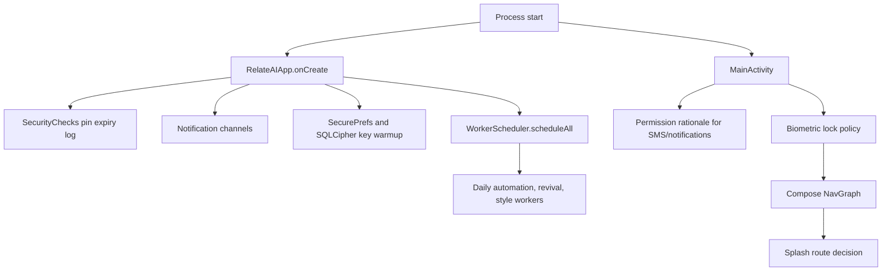
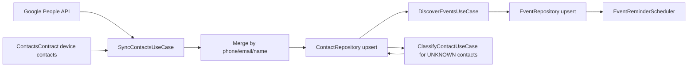
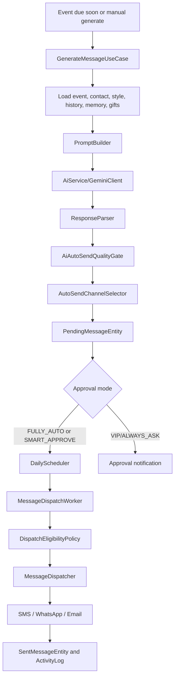
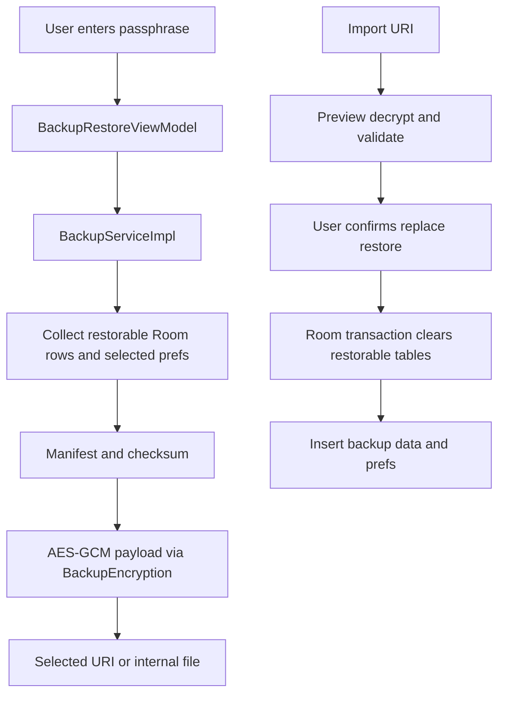

# RelateAI Production Rebuild Plan

Generated: 2026-06-27
Status: Authoritative rebuild plan for this repository
Primary product in this repo: RelateAI, an Android relationship assistant for contacts, events, AI wishes, approval-based automation, delivery, analytics, backup, and recovery.

This file is the single source of truth for rebuilding the project from scratch. It is grounded in repository evidence only: Gradle files, Android manifest and resources, Kotlin source, Room schemas, tests, CI, local reports, and checked-in docs. Anything not verified in those sources is marked as not part of the rebuild.

## 0. Operating Rules

1. Treat `PLAN.md` as the rebuild contract. Older planning files are historical inputs only.
2. Do not implement features from `docs/startup-idea/*`; those files describe "LeadRescue AI", a different product.
3. Preserve verified RelateAI behavior unless this plan explicitly calls it debt, a bug, or a product cut.
4. Keep all recommendations traceable to source files. When a behavior is inferred from multiple files, the relevant evidence paths are listed.
5. Favor safety over automation. This app sends messages on behalf of the user, reads contacts, stores relationship data, and can use Accessibility for WhatsApp, so reviewability, auditability, and consent are product requirements.

## 1. Evidence Map

Primary evidence used for this plan:

| Area | Evidence |
| --- | --- |
| Build graph | `settings.gradle.kts`, root `build.gradle.kts`, `gradle/libs.versions.toml`, module `build.gradle.kts` files |
| App runtime | `app/src/main/AndroidManifest.xml`, `app/src/main/java/com/example/MainActivity.kt`, `RelateAIApp.kt`, navigation under `app/src/main/java/com/example/ui/navigation` |
| Domain behavior | `core/domain/src/main/kotlin/com/example/domain`, Room entity classes under `core/domain/src/main/kotlin/com/example/core/db/entities` |
| Data/runtime implementation | `core/data/src/main/kotlin/com/example/core`, repositories under `core/data/src/main/kotlin/com/example/data/repository` |
| UI | `app/src/main/java/com/example/ui`, `core/ui/src/main/kotlin/com/example/core/ui`, strings and XML resources under `app/src/main/res` |
| Storage | `core/data/src/main/kotlin/com/example/core/db/AppDatabase.kt`, `core/data/schemas/com.example.core.db.AppDatabase/15.json` |
| Tests | `app/src/test`, `app/src/androidTest`, `core/domain/src/test`, `core/data/src/test` |
| Release and CI | `.github/workflows/android.yml`, `app/build.gradle.kts`, `ProductionReadinessConfigTest.kt` |
| Local diagnostics | `lint_baseline_pre_fixes.txt`, `logs/*.log`, `.intelligence/enterprise-diagnostics/latest-report.json` |
| Architecture docs | `docs/architecture/adr/*.md`, `docs/architecture/target-room-schema.md` |
| Historical docs | `SSOT.md`, old `PLAN.md`, `IMPLEMENTATION_PROGRESS.md` |

Important evidence caveat: `lint_baseline_pre_fixes.txt` is a June 7 pre-fix snapshot. Current Gradle files now enable core library desugaring in `app` and `core:data`, so its Java time errors may be stale. Its native library and dependency warnings still need a fresh lint run.

## 2. Product Definition

RelateAI helps a user maintain personal relationships by syncing contacts, discovering important dates, generating personalized messages, collecting memories and gift history, scheduling reminders, requiring approval where needed, sending through configured channels, and reporting relationship health.

Verified product pillars:

- Contact intelligence: Google Contacts and device contacts import, deduplication, relationship classification, enrichment, memories, gifts, and health scoring.
- Event planning: birthdays, anniversaries, work anniversaries, custom events, duplicate/conflict detection, and reminders.
- AI message drafting: Gemini/Firebase Vertex AI generation, six draft variants, prompt context from contact data, style profile, memories, gifts, previous messages, fallback templates, regeneration with feedback.
- Approval-first automation: modes `DEFAULT`, `FULLY_AUTO`, `SMART_APPROVE`, `VIP_APPROVE`, `ALWAYS_ASK`, quality downgrades, quiet hours, blackout dates, channel blackouts, exact alarm or WorkManager scheduling.
- Delivery: SMS, WhatsApp via Accessibility, and email through Gmail SMTP app password.
- Review and recovery: Messages inbox, Wish Preview, test send, activity history, AI Doctor, notifications, and failed-send recovery.
- Local data protection: SQLCipher database, EncryptedSharedPreferences, encrypted backup/export/import, backup exclusions from Android auto backup.
- Insights: dashboard, analytics, CSV export, widget, shortcuts, localization.

Not part of the rebuild unless a future product decision adds them:

- Lead capture, missed-call rescue, web-form lead workflows, business CRM flows, and revenue-plan items from `docs/startup-idea/*`.
- A server backend, admin console, shared accounts, multi-device sync, or remote observability pipeline. No source evidence shows these are implemented.
- Calendar provider integration beyond event concepts. Current source does not show a calendar API sync implementation.
- Merge restore. Current backup UI and service explicitly implement replace restore only.

## 3. Current Repository Snapshot

### 3.1 Modules

Current Gradle modules:

```text
:app
:core:model
:core:domain
:core:data
:core:ui
```

Current dependency direction:

```text
app -> core:domain
app -> core:data
app -> core:ui
core:data -> core:domain
core:domain -> core:model
core:ui -> standalone UI components/theme
core:domain -> Room runtime, Paging runtime, coroutines, javax.inject
core:model -> Kotlin/JVM only
```

This graph works but is not clean domain-driven architecture. Completed 2026-06-27: the existing pure enum model package moved to the new `:core:model` JVM module and `:core:domain` re-exports it for compatibility. The domain module still contains Room entities in package `com.example.core.db.entities` and still depends on Room/Paging, so full domain purity remains pending.

### 3.2 Toolchain

Verified from Gradle:

- Android Gradle Plugin 9.2.1.
- Kotlin 2.2.10.
- JDK toolchain 21 at root; Android compile target Java 17.
- compileSdk 37 in `app`, `core:data`, and `core:domain`; `core:model` is a Kotlin/JVM module targeting Java 17 with the JDK 21 toolchain.
- minSdk 24, app targetSdk 36.
- Compose enabled in `app`.
- Hilt, KSP, Room, WorkManager, SQLCipher, Security Crypto, Biometric, Firebase Auth, Firebase Vertex AI, Firebase Analytics, Google People API, Google AI client, Retrofit/OkHttp/Moshi, JavaMail, Paging, Coil.
- Core library desugaring enabled in `app` and `core:data`.
- Release minification and resource shrinking are enabled, and release signing fails if `KEYSTORE_PATH`, `STORE_PASSWORD`, `KEY_ALIAS`, or `KEY_PASSWORD` are missing.

### 3.3 Runtime Surfaces

Verified from manifest/resources/source:

- `MainActivity` is launcher and handles deep links for `relateai://wish`, `relateai://contact`, and `relateai://settings`.
- `RelateAIApp` initializes security checks, notification channels, encrypted database/key material, secure prefs, and scheduled workers.
- `WhatsAppAccessibilityService` is declared with `BIND_ACCESSIBILITY_SERVICE`, scoped to `com.whatsapp` and `com.whatsapp.w4b`.
- Receivers: message dispatch, approval actions, event reminders, boot recovery, SMS status, birthday widget.
- FileProvider exposes only cache analytics exports.
- Android auto backup is disabled, and backup/data extraction rules exclude database and secure preference files.
- Network security config pins Google/Firebase/Gmail related domains until 2027-06-01.
- App widget shows birthdays, next events, and pending approval count.
- Shortcuts exist for compose and contacts, but current shortcut intents only open `MainActivity` without a specific deep link route.

### 3.4 Navigation

Current route set from `Screen.kt` and `NavGraph.kt`:

```text
splash
onboarding
auth
home
contacts
contacts/{contactId}
events
messages
settings
analytics
activity-history
wish/{contactId}/{messageRef}
chat-history/{contactId}
style-coach
backup-restore
automation-setup
memory-vault/{contactId}
gift-advisor/{contactId}
```

Deep links wired in navigation:

```text
relateai://contact/{contactId}
relateai://wish/{contactId}/{messageRef}
relateai://settings
```

Completed 2026-06-27: `relateai://backup-restore` is now declared in the manifest, registered in `NavGraph`, and built through the shared `RelateDeepLinks` contract used by `NotificationHelper`. The remaining route-contract follow-up is to reuse the same contract for shortcuts and widget click actions.

## 4. Feature Inventory

Each row reflects behavior found in code, tests, or resources.

| Feature | Current behavior | Key evidence | Rebuild stance |
| --- | --- | --- | --- |
| Splash routing | Routes to home/auth/onboarding based on auth and onboarding flags | `SplashViewModel`, `NavGraph` | Keep |
| Onboarding | Product intro plus setup checklist entry to AI Doctor | `OnboardingScreen`, string resources | Keep, make setup completion measurable |
| Google auth | Google sign-in, Firebase credential, contacts scope, config validation | `AuthViewModel`, `AuthManager` | Keep with explicit consent copy |
| Guest mode | Bypass sign-in stores guest mode and can use mock contacts | `AuthManager`, `SyncContactsUseCase` | Keep for local/demo only; production flag it |
| Sign out | Cancels WorkManager, notifications, clears DB and secure prefs, revokes/signs out | `AuthManager.signOut`, `SettingsViewModel` | Keep; remove duplicate clearing in Settings VM |
| Biometric lock | Optional biometric/device credential gate | `BiometricLockPolicy`, `BiometricAuthManager`, `MainActivity` | Keep |
| Permissions | Requests SMS and notifications from app shell; contacts permission used during sync flows | `MainActivity`, `SettingsViewModel`, manifest | Keep, make permission UI channel-specific |
| Contact sync | Google People API plus device contacts, merge by phone/email/name, guest mock contacts | `GoogleContactsSync`, `DeviceContactsReader`, `SyncContactsUseCase` | Keep, centralize sync state and deletion semantics |
| Contact enrichment | Nickname, relationship, language, channel, formality, style, interests, notes, sensitive topics, life phase, budgets | `ContactEntity`, `UpdateContactPreferencesUseCase` | Keep, type JSON fields |
| AI classification | Classifies relationship/language/style for unknown contacts | `ClassifyContactUseCase`, `AiService` | Keep, fix confidence persistence |
| Health scoring | Refreshes contact health from interactions, consecutive wishes, stale contact signals | `RefreshHealthScoresUseCase` | Keep, document formula |
| Event discovery | Creates birthday/anniversary/work anniversary events from contact fields | `DiscoverEventsUseCase`, `EventDiscoveryWorker` | Keep; duplicate worker logic removed 2026-06-27 |
| Manual events | Create custom/manual contact events with duplicate/date conflict handling | `SaveManualEventUseCase`, `EventsViewModel` | Keep |
| Event conflict resolution | Merge or keep separate duplicate/conflicting events | `EventResolutionPolicy`, `ResolveEventConflictUseCase` | Keep |
| AI wish generation | Generates six variants, detects duplicate occurrence, fallback templates, quality gate | `GenerateMessageUseCase`, `PromptBuilder`, `ResponseParser` | Keep, improve event lookup and outcome taxonomy |
| Regeneration | Regenerates pending message with optional feedback and status preservation | `RegeneratePendingMessageUseCase`, `WishPreviewViewModel` | Keep |
| Wish preview | Variant selection, edit, readiness, why signals, test send, approve/reject, next review | `WishPreviewViewModel`, `WishPreviewScreen` | Keep, block too-short approval or make warning explicit |
| Feedback | Saves feedback reason/instruction and activity log | `MessageFeedbackEntity`, `WishPreviewViewModel` | Keep |
| Message inbox | Needs review, scheduled, blocked, failed, sent buckets; bulk approve/reject/retry | `MessagesViewModel`, `MessagesScreen` | Keep, clarify pending table vs pending status |
| Approval modes | Global/contact modes, relationship-sensitive overrides, skip auto wish | `ApprovalModeResolver` | Keep |
| Scheduling | Exact alarm when allowed, WorkManager fallback, quiet hours, blackout dates | `DailyScheduler`, `AutomationSchedulePolicy` | Keep with exact alarm policy review |
| SMS delivery | Multipart SMS with sent/delivered broadcasts | `SmsSender`, `SmsStatusReceiver` | Keep behind explicit permission |
| WhatsApp delivery | Accessibility-driven wa.me flow, exact text verification, queue | `WhatsAppAccessibilityService`, `WhatsAppSender` | Keep only as opt-in high-risk channel |
| Email delivery | Gmail SMTP with app password and STARTTLS | `EmailSender`, `EmailSubjectBuilder` | Keep; isolate credentials and improve error UX |
| Revival messages | Low-health reconnect suggestions | `RevivalWorker`, `RevivalCadencePolicy` | Keep, persist synthetic occasion |
| Holiday messages | Fixed holiday wishes within 7 days | `HolidayWishWorker` | Keep only if product confirms holiday list; persist occasion |
| Follow-up messages | Post-event follow-up for sent messages with no reply | `PostEventFollowUpWorker` | Keep, fix event type/id modeling |
| Notifications | Approval, event reminder, revival, dispatch/system channels | `NotificationHelper`, receivers | Keep, contract-test routes/actions |
| Activity history | Persistent logs with type/severity/status and filters | `ActivityLogEntity`, `ActivityHistoryViewModel` | Keep; expand as audit trail |
| Analytics | Relationship report, health buckets, monthly sent, delivery reliability, response rate, CSV export | `GetAnalyticsUseCase`, `AnalyticsReportServiceImpl`, UI | Keep |
| Style Coach | Manual/recent-message writing profile with history | `StyleAnalysisUseCase`, `StyleCoachViewModel` | Keep |
| Memory Vault | Per-contact notes, categories, pin/delete, max length | `MemoryNoteRecord`, `MemoryNoteRepository`, `MemoryVaultViewModel` | Keep |
| Gift Advisor | Gift history, budget stats, AI suggestions | `GiftHistoryRecord`, `GiftHistoryRepository`, `GiftAdvisorViewModel` | Keep |
| Backup/restore | Encrypted export/import, v2 manifest/checksum, replace mode, preview | `BackupServiceImpl`, `BackupEncryption`, `BackupRestoreViewModel` | Keep; no merge restore in initial rebuild |
| AI Doctor | Setup/readiness diagnostics for AI, permissions, channels, exact alarms, WorkManager, errors, DLQ | `AutomationSetupViewModel` | Keep; make checks persistent and actionable |
| Widget | Today birthdays, next events, pending approvals | `BirthdayWidgetProvider`, widget XML | Keep; add click actions |
| Shortcuts | Compose and contacts launcher shortcuts | `shortcuts.xml` | Keep; add destination intents |
| Localization | English and Hindi string tables with parity tests | `values/strings.xml`, `values-hi/strings.xml`, `LocalizationParityTest` | Keep; add translation quality pass |

## 5. Current Architecture and Flow Diagrams

### 5.1 Startup



### 5.2 Contact and Event Pipeline



Completed 2026-06-27: `EventDiscoveryWorker` now delegates to `DiscoverEventsUseCase`, so contact-derived birthday, anniversary, and work anniversary discovery share one tested domain path.

### 5.3 Message Generation and Dispatch



### 5.4 Backup Flow



## 6. Verified Data Model

Current Room database version: 15.

Current tables:

- `contacts`
- `events`
- `pending_messages`
- `sent_messages`
- `activity_logs`
- `message_feedback`
- `style_profiles`
- `style_profile_history`
- `memory_notes`
- `gift_history`
- `dispatch_attempts`

Current important constraints and indexes:

- `events.contactId` cascades on contact delete.
- `pending_messages.contactId` cascades on contact delete.
- `pending_messages.eventId` is indexed and participates in uniqueness, but is not a Room foreign key in version 15.
- `pending_messages` has unique `(contactId, eventId, scheduledYear)`.
- `sent_messages.contactId` sets null on contact delete.
- `dispatch_attempts.messageDraftId` cascades to `pending_messages.id`; nullable `contactId` and `occasionId` set null, with `occasionId` temporarily referencing the existing `events` compatibility table.
- Dispatch-attempt recovery indexes cover `(messageDraftId, requestedAtMs)`, `(result, nextRetryAtMs)`, `deadLetteredAtMs`, `(contactId, requestedAtMs)`, and `occasionId`.
- Events have active/next occurrence indexes.
- Contacts have revival and active indexes.

Important modeling observations:

- `ContactEntity` is a large aggregate containing identity, Google/device sync metadata, important dates, channel preferences, AI classification, health, automation, gift budgets, JSON personalization fields, notes, archive/delete flags.
- `EventEntity` stores date source, confidence, verification, conflict state, and next occurrence.
- `PendingMessageEntity` stores six generated variants plus selected text, approval mode, status, quality, schedule, channel, AI model, fallback marker, and user edit fields.
- Completed 2026-06-27: `SentMessageEntity` separates nullable `eventId` from semantic `occasionType` and optional `occasionLabel`; legacy `eventType` remains as a compatibility alias.
- Completed 2026-06-27: holiday, revival, and follow-up workers persist deterministic synthetic `EventEntity` rows before pending messages are created.
- Completed 2026-06-27: `dispatch_attempts` exists as a Room v15 table with DAO, pure-model mapper, migration test, backup v3 export/import support, and production orchestration writes from `DispatchMessageUseCase`, `MessageDispatchWorker`, and `MessageDispatcher`. Retry scheduler integration and recovery UI are still pending.
- Many JSON fields are raw strings (`interestsJson`, `favoritesJson`, `metadataJson`, blackout JSON, etc.). Rebuild should keep storage flexible but expose typed serializers and validated value objects.

## 7. Critical Findings and Debt Registry

Severity definitions:

- P0: Can misroute user action, send/count/report incorrectly, lose auditability, or block safe production release.
- P1: Significant maintainability, UX, correctness, or reliability issue.
- P2: Cleanup or hardening that should be planned but is not release-blocking by itself.

| ID | Severity | Finding | Evidence | Required rebuild action |
| --- | --- | --- | --- | --- |
| D-001 | P0 | Completed 2026-06-27: backup restore notification deep link is declared in manifest/NavGraph and shares the route contract used by notifications. | `RelateDeepLinks.kt`, `AndroidManifest.xml`, `NavGraph.kt`, `NotificationHelper.kt`, `DeepLinkContractTest.kt`, `RelateDeepLinksTest.kt`, `RouteArgumentCodecTest.kt` | Keep route contract tests green and extend the same contract to shortcuts/widget actions in D-013. |
| D-002 | P0 | Completed 2026-06-27: AI classification confidence is passed through the use case and repository contract to the DAO instead of being hard-coded to `1.0`. | `ClassifyContactUseCase.kt`, `ContactRepository.kt`, `ContactRepositoryImpl.kt`, `ContactDao.kt`, `ClassifyContactUseCaseTest.kt`, `ContactRepositoryImplTest.kt` | Keep classification confidence regression tests green. |
| D-003 | P0 | Completed 2026-06-27: sent history now separates resolved event ids from semantic occasion type/label while retaining `eventType` as a compatibility alias. | `SentMessageEntity.kt`, `AppDatabase.kt`, `14.json`, `MessageDispatcher.kt`, `SentMessageDao.kt`, `PostEventFollowUpWorker.kt`, `MigrationTest.kt`, `MessageDispatcherTest.kt` | Keep v13-to-v14 migration and sent-message occasion contract tests green. |
| D-004 | P0 | Completed 2026-06-27: dashboard pending count now uses `MessageRepository.countPending()`, which delegates to the DAO query filtered to `status = 'PENDING'`. | `GetDashboardMetricsUseCase.kt`, `MessageRepository.kt`, `MessageRepositoryImpl.kt`, `PendingMessageDao.kt`, `GetDashboardMetricsUseCaseTest.kt` | Keep dashboard metrics tests green and avoid using `getAllPending().size` for status-specific metrics. |
| D-005 | P0 | Completed 2026-06-27: event discovery worker delegates to the shared domain discovery use case instead of owning duplicate DAO/date logic. | `DiscoverEventsUseCase.kt`, `EventDiscoveryWorker.kt`, `EventRepository.kt`, `EventDao.kt`, `EventDiscoveryWorkerTest.kt`, `DiscoverEventsUseCaseTest.kt`, `AutomationPipelineTest.kt` | Keep worker delegation and contact-derived event deactivation regression tests green. |
| D-006 | P0 | Completed 2026-06-27: holiday, revival, and follow-up workers now persist deterministic synthetic `EventEntity` rows before pending messages are created. | `HolidayWishWorker.kt`, `RevivalWorker.kt`, `PostEventFollowUpWorker.kt`, worker tests | Keep synthetic event persistence tests green; later target schema can still replace this compatibility layer with a dedicated `occasions` table. |
| D-007 | P1 | Domain module depends on Room/Paging and contains persistence entities. | `core/domain/build.gradle.kts`, entity package under `core/domain`, ADR 0001 | Move Room entities to database/data module; domain owns pure models and policies. |
| D-008 | P1 | Completed 2026-06-27: message generation and regeneration no longer scan all events with `getEventsBefore(Long.MAX_VALUE)`. | `GenerateMessageUseCase`, `RegeneratePendingMessageUseCase`, `EventRepository.getOccasionById`, `EventRepositoryImplTest` | Keep the direct occasion lookup tests green; continue occurrence-specific draft/idempotency query hardening in the broader `message_drafts` migration. |
| D-009 | P1 | Contact detail labels first upcoming event as birthday-oriented data even when not a birthday. | `ContactDetailViewModel` | Use explicit birthday query or rename UI state to upcoming event. |
| D-010 | P1 | Completed 2026-06-27: Wish Preview treats `TOO_SHORT` as a blocking readiness state in ViewModel approval and Compose button state. | `WishPreviewViewModel.kt`, `WishPreviewScreen.kt`, strings, Wish Preview tests | Keep short-draft approval blocker tests green. |
| D-011 | P1 | Dead letter queue and health monitor are in-memory. | `DeadLetterQueue`, `HealthMonitor`, `AutomationSetupViewModel`, ADR 0003 | Persist dispatch failures and health snapshots for process death and support diagnostics. |
| D-012 | P1 | Settings sign-out duplicates data clearing already handled by `AuthManager.signOut`. | `SettingsViewModel`, `AuthManager` | One sign-out orchestrator only. |
| D-013 | P1 | Shortcut intents open the activity but do not route to compose/contacts. | `shortcuts.xml` | Add explicit deep links or extras and test them. |
| D-014 | P1 | Hindi string table has key parity but many visible English/Hinglish leftovers. | `values-hi/strings.xml`, `LocalizationParityTest` | Add translation quality review beyond parity. |
| D-015 | P1 | Exact alarm permissions include both `SCHEDULE_EXACT_ALARM` and `USE_EXACT_ALARM`, which may have Play policy impact. | `AndroidManifest.xml`, `DailyScheduler` | Confirm entitlement; prefer exact alarm only for user-visible scheduled messages with fallback. |
| D-016 | P1 | Accessibility-based WhatsApp sending is powerful and fragile. | `WhatsAppAccessibilityService`, accessibility XML | Keep opt-in, add consent, dry-run, failure reasons, and Play policy review. |
| D-017 | P1 | SQLCipher key is locally derived/cached from device/app material, not a user-held secret. | `DatabaseKeyDerivation`, strings backup warning, ADR 0004 | Implement target live DB key strategy, hardware-backed wrapping review, and backup-first recovery UX. |
| D-018 | P1 | Certificate pins expire on 2027-06-01. | `network_security_config.xml`, `SecurityChecks` | Add calendar/release gate at least 60 days before expiry. |
| D-019 | P2 | Core UI has no tests and theme is dark-only. | `core/ui`, `RelateAITheme` | Add preview/screenshot tests and light/dynamic theme decision. |
| D-020 | P2 | Local logs are mostly VS Code/extension diagnostics, not app production telemetry. | `logs/*.log`, `.intelligence/latest-report.json` | Do not treat them as app runtime logs; build app-owned observability. |
| D-021 | P2 | Historical docs are large and overlapping. | `SSOT.md`, old `PLAN.md`, `IMPLEMENTATION_PROGRESS.md` | Keep `PLAN.md` authoritative; archive or clearly label historical docs. |

## 8. Target Domain-Driven Architecture

### 8.1 Bounded Contexts

Use these bounded contexts in the rebuild:

| Context | Owns | Must not own |
| --- | --- | --- |
| Identity and Session | Google/Firebase auth state, guest mode, sign-out orchestration, biometric lock policy | Contact merge logic, message generation |
| Contact Graph | Contact identity, source records, deduplication, preferences, enrichment, memories, gifts | AI provider details, delivery APIs |
| Relationship Intelligence | Classification, health scoring, personalization quality, style profile | Room DAOs, UI strings |
| Occasion Planning | Birthdays, anniversaries, work anniversaries, custom events, holidays, revival, follow-ups, conflict resolution | Message transport |
| Message Creation | Prompt context, AI request/response parsing, variants, feedback, quality gate | SMS/WhatsApp/Gmail APIs |
| Approval and Dispatch | Approval modes, eligibility, schedules, quiet hours, channel selection, send attempts, delivery status | Contact import |
| Insights and Audit | Activity logs, analytics aggregates, exports, diagnostics, setup readiness | Business rules that mutate contacts/messages |
| Data Protection | SQLCipher keying, secure prefs, backup/export/import, recovery warnings | Feature-specific UI |

### 8.2 Target Module Graph

Preferred production module graph:

```text
:app

:core:common
:core:model
:core:domain
:core:database
:core:datastore
:core:data
:core:network
:core:ai
:core:automation
:core:designsystem
:core:testing

:feature:auth
:feature:onboarding
:feature:home
:feature:contacts
:feature:events
:feature:messages
:feature:wishpreview
:feature:settings
:feature:analytics
:feature:activity
:feature:stylecoach
:feature:memory
:feature:gifts
:feature:backup
:feature:setupdoctor
:feature:widget
```

Minimum acceptable rebuild if module count must stay smaller:

```text
:app
:core:model
:core:domain
:core:data
:core:automation
:core:ui
```

Hard dependency rules:

```text
feature:* -> core:domain, core:model, core:designsystem
core:data -> core:domain, core:model, core:database, core:network, core:ai, core:datastore
core:automation -> core:domain, core:model, core:data abstractions only
core:domain -> core:model, core:common only
core:model -> Kotlin only
core:database -> Room/SQLCipher only
core:ai -> provider SDKs and prompt/parse adapters
app -> composition, navigation host, permissions, DI, process setup
```

Forbidden:

- Room annotations in `core:domain`.
- Android `Context` in use cases or domain policies.
- UI strings in domain.
- Provider SDK objects crossing into domain.
- Raw JSON string construction outside serializers.
- Message sending from UI classes.

### 8.3 Target Package Shape

```text
core/model/
  contact/
  occasion/
  message/
  dispatch/
  analytics/
  backup/
  common/

core/domain/
  contact/
    MergeContactsUseCase
    UpdateContactPreferencesUseCase
    ContactHealthPolicy
  occasion/
    DiscoverOccasionsUseCase
    ResolveOccasionConflictUseCase
    OccasionIdentityPolicy
    OccasionDatePolicy
  message/
    GenerateMessageUseCase
    RegenerateMessageUseCase
    ApproveMessageUseCase
    RejectMessageUseCase
    MessageQualityPolicy
  dispatch/
    ApprovalModeResolver
    DispatchEligibilityPolicy
    SchedulePolicy
    ChannelSelectionPolicy
  backup/
    ExportBackupUseCase
    PreviewBackupUseCase
    ImportBackupUseCase
  diagnostics/
    RunSetupDiagnosticsUseCase

core/database/
  entity/
  dao/
  migrations/
  converters/

core:data/
  repository/
  sync/
  backup/
  preferences/
  analytics/

core:ai/
  GeminiClient
  PromptBuilder
  ResponseParser
  AiRedactionPolicy

core:automation/
  workers/
  receivers/
  scheduler/
  sender/
  notifications/
  accessibility/
```

## 9. Target Domain Model

### 9.1 Aggregates

Contact aggregate:

- `ContactId`
- source identities: Google person id, device contact id
- display name and optional nickname
- contact methods: phone numbers, email addresses
- relationship classification and confidence
- personalization: language, channel, formality, style, interests, hobbies, favorites, sensitive topics, life phase, notes
- automation preferences: approval mode, skip auto wish, custom send time, budgets
- health metrics: health score, engagement, interaction frequency, last interaction, last wished, revival attempts
- lifecycle: archived/deleted

Occasion aggregate:

- `OccasionId`
- `ContactId`
- `OccasionType`: birthday, anniversary, work anniversary, custom, holiday, revival, follow-up
- date rule: month/day/year or relative/generated occurrence
- source: Google, device, manual, system, AI inferred
- confidence and verification
- conflict group/id
- next occurrence
- reminder policy
- active/inactive lifecycle

Message aggregate:

- `MessageId`
- `ContactId`
- `OccasionId`
- scheduled year/occurrence id
- variants and selected draft
- AI metadata and fallback flag
- quality score and quality signals
- selected channel
- approval mode and status
- schedule
- user edit fields
- feedback records

Dispatch aggregate:

- `DispatchAttemptId`
- `MessageId`
- channel route
- eligibility decision
- request timestamp and resolved send timestamp
- send result and delivery status
- provider metadata redacted
- retry/dead-letter state

Audit aggregate:

- `ActivityLogId`
- type/severity/status
- actor: system/user/worker/receiver
- entity references
- redacted metadata
- created timestamp

### 9.2 Invariants

- A message occurrence is unique by `(contactId, occasionId, scheduledYear)` unless explicitly regenerating a failed occurrence.
- A message cannot be dispatched unless eligibility policy returns `SendNow` or an explicit user-approved override exists.
- `FULLY_AUTO` is never allowed if the contact has `skipAutoWish=true`, no viable channel, low AI quality, or fallback generic draft.
- `VIP_APPROVE` and `ALWAYS_ASK` must produce review notifications, not silent sends.
- Quiet hours and blackout dates apply to scheduled automatic sends.
- Channel blackout applies to all automatic route decisions.
- Event/occasion identity must be deterministic for canonical contact dates.
- Synthetic occasions must be persisted before creating pending messages.
- Sign-out must cancel workers/alarms/notifications before deleting local stores.
- Imported backups must be previewed and checksum-validated before mutating the database.
- Raw provider errors, API keys, OAuth tokens, SMTP passwords, phone numbers, emails, and generated private text must not be written to logs.

## 10. Target Data Model Changes

Keep existing tables only where they map cleanly. Introduce migration or rebuild equivalents:

| Target table | Purpose | Notes |
| --- | --- | --- |
| `contacts` | Canonical user-visible contact | Split source sync records if dedup becomes complex |
| `contact_methods` | Phone/email/channel reachability | Avoid stuffing multiple fields into `contacts` |
| `contact_sources` | Google/device ids, etags, deleted source markers | Supports source deletion reconciliation |
| `contact_preferences` | Automation and personalization preferences | Can be embedded if small |
| `contact_memory_notes` | Memory vault | Existing `memory_notes` maps here |
| `gift_history` | Gift records | Existing table maps here |
| `style_profiles` | Learned writing profile | Existing table maps here |
| `style_profile_history` | Recent snapshots | Existing table maps here |
| `occasions` | All date-based, holiday, revival, follow-up occasions | Replaces overloaded event model |
| `occasion_conflicts` | Duplicate/date conflict groups | Optional if conflict fields stay in occasions |
| `message_drafts` | Pending/approved/generated drafts | Existing `pending_messages` maps here |
| `message_feedback` | Draft feedback | Existing table maps here |
| `dispatch_attempts` | Durable send attempts and dead letters | New or expanded from `sent_messages` |
| `sent_messages` | Sent history user-facing view | Keep semantic event columns |
| `activity_logs` | Audit trail | Existing table maps here |
| `diagnostic_snapshots` | AI Doctor and health monitor results | New |
| `backup_manifests` | Optional local backup history | New optional |

Migration rule for `sent_messages`:

- If old `eventType` matches an existing `events.id`, write that value to `eventId` and copy the event semantic type to `occasionType`.
- If old `eventType` is a known semantic type, write it to `occasionType` and leave `eventId` null if no event can be resolved.
- If old `eventType` starts with `REVIVAL_`, `HOLIDAY_`, or `FOLLOWUP_`, create or resolve a synthetic occasion and link it.

## 11. State Architecture

### 11.1 Sources of Truth

| State | Source of truth | UI use |
| --- | --- | --- |
| Contacts, occasions, messages, sent history, memories, gifts, style, activity | Room/SQLCipher | Observed via repositories and Flows |
| Auth user, guest mode, OAuth token, Gemini key, SMTP settings, preferences | Encrypted preferences through typed repository | Exposed as sanitized state only |
| Worker and dispatch state | Room plus WorkManager ids | UI derives readiness/recovery |
| AI Doctor health | Persisted diagnostic snapshots plus live checks | UI shows latest and rerun action |
| Navigation | Typed route contract | UI and notifications use same route builders |
| Transient UI events | ViewModel state/effects | Not persisted |

### 11.2 ViewModel Rules

- ViewModels transform domain state into screen state; they do not own business rules.
- ViewModels may call use cases only, not DAOs or provider clients.
- All user-visible failures are typed and localized through a UI text mapper.
- One-shot events such as snackbars and navigation should be explicit effects, not nullable state fields that can replay accidentally.
- Search/filter/sort can remain in ViewModels, but query-heavy lists should move to repository queries if data grows.

### 11.3 Worker Rules

- Workers must be idempotent.
- Workers must delegate business decisions to domain services/use cases.
- Workers must persist decisions and outcomes in activity/dispatch tables.
- Workers must accept stable ids, not ambiguous id-or-event-ref strings unless a migration compatibility wrapper is clearly isolated.
- WorkManager unique names and alarm request codes must be centrally defined and tested.

## 12. Integration Contracts

### 12.1 Google Sign-In, Firebase Auth, and Contacts

Current:

- Google sign-in is configured in `AuthViewModel`.
- Contacts sync uses Google People API with `contacts.readonly`.
- Sync token is stored in secure preferences.
- Device contacts import uses `READ_CONTACTS`.

Target:

- Keep contact read scope minimal and disclose why contacts are needed.
- Persist source sync metadata separately from canonical contact.
- Handle Google deleted contacts by reconciling existing source records, not by creating empty user-visible contacts.
- Keep device contacts permission contextual and recoverable.
- Add contract tests for People API URL building and sync token recovery.

### 12.2 AI Providers

Current:

- User Gemini API key path through Google AI client.
- Firebase Vertex AI fallback path when signed in.
- Model configured as `gemini-1.5-flash` in current source.
- Circuit breaker, rate limiter, redaction, fallback JSON, and parser tests exist.

Target:

- Hide provider details behind `AiGateway`.
- Version prompts and response schemas.
- Store prompt schema version and model id with each generated draft.
- Keep no-invention instructions and sensitive-topic exclusions.
- Treat fallback messages as non-automatic unless explicitly reviewed.
- Add golden prompt/response fixtures for birthday, anniversary, work anniversary, custom, holiday, revival, follow-up, sparse context, Hindi, Hinglish, and malformed JSON.

### 12.3 Delivery Channels

SMS:

- Requires `SEND_SMS`.
- Sent/delivered broadcasts update delivery status.
- Must only send approved/eligible messages.

WhatsApp:

- Requires user-enabled Accessibility service.
- Must remain opt-in, visibly scoped, and revocable.
- Must surface failure reasons: service disabled, locked device, app not found, compose field not found, text verification failed, send button not found, timeout.

Email:

- Uses Gmail SMTP and app password stored in secure prefs.
- Must validate setup before route selection.
- Must avoid exposing app password in logs, backups, or analytics.

Target channel selection:

```text
1. Remove channels disabled by global blackout.
2. Remove channels missing setup or contact method.
3. Prefer strongest recent successful channel when still viable.
4. Else use contact preference.
5. Else use configured fallback order.
6. If no route, force manual review with no-send reason.
```

### 12.4 Backup

Current:

- AES-GCM encrypted payload.
- PBKDF2 passphrase derivation.
- Manifest/checksum and preview before replace import.
- Max import size 25 MB.
- Secrets excluded from backup.

Target:

- Keep replace restore only for initial rebuild.
- Explicitly list included/excluded fields in backup manifest.
- Include backup schema version and minimum app version.
- Add dry-run restore tests for each supported previous schema.
- Preserve "factory reset loses local DB key" warning unless key strategy changes.

## 13. UX and Product Redesign

### 13.1 Information Architecture

Primary bottom nav should remain:

```text
Home | Contacts | Events | Messages | Analytics
```

Secondary surfaces:

```text
Settings
AI Doctor
Style Coach
Backup and Restore
Activity History
Memory Vault
Gift Advisor
Chat History
Wish Preview
```

Home should be operational, not marketing:

- Next best action.
- Setup/readiness summary.
- Pending approvals.
- Upcoming events.
- Backup freshness.
- Low-health relationship action.
- Quick links only when they are actionable.

Messages should be the operational work queue:

- Needs review.
- Scheduled.
- Blocked.
- Failed.
- Sent history.
- Bulk actions with clear eligibility.

Contacts should be the data quality hub:

- Missing relationship.
- Missing channel.
- Missing context.
- Low health.
- VIP/close contacts.
- Personalization quality per contact.

AI Doctor should be the support/debug hub:

- Required setup.
- Quality warnings.
- Reliability warnings.
- Recovery/dead-letter items.
- Test AI/email/contact sync actions.

### 13.2 Screen Contracts

| Screen | Must answer | Primary action |
| --- | --- | --- |
| Onboarding | What setup is needed before automation is reliable? | Continue to sign in or setup checklist |
| Auth | Who is using the app and can contacts be synced? | Sign in or guest mode |
| Home | What should I do next? | Ranked next action |
| Contacts | Which contacts need data before AI can personalize? | Edit personalization |
| Contact Detail | What does RelateAI know about this relationship? | Add context or generate wish |
| Events | Which occasions are upcoming or conflicted? | Add/resolve/generate |
| Messages | What requires review, is scheduled, blocked, failed, or sent? | Approve/reject/retry |
| Wish Preview | Is this exact text safe to send? | Edit, regenerate, approve |
| Settings | Which global preferences and credentials are configured? | Save credentials/preferences |
| AI Doctor | Why is automation or AI not ready? | Fix highest-ranked blocker |
| Backup | Is data protected and can a restore be safely previewed? | Export or preview import |
| Analytics | What is relationship health and delivery performance? | Export report |
| Activity | What happened and what can be opened? | Open related route |
| Style Coach | What writing style has been learned? | Train/analyze |
| Memory Vault | What personal context is available? | Add note |
| Gift Advisor | What gifts and budgets exist? | Add gift or ask AI |

### 13.3 Design System

Current `core:ui` provides a dark Material 3 theme, reusable cards, feedback components, and shimmer loading. Rebuild target:

- Keep Material 3.
- Promote `core:ui` to `core:designsystem`.
- Define tokens for spacing, elevation, shape, content density, and semantic colors.
- Cards may be used for repeated items, dialogs, and framed tools. Avoid cards nested inside cards.
- Use icon buttons for common actions and text buttons for explicit commands.
- Keep operational screens dense and scannable.
- Add light theme or explicitly document dark-only product decision.
- Ensure all text fits at 320 dp width, large font scale, and Hindi strings.
- Add preview/screenshot coverage for primary states.

Color note: current palette is dark with purple primary, cyan secondary, and rose tertiary. It is not a pure single-hue palette, but the rebuild should reduce over-reliance on purple for status-heavy operational UI.

### 13.4 Accessibility and Localization

Current:

- Accessibility label regression tests exist.
- Hindi string parity tests exist.
- Accessibility service description is explicit.

Target:

- Keep content descriptions on all icon-only actions.
- Minimum touch target 48 dp.
- Test TalkBack order on Messages, Wish Preview, AI Doctor, Backup, and Contact Detail.
- Add translation quality review for Hindi; parity alone is insufficient because many Hindi strings currently contain English.
- Make SMS/WhatsApp/email consent and permission explanations localized.

## 14. Security, Privacy, and Compliance

### 14.1 Current Controls

Verified controls:

- `android:allowBackup=false`.
- Backup/data extraction exclusions for database and secure preferences.
- SQLCipher database.
- EncryptedSharedPreferences for auth/config and cached DB key.
- Legacy plaintext DB quarantine before opening encrypted DB.
- Certificate pinning for Google/Firebase/Gmail related domains, expiring 2027-06-01.
- Prompt builder redacts emails/phone numbers in notes.
- Structured logger redacts sensitive text.
- Release signing guard prevents unsigned release artifact generation.
- Biometric/device credential lock option.

### 14.2 Required Security Decisions

DB key strategy:

- Current key is derived/cached locally from device/app material. It protects against casual file extraction, but not against all local compromise scenarios.
- Rebuild must document this threat model.
- If stronger protection is required, wrap the SQLCipher key with Android Keystore and consider optional user passphrase recovery.

Secrets:

- OAuth token, Gemini key, SMTP email/password must stay out of backups, logs, analytics exports, screenshots, and bug reports.
- Add automated tests that exported backup JSON does not contain known secret fixtures.

Permissions:

- Request contacts only in sync context.
- Request SMS only when SMS sending is enabled or first needed.
- Request notifications before approval/reminder workflows.
- Review exact alarm declaration and Play policy eligibility.
- WhatsApp Accessibility must remain explicit opt-in and must never read or store chat contents.

AI privacy:

- Send only data necessary for message generation.
- Exclude sensitive topics explicitly from prompts.
- Keep fallback behavior when AI fails.
- Let users disable AI generation globally.

Network:

- Pin expiry must be release-gated.
- Fresh lint must review trust manager warnings from Google dependencies.
- Do not disable TLS validation in production.

## 15. Reliability and Performance

### 15.1 Current Strengths

- WorkManager used for recurring and chained automation.
- Exact alarm fallback to WorkManager exists.
- Boot receiver reschedules pending sends and reminders.
- Circuit breaker and rate limiter around Gemini calls.
- Retry/backoff helpers exist.
- Activity logs record many user and automation decisions.
- Unique pending occurrence constraint prevents duplicate drafts for the same contact/event/year.
- Room indices cover upcoming events, contacts active/revival, pending status/schedule, and sent history.

### 15.2 Required Reliability Upgrades

- Persist dispatch attempts and dead-letter records.
- Make all message generation and dispatch idempotency keys explicit.
- Replace `id-or-event-ref` compatibility paths with typed ids after migration.
- Centralize time through a `Clock` abstraction for workers and policies.
- Add per-channel send result taxonomy.
- Record no-route reasons in pending messages or dispatch attempts.
- Add worker input validation tests for missing ids, stale messages, already-sent messages, and deleted contacts.
- Add alarms/WorkManager reconciliation job after app update.
- Use query APIs instead of loading all events/messages for targeted operations.

### 15.3 Performance Targets

Startup:

- No blocking network call in `Application.onCreate`.
- Database key warmup must stay off main thread when possible.
- Initial route should render within normal Android cold start expectations on a mid-range device.

Sync:

- People API paging must remain incremental.
- Device contact import must batch reads and writes.
- Merge should be linear or near-linear using normalized keys.

Messaging:

- AI generation should respect rate limits and not launch unbounded concurrent calls.
- Prompt context should cap previous messages, memories, and gifts.
- Message inbox should use status-filtered and paged queries if row counts grow.

UI:

- Lists should use Lazy components and stable keys.
- Expensive analytics should be pre-aggregated or moved off main dispatcher.

## 16. Error Handling and Observability

### 16.1 Target Error Model

Use typed errors across domain/data layers:

```kotlin
sealed interface RelateError {
    val code: String
    val retryable: Boolean
    val auditSeverity: AuditSeverity
}
```

Required categories:

- AuthError
- PermissionError
- ContactSyncError
- AiError
- MessageGenerationError
- ApprovalError
- SchedulingError
- DispatchError
- BackupError
- DatabaseError
- ValidationError
- NavigationError

UI maps errors to localized resources. Domain/data layers do not return `String` as the primary error contract.

### 16.2 Observability

Current app has `ActivityLogEntity`, `StructuredLogger`, `SensitiveLogRedactor`, `HealthMonitor`, and `DeadLetterQueue`. Rebuild target:

- Persist diagnostic snapshots and dead letters.
- Link logs to contact/message/occasion ids where safe.
- Never log raw message text, phone numbers, emails, OAuth tokens, API keys, SMTP passwords, or full AI responses.
- Activity History should show user-relevant audit events; developer diagnostics should remain separate.
- AI Doctor should read persisted diagnostics and run live checks on demand.

Local repo logs under `logs/` are not app telemetry. They show VS Code/extension command failures, missing extension dependencies, GitHub/Copilot auth failures, and network diagnostics. Do not design production app observability around those files.

## 17. Testing Strategy

### 17.1 Current Test Footprint

The repository already has broad tests:

- Domain automation policies: approval resolver, schedule policy, quality gate, dispatch eligibility, channel selector, revival cadence.
- Domain model parsing and entity default tests.
- Use cases: generation, regeneration, approval/rejection/revoke, sync, discovery, manual events, analytics, health, style, preferences, test send.
- Data: repositories, backup encryption/service, migrations/key/quarantine, People API URL, preferences, analytics report, resilience, delivery resolver, notification policy, reminder scheduler.
- Workers: sync, discovery, daily trigger, generation, dispatch, holiday, revival, follow-up, style.
- ViewModels for all major screens.
- Compose/screen interaction tests for primary screens.
- Localization parity, hardcoded strings, accessibility labels, production config, route encoding.
- Android instrumentation smoke tests for initial navigation and guest app shell.

### 17.2 Rebuild Test Requirements

P0 tests before any beta:

- Navigation contract test: every deep link, notification action, widget action, shortcut, and activity route resolves.
- Dispatch safety test: no automatic send when channel missing, blackout active, quiet-hour defer, fallback generic draft, low quality, VIP/ALWAYS_ASK, skipAutoWish, expired approval window, already sent, or deleted contact.
- Occasion id test: birthday/anniversary/work/custom/holiday/revival/follow-up ids are stable and semantic fields are not overloaded.
- Migration test: old version 14 data migrates to target schema without losing contact/event/message/sent/history data.
- Backup round-trip test: export, preview, replace import, checksum mismatch, wrong passphrase, oversize file, unsupported future version.
- Secret exclusion test: backups/logs/exports do not include API keys, OAuth tokens, SMTP passwords, phone/email fixtures.
- AI parser tests: malformed JSON, error payload, sparse context, Hindi, six variants, fallback reason.
- Contact sync tests: Google deleted contact reconciliation, sync-token 400 recovery, device permission denial, duplicate merge.
- Worker idempotency tests: repeated WorkManager/alarm invocations do not duplicate sends or drafts.
- SMS/Email/WhatsApp sender fake tests: result taxonomy and audit persistence.
- Permission UX tests for contacts, SMS, notifications, exact alarm, Accessibility.

P1 tests:

- Screenshot tests for Home, Messages, Wish Preview, Contact Detail, Events, AI Doctor, Backup, Settings in English and Hindi.
- Large font and 320 dp width UI tests.
- Performance baseline for cold start, contact sync merge, dashboard load, message inbox load.
- Lint and static checks for domain purity and forbidden dependencies.
- Prompt privacy golden tests.
- Analytics accuracy tests after mixed sent/failed/pending/rejected/expired statuses.

### 17.3 Verification Commands

Baseline local verification:

```bash
./gradlew testDebugUnitTest lintDebug assembleDebug --no-configuration-cache
./gradlew jacocoDebugUnitTestReport --no-configuration-cache
```

Release guard:

```bash
./gradlew assembleRelease --no-configuration-cache
```

This should fail without release signing environment variables and succeed only with production signing configured.

Android smoke:

```bash
./gradlew connectedDebugAndroidTest --no-configuration-cache
```

Fresh lint is required because checked-in `lint_baseline_pre_fixes.txt` is stale.

## 18. CI and Release

Current GitHub Actions:

- Runs on push/PR to `main`/`master`.
- Uses JDK 21.
- Runs `testDebugUnitTest lintDebug assembleDebug --no-configuration-cache`.
- Generates Jacoco aggregate report.
- Verifies release signing guard fails without signing env vars.
- Uploads lint, unit test, coverage, and debug APK artifacts.

Target additions:

- Run Android instrumentation smoke on emulator at least nightly.
- Publish coverage threshold with explicit minimums.
- Add dependency vulnerability/license review.
- Add baseline profile generation/validation if performance-sensitive release.
- Add pin expiry check as CI failure when within 60 days.
- Add schema diff review for Room migrations.
- Add route contract and backup secret-exclusion tests to required PR gate.

## 19. Rebuild Roadmap

### Phase 0: Freeze and Safety Fixes

Goal: make the current system safer before broad restructuring.

Tasks:

- Completed 2026-06-27: fix `relateai://backup-restore` route mismatch.
- Completed 2026-06-27: fix classification confidence persistence.
- Completed 2026-06-27: fix pending count ambiguity.
- Completed 2026-06-27: remove duplicate event discovery worker logic.
- Completed 2026-06-27: split sent-message event id from semantic occasion fields with Room v14 migration.
- Completed 2026-06-27: persist synthetic holiday, revival, and follow-up event rows before pending messages.
- Completed 2026-06-27: make Wish Preview short-draft approval behavior explicit.
- Completed 2026-06-27: add tests for short-draft approval behavior.
- Completed 2026-06-27: rerun debug verification gate (`testDebugUnitTest`, `lintDebug`, `assembleDebug`).

Exit criteria:

- No known P0 findings remain.
- Current app behavior is regression-protected before module extraction.

### Phase 1: Domain Model and Storage Foundation

Goal: define clean pure models and a migration-ready target schema.

Tasks:

- Started 2026-06-27: created `:core:model` and moved existing pure model enums/tests into it.
- Started 2026-06-27: added pure occasion/message aggregate models in `:core:model` and moved dispatch eligibility policy to `MessageDraft`.
- Started 2026-06-27: moved occasion identity and conflict policies to the pure `Occasion` model with temporary `EventEntity` boundary mappers.
- Started 2026-06-27: added a pure contact automation profile and moved revival cadence policy off Room contact/pending-message entities.
- Started 2026-06-27: added the pure `DispatchAttempt` aggregate and result taxonomy in `:core:model`.
- Completed 2026-06-27: added Room v15 `dispatch_attempts`, DAO, schema export, migration tests, and backup v3 inclusion.
- Create pure model/value objects for contacts, occasions, messages, dispatch attempts, audit records.
- Move Room entities out of domain.
- Introduce typed serializers for JSON-backed fields.
- Design and implement `occasions` and `message_drafts`; `dispatch_attempts` now exists in compatibility form.
- Write migration from version 15 to target schema.
- Add schema and migration tests.

Exit criteria:

- Domain module has no Android, Room, Paging, or provider SDK dependency.
- Version 13 fixture data migrates successfully.

### Phase 2: Use Case and Repository Boundaries

Goal: make business behavior testable without Android runtime.

Tasks:

- Replace direct DAO/provider usage in ViewModels and workers with use cases.
- Add repositories for typed queries: event by id, pending by status, occasion occurrence, dispatch attempts.
- Centralize route, worker, alarm, and notification ids.
- Introduce clock abstraction.
- Completed 2026-06-27: remove duplicate event discovery worker logic.

Exit criteria:

- Workers are thin orchestrators.
- ViewModels contain no business policies.
- Route and worker contracts are tested.

### Phase 3: Automation and Delivery Hardening

Goal: make sending auditable, idempotent, and recoverable.

Tasks:

- Completed 2026-06-27: persist dispatch attempts and dead-letter state for user/worker send orchestration, defer, approval-needed, blocked, expired, contact-missing, no-route, and dispatcher-exception outcomes.
- Add send result taxonomy per channel.
- Persist synthetic occasions for holiday/revival/follow-up.
- Rework channel selection with explicit no-route reasons.
- Completed 2026-06-27: AI Doctor recovery diagnostics read persisted `dispatch_attempts`, and Messages retry actions now record `RETRY_QUEUED` dispatch-attempt state before scheduling retry execution.
- Add fake sender integration tests.

Exit criteria:

- No send can occur without a persisted eligibility decision and audit record.
- Process death does not erase failed-send recovery state.

### Phase 4: UX Redesign and Feature Modules

Goal: rebuild screens around operational workflows.

Tasks:

- Extract feature modules or feature packages.
- Implement design system tokens.
- Rebuild Home, Messages, Wish Preview, Contact Detail, Events, AI Doctor, Backup as primary workflows.
- Add widget click-through actions and route-aware shortcuts.
- Improve Hindi localization quality.
- Add accessibility and screenshot coverage.

Exit criteria:

- Primary workflows are complete, tested, and readable at mobile widths and large font scales.

### Phase 5: Security, Privacy, and Release Readiness

Goal: prepare for production distribution.

Tasks:

- Document data safety, permissions, Accessibility use, exact alarm use, AI data handling, and backup limitations.
- Review SQLCipher key strategy.
- Add pin expiry CI gate.
- Add dependency/license/vulnerability checks.
- Run release build with production signing.
- Validate backup/restore and sign-out on a clean device/emulator.

Exit criteria:

- Production release checklist passes.
- No unresolved high-risk security or compliance item remains.

## 20. Reuse Plan

Keep and port with tests:

- Domain policies: `ApprovalModeResolver`, `AutomationSchedulePolicy`, `DispatchEligibilityPolicy`, `AutoSendChannelSelector`, `AiAutoSendQualityGate`, `RevivalCadencePolicy`, event identity/date/resolution policies.
- Prompt and parser behavior after versioning and privacy review.
- Backup encryption and manifest/checksum flow.
- Google People API request builder and sync-token recovery.
- Secure prefs and legacy DB quarantine concepts.
- Activity logging model.
- Existing ViewModel and use-case tests as regression references.
- Compose screen interaction tests after UI redesign.

Refactor before reuse:

- Room entities in domain.
- `MessageDispatcher` sent event modeling.
- `GenerateMessageUseCase` event lookup.
- Settings sign-out orchestration.
- In-memory dead letter/health monitor.
- Raw JSON field manipulation.
- Navigation/deep link strings.

Discard or archive:

- LeadRescue AI startup docs as product requirements for this app.
- Stale lint baseline as current truth.
- Any generated build outputs used as implementation evidence.

## 21. Documentation Plan

Required docs after rebuild:

- `PLAN.md`: architecture and rebuild source of truth.
- Completed 2026-06-27: `docs/architecture/adr/0001-domain-purity-and-module-boundaries.md`.
- Completed 2026-06-27: `docs/architecture/adr/0002-occasion-model.md`.
- Completed 2026-06-27: `docs/architecture/adr/0003-durable-dispatch-attempts.md`.
- Completed 2026-06-27: `docs/architecture/adr/0004-database-keying-and-backup-recovery.md`.
- Completed 2026-06-27: `docs/architecture/target-room-schema.md`.
- `docs/product/relateai-prd.md`: product requirements for RelateAI only.
- `docs/security/privacy-and-permissions.md`: contacts, SMS, notifications, exact alarms, Accessibility, AI data, backups.
- `docs/architecture/adr/`: decisions for domain modules, data model, AI provider, dispatch, backup, DB keying.
- `docs/operations/release-checklist.md`: CI, signing, pin expiry, Play policy, data safety.
- `docs/testing/test-strategy.md`: unit/integration/instrumented/screenshot/performance gates.
- `docs/user/backup-restore.md`: restore limitations and passphrase handling.

Historical docs should be moved under `docs/archive/` or labeled clearly so they do not compete with this plan.

## 22. Acceptance Criteria

The rebuild is production-ready only when all items below are true.

Product:

- All verified RelateAI features in Section 4 are either implemented or explicitly cut in a signed product decision.
- No LeadRescue AI feature is implemented unless separately approved.
- User can complete: sign in or guest mode, sync contacts, enrich contact, discover/add event, generate wish, review/edit/regenerate, approve, schedule, send/test, view activity, export backup, restore preview, run AI Doctor.

Architecture:

- Domain is pure Kotlin.
- Persistence entities are not domain models.
- Workers and receivers delegate to use cases/policies.
- Route and notification contracts are centralized.
- Synthetic occasions are persisted.
- Event id and event type are separate concepts.

Data:

- Version 13 migration is tested.
- Backup export/import round trip passes.
- Secret exclusion tests pass.
- Sign-out clears local stores, workers, alarms, notifications, cached keys, and auth state once through a single orchestrator.

Safety:

- No automatic send occurs without a persisted eligibility decision.
- Fallback/generic/low-quality drafts cannot silently fully-auto send.
- Blocked channels, missing setup, quiet hours, blackouts, and skipAutoWish are enforced.
- WhatsApp automation requires explicit Accessibility enablement and clear consent.

Security:

- Auto backup remains disabled or sensitive stores remain excluded.
- API keys, OAuth tokens, SMTP passwords, phone/email fixtures, and raw AI responses do not appear in logs/backups/exports.
- Certificate pin expiry is tracked by CI.
- Release signing guard passes.

UX:

- Primary workflows are accessible, localized, and tested at small widths and large font scale.
- Hindi strings pass parity and quality review.
- Widget and shortcuts route to expected screens.
- All user-facing errors are localized and actionable.

Testing and CI:

- `testDebugUnitTest`, `lintDebug`, `assembleDebug`, and coverage run clean.
- Migration, backup, dispatch safety, navigation contract, and secret exclusion tests are required gates.
- At least one Android instrumentation smoke path runs in CI or nightly.

## 23. Immediate Next Actions

1. Continue moving remaining domain use cases and repository contracts away from Room entities.
2. Implement the target `occasions`/`message_drafts` migration from the Room v15 baseline in `docs/architecture/target-room-schema.md`.
3. Rebuild workflows feature by feature, using existing tests as behavioral guardrails.
4. Use the dispatch provider taxonomy when adding row-level recovery actions or automatic retry scheduling.

## 24. Implementation Progress Tracker

The tracker is updated after each implementation cycle. `Completed` means implemented, verified, tested, documented, and integrated for the stated scope.

| Task | Status | Priority | Dependencies | Progress | Implementation Date | Verification Status | Test Status | Reviewer Notes | Blocking Issues | Next Actions |
| --- | --- | --- | --- | ---: | --- | --- | --- | --- | --- | --- |
| D-001 Backup-restore deep link contract | Completed | P0 | `NotificationHelper`, manifest, NavGraph, route argument encoding | 100% | 2026-06-27 | Verified by source inspection and focused route contract tests: manifest declares `backup-restore`, NavGraph registers `RelateDeepLinks.BackupRestore.pattern`, and system alert notifications use `RelateDeepLinks.BackupRestore.uri`. | Passed `JAVA_HOME=/opt/homebrew/opt/openjdk@21 ./gradlew :core:domain:testDebugUnitTest :app:testDebugUnitTest --tests com.example.domain.navigation.RelateDeepLinksTest --tests com.example.ui.navigation.RouteArgumentCodecTest --tests com.example.ui.navigation.DeepLinkContractTest --no-configuration-cache`. Build emitted pre-existing Compose deprecation warnings in `MessagesScreen.kt`. | Shared `RelateDeepLinks` now centralizes contact, wish, settings, and backup-restore URI/pattern strings. Contact and wish notification deep links now encode path-sensitive ids through the shared contract. | None for D-001. | Reuse this contract for D-013 shortcut/widget routing. |
| D-002 Classification confidence persistence | Completed | P0 | `ClassifyContactUseCase`, `ContactRepository`, `ContactRepositoryImpl`, `ContactDao`, classification tests | 100% | 2026-06-27 | Verified by source inspection and focused tests: `ClassifyContactUseCase` passes `ContactClassificationResult.confidence`, `ContactRepository` exposes the confidence parameter, and `ContactRepositoryImpl` delegates that value to `ContactDao.updateClassification`. | Passed `JAVA_HOME=/opt/homebrew/opt/openjdk@21 ./gradlew :app:testDebugUnitTest :core:data:testDebugUnitTest --tests com.example.domain.usecase.ClassifyContactUseCaseTest --tests com.example.data.repository.ContactRepositoryImplTest --no-configuration-cache`. | AI confidence now remains available to personalization-readiness checks instead of being inflated to `1.0`. | None for D-002. | Continue with D-004 pending-count ambiguity or D-003 event modeling. |
| D-003 Sent message occasion modeling | Completed | P0 | `SentMessageEntity`, `AppDatabase`, Room schema v14, `MessageDispatcher`, `SentMessageDao`, follow-up worker, migrations | 100% | 2026-06-27 | Verified by source inspection and focused tests: `sent_messages` now has nullable `eventId`, non-null `occasionType`, optional `occasionLabel`, and legacy `eventType` is rewritten/kept as the semantic compatibility alias. `MessageDispatcher` writes resolved event ids separately from occasion type; `PostEventFollowUpWorker` reads `sent.eventId` for original event lookup and falls back to occasion fields. | Passed `JAVA_HOME=/opt/homebrew/opt/openjdk@21 ./gradlew :core:data:testDebugUnitTest :app:testDebugUnitTest --tests com.example.core.db.MigrationTest --tests com.example.core.automation.sender.MessageDispatcherTest --tests com.example.core.automation.workers.PostEventFollowUpWorkerTest --tests com.example.core.db.DaoTest --no-configuration-cache` after schema v14 was generated. `git diff --check` also passed. | D-003 moved the baseline from 13 to 14; D-029 later moved the current baseline to 15. D-006 now persists synthetic event rows for compatibility. | None for D-003. | Continue with ADR/schema work. |
| D-004 Pending count ambiguity | Completed | P0 | `MessageRepository`, `PendingMessageDao`, `GetDashboardMetricsUseCase`, dashboard tests | 100% | 2026-06-27 | Verified by source inspection and focused tests: dashboard metrics now use `messageRepository.countPending().first()` instead of `getAllPending().first().size`; the DAO count remains filtered to `status = 'PENDING'`. | Passed `JAVA_HOME=/opt/homebrew/opt/openjdk@21 ./gradlew :app:testDebugUnitTest --tests com.example.domain.usecase.GetDashboardMetricsUseCaseTest --no-configuration-cache`. | The dashboard pending count now means pending review rows, not every row in the pending-message table. | None for D-004. | Continue with ADR/schema work. |
| D-005 Duplicate event discovery logic | Completed | P0 | `DiscoverEventsUseCase`, `EventDiscoveryWorker`, `EventRepository`, `EventDao`, worker/use-case/pipeline tests | 100% | 2026-06-27 | Verified by source inspection and focused tests: `EventDiscoveryWorker` delegates to `DiscoverEventsUseCase`; contact-derived event deactivation now lives in the repository-backed domain flow and is scoped to `source = 'CONTACTS'`. | Passed `JAVA_HOME=/opt/homebrew/opt/openjdk@21 ./gradlew :app:testDebugUnitTest --tests com.example.core.automation.workers.EventDiscoveryWorkerTest --tests com.example.domain.usecase.DiscoverEventsUseCaseTest --tests com.example.core.automation.AutomationPipelineTest --no-configuration-cache`; `git diff --check` also passed. | Workers stay thin and all contact-date discovery uses the shared use case path. Manual events remain protected because deactivation targets only contact-derived events. | None for D-005. | Continue with ADR/schema work. |
| D-006 Persist synthetic occasions | Completed | P0 | `HolidayWishWorker`, `RevivalWorker`, `PostEventFollowUpWorker`, `EventDao`, worker tests | 100% | 2026-06-27 | Verified by source inspection and focused tests: each worker now upserts a deterministic synthetic `EventEntity` (`HOLIDAY_*`, `REVIVAL_*`, `FOLLOWUP_*`) before inserting the pending message, and skip paths do not write synthetic events. | Passed `JAVA_HOME=/opt/homebrew/opt/openjdk@21 ./gradlew :app:testDebugUnitTest --tests com.example.core.automation.workers.HolidayWishWorkerTest --tests com.example.core.automation.workers.RevivalWorkerTest --tests com.example.core.automation.workers.PostEventFollowUpWorkerTest --no-configuration-cache`; `git diff --check` also passed. | This is a Phase 0 compatibility fix using the existing `events` table. The target rebuild can still introduce a first-class `occasions` table in Phase 1. | None for D-006. | Continue with ADR/schema work. |
| Phase 0 debug verification gate | Completed | P0/P1 | D-001 through D-006, D-010, debug unit tests, lint, debug assembly | 100% | 2026-06-27 | Verified the current Phase 0 fix set with the debug build gate after D-010 was completed. | Passed `JAVA_HOME=/opt/homebrew/opt/openjdk@21 ./gradlew testDebugUnitTest lintDebug assembleDebug --no-configuration-cache`. | Build emitted existing warnings only: Compose deprecations in `MessagesScreen.kt` and `MigrationTestHelper` constructor deprecation in `MigrationTest.kt`. | None for the debug gate. | Continue with ADR/schema work. |
| D-010 Wish Preview short-draft approval | Completed | P1 | `WishPreviewViewModel`, `WishPreviewScreen`, readiness strings, ViewModel and Compose tests | 100% | 2026-06-27 | Verified by source inspection and focused tests: `TOO_SHORT` now blocks approval in `WishPreviewViewModel.approve()`, disables the Approve button in Compose, and surfaces explicit localized copy. | Passed `JAVA_HOME=/opt/homebrew/opt/openjdk@21 ./gradlew :app:testDebugUnitTest --tests com.example.ui.viewmodel.WishPreviewViewModelTest --tests com.example.ui.screens.wish.WishPreviewScreenInteractionTest --no-configuration-cache`; `git diff --check` also passed. | Chose blocking behavior instead of an override path to keep Phase 0 approval safety simple. | None for D-010. | Continue with ADR/schema work. |
| D-022 Architecture decision records | Completed | P1 | `PLAN.md`, domain/entity evidence, dispatch flow, database keying, backup flow | 100% | 2026-06-27 | Verified by source inspection: ADRs now capture accepted target decisions for domain purity, occasion modeling, durable dispatch attempts, and DB keying/backup recovery. | Documentation-only change; `git diff --check` passed. | ADRs describe target decisions and do not claim module/schema implementation is complete. | None for D-022. | Use ADR 0001 to drive `core:model` and domain purity work. |
| D-023 Target Room schema design | Completed | P1 | Room schema v14/v15, `AppDatabase`, entity definitions, ADR 0002 and ADR 0003 | 100% | 2026-06-27 | Verified by source inspection: `docs/architecture/target-room-schema.md` originally documented the version 14 baseline, target tables, migration rules, synthetic occasion backfill, dispatch attempts, and migration tests. Updated after D-029 to reflect the v15 dispatch-attempt compatibility slice. | Documentation-only change; `git diff --check` passed before D-029; D-029 focused tests validate the first schema implementation slice. | The target schema remains a design contract for occasions/message drafts; dispatch-attempt persistence now exists in Room v15. | None for D-023. | Implement the remaining target migration from the v15 baseline. |
| D-024 Core model extraction slice | Completed | P1 | `settings.gradle.kts`, root Gradle plugin classpath, `core/model`, `core/domain` API dependency, existing model enum tests | 100% | 2026-06-27 | Verified by source inspection: `:core:model` is a Kotlin/JVM module, existing pure enums live there under the same package, and `:core:domain` exposes the model module for existing app/data imports. | Passed `JAVA_HOME=/opt/homebrew/opt/openjdk@21 ./gradlew :core:model:test :core:domain:testDebugUnitTest :core:data:testDebugUnitTest :app:testDebugUnitTest --no-configuration-cache`; then passed the full debug gate `JAVA_HOME=/opt/homebrew/opt/openjdk@21 ./gradlew :core:model:test testDebugUnitTest lintDebug assembleDebug --no-configuration-cache`. | This starts module extraction only; Room entities and Room/Paging dependencies still remain in `:core:domain`. | None for D-024. | Add pure occasion/message aggregate models and migrate domain policies away from Room entities. |
| D-025 Message and occasion model boundary | Completed | P1 | `core:model`, `DispatchEligibilityPolicy`, pending-message mapper, dispatch use case, dispatch worker, approval notification policy | 100% | 2026-06-27 | Verified by source inspection: `core:model` now contains pure `Occasion`, `OccasionDate`, `OccasionType`, `MessageDraft`, and shared id value classes. `DispatchEligibilityPolicy` evaluates `MessageDraft` and no longer imports `PendingMessageEntity`; current Room callers convert through the temporary `PendingMessageEntity.toMessageDraft()` boundary mapper. | Passed `JAVA_HOME=/opt/homebrew/opt/openjdk@21 ./gradlew :core:model:test :core:domain:testDebugUnitTest :core:data:testDebugUnitTest --tests com.example.domain.automation.DispatchEligibilityPolicyTest --tests com.example.core.automation.notifications.ApprovalNotificationActionPolicyTest --no-configuration-cache`; then passed the full debug gate `JAVA_HOME=/opt/homebrew/opt/openjdk@21 ./gradlew :core:model:test testDebugUnitTest lintDebug assembleDebug --no-configuration-cache`. | This moves one dispatch safety policy to the pure model boundary; occasion identity/conflict policies still use `EventEntity`. | None for D-025. | Move occasion identity and conflict policies to pure `Occasion` next. |
| D-026 Occasion identity and conflict policy extraction | Completed | P1 | `EventIdentityPolicy`, `EventResolutionPolicy`, `Occasion`, `EventEntity` mapper, discovery/manual/conflict use cases, event trust-state UI | 100% | 2026-06-27 | Verified by source inspection: identity and conflict policies no longer import `EventEntity`; they operate on pure `Occasion`, while current Room callers adapt through `EventEntity.toOccasion()`/`toOccasions()`. | Passed `JAVA_HOME=/opt/homebrew/opt/openjdk@21 ./gradlew :core:domain:testDebugUnitTest :app:testDebugUnitTest --tests com.example.domain.event.EventIdentityPolicyTest --tests com.example.domain.event.EventResolutionPolicyTest --tests com.example.domain.usecase.DiscoverEventsUseCaseTest --tests com.example.domain.usecase.SaveManualEventUseCaseTest --tests com.example.domain.usecase.ResolveEventConflictUseCaseTest --tests com.example.ui.viewmodel.EventsViewModelTest --no-configuration-cache`; then passed the full debug gate `JAVA_HOME=/opt/homebrew/opt/openjdk@21 ./gradlew :core:model:test testDebugUnitTest lintDebug assembleDebug --no-configuration-cache`. | Use cases still return/persist `EventEntity`; this is a boundary extraction, not the final Room-to-database module move. | None for D-026. | Move remaining automation policies off `PendingMessageEntity`, then continue toward Room entity extraction from `:core:domain`. |
| D-027 Revival cadence policy extraction | Completed | P1 | `ContactAutomationProfile`, `RevivalCadencePolicy`, `ContactEntity` mapper, `PendingMessageEntity` mapper, `RevivalWorker` | 100% | 2026-06-27 | Verified by source inspection: `RevivalCadencePolicy` now evaluates pure `ContactAutomationProfile` and `MessageDraft` instead of Room `ContactEntity`/`PendingMessageEntity`; `RevivalWorker` adapts current Room rows through temporary mappers. | Passed `JAVA_HOME=/opt/homebrew/opt/openjdk@21 ./gradlew :core:domain:testDebugUnitTest :app:testDebugUnitTest --tests com.example.domain.automation.RevivalCadencePolicyTest --tests com.example.core.automation.workers.RevivalWorkerTest --no-configuration-cache`; then passed the full debug gate `JAVA_HOME=/opt/homebrew/opt/openjdk@21 ./gradlew :core:model:test testDebugUnitTest lintDebug assembleDebug --no-configuration-cache`. | This extracts one contact policy input, not the full contact aggregate. Domain use cases and repository contracts still expose Room entities. | None for D-027. | Add dispatch-attempt models and continue replacing Room entities at domain boundaries. |
| D-028 Dispatch attempt model contract | Completed | P1 | ADR 0003, target Room schema design, `core:model` | 100% | 2026-06-27 | Verified by source inspection: `core:model` now contains the pure `DispatchAttempt` aggregate, `DispatchEligibilityRecord`, `DispatchAttemptResult`, `DispatchAttemptCreator`, and `DispatchAttemptId`, matching ADR 0003 and the target schema fields. | Passed `JAVA_HOME=/opt/homebrew/opt/openjdk@21 ./gradlew :core:model:test --no-configuration-cache`; then passed the full debug gate `JAVA_HOME=/opt/homebrew/opt/openjdk@21 ./gradlew :core:model:test testDebugUnitTest lintDebug assembleDebug --no-configuration-cache`. | This model is now backed by the D-029 Room compatibility table and used by D-030 sender orchestration; retry UI remains pending. | None for D-028. | Continue moving remaining Room entity boundaries out of `:core:domain`. |
| D-029 Dispatch attempts Room persistence | Completed | P1 | `DispatchAttempt`, `DispatchAttemptEntity`, `DispatchAttemptDao`, `AppDatabase`, Room schema v15, backup service | 100% | 2026-06-27 | Verified by source inspection, focused tests, schema export, and full debug gate: Room is now version 15, `dispatch_attempts` stores durable route attempts, `messageDraftId` cascades to `pending_messages`, nullable `contactId` and `occasionId` set null, `occasionId` temporarily references the existing `events` table, and backup v3 includes dispatch attempts in export/import/preview counts. | Passed focused command `JAVA_HOME=/opt/homebrew/opt/openjdk@21 ./gradlew :core:model:test :core:domain:testDebugUnitTest :core:data:testDebugUnitTest :app:testDebugUnitTest --tests com.example.domain.model.dispatch.DispatchAttemptTest --tests com.example.domain.dispatch.DispatchAttemptMappersTest --tests com.example.core.db.MigrationTest --tests com.example.core.db.DaoTest --tests com.example.core.backup.BackupServiceImplTest --no-configuration-cache`; then passed full gate `JAVA_HOME=/opt/homebrew/opt/openjdk@21 ./gradlew :core:model:test testDebugUnitTest lintDebug assembleDebug --no-configuration-cache`. Initial KSP rerun required rebuilding `:core:domain:assembleDebug` to refresh the domain AAR consumed by Room. | This was persistence and backup plumbing only; D-030 wires production use-case, worker, and dispatcher paths to the table. | None for D-029. | Use persisted attempts for retry/recovery diagnostics and UI. |
| D-030 Dispatch attempt orchestration lifecycle | Completed | P1 | `DispatchAttemptRepository`, `DispatchAttemptDao`, `DispatchMessageUseCase`, `MessageDispatchWorker`, `MessageDispatcher`, dispatch eligibility policy | 100% | 2026-06-27 | Verified by source inspection, focused tests, and full debug gate: user-triggered and worker-triggered dispatch paths create `dispatch_attempts` rows before channel sender calls for send, defer, approval-needed, expired, blocked, and contact-missing outcomes. `MessageDispatcher` updates attempts for SMS pending-delivery, non-SMS sent, no-route failure, and final channel failure while stamping the resolved route channel; use-case/worker exception paths mark attempts failed and dead-lettered. | Passed focused command `JAVA_HOME=/opt/homebrew/opt/openjdk@21 ./gradlew :app:testDebugUnitTest --tests com.example.domain.usecase.DispatchMessageUseCaseTest --tests com.example.core.automation.workers.MessageDispatchWorkerTest --tests com.example.core.automation.AutomationPipelineTest --tests com.example.core.automation.sender.MessageDispatcherTest --tests com.example.core.db.DaoTest --no-configuration-cache`; then passed full gate `JAVA_HOME=/opt/homebrew/opt/openjdk@21 ./gradlew :core:model:test testDebugUnitTest lintDebug assembleDebug --no-configuration-cache`. | Attempt upsert failures happen before send and prevent the channel call; post-send attempt outcome update failures are logged so a successful send is not converted into a user-visible failure. In-memory `DeadLetterQueue` remains supplemental diagnostics until retry/recovery UI reads the durable table. | None for D-030. | Build retry/recovery UI and diagnostics from `DispatchAttemptDao.getFailureRecoveryQueue()`, then continue target `occasions`/`message_drafts` migration work. |
| D-031 Dispatch recovery diagnostics | Completed | P1 | `DispatchAttemptRepository`, `DispatchAttemptDao`, `AutomationSetupViewModel`, AI Doctor strings/tests | 100% | 2026-06-27 | Verified by source inspection and focused tests: `DispatchAttemptRepository` exposes persisted recovery counts and latest failure/dead-letter attempts, `DispatchAttemptDao` has an exact recovery-count query, and AI Doctor uses the durable `dispatch_attempts` recovery queue while keeping in-memory `DeadLetterQueue` only as supplemental legacy signal. The recovery check now surfaces persisted recovery count, dead-letter count, and the latest persisted row summary without message text. | Passed `JAVA_HOME=/opt/homebrew/opt/openjdk@21 ./gradlew :app:testDebugUnitTest --tests com.example.ui.viewmodel.AutomationSetupViewModelTest --tests com.example.core.db.DaoTest --tests com.example.ui.LocalizationParityTest --tests com.example.ui.NoHardcodedStringsRegressionTest --no-configuration-cache`; then passed full gate `JAVA_HOME=/opt/homebrew/opt/openjdk@21 ./gradlew :core:model:test testDebugUnitTest lintDebug assembleDebug --no-configuration-cache`. | This is diagnostics/read visibility only; retry execution, selected-row recovery actions, and provider-specific retry policy are still pending. | None for D-031. | Add retry execution UI/actions backed by `dispatch_attempts`, then continue target `occasions`/`message_drafts` migration work. |
| D-032 Dispatch retry execution actions | Completed | P1 | `RetryFailedMessageUseCase`, `MessagesViewModel`, `DispatchAttemptRepository`, `DispatchAttemptDao`, `DispatchAttemptResult` | 100% | 2026-06-27 | Verified by source inspection and focused tests: retry buttons and bulk retry actions now delegate to `RetryFailedMessageUseCase`, which requires a failed draft, updates the latest persisted failed/dead-letter attempt to `RETRY_QUEUED` with incremented retry count and `nextRetryAtMs`, creates a legacy retry marker when no previous attempt exists, resets the draft to `APPROVED`, and schedules the existing dispatch worker. The DAO excludes `RETRY_QUEUED` rows from the active recovery queue. | Passed focused command `JAVA_HOME=/opt/homebrew/opt/openjdk@21 ./gradlew :core:model:test :app:testDebugUnitTest --tests com.example.domain.model.dispatch.DispatchAttemptTest --tests com.example.domain.usecase.RetryFailedMessageUseCaseTest --tests com.example.ui.viewmodel.MessagesViewModelTest --tests com.example.core.db.DaoTest --no-configuration-cache`; then passed full gate `JAVA_HOME=/opt/homebrew/opt/openjdk@21 ./gradlew :core:model:test testDebugUnitTest lintDebug assembleDebug --no-configuration-cache`. The first focused run required a forced `:app:kspDebugKotlin --rerun-tasks` after adding the new domain use case so app Hilt KSP refreshed the domain classpath. | Retry execution is now durable and auditable, but provider-specific retryability rules are still coarse; all failed drafts require manual user retry and reuse the existing worker send path. | None for D-032. | Add per-channel retryability policy and provider error taxonomy. |
| D-033 Provider retry taxonomy | Completed | P1 | `MessageDispatcher`, `DispatchProviderRetryPolicy`, `DispatchAttemptDao`, `DispatchAttemptResult`, sender tests | 100% | 2026-06-27 | Verified by source inspection and focused tests: SMS permission failures, WhatsApp automation unavailability, email authentication failures, no-route failures, and generic dispatch failures persist as `FAILED_FINAL`; transient SMS provider exceptions and transient email provider/network failures persist as `FAILED_RETRYABLE` with `nextRetryAtMs`. `MessageDispatcher` now writes provider-specific `errorType`, `errorCode`, redacted error text, and only stamps `deadLetteredAtMs` for final failures. | Passed focused command `JAVA_HOME=/opt/homebrew/opt/openjdk@21 ./gradlew :app:testDebugUnitTest --tests com.example.core.automation.sender.DispatchProviderRetryPolicyTest --tests com.example.core.automation.sender.MessageDispatcherTest --no-configuration-cache`; then passed full gate `JAVA_HOME=/opt/homebrew/opt/openjdk@21 ./gradlew :core:model:test testDebugUnitTest lintDebug assembleDebug --no-configuration-cache`. | WhatsApp sender currently returns only `Boolean`, so the taxonomy treats a false result as setup/final until the sender exposes a richer provider result. Automatic retry scheduling is still not implemented; retryability is persisted for recovery UX and future schedulers. | None for D-033. | Continue moving remaining domain use cases and repository contracts away from Room entities. |
| D-034 Health score model boundary | Completed | P1 | `ContactHealthProfile`, `ContactRepository`, `ContactRepositoryImpl`, `RefreshHealthScoresUseCase`, mapper/repository/use-case tests | 100% | 2026-06-27 | Verified by source inspection and focused tests: `RefreshHealthScoresUseCase` now consumes pure `ContactHealthProfile` values from `ContactRepository.getHealthProfiles()` instead of reading `ContactEntity` rows directly. The Room-to-domain conversion is contained in `ContactRepositoryImpl` through the contact mapper boundary. | Passed focused command `JAVA_HOME=/opt/homebrew/opt/openjdk@21 ./gradlew :core:model:test :core:data:testDebugUnitTest :app:testDebugUnitTest --tests com.example.data.repository.ContactRepositoryImplTest --tests com.example.domain.usecase.RefreshHealthScoresUseCaseTest --no-configuration-cache`; then passed full gate `JAVA_HOME=/opt/homebrew/opt/openjdk@21 ./gradlew :core:model:test testDebugUnitTest lintDebug assembleDebug --no-configuration-cache`. | This is a narrow boundary extraction; `ContactRepository` still exposes Room entities for other UI, sync, analytics, discovery, and preference flows. | None for D-034. | Continue extracting pure read/write contracts for contact and message use cases. |
| D-035 Contact preferences model boundary | Completed | P1 | `ContactPreferences`, `ContactRepository`, `ContactRepositoryImpl`, `UpdateContactPreferencesUseCase`, `ContactDetailViewModel`, repository/use-case/ViewModel tests | 100% | 2026-06-27 | Verified by source inspection and focused tests: `UpdateContactPreferencesUseCase` now uses `ContactRepository.contactExists()` and writes a pure `ContactPreferences` snapshot through `ContactRepository.updatePreferences()` instead of loading and copying `ContactEntity`. `ContactRepositoryImpl` owns the Room entity copy and raw enum persistence mapping, and `ContactDetailViewModel` refreshes the contact after a successful pure outcome. | Passed focused command `JAVA_HOME=/opt/homebrew/opt/openjdk@21 ./gradlew :core:model:test :core:data:testDebugUnitTest :app:testDebugUnitTest --tests com.example.data.repository.ContactRepositoryImplTest --tests com.example.domain.usecase.UpdateContactPreferencesUseCaseTest --tests com.example.ui.viewmodel.ContactDetailViewModelTest --no-configuration-cache`; then passed full gate `JAVA_HOME=/opt/homebrew/opt/openjdk@21 ./gradlew :core:model:test testDebugUnitTest lintDebug assembleDebug --no-configuration-cache`. | This is a focused contact-preferences write boundary; `ContactRepository.getById()`, paged contact flows, sync, analytics, and discovery still expose Room entities. | None for D-035. | Continue extracting pure contact/message read models and repository contracts. |
| D-036 Analytics contact summary boundary | Completed | P1 | `ContactAnalyticsSummary`, `ContactRepository`, `ContactRepositoryImpl`, `GetAnalyticsUseCase`, `AnalyticsViewModel`, repository/use-case/ViewModel tests | 100% | 2026-06-27 | Verified by source inspection and focused tests: `GetAnalyticsUseCase` no longer accepts provider lambdas returning `ContactEntity`; it reads top and neglected contact rankings through pure `ContactAnalyticsSummary` repository methods. `AnalyticsViewModel` renders neglected contact labels from the pure snapshot instead of querying bottom-ranked `ContactEntity` rows directly. | Passed focused command `JAVA_HOME=/opt/homebrew/opt/openjdk@21 ./gradlew :core:model:test :core:data:testDebugUnitTest :app:testDebugUnitTest --tests com.example.data.repository.ContactRepositoryImplTest --tests com.example.domain.usecase.GetAnalyticsUseCaseTest --tests com.example.ui.viewmodel.AnalyticsViewModelTest --no-configuration-cache`; then passed full gate `JAVA_HOME=/opt/homebrew/opt/openjdk@21 ./gradlew :core:model:test testDebugUnitTest lintDebug assembleDebug --no-configuration-cache`. | At D-036 completion, analytics still read full `ContactEntity` rows for health distribution and personalization coverage; D-037 later moved those metrics to `ContactAnalyticsProfile`. | None for D-036. | Continue extracting pure contact analytics/profile read models and repository contracts. |
| D-037 Analytics profile model boundary | Completed | P1 | `ContactAnalyticsProfile`, `ContactRepository`, `ContactRepositoryImpl`, `AnalyticsViewModel`, model/repository/ViewModel tests | 100% | 2026-06-27 | Verified by source inspection and focused tests: `AnalyticsViewModel` now reads health distribution and personalization coverage from pure `ContactAnalyticsProfile` values through `ContactRepository.getAnalyticsProfiles()` instead of loading full `ContactEntity` rows. `ContactAnalyticsProfile` owns personalization signal detection, and `ContactRepositoryImpl` contains the Room-to-domain mapping. | Passed focused command `JAVA_HOME=/opt/homebrew/opt/openjdk@21 ./gradlew :core:model:test :core:data:testDebugUnitTest :app:testDebugUnitTest --tests com.example.domain.model.contact.ContactAnalyticsProfileTest --tests com.example.data.repository.ContactRepositoryImplTest --tests com.example.ui.viewmodel.AnalyticsViewModelTest --no-configuration-cache`; then passed full gate `JAVA_HOME=/opt/homebrew/opt/openjdk@21 ./gradlew :core:model:test testDebugUnitTest lintDebug assembleDebug --no-configuration-cache`. | At D-037 completion, analytics still used Room-shaped sent-message rows for monthly delivery/response metrics; D-038 later moved those metrics to `MessageAnalyticsRecord`. `EventRepository.getUpcoming()` remains Room-shaped for upcoming count. | None for D-037. | Continue extracting pure message analytics/read models and repository contracts. |
| D-038 Analytics message record boundary | Completed | P1 | `MessageAnalyticsRecord`, `MessageRepository`, `MessageRepositoryImpl`, sent-message mapper, `AnalyticsViewModel`, `AnalyticsReportServiceImpl`, model/repository/report/ViewModel tests | 100% | 2026-06-27 | Verified by source inspection and focused tests: analytics monthly counts, delivery reliability, response rate, and CSV sent-this-year counts now read pure `MessageAnalyticsRecord` values through `MessageRepository.getSentAnalyticsRecordsSince()` instead of consuming full `SentMessageEntity` rows. `MessageAnalyticsRecord` owns the current non-failed delivery reliability semantics, and the repository mapper normalizes persisted raw delivery statuses. `AnalyticsReportServiceImpl` also uses `ContactAnalyticsProfile` for contact health aggregates instead of full `ContactEntity` rows. | Passed focused command `JAVA_HOME=/opt/homebrew/opt/openjdk@21 ./gradlew :core:model:test :core:data:testDebugUnitTest :app:testDebugUnitTest --tests com.example.domain.model.message.MessageAnalyticsRecordTest --tests com.example.data.repository.MessageRepositoryImplTest --tests com.example.core.analytics.AnalyticsReportServiceImplTest --tests com.example.ui.viewmodel.AnalyticsViewModelTest --no-configuration-cache`; then passed full gate `JAVA_HOME=/opt/homebrew/opt/openjdk@21 ./gradlew :core:model:test testDebugUnitTest lintDebug assembleDebug --no-configuration-cache`. | Analytics still uses `EventRepository.getUpcoming()` Room-shaped event rows for upcoming count and DAO-shaped `RelationshipTypeCount` for relationship aggregates. Legacy message repository methods still expose `SentMessageEntity` for chat/history/style/dispatch flows. | None for D-038. | Continue extracting pure event and relationship analytics read models, then continue removing Room entity exposure from message read contracts. |
| D-039 Analytics aggregate count boundary | Completed | P1 | `RelationshipAnalyticsCount`, `ContactRepository`, `ContactRepositoryImpl`, `EventRepository`, `EventRepositoryImpl`, `EventDao`, `GetAnalyticsUseCase`, `AnalyticsViewModel`, `AnalyticsReportServiceImpl`, repository/use-case/report/ViewModel/DAO tests | 100% | 2026-06-27 | Verified by source inspection and focused tests: analytics relationship breakdowns now flow through pure `RelationshipAnalyticsCount` values from `ContactRepository.getRelationshipAnalyticsCounts()` instead of DAO-shaped `RelationshipTypeCount`. Analytics upcoming-event totals now use `EventRepository.countUpcoming()` and the matching DAO count query instead of materializing `EventEntity` rows only to read `.size`. The DAO count uses the same active/future/within-days predicate as `getUpcoming()`. | Passed focused command `JAVA_HOME=/opt/homebrew/opt/openjdk@21 ./gradlew :core:model:test :core:data:testDebugUnitTest :app:testDebugUnitTest --tests com.example.data.repository.ContactRepositoryImplTest --tests com.example.data.repository.EventRepositoryImplTest --tests com.example.domain.usecase.GetAnalyticsUseCaseTest --tests com.example.core.analytics.AnalyticsReportServiceImplTest --tests com.example.ui.viewmodel.AnalyticsViewModelTest --tests com.example.core.db.DaoTest --no-configuration-cache`; then passed full gate `JAVA_HOME=/opt/homebrew/opt/openjdk@21 ./gradlew :core:model:test testDebugUnitTest lintDebug assembleDebug --no-configuration-cache`. | Legacy `countByRelationshipType()` and `getUpcoming()` remain for non-analytics screens and dashboard/contact-detail flows. Event and contact repository contracts still expose Room entities for broader workflow surfaces. | None for D-039. | Continue extracting pure event/contact read models from dashboard, home, contact-detail, events, and message workflows; then continue target `occasions`/`message_drafts` migration work. |
| D-040 Dashboard metrics model boundary | Completed | P1 | `ContactHealthProfile`, `ContactRepository`, `EventRepository`, `GetDashboardMetricsUseCase`, dashboard metrics tests | 100% | 2026-06-27 | Verified by source inspection and focused tests: `GetDashboardMetricsUseCase` now computes average relationship health and contact count from pure `ContactHealthProfile` values through `ContactRepository.getHealthProfiles()` instead of loading `ContactEntity` rows. Upcoming-event metrics now use `EventRepository.countUpcoming(30)` instead of materializing `EventEntity` rows only to read `.size`, while pending review and sent-message totals continue to use count-only repository flows. | Passed focused command `JAVA_HOME=/opt/homebrew/opt/openjdk@21 ./gradlew :app:testDebugUnitTest --tests com.example.domain.usecase.GetDashboardMetricsUseCaseTest --no-configuration-cache`; then passed full gate `JAVA_HOME=/opt/homebrew/opt/openjdk@21 ./gradlew :core:model:test testDebugUnitTest lintDebug assembleDebug --no-configuration-cache`. | At D-040 completion, Home still separately read `EventRepository.getUpcoming(30)` to render actual event previews; D-041 later moved Home previews to `UpcomingEventPreview`. Contact Detail/event-list read models remain Room-shaped. | None for D-040. | Continue extracting pure event preview/read models from Home and Contact Detail, then continue target `occasions`/`message_drafts` migration work. |
| D-041 Home preview model boundary | Completed | P1 | `UpcomingEventPreview`, `EventRepository`, `EventRepositoryImpl`, `HomeViewModel`, `ContactAnalyticsSummary`, repository/Home ViewModel tests | 100% | 2026-06-27 | Verified by source inspection and focused tests: Home no longer loads full `EventEntity` rows for birthday/planner previews or full `ContactEntity` rows for reconnect actions. `HomeViewModel` reads upcoming previews through `EventRepository.getUpcomingPreviews(30)` and low-health reconnect candidates through `ContactRepository.getBottomHealthSummaries(3)`. `UpcomingEventPreview` carries the event id/contact id/type/label/next occurrence fields Home needs, with Room-to-domain mapping contained in `EventRepositoryImpl`. | Passed focused command `JAVA_HOME=/opt/homebrew/opt/openjdk@21 ./gradlew :core:model:test :core:data:testDebugUnitTest :app:testDebugUnitTest --tests com.example.data.repository.EventRepositoryImplTest --tests com.example.ui.viewmodel.HomeViewModelTest --no-configuration-cache`; then passed full gate `JAVA_HOME=/opt/homebrew/opt/openjdk@21 ./gradlew :core:model:test testDebugUnitTest lintDebug assembleDebug --no-configuration-cache`. | At D-041 completion, Contact Detail still read `EventEntity` previews directly because wish generation needed the selected event id; D-042 later moved that path to `UpcomingEventPreview`. Events and Messages workflows still expose Room event rows. | None for D-041. | Continue extracting pure Contact Detail event preview/read models, then continue target `occasions`/`message_drafts` migration work. |
| D-042 Contact Detail event preview model boundary | Completed | P1 | `UpcomingEventPreview`, `EventDao`, `EventRepository`, `EventRepositoryImpl`, `ContactDetailViewModel`, DAO/repository/Contact Detail ViewModel tests | 100% | 2026-06-27 | Verified by source inspection and focused tests: Contact Detail no longer imports `EventEntity` or materializes `EventRepository.getUpcoming(365)` to find the current contact's next event. `ContactDetailViewModel` now reads a pure `UpcomingEventPreview` through `EventRepository.getNextUpcomingPreviewForContact(contact.id, 365)`, uses `UpcomingEventPreview.daysUntil` for the UI countdown, and passes the preview id to `GenerateMessageUseCase`. `EventDao` owns the contact-scoped earliest-active-upcoming query, while `EventRepositoryImpl` contains the Room-to-domain mapping. | Passed focused command `JAVA_HOME=/opt/homebrew/opt/openjdk@21 ./gradlew :core:model:test :core:data:testDebugUnitTest :app:testDebugUnitTest --tests com.example.data.repository.EventRepositoryImplTest --tests com.example.ui.viewmodel.ContactDetailViewModelTest --tests com.example.core.db.DaoTest --no-configuration-cache`; then passed full gate `JAVA_HOME=/opt/homebrew/opt/openjdk@21 ./gradlew :core:model:test testDebugUnitTest lintDebug assembleDebug --no-configuration-cache`. | At D-042 completion, Contact Detail still exposed `ContactEntity` in its UI state; D-043 later moved that path to `ContactDetailProfile`. Contact Detail still reads Room-shaped memory notes. Events and Messages workflows still expose Room event rows. | None for D-042. | Continue extracting a pure Contact Detail contact/read model or move Events list read models off `EventEntity`, then continue target `occasions`/`message_drafts` migration work. |
| D-043 Contact Detail contact profile model boundary | Completed | P1 | `ContactDetailProfile`, `ContactRepository`, `ContactRepositoryImpl`, contact mapper, `ContactDetailViewModel`, Contact Detail screen, repository/ViewModel/Compose tests | 100% | 2026-06-27 | Verified by source inspection and focused tests: Contact Detail no longer exposes `ContactEntity` through its UI state or internal screen components. `ContactDetailViewModel` now loads `ContactRepository.getDetailProfile(contactId)`, keeps Room-to-domain conversion in `ContactRepositoryImpl` through `ContactEntity.toDetailProfile()`, and the Contact Detail screen renders/edit-prepares preferences from pure `ContactDetailProfile` values. Legacy raw channel/automation values are normalized to `UNKNOWN` at the mapper boundary and the preference dialog preserves the existing fallback to SMS/default automation. | Passed focused command `JAVA_HOME=/opt/homebrew/opt/openjdk@21 ./gradlew :core:model:test :core:data:testDebugUnitTest :app:testDebugUnitTest --tests com.example.data.repository.ContactRepositoryImplTest --tests com.example.ui.viewmodel.ContactDetailViewModelTest --tests com.example.ui.screens.contacts.ContactPreferencesDialogTest --tests com.example.ui.screens.contacts.ContactDetailPersonalizationQualityCardTest --tests com.example.ui.screens.contacts.ContactDetailBodySectionsTest --no-configuration-cache`; then passed full gate `JAVA_HOME=/opt/homebrew/opt/openjdk@21 ./gradlew :core:model:test testDebugUnitTest lintDebug assembleDebug --no-configuration-cache`. | At D-043 completion, Contact Detail still read Room-shaped memory notes; D-044 later moved its memory totals/category counts to `MemoryNoteSummary`. Contact List, Events, Messages, sync, discovery, and several automation workflows still expose Room entities. | None for D-043. | Continue extracting pure memory-note/contact-list/event-list read models, then continue target `occasions`/`message_drafts` migration work. |
| D-044 Contact Detail memory summary boundary | Completed | P1 | `MemoryNoteSummary`, `MemoryNoteCategoryCount`, `MemoryNoteDao`, `MemoryNoteRepository`, `MemoryNoteRepositoryImpl`, `ContactDetailViewModel`, Contact Detail screen/tests | 100% | 2026-06-27 | Verified by source inspection and focused tests: Contact Detail no longer loads full `MemoryNoteEntity` rows only to compute personalization memory counts. `ContactDetailViewModel` reads `MemoryNoteRepository.getSummaryForContact(contact.id)` and the repository maps the DAO aggregate query into pure `MemoryNoteSummary`/`MemoryNoteCategoryCount` values. `MemoryNoteDao.getCategoryCountsForContact()` groups by category in SQL and orders by count descending/category ascending, so the ViewModel no longer owns Room-row grouping logic. | Passed focused command `JAVA_HOME=/opt/homebrew/opt/openjdk@21 ./gradlew :core:model:test :core:data:testDebugUnitTest :app:testDebugUnitTest --tests com.example.data.repository.MemoryNoteRepositoryImplTest --tests com.example.ui.viewmodel.ContactDetailViewModelTest --tests com.example.ui.screens.contacts.ContactDetailPersonalizationQualityCardTest --tests com.example.ui.screens.contacts.ContactDetailBodySectionsTest --tests com.example.core.db.DaoTest --no-configuration-cache`; then passed full gate `JAVA_HOME=/opt/homebrew/opt/openjdk@21 ./gradlew :core:model:test testDebugUnitTest lintDebug assembleDebug --no-configuration-cache`. | At D-044 completion, Wish Preview still consumed full memory/gift rows for count-only why signals; D-045 later moved those signals to count-only repository methods. Memory Vault and AI prompt generation/regeneration still consume full `MemoryNoteEntity` rows because they need note content. Contact List, Events, Messages, sync, discovery, and several automation workflows still expose Room entities. | None for D-044. | Continue extracting pure contact-list/event-list/message read models and targeted memory-note prompt models where appropriate, then continue target `occasions`/`message_drafts` migration work. |
| D-045 Wish Preview count-only context boundary | Completed | P1 | `MemoryNoteRepository.countByContact`, `GiftHistoryRepository.countByContact`, DAO count queries, `WishPreviewViewModel`, repository/DAO/ViewModel tests | 100% | 2026-06-27 | Verified by source inspection and focused tests: Wish Preview why-signal generation no longer materializes full memory-note or gift-history rows only to display counts. `WishPreviewViewModel.buildWhySignals()` reads `MemoryNoteRepository.countByContact()` and `GiftHistoryRepository.countByContact()` with safe zero fallback, and the DAO count queries are scoped by contact id. Full-row memory/gift reads remain available for Memory Vault, Gift Advisor, and AI prompt context that needs actual content. | Passed focused command `JAVA_HOME=/opt/homebrew/opt/openjdk@21 ./gradlew :core:model:test :core:data:testDebugUnitTest :app:testDebugUnitTest --tests com.example.data.repository.MemoryNoteRepositoryImplTest --tests com.example.data.repository.GiftHistoryRepositoryImplTest --tests com.example.ui.viewmodel.WishPreviewViewModelTest --tests com.example.core.db.DaoTest --no-configuration-cache`; then passed full gate `JAVA_HOME=/opt/homebrew/opt/openjdk@21 ./gradlew :core:model:test testDebugUnitTest lintDebug assembleDebug --no-configuration-cache`. | At D-045 completion, Wish Preview still materialized event rows for send-summary event type; D-046 later moved that to `EventRepository.getOccasionTypeById()`. Wish Preview still reads `ContactEntity` and `PendingMessageEntity` for broader preview state; message draft/read model extraction remains pending. | None for D-045. | Continue extracting Wish Preview/contact/message preview read models and Events list read models, then continue target `occasions`/`message_drafts` migration work. |
| D-046 Wish Preview event type lookup boundary | Completed | P1 | `EventDao.getTypeById`, `EventRepository.getOccasionTypeById`, `EventRepositoryImpl`, `WishPreviewViewModel`, repository/DAO/ViewModel tests | 100% | 2026-06-27 | Verified by source inspection and focused tests: Wish Preview send-summary generation no longer collects all active events only to find the current pending message's event type. `WishPreviewViewModel.buildSendSummary()` now reads a pure `OccasionType` through `EventRepository.getOccasionTypeById(pending.eventId)` and writes the raw type string expected by the existing UI label helper, with birthday fallback preserved. `EventDao.getTypeById()` performs the single-column lookup by event id and `EventRepositoryImpl` maps the raw Room value through `OccasionType.fromRaw()`. | Passed focused command `JAVA_HOME=/opt/homebrew/opt/openjdk@21 ./gradlew :core:model:test :core:data:testDebugUnitTest :app:testDebugUnitTest --tests com.example.data.repository.EventRepositoryImplTest --tests com.example.ui.viewmodel.WishPreviewViewModelTest --tests com.example.core.db.DaoTest --no-configuration-cache`; then passed full gate `JAVA_HOME=/opt/homebrew/opt/openjdk@21 ./gradlew :core:model:test testDebugUnitTest lintDebug assembleDebug --no-configuration-cache`. | At D-046 completion, Wish Preview still read `ContactEntity` for relationship/language why signals; D-047 later moved that path to `ContactWishContext`. Wish Preview still reads `PendingMessageEntity` for broader preview state; message draft/read model extraction remains pending. Events list and Messages workflows still expose Room rows. | None for D-046. | Continue extracting Wish Preview contact/message preview read models and Events list read models, then continue target `occasions`/`message_drafts` migration work. |
| D-047 Wish Preview contact context boundary | Completed | P1 | `ContactWishContext`, `ContactRepository`, `ContactRepositoryImpl`, contact mapper, `WishPreviewViewModel`, repository/ViewModel tests | 100% | 2026-06-27 | Verified by source inspection and focused tests: Wish Preview why-signal generation no longer loads a full `ContactEntity` only to render relationship and preferred-language signals. `WishPreviewViewModel.buildWhySignals()` reads `ContactRepository.getWishContext(pending.contactId)` with safe fallback values, while `ContactRepositoryImpl` maps the existing Room row through `ContactEntity.toWishContext()` into the pure `ContactWishContext` model. | Passed focused command `JAVA_HOME=/opt/homebrew/opt/openjdk@21 ./gradlew :core:model:test :core:data:testDebugUnitTest :app:testDebugUnitTest --tests com.example.data.repository.ContactRepositoryImplTest --tests com.example.ui.viewmodel.WishPreviewViewModelTest --no-configuration-cache`; then passed full gate `JAVA_HOME=/opt/homebrew/opt/openjdk@21 ./gradlew :core:model:test testDebugUnitTest lintDebug assembleDebug --no-configuration-cache`. | At D-047 completion, Wish Preview still exposed `PendingMessageEntity` for broader preview state; D-048 later moved that path to `WishPreviewDraft` and `WishPreviewReviewItem`. Events list and Messages workflows still expose Room rows. | None for D-047. | Continue extracting Wish Preview message preview/read models and Events list read models, then continue target `occasions`/`message_drafts` migration work. |
| D-048 Wish Preview message preview model boundary | Completed | P1 | `WishPreviewDraft`, `WishPreviewReviewItem`, `MessageRepository`, `MessageRepositoryImpl`, pending-message mapper, `WishPreviewViewModel`, Wish Preview screen/tests | 100% | 2026-06-27 | Verified by source inspection and focused tests: Wish Preview UI state no longer exposes `PendingMessageEntity`, and the ViewModel no longer reads `MessageRepository.getPendingById()`, `getPendingByEventId()`, or `getAllPending()` for the preview surface. It reads `MessageRepository.getWishPreviewDraftById()`/`getWishPreviewDraftByEventId()` for the selected draft and `getWishPreviewReviewQueue()` for next-review routing, while `MessageRepositoryImpl` maps Room rows to pure preview models through `PendingMessageEntity.toWishPreviewDraft()` and `toWishPreviewReviewItem()`. | Passed focused command `JAVA_HOME=/opt/homebrew/opt/openjdk@21 ./gradlew :core:model:test :core:data:testDebugUnitTest :app:testDebugUnitTest --tests com.example.domain.model.message.WishPreviewDraftTest --tests com.example.data.repository.MessageRepositoryImplTest --tests com.example.ui.viewmodel.WishPreviewViewModelTest --tests com.example.ui.screens.wish.WishPreviewScreenInteractionTest --no-configuration-cache`; then passed full gate `JAVA_HOME=/opt/homebrew/opt/openjdk@21 ./gradlew :core:model:test testDebugUnitTest lintDebug assembleDebug --no-configuration-cache`. | At D-048 completion, Events list still exposed Room `EventEntity` rows; D-049 later moved that path to `EventListItem`. Messages workflows still expose Room rows, and message generation/approval/dispatch use cases still use legacy `PendingMessageEntity` contracts until the broader `message_drafts` migration is completed. | None for D-048. | Continue extracting Events list and Messages read models, then continue target `occasions`/`message_drafts` migration work. |
| D-049 Events list read model boundary | Completed | P1 | `EventListItem`, `EventRepository`, `EventRepositoryImpl`, event mapper, `EventsViewModel`, Events screen/tests | 100% | 2026-06-27 | Verified by source inspection and focused tests: Events list UI state and `EventsList`/`EventCard` no longer expose `EventEntity`; they render pure `EventListItem` values from `EventRepository.getEventListItems()`. Filtering, horizon sorting, event trust derivation, and conflict actions now use value-class ids and pure occasion metadata, while `EventRepositoryImpl` owns the Room-to-model mapping through `EventEntity.toEventListItem()`. | Passed focused command `JAVA_HOME=/opt/homebrew/opt/openjdk@21 ./gradlew :core:model:test :core:data:testDebugUnitTest :app:testDebugUnitTest --tests com.example.data.repository.EventRepositoryImplTest --tests com.example.ui.viewmodel.EventsViewModelTest --tests com.example.ui.screens.events.EventsScreenInteractionTest --no-configuration-cache`; then passed full gate `JAVA_HOME=/opt/homebrew/opt/openjdk@21 ./gradlew :core:model:test testDebugUnitTest lintDebug assembleDebug --no-configuration-cache`. | Manual event save/resolve use cases and Messages inbox still used legacy Room entity contracts at D-049 completion; D-050 later moved the Messages inbox read surface to pure list models. The Events manual contact picker still exposes `ContactEntity` until contact-list picker read models are extracted. | None for D-049. | Continue extracting remaining contact-picker/list models, then continue target `occasions`/`message_drafts` migration work. |
| D-050 Messages inbox read model boundary | Completed | P1 | `PendingMessageListItem`, `SentMessageListItem`, `ContactMessageContext`, `MessageRepository`, `ContactRepository`, repository impls, message/contact mappers, `MessagesViewModel`, Messages screen/tests | 100% | 2026-06-27 | Verified by source inspection and tests: Messages inbox UI state and `MessagesScreen` no longer expose `PendingMessageEntity`, `SentMessageEntity`, `ContactEntity`, or `EventEntity`. `MessagesViewModel` composes pure pending/sent list items from `MessageRepository.getPendingListItems()`/`getSentListItems()`, contact delivery context from `ContactRepository.getMessageContexts()`, and occasion metadata from `EventRepository.getEventListItems()`. Filtering, sorting, task-state bucketing, readiness badges, and row actions now use value-class ids and parsed enum values. | Passed focused command `JAVA_HOME=/opt/homebrew/opt/openjdk@21 ./gradlew :core:model:test :core:data:testDebugUnitTest :app:testDebugUnitTest --tests com.example.data.repository.ContactRepositoryImplTest --tests com.example.data.repository.MessageRepositoryImplTest --tests com.example.ui.viewmodel.MessagesViewModelTest --tests com.example.ui.screens.messages.MessagesScreenInteractionTest --no-configuration-cache`; then passed full gate `JAVA_HOME=/opt/homebrew/opt/openjdk@21 ./gradlew :core:model:test testDebugUnitTest lintDebug assembleDebug --no-configuration-cache`. | Message generation, approval/rejection/revoke, retry, dispatch, and automation write paths still use legacy `PendingMessageEntity` contracts until the broader `message_drafts` migration is implemented. At D-050 completion, the Events manual contact picker and Contact List still exposed Room contact rows; D-051 later moved both surfaces to pure contact read models. | None for D-050. | Continue extracting remaining contact-picker/list models, then start the target `message_drafts`/`occasions` migration slices from the Room v15 baseline. |
| D-051 Contact list and manual event picker read model boundary | Completed | P1 | `ContactListItem`, `ContactPickerItem`, `ContactRepository`, `ContactRepositoryImpl`, contact mapper, `ContactListViewModel`, Contact List screen, `EventsViewModel`, manual event dialog/tests | 100% | 2026-06-27 | Verified by source inspection and tests: Contact List UI state and screen no longer expose `ContactEntity`; they render pure `ContactListItem` values from `ContactRepository.getContactListItems()`. Contact search/filter/sort, action filters, and quality badges now use parsed enum/value-class contact data. Events manual event picker and event search no longer read `ContactEntity`; `EventsViewModel` reads `ContactRepository.getContactPickerItems()` and `ManualEventDialog` renders `ContactPickerItem` ids/display names. | Passed focused command `JAVA_HOME=/opt/homebrew/opt/openjdk@21 ./gradlew :core:model:test :core:data:testDebugUnitTest :app:testDebugUnitTest --tests com.example.data.repository.ContactRepositoryImplTest --tests com.example.ui.viewmodel.ContactListViewModelTest --tests com.example.ui.screens.contacts.ContactListScreenInteractionTest --tests com.example.ui.viewmodel.EventsViewModelTest --tests com.example.ui.screens.events.EventsScreenInteractionTest --no-configuration-cache`; then passed full gate `JAVA_HOME=/opt/homebrew/opt/openjdk@21 ./gradlew :core:model:test testDebugUnitTest lintDebug assembleDebug --no-configuration-cache`. | Contact sync, discovery, Memory Vault, Gift Advisor, prompt generation/regeneration, and several write/use-case paths still use legacy `ContactEntity` contracts until their targeted pure models are extracted. At D-051 completion, automation setup diagnostics still loaded full contact rows; D-052 later moved those readiness checks to a pure profile. | None for D-051. | Continue extracting remaining contact use-case/diagnostic/prompt models, then start target `message_drafts`/`occasions` migration slices from the Room v15 baseline. |
| D-052 Automation readiness contact profile boundary | Completed | P1 | `ContactAutomationReadinessProfile`, `ContactRepository`, `ContactRepositoryImpl`, contact mapper, `AutomationSetupViewModel`, model/repository/ViewModel tests | 100% | 2026-06-27 | Verified by source inspection and tests: AI Doctor automation readiness checks no longer load `ContactEntity` rows or call `ContactRepository.getAllSync()` for personalization/generic-message/email setup diagnostics. `AutomationSetupViewModel` reads pure `ContactAutomationReadinessProfile` values through `ContactRepository.getAutomationReadinessProfiles()`, uses parsed `MessageChannel` values for email-preferred contact counts, and delegates personalization-signal parsing to the pure model. | Passed focused command `JAVA_HOME=/opt/homebrew/opt/openjdk@21 ./gradlew :core:model:test :core:data:testDebugUnitTest :app:testDebugUnitTest --tests com.example.domain.model.contact.ContactAutomationReadinessProfileTest --tests com.example.data.repository.ContactRepositoryImplTest --tests com.example.ui.viewmodel.AutomationSetupViewModelTest --no-configuration-cache`; then passed full gate `JAVA_HOME=/opt/homebrew/opt/openjdk@21 ./gradlew :core:model:test testDebugUnitTest lintDebug assembleDebug --no-configuration-cache`. | Contact sync, discovery, Gift Advisor, prompt generation/regeneration, notification services, dispatch sender contracts, and several write/use-case paths still use legacy `ContactEntity` contracts until their targeted pure models are extracted. At D-052 completion, Memory Vault still loaded full contact rows for its title; D-053 later moved that to a pure header. | None for D-052. | Continue extracting contact sync/discovery/prompt/service contracts or start target `message_drafts`/`occasions` migration slices from the Room v15 baseline. |
| D-053 Memory Vault contact header boundary | Completed | P1 | `ContactHeader`, `ContactRepository`, `ContactRepositoryImpl`, contact mapper, `MemoryVaultViewModel`, Memory Vault screen/tests | 100% | 2026-06-27 | Verified by source inspection and tests: Memory Vault UI state and title rendering no longer expose `ContactEntity` or call `ContactRepository.getById()` just to render the contact name. `MemoryVaultViewModel` reads a pure `ContactHeader` through `ContactRepository.getHeader()`, and `MemoryVaultContent` renders `ContactHeader.displayName` while keeping existing note sorting, validation, pin, delete, and empty/error behavior unchanged. | Passed focused command `JAVA_HOME=/opt/homebrew/opt/openjdk@21 ./gradlew :core:model:test :core:data:testDebugUnitTest :app:testDebugUnitTest --tests com.example.data.repository.ContactRepositoryImplTest --tests com.example.ui.viewmodel.MemoryVaultViewModelTest --tests com.example.ui.screens.memoryvault.MemoryVaultScreenInteractionTest --no-configuration-cache`; then passed full gate `JAVA_HOME=/opt/homebrew/opt/openjdk@21 ./gradlew :core:model:test testDebugUnitTest lintDebug assembleDebug --no-configuration-cache`. | At D-053 completion, Memory Vault still used `MemoryNoteEntity` rows for note content; D-056 later moved that path to pure memory-note records. At D-053 completion, Gift Advisor still used full contact rows for budget/title and gift-suggestion prompts; D-054 later moved that path to a pure profile. Prompt generation/regeneration, notification services, dispatch sender contracts, contact sync, discovery, and several write/use-case paths still use legacy `ContactEntity` contracts until their targeted pure models are extracted. | None for D-053. | Continue extracting Gift Advisor contact budget/header, memory-note content models, contact sync/discovery contracts, or start target `message_drafts`/`occasions` migration slices from the Room v15 baseline. |
| D-054 Gift Advisor contact profile boundary | Completed | P1 | `ContactGiftAdvisorProfile`, `ContactRepository`, `ContactRepositoryImpl`, contact mapper, `AiService`, `PromptBuilder`, `GiftAdvisorViewModel`, Gift Advisor screen/tests | 100% | 2026-06-27 | Verified by source inspection and tests: Gift Advisor UI state, title/budget stats, and gift-suggestion generation no longer expose or pass `ContactEntity`. `GiftAdvisorViewModel` reads `ContactRepository.getGiftAdvisorProfile()` and stores `ContactGiftAdvisorProfile`; `GiftAdvisorContent` renders `displayName`/`giftBudgetInr`; `AiService.generateGiftSuggestions()` and `PromptBuilder.buildGiftSuggestionsPrompt()` now accept the pure profile fields needed for nickname, relationship, interests, and budget. | Passed focused command `JAVA_HOME=/opt/homebrew/opt/openjdk@21 ./gradlew :core:model:test :core:data:testDebugUnitTest :app:testDebugUnitTest --tests com.example.data.repository.ContactRepositoryImplTest --tests com.example.ui.viewmodel.GiftAdvisorViewModelTest --tests com.example.ui.screens.giftadvisor.GiftAdvisorScreenInteractionTest --no-configuration-cache`; then passed full gate `JAVA_HOME=/opt/homebrew/opt/openjdk@21 ./gradlew :core:model:test testDebugUnitTest lintDebug assembleDebug --no-configuration-cache`. | At D-054 completion, Gift Advisor still used `GiftHistoryEntity` rows for gift content; D-055 later moved that path to pure gift-history records. General AI message generation/regeneration, classification, reconnect, follow-up, and holiday prompt paths still used legacy contact/prompt contracts; D-058 through D-060 later moved those AI paths to pure prompt contexts. Notification services, dispatch sender contracts, contact sync, discovery, and several write/use-case paths still use legacy `ContactEntity` contracts until their targeted pure models are extracted. | None for D-054. | Continue extracting memory/gift content models, contact sync/discovery contracts, AI prompt generation contexts, or start target `message_drafts`/`occasions` migration slices from the Room v15 baseline. |
| D-055 Gift Advisor gift-history content boundary | Completed | P1 | `GiftHistoryRecord`, `GiftHistoryId`, `GiftHistoryRepository`, `GiftHistoryRepositoryImpl`, `GiftHistoryDao`, gift-history mapper, `AiService`, `PromptBuilder`, `GiftAdvisorViewModel`, Gift Advisor screen/tests | 100% | 2026-06-27 | Verified by source inspection and tests: Gift Advisor UI state, history cards, add/delete actions, and gift-suggestion prompt history no longer expose or pass `GiftHistoryEntity`. `GiftAdvisorViewModel` reads `GiftHistoryRepository.getRecordsByContact()`, writes `GiftHistoryRecord` values through `upsertRecord()`, deletes by `GiftHistoryId`, and passes pure records to `AiService.generateGiftSuggestions()`. Room conversion and id-based deletion are contained in `GiftHistoryRepositoryImpl`/`GiftHistoryDao`. | Passed combined focused command covering D-055 through D-065: `JAVA_HOME=/opt/homebrew/opt/openjdk@21 ./gradlew :core:model:test :core:data:testDebugUnitTest :app:testDebugUnitTest --tests com.example.data.repository.GiftHistoryRepositoryImplTest --tests com.example.ui.viewmodel.GiftAdvisorViewModelTest --tests com.example.ui.screens.giftadvisor.GiftAdvisorScreenInteractionTest --tests com.example.data.repository.MemoryNoteRepositoryImplTest --tests com.example.ui.viewmodel.MemoryVaultViewModelTest --tests com.example.ui.screens.memoryvault.MemoryVaultScreenInteractionTest --tests com.example.core.gemini.PromptBuilderTest --tests com.example.core.gemini.AiServiceImplTest --tests com.example.domain.usecase.GenerateMessageUseCaseTest --tests com.example.domain.usecase.RegeneratePendingMessageUseCaseTest --tests com.example.core.automation.AutomationPipelineTest --tests com.example.domain.usecase.ClassifyContactUseCaseTest --tests com.example.core.automation.workers.RevivalWorkerTest --tests com.example.core.automation.workers.PostEventFollowUpWorkerTest --tests com.example.core.automation.workers.HolidayWishWorkerTest --tests com.example.ui.navigation.DeepLinkContractTest --tests com.example.core.automation.scheduler.EventReminderSchedulerTest --tests com.example.domain.usecase.DiscoverEventsUseCaseTest --tests com.example.domain.usecase.SaveManualEventUseCaseTest --tests com.example.domain.usecase.ResolveEventConflictUseCaseTest --tests com.example.domain.usecase.DispatchMessageUseCaseTest --tests com.example.core.automation.workers.MessageDispatchWorkerTest --tests com.example.core.automation.sender.MessageDispatcherTest --tests com.example.domain.usecase.SyncContactsUseCaseTest --no-configuration-cache`; then passed full gate `JAVA_HOME=/opt/homebrew/opt/openjdk@21 ./gradlew :core:model:test testDebugUnitTest lintDebug assembleDebug --no-configuration-cache`. The first focused run exposed invalid MockK `match` imports in gift/memory repository tests; those imports were removed and the gate then passed. | At D-055 completion, the targeted Gift Advisor path is pure for gift-history content. D-056 through D-065 later moved Memory Vault content, AI prompt contexts, notification/scheduler requests, dispatch sender requests, and contact-sync platform records behind pure boundaries. Backup/import-export, discovery internals, manual event save, conflict resolution, message write/use-case paths, and repository contracts still use legacy Room-shaped contracts until targeted models/DTOs are extracted. | None for D-055. | Continue with backup/import-export DTO boundaries, discovery/manual event write models, broader `message_drafts`/`occasions` command/read model extraction, and repository contract cleanup. |
| D-056 Memory Vault note content boundary | Completed | P1 | `MemoryNoteRecord`, `MemoryNoteId`, `MemoryNoteRepository`, `MemoryNoteRepositoryImpl`, `MemoryNoteDao`, memory-note mapper, `MemoryVaultViewModel`, Memory Vault screen/tests | 100% | 2026-06-27 | Verified by source inspection and tests: Memory Vault UI state, note cards, add actions, pin/unpin actions, and delete actions no longer expose or pass `MemoryNoteEntity`. `MemoryVaultViewModel` reads `MemoryNoteRepository.getRecordsByContact()`, writes `MemoryNoteRecord` values through `upsertRecord()`, toggles pin by copying pure records, and deletes by `MemoryNoteId`. `MemoryVaultContent` and screen interaction tests render/callback pure records with stable `.id.value` test tags. Room conversion and id-based deletion are contained in `MemoryNoteRepositoryImpl`/`MemoryNoteDao`. | Passed the combined focused D-055 through D-065 Gradle gate listed in D-055; then passed full gate `JAVA_HOME=/opt/homebrew/opt/openjdk@21 ./gradlew :core:model:test testDebugUnitTest lintDebug assembleDebug --no-configuration-cache`. | At D-056 completion, Memory Vault content uses pure note records, and D-057 moved AI prompt memory/gift context to pure records. Backup/import-export flows still use `MemoryNoteEntity` for serialized Room-shaped backup data until targeted backup DTO models are extracted. Discovery, manual event save, conflict resolution, message write/use-case paths, and repository contracts still use legacy Room-shaped contracts until targeted models/DTOs are extracted. | None for D-056. | Continue with backup/import-export DTO boundaries, discovery/manual event write models, broader `message_drafts`/`occasions` command/read model extraction, and repository contract cleanup. |
| D-057 AI prompt memory/gift content boundary | Completed | P1 | `AiService`, `AiServiceImpl`, `PromptBuilder`, `GenerateMessageUseCase`, `RegeneratePendingMessageUseCase`, `MemoryNoteRecord`, `GiftHistoryRecord`, prompt/use-case tests | 100% | 2026-06-27 | Verified by source inspection and tests: AI message generation/regeneration prompt inputs no longer accept or pass `MemoryNoteEntity` or `GiftHistoryEntity` content rows. `GenerateMessageUseCase` and `RegeneratePendingMessageUseCase` now read `MemoryNoteRepository.getRecordsByContact()` and `GiftHistoryRepository.getRecordsByContact()` before calling `AiService`. `AiService.generateMessage()`/`regenerateMessage()` and the prompt context mapper accept `List<MemoryNoteRecord>` and `List<GiftHistoryRecord>`, sort/summarize those pure records, and preserve the existing prompt sanitization and gift-history summary format. | Passed the combined focused D-055 through D-065 Gradle gate listed in D-055; then passed full gate `JAVA_HOME=/opt/homebrew/opt/openjdk@21 ./gradlew :core:model:test testDebugUnitTest lintDebug assembleDebug --no-configuration-cache`. | At D-057 completion, AI memory/gift prompt inputs are pure records. D-058 later moved generation/regeneration contact/event/style/message prompt inputs to `MessagePromptContext`; D-059 and D-060 later moved classification and relationship prompt inputs to pure contexts. Backup/import-export, discovery, notification/scheduler adapters, contact sync, dispatch, and write/use-case paths still have Room-shaped persistence contracts until targeted models/DTOs are extracted. | None for D-057. | Continue with backup/import-export DTO boundaries, discovery/manual event write models, broader `message_drafts`/`occasions` command/read model extraction, and repository contract cleanup. |
| D-058 AI generation prompt context boundary | Completed | P1 | `MessagePromptContext`, `buildMessagePromptContext`, `AiService`, `AiServiceImpl`, `PromptBuilder`, `GenerateMessageUseCase`, `RegeneratePendingMessageUseCase`, prompt/use-case tests | 100% | 2026-06-27 | Verified by source inspection and tests: AI message generation/regeneration service methods no longer accept `ContactEntity`, `EventEntity`, `StyleProfileEntity`, or `SentMessageEntity` prompt inputs. The generation use cases map their existing repository rows into pure `MessagePromptContext` before calling AI, preserving age calculation, JSON parsing, previous-wish extraction, preferred-channel fallback, memory/gift summaries, sensitive-topic/life-phase parsing, and fallback event-type logging. `PromptBuilder` now renders `MessagePromptContext` directly for message generation/regeneration. | Passed the combined focused D-055 through D-065 Gradle gate listed in D-055; then passed full gate `JAVA_HOME=/opt/homebrew/opt/openjdk@21 ./gradlew :core:model:test testDebugUnitTest lintDebug assembleDebug --no-configuration-cache`. | At D-058 completion, generation/regeneration prompt rendering is behind pure `MessagePromptContext`. D-059 later moved classification to `ContactClassificationPromptContext`, and D-060 later moved reconnect/follow-up/holiday prompt builders to `ContactRelationshipPromptContext`. Backup/import-export, discovery internals, notification/scheduler adapters, dispatch, contact sync, and several write/use-case paths still use legacy Room-shaped contracts until targeted models/DTOs are extracted. | None for D-058. | Continue with backup/import-export DTO boundaries, discovery/manual event write models, broader `message_drafts`/`occasions` command/read model extraction, and repository contract cleanup. |
| D-059 AI classification prompt context boundary | Completed | P1 | `ContactClassificationPromptContext`, `ContactMappers`, `AiService`, `AiServiceImpl`, `PromptBuilder`, `ClassifyContactUseCase`, prompt/use-case tests | 100% | 2026-06-27 | Verified by source inspection and tests: AI contact classification service and prompt-builder boundaries no longer accept `ContactEntity`. `ClassifyContactUseCase` still reads the current contact row for idempotency and classification update behavior, but maps it through `toClassificationPromptContext()` before calling AI. `PromptBuilder.buildClassificationPrompt()` now renders the pure context fields needed for first-name extraction, sanitized notes, and interaction-frequency prompting, while `AiServiceImpl` logs only typed context id/display name. | Passed the combined focused D-055 through D-065 Gradle gate listed in D-055; then passed full gate `JAVA_HOME=/opt/homebrew/opt/openjdk@21 ./gradlew :core:model:test testDebugUnitTest lintDebug assembleDebug --no-configuration-cache`. | At D-059 completion, classification prompt input is pure. `ClassifyContactUseCase` still reads `ContactEntity` for idempotency/update behavior until a broader contact classification command/read model is extracted. Backup/import-export, discovery internals, notification/scheduler adapters, dispatch, contact sync, and several write/use-case paths still use legacy Room-shaped contracts until targeted models/DTOs are extracted. | None for D-059. | Continue with backup/import-export DTO boundaries, discovery/manual event write models, broader `message_drafts`/`occasions` command/read model extraction, and repository contract cleanup. |
| D-060 AI relationship prompt context boundary | Completed | P1 | `ContactRelationshipPromptContext`, `ContactMappers`, `PromptBuilder`, `RevivalWorker`, `PostEventFollowUpWorker`, `HolidayWishWorker`, prompt tests | 100% | 2026-06-27 | Verified by source inspection and tests: reconnect, post-event follow-up, and holiday prompt builders no longer accept `ContactEntity`; `PromptBuilder` now has no Room contact import. The automation workers continue to use their existing contact rows for scheduling, channel selection, notifications, and entity persistence, but map prompt inputs through `toRelationshipPromptContext()` before calling `PromptBuilder`. The pure context carries the contact facts these secondary prompts already used: display name, nickname, relationship detail, language/formality/style, health/frequency, interests, hobbies, shared history, sensitive topics, and safe notes. | Passed the combined focused D-055 through D-065 Gradle gate listed in D-055; then passed full gate `JAVA_HOME=/opt/homebrew/opt/openjdk@21 ./gradlew :core:model:test testDebugUnitTest lintDebug assembleDebug --no-configuration-cache`. | `RevivalWorker`, `PostEventFollowUpWorker`, and `HolidayWishWorker` still read `ContactEntity` for non-prompt responsibilities including cadence decisions, approval-mode resolution, channel routing, notification payloads, and pending-message persistence. D-061 later moved the approval notification path to `ApprovalNotificationRequest`. Backup/import-export, contact sync, discovery, dispatch, and several write/use-case paths still use legacy Room-shaped contracts until targeted models/DTOs are extracted. | None for D-060. | Continue with backup/import-export DTO boundaries, discovery/manual event write models, broader `message_drafts`/`occasions` command/read model extraction, and repository contract cleanup. |
| D-061 Approval notification request boundary | Completed | P1 | `ApprovalNotificationRequest`, `buildApprovalNotificationRequest`, `NotificationService`, `NotificationServiceImpl`, `NotificationHelper`, `GenerateMessageUseCase`, follow-up/holiday workers/tests | 100% | 2026-06-27 | Verified by source inspection and tests: the domain `NotificationService` approval API no longer imports or accepts `ContactEntity`/`EventEntity`. `GenerateMessageUseCase` maps its existing contact/event rows into a pure `ApprovalNotificationRequest`, and `NotificationServiceImpl` forwards that request to `NotificationHelper`. Direct worker approval notifications in post-event follow-up and holiday generation also build the same request object before calling the helper, preserving approval/reject extras, wish-edit deep links, contact display title, and pending message id routing. | Passed the combined focused D-055 through D-065 Gradle gate listed in D-055; then passed full gate `JAVA_HOME=/opt/homebrew/opt/openjdk@21 ./gradlew :core:model:test testDebugUnitTest lintDebug assembleDebug --no-configuration-cache`. | At D-061 completion, approval notifications use a pure request boundary. D-062 later moved event reminder notification rendering to `EventReminderNotificationRequest`, and D-063 later moved reminder scheduling to `EventReminderScheduleRequest`. Backup/import-export, contact sync, discovery, dispatch, event write/use-case paths, and repository contracts still use legacy Room-shaped contracts until targeted models/DTOs are extracted. | None for D-061. | Continue with backup/import-export DTO boundaries, discovery/manual event write models, broader `message_drafts`/`occasions` command/read model extraction, and repository contract cleanup. |
| D-062 Event reminder notification request boundary | Completed | P1 | `EventReminderNotificationRequest`, `buildEventReminderNotificationRequest`, `NotificationHelper`, `EventReminderReceiver` | 100% | 2026-06-27 | Verified by source inspection and tests: event reminder display no longer passes `ContactEntity`/`EventEntity` into `NotificationHelper`. `EventReminderReceiver` still loads the current contact/event rows to validate existence and active status, but maps them into a pure `EventReminderNotificationRequest` before notification rendering. The helper now renders contact deep links, notification ids, contact display title, and event-type text from typed ids/display fields instead of Room entities. | Passed the combined focused D-055 through D-065 Gradle gate listed in D-055; then passed full gate `JAVA_HOME=/opt/homebrew/opt/openjdk@21 ./gradlew :core:model:test testDebugUnitTest lintDebug assembleDebug --no-configuration-cache`. | At D-062 completion, event reminder notification rendering uses a pure request boundary. D-063 later moved `EventReminderSchedulerService.scheduleReminder()` callers to `EventReminderScheduleRequest`. `EventReminderReceiver` still reads Room rows before mapping because the broadcast extras carry ids. Backup/import-export, contact sync, discovery, dispatch, and several write/use-case paths still use legacy Room-shaped contracts until targeted models/DTOs are extracted. | None for D-062. | Continue with backup/import-export DTO boundaries, discovery/manual event write models, broader `message_drafts`/`occasions` command/read model extraction, and repository contract cleanup. |
| D-063 Event reminder schedule request boundary | Completed | P1 | `EventReminderScheduleRequest`, `buildEventReminderScheduleRequest`, `EventReminderSchedulerService`, `EventReminderScheduler`, discovery/manual/conflict use cases, scheduler tests | 100% | 2026-06-27 | Verified by source inspection and tests: event reminder scheduling service no longer imports or accepts `EventEntity`. `DiscoverEventsUseCase`, `SaveManualEventUseCase`, and `ResolveEventConflictUseCase` still create/update Room event rows for persistence, but map scheduled events through `buildEventReminderScheduleRequest()` before calling the scheduler service. `EventReminderScheduler.schedule()` now uses typed event/contact ids plus active state, occurrence time, and notify-days-before instead of the whole Room entity; `scheduleAll()` remains the data-layer adapter that loads active event rows and maps them before scheduling. | Passed the combined focused D-055 through D-065 Gradle gate listed in D-055; then passed full gate `JAVA_HOME=/opt/homebrew/opt/openjdk@21 ./gradlew :core:model:test testDebugUnitTest lintDebug assembleDebug --no-configuration-cache`. | Event discovery, manual event save, conflict resolution, and event repository contracts still persist/return `EventEntity` until broader `occasions` command/read models are extracted. `EventReminderScheduler.scheduleAll()` still reads Room event rows as its data-layer adapter before mapping. Backup/import-export, contact sync, discovery internals, dispatch, and several write/use-case paths still use legacy Room-shaped contracts until targeted models/DTOs are extracted. | None for D-063. | Continue with backup/import-export DTO boundaries, discovery/manual event write models, broader `message_drafts`/`occasions` command/read model extraction, and repository contract cleanup. |
| D-064 Dispatch sender request boundary | Completed | P1 | `MessageDispatchRequest`, `buildMessageDispatchRequest`, `MessageDispatcherService`, `MessageDispatcher`, `DispatchMessageUseCase`, `MessageDispatchWorker`, dispatch/use-case/worker/pipeline tests | 100% | 2026-06-27 | Verified by source inspection and tests: the domain `MessageDispatcherService` and data-layer `MessageDispatcher.dispatch()` no longer import or accept `PendingMessageEntity`/`ContactEntity`. `DispatchMessageUseCase` and `MessageDispatchWorker` still load pending/contact Room rows for lookup, eligibility, attempt creation, and worker scheduling, but map the send command through `buildMessageDispatchRequest()` before calling the sender. `MessageDispatchRequest` carries typed message/contact/occasion/dispatch-attempt ids, the parsed preferred channel, resolved dispatch text, contact display name, and routing addresses; `MessageDispatcher` now reads only that request while keeping existing status, sent-message, attempt-outcome, route fallback, dead-letter, and contact-health side effects. | Passed the dedicated D-064 focused gate `JAVA_HOME=/opt/homebrew/opt/openjdk@21 ./gradlew :core:model:test :app:testDebugUnitTest --tests com.example.domain.usecase.DispatchMessageUseCaseTest --tests com.example.core.automation.workers.MessageDispatchWorkerTest --tests com.example.core.automation.sender.MessageDispatcherTest --tests com.example.core.automation.AutomationPipelineTest --no-configuration-cache`; passed the combined focused D-055 through D-065 Gradle gate listed in D-055; then passed full gate `JAVA_HOME=/opt/homebrew/opt/openjdk@21 ./gradlew :core:model:test testDebugUnitTest lintDebug assembleDebug --no-configuration-cache`. | `DispatchMessageUseCase`, `MessageDispatchWorker`, and dispatch-attempt/activity factories still use `PendingMessageEntity` for lookup, eligibility, attempt/activity metadata, and status orchestration until broader `message_drafts` command/read models are extracted. The worker still loads `ContactEntity` for validation and notification text before mapping; `MessageDispatcher` still uses DAOs for pending status, sent-message insertion, dispatch-attempt outcome updates, contact health updates, and `EventDao` occasion resolution until broader `message_drafts`/`occasions` data adapters are extracted. Backup/import-export, discovery internals, contact sync persistence mapping, and several write/use-case paths still use legacy Room-shaped contracts. | None for D-064. | Continue with backup/import-export DTO boundaries, discovery/manual event write models, broader `message_drafts`/`occasions` command/read model extraction, and repository contract cleanup. |
| D-065 Contact sync record boundary | Completed | P1 | `ContactSyncRecord`, `ContactSyncService`, `ContactSyncServiceImpl`, `DeviceContactsReader`, `GoogleContactsSync`, sync contact mapper, `SyncContactsUseCase`, sync tests | 100% | 2026-06-27 | Verified by source inspection and tests: contact sync service APIs and platform readers no longer expose `ContactEntity`. Google People sync and device contacts reads now produce `ContactSyncRecord` values with the same id, display name, contact methods, birthday/anniversary/work-date, group, relationship, profile, relations, notes, and deletion fields that the existing sync flow used. `SyncContactsUseCase` keeps the existing mock-contact cleanup, Google/device error handling, fallback-to-device behavior, guest mock contacts, duplicate merge, relationship-from-group mapping, and upsert/discovery behavior by mapping sync records to current persistence rows at the use-case boundary. | Passed the dedicated D-065 focused gate `JAVA_HOME=/opt/homebrew/opt/openjdk@21 ./gradlew :core:model:test :app:testDebugUnitTest --tests com.example.domain.usecase.SyncContactsUseCaseTest --no-configuration-cache`; passed the combined focused D-055 through D-065 Gradle gate listed in D-055; then passed full gate `JAVA_HOME=/opt/homebrew/opt/openjdk@21 ./gradlew :core:model:test testDebugUnitTest lintDebug assembleDebug --no-configuration-cache`. | `SyncContactsUseCase` still maps records into `ContactEntity` for merge/upsert because `ContactRepository` write contracts and `DiscoverEventsUseCase` still use Room-shaped contact/event persistence. Guest mock contacts are still `ContactEntity` values until a broader contact command/write model is extracted. Backup/import-export, discovery internals, manual event save, conflict resolution, message write/use-case paths, and repository contracts still use legacy Room-shaped contracts. | None for D-065. | Continue with backup/import-export DTO boundaries, discovery/manual event write models, broader `message_drafts`/`occasions` command/read model extraction, and repository contract cleanup. |
| D-066 Backup/import-export DTO boundary | Completed | P1 | `BackupPayloadDto`, `BackupRecordSnapshotDto`, table-specific backup DTOs, backup entity mappers, `BackupServiceImpl`, `BackupDtosTest`, `BackupServiceImplTest` | 100% | 2026-06-27 | Verified by source inspection and tests: encrypted backup JSON and manifest checksum snapshots no longer serialize Room entity classes directly. `BackupServiceImpl` now builds `BackupRecordSnapshotDto`/`BackupPayloadDto` values from DAO rows before JSON/checksum generation, and import maps DTOs back to Room entities only at the database transaction boundary. The DTO set covers contacts, events, pending/sent messages, style profile, memory notes, gift history, activity logs, message feedback, dispatch attempts, and non-secret preferences while preserving the existing v3 field names, replace-restore behavior, manifest counts/checksum validation, size limit, selected-document export cleanup, and secret exclusions. | Passed focused command `JAVA_HOME=/opt/homebrew/opt/openjdk@21 ./gradlew :core:data:testDebugUnitTest --tests com.example.core.backup.BackupDtosTest --tests com.example.core.backup.BackupServiceImplTest --no-configuration-cache`; then passed full gate `JAVA_HOME=/opt/homebrew/opt/openjdk@21 ./gradlew :core:model:test testDebugUnitTest lintDebug assembleDebug --no-configuration-cache`. Static checks passed: `git diff --check`; source scan confirmed `BackupServiceImpl` imports no `com.example.core.db.entities.*` types and uses only backup DTO payload/snapshot adapters for JSON serialization. | Backup DTOs intentionally mirror the current Room table-shaped v3 backup payload to preserve import/export compatibility. Import still writes through existing DAOs and persistence entities, so the broader target `occasions`/`message_drafts` schema and command/read model migration remains pending. At D-066 completion, manual event save and conflict resolution outcomes still exposed Room-shaped models; D-067 later moved those outcome boundaries to pure models. Discovery internals, message write/use-case paths, and repository contracts still use legacy Room-shaped contracts until targeted models/DTOs are extracted. | None for D-066. | Continue with broader `message_drafts`/`occasions` command/read model extraction, event repository contract cleanup, and runtime release validation. |
| D-067 Manual event and conflict outcome boundary | Completed | P1 | `SaveManualEventUseCase`, `ResolveEventConflictUseCase`, `ContactHeader`, `EventListItem`, event/contact mappers, `EventsViewModel`, use-case/ViewModel tests | 100% | 2026-06-27 | Verified by source inspection and tests: manual event save and conflict resolution use-case outcomes no longer expose `ContactEntity` or `EventEntity` to the UI/application boundary. `SaveManualEventUseCase.Outcome.Saved`, `DuplicateFound`, and `ConflictFound` now return pure `ContactHeader` and `EventListItem` values after internal persistence work completes. `ResolveEventConflictUseCase.Outcome.Resolved` and `NoConflict` now return pure `EventListItem` values. `EventsViewModel` records activity, warning state, and snackbar text from value-class ids, `OccasionType.raw`, and contact display names instead of Room entity fields. | Passed focused command `JAVA_HOME=/opt/homebrew/opt/openjdk@21 ./gradlew :app:testDebugUnitTest --tests com.example.domain.usecase.SaveManualEventUseCaseTest --tests com.example.domain.usecase.ResolveEventConflictUseCaseTest --tests com.example.ui.viewmodel.EventsViewModelTest --no-configuration-cache`; then passed full gate `JAVA_HOME=/opt/homebrew/opt/openjdk@21 ./gradlew :core:model:test testDebugUnitTest lintDebug assembleDebug --no-configuration-cache`. Static checks passed: `git diff --check`; source scan found no `ContactEntity`/`EventEntity` types in the manual save or conflict resolution outcome declarations/usages. | `SaveManualEventUseCase` still reads/upserts `ContactEntity` and creates `EventEntity` internally because `ContactRepository.upsert()`, `EventRepository.upsert()`, duplicate/conflict lookup, and reminder scheduling still operate on Room-shaped persistence rows. `ResolveEventConflictUseCase` still reads/upserts `EventEntity` internally for merge/keep-separate persistence. At D-067 completion, `DiscoverEventsUseCase` still consumed full contact rows and wrote full event rows; D-068 and D-069 later moved discovery to pure contact profiles and pure `Occasion` repository calls. | None for D-067. | Continue with discovery event input/write models, event repository contract cleanup, broader `occasions`/`message_drafts` migration, and runtime release validation. |
| D-068 Event discovery contact profile boundary | Completed | P1 | `ContactEventDiscoveryProfile`, `ContactRepository`, `ContactRepositoryImpl`, contact mapper, `DiscoverEventsUseCase`, repository/use-case tests | 100% | 2026-06-27 | Verified by source inspection and tests: event discovery no longer reads full `ContactEntity` rows through `ContactRepository.getAllSync()`. `DiscoverEventsUseCase` reads pure `ContactEventDiscoveryProfile` values through `ContactRepository.getEventDiscoveryProfiles()`, using only contact id, display name, and birthday/anniversary/work-date fields to derive contact-sourced events and deactivate removed contact-derived dates. `ContactRepositoryImpl` owns Room-to-profile mapping through `ContactEntity.toEventDiscoveryProfile()`. | Passed focused command `JAVA_HOME=/opt/homebrew/opt/openjdk@21 ./gradlew :core:model:test :core:data:testDebugUnitTest :app:testDebugUnitTest --tests com.example.data.repository.ContactRepositoryImplTest --tests com.example.domain.usecase.DiscoverEventsUseCaseTest --no-configuration-cache`; then passed full gate `JAVA_HOME=/opt/homebrew/opt/openjdk@21 ./gradlew :core:model:test testDebugUnitTest lintDebug assembleDebug --no-configuration-cache`. Static checks passed: `git diff --check`; source scan found no `ContactEntity` or `getAllSync()` usage in `DiscoverEventsUseCase` or its focused test. | At D-068 completion, discovery still created/upserted `EventEntity` rows and read existing events through `EventRepository.getAll()` because event repository write/read contracts were Room-shaped; D-069 later moved discovery to pure `Occasion` repository calls. Manual event save still reads/upserts `ContactEntity` internally for contact creation/date persistence, though D-067 moved its UI-facing outcomes to pure models. | None for D-068. | Continue with discovery event write models, event repository contract cleanup, broader `occasions`/`message_drafts` migration, and runtime release validation. |
| D-069 Discovery occasion repository boundary | Completed | P1 | `Occasion`, `EventRepository`, `EventRepositoryImpl`, event mapper, `NotificationMappers`, `DiscoverEventsUseCase`, repository/use-case tests | 100% | 2026-06-27 | Verified by source inspection and tests: `DiscoverEventsUseCase` no longer imports, constructs, reads, or upserts `EventEntity`. Discovery reads existing pure `Occasion` values from `EventRepository.getOccasions()`, derives contact-sourced `Occasion` values with typed ids/date/type/source fields, persists through `EventRepository.upsertOccasion()`, deactivates removed contact dates through typed `deactivateContactDerivedOccasion()`, and schedules reminders from an `Occasion`-based request adapter. `EventRepositoryImpl` owns the Room conversion through `Occasion.toEventEntity()` at the DAO boundary. | Passed focused command `JAVA_HOME=/opt/homebrew/opt/openjdk@21 ./gradlew :core:model:test :core:data:testDebugUnitTest :app:testDebugUnitTest --tests com.example.data.repository.EventRepositoryImplTest --tests com.example.domain.usecase.DiscoverEventsUseCaseTest --no-configuration-cache`; then passed full gate `JAVA_HOME=/opt/homebrew/opt/openjdk@21 ./gradlew :core:model:test testDebugUnitTest lintDebug assembleDebug --no-configuration-cache`. Static checks passed: `git diff --check`; source scan found no `EventEntity`, `EventType`, `getAll()`, legacy `upsert()`, `deactivateContactDerivedEvent()`, or `toOccasions` usage in `DiscoverEventsUseCase` or its focused test. | At D-069 completion, `EventRepository` still kept legacy `EventEntity` methods for manual event save, conflict resolution, message generation/regeneration, workers, scheduler `scheduleAll()`, and compatibility callers. D-070 later moved conflict resolution to pure `Occasion` calls. `NotificationMappers` still has `EventEntity` overloads for remaining legacy callers. The physical Room table is still `events`; the target `occasions` schema migration remains pending. | None for D-069. | Continue with manual event/conflict occasion command models, remaining event repository contract cleanup, broader `occasions`/`message_drafts` migration, and runtime release validation. |
| D-070 Conflict resolution occasion repository boundary | Completed | P1 | `ResolveEventConflictUseCase`, `Occasion`, `EventRepository`, event mapper, conflict-resolution tests | 100% | 2026-06-27 | Verified by source inspection and tests: conflict resolution no longer reads or writes `EventEntity`. `ResolveEventConflictUseCase` now loads active pure `Occasion` values through `EventRepository.getOccasions()`, resolves merge/keep-separate actions through `EventResolutionPolicy` on pure occasions, persists selected/deactivated/reviewed occasions through `EventRepository.upsertOccasion()`, schedules the kept occasion through the `Occasion` reminder request adapter, and cancels reminders using typed occasion ids. `Occasion.toEventListItem()` keeps UI-facing outcomes pure. | Passed focused command `JAVA_HOME=/opt/homebrew/opt/openjdk@21 ./gradlew :core:model:test :core:domain:testDebugUnitTest :app:testDebugUnitTest --tests com.example.domain.usecase.ResolveEventConflictUseCaseTest --no-configuration-cache`; then passed full gate `JAVA_HOME=/opt/homebrew/opt/openjdk@21 ./gradlew :core:model:test testDebugUnitTest lintDebug assembleDebug --no-configuration-cache`. Static checks passed: `git diff --check`; source scan found no `EventEntity`, `getAll()`, legacy `eventRepository.upsert()`, `toOccasions`, or `toOccasion()` usage in `ResolveEventConflictUseCase` or its focused test. | At D-070 completion, manual event save still created/upserted `EventEntity` internally and read existing events through the legacy event repository flow; D-071 later moved manual event save to pure `Occasion` repository calls. Message generation/regeneration, workers, scheduler `scheduleAll()`, and compatibility callers still use legacy `EventEntity` repository methods. The physical Room table remains `events`; the target `occasions` schema migration remains pending. | None for D-070. | Continue with manual event occasion command model extraction, remaining event repository contract cleanup, broader `occasions`/`message_drafts` migration, and runtime release validation. |
| D-071 Manual event save occasion repository boundary | Completed | P1 | `SaveManualEventUseCase`, `Occasion`, `EventRepository`, event mapper, manual-event tests | 100% | 2026-06-27 | Verified by source inspection and tests: manual event save no longer imports, constructs, reads, or upserts `EventEntity`. `SaveManualEventUseCase` now reads existing pure occasions through `EventRepository.getOccasions()`, detects duplicates/conflicts with `EventIdentityPolicy` on pure occasions, builds a typed `Occasion` for the saved manual event, persists it through `EventRepository.upsertOccasion()`, schedules reminders through the `Occasion` request adapter, and returns pure `EventListItem` outcomes via `Occasion.toEventListItem()`. Contact creation/date persistence remains intentionally scoped to the existing contact repository/entity boundary for this slice. | Passed focused command `JAVA_HOME=/opt/homebrew/opt/openjdk@21 ./gradlew :core:model:test :core:domain:testDebugUnitTest :app:testDebugUnitTest --tests com.example.domain.usecase.SaveManualEventUseCaseTest --no-configuration-cache`; then passed full gate `JAVA_HOME=/opt/homebrew/opt/openjdk@21 ./gradlew :core:model:test testDebugUnitTest lintDebug assembleDebug --no-configuration-cache`. Static checks passed: `git diff --check`; source scan found no `EventEntity`, `EventType`, raw `eventRepository.getAll()`, legacy `eventRepository.upsert()`, `toOccasions`, or stale `normalizedType` usage in `SaveManualEventUseCase` or its focused test. | `SaveManualEventUseCase` still reads/upserts `ContactEntity` for existing/manual contact creation and contact date persistence because contact command/write models remain pending. At D-071 completion, message generation/regeneration still used legacy event lookup; D-072 later moved that path to pure occasion lookup. Workers, scheduler `scheduleAll()`, and compatibility callers still use legacy `EventEntity` repository methods. The physical Room table remains `events`; the target `occasions` schema migration remains pending. | None for D-071. | Continue with remaining event repository consumers, contact command/write model extraction, broader `occasions`/`message_drafts` migration, and runtime release validation. |
| D-072 Message generation occasion lookup boundary | Completed | P1 | `GenerateMessageUseCase`, `RegeneratePendingMessageUseCase`, `MessagePromptContextMappers`, `EventRepository`, `EventRepositoryImpl`, `NotificationMappers`, prompt/use-case/repository tests | 100% | 2026-06-27 | Verified by source inspection and tests: AI message generation/regeneration no longer scan `EventRepository.getEventsBefore(Long.MAX_VALUE)` or pass `EventEntity` into prompt context construction. `EventRepository.getOccasionById()` exposes a pure `Occasion` lookup backed by `EventDao.getById()`, `GenerateMessageUseCase` and `RegeneratePendingMessageUseCase` use typed occasion/contact ids for duplicate checks, pending-message persistence, prompt context, scheduling time calculation, and approval notification requests, and `buildMessagePromptContext()` now accepts `Occasion` directly while preserving age calculation, event type, preferred channel, memory, gift, and previous-wish behavior. | Passed focused command `JAVA_HOME=/opt/homebrew/opt/openjdk@21 ./gradlew :core:model:test :core:data:testDebugUnitTest :app:testDebugUnitTest --tests com.example.data.repository.EventRepositoryImplTest --tests com.example.domain.usecase.GenerateMessageUseCaseTest --tests com.example.domain.usecase.RegeneratePendingMessageUseCaseTest --tests com.example.core.gemini.PromptBuilderTest --no-configuration-cache`; then passed full gate `JAVA_HOME=/opt/homebrew/opt/openjdk@21 ./gradlew :core:model:test testDebugUnitTest lintDebug assembleDebug --no-configuration-cache`. Static checks passed: `git diff --check`; source scan found no `EventEntity`, `getEventsBefore()`, or `eventRepository.getEventsBefore()` usage in `GenerateMessageUseCase`, `RegeneratePendingMessageUseCase`, `MessagePromptContextMappers`, or the focused prompt/use-case tests. | Generation/regeneration still persist and update `PendingMessageEntity` because message draft command models remain pending. At D-072 completion, `MessageGenerationWorker` still read legacy event rows for its lookahead window; D-073 later moved that path to pure occasions. `buildApprovalNotificationRequest()` keeps the `EventEntity` overload for holiday/follow-up worker compatibility, and scheduler `scheduleAll()` plus remaining data-layer workers still use legacy `EventEntity` adapter paths. The physical Room table remains `events`; the target `occasions` and `message_drafts` schema migration remains pending. | None for D-072. | Continue with remaining worker/scheduler event adapters, contact command/write model extraction, broader `occasions`/`message_drafts` migration, and runtime release validation. |
| D-073 Message generation worker occasion window boundary | Completed | P1 | `MessageGenerationWorker`, `EventRepository`, `EventRepositoryImpl`, worker/repository/pipeline tests | 100% | 2026-06-27 | Verified by source inspection and tests: the scheduled AI draft worker no longer reads `EventEntity` rows through `EventRepository.getEventsBefore()` or exposes Room event fixtures in its focused test. `EventRepository.getOccasionsBefore()` now maps the existing DAO cutoff query to pure `Occasion` values at the repository boundary, and `MessageGenerationWorker` uses typed occasion ids to call `GenerateMessageUseCase.Request(regenerateFailedOccurrence = true)` and to log per-event outcomes while preserving the existing seven-day lookahead cutoff behavior. | Passed focused command `JAVA_HOME=/opt/homebrew/opt/openjdk@21 ./gradlew :core:model:test :core:data:testDebugUnitTest :app:testDebugUnitTest --tests com.example.data.repository.EventRepositoryImplTest --tests com.example.core.automation.workers.MessageGenerationWorkerTest --tests com.example.core.automation.AutomationPipelineTest --no-configuration-cache`; then passed full gate `JAVA_HOME=/opt/homebrew/opt/openjdk@21 ./gradlew :core:model:test testDebugUnitTest lintDebug assembleDebug --no-configuration-cache`. Static checks passed: `git diff --check`; source scan found no `EventEntity`, `getEventsBefore()`, or `eventRepository.getEventsBefore()` usage in `MessageGenerationWorker` or its focused test, and no remaining `eventRepository.getEventsBefore()` app/domain/data callers outside the repository adapter surface. | The repository still exposes legacy `getEventsBefore()` for compatibility, and `EventRepositoryImpl` still delegates it to the current Room DAO. At D-073 completion, event reminder notification receiver still used an `EventEntity` mapper overload; D-074 later moved that notification request mapping to pure models. Scheduler `scheduleAll()`, holiday/revival/follow-up workers, backup DTOs, DAO tests, and remaining database adapters still use `EventEntity` until their targeted pure models/schema slices are extracted. The physical Room table remains `events`; the target `occasions` and `message_drafts` schema migration remains pending. | None for D-073. | Continue with scheduler `scheduleAll()`/event reminder receiver adapters or synthetic worker event adapter extraction, then continue broader `occasions`/`message_drafts` migration and runtime release validation. |
| D-074 Event reminder notification pure request boundary | Completed | P1 | `EventReminderReceiver`, `NotificationMappers`, `ContactHeader`, `Occasion`, notification mapper test | 100% | 2026-06-27 | Verified by source inspection and tests: event reminder notification request construction no longer accepts `EventEntity`. `buildEventReminderNotificationRequest()` now accepts pure `ContactHeader` and `Occasion` values, and `EventReminderReceiver` maps the DAO-loaded contact/event rows through `toHeader()` and `toOccasion()` before calling `NotificationHelper.showEventReminderNotification()`. This preserves existing reminder gating, async receiver completion, active-event validation, notification id routing, contact display name, typed event id, and event-type rendering while keeping Room rows at the receiver/database adapter boundary. | Passed focused mapper test `JAVA_HOME=/opt/homebrew/opt/openjdk@21 ./gradlew :core:model:test :core:domain:testDebugUnitTest --tests com.example.domain.notification.NotificationMappersTest --no-configuration-cache`; passed receiver compile check `JAVA_HOME=/opt/homebrew/opt/openjdk@21 ./gradlew :core:data:compileDebugKotlin --no-configuration-cache`; then passed full gate `JAVA_HOME=/opt/homebrew/opt/openjdk@21 ./gradlew :core:model:test testDebugUnitTest lintDebug assembleDebug --no-configuration-cache`. Static checks passed: `git diff --check`; source scan found the only `buildEventReminderNotificationRequest()` production caller is `EventReminderReceiver` with `ContactHeader`/`Occasion` inputs. | `EventReminderReceiver` still reads current Room rows directly from `AppDatabase` because broadcast extras carry ids and the receiver is a data-layer adapter. At D-074 completion, `NotificationMappers` still kept an `EventEntity` schedule-request overload for scheduler `scheduleAll()`; D-075 later removed that overload. Approval notification compatibility paths still keep `EventEntity` overloads until synthetic workers are moved to pure request adapters. The physical Room table remains `events`; the target `occasions` and `message_drafts` schema migration remains pending. | None for D-074. | Continue with scheduler `scheduleAll()` and synthetic worker event adapter extraction, then broader `occasions`/`message_drafts` migration and runtime release validation. |
| D-075 Event reminder scheduleAll occasion request boundary | Completed | P1 | `EventReminderScheduler`, `NotificationMappers`, `NotificationMappersTest`, scheduler tests | 100% | 2026-06-27 | Verified by source inspection and tests: reminder rescheduling no longer uses an `EventEntity` schedule-request mapper. `EventReminderScheduler.scheduleAll()` still owns the static `AppDatabase` adapter path, but now maps DAO rows to pure `Occasion` values before filtering active events and calling `buildEventReminderScheduleRequest(occasion)`. The `EventEntity` overload of `buildEventReminderScheduleRequest()` was removed, leaving the schedule-request API pure while preserving reminder extras, cancellation behavior, exact-alarm choice, notify-days-before calculation, and existing async reschedule behavior. | Passed focused command `JAVA_HOME=/opt/homebrew/opt/openjdk@21 ./gradlew :core:model:test :core:domain:testDebugUnitTest :core:data:testDebugUnitTest --tests com.example.domain.notification.NotificationMappersTest --tests com.example.core.automation.scheduler.EventReminderSchedulerTest --no-configuration-cache`; then passed full gate `JAVA_HOME=/opt/homebrew/opt/openjdk@21 ./gradlew :core:model:test testDebugUnitTest lintDebug assembleDebug --no-configuration-cache`. Static checks passed: `git diff --check`; source scan found no `EventEntity` overload or direct `EventEntity` call for `buildEventReminderScheduleRequest()`. | `EventReminderScheduler.scheduleAll()` still reads rows through `AppDatabase.getInstance(context).eventDao().getAllSync()` because this static bootstrap/reschedule path is not yet injected through a repository. At D-075 completion, holiday/revival/follow-up workers still built synthetic events as `EventEntity`; D-076 later moved holiday synthesis to `Occasion`. Backup DTOs still use `EventEntity` until their targeted schema slices are extracted. The physical Room table remains `events`; the target `occasions` and `message_drafts` schema migration remains pending. | None for D-075. | Continue with synthetic worker event adapter extraction, backup DTO/schema migration planning, or injected scheduler repository extraction. |
| D-076 Holiday worker synthetic occasion boundary | Completed | P1 | `HolidayWishWorker`, `Occasion`, event mapper, holiday worker tests | 100% | 2026-06-27 | Verified by source inspection and tests: holiday wish generation no longer imports or constructs `EventEntity` or legacy `EventType`. `HolidayWishWorker` builds deterministic holiday `Occasion` values with typed ids/contact ids, `OccasionType.HOLIDAY`, date/year, source, confidence, and active reminder metadata, converts to the current Room event row only at `eventDao.upsert(holidayEvent.toEventEntity())`, and uses the same `Occasion` for the pure approval notification request. Pending message ids, deterministic holiday event ids, scheduled year, fallback downgrade behavior, no-route review behavior, exact-send scheduling, and duplicate-pending skip behavior are preserved. | Passed focused command `JAVA_HOME=/opt/homebrew/opt/openjdk@21 ./gradlew :core:model:test :app:testDebugUnitTest --tests com.example.core.automation.workers.HolidayWishWorkerTest --no-configuration-cache`; then passed full gate `JAVA_HOME=/opt/homebrew/opt/openjdk@21 ./gradlew :core:model:test testDebugUnitTest lintDebug assembleDebug --no-configuration-cache`. Static checks passed: `git diff --check`; source scan found no `EventEntity`, legacy `EventType`, or `toNotificationEvent()` usage in `HolidayWishWorker` or its focused test. | The worker still persists through `EventDao` and `Occasion.toEventEntity()` because the physical Room table remains `events`. At D-076 completion, revival and follow-up workers still built synthetic `EventEntity` values directly; D-077 later moved revival synthesis to `Occasion`. The target `occasions` and `message_drafts` schema migration remains pending. | None for D-076. | Move follow-up synthetic event factories to pure `Occasion`, then continue backup DTO/schema migration planning. |
| D-077 Revival worker synthetic occasion boundary | Completed | P1 | `RevivalWorker`, `Occasion`, event mapper, revival worker tests | 100% | 2026-06-27 | Verified by source inspection and tests: revival suggestion generation no longer imports or constructs `EventEntity` or legacy `EventType`. `RevivalWorker` now builds deterministic revival `Occasion` values with typed ids/contact ids, `OccasionType.REVIVAL`, label/date/year, day-of reminder metadata, source, confidence, and verification fields, then converts to the current Room event row only at `eventDao.upsert(revivalEvent.toEventEntity())`. Cadence gating, same-year duplicate draft checks, prompt generation, fallback downgrade behavior, no-route review behavior, exact-send scheduling, review notification behavior, pending message fields, and last-revival-attempt updates are preserved. | Passed focused command `JAVA_HOME=/opt/homebrew/opt/openjdk@21 ./gradlew :core:model:test :app:testDebugUnitTest --tests com.example.core.automation.workers.RevivalWorkerTest --no-configuration-cache`; then passed full gate `JAVA_HOME=/opt/homebrew/opt/openjdk@21 ./gradlew :core:model:test testDebugUnitTest lintDebug assembleDebug --no-configuration-cache`. Static checks passed: `git diff --check`; source scan found no `EventEntity`, legacy `EventType`, or `toNotificationEvent()` usage in `RevivalWorker` or its focused test. | The worker still persists through `EventDao` and `Occasion.toEventEntity()` because the physical Room table remains `events`. At D-077 completion, follow-up worker still built a synthetic `EventEntity` directly; D-078 later moved follow-up synthesis to `Occasion` and removed the approval notification `EventEntity` overload. The target `occasions` and `message_drafts` schema migration remains pending. | None for D-077. | Continue backup DTO/schema migration planning and repository cleanup. |
| D-078 Follow-up worker synthetic occasion and approval request boundary | Completed | P1 | `PostEventFollowUpWorker`, `NotificationMappers`, `Occasion`, event mapper, follow-up worker and notification mapper tests | 100% | 2026-06-27 | Verified by source inspection and tests: post-event follow-up generation no longer imports or constructs `EventEntity` or legacy `EventType` in production. `PostEventFollowUpWorker` now builds deterministic follow-up `Occasion` values with typed ids/contact ids, `OccasionType.FOLLOW_UP`, label/date/year, day-of reminder metadata, source, confidence, and verification fields, converts to the current Room event row only at `eventDao.upsert(followUpEvent.toEventEntity())`, and passes the same `Occasion` into `buildApprovalNotificationRequest()`. The unused `EventEntity` approval-notification overload was removed, leaving a single pure request builder. Candidate windowing, duplicate follow-up checks, original-event prompt context, fallback downgrade behavior, no-route review behavior, exact-send scheduling, approval notification behavior, and pending message fields are preserved. | Passed focused command `JAVA_HOME=/opt/homebrew/opt/openjdk@21 ./gradlew :core:model:test :core:domain:testDebugUnitTest :app:testDebugUnitTest --tests com.example.domain.notification.NotificationMappersTest --tests com.example.core.automation.workers.PostEventFollowUpWorkerTest --no-configuration-cache`; then passed full gate `JAVA_HOME=/opt/homebrew/opt/openjdk@21 ./gradlew :core:model:test testDebugUnitTest lintDebug assembleDebug --no-configuration-cache`. Static checks passed: `git diff --check`; source scan found a single `buildApprovalNotificationRequest()` overload and only `Occasion` production callers, no `EventEntity`/legacy `EventType` usage in `PostEventFollowUpWorker`, and only the focused test's original-event DAO fixture still constructs `EventEntity`. | At D-078 completion, the worker still read original events through `EventDao.getById()` for prompt context; D-087 later moved that original-event prompt context to immediate `Occasion` conversion. The worker still persists synthetic follow-up occasions through `EventDao`/`Occasion.toEventEntity()` because the physical Room table remains `events`. At D-078 completion, Backup DTOs still mapped event backup data only through legacy event rows; D-079 later added pure `BackupEventDto`/`Occasion` mappers while retaining the Room bridge. DAO tests, dispatcher fallbacks, and database adapters still use legacy event rows until the broader `occasions`/`message_drafts` schema migration is extracted. | None for D-078. | Continue backup DTO/schema migration planning, repository compatibility cleanup, and final runtime release validation. |
| D-079 Backup event DTO occasion mapper boundary | Completed | P1 | `BackupDtos`, `BackupEventDto`, `Occasion`, backup DTO tests | 100% | 2026-06-27 | Verified by source inspection and tests: backup event payload mapping now has a pure `Occasion` boundary. `Occasion.toBackupDto()` and `BackupEventDto.toOccasion()` preserve typed ids, occasion type, label, date/year, next occurrence, active state, reminder offset, source, confidence, and verification fields without depending on Room rows. The current `EventEntity` import/export bridge now routes through the pure mapper and explicitly preserves raw legacy type strings for existing backups while the encrypted payload shape and manifest counts remain unchanged. | Passed focused command `JAVA_HOME=/opt/homebrew/opt/openjdk@21 ./gradlew :core:model:test :core:data:testDebugUnitTest --tests com.example.core.backup.BackupDtosTest --no-configuration-cache`; then passed full gate `JAVA_HOME=/opt/homebrew/opt/openjdk@21 ./gradlew :core:model:test testDebugUnitTest lintDebug assembleDebug --no-configuration-cache`. Static checks passed: `git diff --check`; source scan found `Occasion.toBackupDto()`, `BackupEventDto.toOccasion()`, the raw legacy type preservation bridge, and focused tests for pure occasion round-trip plus legacy type preservation. | `BackupServiceImpl` still exports/imports through the current `EventDao` and `BackupEventDto.toEntity()` because the physical Room table and encrypted payload key remain `events`. This is a mapper boundary for the target schema, not the final `occasions` table migration. At D-079 completion, sender/parser helpers still used legacy `EventType`; D-080 later moved that non-UI parsing path to `OccasionType`. Broader backup schema versioning, DAO replacement, UI display parsing, and database adapter cleanup remain pending. | None for D-079. | Continue repository compatibility cleanup, widget/display type parsing, and the broader `occasions`/`message_drafts` schema migration. |
| D-080 Automation helper occasion type parsing boundary | Completed | P1 | `EmailSubjectBuilder`, `MessageDispatcher`, `ResponseParser`, sender/parser tests | 100% | 2026-06-27 | Verified by source inspection and tests: non-UI automation helpers no longer parse occasion strings through the legacy `EventType` enum. Email subject selection, message-dispatch occasion normalization/classification, unresolved synthetic reference classification for `FOLLOWUP_*`, `HOLIDAY_*`, and `REVIVAL_*`, and AI response fallback selection now use `OccasionType.fromRaw()` and `OccasionType` raw values. This preserves birthday/anniversary/work-anniversary subjects, custom-label fallback subjects, malformed-response fallback text, resolved event id storage, unresolved synthetic follow-up classification, and dispatch attempt outcome behavior. | Passed focused command `JAVA_HOME=/opt/homebrew/opt/openjdk@21 ./gradlew :core:model:test :core:data:testDebugUnitTest :app:testDebugUnitTest --tests com.example.core.automation.sender.EmailSubjectBuilderTest --tests com.example.core.automation.sender.MessageDispatcherTest --tests com.example.core.gemini.ResponseParserTest --no-configuration-cache`; then passed full gate `JAVA_HOME=/opt/homebrew/opt/openjdk@21 ./gradlew :core:model:test testDebugUnitTest lintDebug assembleDebug --no-configuration-cache`. Static checks passed: `git diff --check`; source scan found no `EventType` usage in `EmailSubjectBuilder`, `MessageDispatcher`, `ResponseParser`, or the focused dispatcher test. | At D-080 completion, `MessageDispatcher` still read the current Room event row when an event id resolved; D-086 later moved that dispatch resolution logic to immediate `Occasion` conversion while retaining the DAO adapter. At D-080 completion, UI/display paths in the widget, message screen, events screen, wish preview screen, and ViewModel label helpers still imported legacy `EventType`; D-081 later moved those app display paths to `OccasionType`. The legacy `EventType` enum remains for compatibility tests and unconverted callers. | None for D-080. | Continue repository compatibility cleanup and the broader `occasions`/`message_drafts` schema migration. |
| D-081 App display occasion type parsing boundary | Completed | P1 | `BirthdayWidgetProvider`, `MessagesScreen`, `EventsScreen`, `WishPreviewScreen`, `MessagesViewModel`, `EventsViewModel`, UI/ViewModel tests | 100% | 2026-06-27 | Verified by source inspection and tests: production app display/default paths no longer import or call the legacy `EventType` enum. Widget birthday filtering, message-card colors/icons, manual event type options/defaults, event/wish labels, message review default event type, and Events ViewModel snackbar/activity labels now parse raw values through `OccasionType.fromRaw()` and use `OccasionType` raw constants. Existing UI filter naming (`EventTypeFilter`) remains a local presentation enum and continues comparing against pure `OccasionType` values. | Passed focused command `JAVA_HOME=/opt/homebrew/opt/openjdk@21 ./gradlew :core:model:test :app:compileDebugKotlin :app:testDebugUnitTest --tests com.example.ui.viewmodel.EventsViewModelTest --tests com.example.ui.viewmodel.MessagesViewModelTest --tests com.example.ui.viewmodel.WishPreviewViewModelTest --tests com.example.ui.screens.messages.MessagesScreenInteractionTest --tests com.example.ui.screens.wish.WishPreviewScreenInteractionTest --no-configuration-cache`; then passed full gate `JAVA_HOME=/opt/homebrew/opt/openjdk@21 ./gradlew :core:model:test testDebugUnitTest lintDebug assembleDebug --no-configuration-cache`. Static checks passed: `git diff --check`; source scan found no `import com.example.domain.model.EventType` or `EventType.` usage in production app/core-data code, with remaining matches limited to the legacy enum definition, compatibility tests, migration variable names, and UI `EventTypeFilter` naming. | At D-081 completion, the legacy `EventType` enum still remained in `core:model` for compatibility tests; D-082 later retired it after a repository-wide reference scan. Room/database compatibility still uses the physical `events` table and `EventEntity` adapters; repository contract cleanup and the broader `occasions`/`message_drafts` schema migration remain pending. | None for D-081. | Continue repository compatibility cleanup and the broader `occasions`/`message_drafts` schema migration. |
| D-082 Legacy EventType enum retirement | Completed | P1 | `core:model`, `DomainValueParsingTest`, `SSOT.md`, full reference scan | 100% | 2026-06-27 | Verified by source inspection and tests: the unused legacy `com.example.domain.model.EventType` enum was removed after all production callers were moved to `OccasionType`. Its dedicated parser test was removed from `DomainValueParsingTest`, and the SSOT domain-model inventory now names `OccasionType` instead of `EventType`. Local UI filter naming (`EventTypeFilter`), migration test variable names, and Android accessibility XML event-type attributes are unrelated to the retired enum and remain unchanged. | Passed focused command `JAVA_HOME=/opt/homebrew/opt/openjdk@21 ./gradlew :core:model:test :app:testDebugUnitTest --tests com.example.domain.model.DomainValueParsingTest --no-configuration-cache`; then passed full gate `JAVA_HOME=/opt/homebrew/opt/openjdk@21 ./gradlew :core:model:test testDebugUnitTest lintDebug assembleDebug --no-configuration-cache`. Static checks passed: `git diff --check`; reference scan `rg -n 'import com\\.example\\.domain\\.model\\.EventType|EventType\\.|`EventType`' ...` found no remaining true enum references outside PLAN history. | The legacy enum is retired, but at D-082 completion the event repository still exposed Room-shaped `EventEntity` compatibility methods; D-083 later removed those public repository methods. Room/database compatibility still uses the physical `events` table, `EventEntity`, and event-named DAO adapters. Renaming `EventTypeFilter` is cosmetic and should only be considered during broader UI naming cleanup. The broader `occasions`/`message_drafts` schema migration remains pending. | None for D-082. | Continue repository compatibility cleanup and the broader `occasions`/`message_drafts` schema migration. |
| D-083 Event repository pure contract cleanup | Completed | P1 | `EventRepository`, `EventRepositoryImpl`, repository/use-case tests | 100% | 2026-06-27 | Verified by source inspection and tests: `EventRepository` no longer imports `EventEntity` or exposes Room-shaped `getAll()`, `getEventsBefore()`, `getUpcoming()`, `upsert(EventEntity)`, or `delete(EventEntity)` methods. Its public event surface is now pure occasion/read-model/count operations, while `EventRepositoryImpl` keeps current DAO and `EventEntity` conversion details at the adapter boundary through occasion mappers. Obsolete negative verifications against the removed legacy methods were dropped from focused use-case tests. | Passed focused command `JAVA_HOME=/opt/homebrew/opt/openjdk@21 ./gradlew :core:model:test :core:data:testDebugUnitTest :app:testDebugUnitTest --tests com.example.data.repository.EventRepositoryImplTest --tests com.example.domain.usecase.GetDashboardMetricsUseCaseTest --tests com.example.domain.usecase.ResolveEventConflictUseCaseTest --no-configuration-cache`; then passed full gate `JAVA_HOME=/opt/homebrew/opt/openjdk@21 ./gradlew :core:model:test testDebugUnitTest lintDebug assembleDebug --no-configuration-cache`. Static checks passed: `git diff --check`; repository contract scan found no `EventEntity`/legacy Room-shaped methods in `EventRepository`, and caller scan found no `eventRepository.getAll/getEventsBefore/getUpcoming/upsert/delete` usages. | The physical Room `events` table, `EventDao`, `EventEntity`, event mappers, backup bridge, widget/static scheduler/receiver DAO paths, and data-layer worker DAO adapters remain until the target schema migration. At D-083 completion, `deactivateContactDerivedEvent(contactId: String, type: String)` was the last raw compatibility method on `EventRepository`; D-084 later removed it after confirming it had no callers. | None for D-083. | Continue the broader `occasions`/`message_drafts` schema migration. |
| D-084 Event repository raw deactivation method cleanup | Completed | P1 | `EventRepository`, `EventRepositoryImpl`, repository/discovery tests | 100% | 2026-06-27 | Verified by source inspection and tests: the unused raw `EventRepository.deactivateContactDerivedEvent(contactId: String, type: String)` method was removed, leaving only the typed `deactivateContactDerivedOccasion(ContactId, OccasionType)` repository API. `EventRepositoryImpl` still delegates the typed method to the current DAO SQL method with typed-to-raw conversion at the adapter boundary, preserving contact-derived cleanup behavior while removing the final raw event compatibility method from the domain repository contract. | Passed focused command `JAVA_HOME=/opt/homebrew/opt/openjdk@21 ./gradlew :core:model:test :core:data:testDebugUnitTest :app:testDebugUnitTest --tests com.example.data.repository.EventRepositoryImplTest --tests com.example.domain.usecase.DiscoverEventsUseCaseTest --no-configuration-cache`; then passed full gate `JAVA_HOME=/opt/homebrew/opt/openjdk@21 ./gradlew :core:model:test testDebugUnitTest lintDebug assembleDebug --no-configuration-cache`. Static checks passed: `git diff --check`; caller scan found no `eventRepository.deactivateContactDerivedEvent()` usage, and raw-name scan found only the DAO adapter call plus its repository test verification. | The physical Room `events` table, `EventDao.deactivateContactDerivedEvent()`, `EventEntity`, event mappers, backup bridge, widget/static scheduler/receiver DAO paths, and data-layer worker DAO adapters remained at D-084 completion. D-085 later moved widget display mapping to pure occasion/contact models while leaving the static widget DAO adapter in place. The `EventRepository` contract is now pure but still event-named pending broader `OccasionRepository`/schema naming work. | None for D-084. | Continue the broader `occasions`/`message_drafts` schema migration and consider separating static scheduler/receiver DAO adapters next. |
| D-085 Birthday widget occasion display boundary | Completed | P1 | `BirthdayWidgetProvider`, widget summary helper, widget unit test | 100% | 2026-06-27 | Verified by source inspection and tests: the birthday widget no longer performs display decisions on raw event/contact rows or parses raw event type strings. `BirthdayWidgetProvider` now maps `EventDao.getAll()` rows to pure `Occasion` values and contact rows to `ContactHeader` values immediately, then builds today-birthday counts, birthday-name subtitles, next-event labels, and pending-approval counts through the pure `buildBirthdayWidgetSummary()` helper. This preserves today birthday count display, next-three active event ordering, unknown-contact fallback for next events, pending approval text, and empty subtitle fallback while moving widget display logic off `EventEntity`. | Passed focused command `JAVA_HOME=/opt/homebrew/opt/openjdk@21 ./gradlew :core:model:test :app:compileDebugKotlin :app:testDebugUnitTest --tests com.example.widget.BirthdayWidgetProviderTest --no-configuration-cache`; then passed full gate `JAVA_HOME=/opt/homebrew/opt/openjdk@21 ./gradlew :core:model:test testDebugUnitTest lintDebug assembleDebug --no-configuration-cache`. Static checks passed: `git diff --check`; widget scan found no `EventEntity` or `OccasionType.fromRaw()` usage in `BirthdayWidgetProvider`, with pure helper tests covering birthday filtering, active next-event ordering, unknown-contact fallback, type-label fallback, and pending approval count passthrough. | `BirthdayWidgetProvider` still uses static `AppDatabase` access because `AppWidgetProvider` remains a platform adapter, and the physical data still comes from the current `events` table via `EventDao`. Widget click-through route actions remain a separate planned follow-up. Static scheduler/receiver DAO adapters, backup bridge, data-layer worker DAO adapters, and the physical `events` table remain until the broader `occasions`/`message_drafts` schema migration. | None for D-085. | Continue separating static scheduler/receiver DAO adapters or proceed into the physical `occasions` schema migration planning. |
| D-086 Dispatch sender occasion resolution boundary | Completed | P1 | `MessageDispatcher`, dispatch sender tests | 100% | 2026-06-27 | Verified by source inspection and tests: resolved dispatch occasion metadata no longer reads id/type/label directly from a raw event row. `MessageDispatcher.resolveDispatchOccasion()` now converts the DAO result to a pure `Occasion` immediately through `toOccasion()`, then stores the typed occasion id, occasion type raw value, and label into dispatch output. The stale raw-type normalization helper was removed; unresolved synthetic references still use `OccasionType` classification for `FOLLOWUP_*`, `HOLIDAY_*`, `REVIVAL_*`, explicit raw type strings, and unknown fallback. | Passed focused command `JAVA_HOME=/opt/homebrew/opt/openjdk@21 ./gradlew :core:model:test :app:testDebugUnitTest --tests com.example.core.automation.sender.MessageDispatcherTest --no-configuration-cache`; then passed full gate `JAVA_HOME=/opt/homebrew/opt/openjdk@21 ./gradlew :core:model:test testDebugUnitTest lintDebug assembleDebug --no-configuration-cache`. Static checks passed: `git diff --check`; production sender scans found no `event.type`/`event.label`/`event.id`, `normalizeOccasionType`, or `EventEntity` usage in `MessageDispatcher`/`MessageDispatcherServiceImpl`; remaining `EventEntity` hits are focused DAO fixtures in `MessageDispatcherTest`. | `MessageDispatcher` and `MessageDispatcherServiceImpl` still depend on `EventDao` as the current data adapter, and dispatch still writes `SentMessageEntity`/updates pending-message rows while the broader `message_drafts` migration is pending. The physical event source remains the current `events` table until the target `occasions` schema migration. | None for D-086. | Continue separating static reminder receiver/scheduler DAO adapters or move into message draft command/read model cleanup. |
| D-087 Follow-up original occasion prompt boundary | Completed | P1 | `PostEventFollowUpWorker`, follow-up worker tests | 100% | 2026-06-27 | Verified by source inspection and tests: post-event follow-up prompt context no longer reads type/label directly from the original event row. `PostEventFollowUpWorker` now converts the original `EventDao.getById()` result to a pure `Occasion` immediately and passes `originalOccasion.type.raw` plus `originalOccasion.label` into `PromptBuilder.buildPostEventFollowUpPrompt()`, falling back to the sent-message occasion fields when the original occasion is absent. The focused test now captures the Gemini prompt and verifies the resolved original occasion label remains in the follow-up prompt. | Passed focused command `JAVA_HOME=/opt/homebrew/opt/openjdk@21 ./gradlew :core:model:test :app:testDebugUnitTest --tests com.example.core.automation.workers.PostEventFollowUpWorkerTest --no-configuration-cache`; then passed full gate `JAVA_HOME=/opt/homebrew/opt/openjdk@21 ./gradlew :core:model:test testDebugUnitTest lintDebug assembleDebug --no-configuration-cache`. Static checks passed: `git diff --check`; production worker scan found no original-event row field access and only the existing synthetic follow-up persistence bridge through `eventDao.upsert(followUpEvent.toEventEntity())`. | The follow-up worker still uses `EventDao` as the current adapter for original lookup and synthetic follow-up persistence, and its focused test still uses an `EventEntity` fixture because the DAO returns current Room rows. Pending-message writes still use `PendingMessageEntity` until the broader `message_drafts` migration. | None for D-087. | Continue reducing remaining data-layer worker DAO adapters or move into message draft command/read model cleanup. |
| D-088 Approval notification contact header boundary | Completed | P1 | `NotificationMappers`, `GenerateMessageUseCase`, `HolidayWishWorker`, `PostEventFollowUpWorker`, mapper/use-case/worker tests | 100% | 2026-06-27 | Verified by source inspection and tests: approval notification request construction no longer accepts `ContactEntity`. `buildApprovalNotificationRequest()` now takes pure `ContactHeader` plus `Occasion`, maps typed contact/event/message ids and display name into `ApprovalNotificationRequest`, and all production callers pass `contact.toHeader()` before invoking the mapper. This removes the Room contact import from the domain notification mapper while preserving generated-message, holiday, and follow-up approval notification payloads. | Passed focused command `JAVA_HOME=/opt/homebrew/opt/openjdk@21 ./gradlew :core:model:test :core:domain:testDebugUnitTest :app:testDebugUnitTest --tests com.example.domain.notification.NotificationMappersTest --tests com.example.domain.usecase.GenerateMessageUseCaseTest --tests com.example.core.automation.workers.HolidayWishWorkerTest --tests com.example.core.automation.workers.PostEventFollowUpWorkerTest --no-configuration-cache`; then passed full gate `JAVA_HOME=/opt/homebrew/opt/openjdk@21 ./gradlew :core:model:test testDebugUnitTest lintDebug assembleDebug --no-configuration-cache`. Static checks passed: `git diff --check`; mapper scan found no `ContactEntity` import/reference in `NotificationMappers`, and caller scan found production approval request construction only through `contact.toHeader()`. | The use case and workers still load current contact rows for broader generation/automation decisions, and holiday/follow-up workers still persist synthetic occasions through `EventDao` bridges. Pending-message writes still use `PendingMessageEntity` until the broader `message_drafts` migration. | None for D-088. | Continue reducing remaining Room-shaped notification/generation boundaries or move into message draft command/read model cleanup. |
| D-089 Message prompt contact context boundary | Completed | P1 | `ContactMessagePromptContext`, `ContactMappers`, `MessagePromptContextMappers`, generation/regeneration use cases, prompt/use-case tests | 100% | 2026-06-27 | Verified by source inspection and tests: message prompt context construction no longer accepts `ContactEntity`. A pure `ContactMessagePromptContext` model now carries the contact id, display name, nickname, relationship type, birthday year, personalization JSON, last-interaction timestamp, language, formality, sensitive topics, life phase, and preferred channel fields needed by `buildMessagePromptContext()`. Current contact rows are converted through `ContactEntity.toMessagePromptContact()` at use-case/test adapter boundaries before prompt construction. Existing first-name extraction, age-turning calculation, JSON parsing, malformed JSON fallback, days-since-last-contact, preferred-channel fallback, memory/gift prompt context, and generation/regeneration behavior are preserved. | Passed focused command `JAVA_HOME=/opt/homebrew/opt/openjdk@21 ./gradlew :core:model:test :core:domain:testDebugUnitTest :app:testDebugUnitTest --tests com.example.core.gemini.PromptBuilderTest --tests com.example.domain.usecase.GenerateMessageUseCaseTest --tests com.example.domain.usecase.RegeneratePendingMessageUseCaseTest --no-configuration-cache`; then passed full gate `JAVA_HOME=/opt/homebrew/opt/openjdk@21 ./gradlew :core:model:test testDebugUnitTest lintDebug assembleDebug --no-configuration-cache`. Static checks passed: `git diff --check`; prompt mapper scan found no `ContactEntity` import/reference in `MessagePromptContextMappers`, and call-site scan found production generation/regeneration paths pass `contact.toMessagePromptContact()`. | At D-089 completion, `buildMessagePromptContext()` still accepted `SentMessageEntity` previous-message rows; D-090 later moved previous-wish prompt input to plain text strings, and `StyleProfileEntity` still remained until D-091 moved style prompt input to `StylePromptProfile`. Generation/regeneration use cases still load `ContactEntity` for automation, scheduling, route selection, and pending-message persistence until broader contact command/read model slices are extracted. | None for D-089. | Continue by extracting style prompt records or move into message draft command/read model cleanup. |
| D-090 Message prompt previous-wish text boundary | Completed | P1 | `MessagePromptContextMappers`, generation/regeneration use cases, prompt/use-case tests | 100% | 2026-06-27 | Verified by source inspection and tests: message prompt context construction no longer accepts `SentMessageEntity` previous-message rows. `buildMessagePromptContext()` now takes `previousWishes: List<String>` and assigns those strings directly to `MessagePromptContext.previousWishes`; generation and regeneration use cases map current sent-message rows to `previousMessages.map { it.messageText }` at their adapter boundary. This preserves previous-wish prompt inclusion, duplicate-detection inputs, route-selection history inputs, and all existing prompt-context behavior while narrowing the prompt mapper to pure contact/occasion/memory/gift/previous-wish text inputs except for the remaining style profile bridge. | Passed focused command `JAVA_HOME=/opt/homebrew/opt/openjdk@21 ./gradlew :core:model:test :core:domain:testDebugUnitTest :app:testDebugUnitTest --tests com.example.core.gemini.PromptBuilderTest --tests com.example.domain.usecase.GenerateMessageUseCaseTest --tests com.example.domain.usecase.RegeneratePendingMessageUseCaseTest --no-configuration-cache`; then passed full gate `JAVA_HOME=/opt/homebrew/opt/openjdk@21 ./gradlew :core:model:test testDebugUnitTest lintDebug assembleDebug --no-configuration-cache`. Static checks passed: `git diff --check`; prompt mapper scan found no `SentMessageEntity` import/reference and production call-site scan found previous wish text mapping in generation/regeneration use cases. | At D-090 completion, `buildMessagePromptContext()` still accepted `StyleProfileEntity`; D-091 later moved style prompt input to `StylePromptProfile`, D-092 later moved route-selection history to `DeliveryRouteHistoryRecord`, and D-094 later moved duplicate comparison to previous-wish text. Generation/regeneration still load sent-message rows from the current repository before mapping text/history views until message read models are extracted. | None for D-090. | Continue by extracting a pure style prompt profile, then continue message draft command/read model cleanup. |
| D-091 Message prompt style profile boundary | Completed | P1 | `StylePromptProfile`, `StylePromptProfileMappers`, `MessagePromptContextMappers`, generation/regeneration use cases, prompt/use-case tests | 100% | 2026-06-27 | Verified by source inspection and tests: message prompt context construction no longer imports or accepts `StyleProfileEntity`. A pure `StylePromptProfile` model now carries sample messages JSON, emoji preference, average message length, and common phrases JSON for prompt rendering, while generation and regeneration use cases map the current repository row through `StyleProfileEntity.toStylePromptProfile()` at the adapter boundary. Direct prompt tests now construct `StylePromptProfile`, preserving style JSON parsing, malformed JSON fallback, emoji preference, average-length, common-phrase behavior, and generation/regeneration prompt output. | Passed focused command `JAVA_HOME=/opt/homebrew/opt/openjdk@21 ./gradlew :core:model:test :core:domain:testDebugUnitTest :app:testDebugUnitTest --tests com.example.core.gemini.PromptBuilderTest --tests com.example.domain.usecase.GenerateMessageUseCaseTest --tests com.example.domain.usecase.RegeneratePendingMessageUseCaseTest --no-configuration-cache`; then passed full gate `JAVA_HOME=/opt/homebrew/opt/openjdk@21 ./gradlew :core:model:test testDebugUnitTest lintDebug assembleDebug --no-configuration-cache`. Static checks passed: `git diff --check`; scan found no `StyleProfileEntity` import/reference in `MessagePromptContextMappers` or `PromptBuilderTest`, and call-site scan found production generation/regeneration paths pass `styleProfile?.toStylePromptProfile()`. | `StyleProfileRepository` still returns and persists `StyleProfileEntity`, and style analysis/style coach flows remain Room-shaped until their own read/write models are extracted. At D-091 completion, route selection still accepted sent-message rows; D-092 later moved that selector history to `DeliveryRouteHistoryRecord`, and D-094 later moved duplicate comparison to previous-wish text. Generation/regeneration still keep sent-message rows for repository history loading and pending-message writes until broader message/style repository cleanup. | None for D-091. | Continue message draft command/read model cleanup or extract pure style-profile repository read/write models. |
| D-092 Auto-send route history boundary | Completed | P1 | `DeliveryRouteHistoryRecord`, `SentMessageMappers`, `AutoSendChannelSelector`, generation/regeneration use cases, holiday/revival/follow-up workers, selector/use-case/worker tests | 100% | 2026-06-27 | Verified by source inspection and tests: auto-send channel selection no longer imports or accepts `SentMessageEntity` history rows. `AutoSendChannelSelector.select()` and `selectRoute()` now take `routeHistory: List<DeliveryRouteHistoryRecord>` containing typed channel and delivery-status values, and use-case/worker callers map current sent-message rows through `toDeliveryRouteHistoryRecords()` at the adapter boundary. This preserves preferred-channel fallback, blackout handling, email credential checks, missing-phone/email no-route reasons, successful-history weighting, unavailable-history filtering, and approval downgrade behavior when no automatic route exists. | Passed focused command `JAVA_HOME=/opt/homebrew/opt/openjdk@21 ./gradlew :core:model:test :core:domain:testDebugUnitTest :app:testDebugUnitTest --tests com.example.domain.automation.AutoSendChannelSelectorTest --tests com.example.domain.usecase.GenerateMessageUseCaseTest --tests com.example.domain.usecase.RegeneratePendingMessageUseCaseTest --tests com.example.core.automation.workers.HolidayWishWorkerTest --tests com.example.core.automation.workers.RevivalWorkerTest --tests com.example.core.automation.workers.PostEventFollowUpWorkerTest --no-configuration-cache`; then passed full gate `JAVA_HOME=/opt/homebrew/opt/openjdk@21 ./gradlew :core:model:test testDebugUnitTest lintDebug assembleDebug --no-configuration-cache`. Static checks passed: `git diff --check`; selector scan found no `SentMessageEntity` import/reference in `AutoSendChannelSelector` or its focused test, and call-site scan found production generation/regeneration/worker paths pass `routeHistory = previousMessages.toDeliveryRouteHistoryRecords()`. | At D-092 completion, `AutoSendChannelSelector` still accepted `ContactEntity` for phone/email/preferred-channel availability; D-093 later moved that input to `ContactDeliveryRouteProfile`, and D-094 later moved generation duplicate comparison to previous-wish text. Generation/regeneration still load sent-message rows from the current repository before mapping text/history views; workers still read sent-message rows through `SentMessageDao` before mapping route history. Broader `message_drafts`/sent-message repository cleanup remains pending. | None for D-092. | Continue with a pure contact route profile for the selector or extract duplicate-message comparison away from sent rows. |
| D-093 Auto-send contact route profile boundary | Completed | P1 | `ContactDeliveryRouteProfile`, `ContactMappers`, `AutoSendChannelSelector`, generation/regeneration use cases, holiday/revival/follow-up workers, selector/use-case/worker tests | 100% | 2026-06-27 | Verified by source inspection and tests: auto-send channel selection no longer imports or accepts `ContactEntity`. `AutoSendChannelSelector.select()` and `selectRoute()` now take a pure `ContactDeliveryRouteProfile` with typed preferred channel plus phone/email availability booleans, while use-case and worker callers map current contact rows through `ContactEntity.toDeliveryRouteProfile()` at the adapter boundary. The selector test now constructs pure profiles directly. This preserves preferred-channel selection, no-route fallback, blackout handling, sender-email credential checks, missing-phone/email reasons, successful-history weighting, and no-route approval downgrades. | Passed focused command `JAVA_HOME=/opt/homebrew/opt/openjdk@21 ./gradlew :core:model:test :core:domain:testDebugUnitTest :app:testDebugUnitTest --tests com.example.domain.automation.AutoSendChannelSelectorTest --tests com.example.domain.usecase.GenerateMessageUseCaseTest --tests com.example.domain.usecase.RegeneratePendingMessageUseCaseTest --tests com.example.core.automation.workers.HolidayWishWorkerTest --tests com.example.core.automation.workers.RevivalWorkerTest --tests com.example.core.automation.workers.PostEventFollowUpWorkerTest --no-configuration-cache`; then passed full gate `JAVA_HOME=/opt/homebrew/opt/openjdk@21 ./gradlew :core:model:test testDebugUnitTest lintDebug assembleDebug --no-configuration-cache`. Static checks passed: `git diff --check`; selector scan found no `ContactEntity` import/reference in `AutoSendChannelSelector` or its focused test, and call-site scan found production generation/regeneration/worker paths pass `contact.toDeliveryRouteProfile()`. | Generation/regeneration still keep contact rows for approval-mode resolution, scheduling preferences, prompt context, notification headers, and pending-message writes until those responsibilities are split into narrower pure read/command models. At D-093 completion, generation still used sent-message rows for duplicate-message detection; D-094 later moved that check to previous-wish text. Workers still read sent-message rows through `SentMessageDao` before mapping route history. Broader `message_drafts`/sent-message repository cleanup remains pending. | None for D-093. | Continue by extracting duplicate-message comparison away from sent rows or continue message draft command/read model cleanup. |
| D-094 Duplicate wish comparison text boundary | Completed | P1 | `GenerateMessageUseCase`, `PromptBuilderTest`, generation/prompt tests | 100% | 2026-06-27 | Verified by source inspection and tests: duplicate-message comparison no longer imports or accepts `SentMessageEntity` rows. `GenerateMessageUseCase` now maps previous sent rows once to `previousWishes: List<String>`, passes that same pure text list to `buildMessagePromptContext()`, and retries generation by comparing candidate text against previous-wish text. `PromptBuilderTest` no longer constructs sent-message rows for previous-wish prompt coverage. This preserves the existing Jaccard word-overlap threshold, maximum two regeneration retries, previous-wish prompt inclusion, and generation fallback behavior. | Passed focused command `JAVA_HOME=/opt/homebrew/opt/openjdk@21 ./gradlew :core:model:test :app:testDebugUnitTest --tests com.example.core.gemini.PromptBuilderTest --tests com.example.domain.usecase.GenerateMessageUseCaseTest --no-configuration-cache`; then passed full gate `JAVA_HOME=/opt/homebrew/opt/openjdk@21 ./gradlew :core:model:test testDebugUnitTest lintDebug assembleDebug --no-configuration-cache`. Static checks passed: `git diff --check`; source scan found no `SentMessageEntity` import/reference in `GenerateMessageUseCase` or `PromptBuilderTest`, and call-site scan found duplicate comparison uses `previousWishes`. | `GenerateMessageUseCase` still loads current sent-message rows through `MessageRepository.getSentByContact()` before mapping previous-wish text and route history; repository read-model cleanup remains pending. Pending-message persistence still writes `PendingMessageEntity`, and regeneration/workers still use current Room-backed message DAO/repository contracts until broader `message_drafts`/sent-message cleanup. | None for D-094. | Continue message repository read-model extraction or pending-message command model cleanup. |
