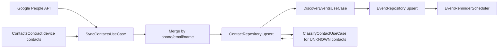
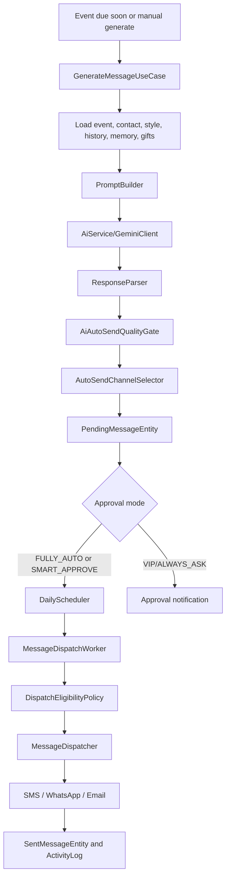
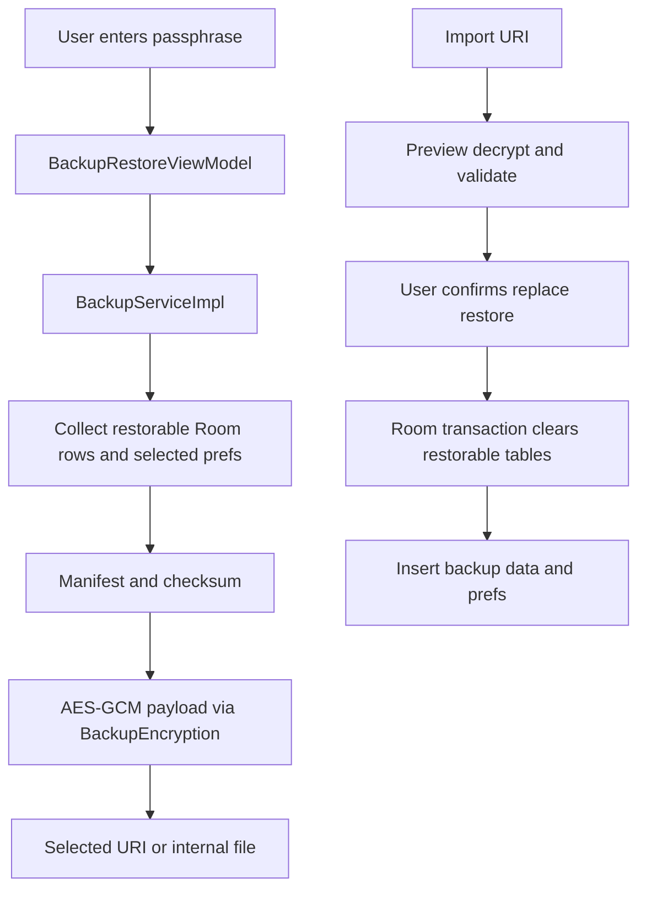

# RelateAI Production Rebuild Plan

Generated: 2026-06-27
Status: Authoritative rebuild plan for this repository
Primary product in this repo: RelateAI, an Android relationship assistant for contacts, events, AI wishes, approval-based automation, delivery, analytics, backup, and recovery.

This file is the single source of truth for rebuilding the project from scratch. It is grounded in repository evidence only: Gradle files, Android manifest and resources, Kotlin source, Room schemas, tests, CI, local reports, and checked-in docs. Anything not verified in those sources is marked as not part of the rebuild.

## 0. Operating Rules

1. Treat `PLAN.md` as the rebuild contract. Older planning files are historical inputs only.
2. Do not implement features from `docs/startup-idea/*`; those files describe "LeadRescue AI", a different product.
3. Preserve verified RelateAI behavior unless this plan explicitly calls it debt, a bug, or a product cut.
4. Keep all recommendations traceable to source files. When a behavior is inferred from multiple files, the relevant evidence paths are listed.
5. Favor safety over automation. This app sends messages on behalf of the user, reads contacts, stores relationship data, and can use Accessibility for WhatsApp, so reviewability, auditability, and consent are product requirements.

## 1. Evidence Map

Primary evidence used for this plan:

| Area | Evidence |
| --- | --- |
| Build graph | `settings.gradle.kts`, root `build.gradle.kts`, `gradle/libs.versions.toml`, module `build.gradle.kts` files |
| App runtime | `app/src/main/AndroidManifest.xml`, `app/src/main/java/com/example/MainActivity.kt`, `RelateAIApp.kt`, navigation under `app/src/main/java/com/example/ui/navigation` |
| Domain behavior | `core/domain/src/main/kotlin/com/example/domain`, Room entity classes under `core/domain/src/main/kotlin/com/example/core/db/entities` |
| Data/runtime implementation | `core/data/src/main/kotlin/com/example/core`, repositories under `core/data/src/main/kotlin/com/example/data/repository` |
| UI | `app/src/main/java/com/example/ui`, `core/ui/src/main/kotlin/com/example/core/ui`, strings and XML resources under `app/src/main/res` |
| Storage | `core/data/src/main/kotlin/com/example/core/db/AppDatabase.kt`, `core/data/schemas/com.example.core.db.AppDatabase/15.json` |
| Tests | `app/src/test`, `app/src/androidTest`, `core/domain/src/test`, `core/data/src/test` |
| Release and CI | `.github/workflows/android.yml`, `app/build.gradle.kts`, `ProductionReadinessConfigTest.kt` |
| Local diagnostics | `lint_baseline_pre_fixes.txt`, `logs/*.log`, `.intelligence/enterprise-diagnostics/latest-report.json` |
| Architecture docs | `docs/architecture/adr/*.md`, `docs/architecture/target-room-schema.md` |
| Historical docs | `SSOT.md`, old `PLAN.md`, `IMPLEMENTATION_PROGRESS.md` |

Important evidence caveat: `lint_baseline_pre_fixes.txt` is a June 7 pre-fix snapshot. Current Gradle files now enable core library desugaring in `app` and `core:data`, so its Java time errors may be stale. Its native library and dependency warnings still need a fresh lint run.

## 2. Product Definition

RelateAI helps a user maintain personal relationships by syncing contacts, discovering important dates, generating personalized messages, collecting memories and gift history, scheduling reminders, requiring approval where needed, sending through configured channels, and reporting relationship health.

Verified product pillars:

- Contact intelligence: Google Contacts and device contacts import, deduplication, relationship classification, enrichment, memories, gifts, and health scoring.
- Event planning: birthdays, anniversaries, work anniversaries, custom events, duplicate/conflict detection, and reminders.
- AI message drafting: Gemini/Firebase Vertex AI generation, six draft variants, prompt context from contact data, style profile, memories, gifts, previous messages, fallback templates, regeneration with feedback.
- Approval-first automation: modes `DEFAULT`, `FULLY_AUTO`, `SMART_APPROVE`, `VIP_APPROVE`, `ALWAYS_ASK`, quality downgrades, quiet hours, blackout dates, channel blackouts, exact alarm or WorkManager scheduling.
- Delivery: SMS, WhatsApp via Accessibility, and email through Gmail SMTP app password.
- Review and recovery: Messages inbox, Wish Preview, test send, activity history, AI Doctor, notifications, and failed-send recovery.
- Local data protection: SQLCipher database, EncryptedSharedPreferences, encrypted backup/export/import, backup exclusions from Android auto backup.
- Insights: dashboard, analytics, CSV export, widget, shortcuts, localization.

Not part of the rebuild unless a future product decision adds them:

- Lead capture, missed-call rescue, web-form lead workflows, business CRM flows, and revenue-plan items from `docs/startup-idea/*`.
- A server backend, admin console, shared accounts, multi-device sync, or remote observability pipeline. No source evidence shows these are implemented.
- Calendar provider integration beyond event concepts. Current source does not show a calendar API sync implementation.
- Merge restore. Current backup UI and service explicitly implement replace restore only.

## 3. Current Repository Snapshot

### 3.1 Modules

Current Gradle modules:

```text
:app
:core:model
:core:domain
:core:data
:core:ui
```

Current dependency direction:

```text
app -> core:domain
app -> core:data
app -> core:ui
core:data -> core:domain
core:domain -> core:model
core:ui -> standalone UI components/theme
core:domain -> Room runtime, Paging runtime, coroutines, javax.inject
core:model -> Kotlin/JVM only
```

This graph works but is not clean domain-driven architecture. Completed 2026-06-27: the existing pure enum model package moved to the new `:core:model` JVM module and `:core:domain` re-exports it for compatibility. The domain module still contains Room entities in package `com.example.core.db.entities` and still depends on Room/Paging, so full domain purity remains pending.

### 3.2 Toolchain

Verified from Gradle:

- Android Gradle Plugin 9.2.1.
- Kotlin 2.2.10.
- JDK toolchain 21 at root; Android compile target Java 17.
- compileSdk 37 in `app`, `core:data`, and `core:domain`; `core:model` is a Kotlin/JVM module targeting Java 17 with the JDK 21 toolchain.
- minSdk 24, app targetSdk 36.
- Compose enabled in `app`.
- Hilt, KSP, Room, WorkManager, SQLCipher, Security Crypto, Biometric, Firebase Auth, Firebase Vertex AI, Firebase Analytics, Google People API, Google AI client, Retrofit/OkHttp/Moshi, JavaMail, Paging, Coil.
- Core library desugaring enabled in `app` and `core:data`.
- Release minification and resource shrinking are enabled, and release signing fails if `KEYSTORE_PATH`, `STORE_PASSWORD`, `KEY_ALIAS`, or `KEY_PASSWORD` are missing.

### 3.3 Runtime Surfaces

Verified from manifest/resources/source:

- `MainActivity` is launcher and handles deep links for `relateai://home`, `relateai://wish`, `relateai://contact`, `relateai://contacts`, `relateai://messages`, `relateai://settings`, and `relateai://backup-restore`.
- `RelateAIApp` initializes security checks, notification channels, encrypted database/key material, secure prefs, and scheduled workers.
- `WhatsAppAccessibilityService` is declared with `BIND_ACCESSIBILITY_SERVICE`, scoped to `com.whatsapp` and `com.whatsapp.w4b`.
- Receivers: message dispatch, approval actions, event reminders, boot recovery, SMS status, birthday widget.
- FileProvider exposes only cache analytics exports.
- Android auto backup is disabled, and backup/data extraction rules exclude database and secure preference files.
- Network security config pins Google/Firebase/Gmail related domains until 2027-06-01; CI fails release-readiness tests once the soonest pin expiration is within 60 days.
- App widget shows birthdays, next events, and pending approval count.
- Shortcuts exist for compose and contacts. Completed 2026-06-27: compose now routes to the current Messages workflow via `relateai://messages`, and contacts routes to Contact List via `relateai://contacts`.
- Birthday widget click-through exists. Completed 2026-06-27: widget taps route to Messages when pending approvals are present; otherwise they route to Home.

### 3.4 Navigation

Current route set from `Screen.kt` and `NavGraph.kt`:

```text
splash
onboarding
auth
home
contacts
contacts/{contactId}
events
messages
settings
analytics
activity-history
wish/{contactId}/{messageRef}
chat-history/{contactId}
style-coach
backup-restore
automation-setup
memory-vault/{contactId}
gift-advisor/{contactId}
```

Deep links wired in navigation:

```text
relateai://home
relateai://contact/{contactId}
relateai://contacts
relateai://messages
relateai://wish/{contactId}/{messageRef}
relateai://settings
relateai://backup-restore
```

Completed 2026-06-27: `relateai://backup-restore` is now declared in the manifest, registered in `NavGraph`, and built through the shared `RelateDeepLinks` contract used by `NotificationHelper`. Completed 2026-06-27: shortcut routes now reuse the same contract for `relateai://messages` and `relateai://contacts`. Completed 2026-06-27: widget click-through now uses the shared contract for `relateai://home` and `relateai://messages`.

## 4. Feature Inventory

Each row reflects behavior found in code, tests, or resources.

| Feature | Current behavior | Key evidence | Rebuild stance |
| --- | --- | --- | --- |
| Splash routing | Routes to home/auth/onboarding based on auth and onboarding flags | `SplashViewModel`, `NavGraph` | Keep |
| Onboarding | Product intro plus setup checklist entry to AI Doctor | `OnboardingScreen`, string resources | Keep, make setup completion measurable |
| Google auth | Google sign-in, Firebase credential, contacts scope, config validation | `AuthViewModel`, `AuthManager` | Keep with explicit consent copy |
| Guest mode | Bypass sign-in stores guest mode and can use mock contacts | `AuthManager`, `SyncContactsUseCase` | Keep for local/demo only; production flag it |
| Sign out | Cancels WorkManager, notifications, clears DB and secure prefs, revokes/signs out | `AuthManager.signOut`, `SettingsViewModel` | Keep; remove duplicate clearing in Settings VM |
| Biometric lock | Optional biometric/device credential gate | `BiometricLockPolicy`, `BiometricAuthManager`, `MainActivity` | Keep |
| Permissions | Requests SMS and notifications from app shell; contacts permission used during sync flows | `MainActivity`, `SettingsViewModel`, manifest | Keep, make permission UI channel-specific |
| Contact sync | Google People API plus device contacts, merge by phone/email/name, guest mock contacts | `GoogleContactsSync`, `DeviceContactsReader`, `SyncContactsUseCase` | Keep, centralize sync state and deletion semantics |
| Contact enrichment | Nickname, relationship, language, channel, formality, style, interests, notes, sensitive topics, life phase, budgets | `ContactEntity`, `UpdateContactPreferencesUseCase` | Keep, type JSON fields |
| AI classification | Classifies relationship/language/style for unknown contacts | `ClassifyContactUseCase`, `AiService` | Keep, fix confidence persistence |
| Health scoring | Refreshes contact health from interactions, consecutive wishes, stale contact signals | `RefreshHealthScoresUseCase` | Keep, document formula |
| Event discovery | Creates birthday/anniversary/work anniversary events from contact fields | `DiscoverEventsUseCase`, `EventDiscoveryWorker` | Keep; duplicate worker logic removed 2026-06-27 |
| Manual events | Create custom/manual contact events with duplicate/date conflict handling | `SaveManualEventUseCase`, `EventsViewModel` | Keep |
| Event conflict resolution | Merge or keep separate duplicate/conflicting events | `EventResolutionPolicy`, `ResolveEventConflictUseCase` | Keep |
| AI wish generation | Generates six variants, detects duplicate occurrence, fallback templates, quality gate | `GenerateMessageUseCase`, `PromptBuilder`, `ResponseParser` | Keep, improve event lookup and outcome taxonomy |
| Regeneration | Regenerates pending message with optional feedback and status preservation | `RegeneratePendingMessageUseCase`, `WishPreviewViewModel` | Keep |
| Wish preview | Variant selection, edit, readiness, why signals, test send, approve/reject, next review | `WishPreviewViewModel`, `WishPreviewScreen` | Keep, block too-short approval or make warning explicit |
| Feedback | Saves feedback reason/instruction and activity log | `MessageFeedbackEntity`, `WishPreviewViewModel` | Keep |
| Message inbox | Needs review, scheduled, blocked, failed, sent buckets; bulk approve/reject/retry | `MessagesViewModel`, `MessagesScreen` | Keep, clarify pending table vs pending status |
| Approval modes | Global/contact modes, relationship-sensitive overrides, skip auto wish | `ApprovalModeResolver` | Keep |
| Scheduling | Exact alarm when allowed, WorkManager fallback, quiet hours, blackout dates | `DailyScheduler`, `AutomationSchedulePolicy` | Keep with exact alarm policy review |
| SMS delivery | Multipart SMS with sent/delivered broadcasts | `SmsSender`, `SmsStatusReceiver` | Keep behind explicit permission |
| WhatsApp delivery | Accessibility-driven wa.me flow, exact text verification, queue | `WhatsAppAccessibilityService`, `WhatsAppSender` | Keep only as opt-in high-risk channel |
| Email delivery | Gmail SMTP with app password and STARTTLS | `EmailSender`, `EmailSubjectBuilder` | Keep; isolate credentials and improve error UX |
| Revival messages | Low-health reconnect suggestions | `RevivalWorker`, `RevivalCadencePolicy` | Keep, persist synthetic occasion |
| Holiday messages | Fixed holiday wishes within 7 days | `HolidayWishWorker` | Keep only if product confirms holiday list; persist occasion |
| Follow-up messages | Post-event follow-up for sent messages with no reply | `PostEventFollowUpWorker` | Keep, fix event type/id modeling |
| Notifications | Approval, event reminder, revival, dispatch/system channels | `NotificationHelper`, receivers | Keep, contract-test routes/actions |
| Activity history | Persistent logs with type/severity/status and filters | `ActivityLogEntity`, `ActivityHistoryViewModel` | Keep; expand as audit trail |
| Analytics | Relationship report, health buckets, monthly sent, delivery reliability, response rate, CSV export | `GetAnalyticsUseCase`, `AnalyticsReportServiceImpl`, UI | Keep |
| Style Coach | Manual/recent-message writing profile with history | `StyleAnalysisUseCase`, `StyleCoachViewModel` | Keep |
| Memory Vault | Per-contact notes, categories, pin/delete, max length | `MemoryNoteRecord`, `MemoryNoteRepository`, `MemoryVaultViewModel` | Keep |
| Gift Advisor | Gift history, budget stats, AI suggestions | `GiftHistoryRecord`, `GiftHistoryRepository`, `GiftAdvisorViewModel` | Keep |
| Backup/restore | Encrypted export/import, v2 manifest/checksum, replace mode, preview | `BackupServiceImpl`, `BackupEncryption`, `BackupRestoreViewModel` | Keep; no merge restore in initial rebuild |
| AI Doctor | Setup/readiness diagnostics for AI, permissions, channels, exact alarms, WorkManager, errors, DLQ | `AutomationSetupViewModel` | Keep; make checks persistent and actionable |
| Widget | Today birthdays, next events, pending approvals | `BirthdayWidgetProvider`, widget XML | Keep; add click actions |
| Shortcuts | Compose and contacts launcher shortcuts | `shortcuts.xml` | Keep; add destination intents |
| Localization | English and Hindi string tables with parity tests | `values/strings.xml`, `values-hi/strings.xml`, `LocalizationParityTest` | Keep; add translation quality pass |

## 5. Current Architecture and Flow Diagrams

### 5.1 Startup


### 5.2 Contact and Event Pipeline



Completed 2026-06-27: `EventDiscoveryWorker` now delegates to `DiscoverEventsUseCase`, so contact-derived birthday, anniversary, and work anniversary discovery share one tested domain path.

### 5.3 Message Generation and Dispatch



### 5.4 Backup Flow



## 6. Verified Data Model

Current Room database version: 15.

Current tables:

- `contacts`
- `events`
- `pending_messages`
- `sent_messages`
- `activity_logs`
- `message_feedback`
- `style_profiles`
- `style_profile_history`
- `memory_notes`
- `gift_history`
- `dispatch_attempts`
- `diagnostic_snapshots`

Current important constraints and indexes:

- `events.contactId` cascades on contact delete.
- `pending_messages.contactId` cascades on contact delete.
- `pending_messages.eventId` is indexed and participates in uniqueness, but is not a Room foreign key in version 16.
- `pending_messages` has unique `(contactId, eventId, scheduledYear)`.
- `sent_messages.contactId` sets null on contact delete.
- `dispatch_attempts.messageDraftId` cascades to `pending_messages.id`; nullable `contactId` and `occasionId` set null, with `occasionId` temporarily referencing the existing `events` compatibility table.
- Dispatch-attempt recovery indexes cover `(messageDraftId, requestedAtMs)`, `(result, nextRetryAtMs)`, `deadLetteredAtMs`, `(contactId, requestedAtMs)`, and `occasionId`.
- Events have active/next occurrence indexes.
- Contacts have revival and active indexes.

Important modeling observations:

- `ContactEntity` is a large aggregate containing identity, Google/device sync metadata, important dates, channel preferences, AI classification, health, automation, gift budgets, JSON personalization fields, notes, archive/delete flags.
- `EventEntity` stores date source, confidence, verification, conflict state, and next occurrence.
- `PendingMessageEntity` stores six generated variants plus selected text, approval mode, status, quality, schedule, channel, AI model, fallback marker, and user edit fields.
- Completed 2026-06-27: `SentMessageEntity` separates nullable `eventId` from semantic `occasionType` and optional `occasionLabel`; legacy `eventType` remains as a compatibility alias.
- Completed 2026-06-27: holiday, revival, and follow-up workers persist deterministic synthetic `EventEntity` rows before pending messages are created.
- Completed 2026-06-27: `dispatch_attempts` exists as a Room v15 table with DAO, pure-model mapper, migration test, backup v3 export/import support, and production orchestration writes from `DispatchMessageUseCase`, `MessageDispatchWorker`, and `MessageDispatcher`. Retry scheduler integration and recovery UI are still pending.
- Many JSON fields are raw strings (`interestsJson`, `favoritesJson`, `metadataJson`, blackout JSON, etc.). Rebuild should keep storage flexible but expose typed serializers and validated value objects.

## 7. Critical Findings and Debt Registry

Severity definitions:

- P0: Can misroute user action, send/count/report incorrectly, lose auditability, or block safe production release.
- P1: Significant maintainability, UX, correctness, or reliability issue.
- P2: Cleanup or hardening that should be planned but is not release-blocking by itself.

| ID | Severity | Finding | Evidence | Required rebuild action |
| --- | --- | --- | --- | --- |
| D-001 | P0 | Completed 2026-06-27: backup restore notification deep link is declared in manifest/NavGraph and shares the route contract used by notifications. | `RelateDeepLinks.kt`, `AndroidManifest.xml`, `NavGraph.kt`, `NotificationHelper.kt`, `DeepLinkContractTest.kt`, `RelateDeepLinksTest.kt`, `RouteArgumentCodecTest.kt` | Keep route contract tests green; shortcut and widget route contracts were completed in D-013/D-143/D-144. |
| D-002 | P0 | Completed 2026-06-27: AI classification confidence is passed through the use case and repository contract to the DAO instead of being hard-coded to `1.0`. | `ClassifyContactUseCase.kt`, `ContactRepository.kt`, `ContactRepositoryImpl.kt`, `ContactDao.kt`, `ClassifyContactUseCaseTest.kt`, `ContactRepositoryImplTest.kt` | Keep classification confidence regression tests green. |
| D-003 | P0 | Completed 2026-06-27: sent history now separates resolved event ids from semantic occasion type/label while retaining `eventType` as a compatibility alias. | `SentMessageEntity.kt`, `AppDatabase.kt`, `14.json`, `MessageDispatcher.kt`, `SentMessageDao.kt`, `PostEventFollowUpWorker.kt`, `MigrationTest.kt`, `MessageDispatcherTest.kt` | Keep v13-to-v14 migration and sent-message occasion contract tests green. |
| D-004 | P0 | Completed 2026-06-27: dashboard pending count now uses `MessageRepository.countPending()`, which delegates to the DAO query filtered to `status = 'PENDING'`. | `GetDashboardMetricsUseCase.kt`, `MessageRepository.kt`, `MessageRepositoryImpl.kt`, `PendingMessageDao.kt`, `GetDashboardMetricsUseCaseTest.kt` | Keep dashboard metrics tests green and avoid using `getAllPending().size` for status-specific metrics. |
| D-005 | P0 | Completed 2026-06-27: event discovery worker delegates to the shared domain discovery use case instead of owning duplicate DAO/date logic. | `DiscoverEventsUseCase.kt`, `EventDiscoveryWorker.kt`, `EventRepository.kt`, `EventDao.kt`, `EventDiscoveryWorkerTest.kt`, `DiscoverEventsUseCaseTest.kt`, `AutomationPipelineTest.kt` | Keep worker delegation and contact-derived event deactivation regression tests green. |
| D-006 | P0 | Completed 2026-06-27: holiday, revival, and follow-up workers now persist deterministic synthetic `EventEntity` rows before pending messages are created. | `HolidayWishWorker.kt`, `RevivalWorker.kt`, `PostEventFollowUpWorker.kt`, worker tests | Keep synthetic event persistence tests green; later target schema can still replace this compatibility layer with a dedicated `occasions` table. |
| D-007 | P1 | Domain module depends on Room/Paging and contains persistence entities. | `core/domain/build.gradle.kts`, entity package under `core/domain`, ADR 0001 | Move Room entities to database/data module; domain owns pure models and policies. |
| D-008 | P1 | Completed 2026-06-27: message generation and regeneration no longer scan all events with `getEventsBefore(Long.MAX_VALUE)`. | `GenerateMessageUseCase`, `RegeneratePendingMessageUseCase`, `EventRepository.getOccasionById`, `EventRepositoryImplTest` | Keep the direct occasion lookup tests green; continue occurrence-specific draft/idempotency query hardening in the broader `message_drafts` migration. |
| D-009 | P1 | Completed 2026-06-27: Contact Detail now treats the first upcoming occasion as a generic upcoming event in UI state and copy, while the separate contact birthday field remains birthday-specific. | `ContactDetailViewModel.kt`, `ContactDetailScreen.kt`, `strings.xml`, `values-hi/strings.xml`, Contact Detail tests | Keep Contact Detail tests green and avoid reintroducing birthday-specific labels for `getNextUpcomingPreviewForContact()` results unless the data source is narrowed to birthdays only. |
| D-010 | P1 | Completed 2026-06-27: Wish Preview treats `TOO_SHORT` as a blocking readiness state in ViewModel approval and Compose button state. | `WishPreviewViewModel.kt`, `WishPreviewScreen.kt`, strings, Wish Preview tests | Keep short-draft approval blocker tests green. |
| D-011 | P1 | Completed 2026-06-27: dispatch failure/dead-letter recovery is persisted in `dispatch_attempts`, AI Doctor ignores the legacy in-memory `DeadLetterQueue` count, and recent `HealthMonitor` evidence is persisted through Room v16 `diagnostic_snapshots`. AI Doctor also persists redacted report snapshots and reads recent persisted health warnings after process restart. | `DeadLetterQueue`, `HealthMonitor`, `HealthMonitorDiagnosticRecorder`, `DiagnosticSnapshotRepository`, `AutomationSetupViewModel`, ADR 0003, `dispatch_attempts`, `diagnostic_snapshots` | Keep D-155/D-156 migration, recorder, and AI Doctor regression tests green; continue separate retry-execution and broader target-schema work outside this completed durability slice. |
| D-012 | P1 | Completed 2026-06-27: Settings sign-out now delegates to `AuthManager.signOut()` only; local data wipe, secure-pref clearing, database-key clearing, worker cancellation, notifications, and auth revocation remain centralized in the auth orchestrator. | `SettingsViewModel.kt`, `SettingsScreen.kt`, `AuthManager.kt`, `SettingsViewModelTest.kt` | Keep the single-orchestrator regression test green and do not reintroduce direct data-wipe calls in Settings. |
| D-013 | P1 | Completed 2026-06-27: shortcut intents now carry explicit shared deep-link data, routing Compose to the current Messages workflow and Contacts to the Contact List; widget click-through also uses shared route contracts. | `shortcuts.xml`, `RelateDeepLinks.kt`, `AndroidManifest.xml`, `NavGraph.kt`, `BirthdayWidgetProvider.kt`, route/shortcut/widget tests | Keep route contract tests green. |
| D-014 | P1 | In progress 2026-06-27: reviewed Hindi quality slices now cover shortcuts/widget summary text, onboarding/setup copy, Memory Vault prompts, Contact Detail, Chat History, Wish Preview, Dashboard quick actions, Analytics summary labels, Events, Messages queue/activity strings, AI Doctor setup/diagnostics, Settings email/quiet-hours/biometric/channel setup, contact preferences, personalization-quality copy, failed-send recovery, and readiness/secondary analytics labels. Remaining Latin scan is limited to accepted product/provider/channel/acronym/enum/date-format terms such as RelateAI, WhatsApp, Google/Gemini/Firebase/Gmail/API/WorkManager, approval-mode constants, and date patterns. | `values-hi/strings.xml`, `LocalizationParityTest` | Continue D-014 with screenshot/native-speaker review at large font scale and any remaining non-primary strings that read awkwardly in context before closing the full localization quality item. |
| D-015 | P1 | Completed 2026-06-27: manifest no longer declares `USE_EXACT_ALARM`; it keeps `SCHEDULE_EXACT_ALARM` for user-visible scheduled sends/reminders while existing scheduler code checks `canScheduleExactAlarms()` and falls back to WorkManager or inexact alarms. | `AndroidManifest.xml`, `DailyScheduler.kt`, `EventReminderScheduler.kt`, `ProductionReadinessConfigTest.kt` | Keep the manifest policy regression test green and do not add `USE_EXACT_ALARM` unless product scope changes to a qualifying alarm/calendar category and policy review is documented. |
| D-016 | P1 | In progress 2026-06-27: Accessibility-based WhatsApp sending is powerful and fragile. Typed sender failure reasons now flow from `WhatsAppAccessibilityService` through `WhatsAppSender` into dispatcher provider-failure metadata for service disabled, locked device, app not found, compose field not found, text verification failed, send button not found, and timeout paths. App-level WhatsApp automation consent is now stored in `SecurePrefs`, managed from AI Doctor, backed up/restored as an automation preference, and enforced before the dispatcher can call `WhatsAppSender`; the existing no-send AI Doctor dry run surfaces missing consent as a setup blocker. The WhatsApp Accessibility policy/release packet is now documented, but Play Accessibility declaration acceptance, Data Safety consistency review, and release-owner signoff remain open. | `WhatsAppAccessibilityService`, `WhatsAppSendResult`, `WhatsAppSender`, `DispatchProviderRetryPolicy`, `MessageDispatcherRouteAdapters`, `SecurePrefs`, `AutomationSetupViewModel`, `AutomationSetupScreen`, accessibility XML, `docs/security/privacy-and-permissions.md`, `docs/operations/release-checklist.md` | Continue with formal Play policy review/signoff and final D-016 release notes before closing D-016. |
| D-017 | P1 | In progress 2026-06-27: fresh installs now generate random 256-bit SQLCipher key material, store it in Keystore-backed `EncryptedSharedPreferences`, and pass it to SQLCipher as a raw-key literal. Deterministic Android ID/app-signature derivation is retained only as legacy recovery when database files already exist but cached key material is missing. Backup/recovery docs now separate backup passphrases from live database keys and document destructive local-key-loss behavior. | `DatabaseKeyDerivation`, `DatabaseKeyDerivationTest`, ADR 0004, `docs/user/backup-restore.md`, privacy and release docs | Continue with tested SQLCipher rekey migration or explicit release decision for existing legacy-derived databases, then validate encrypted open, sign-out, backup preview, wrong-passphrase failure, and restore on device/emulator. |
| D-018 | P1 | Completed 2026-06-27: certificate pins still expire on 2027-06-01, but `SecurityChecks` now exposes a 60-day release gate and CI runs `ProductionReadinessConfigTest`, which parses `network_security_config.xml` and fails when the soonest pin expiration is within 60 days. | `network_security_config.xml`, `SecurityChecks`, `SecurityChecksTest`, `ProductionReadinessConfigTest`, `.github/workflows/android.yml` | Keep the CI guardrail green by rotating pins before 2027-04-02 or whenever the configured expiration changes. |
| D-019 | P2 | In progress 2026-06-28: Core UI still has partial screenshot coverage and `RelateAITheme` remains dark-only, but the first design-system foundation, validation, and screen-tokenization slices now document the UX audit, screen ownership, component rules, shared spacing/radius/size/alpha/elevation/fraction tokens, screenshot strategy, and test strategy; shared components consume the tokens, `DesignSystemTokensTest` guards the token contract, and AI Doctor, Splash, Onboarding, Auth, Home, Contact List, Wish Preview, Backup/Restore, Contact Detail, Events, Messages, Chat History, Settings, Analytics, Activity History, Gift Advisor, Style Coach, and Memory Vault now use shared tokens for their major dashboard/action/card/startup surfaces. The reviewed screen-local token scan is clean, Roborazzi is wired for JVM screenshot validation with Splash, Auth, Onboarding, Home, and Messages compact-phone baselines including large-font startup/Home/Messages states plus Home/Messages loading states, the app Robolectric suite defaults to a plain test `Application`, and the standard debug gate passes. | `core/ui`, `RelateAITheme`, `AutomationSetupScreen`, `SplashScreen`, `OnboardingScreen`, `AuthScreen`, `HomeScreen`, `ContactListScreen`, `WishPreviewScreen`, `BackupRestoreScreen`, `ContactDetailScreen`, `EventsScreen`, `MessagesScreen`, `ChatHistoryScreen`, `SettingsScreen`, `AnalyticsScreen`, `ActivityHistoryScreen`, `GiftAdvisorScreen`, `StyleCoachScreen`, `MemoryVaultScreen`, `DesignSystemTokensTest`, `AuthScreenshotTest`, `OnboardingScreenshotTest`, `SplashScreenshotTest`, `HomeScreenshotTest`, `MessagesScreenshotTest`, `robolectric.properties`, `docs/design/ux-audit-checklist.md`, `docs/design/design-system.md`, `docs/testing/test-strategy.md`, `docs/testing/screenshot-strategy.md` | Continue with broader Roborazzi baselines for Wish Preview, Contact Detail, Events, AI Doctor, Settings, Backup/Restore, Analytics, Activity History, and contextual tools; add Hindi visual checks, typical-phone variants, and light/dynamic theme decision. |
| D-020 | P2 | Local logs are mostly VS Code/extension diagnostics, not app production telemetry. | `logs/*.log`, `.intelligence/latest-report.json` | Do not treat them as app runtime logs; build app-owned observability. |
| D-021 | P2 | Historical docs are large and overlapping. | `SSOT.md`, old `PLAN.md`, `IMPLEMENTATION_PROGRESS.md` | Keep `PLAN.md` authoritative; archive or clearly label historical docs. |

## 8. Target Domain-Driven Architecture

### 8.1 Bounded Contexts

Use these bounded contexts in the rebuild:

| Context | Owns | Must not own |
| --- | --- | --- |
| Identity and Session | Google/Firebase auth state, guest mode, sign-out orchestration, biometric lock policy | Contact merge logic, message generation |
| Contact Graph | Contact identity, source records, deduplication, preferences, enrichment, memories, gifts | AI provider details, delivery APIs |
| Relationship Intelligence | Classification, health scoring, personalization quality, style profile | Room DAOs, UI strings |
| Occasion Planning | Birthdays, anniversaries, work anniversaries, custom events, holidays, revival, follow-ups, conflict resolution | Message transport |
| Message Creation | Prompt context, AI request/response parsing, variants, feedback, quality gate | SMS/WhatsApp/Gmail APIs |
| Approval and Dispatch | Approval modes, eligibility, schedules, quiet hours, channel selection, send attempts, delivery status | Contact import |
| Insights and Audit | Activity logs, analytics aggregates, exports, diagnostics, setup readiness | Business rules that mutate contacts/messages |
| Data Protection | SQLCipher keying, secure prefs, backup/export/import, recovery warnings | Feature-specific UI |

### 8.2 Target Module Graph

Preferred production module graph:

```text
:app

:core:common
:core:model
:core:domain
:core:database
:core:datastore
:core:data
:core:network
:core:ai
:core:automation
:core:designsystem
:core:testing

:feature:auth
:feature:onboarding
:feature:home
:feature:contacts
:feature:events
:feature:messages
:feature:wishpreview
:feature:settings
:feature:analytics
:feature:activity
:feature:stylecoach
:feature:memory
:feature:gifts
:feature:backup
:feature:setupdoctor
:feature:widget
```

Minimum acceptable rebuild if module count must stay smaller:

```text
:app
:core:model
:core:domain
:core:data
:core:automation
:core:ui
```

Hard dependency rules:

```text
feature:* -> core:domain, core:model, core:designsystem
core:data -> core:domain, core:model, core:database, core:network, core:ai, core:datastore
core:automation -> core:domain, core:model, core:data abstractions only
core:domain -> core:model, core:common only
core:model -> Kotlin only
core:database -> Room/SQLCipher only
core:ai -> provider SDKs and prompt/parse adapters
app -> composition, navigation host, permissions, DI, process setup
```

Forbidden:

- Room annotations in `core:domain`.
- Android `Context` in use cases or domain policies.
- UI strings in domain.
- Provider SDK objects crossing into domain.
- Raw JSON string construction outside serializers.
- Message sending from UI classes.

### 8.3 Target Package Shape

```text
core/model/
  contact/
  occasion/
  message/
  dispatch/
  analytics/
  backup/
  common/

core/domain/
  contact/
    MergeContactsUseCase
    UpdateContactPreferencesUseCase
    ContactHealthPolicy
  occasion/
    DiscoverOccasionsUseCase
    ResolveOccasionConflictUseCase
    OccasionIdentityPolicy
    OccasionDatePolicy
  message/
    GenerateMessageUseCase
    RegenerateMessageUseCase
    ApproveMessageUseCase
    RejectMessageUseCase
    MessageQualityPolicy
  dispatch/
    ApprovalModeResolver
    DispatchEligibilityPolicy
    SchedulePolicy
    ChannelSelectionPolicy
  backup/
    ExportBackupUseCase
    PreviewBackupUseCase
    ImportBackupUseCase
  diagnostics/
    RunSetupDiagnosticsUseCase

core/database/
  entity/
  dao/
  migrations/
  converters/

core:data/
  repository/
  sync/
  backup/
  preferences/
  analytics/

core:ai/
  GeminiClient
  PromptBuilder
  ResponseParser
  AiRedactionPolicy

core:automation/
  workers/
  receivers/
  scheduler/
  sender/
  notifications/
  accessibility/
```

## 9. Target Domain Model

### 9.1 Aggregates

Contact aggregate:

- `ContactId`
- source identities: Google person id, device contact id
- display name and optional nickname
- contact methods: phone numbers, email addresses
- relationship classification and confidence
- personalization: language, channel, formality, style, interests, hobbies, favorites, sensitive topics, life phase, notes
- automation preferences: approval mode, skip auto wish, custom send time, budgets
- health metrics: health score, engagement, interaction frequency, last interaction, last wished, revival attempts
- lifecycle: archived/deleted

Occasion aggregate:

- `OccasionId`
- `ContactId`
- `OccasionType`: birthday, anniversary, work anniversary, custom, holiday, revival, follow-up
- date rule: month/day/year or relative/generated occurrence
- source: Google, device, manual, system, AI inferred
- confidence and verification
- conflict group/id
- next occurrence
- reminder policy
- active/inactive lifecycle

Message aggregate:

- `MessageId`
- `ContactId`
- `OccasionId`
- scheduled year/occurrence id
- variants and selected draft
- AI metadata and fallback flag
- quality score and quality signals
- selected channel
- approval mode and status
- schedule
- user edit fields
- feedback records

Dispatch aggregate:

- `DispatchAttemptId`
- `MessageId`
- channel route
- eligibility decision
- request timestamp and resolved send timestamp
- send result and delivery status
- provider metadata redacted
- retry/dead-letter state

Audit aggregate:

- `ActivityLogId`
- type/severity/status
- actor: system/user/worker/receiver
- entity references
- redacted metadata
- created timestamp

### 9.2 Invariants

- A message occurrence is unique by `(contactId, occasionId, scheduledYear)` unless explicitly regenerating a failed occurrence.
- A message cannot be dispatched unless eligibility policy returns `SendNow` or an explicit user-approved override exists.
- `FULLY_AUTO` is never allowed if the contact has `skipAutoWish=true`, no viable channel, low AI quality, or fallback generic draft.
- `VIP_APPROVE` and `ALWAYS_ASK` must produce review notifications, not silent sends.
- Quiet hours and blackout dates apply to scheduled automatic sends.
- Channel blackout applies to all automatic route decisions.
- Event/occasion identity must be deterministic for canonical contact dates.
- Synthetic occasions must be persisted before creating pending messages.
- Sign-out must cancel workers/alarms/notifications before deleting local stores.
- Imported backups must be previewed and checksum-validated before mutating the database.
- Raw provider errors, API keys, OAuth tokens, SMTP passwords, phone numbers, emails, and generated private text must not be written to logs.

## 10. Target Data Model Changes

Keep existing tables only where they map cleanly. Introduce migration or rebuild equivalents:

| Target table | Purpose | Notes |
| --- | --- | --- |
| `contacts` | Canonical user-visible contact | Split source sync records if dedup becomes complex |
| `contact_methods` | Phone/email/channel reachability | Avoid stuffing multiple fields into `contacts` |
| `contact_sources` | Google/device ids, etags, deleted source markers | Supports source deletion reconciliation |
| `contact_preferences` | Automation and personalization preferences | Can be embedded if small |
| `contact_memory_notes` | Memory vault | Existing `memory_notes` maps here |
| `gift_history` | Gift records | Existing table maps here |
| `style_profiles` | Learned writing profile | Existing table maps here |
| `style_profile_history` | Recent snapshots | Existing table maps here |
| `occasions` | All date-based, holiday, revival, follow-up occasions | Replaces overloaded event model |
| `occasion_conflicts` | Duplicate/date conflict groups | Optional if conflict fields stay in occasions |
| `message_drafts` | Pending/approved/generated drafts | Existing `pending_messages` maps here |
| `message_feedback` | Draft feedback | Existing table maps here |
| `dispatch_attempts` | Durable send attempts and dead letters | New or expanded from `sent_messages` |
| `sent_messages` | Sent history user-facing view | Keep semantic event columns |
| `activity_logs` | Audit trail | Existing table maps here |
| `diagnostic_snapshots` | AI Doctor and health monitor results | Implemented in Room v16 for local redacted diagnostics |
| `backup_manifests` | Optional local backup history | New optional |

Migration rule for `sent_messages`:

- If old `eventType` matches an existing `events.id`, write that value to `eventId` and copy the event semantic type to `occasionType`.
- If old `eventType` is a known semantic type, write it to `occasionType` and leave `eventId` null if no event can be resolved.
- If old `eventType` starts with `REVIVAL_`, `HOLIDAY_`, or `FOLLOWUP_`, create or resolve a synthetic occasion and link it.

## 11. State Architecture

### 11.1 Sources of Truth

| State | Source of truth | UI use |
| --- | --- | --- |
| Contacts, occasions, messages, sent history, memories, gifts, style, activity | Room/SQLCipher | Observed via repositories and Flows |
| Auth user, guest mode, OAuth token, Gemini key, SMTP settings, preferences | Encrypted preferences through typed repository | Exposed as sanitized state only |
| Worker and dispatch state | Room plus WorkManager ids | UI derives readiness/recovery |
| AI Doctor health | Persisted diagnostic snapshots plus live checks | UI shows latest and rerun action |
| Navigation | Typed route contract | UI and notifications use same route builders |
| Transient UI events | ViewModel state/effects | Not persisted |

### 11.2 ViewModel Rules

- ViewModels transform domain state into screen state; they do not own business rules.
- ViewModels may call use cases only, not DAOs or provider clients.
- All user-visible failures are typed and localized through a UI text mapper.
- One-shot events such as snackbars and navigation should be explicit effects, not nullable state fields that can replay accidentally.
- Search/filter/sort can remain in ViewModels, but query-heavy lists should move to repository queries if data grows.

### 11.3 Worker Rules

- Workers must be idempotent.
- Workers must delegate business decisions to domain services/use cases.
- Workers must persist decisions and outcomes in activity/dispatch tables.
- Workers must accept stable ids, not ambiguous id-or-event-ref strings unless a migration compatibility wrapper is clearly isolated.
- WorkManager unique names and alarm request codes must be centrally defined and tested.

## 12. Integration Contracts

### 12.1 Google Sign-In, Firebase Auth, and Contacts

Current:

- Google sign-in is configured in `AuthViewModel`.
- Contacts sync uses Google People API with `contacts.readonly`.
- Sync token is stored in secure preferences.
- Device contacts import uses `READ_CONTACTS`.

Target:

- Keep contact read scope minimal and disclose why contacts are needed.
- Persist source sync metadata separately from canonical contact.
- Handle Google deleted contacts by reconciling existing source records, not by creating empty user-visible contacts.
- Keep device contacts permission contextual and recoverable.
- Add contract tests for People API URL building and sync token recovery.

### 12.2 AI Providers

Current:

- User Gemini API key path through Google AI client.
- Firebase Vertex AI fallback path when signed in.
- Model configured as `gemini-1.5-flash` in current source.
- Circuit breaker, rate limiter, redaction, fallback JSON, and parser tests exist.

Target:

- Hide provider details behind `AiGateway`.
- Version prompts and response schemas.
- Store prompt schema version and model id with each generated draft.
- Keep no-invention instructions and sensitive-topic exclusions.
- Treat fallback messages as non-automatic unless explicitly reviewed.
- Add golden prompt/response fixtures for birthday, anniversary, work anniversary, custom, holiday, revival, follow-up, sparse context, Hindi, Hinglish, and malformed JSON.

### 12.3 Delivery Channels

SMS:

- Requires `SEND_SMS`.
- Sent/delivered broadcasts update delivery status.
- Must only send approved/eligible messages.

WhatsApp:

- Requires user-enabled Accessibility service.
- Must remain opt-in, visibly scoped, and revocable.
- Must surface failure reasons: service disabled, locked device, app not found, compose field not found, text verification failed, send button not found, timeout.
- Current implementation surfaces typed failure metadata through `WhatsAppSendResult` and dispatcher provider-failure `errorType`/`errorCode`; remaining D-016 work is formal Play policy declaration acceptance, Data Safety consistency review, and release-owner signoff.
- App-level consent is required in AI Doctor before WhatsApp dispatch can call the Accessibility sender; missing consent is persisted/logged as `WHATSAPP_CONSENT_REQUIRED` and the no-send dry run reports it as a setup blocker.
- Release policy packet is documented in `docs/security/privacy-and-permissions.md` and `docs/operations/release-checklist.md`; it treats WhatsApp Accessibility automation as a high-risk Play review item, not automatically approved by the app-level checkbox.

Email:

- Uses Gmail SMTP and app password stored in secure prefs.
- Must validate setup before route selection.
- Must avoid exposing app password in logs, backups, or analytics.

Target channel selection:

```text
1. Remove channels disabled by global blackout.
2. Remove channels missing setup or contact method.
3. Prefer strongest recent successful channel when still viable.
4. Else use contact preference.
5. Else use configured fallback order.
6. If no route, force manual review with no-send reason.
```

### 12.4 Backup

Current:

- AES-GCM encrypted payload.
- PBKDF2 passphrase derivation.
- Manifest/checksum and preview before replace import.
- Max import size 25 MB.
- Secrets excluded from backup.

Target:

- Keep replace restore only for initial rebuild.
- Explicitly list included/excluded fields in backup manifest.
- Include backup schema version and minimum app version.
- Add dry-run restore tests for each supported previous schema.
- Preserve "factory reset loses local DB key" warning unless key strategy changes.

## 13. UX and Product Redesign

This section is the UI/UX single source of truth for the redesign. It is grounded in the verified Compose screens, navigation routes, ViewModels, and shared UI components in this repository. The redesign is presentation and information architecture work only: do not remove or change existing behavior unless a later implementation task validates the behavior, updates tests, and records the decision here.

### 13.1 Verified UI Surface Inventory

Verified app shell:

- Primary bottom navigation is defined by `Screen.bottomNavItems`: Home, Contacts, Events, Messages, Analytics.
- Secondary routes exist for Settings, Activity History, Wish Preview, Chat History, Style Coach, Backup/Restore, Automation Setup, Memory Vault, and Gift Advisor.
- Deep links exist for wish preview, contact detail, settings, and backup/restore.
- Bottom navigation is shown only for primary routes in `MainActivity`.

Verified major surfaces:

| Surface | Route | Evidence | Current role |
| --- | --- | --- | --- |
| Splash | `splash` | `Screen.Splash`, `NavGraph` | Startup routing. |
| Onboarding | `onboarding` | `OnboardingScreen`, `OnboardingViewModel` | Setup checklist before reliable automation. |
| Auth | `auth` | `AuthScreen` | Sign-in and debug bypass. |
| Home | `home` | `HomeScreen`, `HomeViewModel` | Operational dashboard with next actions, setup progress, stats, planner items, upcoming birthdays/events. |
| Contacts | `contacts` | `ContactListScreen`, `ContactListViewModel` | Contact search, sync, filters, sorting, and data-quality states. |
| Contact Detail | `contacts/{contactId}` | `ContactDetailScreen`, `ContactDetailViewModel` | Relationship workspace, preferences, context, automation, history links. |
| Events | `events` | `EventsScreen`, `EventsViewModel` | Occasion management, manual events, conflicts, trust/verification. |
| Messages | `messages` | `MessagesScreen`, `MessagesViewModel` | Work queue for review, scheduled, blocked, sent, failed, bulk actions. |
| Wish Preview | `wish/{contactId}/{messageRef}` | `WishPreviewScreen`, `WishPreviewViewModel` | Per-draft review, edit, regenerate, approve, reject, test send. |
| Settings | `settings` | `SettingsScreen`, `SettingsViewModel` | Global preferences, credentials, sign out, secret inputs, data links. |
| Analytics | `analytics` | `AnalyticsScreen`, `AnalyticsViewModel` | Reporting dashboard, trends, health, exports. |
| Activity History | `activity-history` | `ActivityHistoryScreen`, `ActivityHistoryViewModel` | Audit trail with filters and deep links. |
| Style Coach | `style-coach` | `StyleCoachScreen`, `StyleCoachViewModel` | Writing-style training, learned profile, history. |
| Backup/Restore | `backup-restore` | `BackupRestoreScreen`, `BackupRestoreViewModel` | Encrypted export/import and preview confirmation. |
| AI Doctor | `automation-setup` | `AutomationSetupScreen`, `AutomationSetupViewModel` | Readiness checks, recommended fixes, recovery actions. |
| Memory Vault | `memory-vault/{contactId}` | `MemoryVaultScreen`, `MemoryVaultViewModel` | Per-contact notes and pinned context. |
| Gift Advisor | `gift-advisor/{contactId}` | `GiftAdvisorScreen`, `GiftAdvisorViewModel` | Per-contact gift history, budget, AI suggestions. |
| Chat History | `chat-history/{contactId}` | `ChatHistoryScreen`, `ChatHistoryViewModel` | Per-contact sent-message history. |

### 13.2 Dashboard And Feature Necessity Audit

Dashboard definition for this plan: any screen that summarizes several workflows or exposes cross-feature shortcuts. The redesign must reduce duplicate dashboards while preserving every workflow.

| Surface | Necessary? | Current value | Restructure decision | Single owner after redesign |
| --- | --- | --- | --- | --- |
| Home | Yes | It ranks next actions, setup progress, pending count, upcoming events, backup freshness, and relationship health. | Keep as the only daily dashboard. Make it answer "What should I do now?" Do not turn it into an analytics or settings hub. | Daily triage, next action, critical alerts. |
| Messages | Yes | It is the only complete queue for needs-review, scheduled, blocked, sent, failed, and bulk message actions. | Keep as the operational message dashboard. Home may show counts and deep links only. | Message operations and approvals. |
| Analytics | Yes, but narrow | It reports trends, health, exports, neglected contacts, and delivery/personalization metrics. Some stat cards overlap Home. | Keep as the reporting dashboard. Move repeated first-viewport operational stats behind compact summary cards or trend-first layout. | Reporting, trends, exportable insight. |
| AI Doctor | Yes, secondary | It aggregates setup, quality, reliability, and recovery checks with recommended fixes. | Keep as the support/diagnostic dashboard. Do not duplicate Settings forms or Messages queue; link to exact owner screens. | Readiness, diagnostics, recovery. |
| Contacts | Yes, not a dashboard | It owns search, filters, sync, and data-quality discovery. | Keep as a primary workspace. Avoid copying its missing-data filters into Home or Analytics. | Contact discovery and data quality. |
| Events | Yes, not a dashboard | It owns occasion CRUD, filtering, duplicate/conflict resolution, and trust status. | Keep as the occasion workspace. Home may preview upcoming events only. | Occasion management. |
| Settings | Yes, not a dashboard | It owns credentials, preferences, channel/global toggles, sign out, and data links. | Keep as configuration. Remove dashboard-style status summaries from Settings if duplicated by AI Doctor. | Global configuration and secrets. |
| Contact Detail | Yes, contextual workspace | It centralizes one relationship: profile, preferences, personalization, automation, history, and generation. | Keep as the relationship detail hub. Memory, gifts, and chat remain contextual subflows. | Per-contact decisions and enrichment entry. |
| Wish Preview | Yes, transactional | It is the send-safety gate for one draft. | Keep as a focused review screen. Do not add queue browsing beyond "review next". | Per-draft safety and approval. |
| Activity History | Yes, secondary | It provides auditability and route recovery. | Keep as a secondary evidence trail. Link from Analytics, AI Doctor, Settings, and failed/sent message contexts. | Audit log and traceability. |
| Backup/Restore | Yes, secondary | It handles sensitive export/import with preview and passphrase validation. | Keep separate from Settings because the workflow is risky and needs full-screen focus. Settings links to it. | Data portability and restore safety. |
| Style Coach | Yes, secondary | It owns learned voice profile and sample training. | Keep as a secondary training tool. AI Doctor may recommend it when quality is low; Settings may link to it. | Writing-style training. |
| Memory Vault | Yes, contextual | It owns per-contact notes. | Keep under Contact Detail. Do not expose as a global dashboard unless future code adds global memory search. | Per-contact memories. |
| Gift Advisor | Yes, contextual | It owns per-contact gift history, budget, and suggestions. | Keep under Contact Detail. Do not expose as a global gift dashboard without validated product need. | Per-contact gifts. |
| Chat History | Yes, contextual | It shows sent messages for one contact. | Keep under Contact Detail. Do not duplicate sent-history browsing already available in Messages. | Per-contact sent history. |
| Onboarding/Auth | Yes | They gate setup and identity. | Keep simple, task-oriented, and connected to AI Doctor after sign-in. | First-run setup and identity. |

### 13.3 Feature Ownership Matrix

Each feature must have one owner screen. Other screens may show small status summaries or links, but they must not duplicate full controls.

| Feature | Owner screen | Allowed secondary placements | Do not duplicate |
| --- | --- | --- | --- |
| Ranked next action | Home | Notification/deep link entry, onboarding completion route | Analytics, Settings, Messages. |
| Setup/readiness summary | AI Doctor | Home compact progress card, onboarding checklist | Settings diagnostics blocks. |
| Google/device contact sync | Contacts | Settings sync action, AI Doctor fix action | Home full sync controls. |
| Contact search/filter/sort | Contacts | None | Home, Analytics. |
| Relationship preferences | Contact Detail | Contact row status link only | Settings global forms. |
| Personal memories | Memory Vault | Contact Detail summary/link, Wish Preview "why" evidence | Global Home cards. |
| Gifts and budgets | Gift Advisor | Contact Detail summary/link, Wish Preview "why" evidence | Analytics/Home unless future aggregate gift reporting is built. |
| Occasions and conflicts | Events | Home upcoming preview, Contact Detail next occasion summary | Messages queue tabs. |
| Draft queue and bulk approval | Messages | Home count/link, AI Doctor recovery link | Analytics/Home. |
| One draft edit/regenerate/approve | Wish Preview | Messages row link, Contact Detail generate result link | Messages inline full editor. |
| Automation mode and credentials | Settings | AI Doctor fix link to settings | Home quick forms. |
| Readiness tests and recovery | AI Doctor | Failed message recovery assistant link | Settings. |
| Backup export/import | Backup/Restore | Home freshness warning, Settings link | Analytics export UI. |
| Analytics export/reporting | Analytics | Activity log evidence link | Backup/Restore. |
| Audit logs | Activity History | Contextual "open logs" links | Home feed unless future activity feed is validated. |
| Style training/profile | Style Coach | AI Doctor quality fix, Settings link | Wish Preview controls beyond tone/feedback. |

### 13.4 Target Information Architecture

Primary navigation remains because it matches the verified app domains and keeps high-frequency work within one tap:

```text
Home | Contacts | Events | Messages | Analytics
```

Secondary navigation is task-linked, not always visible:

```text
Settings
AI Doctor
Style Coach
Backup and Restore
Activity History
Memory Vault
Gift Advisor
Chat History
Wish Preview
```

Home target structure:

1. Critical system banner only when action is required.
2. "Next best action" module with one primary CTA and up to two secondary CTAs from `HomeViewModel.supportingActions`.
3. Today/upcoming strip: pending review count, next occasion, highest-risk relationship, backup freshness.
4. Compact setup progress when incomplete. Full diagnostics live in AI Doctor.
5. Short upcoming occasion list. Link to Events for the complete list.
6. Remove always-visible quick-action clutter; show contextual shortcuts only when backed by state.

Messages target structure:

1. Queue tabs: Needs review, Scheduled, Blocked, Sent, Failed.
2. Search and channel filter in a stable toolbar.
3. Bulk action bar appears only after selection and must show eligibility.
4. Blocked/failed rows show the exact fix and route to AI Doctor or Settings.
5. Wish Preview remains the full editor; message cards should not expand into complex editors.

Contacts target structure:

1. Search first, then compact chips for relationship/data-quality filters.
2. Contact rows show relationship, next occasion, readiness/quality, preferred channel, and health.
3. Missing data has one clear action: open Contact Detail edit/preferences.
4. Pull-to-refresh and sync errors remain discoverable.

Events target structure:

1. Upcoming timeline grouped by date/month.
2. Conflict/duplicate section appears above normal events when present.
3. Manual event creation remains explicit and validates duplicates before save.
4. Generation actions route to Wish Preview instead of in-place draft editing.

Analytics target structure:

1. Trend-first layout: delivery reliability, response rate, personalization coverage, health movement.
2. Compact summary metrics only where they explain trends.
3. Neglected contacts must link to Contact Detail.
4. Export/share remains a clear top-level action.

AI Doctor target structure:

1. Overall readiness status and highest-ranked fix.
2. Required setup, quality, reliability, recovery groups.
3. Each check has status, reason, impact, and one action.
4. Test actions remain explicit and must not run without user intent.

Settings target structure:

1. Account and security.
2. AI and delivery credentials.
3. Automation preferences.
4. Channel and quiet-hour preferences.
5. Data management links.
6. About/sign out.

### 13.5 Screen Redesign Contracts

| Screen | Must answer | Primary action | Redesign focus |
| --- | --- | --- | --- |
| Onboarding | What setup is needed before automation is reliable? | Continue to sign in or setup checklist. | Convert into a compact checklist with progress, not a marketing page. |
| Auth | Who is using the app and can contacts be synced? | Sign in or debug bypass in debug builds. | Keep legal text readable and secondary. Preserve debug-only bypass behavior. |
| Home | What should I do next? | Execute ranked next action. | Reduce duplicate stats and quick links; emphasize one action, one reason, one destination. |
| Contacts | Which contacts need data before AI can personalize? | Open/edit a contact. | Make filters scannable, show quality reason inline, preserve sync and sort. |
| Contact Detail | What does RelateAI know about this relationship? | Add context or generate wish. | Organize as Overview, Personalization, Occasions, Automation, History. |
| Events | Which occasions are upcoming or conflicted? | Add/resolve/generate. | Separate conflicts from normal timeline; strengthen empty states. |
| Messages | What requires review, is scheduled, blocked, failed, or sent? | Approve/reject/retry. | Use queue-first layout, stable filters, clearer blocked recovery. |
| Wish Preview | Is this exact text safe to send? | Edit, regenerate, approve. | Linear review flow: summary, draft, quality, explanation, actions. |
| Settings | Which global preferences and credentials are configured? | Save credentials/preferences. | Group configuration, avoid diagnostics duplication, make dangerous sign out distinct. |
| Analytics | What is relationship health and delivery performance over time? | Export report. | Trend-first reporting; avoid looking like Home with more charts. |
| Activity History | What happened and what can be opened? | Open related route. | Keep filters persistent and make severity/status visual but accessible. |
| Style Coach | What writing style has been learned? | Train/analyze. | Show current profile before history; make samples and auto-analysis clear. |
| Backup/Restore | Is data protected and can restore be safely previewed? | Export or preview import. | Use stepper-style import flow, strong warnings, visible passphrase quality. |
| AI Doctor | Why is automation or AI not ready? | Fix highest-ranked blocker. | Checklist grouped by impact with one fix per row. |
| Memory Vault | What personal context exists for this contact? | Add note. | Make note creation fast; separate pinned from journal. |
| Gift Advisor | What gifts and budgets exist for this contact? | Add gift or ask AI. | Separate budget, AI suggestions, and gift history. |
| Chat History | What has been sent to this contact? | Review previous sent message. | Keep read-only and lightweight. |

### 13.6 Design System Tokens

Current verified source: `core/ui/src/main/kotlin/com/example/core/ui/theme` defines a dark Material 3 theme with purple primary, cyan secondary, rose tertiary, semantic success/warning/error colors, app surfaces, typography, cards, feedback banners, shimmer loading, status indicators, avatars, and stats.

Target token model:

| Token group | Required tokens | Rule |
| --- | --- | --- |
| Color: surface | `background`, `surface`, `surfaceRaised`, `surfaceSubtle`, `surfaceInverse`, `outline`, `divider` | Use surfaces for structure. Do not use brand color as background fill for large operational areas. |
| Color: text | `textPrimary`, `textSecondary`, `textTertiary`, `textDisabled`, `textInverse` | Body text must meet contrast in dark theme and future light theme. |
| Color: brand | `brandPrimary`, `brandOnPrimary`, `brandContainer`, `brandOnContainer` | Reserve for one primary action per screen and selected navigation state. |
| Color: accent | `accentInfo`, `accentCare`, `accentNeutral` | Use for category differentiation only, not status. |
| Color: status | `success`, `warning`, `error`, `info`, `blocked`, `pending`, `scheduled`, `sent` | Message/event/readiness states must use semantic status tokens, not arbitrary colors. |
| Spacing | `0`, `2`, `4`, `8`, `12`, `16`, `20`, `24`, `32`, `40`, `48`, `64` dp | Use 16 dp page padding on phones, 24 dp on expanded width, 8/12 dp for dense list internals. |
| Shape | `none`, `xs=4`, `sm=8`, `md=12`, `lg=16`, `full` | Default cards should be 8 dp unless an existing Material component requires otherwise. |
| Typography | `display`, `headline`, `title`, `body`, `label`, `metric` | Hero-scale type is only for app-level or empty-state moments, not dense dashboards. |
| Elevation | `flat`, `raised`, `overlay`, `modal` | Prefer tonal separation over heavy shadows in the dark theme. |
| Motion | `instant`, `fast=120ms`, `normal=180ms`, `slow=240ms` | Use motion for state changes and progress only; do not animate critical text into unreadability. |
| Density | `comfortable`, `compact`, `dataDense` | Messages, Contacts, Activity, and AI Doctor should support dense scanning without reducing touch targets below 48 dp. |

Color guidance:

- Keep the existing non-single-hue palette, but reduce over-reliance on purple in operational screens.
- Purple is brand/primary action, cyan is informational/help, rose is care/personalization emphasis, green/amber/red are status.
- Add a light theme only after screenshot tests and contrast checks exist, or explicitly document dark-only as a product decision. Dark-only is current behavior from source.

### 13.7 Component Usage Guidelines

Promote the shared UI layer into a stable design system surface. Existing component names may remain during incremental migration, but usage rules must be consistent.

| Component/pattern | Use for | Required states |
| --- | --- | --- |
| App shell | Bottom nav, permission gate, biometric lock, routed content. | Loading destination, permission rationale, locked/unlocked. |
| Screen scaffold | Shared padding, background, top app bar, snackbar/feedback host. | Loading, error, empty, content. |
| Top app bar | Screen title, one or two high-value actions. | Back where applicable, content descriptions for icons. |
| Primary action button | One dominant action per screen or section. | Enabled, disabled, loading, destructive variant when needed. |
| Secondary/tertiary buttons | Lower-priority explicit commands. | Icons where meaning is familiar; labels where command is ambiguous. |
| Icon button | Navigation, edit, delete, refresh, share, search, filter, visibility. | Tooltip/content description, 48 dp hit target. |
| Status banner | Cross-screen alerts and recoverable errors. | Info, warning, error, success with route/action where useful. |
| Stat tile | Small numeric summaries. | Do not use as the main content on every dashboard. Add label and explanation. |
| Queue card | Messages and AI Doctor rows. | Status, reason, one primary action, secondary actions menu. |
| Contact row | Contact list and contact pickers. | Avatar, name, relationship/channel, quality/health signal, next event when relevant. |
| Event row | Timelines and conflicts. | Date, type, source, trust/conflict state, actions. |
| Filter chips | Small mutually compatible filters. | Selected, unselected, disabled, overflow behavior. |
| Segmented tabs | Exclusive high-level queue or report modes. | Selected state, accessible role, stable width. |
| Forms | Preferences, events, gifts, memories, credentials. | Inline validation, save progress, dirty-state handling where behavior exists. |
| Dialogs | Focused create/edit/confirm tasks. | Dismiss, confirm, validation errors, destructive confirmation. |
| Skeleton/shimmer | Initial loading for repeated rows/cards. | Same approximate geometry as loaded content to avoid layout shift. |
| Empty state | Valid no-data states. | Cause, primary next action, no feature marketing copy. |

Card rules:

- Cards are allowed for repeated items, modal-like framed tools, and row groups.
- Do not place page sections inside floating decorative cards.
- Do not nest cards inside cards.
- Use full-width bands or plain layout groups for major screen sections.

### 13.8 Layout, Spacing, And Typography Rules

Phone layout:

- Use 16 dp horizontal page padding.
- Use 8 dp between related controls, 12 or 16 dp between list rows, 24 dp between major sections.
- Primary bottom navigation remains visible only on primary routes.
- Form controls must not overflow at 320 dp width or large font scale.

Tablet/foldable layout:

- Use a constrained content column for forms and detail pages.
- Use two-pane layouts where it reduces navigation: Contacts plus Contact Detail, Events timeline plus detail/actions, Messages queue plus preview summary.
- Do not invent tablet-only features; expose the same workflows with better layout.

Typography:

- Use title styles for section headers and body styles for dense explanatory text.
- Metrics may use a dedicated metric style, but each metric needs a text label.
- Avoid viewport-scaled font sizes.
- Letter spacing remains 0 unless Material component defaults require otherwise.
- Long localized strings must wrap cleanly inside buttons, chips, banners, and cards.

Responsive stability:

- Fixed-format elements such as tabs, icon buttons, stat tiles, avatars, queue cards, charts, and filter rows need stable min/max sizes.
- Loading, error, and empty content should reserve similar space to loaded content where practical.

### 13.9 Navigation And Interaction Patterns

Navigation:

- Primary bottom nav is for the five verified high-frequency domains only.
- Secondary routes are reached from contextual owners, Settings, AI Doctor, Home next action, or deep links.
- Back behavior must return to the previous workflow context.
- Activity History route links must open the exact owner screen for the logged item.
- Home quick actions are state-driven; remove static shortcut grids unless the action is currently relevant.

Interaction:

- Every screen has one obvious primary action.
- Destructive or risky operations require confirmation: sign out, restore import, delete memory, delete gift, reject draft when appropriate.
- Bulk actions in Messages must expose selected count and disabled reasons.
- AI/test actions must be user-triggered and show progress/result.
- Permission requests must be contextual: contacts during sync, SMS during SMS setup/sending, notifications before reminder/approval workflows.

Accessibility:

- Minimum touch target is 48 dp.
- All icon-only actions require content descriptions and, where supported, tooltips.
- Status colors must always have text labels or icons plus text; never rely on color alone.
- Dynamic status banners should use live region semantics where they report operation results.
- TalkBack reading order must match visible hierarchy on Messages, Wish Preview, AI Doctor, Backup/Restore, Contact Detail, and Events.
- Keyboard/focus traversal must work for dialogs, tab rows, forms, and bulk-action controls.
- Hindi parity tests already exist; add qualitative translation review because parity does not prove readability.

### 13.10 Performance-Aware UI Patterns

- Keep large lists in `LazyColumn`/`LazyVerticalGrid` with stable keys where item identity is available.
- Use skeleton rows for initial list loading in Contacts, Messages, Events, Activity, and Analytics.
- Prefer progressive sections: load critical summary first, then secondary charts/history.
- Avoid recomputing expensive filters in composables; derive filtered state in ViewModels or memoized state.
- Do not block screen rendering on export/import/report generation; show progress and completion/error state.
- Charts and analytics should render from prepared view state, not from database entities in composables.
- Keep retry/recovery actions idempotent from the user's point of view: show current state after action completes.

### 13.11 UX Audit Checklist

Use this checklist for every redesigned screen before implementation is accepted.

- [ ] Screen has one clear purpose and one primary action.
- [ ] Feature ownership matches the matrix in section 13.3.
- [ ] No duplicate full-feature placement exists on another screen.
- [ ] Any removed or merged UI entry point has a validated replacement path.
- [ ] Empty, loading, error, permission-denied, and success states are designed.
- [ ] Important actions are reachable in one or two taps from the owning screen.
- [ ] Labels explain status, eligibility, and risk without relying on color alone.
- [ ] Icon-only buttons have content descriptions.
- [ ] Touch targets are at least 48 dp.
- [ ] Layout works at 320 dp width, large font scale, and Hindi strings.
- [ ] Back behavior returns to the expected workflow.
- [ ] Long-running actions show progress and completion/error feedback.
- [ ] Destructive or risky actions require confirmation.
- [ ] Lists use stable item layout and avoid content jump during loading.
- [ ] Permission prompts are contextual and localized.
- [ ] Visual hierarchy is consistent with Material 3 and shared tokens.
- [ ] Cards are used only for repeated items, modals, or framed tools.
- [ ] No nested cards or decorative page-section cards are introduced.
- [ ] Analytics/reporting screens distinguish insight from operational triage.
- [ ] Diagnostics screens route to the owner screen instead of duplicating forms.
- [ ] Screenshot/preview coverage exists for primary, empty, loading, and error states.
- [ ] Existing behavior tests remain green after UI-only changes.

### 13.12 UI Implementation Guardrails

- Preserve route names, deep links, ViewModel contracts, repositories, use cases, permissions, and dispatch behavior unless a separate technical task validates a change.
- Start by extracting shared design-system components, then migrate one screen at a time.
- Do not redesign by moving business logic into composables. Composables render state and emit events only.
- Prefer small adapters/mappers when screen state needs clearer UI models.
- Every screen migration must include before/after screenshot review or Compose UI tests for critical flows.
- If a dashboard item is removed from one screen, document the replacement path in this plan before implementation.
- Do not add new feature behavior under the label of UI redesign. New behavior requires its own product and test entry.
- Maintain existing accessibility and localization tests, then add screenshot and TalkBack-order coverage for the highest-risk screens.

## 14. Security, Privacy, and Compliance

### 14.1 Current Controls

Verified controls:

- `android:allowBackup=false`.
- Backup/data extraction exclusions for database and secure preferences.
- SQLCipher database.
- EncryptedSharedPreferences for auth/config and cached DB key.
- Legacy plaintext DB quarantine before opening encrypted DB.
- Certificate pinning for Google/Firebase/Gmail related domains, expiring 2027-06-01, with a CI release gate that fails within 60 days of the soonest pin expiration.
- Prompt builder redacts emails/phone numbers in notes.
- Structured logger redacts sensitive text.
- Release signing guard prevents unsigned release artifact generation.
- Biometric/device credential lock option.

### 14.2 Required Security Decisions

DB key strategy:

- Fresh installs generate random 256-bit SQLCipher key material, cache it in Android Keystore-backed `EncryptedSharedPreferences`, and format it as a SQLCipher raw-key literal when opening the database.
- Deterministic Android ID/app-signature derivation is legacy recovery only, used when existing database files are present but cached key material is missing.
- Backup passphrases protect exported backup files only; they are not the live database key and cannot unlock the live database directly.
- Local DB key loss remains destructive unless a validated encrypted backup is available.
- Remaining D-017 work: decide and test SQLCipher rekey migration for existing legacy-derived databases, or document why legacy recovery remains acceptable for the release threat model.

Secrets:

- OAuth token, Gemini key, SMTP email/password must stay out of backups, logs, analytics exports, screenshots, and bug reports.
- Add automated tests that exported backup JSON does not contain known secret fixtures.

Permissions:

- Request contacts only in sync context.
- Request SMS only when SMS sending is enabled or first needed.
- Request notifications before approval/reminder workflows.
- Review exact alarm declaration and Play policy eligibility.
- WhatsApp Accessibility must remain explicit opt-in and must never read or store chat contents.

AI privacy:

- Send only data necessary for message generation.
- Exclude sensitive topics explicitly from prompts.
- Keep fallback behavior when AI fails.
- Let users disable AI generation globally.

Network:

- Pin expiry must be release-gated.
- Fresh lint must review trust manager warnings from Google dependencies.
- Do not disable TLS validation in production.

## 15. Reliability and Performance

### 15.1 Current Strengths

- WorkManager used for recurring and chained automation.
- Exact alarm fallback to WorkManager exists.
- Boot receiver reschedules pending sends and reminders.
- Circuit breaker and rate limiter around Gemini calls.
- Retry/backoff helpers exist.
- Activity logs record many user and automation decisions.
- Unique pending occurrence constraint prevents duplicate drafts for the same contact/event/year.
- Room indices cover upcoming events, contacts active/revival, pending status/schedule, and sent history.

### 15.2 Required Reliability Upgrades

- Persist dispatch attempts and dead-letter records.
- Make all message generation and dispatch idempotency keys explicit.
- Replace `id-or-event-ref` compatibility paths with typed ids after migration.
- Centralize time through a `Clock` abstraction for workers and policies.
- Add per-channel send result taxonomy.
- Record no-route reasons in pending messages or dispatch attempts.
- Add worker input validation tests for missing ids, stale messages, already-sent messages, and deleted contacts.
- Add alarms/WorkManager reconciliation job after app update.
- Use query APIs instead of loading all events/messages for targeted operations.

### 15.3 Performance Targets

Startup:

- No blocking network call in `Application.onCreate`.
- Database key warmup must stay off main thread when possible.
- Initial route should render within normal Android cold start expectations on a mid-range device.

Sync:

- People API paging must remain incremental.
- Device contact import must batch reads and writes.
- Merge should be linear or near-linear using normalized keys.

Messaging:

- AI generation should respect rate limits and not launch unbounded concurrent calls.
- Prompt context should cap previous messages, memories, and gifts.
- Message inbox should use status-filtered and paged queries if row counts grow.

UI:

- Lists should use Lazy components and stable keys.
- Expensive analytics should be pre-aggregated or moved off main dispatcher.

## 16. Error Handling and Observability

### 16.1 Target Error Model

Use typed errors across domain/data layers:

```kotlin
sealed interface RelateError {
    val code: String
    val retryable: Boolean
    val auditSeverity: AuditSeverity
}
```

Required categories:

- AuthError
- PermissionError
- ContactSyncError
- AiError
- MessageGenerationError
- ApprovalError
- SchedulingError
- DispatchError
- BackupError
- DatabaseError
- ValidationError
- NavigationError

UI maps errors to localized resources. Domain/data layers do not return `String` as the primary error contract.

### 16.2 Observability

Current app has `ActivityLogEntity`, `StructuredLogger`, `SensitiveLogRedactor`, `HealthMonitor`, and `DeadLetterQueue`. Rebuild target:

- Completed 2026-06-27: dispatch dead letters are persisted through `dispatch_attempts`; AI Doctor recovery diagnostics no longer include legacy in-memory queue counts; Room v16 `diagnostic_snapshots` now stores redacted AI Doctor reports and recent `HealthMonitor` warning snapshots for process-death recovery.
- Link logs to contact/message/occasion ids where safe.
- Never log raw message text, phone numbers, emails, OAuth tokens, API keys, SMTP passwords, or full AI responses.
- Activity History should show user-relevant audit events; developer diagnostics should remain separate.
- AI Doctor should read persisted diagnostics and run live checks on demand.

Local repo logs under `logs/` are not app telemetry. They show VS Code/extension command failures, missing extension dependencies, GitHub/Copilot auth failures, and network diagnostics. Do not design production app observability around those files.

## 17. Testing Strategy

### 17.1 Current Test Footprint

The repository already has broad tests:

- Domain automation policies: approval resolver, schedule policy, quality gate, dispatch eligibility, channel selector, revival cadence.
- Domain model parsing and entity default tests.
- Use cases: generation, regeneration, approval/rejection/revoke, sync, discovery, manual events, analytics, health, style, preferences, test send.
- Data: repositories, backup encryption/service, migrations/key/quarantine, People API URL, preferences, analytics report, resilience, delivery resolver, notification policy, reminder scheduler.
- Workers: sync, discovery, daily trigger, generation, dispatch, holiday, revival, follow-up, style.
- ViewModels for all major screens.
- Compose/screen interaction tests for primary screens.
- Localization parity, hardcoded strings, accessibility labels, production config, route encoding.
- Android instrumentation smoke tests for initial navigation and guest app shell.

### 17.2 Rebuild Test Requirements

P0 tests before any beta:

- Navigation contract test: every deep link, notification action, widget action, shortcut, and activity route resolves.
- Dispatch safety test: no automatic send when channel missing, blackout active, quiet-hour defer, fallback generic draft, low quality, VIP/ALWAYS_ASK, skipAutoWish, expired approval window, already sent, or deleted contact.
- Occasion id test: birthday/anniversary/work/custom/holiday/revival/follow-up ids are stable and semantic fields are not overloaded.
- Migration test: old version 14 data migrates to target schema without losing contact/event/message/sent/history data.
- Backup round-trip test: export, preview, replace import, checksum mismatch, wrong passphrase, oversize file, unsupported future version.
- Secret exclusion test: backups/logs/exports do not include API keys, OAuth tokens, SMTP passwords, phone/email fixtures.
- AI parser tests: malformed JSON, error payload, sparse context, Hindi, six variants, fallback reason.
- Contact sync tests: Google deleted contact reconciliation, sync-token 400 recovery, device permission denial, duplicate merge.
- Worker idempotency tests: repeated WorkManager/alarm invocations do not duplicate sends or drafts.
- SMS/Email/WhatsApp sender fake tests: result taxonomy and audit persistence.
- Permission UX tests for contacts, SMS, notifications, exact alarm, Accessibility.

P1 tests:

- Screenshot tests for Home, Messages, Wish Preview, Contact Detail, Events, AI Doctor, Backup, Settings in English and Hindi.
- Large font and 320 dp width UI tests.
- Performance baseline for cold start, contact sync merge, dashboard load, message inbox load.
- Lint and static checks for domain purity and forbidden dependencies.
- Prompt privacy golden tests.
- Analytics accuracy tests after mixed sent/failed/pending/rejected/expired statuses.

### 17.3 Verification Commands

Baseline local verification:

```bash
./gradlew testDebugUnitTest lintDebug assembleDebug --no-configuration-cache
./gradlew jacocoDebugUnitTestReport --no-configuration-cache
```

Release guard:

```bash
./gradlew assembleRelease --no-configuration-cache
```

This should fail without release signing environment variables and succeed only with production signing configured.

Android smoke:

```bash
./gradlew connectedDebugAndroidTest --no-configuration-cache
```

Fresh lint is required because checked-in `lint_baseline_pre_fixes.txt` is stale.

## 18. CI and Release

Current GitHub Actions:

- Runs on push/PR to `main`/`master`.
- Uses JDK 21.
- Runs `testDebugUnitTest lintDebug assembleDebug --no-configuration-cache`.
- Generates Jacoco aggregate report.
- Verifies release signing guard fails without signing env vars.
- Uploads lint, unit test, coverage, and debug APK artifacts.

Target additions:

- Run Android instrumentation smoke on emulator at least nightly.
- Publish coverage threshold with explicit minimums.
- Completed 2026-06-27: add dependency vulnerability/license review.
- Add baseline profile generation/validation if performance-sensitive release.
- Completed 2026-06-27: add pin expiry check as CI failure when within 60 days.
- Add schema diff review for Room migrations.
- Add route contract and backup secret-exclusion tests to required PR gate.

## 19. Rebuild Roadmap

### Phase 0: Freeze and Safety Fixes

Goal: make the current system safer before broad restructuring.

Tasks:

- Completed 2026-06-27: fix `relateai://backup-restore` route mismatch.
- Completed 2026-06-27: fix classification confidence persistence.
- Completed 2026-06-27: fix pending count ambiguity.
- Completed 2026-06-27: remove duplicate event discovery worker logic.
- Completed 2026-06-27: split sent-message event id from semantic occasion fields with Room v14 migration.
- Completed 2026-06-27: persist synthetic holiday, revival, and follow-up event rows before pending messages.
- Completed 2026-06-27: make Wish Preview short-draft approval behavior explicit.
- Completed 2026-06-27: add tests for short-draft approval behavior.
- Completed 2026-06-27: rerun debug verification gate (`testDebugUnitTest`, `lintDebug`, `assembleDebug`).

Exit criteria:

- No known P0 findings remain.
- Current app behavior is regression-protected before module extraction.

### Phase 1: Domain Model and Storage Foundation

Goal: define clean pure models and a migration-ready target schema.

Tasks:

- Started 2026-06-27: created `:core:model` and moved existing pure model enums/tests into it.
- Started 2026-06-27: added pure occasion/message aggregate models in `:core:model` and moved dispatch eligibility policy to `MessageDraft`.
- Started 2026-06-27: moved occasion identity and conflict policies to the pure `Occasion` model with temporary `EventEntity` boundary mappers.
- Started 2026-06-27: added a pure contact automation profile and moved revival cadence policy off Room contact/pending-message entities.
- Started 2026-06-27: added the pure `DispatchAttempt` aggregate and result taxonomy in `:core:model`.
- Completed 2026-06-27: added Room v15 `dispatch_attempts`, DAO, schema export, migration tests, and backup v3 inclusion.
- Create pure model/value objects for contacts, occasions, messages, dispatch attempts, audit records.
- Move Room entities out of domain.
- Introduce typed serializers for JSON-backed fields.
- Design and implement `occasions` and `message_drafts`; `dispatch_attempts` now exists in compatibility form.
- Write migration from version 16 to target schema.
- Add schema and migration tests.

Exit criteria:

- Domain module has no Android, Room, Paging, or provider SDK dependency.
- Version 13 fixture data migrates successfully.

### Phase 2: Use Case and Repository Boundaries

Goal: make business behavior testable without Android runtime.

Tasks:

- Replace direct DAO/provider usage in ViewModels and workers with use cases.
- Add repositories for typed queries: event by id, pending by status, occasion occurrence, dispatch attempts.
- Centralize route, worker, alarm, and notification ids.
- Introduce clock abstraction.
- Completed 2026-06-27: remove duplicate event discovery worker logic.

Exit criteria:

- Workers are thin orchestrators.
- ViewModels contain no business policies.
- Route and worker contracts are tested.

### Phase 3: Automation and Delivery Hardening

Goal: make sending auditable, idempotent, and recoverable.

Tasks:

- Completed 2026-06-27: persist dispatch attempts and dead-letter state for user/worker send orchestration, defer, approval-needed, blocked, expired, contact-missing, no-route, and dispatcher-exception outcomes.
- Completed 2026-06-27: persist redacted AI Doctor and `HealthMonitor` diagnostic snapshots in Room v16 so recent health evidence survives process death.
- Add send result taxonomy per channel.
- Persist synthetic occasions for holiday/revival/follow-up.
- Rework channel selection with explicit no-route reasons.
- Completed 2026-06-27: AI Doctor recovery diagnostics read persisted `dispatch_attempts`, and Messages retry actions now record `RETRY_QUEUED` dispatch-attempt state before scheduling retry execution.
- Add fake sender integration tests.

Exit criteria:

- No send can occur without a persisted eligibility decision and audit record.
- Process death does not erase failed-send recovery state.

### Phase 4: UX Redesign and Feature Modules

Goal: rebuild screens around operational workflows.

Tasks:

- Extract feature modules or feature packages.
- Started 2026-06-27: implement design system tokens. `core/ui` now has shared spacing, radius, sizing, and alpha tokens used by shared cards/buttons/banners/chips/skeletons; `docs/design/design-system.md` defines token/component/pattern rules.
- Rebuild Home, Messages, Wish Preview, Contact Detail, Events, AI Doctor, Backup as primary workflows.
- Add widget click-through actions and route-aware shortcuts.
- Started 2026-06-27: improve Hindi localization quality; primary workflow, dashboard, events, messages, onboarding/setup, AI Doctor setup/diagnostics, settings setup, contact preferences, personalization-quality, failed-send recovery, readiness, and secondary analytics strings now have reviewed copy and resource-level regression coverage. Continue with screenshot/native-speaker review before closing D-014.
- Completed 2026-06-27: Contact Detail now presents the first upcoming occasion as a generic upcoming event instead of birthday-specific UI state/copy; birthday information remains confined to the contact info field.
- Completed 2026-06-27: launcher shortcuts now deep-link to Messages and Contact List through the shared route contract; birthday widget taps now route to Messages when approvals are pending and Home otherwise.
- Completed 2026-06-27: Settings sign-out now delegates to the auth-layer sign-out orchestrator instead of repeating secure-pref/database cleanup in the ViewModel.
- Completed 2026-06-27: exact alarm manifest policy now uses `SCHEDULE_EXACT_ALARM` only; `USE_EXACT_ALARM` is explicitly guarded against by production-readiness tests.
- Started 2026-06-27: UX audit and information-architecture checklist documented in `docs/design/ux-audit-checklist.md`, including screen ownership and merge/cleanup rules for dashboards, Messages, AI Doctor, Settings, Activity History, and contextual tools.
- Started 2026-06-27 and expanded 2026-06-28: add accessibility and screenshot coverage. Existing Compose interaction tests cover many screens, `AccessibilityLabelsRegressionTest` guards reviewed icon-only actions, `DesignSystemTokensTest` guards token drift, Roborazzi now verifies Splash, Auth, Onboarding, Home, and Messages compact-phone baselines with large-font startup/Home/Messages coverage plus Home/Messages loading coverage, and `docs/testing/test-strategy.md` defines the remaining screenshot validation gate.
- Completed 2026-06-27: AI Doctor visual tokenization slice replaced screen-local dimensions with design tokens, moved check-row actions under their owning row text to reduce narrow-width clipping, gave the recommended fix a semantic tonal surface without nested cards, and made diagnostic test actions full-width where labels are longer.
- Completed 2026-06-27: Home visual tokenization slice replaced screen-local dimensions with design tokens, extracted dashboard stats and quick actions into presentation helpers, preserved all navigation/test tags, and added a loading-panel size token to reduce first-paint layout jump.
- Completed 2026-06-27: Wish Preview visual tokenization slice replaced screen-local dimensions, pill radii, feedback alpha, and loading icon sizes with design tokens while preserving variant selection, editing, feedback, regenerate, test-send, reject, approve, and review-next behavior.
- Completed 2026-06-27: Backup/Restore visual tokenization slice kept export/import and replace-restore confirmation behavior unchanged while moving warning, passphrase, password-strength, action-card, status, progress, and app-bar surfaces to shared tokens.
- Completed 2026-06-27: Contact Detail visual tokenization slice kept the relationship workspace and preference-save behavior unchanged while moving profile, section, card, action, dialog, and chip-choice surfaces to shared tokens; preference choices now wrap instead of being forced into one row.
- Completed 2026-06-27: Events visual tokenization slice kept occasion filtering, refresh, manual save/duplicate handling, and conflict actions unchanged while moving filter rows, manual-dialog chips, event cards, metadata chips, snackbar padding, and conflict action rhythm to shared tokens.
- Completed 2026-06-27: Messages visual tokenization slice kept queue tabs, filters, selection, bulk actions, approve/reject/edit/retry/revoke flows, readiness badges, and recovery assistant callbacks unchanged while moving queue shell, cards, badges, action buttons, list spacing, and borders to shared tokens.

Exit criteria:

- Primary workflows are complete, tested, and readable at mobile widths and large font scales.

### Phase 5: Security, Privacy, and Release Readiness

Goal: prepare for production distribution.

Tasks:

- Started 2026-06-27: document data safety, permissions, Accessibility use, exact alarm use, AI data handling, and backup limitations in `docs/security/privacy-and-permissions.md`; WhatsApp Accessibility policy risk and required release evidence are covered, while final Data Safety/privacy copy and human signoff remain open.
- Started 2026-06-27: review SQLCipher key strategy. Fresh installs now generate random local key material stored in Keystore-backed encrypted preferences and formatted as SQLCipher raw-key literals, legacy identifier-derived keying is limited to existing-database recovery, and user backup docs explain passphrase/key separation. Remaining work: SQLCipher rekey migration decision plus device/emulator validation of encrypted open, sign-out, backup preview, wrong-passphrase failure, and restore.
- Completed 2026-06-27: add pin expiry CI gate. `ProductionReadinessConfigTest` parses `network_security_config.xml`, compares the soonest pin expiration with the shared `SecurityChecks` date, and fails when the expiration is within 60 days; CI runs that guardrail explicitly.
- Completed 2026-06-27: add dependency/license/vulnerability checks. GitHub Dependency Review now runs on pull requests, fails moderate-or-higher dependency vulnerabilities, denies selected copyleft licenses, and is guarded by `ProductionReadinessConfigTest`; `docs/security/dependency-review.md` documents release-audit requirements and exception handling.
- Run release build with production signing.
- Validate backup/restore and sign-out on a clean device/emulator.

Exit criteria:

- Production release checklist passes.
- No unresolved high-risk security or compliance item remains.

## 20. Reuse Plan

Keep and port with tests:

- Domain policies: `ApprovalModeResolver`, `AutomationSchedulePolicy`, `DispatchEligibilityPolicy`, `AutoSendChannelSelector`, `AiAutoSendQualityGate`, `RevivalCadencePolicy`, event identity/date/resolution policies.
- Prompt and parser behavior after versioning and privacy review.
- Backup encryption and manifest/checksum flow.
- Google People API request builder and sync-token recovery.
- Secure prefs and legacy DB quarantine concepts.
- Activity logging model.
- Existing ViewModel and use-case tests as regression references.
- Compose screen interaction tests after UI redesign.

Refactor before reuse:

- Room entities in domain.
- `MessageDispatcher` sent event modeling.
- `GenerateMessageUseCase` event lookup.
- Settings sign-out orchestration.
- Remaining direct `HealthMonitor` consumers should use durable `diagnostic_snapshots` when they need historical or process-death-safe evidence; legacy `DeadLetterQueue` remains a compatibility buffer but is no longer an AI Doctor recovery source.
- Raw JSON field manipulation.
- Navigation/deep link strings.

Discard or archive:

- LeadRescue AI startup docs as product requirements for this app.
- Stale lint baseline as current truth.
- Any generated build outputs used as implementation evidence.

## 21. Documentation Plan

Required docs after rebuild:

- `PLAN.md`: architecture and rebuild source of truth.
- Completed 2026-06-27: `docs/architecture/adr/0001-domain-purity-and-module-boundaries.md`.
- Completed 2026-06-27: `docs/architecture/adr/0002-occasion-model.md`.
- Completed 2026-06-27: `docs/architecture/adr/0003-durable-dispatch-attempts.md`.
- Completed 2026-06-27: `docs/architecture/adr/0004-database-keying-and-backup-recovery.md`.
- Completed 2026-06-27: `docs/architecture/target-room-schema.md`.
- `docs/product/relateai-prd.md`: product requirements for RelateAI only.
- Started 2026-06-27: `docs/design/ux-audit-checklist.md`: screen ownership, navigation restructuring decisions, accessibility/performance checklist, and open redesign work.
- Started 2026-06-27: `docs/design/design-system.md`: tokens, components, layout, navigation, interaction, and accessibility patterns.
- Started 2026-06-27: `docs/security/privacy-and-permissions.md`: contacts, SMS, notifications, exact alarms, Accessibility, AI data, backups.
- Started 2026-06-27: `docs/security/dependency-review.md`: dependency-review CI gate, vulnerability/license thresholds, release requirements, and exception handling.
- `docs/architecture/adr/`: decisions for domain modules, data model, AI provider, dispatch, backup, DB keying.
- Started 2026-06-27: `docs/operations/release-checklist.md`: CI, signing, pin expiry, Play policy, data safety.
- Started 2026-06-27: `docs/testing/test-strategy.md`: unit/integration/instrumented/screenshot/performance gates.
- Started 2026-06-27: `docs/user/backup-restore.md`: restore limitations, passphrase handling, live database key separation, sign-out deletion behavior, and release validation requirements.

Historical docs should be moved under `docs/archive/` or labeled clearly so they do not compete with this plan.

## 22. Acceptance Criteria

The rebuild is production-ready only when all items below are true.

Product:

- All verified RelateAI features in Section 4 are either implemented or explicitly cut in a signed product decision.
- No LeadRescue AI feature is implemented unless separately approved.
- User can complete: sign in or guest mode, sync contacts, enrich contact, discover/add event, generate wish, review/edit/regenerate, approve, schedule, send/test, view activity, export backup, restore preview, run AI Doctor.

Architecture:

- Domain is pure Kotlin.
- Persistence entities are not domain models.
- Workers and receivers delegate to use cases/policies.
- Route and notification contracts are centralized.
- Synthetic occasions are persisted.
- Event id and event type are separate concepts.

Data:

- Version 13 migration is tested.
- Backup export/import round trip passes.
- Secret exclusion tests pass.
- Sign-out clears local stores, workers, alarms, notifications, cached keys, and auth state once through a single orchestrator.

Safety:

- No automatic send occurs without a persisted eligibility decision.
- Fallback/generic/low-quality drafts cannot silently fully-auto send.
- Blocked channels, missing setup, quiet hours, blackouts, and skipAutoWish are enforced.
- WhatsApp automation requires explicit Accessibility enablement and clear consent.
- WhatsApp sender failures must remain typed and redacted in persisted/logged metadata; do not collapse them back to a Boolean-only result.
- WhatsApp dispatch must keep the app-level AI Doctor consent gate before invoking Accessibility automation; consent is a backup/restorable automation preference.
- WhatsApp Accessibility release requires the policy checklist evidence and release-owner signoff documented in `docs/operations/release-checklist.md`.

Security:

- Auto backup remains disabled or sensitive stores remain excluded.
- API keys, OAuth tokens, SMTP passwords, phone/email fixtures, and raw AI responses do not appear in logs/backups/exports.
- Dependency changes pass GitHub Dependency Review for moderate-or-higher vulnerabilities and denied licenses; release owners still verify no unresolved dependency graph or Dependabot alerts remain on the final branch.
- Fresh-install SQLCipher keying uses random local key material formatted as a raw-key literal; legacy identifier-derived keying is recovery-only until a tested rekey migration or explicit release decision is recorded.
- Certificate pin expiry is tracked by CI and fails release readiness within 60 days of the soonest configured expiration.
- Release signing guard passes.

UX:

- Primary workflows are accessible, localized, and tested at small widths and large font scale.
- Hindi strings pass parity and quality review.
- Widget and shortcuts route to expected screens.
- All user-facing errors are localized and actionable.

Testing and CI:

- `testDebugUnitTest`, `lintDebug`, `assembleDebug`, and coverage run clean.
- Migration, backup, dispatch safety, navigation contract, and secret exclusion tests are required gates.
- At least one Android instrumentation smoke path runs in CI or nightly.

## 23. Immediate Next Actions

1. Continue moving remaining domain use cases and repository contracts away from Room entities.
2. Implement the target `occasions`/`message_drafts` migration from the Room v15 baseline in `docs/architecture/target-room-schema.md`.
3. Rebuild workflows feature by feature, using existing tests as behavioral guardrails.
4. Use the dispatch provider taxonomy when adding row-level recovery actions or automatic retry scheduling.

## 24. Implementation Progress Tracker

The tracker is updated after each implementation cycle. `Completed` means implemented, verified, tested, documented, and integrated for the stated scope.

| Task | Status | Priority | Dependencies | Progress | Implementation Date | Verification Status | Test Status | Reviewer Notes | Blocking Issues | Next Actions |
| --- | --- | --- | --- | ---: | --- | --- | --- | --- | --- | --- |
| D-001 Backup-restore deep link contract | Completed | P0 | `NotificationHelper`, manifest, NavGraph, route argument encoding | 100% | 2026-06-27 | Verified by source inspection and focused route contract tests: manifest declares `backup-restore`, NavGraph registers `RelateDeepLinks.BackupRestore.pattern`, and system alert notifications use `RelateDeepLinks.BackupRestore.uri`. | Passed `JAVA_HOME=/opt/homebrew/opt/openjdk@21 ./gradlew :core:domain:testDebugUnitTest :app:testDebugUnitTest --tests com.example.domain.navigation.RelateDeepLinksTest --tests com.example.ui.navigation.RouteArgumentCodecTest --tests com.example.ui.navigation.DeepLinkContractTest --no-configuration-cache`. Build emitted pre-existing Compose deprecation warnings in `MessagesScreen.kt`. | Shared `RelateDeepLinks` now centralizes contact, wish, settings, and backup-restore URI/pattern strings. Contact and wish notification deep links now encode path-sensitive ids through the shared contract. D-143/D-144 later extended the same contract to shortcuts, list-level routes, Home, Messages, and widget click-through. | None for D-001. | Keep the route contract tests green when adding new external entry points. |
| D-002 Classification confidence persistence | Completed | P0 | `ClassifyContactUseCase`, `ContactRepository`, `ContactRepositoryImpl`, `ContactDao`, classification tests | 100% | 2026-06-27 | Verified by source inspection and focused tests: `ClassifyContactUseCase` passes `ContactClassificationResult.confidence`, `ContactRepository` exposes the confidence parameter, and `ContactRepositoryImpl` delegates that value to `ContactDao.updateClassification`. | Passed `JAVA_HOME=/opt/homebrew/opt/openjdk@21 ./gradlew :app:testDebugUnitTest :core:data:testDebugUnitTest --tests com.example.domain.usecase.ClassifyContactUseCaseTest --tests com.example.data.repository.ContactRepositoryImplTest --no-configuration-cache`. | AI confidence now remains available to personalization-readiness checks instead of being inflated to `1.0`. | None for D-002. | Continue with D-004 pending-count ambiguity or D-003 event modeling. |
| D-003 Sent message occasion modeling | Completed | P0 | `SentMessageEntity`, `AppDatabase`, Room schema v14, `MessageDispatcher`, `SentMessageDao`, follow-up worker, migrations | 100% | 2026-06-27 | Verified by source inspection and focused tests: `sent_messages` now has nullable `eventId`, non-null `occasionType`, optional `occasionLabel`, and legacy `eventType` is rewritten/kept as the semantic compatibility alias. `MessageDispatcher` writes resolved event ids separately from occasion type; `PostEventFollowUpWorker` reads `sent.eventId` for original event lookup and falls back to occasion fields. | Passed `JAVA_HOME=/opt/homebrew/opt/openjdk@21 ./gradlew :core:data:testDebugUnitTest :app:testDebugUnitTest --tests com.example.core.db.MigrationTest --tests com.example.core.automation.sender.MessageDispatcherTest --tests com.example.core.automation.workers.PostEventFollowUpWorkerTest --tests com.example.core.db.DaoTest --no-configuration-cache` after schema v14 was generated. `git diff --check` also passed. | D-003 moved the baseline from 13 to 14; D-029 later moved the current baseline to 15. D-006 now persists synthetic event rows for compatibility. | None for D-003. | Continue with ADR/schema work. |
| D-004 Pending count ambiguity | Completed | P0 | `MessageRepository`, `PendingMessageDao`, `GetDashboardMetricsUseCase`, dashboard tests | 100% | 2026-06-27 | Verified by source inspection and focused tests: dashboard metrics now use `messageRepository.countPending().first()` instead of `getAllPending().first().size`; the DAO count remains filtered to `status = 'PENDING'`. | Passed `JAVA_HOME=/opt/homebrew/opt/openjdk@21 ./gradlew :app:testDebugUnitTest --tests com.example.domain.usecase.GetDashboardMetricsUseCaseTest --no-configuration-cache`. | The dashboard pending count now means pending review rows, not every row in the pending-message table. | None for D-004. | Continue with ADR/schema work. |
| D-005 Duplicate event discovery logic | Completed | P0 | `DiscoverEventsUseCase`, `EventDiscoveryWorker`, `EventRepository`, `EventDao`, worker/use-case/pipeline tests | 100% | 2026-06-27 | Verified by source inspection and focused tests: `EventDiscoveryWorker` delegates to `DiscoverEventsUseCase`; contact-derived event deactivation now lives in the repository-backed domain flow and is scoped to `source = 'CONTACTS'`. | Passed `JAVA_HOME=/opt/homebrew/opt/openjdk@21 ./gradlew :app:testDebugUnitTest --tests com.example.core.automation.workers.EventDiscoveryWorkerTest --tests com.example.domain.usecase.DiscoverEventsUseCaseTest --tests com.example.core.automation.AutomationPipelineTest --no-configuration-cache`; `git diff --check` also passed. | Workers stay thin and all contact-date discovery uses the shared use case path. Manual events remain protected because deactivation targets only contact-derived events. | None for D-005. | Continue with ADR/schema work. |
| D-006 Persist synthetic occasions | Completed | P0 | `HolidayWishWorker`, `RevivalWorker`, `PostEventFollowUpWorker`, `EventDao`, worker tests | 100% | 2026-06-27 | Verified by source inspection and focused tests: each worker now upserts a deterministic synthetic `EventEntity` (`HOLIDAY_*`, `REVIVAL_*`, `FOLLOWUP_*`) before inserting the pending message, and skip paths do not write synthetic events. | Passed `JAVA_HOME=/opt/homebrew/opt/openjdk@21 ./gradlew :app:testDebugUnitTest --tests com.example.core.automation.workers.HolidayWishWorkerTest --tests com.example.core.automation.workers.RevivalWorkerTest --tests com.example.core.automation.workers.PostEventFollowUpWorkerTest --no-configuration-cache`; `git diff --check` also passed. | This is a Phase 0 compatibility fix using the existing `events` table. The target rebuild can still introduce a first-class `occasions` table in Phase 1. | None for D-006. | Continue with ADR/schema work. |
| Phase 0 debug verification gate | Completed | P0/P1 | D-001 through D-006, D-010, debug unit tests, lint, debug assembly | 100% | 2026-06-27 | Verified the current Phase 0 fix set with the debug build gate after D-010 was completed. | Passed `JAVA_HOME=/opt/homebrew/opt/openjdk@21 ./gradlew testDebugUnitTest lintDebug assembleDebug --no-configuration-cache`. | Build emitted existing warnings only: Compose deprecations in `MessagesScreen.kt` and `MigrationTestHelper` constructor deprecation in `MigrationTest.kt`. | None for the debug gate. | Continue with ADR/schema work. |
| D-010 Wish Preview short-draft approval | Completed | P1 | `WishPreviewViewModel`, `WishPreviewScreen`, readiness strings, ViewModel and Compose tests | 100% | 2026-06-27 | Verified by source inspection and focused tests: `TOO_SHORT` now blocks approval in `WishPreviewViewModel.approve()`, disables the Approve button in Compose, and surfaces explicit localized copy. | Passed `JAVA_HOME=/opt/homebrew/opt/openjdk@21 ./gradlew :app:testDebugUnitTest --tests com.example.ui.viewmodel.WishPreviewViewModelTest --tests com.example.ui.screens.wish.WishPreviewScreenInteractionTest --no-configuration-cache`; `git diff --check` also passed. | Chose blocking behavior instead of an override path to keep Phase 0 approval safety simple. | None for D-010. | Continue with ADR/schema work. |
| D-022 Architecture decision records | Completed | P1 | `PLAN.md`, domain/entity evidence, dispatch flow, database keying, backup flow | 100% | 2026-06-27 | Verified by source inspection: ADRs now capture accepted target decisions for domain purity, occasion modeling, durable dispatch attempts, and DB keying/backup recovery. | Documentation-only change; `git diff --check` passed. | ADRs describe target decisions and do not claim module/schema implementation is complete. | None for D-022. | Use ADR 0001 to drive `core:model` and domain purity work. |
| D-023 Target Room schema design | Completed | P1 | Room schema v14/v15, `AppDatabase`, entity definitions, ADR 0002 and ADR 0003 | 100% | 2026-06-27 | Verified by source inspection: `docs/architecture/target-room-schema.md` originally documented the version 14 baseline, target tables, migration rules, synthetic occasion backfill, dispatch attempts, and migration tests. Updated after D-029 to reflect the v15 dispatch-attempt compatibility slice. | Documentation-only change; `git diff --check` passed before D-029; D-029 focused tests validate the first schema implementation slice. | The target schema remains a design contract for occasions/message drafts; dispatch-attempt persistence now exists in Room v15. | None for D-023. | Implement the remaining target migration from the v15 baseline. |
| D-024 Core model extraction slice | Completed | P1 | `settings.gradle.kts`, root Gradle plugin classpath, `core/model`, `core/domain` API dependency, existing model enum tests | 100% | 2026-06-27 | Verified by source inspection: `:core:model` is a Kotlin/JVM module, existing pure enums live there under the same package, and `:core:domain` exposes the model module for existing app/data imports. | Passed `JAVA_HOME=/opt/homebrew/opt/openjdk@21 ./gradlew :core:model:test :core:domain:testDebugUnitTest :core:data:testDebugUnitTest :app:testDebugUnitTest --no-configuration-cache`; then passed the full debug gate `JAVA_HOME=/opt/homebrew/opt/openjdk@21 ./gradlew :core:model:test testDebugUnitTest lintDebug assembleDebug --no-configuration-cache`. | This starts module extraction only; Room entities and Room/Paging dependencies still remain in `:core:domain`. | None for D-024. | Add pure occasion/message aggregate models and migrate domain policies away from Room entities. |
| D-025 Message and occasion model boundary | Completed | P1 | `core:model`, `DispatchEligibilityPolicy`, pending-message mapper, dispatch use case, dispatch worker, approval notification policy | 100% | 2026-06-27 | Verified by source inspection: `core:model` now contains pure `Occasion`, `OccasionDate`, `OccasionType`, `MessageDraft`, and shared id value classes. `DispatchEligibilityPolicy` evaluates `MessageDraft` and no longer imports `PendingMessageEntity`; current Room callers convert through the temporary `PendingMessageEntity.toMessageDraft()` boundary mapper. | Passed `JAVA_HOME=/opt/homebrew/opt/openjdk@21 ./gradlew :core:model:test :core:domain:testDebugUnitTest :core:data:testDebugUnitTest --tests com.example.domain.automation.DispatchEligibilityPolicyTest --tests com.example.core.automation.notifications.ApprovalNotificationActionPolicyTest --no-configuration-cache`; then passed the full debug gate `JAVA_HOME=/opt/homebrew/opt/openjdk@21 ./gradlew :core:model:test testDebugUnitTest lintDebug assembleDebug --no-configuration-cache`. | This moves one dispatch safety policy to the pure model boundary; occasion identity/conflict policies still use `EventEntity`. | None for D-025. | Move occasion identity and conflict policies to pure `Occasion` next. |
| D-026 Occasion identity and conflict policy extraction | Completed | P1 | `EventIdentityPolicy`, `EventResolutionPolicy`, `Occasion`, `EventEntity` mapper, discovery/manual/conflict use cases, event trust-state UI | 100% | 2026-06-27 | Verified by source inspection: identity and conflict policies no longer import `EventEntity`; they operate on pure `Occasion`, while current Room callers adapt through `EventEntity.toOccasion()`/`toOccasions()`. | Passed `JAVA_HOME=/opt/homebrew/opt/openjdk@21 ./gradlew :core:domain:testDebugUnitTest :app:testDebugUnitTest --tests com.example.domain.event.EventIdentityPolicyTest --tests com.example.domain.event.EventResolutionPolicyTest --tests com.example.domain.usecase.DiscoverEventsUseCaseTest --tests com.example.domain.usecase.SaveManualEventUseCaseTest --tests com.example.domain.usecase.ResolveEventConflictUseCaseTest --tests com.example.ui.viewmodel.EventsViewModelTest --no-configuration-cache`; then passed the full debug gate `JAVA_HOME=/opt/homebrew/opt/openjdk@21 ./gradlew :core:model:test testDebugUnitTest lintDebug assembleDebug --no-configuration-cache`. | Use cases still return/persist `EventEntity`; this is a boundary extraction, not the final Room-to-database module move. | None for D-026. | Move remaining automation policies off `PendingMessageEntity`, then continue toward Room entity extraction from `:core:domain`. |
| D-027 Revival cadence policy extraction | Completed | P1 | `ContactAutomationProfile`, `RevivalCadencePolicy`, `ContactEntity` mapper, `PendingMessageEntity` mapper, `RevivalWorker` | 100% | 2026-06-27 | Verified by source inspection: `RevivalCadencePolicy` now evaluates pure `ContactAutomationProfile` and `MessageDraft` instead of Room `ContactEntity`/`PendingMessageEntity`; `RevivalWorker` adapts current Room rows through temporary mappers. | Passed `JAVA_HOME=/opt/homebrew/opt/openjdk@21 ./gradlew :core:domain:testDebugUnitTest :app:testDebugUnitTest --tests com.example.domain.automation.RevivalCadencePolicyTest --tests com.example.core.automation.workers.RevivalWorkerTest --no-configuration-cache`; then passed the full debug gate `JAVA_HOME=/opt/homebrew/opt/openjdk@21 ./gradlew :core:model:test testDebugUnitTest lintDebug assembleDebug --no-configuration-cache`. | This extracts one contact policy input, not the full contact aggregate. Domain use cases and repository contracts still expose Room entities. | None for D-027. | Add dispatch-attempt models and continue replacing Room entities at domain boundaries. |
| D-028 Dispatch attempt model contract | Completed | P1 | ADR 0003, target Room schema design, `core:model` | 100% | 2026-06-27 | Verified by source inspection: `core:model` now contains the pure `DispatchAttempt` aggregate, `DispatchEligibilityRecord`, `DispatchAttemptResult`, `DispatchAttemptCreator`, and `DispatchAttemptId`, matching ADR 0003 and the target schema fields. | Passed `JAVA_HOME=/opt/homebrew/opt/openjdk@21 ./gradlew :core:model:test --no-configuration-cache`; then passed the full debug gate `JAVA_HOME=/opt/homebrew/opt/openjdk@21 ./gradlew :core:model:test testDebugUnitTest lintDebug assembleDebug --no-configuration-cache`. | This model is now backed by the D-029 Room compatibility table and used by D-030 sender orchestration; retry UI remains pending. | None for D-028. | Continue moving remaining Room entity boundaries out of `:core:domain`. |
| D-029 Dispatch attempts Room persistence | Completed | P1 | `DispatchAttempt`, `DispatchAttemptEntity`, `DispatchAttemptDao`, `AppDatabase`, Room schema v15, backup service | 100% | 2026-06-27 | Verified by source inspection, focused tests, schema export, and full debug gate: Room is now version 15, `dispatch_attempts` stores durable route attempts, `messageDraftId` cascades to `pending_messages`, nullable `contactId` and `occasionId` set null, `occasionId` temporarily references the existing `events` table, and backup v3 includes dispatch attempts in export/import/preview counts. | Passed focused command `JAVA_HOME=/opt/homebrew/opt/openjdk@21 ./gradlew :core:model:test :core:domain:testDebugUnitTest :core:data:testDebugUnitTest :app:testDebugUnitTest --tests com.example.domain.model.dispatch.DispatchAttemptTest --tests com.example.domain.dispatch.DispatchAttemptMappersTest --tests com.example.core.db.MigrationTest --tests com.example.core.db.DaoTest --tests com.example.core.backup.BackupServiceImplTest --no-configuration-cache`; then passed full gate `JAVA_HOME=/opt/homebrew/opt/openjdk@21 ./gradlew :core:model:test testDebugUnitTest lintDebug assembleDebug --no-configuration-cache`. Initial KSP rerun required rebuilding `:core:domain:assembleDebug` to refresh the domain AAR consumed by Room. | This was persistence and backup plumbing only; D-030 wires production use-case, worker, and dispatcher paths to the table. | None for D-029. | Use persisted attempts for retry/recovery diagnostics and UI. |
| D-030 Dispatch attempt orchestration lifecycle | Completed | P1 | `DispatchAttemptRepository`, `DispatchAttemptDao`, `DispatchMessageUseCase`, `MessageDispatchWorker`, `MessageDispatcher`, dispatch eligibility policy | 100% | 2026-06-27 | Verified by source inspection, focused tests, and full debug gate: user-triggered and worker-triggered dispatch paths create `dispatch_attempts` rows before channel sender calls for send, defer, approval-needed, expired, blocked, and contact-missing outcomes. `MessageDispatcher` updates attempts for SMS pending-delivery, non-SMS sent, no-route failure, and final channel failure while stamping the resolved route channel; use-case/worker exception paths mark attempts failed and dead-lettered. | Passed focused command `JAVA_HOME=/opt/homebrew/opt/openjdk@21 ./gradlew :app:testDebugUnitTest --tests com.example.domain.usecase.DispatchMessageUseCaseTest --tests com.example.core.automation.workers.MessageDispatchWorkerTest --tests com.example.core.automation.AutomationPipelineTest --tests com.example.core.automation.sender.MessageDispatcherTest --tests com.example.core.db.DaoTest --no-configuration-cache`; then passed full gate `JAVA_HOME=/opt/homebrew/opt/openjdk@21 ./gradlew :core:model:test testDebugUnitTest lintDebug assembleDebug --no-configuration-cache`. | Attempt upsert failures happen before send and prevent the channel call; post-send attempt outcome update failures are logged so a successful send is not converted into a user-visible failure. In-memory `DeadLetterQueue` remains supplemental diagnostics until retry/recovery UI reads the durable table. | None for D-030. | Build retry/recovery UI and diagnostics from `DispatchAttemptDao.getFailureRecoveryQueue()`, then continue target `occasions`/`message_drafts` migration work. |
| D-031 Dispatch recovery diagnostics | Completed | P1 | `DispatchAttemptRepository`, `DispatchAttemptDao`, `AutomationSetupViewModel`, AI Doctor strings/tests | 100% | 2026-06-27 | Verified by source inspection and focused tests: `DispatchAttemptRepository` exposes persisted recovery counts and latest failure/dead-letter attempts, `DispatchAttemptDao` has an exact recovery-count query, and AI Doctor uses the durable `dispatch_attempts` recovery queue while keeping in-memory `DeadLetterQueue` only as supplemental legacy signal. The recovery check now surfaces persisted recovery count, dead-letter count, and the latest persisted row summary without message text. | Passed `JAVA_HOME=/opt/homebrew/opt/openjdk@21 ./gradlew :app:testDebugUnitTest --tests com.example.ui.viewmodel.AutomationSetupViewModelTest --tests com.example.core.db.DaoTest --tests com.example.ui.LocalizationParityTest --tests com.example.ui.NoHardcodedStringsRegressionTest --no-configuration-cache`; then passed full gate `JAVA_HOME=/opt/homebrew/opt/openjdk@21 ./gradlew :core:model:test testDebugUnitTest lintDebug assembleDebug --no-configuration-cache`. | This is diagnostics/read visibility only; retry execution, selected-row recovery actions, and provider-specific retry policy are still pending. | None for D-031. | Add retry execution UI/actions backed by `dispatch_attempts`, then continue target `occasions`/`message_drafts` migration work. |
| D-032 Dispatch retry execution actions | Completed | P1 | `RetryFailedMessageUseCase`, `MessagesViewModel`, `DispatchAttemptRepository`, `DispatchAttemptDao`, `DispatchAttemptResult` | 100% | 2026-06-27 | Verified by source inspection and focused tests: retry buttons and bulk retry actions now delegate to `RetryFailedMessageUseCase`, which requires a failed draft, updates the latest persisted failed/dead-letter attempt to `RETRY_QUEUED` with incremented retry count and `nextRetryAtMs`, creates a legacy retry marker when no previous attempt exists, resets the draft to `APPROVED`, and schedules the existing dispatch worker. The DAO excludes `RETRY_QUEUED` rows from the active recovery queue. | Passed focused command `JAVA_HOME=/opt/homebrew/opt/openjdk@21 ./gradlew :core:model:test :app:testDebugUnitTest --tests com.example.domain.model.dispatch.DispatchAttemptTest --tests com.example.domain.usecase.RetryFailedMessageUseCaseTest --tests com.example.ui.viewmodel.MessagesViewModelTest --tests com.example.core.db.DaoTest --no-configuration-cache`; then passed full gate `JAVA_HOME=/opt/homebrew/opt/openjdk@21 ./gradlew :core:model:test testDebugUnitTest lintDebug assembleDebug --no-configuration-cache`. The first focused run required a forced `:app:kspDebugKotlin --rerun-tasks` after adding the new domain use case so app Hilt KSP refreshed the domain classpath. | Retry execution is now durable and auditable, but provider-specific retryability rules are still coarse; all failed drafts require manual user retry and reuse the existing worker send path. | None for D-032. | Add per-channel retryability policy and provider error taxonomy. |
| D-033 Provider retry taxonomy | Completed | P1 | `MessageDispatcher`, `DispatchProviderRetryPolicy`, `DispatchAttemptDao`, `DispatchAttemptResult`, sender tests | 100% | 2026-06-27 | Verified by source inspection and focused tests: SMS permission failures, WhatsApp automation unavailability, email authentication failures, no-route failures, and generic dispatch failures persist as `FAILED_FINAL`; transient SMS provider exceptions and transient email provider/network failures persist as `FAILED_RETRYABLE` with `nextRetryAtMs`. `MessageDispatcher` now writes provider-specific `errorType`, `errorCode`, redacted error text, and only stamps `deadLetteredAtMs` for final failures. | Passed focused command `JAVA_HOME=/opt/homebrew/opt/openjdk@21 ./gradlew :app:testDebugUnitTest --tests com.example.core.automation.sender.DispatchProviderRetryPolicyTest --tests com.example.core.automation.sender.MessageDispatcherTest --no-configuration-cache`; then passed full gate `JAVA_HOME=/opt/homebrew/opt/openjdk@21 ./gradlew :core:model:test testDebugUnitTest lintDebug assembleDebug --no-configuration-cache`. | WhatsApp sender currently returns only `Boolean`, so the taxonomy treats a false result as setup/final until the sender exposes a richer provider result. Automatic retry scheduling is still not implemented; retryability is persisted for recovery UX and future schedulers. | None for D-033. | Continue moving remaining domain use cases and repository contracts away from Room entities. |
| D-034 Health score model boundary | Completed | P1 | `ContactHealthProfile`, `ContactRepository`, `ContactRepositoryImpl`, `RefreshHealthScoresUseCase`, mapper/repository/use-case tests | 100% | 2026-06-27 | Verified by source inspection and focused tests: `RefreshHealthScoresUseCase` now consumes pure `ContactHealthProfile` values from `ContactRepository.getHealthProfiles()` instead of reading `ContactEntity` rows directly. The Room-to-domain conversion is contained in `ContactRepositoryImpl` through the contact mapper boundary. | Passed focused command `JAVA_HOME=/opt/homebrew/opt/openjdk@21 ./gradlew :core:model:test :core:data:testDebugUnitTest :app:testDebugUnitTest --tests com.example.data.repository.ContactRepositoryImplTest --tests com.example.domain.usecase.RefreshHealthScoresUseCaseTest --no-configuration-cache`; then passed full gate `JAVA_HOME=/opt/homebrew/opt/openjdk@21 ./gradlew :core:model:test testDebugUnitTest lintDebug assembleDebug --no-configuration-cache`. | This is a narrow boundary extraction; `ContactRepository` still exposes Room entities for other UI, sync, analytics, discovery, and preference flows. | None for D-034. | Continue extracting pure read/write contracts for contact and message use cases. |
| D-035 Contact preferences model boundary | Completed | P1 | `ContactPreferences`, `ContactRepository`, `ContactRepositoryImpl`, `UpdateContactPreferencesUseCase`, `ContactDetailViewModel`, repository/use-case/ViewModel tests | 100% | 2026-06-27 | Verified by source inspection and focused tests: `UpdateContactPreferencesUseCase` now uses `ContactRepository.contactExists()` and writes a pure `ContactPreferences` snapshot through `ContactRepository.updatePreferences()` instead of loading and copying `ContactEntity`. `ContactRepositoryImpl` owns the Room entity copy and raw enum persistence mapping, and `ContactDetailViewModel` refreshes the contact after a successful pure outcome. | Passed focused command `JAVA_HOME=/opt/homebrew/opt/openjdk@21 ./gradlew :core:model:test :core:data:testDebugUnitTest :app:testDebugUnitTest --tests com.example.data.repository.ContactRepositoryImplTest --tests com.example.domain.usecase.UpdateContactPreferencesUseCaseTest --tests com.example.ui.viewmodel.ContactDetailViewModelTest --no-configuration-cache`; then passed full gate `JAVA_HOME=/opt/homebrew/opt/openjdk@21 ./gradlew :core:model:test testDebugUnitTest lintDebug assembleDebug --no-configuration-cache`. | This is a focused contact-preferences write boundary; `ContactRepository.getById()`, paged contact flows, sync, analytics, and discovery still expose Room entities. | None for D-035. | Continue extracting pure contact/message read models and repository contracts. |
| D-036 Analytics contact summary boundary | Completed | P1 | `ContactAnalyticsSummary`, `ContactRepository`, `ContactRepositoryImpl`, `GetAnalyticsUseCase`, `AnalyticsViewModel`, repository/use-case/ViewModel tests | 100% | 2026-06-27 | Verified by source inspection and focused tests: `GetAnalyticsUseCase` no longer accepts provider lambdas returning `ContactEntity`; it reads top and neglected contact rankings through pure `ContactAnalyticsSummary` repository methods. `AnalyticsViewModel` renders neglected contact labels from the pure snapshot instead of querying bottom-ranked `ContactEntity` rows directly. | Passed focused command `JAVA_HOME=/opt/homebrew/opt/openjdk@21 ./gradlew :core:model:test :core:data:testDebugUnitTest :app:testDebugUnitTest --tests com.example.data.repository.ContactRepositoryImplTest --tests com.example.domain.usecase.GetAnalyticsUseCaseTest --tests com.example.ui.viewmodel.AnalyticsViewModelTest --no-configuration-cache`; then passed full gate `JAVA_HOME=/opt/homebrew/opt/openjdk@21 ./gradlew :core:model:test testDebugUnitTest lintDebug assembleDebug --no-configuration-cache`. | At D-036 completion, analytics still read full `ContactEntity` rows for health distribution and personalization coverage; D-037 later moved those metrics to `ContactAnalyticsProfile`. | None for D-036. | Continue extracting pure contact analytics/profile read models and repository contracts. |
| D-037 Analytics profile model boundary | Completed | P1 | `ContactAnalyticsProfile`, `ContactRepository`, `ContactRepositoryImpl`, `AnalyticsViewModel`, model/repository/ViewModel tests | 100% | 2026-06-27 | Verified by source inspection and focused tests: `AnalyticsViewModel` now reads health distribution and personalization coverage from pure `ContactAnalyticsProfile` values through `ContactRepository.getAnalyticsProfiles()` instead of loading full `ContactEntity` rows. `ContactAnalyticsProfile` owns personalization signal detection, and `ContactRepositoryImpl` contains the Room-to-domain mapping. | Passed focused command `JAVA_HOME=/opt/homebrew/opt/openjdk@21 ./gradlew :core:model:test :core:data:testDebugUnitTest :app:testDebugUnitTest --tests com.example.domain.model.contact.ContactAnalyticsProfileTest --tests com.example.data.repository.ContactRepositoryImplTest --tests com.example.ui.viewmodel.AnalyticsViewModelTest --no-configuration-cache`; then passed full gate `JAVA_HOME=/opt/homebrew/opt/openjdk@21 ./gradlew :core:model:test testDebugUnitTest lintDebug assembleDebug --no-configuration-cache`. | At D-037 completion, analytics still used Room-shaped sent-message rows for monthly delivery/response metrics; D-038 later moved those metrics to `MessageAnalyticsRecord`. `EventRepository.getUpcoming()` remains Room-shaped for upcoming count. | None for D-037. | Continue extracting pure message analytics/read models and repository contracts. |
| D-038 Analytics message record boundary | Completed | P1 | `MessageAnalyticsRecord`, `MessageRepository`, `MessageRepositoryImpl`, sent-message mapper, `AnalyticsViewModel`, `AnalyticsReportServiceImpl`, model/repository/report/ViewModel tests | 100% | 2026-06-27 | Verified by source inspection and focused tests: analytics monthly counts, delivery reliability, response rate, and CSV sent-this-year counts now read pure `MessageAnalyticsRecord` values through `MessageRepository.getSentAnalyticsRecordsSince()` instead of consuming full `SentMessageEntity` rows. `MessageAnalyticsRecord` owns the current non-failed delivery reliability semantics, and the repository mapper normalizes persisted raw delivery statuses. `AnalyticsReportServiceImpl` also uses `ContactAnalyticsProfile` for contact health aggregates instead of full `ContactEntity` rows. | Passed focused command `JAVA_HOME=/opt/homebrew/opt/openjdk@21 ./gradlew :core:model:test :core:data:testDebugUnitTest :app:testDebugUnitTest --tests com.example.domain.model.message.MessageAnalyticsRecordTest --tests com.example.data.repository.MessageRepositoryImplTest --tests com.example.core.analytics.AnalyticsReportServiceImplTest --tests com.example.ui.viewmodel.AnalyticsViewModelTest --no-configuration-cache`; then passed full gate `JAVA_HOME=/opt/homebrew/opt/openjdk@21 ./gradlew :core:model:test testDebugUnitTest lintDebug assembleDebug --no-configuration-cache`. | Analytics still uses `EventRepository.getUpcoming()` Room-shaped event rows for upcoming count and DAO-shaped `RelationshipTypeCount` for relationship aggregates. Legacy message repository methods still expose `SentMessageEntity` for chat/history/style/dispatch flows. | None for D-038. | Continue extracting pure event and relationship analytics read models, then continue removing Room entity exposure from message read contracts. |
| D-039 Analytics aggregate count boundary | Completed | P1 | `RelationshipAnalyticsCount`, `ContactRepository`, `ContactRepositoryImpl`, `EventRepository`, `EventRepositoryImpl`, `EventDao`, `GetAnalyticsUseCase`, `AnalyticsViewModel`, `AnalyticsReportServiceImpl`, repository/use-case/report/ViewModel/DAO tests | 100% | 2026-06-27 | Verified by source inspection and focused tests: analytics relationship breakdowns now flow through pure `RelationshipAnalyticsCount` values from `ContactRepository.getRelationshipAnalyticsCounts()` instead of DAO-shaped `RelationshipTypeCount`. Analytics upcoming-event totals now use `EventRepository.countUpcoming()` and the matching DAO count query instead of materializing `EventEntity` rows only to read `.size`. The DAO count uses the same active/future/within-days predicate as `getUpcoming()`. | Passed focused command `JAVA_HOME=/opt/homebrew/opt/openjdk@21 ./gradlew :core:model:test :core:data:testDebugUnitTest :app:testDebugUnitTest --tests com.example.data.repository.ContactRepositoryImplTest --tests com.example.data.repository.EventRepositoryImplTest --tests com.example.domain.usecase.GetAnalyticsUseCaseTest --tests com.example.core.analytics.AnalyticsReportServiceImplTest --tests com.example.ui.viewmodel.AnalyticsViewModelTest --tests com.example.core.db.DaoTest --no-configuration-cache`; then passed full gate `JAVA_HOME=/opt/homebrew/opt/openjdk@21 ./gradlew :core:model:test testDebugUnitTest lintDebug assembleDebug --no-configuration-cache`. | Legacy `countByRelationshipType()` and `getUpcoming()` remain for non-analytics screens and dashboard/contact-detail flows. Event and contact repository contracts still expose Room entities for broader workflow surfaces. | None for D-039. | Continue extracting pure event/contact read models from dashboard, home, contact-detail, events, and message workflows; then continue target `occasions`/`message_drafts` migration work. |
| D-040 Dashboard metrics model boundary | Completed | P1 | `ContactHealthProfile`, `ContactRepository`, `EventRepository`, `GetDashboardMetricsUseCase`, dashboard metrics tests | 100% | 2026-06-27 | Verified by source inspection and focused tests: `GetDashboardMetricsUseCase` now computes average relationship health and contact count from pure `ContactHealthProfile` values through `ContactRepository.getHealthProfiles()` instead of loading `ContactEntity` rows. Upcoming-event metrics now use `EventRepository.countUpcoming(30)` instead of materializing `EventEntity` rows only to read `.size`, while pending review and sent-message totals continue to use count-only repository flows. | Passed focused command `JAVA_HOME=/opt/homebrew/opt/openjdk@21 ./gradlew :app:testDebugUnitTest --tests com.example.domain.usecase.GetDashboardMetricsUseCaseTest --no-configuration-cache`; then passed full gate `JAVA_HOME=/opt/homebrew/opt/openjdk@21 ./gradlew :core:model:test testDebugUnitTest lintDebug assembleDebug --no-configuration-cache`. | At D-040 completion, Home still separately read `EventRepository.getUpcoming(30)` to render actual event previews; D-041 later moved Home previews to `UpcomingEventPreview`. Contact Detail/event-list read models remain Room-shaped. | None for D-040. | Continue extracting pure event preview/read models from Home and Contact Detail, then continue target `occasions`/`message_drafts` migration work. |
| D-041 Home preview model boundary | Completed | P1 | `UpcomingEventPreview`, `EventRepository`, `EventRepositoryImpl`, `HomeViewModel`, `ContactAnalyticsSummary`, repository/Home ViewModel tests | 100% | 2026-06-27 | Verified by source inspection and focused tests: Home no longer loads full `EventEntity` rows for birthday/planner previews or full `ContactEntity` rows for reconnect actions. `HomeViewModel` reads upcoming previews through `EventRepository.getUpcomingPreviews(30)` and low-health reconnect candidates through `ContactRepository.getBottomHealthSummaries(3)`. `UpcomingEventPreview` carries the event id/contact id/type/label/next occurrence fields Home needs, with Room-to-domain mapping contained in `EventRepositoryImpl`. | Passed focused command `JAVA_HOME=/opt/homebrew/opt/openjdk@21 ./gradlew :core:model:test :core:data:testDebugUnitTest :app:testDebugUnitTest --tests com.example.data.repository.EventRepositoryImplTest --tests com.example.ui.viewmodel.HomeViewModelTest --no-configuration-cache`; then passed full gate `JAVA_HOME=/opt/homebrew/opt/openjdk@21 ./gradlew :core:model:test testDebugUnitTest lintDebug assembleDebug --no-configuration-cache`. | At D-041 completion, Contact Detail still read `EventEntity` previews directly because wish generation needed the selected event id; D-042 later moved that path to `UpcomingEventPreview`. Events and Messages workflows still expose Room event rows. | None for D-041. | Continue extracting pure Contact Detail event preview/read models, then continue target `occasions`/`message_drafts` migration work. |
| D-042 Contact Detail event preview model boundary | Completed | P1 | `UpcomingEventPreview`, `EventDao`, `EventRepository`, `EventRepositoryImpl`, `ContactDetailViewModel`, DAO/repository/Contact Detail ViewModel tests | 100% | 2026-06-27 | Verified by source inspection and focused tests: Contact Detail no longer imports `EventEntity` or materializes `EventRepository.getUpcoming(365)` to find the current contact's next event. `ContactDetailViewModel` now reads a pure `UpcomingEventPreview` through `EventRepository.getNextUpcomingPreviewForContact(contact.id, 365)`, uses `UpcomingEventPreview.daysUntil` for the UI countdown, and passes the preview id to `GenerateMessageUseCase`. `EventDao` owns the contact-scoped earliest-active-upcoming query, while `EventRepositoryImpl` contains the Room-to-domain mapping. | Passed focused command `JAVA_HOME=/opt/homebrew/opt/openjdk@21 ./gradlew :core:model:test :core:data:testDebugUnitTest :app:testDebugUnitTest --tests com.example.data.repository.EventRepositoryImplTest --tests com.example.ui.viewmodel.ContactDetailViewModelTest --tests com.example.core.db.DaoTest --no-configuration-cache`; then passed full gate `JAVA_HOME=/opt/homebrew/opt/openjdk@21 ./gradlew :core:model:test testDebugUnitTest lintDebug assembleDebug --no-configuration-cache`. | At D-042 completion, Contact Detail still exposed `ContactEntity` in its UI state; D-043 later moved that path to `ContactDetailProfile`. Contact Detail still reads Room-shaped memory notes. Events and Messages workflows still expose Room event rows. | None for D-042. | Continue extracting a pure Contact Detail contact/read model or move Events list read models off `EventEntity`, then continue target `occasions`/`message_drafts` migration work. |
| D-043 Contact Detail contact profile model boundary | Completed | P1 | `ContactDetailProfile`, `ContactRepository`, `ContactRepositoryImpl`, contact mapper, `ContactDetailViewModel`, Contact Detail screen, repository/ViewModel/Compose tests | 100% | 2026-06-27 | Verified by source inspection and focused tests: Contact Detail no longer exposes `ContactEntity` through its UI state or internal screen components. `ContactDetailViewModel` now loads `ContactRepository.getDetailProfile(contactId)`, keeps Room-to-domain conversion in `ContactRepositoryImpl` through `ContactEntity.toDetailProfile()`, and the Contact Detail screen renders/edit-prepares preferences from pure `ContactDetailProfile` values. Legacy raw channel/automation values are normalized to `UNKNOWN` at the mapper boundary and the preference dialog preserves the existing fallback to SMS/default automation. | Passed focused command `JAVA_HOME=/opt/homebrew/opt/openjdk@21 ./gradlew :core:model:test :core:data:testDebugUnitTest :app:testDebugUnitTest --tests com.example.data.repository.ContactRepositoryImplTest --tests com.example.ui.viewmodel.ContactDetailViewModelTest --tests com.example.ui.screens.contacts.ContactPreferencesDialogTest --tests com.example.ui.screens.contacts.ContactDetailPersonalizationQualityCardTest --tests com.example.ui.screens.contacts.ContactDetailBodySectionsTest --no-configuration-cache`; then passed full gate `JAVA_HOME=/opt/homebrew/opt/openjdk@21 ./gradlew :core:model:test testDebugUnitTest lintDebug assembleDebug --no-configuration-cache`. | At D-043 completion, Contact Detail still read Room-shaped memory notes; D-044 later moved its memory totals/category counts to `MemoryNoteSummary`. Contact List, Events, Messages, sync, discovery, and several automation workflows still expose Room entities. | None for D-043. | Continue extracting pure memory-note/contact-list/event-list read models, then continue target `occasions`/`message_drafts` migration work. |
| D-044 Contact Detail memory summary boundary | Completed | P1 | `MemoryNoteSummary`, `MemoryNoteCategoryCount`, `MemoryNoteDao`, `MemoryNoteRepository`, `MemoryNoteRepositoryImpl`, `ContactDetailViewModel`, Contact Detail screen/tests | 100% | 2026-06-27 | Verified by source inspection and focused tests: Contact Detail no longer loads full `MemoryNoteEntity` rows only to compute personalization memory counts. `ContactDetailViewModel` reads `MemoryNoteRepository.getSummaryForContact(contact.id)` and the repository maps the DAO aggregate query into pure `MemoryNoteSummary`/`MemoryNoteCategoryCount` values. `MemoryNoteDao.getCategoryCountsForContact()` groups by category in SQL and orders by count descending/category ascending, so the ViewModel no longer owns Room-row grouping logic. | Passed focused command `JAVA_HOME=/opt/homebrew/opt/openjdk@21 ./gradlew :core:model:test :core:data:testDebugUnitTest :app:testDebugUnitTest --tests com.example.data.repository.MemoryNoteRepositoryImplTest --tests com.example.ui.viewmodel.ContactDetailViewModelTest --tests com.example.ui.screens.contacts.ContactDetailPersonalizationQualityCardTest --tests com.example.ui.screens.contacts.ContactDetailBodySectionsTest --tests com.example.core.db.DaoTest --no-configuration-cache`; then passed full gate `JAVA_HOME=/opt/homebrew/opt/openjdk@21 ./gradlew :core:model:test testDebugUnitTest lintDebug assembleDebug --no-configuration-cache`. | At D-044 completion, Wish Preview still consumed full memory/gift rows for count-only why signals; D-045 later moved those signals to count-only repository methods. Memory Vault and AI prompt generation/regeneration still consume full `MemoryNoteEntity` rows because they need note content. Contact List, Events, Messages, sync, discovery, and several automation workflows still expose Room entities. | None for D-044. | Continue extracting pure contact-list/event-list/message read models and targeted memory-note prompt models where appropriate, then continue target `occasions`/`message_drafts` migration work. |
| D-045 Wish Preview count-only context boundary | Completed | P1 | `MemoryNoteRepository.countByContact`, `GiftHistoryRepository.countByContact`, DAO count queries, `WishPreviewViewModel`, repository/DAO/ViewModel tests | 100% | 2026-06-27 | Verified by source inspection and focused tests: Wish Preview why-signal generation no longer materializes full memory-note or gift-history rows only to display counts. `WishPreviewViewModel.buildWhySignals()` reads `MemoryNoteRepository.countByContact()` and `GiftHistoryRepository.countByContact()` with safe zero fallback, and the DAO count queries are scoped by contact id. Full-row memory/gift reads remain available for Memory Vault, Gift Advisor, and AI prompt context that needs actual content. | Passed focused command `JAVA_HOME=/opt/homebrew/opt/openjdk@21 ./gradlew :core:model:test :core:data:testDebugUnitTest :app:testDebugUnitTest --tests com.example.data.repository.MemoryNoteRepositoryImplTest --tests com.example.data.repository.GiftHistoryRepositoryImplTest --tests com.example.ui.viewmodel.WishPreviewViewModelTest --tests com.example.core.db.DaoTest --no-configuration-cache`; then passed full gate `JAVA_HOME=/opt/homebrew/opt/openjdk@21 ./gradlew :core:model:test testDebugUnitTest lintDebug assembleDebug --no-configuration-cache`. | At D-045 completion, Wish Preview still materialized event rows for send-summary event type; D-046 later moved that to `EventRepository.getOccasionTypeById()`. Wish Preview still reads `ContactEntity` and `PendingMessageEntity` for broader preview state; message draft/read model extraction remains pending. | None for D-045. | Continue extracting Wish Preview/contact/message preview read models and Events list read models, then continue target `occasions`/`message_drafts` migration work. |
| D-046 Wish Preview event type lookup boundary | Completed | P1 | `EventDao.getTypeById`, `EventRepository.getOccasionTypeById`, `EventRepositoryImpl`, `WishPreviewViewModel`, repository/DAO/ViewModel tests | 100% | 2026-06-27 | Verified by source inspection and focused tests: Wish Preview send-summary generation no longer collects all active events only to find the current pending message's event type. `WishPreviewViewModel.buildSendSummary()` now reads a pure `OccasionType` through `EventRepository.getOccasionTypeById(pending.eventId)` and writes the raw type string expected by the existing UI label helper, with birthday fallback preserved. `EventDao.getTypeById()` performs the single-column lookup by event id and `EventRepositoryImpl` maps the raw Room value through `OccasionType.fromRaw()`. | Passed focused command `JAVA_HOME=/opt/homebrew/opt/openjdk@21 ./gradlew :core:model:test :core:data:testDebugUnitTest :app:testDebugUnitTest --tests com.example.data.repository.EventRepositoryImplTest --tests com.example.ui.viewmodel.WishPreviewViewModelTest --tests com.example.core.db.DaoTest --no-configuration-cache`; then passed full gate `JAVA_HOME=/opt/homebrew/opt/openjdk@21 ./gradlew :core:model:test testDebugUnitTest lintDebug assembleDebug --no-configuration-cache`. | At D-046 completion, Wish Preview still read `ContactEntity` for relationship/language why signals; D-047 later moved that path to `ContactWishContext`. Wish Preview still reads `PendingMessageEntity` for broader preview state; message draft/read model extraction remains pending. Events list and Messages workflows still expose Room rows. | None for D-046. | Continue extracting Wish Preview contact/message preview read models and Events list read models, then continue target `occasions`/`message_drafts` migration work. |
| D-047 Wish Preview contact context boundary | Completed | P1 | `ContactWishContext`, `ContactRepository`, `ContactRepositoryImpl`, contact mapper, `WishPreviewViewModel`, repository/ViewModel tests | 100% | 2026-06-27 | Verified by source inspection and focused tests: Wish Preview why-signal generation no longer loads a full `ContactEntity` only to render relationship and preferred-language signals. `WishPreviewViewModel.buildWhySignals()` reads `ContactRepository.getWishContext(pending.contactId)` with safe fallback values, while `ContactRepositoryImpl` maps the existing Room row through `ContactEntity.toWishContext()` into the pure `ContactWishContext` model. | Passed focused command `JAVA_HOME=/opt/homebrew/opt/openjdk@21 ./gradlew :core:model:test :core:data:testDebugUnitTest :app:testDebugUnitTest --tests com.example.data.repository.ContactRepositoryImplTest --tests com.example.ui.viewmodel.WishPreviewViewModelTest --no-configuration-cache`; then passed full gate `JAVA_HOME=/opt/homebrew/opt/openjdk@21 ./gradlew :core:model:test testDebugUnitTest lintDebug assembleDebug --no-configuration-cache`. | At D-047 completion, Wish Preview still exposed `PendingMessageEntity` for broader preview state; D-048 later moved that path to `WishPreviewDraft` and `WishPreviewReviewItem`. Events list and Messages workflows still expose Room rows. | None for D-047. | Continue extracting Wish Preview message preview/read models and Events list read models, then continue target `occasions`/`message_drafts` migration work. |
| D-048 Wish Preview message preview model boundary | Completed | P1 | `WishPreviewDraft`, `WishPreviewReviewItem`, `MessageRepository`, `MessageRepositoryImpl`, pending-message mapper, `WishPreviewViewModel`, Wish Preview screen/tests | 100% | 2026-06-27 | Verified by source inspection and focused tests: Wish Preview UI state no longer exposes `PendingMessageEntity`, and the ViewModel no longer reads `MessageRepository.getPendingById()`, `getPendingByEventId()`, or `getAllPending()` for the preview surface. It reads `MessageRepository.getWishPreviewDraftById()`/`getWishPreviewDraftByEventId()` for the selected draft and `getWishPreviewReviewQueue()` for next-review routing, while `MessageRepositoryImpl` maps Room rows to pure preview models through `PendingMessageEntity.toWishPreviewDraft()` and `toWishPreviewReviewItem()`. | Passed focused command `JAVA_HOME=/opt/homebrew/opt/openjdk@21 ./gradlew :core:model:test :core:data:testDebugUnitTest :app:testDebugUnitTest --tests com.example.domain.model.message.WishPreviewDraftTest --tests com.example.data.repository.MessageRepositoryImplTest --tests com.example.ui.viewmodel.WishPreviewViewModelTest --tests com.example.ui.screens.wish.WishPreviewScreenInteractionTest --no-configuration-cache`; then passed full gate `JAVA_HOME=/opt/homebrew/opt/openjdk@21 ./gradlew :core:model:test testDebugUnitTest lintDebug assembleDebug --no-configuration-cache`. | At D-048 completion, Events list still exposed Room `EventEntity` rows; D-049 later moved that path to `EventListItem`. Messages workflows still expose Room rows, and message generation/approval/dispatch use cases still use legacy `PendingMessageEntity` contracts until the broader `message_drafts` migration is completed. | None for D-048. | Continue extracting Events list and Messages read models, then continue target `occasions`/`message_drafts` migration work. |
| D-049 Events list read model boundary | Completed | P1 | `EventListItem`, `EventRepository`, `EventRepositoryImpl`, event mapper, `EventsViewModel`, Events screen/tests | 100% | 2026-06-27 | Verified by source inspection and focused tests: Events list UI state and `EventsList`/`EventCard` no longer expose `EventEntity`; they render pure `EventListItem` values from `EventRepository.getEventListItems()`. Filtering, horizon sorting, event trust derivation, and conflict actions now use value-class ids and pure occasion metadata, while `EventRepositoryImpl` owns the Room-to-model mapping through `EventEntity.toEventListItem()`. | Passed focused command `JAVA_HOME=/opt/homebrew/opt/openjdk@21 ./gradlew :core:model:test :core:data:testDebugUnitTest :app:testDebugUnitTest --tests com.example.data.repository.EventRepositoryImplTest --tests com.example.ui.viewmodel.EventsViewModelTest --tests com.example.ui.screens.events.EventsScreenInteractionTest --no-configuration-cache`; then passed full gate `JAVA_HOME=/opt/homebrew/opt/openjdk@21 ./gradlew :core:model:test testDebugUnitTest lintDebug assembleDebug --no-configuration-cache`. | Manual event save/resolve use cases and Messages inbox still used legacy Room entity contracts at D-049 completion; D-050 later moved the Messages inbox read surface to pure list models. The Events manual contact picker still exposes `ContactEntity` until contact-list picker read models are extracted. | None for D-049. | Continue extracting remaining contact-picker/list models, then continue target `occasions`/`message_drafts` migration work. |
| D-050 Messages inbox read model boundary | Completed | P1 | `PendingMessageListItem`, `SentMessageListItem`, `ContactMessageContext`, `MessageRepository`, `ContactRepository`, repository impls, message/contact mappers, `MessagesViewModel`, Messages screen/tests | 100% | 2026-06-27 | Verified by source inspection and tests: Messages inbox UI state and `MessagesScreen` no longer expose `PendingMessageEntity`, `SentMessageEntity`, `ContactEntity`, or `EventEntity`. `MessagesViewModel` composes pure pending/sent list items from `MessageRepository.getPendingListItems()`/`getSentListItems()`, contact delivery context from `ContactRepository.getMessageContexts()`, and occasion metadata from `EventRepository.getEventListItems()`. Filtering, sorting, task-state bucketing, readiness badges, and row actions now use value-class ids and parsed enum values. | Passed focused command `JAVA_HOME=/opt/homebrew/opt/openjdk@21 ./gradlew :core:model:test :core:data:testDebugUnitTest :app:testDebugUnitTest --tests com.example.data.repository.ContactRepositoryImplTest --tests com.example.data.repository.MessageRepositoryImplTest --tests com.example.ui.viewmodel.MessagesViewModelTest --tests com.example.ui.screens.messages.MessagesScreenInteractionTest --no-configuration-cache`; then passed full gate `JAVA_HOME=/opt/homebrew/opt/openjdk@21 ./gradlew :core:model:test testDebugUnitTest lintDebug assembleDebug --no-configuration-cache`. | Message generation, approval/rejection/revoke, retry, dispatch, and automation write paths still use legacy `PendingMessageEntity` contracts until the broader `message_drafts` migration is implemented. At D-050 completion, the Events manual contact picker and Contact List still exposed Room contact rows; D-051 later moved both surfaces to pure contact read models. | None for D-050. | Continue extracting remaining contact-picker/list models, then start the target `message_drafts`/`occasions` migration slices from the Room v15 baseline. |
| D-051 Contact list and manual event picker read model boundary | Completed | P1 | `ContactListItem`, `ContactPickerItem`, `ContactRepository`, `ContactRepositoryImpl`, contact mapper, `ContactListViewModel`, Contact List screen, `EventsViewModel`, manual event dialog/tests | 100% | 2026-06-27 | Verified by source inspection and tests: Contact List UI state and screen no longer expose `ContactEntity`; they render pure `ContactListItem` values from `ContactRepository.getContactListItems()`. Contact search/filter/sort, action filters, and quality badges now use parsed enum/value-class contact data. Events manual event picker and event search no longer read `ContactEntity`; `EventsViewModel` reads `ContactRepository.getContactPickerItems()` and `ManualEventDialog` renders `ContactPickerItem` ids/display names. | Passed focused command `JAVA_HOME=/opt/homebrew/opt/openjdk@21 ./gradlew :core:model:test :core:data:testDebugUnitTest :app:testDebugUnitTest --tests com.example.data.repository.ContactRepositoryImplTest --tests com.example.ui.viewmodel.ContactListViewModelTest --tests com.example.ui.screens.contacts.ContactListScreenInteractionTest --tests com.example.ui.viewmodel.EventsViewModelTest --tests com.example.ui.screens.events.EventsScreenInteractionTest --no-configuration-cache`; then passed full gate `JAVA_HOME=/opt/homebrew/opt/openjdk@21 ./gradlew :core:model:test testDebugUnitTest lintDebug assembleDebug --no-configuration-cache`. | Contact sync, discovery, Memory Vault, Gift Advisor, prompt generation/regeneration, and several write/use-case paths still use legacy `ContactEntity` contracts until their targeted pure models are extracted. At D-051 completion, automation setup diagnostics still loaded full contact rows; D-052 later moved those readiness checks to a pure profile. | None for D-051. | Continue extracting remaining contact use-case/diagnostic/prompt models, then start target `message_drafts`/`occasions` migration slices from the Room v15 baseline. |
| D-052 Automation readiness contact profile boundary | Completed | P1 | `ContactAutomationReadinessProfile`, `ContactRepository`, `ContactRepositoryImpl`, contact mapper, `AutomationSetupViewModel`, model/repository/ViewModel tests | 100% | 2026-06-27 | Verified by source inspection and tests: AI Doctor automation readiness checks no longer load `ContactEntity` rows or call `ContactRepository.getAllSync()` for personalization/generic-message/email setup diagnostics. `AutomationSetupViewModel` reads pure `ContactAutomationReadinessProfile` values through `ContactRepository.getAutomationReadinessProfiles()`, uses parsed `MessageChannel` values for email-preferred contact counts, and delegates personalization-signal parsing to the pure model. | Passed focused command `JAVA_HOME=/opt/homebrew/opt/openjdk@21 ./gradlew :core:model:test :core:data:testDebugUnitTest :app:testDebugUnitTest --tests com.example.domain.model.contact.ContactAutomationReadinessProfileTest --tests com.example.data.repository.ContactRepositoryImplTest --tests com.example.ui.viewmodel.AutomationSetupViewModelTest --no-configuration-cache`; then passed full gate `JAVA_HOME=/opt/homebrew/opt/openjdk@21 ./gradlew :core:model:test testDebugUnitTest lintDebug assembleDebug --no-configuration-cache`. | Contact sync, discovery, Gift Advisor, prompt generation/regeneration, notification services, dispatch sender contracts, and several write/use-case paths still use legacy `ContactEntity` contracts until their targeted pure models are extracted. At D-052 completion, Memory Vault still loaded full contact rows for its title; D-053 later moved that to a pure header. | None for D-052. | Continue extracting contact sync/discovery/prompt/service contracts or start target `message_drafts`/`occasions` migration slices from the Room v15 baseline. |
| D-053 Memory Vault contact header boundary | Completed | P1 | `ContactHeader`, `ContactRepository`, `ContactRepositoryImpl`, contact mapper, `MemoryVaultViewModel`, Memory Vault screen/tests | 100% | 2026-06-27 | Verified by source inspection and tests: Memory Vault UI state and title rendering no longer expose `ContactEntity` or call `ContactRepository.getById()` just to render the contact name. `MemoryVaultViewModel` reads a pure `ContactHeader` through `ContactRepository.getHeader()`, and `MemoryVaultContent` renders `ContactHeader.displayName` while keeping existing note sorting, validation, pin, delete, and empty/error behavior unchanged. | Passed focused command `JAVA_HOME=/opt/homebrew/opt/openjdk@21 ./gradlew :core:model:test :core:data:testDebugUnitTest :app:testDebugUnitTest --tests com.example.data.repository.ContactRepositoryImplTest --tests com.example.ui.viewmodel.MemoryVaultViewModelTest --tests com.example.ui.screens.memoryvault.MemoryVaultScreenInteractionTest --no-configuration-cache`; then passed full gate `JAVA_HOME=/opt/homebrew/opt/openjdk@21 ./gradlew :core:model:test testDebugUnitTest lintDebug assembleDebug --no-configuration-cache`. | At D-053 completion, Memory Vault still used `MemoryNoteEntity` rows for note content; D-056 later moved that path to pure memory-note records. At D-053 completion, Gift Advisor still used full contact rows for budget/title and gift-suggestion prompts; D-054 later moved that path to a pure profile. Prompt generation/regeneration, notification services, dispatch sender contracts, contact sync, discovery, and several write/use-case paths still use legacy `ContactEntity` contracts until their targeted pure models are extracted. | None for D-053. | Continue extracting Gift Advisor contact budget/header, memory-note content models, contact sync/discovery contracts, or start target `message_drafts`/`occasions` migration slices from the Room v15 baseline. |
| D-054 Gift Advisor contact profile boundary | Completed | P1 | `ContactGiftAdvisorProfile`, `ContactRepository`, `ContactRepositoryImpl`, contact mapper, `AiService`, `PromptBuilder`, `GiftAdvisorViewModel`, Gift Advisor screen/tests | 100% | 2026-06-27 | Verified by source inspection and tests: Gift Advisor UI state, title/budget stats, and gift-suggestion generation no longer expose or pass `ContactEntity`. `GiftAdvisorViewModel` reads `ContactRepository.getGiftAdvisorProfile()` and stores `ContactGiftAdvisorProfile`; `GiftAdvisorContent` renders `displayName`/`giftBudgetInr`; `AiService.generateGiftSuggestions()` and `PromptBuilder.buildGiftSuggestionsPrompt()` now accept the pure profile fields needed for nickname, relationship, interests, and budget. | Passed focused command `JAVA_HOME=/opt/homebrew/opt/openjdk@21 ./gradlew :core:model:test :core:data:testDebugUnitTest :app:testDebugUnitTest --tests com.example.data.repository.ContactRepositoryImplTest --tests com.example.ui.viewmodel.GiftAdvisorViewModelTest --tests com.example.ui.screens.giftadvisor.GiftAdvisorScreenInteractionTest --no-configuration-cache`; then passed full gate `JAVA_HOME=/opt/homebrew/opt/openjdk@21 ./gradlew :core:model:test testDebugUnitTest lintDebug assembleDebug --no-configuration-cache`. | At D-054 completion, Gift Advisor still used `GiftHistoryEntity` rows for gift content; D-055 later moved that path to pure gift-history records. General AI message generation/regeneration, classification, reconnect, follow-up, and holiday prompt paths still used legacy contact/prompt contracts; D-058 through D-060 later moved those AI paths to pure prompt contexts. Notification services, dispatch sender contracts, contact sync, discovery, and several write/use-case paths still use legacy `ContactEntity` contracts until their targeted pure models are extracted. | None for D-054. | Continue extracting memory/gift content models, contact sync/discovery contracts, AI prompt generation contexts, or start target `message_drafts`/`occasions` migration slices from the Room v15 baseline. |
| D-055 Gift Advisor gift-history content boundary | Completed | P1 | `GiftHistoryRecord`, `GiftHistoryId`, `GiftHistoryRepository`, `GiftHistoryRepositoryImpl`, `GiftHistoryDao`, gift-history mapper, `AiService`, `PromptBuilder`, `GiftAdvisorViewModel`, Gift Advisor screen/tests | 100% | 2026-06-27 | Verified by source inspection and tests: Gift Advisor UI state, history cards, add/delete actions, and gift-suggestion prompt history no longer expose or pass `GiftHistoryEntity`. `GiftAdvisorViewModel` reads `GiftHistoryRepository.getRecordsByContact()`, writes `GiftHistoryRecord` values through `upsertRecord()`, deletes by `GiftHistoryId`, and passes pure records to `AiService.generateGiftSuggestions()`. Room conversion and id-based deletion are contained in `GiftHistoryRepositoryImpl`/`GiftHistoryDao`. | Passed combined focused command covering D-055 through D-065: `JAVA_HOME=/opt/homebrew/opt/openjdk@21 ./gradlew :core:model:test :core:data:testDebugUnitTest :app:testDebugUnitTest --tests com.example.data.repository.GiftHistoryRepositoryImplTest --tests com.example.ui.viewmodel.GiftAdvisorViewModelTest --tests com.example.ui.screens.giftadvisor.GiftAdvisorScreenInteractionTest --tests com.example.data.repository.MemoryNoteRepositoryImplTest --tests com.example.ui.viewmodel.MemoryVaultViewModelTest --tests com.example.ui.screens.memoryvault.MemoryVaultScreenInteractionTest --tests com.example.core.gemini.PromptBuilderTest --tests com.example.core.gemini.AiServiceImplTest --tests com.example.domain.usecase.GenerateMessageUseCaseTest --tests com.example.domain.usecase.RegeneratePendingMessageUseCaseTest --tests com.example.core.automation.AutomationPipelineTest --tests com.example.domain.usecase.ClassifyContactUseCaseTest --tests com.example.core.automation.workers.RevivalWorkerTest --tests com.example.core.automation.workers.PostEventFollowUpWorkerTest --tests com.example.core.automation.workers.HolidayWishWorkerTest --tests com.example.ui.navigation.DeepLinkContractTest --tests com.example.core.automation.scheduler.EventReminderSchedulerTest --tests com.example.domain.usecase.DiscoverEventsUseCaseTest --tests com.example.domain.usecase.SaveManualEventUseCaseTest --tests com.example.domain.usecase.ResolveEventConflictUseCaseTest --tests com.example.domain.usecase.DispatchMessageUseCaseTest --tests com.example.core.automation.workers.MessageDispatchWorkerTest --tests com.example.core.automation.sender.MessageDispatcherTest --tests com.example.domain.usecase.SyncContactsUseCaseTest --no-configuration-cache`; then passed full gate `JAVA_HOME=/opt/homebrew/opt/openjdk@21 ./gradlew :core:model:test testDebugUnitTest lintDebug assembleDebug --no-configuration-cache`. The first focused run exposed invalid MockK `match` imports in gift/memory repository tests; those imports were removed and the gate then passed. | At D-055 completion, the targeted Gift Advisor path is pure for gift-history content. D-056 through D-065 later moved Memory Vault content, AI prompt contexts, notification/scheduler requests, dispatch sender requests, and contact-sync platform records behind pure boundaries. Backup/import-export, discovery internals, manual event save, conflict resolution, message write/use-case paths, and repository contracts still use legacy Room-shaped contracts until targeted models/DTOs are extracted. | None for D-055. | Continue with backup/import-export DTO boundaries, discovery/manual event write models, broader `message_drafts`/`occasions` command/read model extraction, and repository contract cleanup. |
| D-056 Memory Vault note content boundary | Completed | P1 | `MemoryNoteRecord`, `MemoryNoteId`, `MemoryNoteRepository`, `MemoryNoteRepositoryImpl`, `MemoryNoteDao`, memory-note mapper, `MemoryVaultViewModel`, Memory Vault screen/tests | 100% | 2026-06-27 | Verified by source inspection and tests: Memory Vault UI state, note cards, add actions, pin/unpin actions, and delete actions no longer expose or pass `MemoryNoteEntity`. `MemoryVaultViewModel` reads `MemoryNoteRepository.getRecordsByContact()`, writes `MemoryNoteRecord` values through `upsertRecord()`, toggles pin by copying pure records, and deletes by `MemoryNoteId`. `MemoryVaultContent` and screen interaction tests render/callback pure records with stable `.id.value` test tags. Room conversion and id-based deletion are contained in `MemoryNoteRepositoryImpl`/`MemoryNoteDao`. | Passed the combined focused D-055 through D-065 Gradle gate listed in D-055; then passed full gate `JAVA_HOME=/opt/homebrew/opt/openjdk@21 ./gradlew :core:model:test testDebugUnitTest lintDebug assembleDebug --no-configuration-cache`. | At D-056 completion, Memory Vault content uses pure note records, and D-057 moved AI prompt memory/gift context to pure records. Backup/import-export flows still use `MemoryNoteEntity` for serialized Room-shaped backup data until targeted backup DTO models are extracted. Discovery, manual event save, conflict resolution, message write/use-case paths, and repository contracts still use legacy Room-shaped contracts until targeted models/DTOs are extracted. | None for D-056. | Continue with backup/import-export DTO boundaries, discovery/manual event write models, broader `message_drafts`/`occasions` command/read model extraction, and repository contract cleanup. |
| D-057 AI prompt memory/gift content boundary | Completed | P1 | `AiService`, `AiServiceImpl`, `PromptBuilder`, `GenerateMessageUseCase`, `RegeneratePendingMessageUseCase`, `MemoryNoteRecord`, `GiftHistoryRecord`, prompt/use-case tests | 100% | 2026-06-27 | Verified by source inspection and tests: AI message generation/regeneration prompt inputs no longer accept or pass `MemoryNoteEntity` or `GiftHistoryEntity` content rows. `GenerateMessageUseCase` and `RegeneratePendingMessageUseCase` now read `MemoryNoteRepository.getRecordsByContact()` and `GiftHistoryRepository.getRecordsByContact()` before calling `AiService`. `AiService.generateMessage()`/`regenerateMessage()` and the prompt context mapper accept `List<MemoryNoteRecord>` and `List<GiftHistoryRecord>`, sort/summarize those pure records, and preserve the existing prompt sanitization and gift-history summary format. | Passed the combined focused D-055 through D-065 Gradle gate listed in D-055; then passed full gate `JAVA_HOME=/opt/homebrew/opt/openjdk@21 ./gradlew :core:model:test testDebugUnitTest lintDebug assembleDebug --no-configuration-cache`. | At D-057 completion, AI memory/gift prompt inputs are pure records. D-058 later moved generation/regeneration contact/event/style/message prompt inputs to `MessagePromptContext`; D-059 and D-060 later moved classification and relationship prompt inputs to pure contexts. Backup/import-export, discovery, notification/scheduler adapters, contact sync, dispatch, and write/use-case paths still have Room-shaped persistence contracts until targeted models/DTOs are extracted. | None for D-057. | Continue with backup/import-export DTO boundaries, discovery/manual event write models, broader `message_drafts`/`occasions` command/read model extraction, and repository contract cleanup. |
| D-058 AI generation prompt context boundary | Completed | P1 | `MessagePromptContext`, `buildMessagePromptContext`, `AiService`, `AiServiceImpl`, `PromptBuilder`, `GenerateMessageUseCase`, `RegeneratePendingMessageUseCase`, prompt/use-case tests | 100% | 2026-06-27 | Verified by source inspection and tests: AI message generation/regeneration service methods no longer accept `ContactEntity`, `EventEntity`, `StyleProfileEntity`, or `SentMessageEntity` prompt inputs. The generation use cases map their existing repository rows into pure `MessagePromptContext` before calling AI, preserving age calculation, JSON parsing, previous-wish extraction, preferred-channel fallback, memory/gift summaries, sensitive-topic/life-phase parsing, and fallback event-type logging. `PromptBuilder` now renders `MessagePromptContext` directly for message generation/regeneration. | Passed the combined focused D-055 through D-065 Gradle gate listed in D-055; then passed full gate `JAVA_HOME=/opt/homebrew/opt/openjdk@21 ./gradlew :core:model:test testDebugUnitTest lintDebug assembleDebug --no-configuration-cache`. | At D-058 completion, generation/regeneration prompt rendering is behind pure `MessagePromptContext`. D-059 later moved classification to `ContactClassificationPromptContext`, and D-060 later moved reconnect/follow-up/holiday prompt builders to `ContactRelationshipPromptContext`. Backup/import-export, discovery internals, notification/scheduler adapters, dispatch, contact sync, and several write/use-case paths still use legacy Room-shaped contracts until targeted models/DTOs are extracted. | None for D-058. | Continue with backup/import-export DTO boundaries, discovery/manual event write models, broader `message_drafts`/`occasions` command/read model extraction, and repository contract cleanup. |
| D-059 AI classification prompt context boundary | Completed | P1 | `ContactClassificationPromptContext`, `ContactMappers`, `AiService`, `AiServiceImpl`, `PromptBuilder`, `ClassifyContactUseCase`, prompt/use-case tests | 100% | 2026-06-27 | Verified by source inspection and tests: AI contact classification service and prompt-builder boundaries no longer accept `ContactEntity`. `ClassifyContactUseCase` still reads the current contact row for idempotency and classification update behavior, but maps it through `toClassificationPromptContext()` before calling AI. `PromptBuilder.buildClassificationPrompt()` now renders the pure context fields needed for first-name extraction, sanitized notes, and interaction-frequency prompting, while `AiServiceImpl` logs only typed context id/display name. | Passed the combined focused D-055 through D-065 Gradle gate listed in D-055; then passed full gate `JAVA_HOME=/opt/homebrew/opt/openjdk@21 ./gradlew :core:model:test testDebugUnitTest lintDebug assembleDebug --no-configuration-cache`. | At D-059 completion, classification prompt input is pure. `ClassifyContactUseCase` still reads `ContactEntity` for idempotency/update behavior until a broader contact classification command/read model is extracted. Backup/import-export, discovery internals, notification/scheduler adapters, dispatch, contact sync, and several write/use-case paths still use legacy Room-shaped contracts until targeted models/DTOs are extracted. | None for D-059. | Continue with backup/import-export DTO boundaries, discovery/manual event write models, broader `message_drafts`/`occasions` command/read model extraction, and repository contract cleanup. |
| D-060 AI relationship prompt context boundary | Completed | P1 | `ContactRelationshipPromptContext`, `ContactMappers`, `PromptBuilder`, `RevivalWorker`, `PostEventFollowUpWorker`, `HolidayWishWorker`, prompt tests | 100% | 2026-06-27 | Verified by source inspection and tests: reconnect, post-event follow-up, and holiday prompt builders no longer accept `ContactEntity`; `PromptBuilder` now has no Room contact import. The automation workers continue to use their existing contact rows for scheduling, channel selection, notifications, and entity persistence, but map prompt inputs through `toRelationshipPromptContext()` before calling `PromptBuilder`. The pure context carries the contact facts these secondary prompts already used: display name, nickname, relationship detail, language/formality/style, health/frequency, interests, hobbies, shared history, sensitive topics, and safe notes. | Passed the combined focused D-055 through D-065 Gradle gate listed in D-055; then passed full gate `JAVA_HOME=/opt/homebrew/opt/openjdk@21 ./gradlew :core:model:test testDebugUnitTest lintDebug assembleDebug --no-configuration-cache`. | `RevivalWorker`, `PostEventFollowUpWorker`, and `HolidayWishWorker` still read `ContactEntity` for non-prompt responsibilities including cadence decisions, approval-mode resolution, channel routing, notification payloads, and pending-message persistence. D-061 later moved the approval notification path to `ApprovalNotificationRequest`. Backup/import-export, contact sync, discovery, dispatch, and several write/use-case paths still use legacy Room-shaped contracts until targeted models/DTOs are extracted. | None for D-060. | Continue with backup/import-export DTO boundaries, discovery/manual event write models, broader `message_drafts`/`occasions` command/read model extraction, and repository contract cleanup. |
| D-061 Approval notification request boundary | Completed | P1 | `ApprovalNotificationRequest`, `buildApprovalNotificationRequest`, `NotificationService`, `NotificationServiceImpl`, `NotificationHelper`, `GenerateMessageUseCase`, follow-up/holiday workers/tests | 100% | 2026-06-27 | Verified by source inspection and tests: the domain `NotificationService` approval API no longer imports or accepts `ContactEntity`/`EventEntity`. `GenerateMessageUseCase` maps its existing contact/event rows into a pure `ApprovalNotificationRequest`, and `NotificationServiceImpl` forwards that request to `NotificationHelper`. Direct worker approval notifications in post-event follow-up and holiday generation also build the same request object before calling the helper, preserving approval/reject extras, wish-edit deep links, contact display title, and pending message id routing. | Passed the combined focused D-055 through D-065 Gradle gate listed in D-055; then passed full gate `JAVA_HOME=/opt/homebrew/opt/openjdk@21 ./gradlew :core:model:test testDebugUnitTest lintDebug assembleDebug --no-configuration-cache`. | At D-061 completion, approval notifications use a pure request boundary. D-062 later moved event reminder notification rendering to `EventReminderNotificationRequest`, and D-063 later moved reminder scheduling to `EventReminderScheduleRequest`. Backup/import-export, contact sync, discovery, dispatch, event write/use-case paths, and repository contracts still use legacy Room-shaped contracts until targeted models/DTOs are extracted. | None for D-061. | Continue with backup/import-export DTO boundaries, discovery/manual event write models, broader `message_drafts`/`occasions` command/read model extraction, and repository contract cleanup. |
| D-062 Event reminder notification request boundary | Completed | P1 | `EventReminderNotificationRequest`, `buildEventReminderNotificationRequest`, `NotificationHelper`, `EventReminderReceiver` | 100% | 2026-06-27 | Verified by source inspection and tests: event reminder display no longer passes `ContactEntity`/`EventEntity` into `NotificationHelper`. `EventReminderReceiver` still loads the current contact/event rows to validate existence and active status, but maps them into a pure `EventReminderNotificationRequest` before notification rendering. The helper now renders contact deep links, notification ids, contact display title, and event-type text from typed ids/display fields instead of Room entities. | Passed the combined focused D-055 through D-065 Gradle gate listed in D-055; then passed full gate `JAVA_HOME=/opt/homebrew/opt/openjdk@21 ./gradlew :core:model:test testDebugUnitTest lintDebug assembleDebug --no-configuration-cache`. | At D-062 completion, event reminder notification rendering uses a pure request boundary. D-063 later moved `EventReminderSchedulerService.scheduleReminder()` callers to `EventReminderScheduleRequest`. `EventReminderReceiver` still reads Room rows before mapping because the broadcast extras carry ids. Backup/import-export, contact sync, discovery, dispatch, and several write/use-case paths still use legacy Room-shaped contracts until targeted models/DTOs are extracted. | None for D-062. | Continue with backup/import-export DTO boundaries, discovery/manual event write models, broader `message_drafts`/`occasions` command/read model extraction, and repository contract cleanup. |
| D-063 Event reminder schedule request boundary | Completed | P1 | `EventReminderScheduleRequest`, `buildEventReminderScheduleRequest`, `EventReminderSchedulerService`, `EventReminderScheduler`, discovery/manual/conflict use cases, scheduler tests | 100% | 2026-06-27 | Verified by source inspection and tests: event reminder scheduling service no longer imports or accepts `EventEntity`. `DiscoverEventsUseCase`, `SaveManualEventUseCase`, and `ResolveEventConflictUseCase` still create/update Room event rows for persistence, but map scheduled events through `buildEventReminderScheduleRequest()` before calling the scheduler service. `EventReminderScheduler.schedule()` now uses typed event/contact ids plus active state, occurrence time, and notify-days-before instead of the whole Room entity; `scheduleAll()` remains the data-layer adapter that loads active event rows and maps them before scheduling. | Passed the combined focused D-055 through D-065 Gradle gate listed in D-055; then passed full gate `JAVA_HOME=/opt/homebrew/opt/openjdk@21 ./gradlew :core:model:test testDebugUnitTest lintDebug assembleDebug --no-configuration-cache`. | Event discovery, manual event save, conflict resolution, and event repository contracts still persist/return `EventEntity` until broader `occasions` command/read models are extracted. `EventReminderScheduler.scheduleAll()` still reads Room event rows as its data-layer adapter before mapping. Backup/import-export, contact sync, discovery internals, dispatch, and several write/use-case paths still use legacy Room-shaped contracts until targeted models/DTOs are extracted. | None for D-063. | Continue with backup/import-export DTO boundaries, discovery/manual event write models, broader `message_drafts`/`occasions` command/read model extraction, and repository contract cleanup. |
| D-064 Dispatch sender request boundary | Completed | P1 | `MessageDispatchRequest`, `buildMessageDispatchRequest`, `MessageDispatcherService`, `MessageDispatcher`, `DispatchMessageUseCase`, `MessageDispatchWorker`, dispatch/use-case/worker/pipeline tests | 100% | 2026-06-27 | Verified by source inspection and tests: the domain `MessageDispatcherService` and data-layer `MessageDispatcher.dispatch()` no longer import or accept `PendingMessageEntity`/`ContactEntity`. `DispatchMessageUseCase` and `MessageDispatchWorker` still load pending/contact Room rows for lookup, eligibility, attempt creation, and worker scheduling, but map the send command through `buildMessageDispatchRequest()` before calling the sender. `MessageDispatchRequest` carries typed message/contact/occasion/dispatch-attempt ids, the parsed preferred channel, resolved dispatch text, contact display name, and routing addresses; `MessageDispatcher` now reads only that request while keeping existing status, sent-message, attempt-outcome, route fallback, dead-letter, and contact-health side effects. | Passed the dedicated D-064 focused gate `JAVA_HOME=/opt/homebrew/opt/openjdk@21 ./gradlew :core:model:test :app:testDebugUnitTest --tests com.example.domain.usecase.DispatchMessageUseCaseTest --tests com.example.core.automation.workers.MessageDispatchWorkerTest --tests com.example.core.automation.sender.MessageDispatcherTest --tests com.example.core.automation.AutomationPipelineTest --no-configuration-cache`; passed the combined focused D-055 through D-065 Gradle gate listed in D-055; then passed full gate `JAVA_HOME=/opt/homebrew/opt/openjdk@21 ./gradlew :core:model:test testDebugUnitTest lintDebug assembleDebug --no-configuration-cache`. | `DispatchMessageUseCase`, `MessageDispatchWorker`, and dispatch-attempt/activity factories still use `PendingMessageEntity` for lookup, eligibility, attempt/activity metadata, and status orchestration until broader `message_drafts` command/read models are extracted. The worker still loads `ContactEntity` for validation and notification text before mapping; `MessageDispatcher` still uses DAOs for pending status, sent-message insertion, dispatch-attempt outcome updates, contact health updates, and `EventDao` occasion resolution until broader `message_drafts`/`occasions` data adapters are extracted. Backup/import-export, discovery internals, contact sync persistence mapping, and several write/use-case paths still use legacy Room-shaped contracts. | None for D-064. | Continue with backup/import-export DTO boundaries, discovery/manual event write models, broader `message_drafts`/`occasions` command/read model extraction, and repository contract cleanup. |
| D-065 Contact sync record boundary | Completed | P1 | `ContactSyncRecord`, `ContactSyncService`, `ContactSyncServiceImpl`, `DeviceContactsReader`, `GoogleContactsSync`, sync contact mapper, `SyncContactsUseCase`, sync tests | 100% | 2026-06-27 | Verified by source inspection and tests: contact sync service APIs and platform readers no longer expose `ContactEntity`. Google People sync and device contacts reads now produce `ContactSyncRecord` values with the same id, display name, contact methods, birthday/anniversary/work-date, group, relationship, profile, relations, notes, and deletion fields that the existing sync flow used. `SyncContactsUseCase` keeps the existing mock-contact cleanup, Google/device error handling, fallback-to-device behavior, guest mock contacts, duplicate merge, relationship-from-group mapping, and upsert/discovery behavior by mapping sync records to current persistence rows at the use-case boundary. | Passed the dedicated D-065 focused gate `JAVA_HOME=/opt/homebrew/opt/openjdk@21 ./gradlew :core:model:test :app:testDebugUnitTest --tests com.example.domain.usecase.SyncContactsUseCaseTest --no-configuration-cache`; passed the combined focused D-055 through D-065 Gradle gate listed in D-055; then passed full gate `JAVA_HOME=/opt/homebrew/opt/openjdk@21 ./gradlew :core:model:test testDebugUnitTest lintDebug assembleDebug --no-configuration-cache`. | `SyncContactsUseCase` still maps records into `ContactEntity` for merge/upsert because `ContactRepository` write contracts and `DiscoverEventsUseCase` still use Room-shaped contact/event persistence. Guest mock contacts are still `ContactEntity` values until a broader contact command/write model is extracted. Backup/import-export, discovery internals, manual event save, conflict resolution, message write/use-case paths, and repository contracts still use legacy Room-shaped contracts. | None for D-065. | Continue with backup/import-export DTO boundaries, discovery/manual event write models, broader `message_drafts`/`occasions` command/read model extraction, and repository contract cleanup. |
| D-066 Backup/import-export DTO boundary | Completed | P1 | `BackupPayloadDto`, `BackupRecordSnapshotDto`, table-specific backup DTOs, backup entity mappers, `BackupServiceImpl`, `BackupDtosTest`, `BackupServiceImplTest` | 100% | 2026-06-27 | Verified by source inspection and tests: encrypted backup JSON and manifest checksum snapshots no longer serialize Room entity classes directly. `BackupServiceImpl` now builds `BackupRecordSnapshotDto`/`BackupPayloadDto` values from DAO rows before JSON/checksum generation, and import maps DTOs back to Room entities only at the database transaction boundary. The DTO set covers contacts, events, pending/sent messages, style profile, memory notes, gift history, activity logs, message feedback, dispatch attempts, and non-secret preferences while preserving the existing v3 field names, replace-restore behavior, manifest counts/checksum validation, size limit, selected-document export cleanup, and secret exclusions. | Passed focused command `JAVA_HOME=/opt/homebrew/opt/openjdk@21 ./gradlew :core:data:testDebugUnitTest --tests com.example.core.backup.BackupDtosTest --tests com.example.core.backup.BackupServiceImplTest --no-configuration-cache`; then passed full gate `JAVA_HOME=/opt/homebrew/opt/openjdk@21 ./gradlew :core:model:test testDebugUnitTest lintDebug assembleDebug --no-configuration-cache`. Static checks passed: `git diff --check`; source scan confirmed `BackupServiceImpl` imports no `com.example.core.db.entities.*` types and uses only backup DTO payload/snapshot adapters for JSON serialization. | Backup DTOs intentionally mirror the current Room table-shaped v3 backup payload to preserve import/export compatibility. Import still writes through existing DAOs and persistence entities, so the broader target `occasions`/`message_drafts` schema and command/read model migration remains pending. At D-066 completion, manual event save and conflict resolution outcomes still exposed Room-shaped models; D-067 later moved those outcome boundaries to pure models. Discovery internals, message write/use-case paths, and repository contracts still use legacy Room-shaped contracts until targeted models/DTOs are extracted. | None for D-066. | Continue with broader `message_drafts`/`occasions` command/read model extraction, event repository contract cleanup, and runtime release validation. |
| D-067 Manual event and conflict outcome boundary | Completed | P1 | `SaveManualEventUseCase`, `ResolveEventConflictUseCase`, `ContactHeader`, `EventListItem`, event/contact mappers, `EventsViewModel`, use-case/ViewModel tests | 100% | 2026-06-27 | Verified by source inspection and tests: manual event save and conflict resolution use-case outcomes no longer expose `ContactEntity` or `EventEntity` to the UI/application boundary. `SaveManualEventUseCase.Outcome.Saved`, `DuplicateFound`, and `ConflictFound` now return pure `ContactHeader` and `EventListItem` values after internal persistence work completes. `ResolveEventConflictUseCase.Outcome.Resolved` and `NoConflict` now return pure `EventListItem` values. `EventsViewModel` records activity, warning state, and snackbar text from value-class ids, `OccasionType.raw`, and contact display names instead of Room entity fields. | Passed focused command `JAVA_HOME=/opt/homebrew/opt/openjdk@21 ./gradlew :app:testDebugUnitTest --tests com.example.domain.usecase.SaveManualEventUseCaseTest --tests com.example.domain.usecase.ResolveEventConflictUseCaseTest --tests com.example.ui.viewmodel.EventsViewModelTest --no-configuration-cache`; then passed full gate `JAVA_HOME=/opt/homebrew/opt/openjdk@21 ./gradlew :core:model:test testDebugUnitTest lintDebug assembleDebug --no-configuration-cache`. Static checks passed: `git diff --check`; source scan found no `ContactEntity`/`EventEntity` types in the manual save or conflict resolution outcome declarations/usages. | `SaveManualEventUseCase` still reads/upserts `ContactEntity` and creates `EventEntity` internally because `ContactRepository.upsert()`, `EventRepository.upsert()`, duplicate/conflict lookup, and reminder scheduling still operate on Room-shaped persistence rows. `ResolveEventConflictUseCase` still reads/upserts `EventEntity` internally for merge/keep-separate persistence. At D-067 completion, `DiscoverEventsUseCase` still consumed full contact rows and wrote full event rows; D-068 and D-069 later moved discovery to pure contact profiles and pure `Occasion` repository calls. | None for D-067. | Continue with discovery event input/write models, event repository contract cleanup, broader `occasions`/`message_drafts` migration, and runtime release validation. |
| D-068 Event discovery contact profile boundary | Completed | P1 | `ContactEventDiscoveryProfile`, `ContactRepository`, `ContactRepositoryImpl`, contact mapper, `DiscoverEventsUseCase`, repository/use-case tests | 100% | 2026-06-27 | Verified by source inspection and tests: event discovery no longer reads full `ContactEntity` rows through `ContactRepository.getAllSync()`. `DiscoverEventsUseCase` reads pure `ContactEventDiscoveryProfile` values through `ContactRepository.getEventDiscoveryProfiles()`, using only contact id, display name, and birthday/anniversary/work-date fields to derive contact-sourced events and deactivate removed contact-derived dates. `ContactRepositoryImpl` owns Room-to-profile mapping through `ContactEntity.toEventDiscoveryProfile()`. | Passed focused command `JAVA_HOME=/opt/homebrew/opt/openjdk@21 ./gradlew :core:model:test :core:data:testDebugUnitTest :app:testDebugUnitTest --tests com.example.data.repository.ContactRepositoryImplTest --tests com.example.domain.usecase.DiscoverEventsUseCaseTest --no-configuration-cache`; then passed full gate `JAVA_HOME=/opt/homebrew/opt/openjdk@21 ./gradlew :core:model:test testDebugUnitTest lintDebug assembleDebug --no-configuration-cache`. Static checks passed: `git diff --check`; source scan found no `ContactEntity` or `getAllSync()` usage in `DiscoverEventsUseCase` or its focused test. | At D-068 completion, discovery still created/upserted `EventEntity` rows and read existing events through `EventRepository.getAll()` because event repository write/read contracts were Room-shaped; D-069 later moved discovery to pure `Occasion` repository calls. Manual event save still reads/upserts `ContactEntity` internally for contact creation/date persistence, though D-067 moved its UI-facing outcomes to pure models. | None for D-068. | Continue with discovery event write models, event repository contract cleanup, broader `occasions`/`message_drafts` migration, and runtime release validation. |
| D-069 Discovery occasion repository boundary | Completed | P1 | `Occasion`, `EventRepository`, `EventRepositoryImpl`, event mapper, `NotificationMappers`, `DiscoverEventsUseCase`, repository/use-case tests | 100% | 2026-06-27 | Verified by source inspection and tests: `DiscoverEventsUseCase` no longer imports, constructs, reads, or upserts `EventEntity`. Discovery reads existing pure `Occasion` values from `EventRepository.getOccasions()`, derives contact-sourced `Occasion` values with typed ids/date/type/source fields, persists through `EventRepository.upsertOccasion()`, deactivates removed contact dates through typed `deactivateContactDerivedOccasion()`, and schedules reminders from an `Occasion`-based request adapter. `EventRepositoryImpl` owns the Room conversion through `Occasion.toEventEntity()` at the DAO boundary. | Passed focused command `JAVA_HOME=/opt/homebrew/opt/openjdk@21 ./gradlew :core:model:test :core:data:testDebugUnitTest :app:testDebugUnitTest --tests com.example.data.repository.EventRepositoryImplTest --tests com.example.domain.usecase.DiscoverEventsUseCaseTest --no-configuration-cache`; then passed full gate `JAVA_HOME=/opt/homebrew/opt/openjdk@21 ./gradlew :core:model:test testDebugUnitTest lintDebug assembleDebug --no-configuration-cache`. Static checks passed: `git diff --check`; source scan found no `EventEntity`, `EventType`, `getAll()`, legacy `upsert()`, `deactivateContactDerivedEvent()`, or `toOccasions` usage in `DiscoverEventsUseCase` or its focused test. | At D-069 completion, `EventRepository` still kept legacy `EventEntity` methods for manual event save, conflict resolution, message generation/regeneration, workers, scheduler `scheduleAll()`, and compatibility callers. D-070 later moved conflict resolution to pure `Occasion` calls. `NotificationMappers` still has `EventEntity` overloads for remaining legacy callers. The physical Room table is still `events`; the target `occasions` schema migration remains pending. | None for D-069. | Continue with manual event/conflict occasion command models, remaining event repository contract cleanup, broader `occasions`/`message_drafts` migration, and runtime release validation. |
| D-070 Conflict resolution occasion repository boundary | Completed | P1 | `ResolveEventConflictUseCase`, `Occasion`, `EventRepository`, event mapper, conflict-resolution tests | 100% | 2026-06-27 | Verified by source inspection and tests: conflict resolution no longer reads or writes `EventEntity`. `ResolveEventConflictUseCase` now loads active pure `Occasion` values through `EventRepository.getOccasions()`, resolves merge/keep-separate actions through `EventResolutionPolicy` on pure occasions, persists selected/deactivated/reviewed occasions through `EventRepository.upsertOccasion()`, schedules the kept occasion through the `Occasion` reminder request adapter, and cancels reminders using typed occasion ids. `Occasion.toEventListItem()` keeps UI-facing outcomes pure. | Passed focused command `JAVA_HOME=/opt/homebrew/opt/openjdk@21 ./gradlew :core:model:test :core:domain:testDebugUnitTest :app:testDebugUnitTest --tests com.example.domain.usecase.ResolveEventConflictUseCaseTest --no-configuration-cache`; then passed full gate `JAVA_HOME=/opt/homebrew/opt/openjdk@21 ./gradlew :core:model:test testDebugUnitTest lintDebug assembleDebug --no-configuration-cache`. Static checks passed: `git diff --check`; source scan found no `EventEntity`, `getAll()`, legacy `eventRepository.upsert()`, `toOccasions`, or `toOccasion()` usage in `ResolveEventConflictUseCase` or its focused test. | At D-070 completion, manual event save still created/upserted `EventEntity` internally and read existing events through the legacy event repository flow; D-071 later moved manual event save to pure `Occasion` repository calls. Message generation/regeneration, workers, scheduler `scheduleAll()`, and compatibility callers still use legacy `EventEntity` repository methods. The physical Room table remains `events`; the target `occasions` schema migration remains pending. | None for D-070. | Continue with manual event occasion command model extraction, remaining event repository contract cleanup, broader `occasions`/`message_drafts` migration, and runtime release validation. |
| D-071 Manual event save occasion repository boundary | Completed | P1 | `SaveManualEventUseCase`, `Occasion`, `EventRepository`, event mapper, manual-event tests | 100% | 2026-06-27 | Verified by source inspection and tests: manual event save no longer imports, constructs, reads, or upserts `EventEntity`. `SaveManualEventUseCase` now reads existing pure occasions through `EventRepository.getOccasions()`, detects duplicates/conflicts with `EventIdentityPolicy` on pure occasions, builds a typed `Occasion` for the saved manual event, persists it through `EventRepository.upsertOccasion()`, schedules reminders through the `Occasion` request adapter, and returns pure `EventListItem` outcomes via `Occasion.toEventListItem()`. Contact creation/date persistence remains intentionally scoped to the existing contact repository/entity boundary for this slice. | Passed focused command `JAVA_HOME=/opt/homebrew/opt/openjdk@21 ./gradlew :core:model:test :core:domain:testDebugUnitTest :app:testDebugUnitTest --tests com.example.domain.usecase.SaveManualEventUseCaseTest --no-configuration-cache`; then passed full gate `JAVA_HOME=/opt/homebrew/opt/openjdk@21 ./gradlew :core:model:test testDebugUnitTest lintDebug assembleDebug --no-configuration-cache`. Static checks passed: `git diff --check`; source scan found no `EventEntity`, `EventType`, raw `eventRepository.getAll()`, legacy `eventRepository.upsert()`, `toOccasions`, or stale `normalizedType` usage in `SaveManualEventUseCase` or its focused test. | `SaveManualEventUseCase` still reads/upserts `ContactEntity` for existing/manual contact creation and contact date persistence because contact command/write models remain pending. At D-071 completion, message generation/regeneration still used legacy event lookup; D-072 later moved that path to pure occasion lookup. Workers, scheduler `scheduleAll()`, and compatibility callers still use legacy `EventEntity` repository methods. The physical Room table remains `events`; the target `occasions` schema migration remains pending. | None for D-071. | Continue with remaining event repository consumers, contact command/write model extraction, broader `occasions`/`message_drafts` migration, and runtime release validation. |
| D-072 Message generation occasion lookup boundary | Completed | P1 | `GenerateMessageUseCase`, `RegeneratePendingMessageUseCase`, `MessagePromptContextMappers`, `EventRepository`, `EventRepositoryImpl`, `NotificationMappers`, prompt/use-case/repository tests | 100% | 2026-06-27 | Verified by source inspection and tests: AI message generation/regeneration no longer scan `EventRepository.getEventsBefore(Long.MAX_VALUE)` or pass `EventEntity` into prompt context construction. `EventRepository.getOccasionById()` exposes a pure `Occasion` lookup backed by `EventDao.getById()`, `GenerateMessageUseCase` and `RegeneratePendingMessageUseCase` use typed occasion/contact ids for duplicate checks, pending-message persistence, prompt context, scheduling time calculation, and approval notification requests, and `buildMessagePromptContext()` now accepts `Occasion` directly while preserving age calculation, event type, preferred channel, memory, gift, and previous-wish behavior. | Passed focused command `JAVA_HOME=/opt/homebrew/opt/openjdk@21 ./gradlew :core:model:test :core:data:testDebugUnitTest :app:testDebugUnitTest --tests com.example.data.repository.EventRepositoryImplTest --tests com.example.domain.usecase.GenerateMessageUseCaseTest --tests com.example.domain.usecase.RegeneratePendingMessageUseCaseTest --tests com.example.core.gemini.PromptBuilderTest --no-configuration-cache`; then passed full gate `JAVA_HOME=/opt/homebrew/opt/openjdk@21 ./gradlew :core:model:test testDebugUnitTest lintDebug assembleDebug --no-configuration-cache`. Static checks passed: `git diff --check`; source scan found no `EventEntity`, `getEventsBefore()`, or `eventRepository.getEventsBefore()` usage in `GenerateMessageUseCase`, `RegeneratePendingMessageUseCase`, `MessagePromptContextMappers`, or the focused prompt/use-case tests. | Generation/regeneration still persist and update `PendingMessageEntity` because message draft command models remain pending. At D-072 completion, `MessageGenerationWorker` still read legacy event rows for its lookahead window; D-073 later moved that path to pure occasions. `buildApprovalNotificationRequest()` keeps the `EventEntity` overload for holiday/follow-up worker compatibility, and scheduler `scheduleAll()` plus remaining data-layer workers still use legacy `EventEntity` adapter paths. The physical Room table remains `events`; the target `occasions` and `message_drafts` schema migration remains pending. | None for D-072. | Continue with remaining worker/scheduler event adapters, contact command/write model extraction, broader `occasions`/`message_drafts` migration, and runtime release validation. |
| D-073 Message generation worker occasion window boundary | Completed | P1 | `MessageGenerationWorker`, `EventRepository`, `EventRepositoryImpl`, worker/repository/pipeline tests | 100% | 2026-06-27 | Verified by source inspection and tests: the scheduled AI draft worker no longer reads `EventEntity` rows through `EventRepository.getEventsBefore()` or exposes Room event fixtures in its focused test. `EventRepository.getOccasionsBefore()` now maps the existing DAO cutoff query to pure `Occasion` values at the repository boundary, and `MessageGenerationWorker` uses typed occasion ids to call `GenerateMessageUseCase.Request(regenerateFailedOccurrence = true)` and to log per-event outcomes while preserving the existing seven-day lookahead cutoff behavior. | Passed focused command `JAVA_HOME=/opt/homebrew/opt/openjdk@21 ./gradlew :core:model:test :core:data:testDebugUnitTest :app:testDebugUnitTest --tests com.example.data.repository.EventRepositoryImplTest --tests com.example.core.automation.workers.MessageGenerationWorkerTest --tests com.example.core.automation.AutomationPipelineTest --no-configuration-cache`; then passed full gate `JAVA_HOME=/opt/homebrew/opt/openjdk@21 ./gradlew :core:model:test testDebugUnitTest lintDebug assembleDebug --no-configuration-cache`. Static checks passed: `git diff --check`; source scan found no `EventEntity`, `getEventsBefore()`, or `eventRepository.getEventsBefore()` usage in `MessageGenerationWorker` or its focused test, and no remaining `eventRepository.getEventsBefore()` app/domain/data callers outside the repository adapter surface. | The repository still exposes legacy `getEventsBefore()` for compatibility, and `EventRepositoryImpl` still delegates it to the current Room DAO. At D-073 completion, event reminder notification receiver still used an `EventEntity` mapper overload; D-074 later moved that notification request mapping to pure models. Scheduler `scheduleAll()`, holiday/revival/follow-up workers, backup DTOs, DAO tests, and remaining database adapters still use `EventEntity` until their targeted pure models/schema slices are extracted. The physical Room table remains `events`; the target `occasions` and `message_drafts` schema migration remains pending. | None for D-073. | Continue with scheduler `scheduleAll()`/event reminder receiver adapters or synthetic worker event adapter extraction, then continue broader `occasions`/`message_drafts` migration and runtime release validation. |
| D-074 Event reminder notification pure request boundary | Completed | P1 | `EventReminderReceiver`, `NotificationMappers`, `ContactHeader`, `Occasion`, notification mapper test | 100% | 2026-06-27 | Verified by source inspection and tests: event reminder notification request construction no longer accepts `EventEntity`. `buildEventReminderNotificationRequest()` now accepts pure `ContactHeader` and `Occasion` values, and `EventReminderReceiver` maps the DAO-loaded contact/event rows through `toHeader()` and `toOccasion()` before calling `NotificationHelper.showEventReminderNotification()`. This preserves existing reminder gating, async receiver completion, active-event validation, notification id routing, contact display name, typed event id, and event-type rendering while keeping Room rows at the receiver/database adapter boundary. | Passed focused mapper test `JAVA_HOME=/opt/homebrew/opt/openjdk@21 ./gradlew :core:model:test :core:domain:testDebugUnitTest --tests com.example.domain.notification.NotificationMappersTest --no-configuration-cache`; passed receiver compile check `JAVA_HOME=/opt/homebrew/opt/openjdk@21 ./gradlew :core:data:compileDebugKotlin --no-configuration-cache`; then passed full gate `JAVA_HOME=/opt/homebrew/opt/openjdk@21 ./gradlew :core:model:test testDebugUnitTest lintDebug assembleDebug --no-configuration-cache`. Static checks passed: `git diff --check`; source scan found the only `buildEventReminderNotificationRequest()` production caller is `EventReminderReceiver` with `ContactHeader`/`Occasion` inputs. | `EventReminderReceiver` still reads current Room rows directly from `AppDatabase` because broadcast extras carry ids and the receiver is a data-layer adapter. At D-074 completion, `NotificationMappers` still kept an `EventEntity` schedule-request overload for scheduler `scheduleAll()`; D-075 later removed that overload. Approval notification compatibility paths still keep `EventEntity` overloads until synthetic workers are moved to pure request adapters. The physical Room table remains `events`; the target `occasions` and `message_drafts` schema migration remains pending. | None for D-074. | Continue with scheduler `scheduleAll()` and synthetic worker event adapter extraction, then broader `occasions`/`message_drafts` migration and runtime release validation. |
| D-075 Event reminder scheduleAll occasion request boundary | Completed | P1 | `EventReminderScheduler`, `NotificationMappers`, `NotificationMappersTest`, scheduler tests | 100% | 2026-06-27 | Verified by source inspection and tests: reminder rescheduling no longer uses an `EventEntity` schedule-request mapper. `EventReminderScheduler.scheduleAll()` still owns the static `AppDatabase` adapter path, but now maps DAO rows to pure `Occasion` values before filtering active events and calling `buildEventReminderScheduleRequest(occasion)`. The `EventEntity` overload of `buildEventReminderScheduleRequest()` was removed, leaving the schedule-request API pure while preserving reminder extras, cancellation behavior, exact-alarm choice, notify-days-before calculation, and existing async reschedule behavior. | Passed focused command `JAVA_HOME=/opt/homebrew/opt/openjdk@21 ./gradlew :core:model:test :core:domain:testDebugUnitTest :core:data:testDebugUnitTest --tests com.example.domain.notification.NotificationMappersTest --tests com.example.core.automation.scheduler.EventReminderSchedulerTest --no-configuration-cache`; then passed full gate `JAVA_HOME=/opt/homebrew/opt/openjdk@21 ./gradlew :core:model:test testDebugUnitTest lintDebug assembleDebug --no-configuration-cache`. Static checks passed: `git diff --check`; source scan found no `EventEntity` overload or direct `EventEntity` call for `buildEventReminderScheduleRequest()`. | `EventReminderScheduler.scheduleAll()` still reads rows through `AppDatabase.getInstance(context).eventDao().getAllSync()` because this static bootstrap/reschedule path is not yet injected through a repository. At D-075 completion, holiday/revival/follow-up workers still built synthetic events as `EventEntity`; D-076 later moved holiday synthesis to `Occasion`. Backup DTOs still use `EventEntity` until their targeted schema slices are extracted. The physical Room table remains `events`; the target `occasions` and `message_drafts` schema migration remains pending. | None for D-075. | Continue with synthetic worker event adapter extraction, backup DTO/schema migration planning, or injected scheduler repository extraction. |
| D-076 Holiday worker synthetic occasion boundary | Completed | P1 | `HolidayWishWorker`, `Occasion`, event mapper, holiday worker tests | 100% | 2026-06-27 | Verified by source inspection and tests: holiday wish generation no longer imports or constructs `EventEntity` or legacy `EventType`. `HolidayWishWorker` builds deterministic holiday `Occasion` values with typed ids/contact ids, `OccasionType.HOLIDAY`, date/year, source, confidence, and active reminder metadata, converts to the current Room event row only at `eventDao.upsert(holidayEvent.toEventEntity())`, and uses the same `Occasion` for the pure approval notification request. Pending message ids, deterministic holiday event ids, scheduled year, fallback downgrade behavior, no-route review behavior, exact-send scheduling, and duplicate-pending skip behavior are preserved. | Passed focused command `JAVA_HOME=/opt/homebrew/opt/openjdk@21 ./gradlew :core:model:test :app:testDebugUnitTest --tests com.example.core.automation.workers.HolidayWishWorkerTest --no-configuration-cache`; then passed full gate `JAVA_HOME=/opt/homebrew/opt/openjdk@21 ./gradlew :core:model:test testDebugUnitTest lintDebug assembleDebug --no-configuration-cache`. Static checks passed: `git diff --check`; source scan found no `EventEntity`, legacy `EventType`, or `toNotificationEvent()` usage in `HolidayWishWorker` or its focused test. | The worker still persists through `EventDao` and `Occasion.toEventEntity()` because the physical Room table remains `events`. At D-076 completion, revival and follow-up workers still built synthetic `EventEntity` values directly; D-077 later moved revival synthesis to `Occasion`. The target `occasions` and `message_drafts` schema migration remains pending. | None for D-076. | Move follow-up synthetic event factories to pure `Occasion`, then continue backup DTO/schema migration planning. |
| D-077 Revival worker synthetic occasion boundary | Completed | P1 | `RevivalWorker`, `Occasion`, event mapper, revival worker tests | 100% | 2026-06-27 | Verified by source inspection and tests: revival suggestion generation no longer imports or constructs `EventEntity` or legacy `EventType`. `RevivalWorker` now builds deterministic revival `Occasion` values with typed ids/contact ids, `OccasionType.REVIVAL`, label/date/year, day-of reminder metadata, source, confidence, and verification fields, then converts to the current Room event row only at `eventDao.upsert(revivalEvent.toEventEntity())`. Cadence gating, same-year duplicate draft checks, prompt generation, fallback downgrade behavior, no-route review behavior, exact-send scheduling, review notification behavior, pending message fields, and last-revival-attempt updates are preserved. | Passed focused command `JAVA_HOME=/opt/homebrew/opt/openjdk@21 ./gradlew :core:model:test :app:testDebugUnitTest --tests com.example.core.automation.workers.RevivalWorkerTest --no-configuration-cache`; then passed full gate `JAVA_HOME=/opt/homebrew/opt/openjdk@21 ./gradlew :core:model:test testDebugUnitTest lintDebug assembleDebug --no-configuration-cache`. Static checks passed: `git diff --check`; source scan found no `EventEntity`, legacy `EventType`, or `toNotificationEvent()` usage in `RevivalWorker` or its focused test. | The worker still persists through `EventDao` and `Occasion.toEventEntity()` because the physical Room table remains `events`. At D-077 completion, follow-up worker still built a synthetic `EventEntity` directly; D-078 later moved follow-up synthesis to `Occasion` and removed the approval notification `EventEntity` overload. The target `occasions` and `message_drafts` schema migration remains pending. | None for D-077. | Continue backup DTO/schema migration planning and repository cleanup. |
| D-078 Follow-up worker synthetic occasion and approval request boundary | Completed | P1 | `PostEventFollowUpWorker`, `NotificationMappers`, `Occasion`, event mapper, follow-up worker and notification mapper tests | 100% | 2026-06-27 | Verified by source inspection and tests: post-event follow-up generation no longer imports or constructs `EventEntity` or legacy `EventType` in production. `PostEventFollowUpWorker` now builds deterministic follow-up `Occasion` values with typed ids/contact ids, `OccasionType.FOLLOW_UP`, label/date/year, day-of reminder metadata, source, confidence, and verification fields, converts to the current Room event row only at `eventDao.upsert(followUpEvent.toEventEntity())`, and passes the same `Occasion` into `buildApprovalNotificationRequest()`. The unused `EventEntity` approval-notification overload was removed, leaving a single pure request builder. Candidate windowing, duplicate follow-up checks, original-event prompt context, fallback downgrade behavior, no-route review behavior, exact-send scheduling, approval notification behavior, and pending message fields are preserved. | Passed focused command `JAVA_HOME=/opt/homebrew/opt/openjdk@21 ./gradlew :core:model:test :core:domain:testDebugUnitTest :app:testDebugUnitTest --tests com.example.domain.notification.NotificationMappersTest --tests com.example.core.automation.workers.PostEventFollowUpWorkerTest --no-configuration-cache`; then passed full gate `JAVA_HOME=/opt/homebrew/opt/openjdk@21 ./gradlew :core:model:test testDebugUnitTest lintDebug assembleDebug --no-configuration-cache`. Static checks passed: `git diff --check`; source scan found a single `buildApprovalNotificationRequest()` overload and only `Occasion` production callers, no `EventEntity`/legacy `EventType` usage in `PostEventFollowUpWorker`, and only the focused test's original-event DAO fixture still constructs `EventEntity`. | At D-078 completion, the worker still read original events through `EventDao.getById()` for prompt context; D-087 later moved that original-event prompt context to immediate `Occasion` conversion. The worker still persists synthetic follow-up occasions through `EventDao`/`Occasion.toEventEntity()` because the physical Room table remains `events`. At D-078 completion, Backup DTOs still mapped event backup data only through legacy event rows; D-079 later added pure `BackupEventDto`/`Occasion` mappers while retaining the Room bridge. DAO tests, dispatcher fallbacks, and database adapters still use legacy event rows until the broader `occasions`/`message_drafts` schema migration is extracted. | None for D-078. | Continue backup DTO/schema migration planning, repository compatibility cleanup, and final runtime release validation. |
| D-079 Backup event DTO occasion mapper boundary | Completed | P1 | `BackupDtos`, `BackupEventDto`, `Occasion`, backup DTO tests | 100% | 2026-06-27 | Verified by source inspection and tests: backup event payload mapping now has a pure `Occasion` boundary. `Occasion.toBackupDto()` and `BackupEventDto.toOccasion()` preserve typed ids, occasion type, label, date/year, next occurrence, active state, reminder offset, source, confidence, and verification fields without depending on Room rows. The current `EventEntity` import/export bridge now routes through the pure mapper and explicitly preserves raw legacy type strings for existing backups while the encrypted payload shape and manifest counts remain unchanged. | Passed focused command `JAVA_HOME=/opt/homebrew/opt/openjdk@21 ./gradlew :core:model:test :core:data:testDebugUnitTest --tests com.example.core.backup.BackupDtosTest --no-configuration-cache`; then passed full gate `JAVA_HOME=/opt/homebrew/opt/openjdk@21 ./gradlew :core:model:test testDebugUnitTest lintDebug assembleDebug --no-configuration-cache`. Static checks passed: `git diff --check`; source scan found `Occasion.toBackupDto()`, `BackupEventDto.toOccasion()`, the raw legacy type preservation bridge, and focused tests for pure occasion round-trip plus legacy type preservation. | `BackupServiceImpl` still exports/imports through the current `EventDao` and `BackupEventDto.toEntity()` because the physical Room table and encrypted payload key remain `events`. This is a mapper boundary for the target schema, not the final `occasions` table migration. At D-079 completion, sender/parser helpers still used legacy `EventType`; D-080 later moved that non-UI parsing path to `OccasionType`. Broader backup schema versioning, DAO replacement, UI display parsing, and database adapter cleanup remain pending. | None for D-079. | Continue repository compatibility cleanup, widget/display type parsing, and the broader `occasions`/`message_drafts` schema migration. |
| D-080 Automation helper occasion type parsing boundary | Completed | P1 | `EmailSubjectBuilder`, `MessageDispatcher`, `ResponseParser`, sender/parser tests | 100% | 2026-06-27 | Verified by source inspection and tests: non-UI automation helpers no longer parse occasion strings through the legacy `EventType` enum. Email subject selection, message-dispatch occasion normalization/classification, unresolved synthetic reference classification for `FOLLOWUP_*`, `HOLIDAY_*`, and `REVIVAL_*`, and AI response fallback selection now use `OccasionType.fromRaw()` and `OccasionType` raw values. This preserves birthday/anniversary/work-anniversary subjects, custom-label fallback subjects, malformed-response fallback text, resolved event id storage, unresolved synthetic follow-up classification, and dispatch attempt outcome behavior. | Passed focused command `JAVA_HOME=/opt/homebrew/opt/openjdk@21 ./gradlew :core:model:test :core:data:testDebugUnitTest :app:testDebugUnitTest --tests com.example.core.automation.sender.EmailSubjectBuilderTest --tests com.example.core.automation.sender.MessageDispatcherTest --tests com.example.core.gemini.ResponseParserTest --no-configuration-cache`; then passed full gate `JAVA_HOME=/opt/homebrew/opt/openjdk@21 ./gradlew :core:model:test testDebugUnitTest lintDebug assembleDebug --no-configuration-cache`. Static checks passed: `git diff --check`; source scan found no `EventType` usage in `EmailSubjectBuilder`, `MessageDispatcher`, `ResponseParser`, or the focused dispatcher test. | At D-080 completion, `MessageDispatcher` still read the current Room event row when an event id resolved; D-086 later moved that dispatch resolution logic to immediate `Occasion` conversion while retaining the DAO adapter. At D-080 completion, UI/display paths in the widget, message screen, events screen, wish preview screen, and ViewModel label helpers still imported legacy `EventType`; D-081 later moved those app display paths to `OccasionType`. The legacy `EventType` enum remains for compatibility tests and unconverted callers. | None for D-080. | Continue repository compatibility cleanup and the broader `occasions`/`message_drafts` schema migration. |
| D-081 App display occasion type parsing boundary | Completed | P1 | `BirthdayWidgetProvider`, `MessagesScreen`, `EventsScreen`, `WishPreviewScreen`, `MessagesViewModel`, `EventsViewModel`, UI/ViewModel tests | 100% | 2026-06-27 | Verified by source inspection and tests: production app display/default paths no longer import or call the legacy `EventType` enum. Widget birthday filtering, message-card colors/icons, manual event type options/defaults, event/wish labels, message review default event type, and Events ViewModel snackbar/activity labels now parse raw values through `OccasionType.fromRaw()` and use `OccasionType` raw constants. Existing UI filter naming (`EventTypeFilter`) remains a local presentation enum and continues comparing against pure `OccasionType` values. | Passed focused command `JAVA_HOME=/opt/homebrew/opt/openjdk@21 ./gradlew :core:model:test :app:compileDebugKotlin :app:testDebugUnitTest --tests com.example.ui.viewmodel.EventsViewModelTest --tests com.example.ui.viewmodel.MessagesViewModelTest --tests com.example.ui.viewmodel.WishPreviewViewModelTest --tests com.example.ui.screens.messages.MessagesScreenInteractionTest --tests com.example.ui.screens.wish.WishPreviewScreenInteractionTest --no-configuration-cache`; then passed full gate `JAVA_HOME=/opt/homebrew/opt/openjdk@21 ./gradlew :core:model:test testDebugUnitTest lintDebug assembleDebug --no-configuration-cache`. Static checks passed: `git diff --check`; source scan found no `import com.example.domain.model.EventType` or `EventType.` usage in production app/core-data code, with remaining matches limited to the legacy enum definition, compatibility tests, migration variable names, and UI `EventTypeFilter` naming. | At D-081 completion, the legacy `EventType` enum still remained in `core:model` for compatibility tests; D-082 later retired it after a repository-wide reference scan. Room/database compatibility still uses the physical `events` table and `EventEntity` adapters; repository contract cleanup and the broader `occasions`/`message_drafts` schema migration remain pending. | None for D-081. | Continue repository compatibility cleanup and the broader `occasions`/`message_drafts` schema migration. |
| D-082 Legacy EventType enum retirement | Completed | P1 | `core:model`, `DomainValueParsingTest`, `SSOT.md`, full reference scan | 100% | 2026-06-27 | Verified by source inspection and tests: the unused legacy `com.example.domain.model.EventType` enum was removed after all production callers were moved to `OccasionType`. Its dedicated parser test was removed from `DomainValueParsingTest`, and the SSOT domain-model inventory now names `OccasionType` instead of `EventType`. Local UI filter naming (`EventTypeFilter`), migration test variable names, and Android accessibility XML event-type attributes are unrelated to the retired enum and remain unchanged. | Passed focused command `JAVA_HOME=/opt/homebrew/opt/openjdk@21 ./gradlew :core:model:test :app:testDebugUnitTest --tests com.example.domain.model.DomainValueParsingTest --no-configuration-cache`; then passed full gate `JAVA_HOME=/opt/homebrew/opt/openjdk@21 ./gradlew :core:model:test testDebugUnitTest lintDebug assembleDebug --no-configuration-cache`. Static checks passed: `git diff --check`; reference scan `rg -n 'import com\\.example\\.domain\\.model\\.EventType|EventType\\.|`EventType`' ...` found no remaining true enum references outside PLAN history. | The legacy enum is retired, but at D-082 completion the event repository still exposed Room-shaped `EventEntity` compatibility methods; D-083 later removed those public repository methods. Room/database compatibility still uses the physical `events` table, `EventEntity`, and event-named DAO adapters. Renaming `EventTypeFilter` is cosmetic and should only be considered during broader UI naming cleanup. The broader `occasions`/`message_drafts` schema migration remains pending. | None for D-082. | Continue repository compatibility cleanup and the broader `occasions`/`message_drafts` schema migration. |
| D-083 Event repository pure contract cleanup | Completed | P1 | `EventRepository`, `EventRepositoryImpl`, repository/use-case tests | 100% | 2026-06-27 | Verified by source inspection and tests: `EventRepository` no longer imports `EventEntity` or exposes Room-shaped `getAll()`, `getEventsBefore()`, `getUpcoming()`, `upsert(EventEntity)`, or `delete(EventEntity)` methods. Its public event surface is now pure occasion/read-model/count operations, while `EventRepositoryImpl` keeps current DAO and `EventEntity` conversion details at the adapter boundary through occasion mappers. Obsolete negative verifications against the removed legacy methods were dropped from focused use-case tests. | Passed focused command `JAVA_HOME=/opt/homebrew/opt/openjdk@21 ./gradlew :core:model:test :core:data:testDebugUnitTest :app:testDebugUnitTest --tests com.example.data.repository.EventRepositoryImplTest --tests com.example.domain.usecase.GetDashboardMetricsUseCaseTest --tests com.example.domain.usecase.ResolveEventConflictUseCaseTest --no-configuration-cache`; then passed full gate `JAVA_HOME=/opt/homebrew/opt/openjdk@21 ./gradlew :core:model:test testDebugUnitTest lintDebug assembleDebug --no-configuration-cache`. Static checks passed: `git diff --check`; repository contract scan found no `EventEntity`/legacy Room-shaped methods in `EventRepository`, and caller scan found no `eventRepository.getAll/getEventsBefore/getUpcoming/upsert/delete` usages. | The physical Room `events` table, `EventDao`, `EventEntity`, event mappers, backup bridge, widget/static scheduler/receiver DAO paths, and data-layer worker DAO adapters remain until the target schema migration. At D-083 completion, `deactivateContactDerivedEvent(contactId: String, type: String)` was the last raw compatibility method on `EventRepository`; D-084 later removed it after confirming it had no callers. | None for D-083. | Continue the broader `occasions`/`message_drafts` schema migration. |
| D-084 Event repository raw deactivation method cleanup | Completed | P1 | `EventRepository`, `EventRepositoryImpl`, repository/discovery tests | 100% | 2026-06-27 | Verified by source inspection and tests: the unused raw `EventRepository.deactivateContactDerivedEvent(contactId: String, type: String)` method was removed, leaving only the typed `deactivateContactDerivedOccasion(ContactId, OccasionType)` repository API. `EventRepositoryImpl` still delegates the typed method to the current DAO SQL method with typed-to-raw conversion at the adapter boundary, preserving contact-derived cleanup behavior while removing the final raw event compatibility method from the domain repository contract. | Passed focused command `JAVA_HOME=/opt/homebrew/opt/openjdk@21 ./gradlew :core:model:test :core:data:testDebugUnitTest :app:testDebugUnitTest --tests com.example.data.repository.EventRepositoryImplTest --tests com.example.domain.usecase.DiscoverEventsUseCaseTest --no-configuration-cache`; then passed full gate `JAVA_HOME=/opt/homebrew/opt/openjdk@21 ./gradlew :core:model:test testDebugUnitTest lintDebug assembleDebug --no-configuration-cache`. Static checks passed: `git diff --check`; caller scan found no `eventRepository.deactivateContactDerivedEvent()` usage, and raw-name scan found only the DAO adapter call plus its repository test verification. | The physical Room `events` table, `EventDao.deactivateContactDerivedEvent()`, `EventEntity`, event mappers, backup bridge, widget/static scheduler/receiver DAO paths, and data-layer worker DAO adapters remained at D-084 completion. D-085 later moved widget display mapping to pure occasion/contact models while leaving the static widget DAO adapter in place. The `EventRepository` contract is now pure but still event-named pending broader `OccasionRepository`/schema naming work. | None for D-084. | Continue the broader `occasions`/`message_drafts` schema migration and consider separating static scheduler/receiver DAO adapters next. |
| D-085 Birthday widget occasion display boundary | Completed | P1 | `BirthdayWidgetProvider`, widget summary helper, widget unit test | 100% | 2026-06-27 | Verified by source inspection and tests: the birthday widget no longer performs display decisions on raw event/contact rows or parses raw event type strings. `BirthdayWidgetProvider` now maps `EventDao.getAll()` rows to pure `Occasion` values and contact rows to `ContactHeader` values immediately, then builds today-birthday counts, birthday-name subtitles, next-event labels, and pending-approval counts through the pure `buildBirthdayWidgetSummary()` helper. This preserves today birthday count display, next-three active event ordering, unknown-contact fallback for next events, pending approval text, and empty subtitle fallback while moving widget display logic off `EventEntity`. | Passed focused command `JAVA_HOME=/opt/homebrew/opt/openjdk@21 ./gradlew :core:model:test :app:compileDebugKotlin :app:testDebugUnitTest --tests com.example.widget.BirthdayWidgetProviderTest --no-configuration-cache`; then passed full gate `JAVA_HOME=/opt/homebrew/opt/openjdk@21 ./gradlew :core:model:test testDebugUnitTest lintDebug assembleDebug --no-configuration-cache`. Static checks passed: `git diff --check`; widget scan found no `EventEntity` or `OccasionType.fromRaw()` usage in `BirthdayWidgetProvider`, with pure helper tests covering birthday filtering, active next-event ordering, unknown-contact fallback, type-label fallback, and pending approval count passthrough. | `BirthdayWidgetProvider` still uses static `AppDatabase` access because `AppWidgetProvider` remains a platform adapter, and the physical data still comes from the current `events` table via `EventDao`. Widget click-through route actions remain a separate planned follow-up. Static scheduler/receiver DAO adapters, backup bridge, data-layer worker DAO adapters, and the physical `events` table remain until the broader `occasions`/`message_drafts` schema migration. | None for D-085. | Continue separating static scheduler/receiver DAO adapters or proceed into the physical `occasions` schema migration planning. |
| D-086 Dispatch sender occasion resolution boundary | Completed | P1 | `MessageDispatcher`, dispatch sender tests | 100% | 2026-06-27 | Verified by source inspection and tests: resolved dispatch occasion metadata no longer reads id/type/label directly from a raw event row. `MessageDispatcher.resolveDispatchOccasion()` now converts the DAO result to a pure `Occasion` immediately through `toOccasion()`, then stores the typed occasion id, occasion type raw value, and label into dispatch output. The stale raw-type normalization helper was removed; unresolved synthetic references still use `OccasionType` classification for `FOLLOWUP_*`, `HOLIDAY_*`, `REVIVAL_*`, explicit raw type strings, and unknown fallback. | Passed focused command `JAVA_HOME=/opt/homebrew/opt/openjdk@21 ./gradlew :core:model:test :app:testDebugUnitTest --tests com.example.core.automation.sender.MessageDispatcherTest --no-configuration-cache`; then passed full gate `JAVA_HOME=/opt/homebrew/opt/openjdk@21 ./gradlew :core:model:test testDebugUnitTest lintDebug assembleDebug --no-configuration-cache`. Static checks passed: `git diff --check`; production sender scans found no `event.type`/`event.label`/`event.id`, `normalizeOccasionType`, or `EventEntity` usage in `MessageDispatcher`/`MessageDispatcherServiceImpl`; remaining `EventEntity` hits are focused DAO fixtures in `MessageDispatcherTest`. | `MessageDispatcher` and `MessageDispatcherServiceImpl` still depend on `EventDao` as the current data adapter, and dispatch still writes `SentMessageEntity`/updates pending-message rows while the broader `message_drafts` migration is pending. The physical event source remains the current `events` table until the target `occasions` schema migration. | None for D-086. | Continue separating static reminder receiver/scheduler DAO adapters or move into message draft command/read model cleanup. |
| D-087 Follow-up original occasion prompt boundary | Completed | P1 | `PostEventFollowUpWorker`, follow-up worker tests | 100% | 2026-06-27 | Verified by source inspection and tests: post-event follow-up prompt context no longer reads type/label directly from the original event row. `PostEventFollowUpWorker` now converts the original `EventDao.getById()` result to a pure `Occasion` immediately and passes `originalOccasion.type.raw` plus `originalOccasion.label` into `PromptBuilder.buildPostEventFollowUpPrompt()`, falling back to the sent-message occasion fields when the original occasion is absent. The focused test now captures the Gemini prompt and verifies the resolved original occasion label remains in the follow-up prompt. | Passed focused command `JAVA_HOME=/opt/homebrew/opt/openjdk@21 ./gradlew :core:model:test :app:testDebugUnitTest --tests com.example.core.automation.workers.PostEventFollowUpWorkerTest --no-configuration-cache`; then passed full gate `JAVA_HOME=/opt/homebrew/opt/openjdk@21 ./gradlew :core:model:test testDebugUnitTest lintDebug assembleDebug --no-configuration-cache`. Static checks passed: `git diff --check`; production worker scan found no original-event row field access and only the existing synthetic follow-up persistence bridge through `eventDao.upsert(followUpEvent.toEventEntity())`. | The follow-up worker still uses `EventDao` as the current adapter for original lookup and synthetic follow-up persistence, and its focused test still uses an `EventEntity` fixture because the DAO returns current Room rows. Pending-message writes still use `PendingMessageEntity` until the broader `message_drafts` migration. | None for D-087. | Continue reducing remaining data-layer worker DAO adapters or move into message draft command/read model cleanup. |
| D-088 Approval notification contact header boundary | Completed | P1 | `NotificationMappers`, `GenerateMessageUseCase`, `HolidayWishWorker`, `PostEventFollowUpWorker`, mapper/use-case/worker tests | 100% | 2026-06-27 | Verified by source inspection and tests: approval notification request construction no longer accepts `ContactEntity`. `buildApprovalNotificationRequest()` now takes pure `ContactHeader` plus `Occasion`, maps typed contact/event/message ids and display name into `ApprovalNotificationRequest`, and all production callers pass `contact.toHeader()` before invoking the mapper. This removes the Room contact import from the domain notification mapper while preserving generated-message, holiday, and follow-up approval notification payloads. | Passed focused command `JAVA_HOME=/opt/homebrew/opt/openjdk@21 ./gradlew :core:model:test :core:domain:testDebugUnitTest :app:testDebugUnitTest --tests com.example.domain.notification.NotificationMappersTest --tests com.example.domain.usecase.GenerateMessageUseCaseTest --tests com.example.core.automation.workers.HolidayWishWorkerTest --tests com.example.core.automation.workers.PostEventFollowUpWorkerTest --no-configuration-cache`; then passed full gate `JAVA_HOME=/opt/homebrew/opt/openjdk@21 ./gradlew :core:model:test testDebugUnitTest lintDebug assembleDebug --no-configuration-cache`. Static checks passed: `git diff --check`; mapper scan found no `ContactEntity` import/reference in `NotificationMappers`, and caller scan found production approval request construction only through `contact.toHeader()`. | The use case and workers still load current contact rows for broader generation/automation decisions, and holiday/follow-up workers still persist synthetic occasions through `EventDao` bridges. Pending-message writes still use `PendingMessageEntity` until the broader `message_drafts` migration. | None for D-088. | Continue reducing remaining Room-shaped notification/generation boundaries or move into message draft command/read model cleanup. |
| D-089 Message prompt contact context boundary | Completed | P1 | `ContactMessagePromptContext`, `ContactMappers`, `MessagePromptContextMappers`, generation/regeneration use cases, prompt/use-case tests | 100% | 2026-06-27 | Verified by source inspection and tests: message prompt context construction no longer accepts `ContactEntity`. A pure `ContactMessagePromptContext` model now carries the contact id, display name, nickname, relationship type, birthday year, personalization JSON, last-interaction timestamp, language, formality, sensitive topics, life phase, and preferred channel fields needed by `buildMessagePromptContext()`. Current contact rows are converted through `ContactEntity.toMessagePromptContact()` at use-case/test adapter boundaries before prompt construction. Existing first-name extraction, age-turning calculation, JSON parsing, malformed JSON fallback, days-since-last-contact, preferred-channel fallback, memory/gift prompt context, and generation/regeneration behavior are preserved. | Passed focused command `JAVA_HOME=/opt/homebrew/opt/openjdk@21 ./gradlew :core:model:test :core:domain:testDebugUnitTest :app:testDebugUnitTest --tests com.example.core.gemini.PromptBuilderTest --tests com.example.domain.usecase.GenerateMessageUseCaseTest --tests com.example.domain.usecase.RegeneratePendingMessageUseCaseTest --no-configuration-cache`; then passed full gate `JAVA_HOME=/opt/homebrew/opt/openjdk@21 ./gradlew :core:model:test testDebugUnitTest lintDebug assembleDebug --no-configuration-cache`. Static checks passed: `git diff --check`; prompt mapper scan found no `ContactEntity` import/reference in `MessagePromptContextMappers`, and call-site scan found production generation/regeneration paths pass `contact.toMessagePromptContact()`. | At D-089 completion, `buildMessagePromptContext()` still accepted `SentMessageEntity` previous-message rows; D-090 later moved previous-wish prompt input to plain text strings, and `StyleProfileEntity` still remained until D-091 moved style prompt input to `StylePromptProfile`. Generation/regeneration use cases still load `ContactEntity` for automation, scheduling, route selection, and pending-message persistence until broader contact command/read model slices are extracted. | None for D-089. | Continue by extracting style prompt records or move into message draft command/read model cleanup. |
| D-090 Message prompt previous-wish text boundary | Completed | P1 | `MessagePromptContextMappers`, generation/regeneration use cases, prompt/use-case tests | 100% | 2026-06-27 | Verified by source inspection and tests: message prompt context construction no longer accepts `SentMessageEntity` previous-message rows. `buildMessagePromptContext()` now takes `previousWishes: List<String>` and assigns those strings directly to `MessagePromptContext.previousWishes`; generation and regeneration use cases map current sent-message rows to `previousMessages.map { it.messageText }` at their adapter boundary. This preserves previous-wish prompt inclusion, duplicate-detection inputs, route-selection history inputs, and all existing prompt-context behavior while narrowing the prompt mapper to pure contact/occasion/memory/gift/previous-wish text inputs except for the remaining style profile bridge. | Passed focused command `JAVA_HOME=/opt/homebrew/opt/openjdk@21 ./gradlew :core:model:test :core:domain:testDebugUnitTest :app:testDebugUnitTest --tests com.example.core.gemini.PromptBuilderTest --tests com.example.domain.usecase.GenerateMessageUseCaseTest --tests com.example.domain.usecase.RegeneratePendingMessageUseCaseTest --no-configuration-cache`; then passed full gate `JAVA_HOME=/opt/homebrew/opt/openjdk@21 ./gradlew :core:model:test testDebugUnitTest lintDebug assembleDebug --no-configuration-cache`. Static checks passed: `git diff --check`; prompt mapper scan found no `SentMessageEntity` import/reference and production call-site scan found previous wish text mapping in generation/regeneration use cases. | At D-090 completion, `buildMessagePromptContext()` still accepted `StyleProfileEntity`; D-091 later moved style prompt input to `StylePromptProfile`, D-092 later moved route-selection history to `DeliveryRouteHistoryRecord`, and D-094 later moved duplicate comparison to previous-wish text. Generation/regeneration still load sent-message rows from the current repository before mapping text/history views until message read models are extracted. | None for D-090. | Continue by extracting a pure style prompt profile, then continue message draft command/read model cleanup. |
| D-091 Message prompt style profile boundary | Completed | P1 | `StylePromptProfile`, `StylePromptProfileMappers`, `MessagePromptContextMappers`, generation/regeneration use cases, prompt/use-case tests | 100% | 2026-06-27 | Verified by source inspection and tests: message prompt context construction no longer imports or accepts `StyleProfileEntity`. A pure `StylePromptProfile` model now carries sample messages JSON, emoji preference, average message length, and common phrases JSON for prompt rendering, while generation and regeneration use cases map the current repository row through `StyleProfileEntity.toStylePromptProfile()` at the adapter boundary. Direct prompt tests now construct `StylePromptProfile`, preserving style JSON parsing, malformed JSON fallback, emoji preference, average-length, common-phrase behavior, and generation/regeneration prompt output. | Passed focused command `JAVA_HOME=/opt/homebrew/opt/openjdk@21 ./gradlew :core:model:test :core:domain:testDebugUnitTest :app:testDebugUnitTest --tests com.example.core.gemini.PromptBuilderTest --tests com.example.domain.usecase.GenerateMessageUseCaseTest --tests com.example.domain.usecase.RegeneratePendingMessageUseCaseTest --no-configuration-cache`; then passed full gate `JAVA_HOME=/opt/homebrew/opt/openjdk@21 ./gradlew :core:model:test testDebugUnitTest lintDebug assembleDebug --no-configuration-cache`. Static checks passed: `git diff --check`; scan found no `StyleProfileEntity` import/reference in `MessagePromptContextMappers` or `PromptBuilderTest`, and call-site scan found production generation/regeneration paths pass `styleProfile?.toStylePromptProfile()`. | `StyleProfileRepository` still returns and persists `StyleProfileEntity`, and style analysis/style coach flows remain Room-shaped until their own read/write models are extracted. At D-091 completion, route selection still accepted sent-message rows; D-092 later moved that selector history to `DeliveryRouteHistoryRecord`, and D-094 later moved duplicate comparison to previous-wish text. Generation/regeneration still keep sent-message rows for repository history loading and pending-message writes until broader message/style repository cleanup. | None for D-091. | Continue message draft command/read model cleanup or extract pure style-profile repository read/write models. |
| D-092 Auto-send route history boundary | Completed | P1 | `DeliveryRouteHistoryRecord`, `SentMessageMappers`, `AutoSendChannelSelector`, generation/regeneration use cases, holiday/revival/follow-up workers, selector/use-case/worker tests | 100% | 2026-06-27 | Verified by source inspection and tests: auto-send channel selection no longer imports or accepts `SentMessageEntity` history rows. `AutoSendChannelSelector.select()` and `selectRoute()` now take `routeHistory: List<DeliveryRouteHistoryRecord>` containing typed channel and delivery-status values, and use-case/worker callers map current sent-message rows through `toDeliveryRouteHistoryRecords()` at the adapter boundary. This preserves preferred-channel fallback, blackout handling, email credential checks, missing-phone/email no-route reasons, successful-history weighting, unavailable-history filtering, and approval downgrade behavior when no automatic route exists. | Passed focused command `JAVA_HOME=/opt/homebrew/opt/openjdk@21 ./gradlew :core:model:test :core:domain:testDebugUnitTest :app:testDebugUnitTest --tests com.example.domain.automation.AutoSendChannelSelectorTest --tests com.example.domain.usecase.GenerateMessageUseCaseTest --tests com.example.domain.usecase.RegeneratePendingMessageUseCaseTest --tests com.example.core.automation.workers.HolidayWishWorkerTest --tests com.example.core.automation.workers.RevivalWorkerTest --tests com.example.core.automation.workers.PostEventFollowUpWorkerTest --no-configuration-cache`; then passed full gate `JAVA_HOME=/opt/homebrew/opt/openjdk@21 ./gradlew :core:model:test testDebugUnitTest lintDebug assembleDebug --no-configuration-cache`. Static checks passed: `git diff --check`; selector scan found no `SentMessageEntity` import/reference in `AutoSendChannelSelector` or its focused test, and call-site scan found production generation/regeneration/worker paths pass `routeHistory = previousMessages.toDeliveryRouteHistoryRecords()`. | At D-092 completion, `AutoSendChannelSelector` still accepted `ContactEntity` for phone/email/preferred-channel availability; D-093 later moved that input to `ContactDeliveryRouteProfile`, and D-094 later moved generation duplicate comparison to previous-wish text. Generation/regeneration still load sent-message rows from the current repository before mapping text/history views; workers still read sent-message rows through `SentMessageDao` before mapping route history. Broader `message_drafts`/sent-message repository cleanup remains pending. | None for D-092. | Continue with a pure contact route profile for the selector or extract duplicate-message comparison away from sent rows. |
| D-093 Auto-send contact route profile boundary | Completed | P1 | `ContactDeliveryRouteProfile`, `ContactMappers`, `AutoSendChannelSelector`, generation/regeneration use cases, holiday/revival/follow-up workers, selector/use-case/worker tests | 100% | 2026-06-27 | Verified by source inspection and tests: auto-send channel selection no longer imports or accepts `ContactEntity`. `AutoSendChannelSelector.select()` and `selectRoute()` now take a pure `ContactDeliveryRouteProfile` with typed preferred channel plus phone/email availability booleans, while use-case and worker callers map current contact rows through `ContactEntity.toDeliveryRouteProfile()` at the adapter boundary. The selector test now constructs pure profiles directly. This preserves preferred-channel selection, no-route fallback, blackout handling, sender-email credential checks, missing-phone/email reasons, successful-history weighting, and no-route approval downgrades. | Passed focused command `JAVA_HOME=/opt/homebrew/opt/openjdk@21 ./gradlew :core:model:test :core:domain:testDebugUnitTest :app:testDebugUnitTest --tests com.example.domain.automation.AutoSendChannelSelectorTest --tests com.example.domain.usecase.GenerateMessageUseCaseTest --tests com.example.domain.usecase.RegeneratePendingMessageUseCaseTest --tests com.example.core.automation.workers.HolidayWishWorkerTest --tests com.example.core.automation.workers.RevivalWorkerTest --tests com.example.core.automation.workers.PostEventFollowUpWorkerTest --no-configuration-cache`; then passed full gate `JAVA_HOME=/opt/homebrew/opt/openjdk@21 ./gradlew :core:model:test testDebugUnitTest lintDebug assembleDebug --no-configuration-cache`. Static checks passed: `git diff --check`; selector scan found no `ContactEntity` import/reference in `AutoSendChannelSelector` or its focused test, and call-site scan found production generation/regeneration/worker paths pass `contact.toDeliveryRouteProfile()`. | Generation/regeneration still keep contact rows for approval-mode resolution, scheduling preferences, prompt context, notification headers, and pending-message writes until those responsibilities are split into narrower pure read/command models. At D-093 completion, generation still used sent-message rows for duplicate-message detection; D-094 later moved that check to previous-wish text. Workers still read sent-message rows through `SentMessageDao` before mapping route history. Broader `message_drafts`/sent-message repository cleanup remains pending. | None for D-093. | Continue by extracting duplicate-message comparison away from sent rows or continue message draft command/read model cleanup. |
| D-094 Duplicate wish comparison text boundary | Completed | P1 | `GenerateMessageUseCase`, `PromptBuilderTest`, generation/prompt tests | 100% | 2026-06-27 | Verified by source inspection and tests: duplicate-message comparison no longer imports or accepts `SentMessageEntity` rows. `GenerateMessageUseCase` now maps previous sent rows once to `previousWishes: List<String>`, passes that same pure text list to `buildMessagePromptContext()`, and retries generation by comparing candidate text against previous-wish text. `PromptBuilderTest` no longer constructs sent-message rows for previous-wish prompt coverage. This preserves the existing Jaccard word-overlap threshold, maximum two regeneration retries, previous-wish prompt inclusion, and generation fallback behavior. | Passed focused command `JAVA_HOME=/opt/homebrew/opt/openjdk@21 ./gradlew :core:model:test :app:testDebugUnitTest --tests com.example.core.gemini.PromptBuilderTest --tests com.example.domain.usecase.GenerateMessageUseCaseTest --no-configuration-cache`; then passed full gate `JAVA_HOME=/opt/homebrew/opt/openjdk@21 ./gradlew :core:model:test testDebugUnitTest lintDebug assembleDebug --no-configuration-cache`. Static checks passed: `git diff --check`; source scan found no `SentMessageEntity` import/reference in `GenerateMessageUseCase` or `PromptBuilderTest`, and call-site scan found duplicate comparison uses `previousWishes`. | At D-094 completion, `GenerateMessageUseCase` still loaded current sent-message rows through `MessageRepository.getSentByContact()` before mapping previous-wish text and route history; D-095 later moved generation/regeneration history loading to pure `MessageGenerationHistory`. Pending-message persistence still writes `PendingMessageEntity`, and workers still use current Room-backed message DAOs until broader `message_drafts`/sent-message cleanup. | None for D-094. | Continue message repository read-model extraction or pending-message command model cleanup. |
| D-095 Message generation history repository boundary | Completed | P1 | `MessageGenerationHistory`, `SentMessageMappers`, `MessageRepository`, `MessageRepositoryImpl`, generation/regeneration use cases, repository/use-case tests | 100% | 2026-06-27 | Verified by source inspection and tests: generation and regeneration use cases no longer call `MessageRepository.getSentByContact()` or map sent-message rows for prompt/route history. `MessageRepository.getGenerationHistoryByContact()` now returns a pure `MessageGenerationHistory` containing previous-wish text plus typed delivery route history, with `MessageRepositoryImpl` mapping current `SentMessageDao.getByContact()` rows at the data adapter boundary through `toMessageGenerationHistory()`. `GenerateMessageUseCase` uses `generationHistory.previousWishes` for prompt context and duplicate retries, and both generation paths use `generationHistory.routeHistory` for `AutoSendChannelSelector`. | Passed focused command `JAVA_HOME=/opt/homebrew/opt/openjdk@21 ./gradlew :core:model:test :core:data:testDebugUnitTest :app:testDebugUnitTest --tests com.example.data.repository.MessageRepositoryImplTest --tests com.example.domain.usecase.GenerateMessageUseCaseTest --tests com.example.domain.usecase.RegeneratePendingMessageUseCaseTest --no-configuration-cache`; then passed full gate `JAVA_HOME=/opt/homebrew/opt/openjdk@21 ./gradlew :core:model:test testDebugUnitTest lintDebug assembleDebug --no-configuration-cache`. Static checks passed: `git diff --check`; source scan found no `getSentByContact()`, `SentMessageEntity`, or `toDeliveryRouteHistoryRecords()` references in generation/regeneration use cases or their focused tests, and repository tests cover sent-row to generation-history mapping. | `MessageRepository` still exposes Room-shaped sent-message methods for chat history, style analysis, analytics compatibility, and sent-message writes. At D-095 completion, holiday/revival/follow-up workers still read sent-message rows through `SentMessageDao` before mapping route history; D-096 later moved those local reads behind a worker route-history DAO adapter. Pending-message persistence still writes `PendingMessageEntity` until message draft command/read models are extracted. | None for D-095. | Continue by extracting worker route-history DAO adapters or pending-message command models. |
| D-096 Worker route history DAO adapter boundary | Completed | P1 | `WorkerMessageHistoryAdapters`, holiday/revival/follow-up workers, worker tests | 100% | 2026-06-27 | Verified by source inspection and tests: holiday, revival, and post-event follow-up workers no longer materialize local sent-message row lists before auto-send channel selection. A data-layer `SentMessageDao.getDeliveryRouteHistoryByContact()` adapter now maps current DAO rows to pure `DeliveryRouteHistoryRecord` values, and all three workers pass that route history directly to `AutoSendChannelSelector`. This preserves no-route downgrade behavior, preferred-route selection, exact-send scheduling, approval notification behavior, and pending-message writes while keeping sent-message row access inside the DAO adapter bridge. | Passed focused command `JAVA_HOME=/opt/homebrew/opt/openjdk@21 ./gradlew :core:model:test :app:testDebugUnitTest --tests com.example.core.automation.workers.HolidayWishWorkerTest --tests com.example.core.automation.workers.RevivalWorkerTest --tests com.example.core.automation.workers.PostEventFollowUpWorkerTest --no-configuration-cache`; then passed full gate `JAVA_HOME=/opt/homebrew/opt/openjdk@21 ./gradlew :core:model:test testDebugUnitTest lintDebug assembleDebug --no-configuration-cache`. Static checks passed: `git diff --check`; worker scan found no local `previousMessages`, direct `sentMessageDao.getByContact(contact.id)`, or `toDeliveryRouteHistoryRecords()` usage in the three workers. | Workers still depend directly on current DAOs for contacts, pending messages, sent-message route history, and synthetic occasion persistence because they are data-layer WorkManager adapters. At D-096 completion, approval/revoke/reject use cases still copied full `PendingMessageEntity` rows; D-097 later moved those paths to `MessageApprovalState`. At D-096 completion, retry also copied full pending rows; D-098 later moved that path to retry draft models. Remaining generation/regeneration, dispatch, and worker write paths still use `PendingMessageEntity` until broader message draft command models are extracted. | None for D-096. | Continue pending-message command/read model extraction or sent-history read-model cleanup. |
| D-097 Message approval state command boundary | Completed | P1 | `MessageApprovalState`, `PendingMessageMappers`, `MessageRepository`, `MessageRepositoryImpl`, `PendingMessageDao`, approve/revoke/reject use cases, repository/use-case tests | 100% | 2026-06-27 | Verified by source inspection and tests: approve, revoke, and reject use cases no longer import, read, copy, insert, or update full `PendingMessageEntity` rows. They now read a pure `MessageApprovalState`, derive approved/pending/rejected state transitions in the domain model, persist through `MessageRepository.saveMessageApprovalState()`, and keep scheduling/cancellation decisions in the use cases. `MessageRepositoryImpl` maps the current Room row to `MessageApprovalState` and persists only approval-state columns through `PendingMessageDao.updateApprovalState()`. This preserves edited approval text handling, approval-mode return values, exact-send scheduling on approval, schedule cancellation on revoke/reject of approved drafts, and pending-not-found/not-approved outcomes. | Passed focused command `JAVA_HOME=/opt/homebrew/opt/openjdk@21 ./gradlew :core:model:test :core:data:testDebugUnitTest :app:testDebugUnitTest --tests com.example.data.repository.MessageRepositoryImplTest --tests com.example.domain.usecase.ApprovePendingMessageUseCaseTest --tests com.example.domain.usecase.RevokeApprovalUseCaseTest --tests com.example.domain.usecase.RejectPendingMessageUseCaseTest --no-configuration-cache`; then passed full gate `JAVA_HOME=/opt/homebrew/opt/openjdk@21 ./gradlew :core:model:test testDebugUnitTest lintDebug assembleDebug --no-configuration-cache`. Static checks passed: `git diff --check`; focused scan found no `PendingMessageEntity`, `getPendingById()`, `insertPending()`, or `updatePendingStatus()` usage in approve/revoke/reject use cases or their tests, and repository tests cover approval-state mapping plus DAO column update delegation. | `MessageRepository` still exposes Room-shaped pending-message methods for generation/regeneration, dispatch, worker writes, backup, and compatibility paths. At D-097 completion, retry still copied full `PendingMessageEntity` rows; D-098 later moved that path to `RetryableMessageDraft` and `RetryQueuedMessageDraft`. `PendingMessageDao.updateApprovalState()` is still a table-specific bridge, not the final `message_drafts` schema. Broader message draft command/read model extraction remains pending. | None for D-097. | Continue with retry/dispatch pending-message command models or generation/regeneration pending-draft creation boundaries. |
| D-098 Retry failed message command boundary | Completed | P1 | `RetryableMessageDraft`, `RetryQueuedMessageDraft`, `PendingMessageMappers`, `MessageRepository`, `MessageRepositoryImpl`, `PendingMessageDao`, `DispatchAttemptFactory`, `RetryFailedMessageUseCase`, repository/use-case tests | 100% | 2026-06-27 | Verified by source inspection and tests: manual retry no longer imports, reads, copies, inserts, or rewrites a full `PendingMessageEntity` row. `RetryFailedMessageUseCase` now reads a pure `RetryableMessageDraft`, validates typed `MessageStatus.FAILED`, updates the latest failed dispatch attempt or creates a legacy retry marker from the pure draft, persists retry scheduling through `RetryQueuedMessageDraft`, and schedules the exact send from the typed draft id. `MessageRepositoryImpl` maps the current Room row to `RetryableMessageDraft` and persists only retry columns through `PendingMessageDao.updateRetryState()`. This preserves retry-count incrementing, latest-failure `RETRY_QUEUED` outcome updates, legacy no-attempt retry marker creation, APPROVED status rescheduling, exact-send scheduling, and pending-not-found/not-failed outcomes. | Passed focused command `JAVA_HOME=/opt/homebrew/opt/openjdk@21 ./gradlew :core:model:test :core:data:testDebugUnitTest :app:testDebugUnitTest --tests com.example.data.repository.MessageRepositoryImplTest --tests com.example.domain.usecase.RetryFailedMessageUseCaseTest --no-configuration-cache`; then passed full gate `JAVA_HOME=/opt/homebrew/opt/openjdk@21 ./gradlew :core:model:test testDebugUnitTest lintDebug assembleDebug --no-configuration-cache`. Static checks passed: `git diff --check`; focused scan found no `PendingMessageEntity`, `getPendingById()`, `insertPending()`, or `updatePendingStatus()` usage in `RetryFailedMessageUseCase` or its focused test, and repository tests cover retry-draft mapping plus targeted DAO retry-state update delegation. | `MessageRepository` still exposes Room-shaped pending-message methods for generation/regeneration, dispatch, worker writes, backup, and compatibility paths. `PendingMessageDao.updateRetryState()` is still a table-specific bridge, not the final `message_drafts` schema. At D-098 completion, `DispatchMessageUseCase` and `MessageDispatchWorker` still used `PendingMessageEntity` plus the legacy `newDispatchAttempt()` extension; D-099 later moved dispatch-attempt creation to pure `MessageDraft`. | None for D-098. | Continue with dispatch pending-message command/read models or generation/regeneration pending-draft creation boundaries. |
| D-099 Dispatch attempt factory pure draft boundary | Completed | P1 | `DispatchAttemptFactory`, `MessageDraft`, `DispatchMessageUseCase`, `MessageDispatchWorker`, dispatch-attempt factory/use-case/worker tests | 100% | 2026-06-27 | Verified by source inspection and tests: `DispatchAttemptFactory` no longer imports `PendingMessageEntity` or exposes a Room-entity `newDispatchAttempt()` extension. Dispatch attempt creation now starts from pure `MessageDraft` for normal dispatch paths and pure `RetryableMessageDraft` for retry marker creation. `DispatchMessageUseCase` and `MessageDispatchWorker` map the current pending row through `toMessageDraft()` before attempt creation, keeping the Room row at the caller boundary while moving attempt construction to typed domain input. This preserves draft/contact/occasion ids, channel handling including unknown-channel SMS fallback, eligibility/result/creator fields, deferral/approval/expiration/blocking attempt records, send-queued records, worker DAO attempt persistence, and dispatch activity behavior. | Passed focused command `JAVA_HOME=/opt/homebrew/opt/openjdk@21 ./gradlew :core:domain:testDebugUnitTest :app:testDebugUnitTest --tests com.example.domain.dispatch.DispatchAttemptFactoryTest --tests com.example.domain.usecase.DispatchMessageUseCaseTest --tests com.example.core.automation.workers.MessageDispatchWorkerTest --no-configuration-cache`; then passed full gate `JAVA_HOME=/opt/homebrew/opt/openjdk@21 ./gradlew :core:model:test testDebugUnitTest lintDebug assembleDebug --no-configuration-cache`. Static checks passed: `git diff --check`; focused scan found no `PendingMessageEntity` import/reference in `DispatchAttemptFactory`, and `newDispatchAttempt()` production call sites now use `pending.toMessageDraft()` or `RetryableMessageDraft`. | `DispatchMessageUseCase` and `MessageDispatchWorker` still retrieve and hold `PendingMessageEntity` for eligibility evaluation inputs, activity metadata, status updates, and worker DAO writes. At D-099 completion, `MessageDispatchRequestMappers` still built dispatch requests from `PendingMessageEntity` plus `ContactEntity`; D-100 later moved request construction to pure `MessageDispatchDraft` and `MessageDispatchRecipient`. Broader dispatch draft/read model extraction remains pending. | None for D-099. | Continue with pure dispatch request models or dispatch pending-message repository command/read models. |
| D-100 Dispatch request pure input boundary | Completed | P1 | `MessageDispatchDraft`, `MessageDispatchRecipient`, `MessageDispatchRequestMappers`, `PendingMessageMappers`, `ContactMappers`, `DispatchMessageUseCase`, `MessageDispatchWorker`, mapper/use-case/worker tests | 100% | 2026-06-27 | Verified by source inspection and tests: `MessageDispatchRequestMappers` no longer imports or accepts `PendingMessageEntity` or `ContactEntity`. It now builds `MessageDispatchRequest` from pure `MessageDispatchDraft` and `MessageDispatchRecipient` inputs. `PendingMessageEntity.toMessageDispatchDraft()` remains the adapter boundary for message id, occasion reference, preferred channel, and resolved dispatch text; `ContactEntity.toMessageDispatchRecipient()` remains the adapter boundary for contact id, display name, phone, and email. `DispatchMessageUseCase` and `MessageDispatchWorker` convert current rows to pure inputs at the call site before dispatching. This preserves selected/edited dispatch text resolution, variant fallback when selected text is blank, channel parsing, recipient phone/email propagation, dispatch-attempt id propagation, dispatcher-service calls, worker dispatcher calls, send-queued attempt records, and failure handling. | Passed focused command `JAVA_HOME=/opt/homebrew/opt/openjdk@21 ./gradlew :core:model:test :core:domain:testDebugUnitTest :app:testDebugUnitTest --tests com.example.domain.dispatch.MessageDispatchRequestMappersTest --tests com.example.domain.message.PendingMessageMappersTest --tests com.example.domain.contact.ContactMappersTest --tests com.example.domain.usecase.DispatchMessageUseCaseTest --tests com.example.core.automation.workers.MessageDispatchWorkerTest --no-configuration-cache`; then passed full gate `JAVA_HOME=/opt/homebrew/opt/openjdk@21 ./gradlew :core:model:test testDebugUnitTest lintDebug assembleDebug --no-configuration-cache`. Static checks passed: `git diff --check`; focused scan found no Room entity imports/references in `MessageDispatchRequestMappers`, and production `buildMessageDispatchRequest()` callers now pass `toMessageDispatchDraft()` plus `toMessageDispatchRecipient()`. | At D-100 completion, `DispatchMessageUseCase` still retrieved and held `PendingMessageEntity` for eligibility evaluation inputs, activity metadata, and status updates; D-101 later moved that use case to `MessageDispatchState`. `MessageDispatchWorker` still retrieves and holds `PendingMessageEntity` for eligibility, DAO status updates, worker dispatch request construction, and worker DAO writes. `ContactRepository.getById()` and `ContactDao.getById()` still return full `ContactEntity` for dispatch call sites. Broader dispatch pending-message/contact read models and command persistence remain pending. | None for D-100. | Continue with dispatch eligibility/activity/status command models or repository read models for dispatch. |
| D-101 Dispatch use-case pending-message read model boundary | Completed | P1 | `MessageDispatchState`, `PendingMessageMappers`, `MessageRepository`, `MessageRepositoryImpl`, `DispatchMessageUseCase`, repository/mapper/use-case tests | 100% | 2026-06-27 | Verified by source inspection and tests: `DispatchMessageUseCase` no longer imports, reads, copies, or passes `PendingMessageEntity`. It now resolves pending messages through `MessageRepository.getMessageDispatchStateById()` with `getMessageDispatchStateByEventId()` fallback, evaluates dispatch eligibility from the typed `MessageDraft`, creates dispatch attempts from that pure draft, builds dispatch requests from the embedded `MessageDispatchDraft`, and records activity metadata from typed ids/channel/approval/status. `MessageRepositoryImpl` maps current Room rows to `MessageDispatchState` at the adapter boundary. This preserves id-first/event fallback lookup, pending-not-found, not-approved, deferred, expired, blocked, contact-not-found, sent, dispatcher-exception attempt update behavior, approval-mode metadata, channel metadata, exact status strings in outcomes, expiration status persistence, and redacted activity logging. | Passed focused command `JAVA_HOME=/opt/homebrew/opt/openjdk@21 ./gradlew :core:model:test :core:data:testDebugUnitTest :core:domain:testDebugUnitTest :app:testDebugUnitTest --tests com.example.data.repository.MessageRepositoryImplTest --tests com.example.domain.message.PendingMessageMappersTest --tests com.example.domain.usecase.DispatchMessageUseCaseTest --no-configuration-cache`; then passed full gate `JAVA_HOME=/opt/homebrew/opt/openjdk@21 ./gradlew :core:model:test testDebugUnitTest lintDebug assembleDebug --no-configuration-cache`. Static checks passed: `git diff --check`; focused scan found no `PendingMessageEntity`, `getPendingById()`, `getPendingByEventId()`, `toMessageDraft()`, or `toMessageDispatchDraft()` usage in `DispatchMessageUseCase` or its focused test, and repository tests cover id/event dispatch-state mapping from current Room rows. | At D-101 completion, `DispatchMessageUseCase` still retrieved a full `ContactEntity` for recipient data through `ContactRepository.getById()`; D-102 later moved that use case to `ContactRepository.getMessageDispatchRecipient()`. `MessageDispatchWorker` still retrieves and holds `PendingMessageEntity` directly for worker eligibility, status updates, dispatch request construction, and DAO writes. `MessageRepository.updatePendingStatus()` remains a raw status command. Broader worker dispatch-state adapters and typed status command models remain pending. | None for D-101. | Continue with contact dispatch recipient repository boundary, worker dispatch-state DAO adapters, or typed dispatch status command models. |
| D-102 Dispatch use-case contact recipient repository boundary | Completed | P1 | `ContactRepository`, `ContactRepositoryImpl`, `ContactMappers`, `DispatchMessageUseCase`, contact repository/use-case tests | 100% | 2026-06-27 | Verified by source inspection and tests: `DispatchMessageUseCase` no longer imports, fetches, or maps `ContactEntity` for dispatch recipient data. It now calls `ContactRepository.getMessageDispatchRecipient()` and passes the pure `MessageDispatchRecipient` directly to `buildMessageDispatchRequest()`. `ContactRepositoryImpl` maps the current Room contact row to `MessageDispatchRecipient` through `ContactEntity.toMessageDispatchRecipient()` at the data adapter boundary. This preserves contact-not-found behavior, contact id propagation, display name/phone/email recipient data, dispatcher-service request construction, sent outcome behavior, send-queued attempt records, and activity logging. | Passed focused command `JAVA_HOME=/opt/homebrew/opt/openjdk@21 ./gradlew :core:model:test :core:data:testDebugUnitTest :app:testDebugUnitTest --tests com.example.data.repository.ContactRepositoryImplTest --tests com.example.domain.usecase.DispatchMessageUseCaseTest --no-configuration-cache`; then passed full gate `JAVA_HOME=/opt/homebrew/opt/openjdk@21 ./gradlew :core:model:test testDebugUnitTest lintDebug assembleDebug --no-configuration-cache`. Static checks passed: `git diff --check`; focused scan found no `ContactEntity`, `ContactRepository.getById()`, or `toMessageDispatchRecipient()` usage in `DispatchMessageUseCase` or its focused test, and repository tests cover Room-contact to pure dispatch-recipient mapping. | `ContactRepository` still exposes `getById()` and Room-shaped contact lists for generation, classification, sync, settings, and compatibility paths. At D-102 completion, `MessageDispatchWorker` still retrieved full contact and pending-message rows directly through DAOs for worker eligibility, notification text, dispatch request construction, and DAO writes; D-103 later moved worker dispatch eligibility/request/attempt input to `MessageDispatchState` and `MessageDispatchRecipient`, and deferral to targeted scheduling update. `MessageRepository.updatePendingStatus()` remains a raw status command. | None for D-102. | Continue with worker dispatch-state DAO adapters or typed dispatch status command models. |
| D-103 Worker dispatch-state DAO adapter boundary | Completed | P1 | `WorkerMessageDispatchAdapters`, `MessageDispatchWorker`, `PendingMessageDao`, worker adapter tests, worker tests | 100% | 2026-06-27 | Verified by source inspection and tests: `MessageDispatchWorker` no longer imports, stores, maps, copies, or reinserts `PendingMessageEntity`, and no longer imports or maps `ContactEntity` for recipient data. It now resolves pending input through `PendingMessageDao.getMessageDispatchStateByIdOrEvent()`, resolves recipients through `ContactDao.getMessageDispatchRecipientById()`, evaluates eligibility from pure `MessageDispatchState.draft`, creates attempts from the pure draft, builds dispatch requests from `MessageDispatchState.dispatchDraft` plus `MessageDispatchRecipient`, and defers schedule changes through `PendingMessageDao.updateScheduledFor()` instead of whole-row insert/copy. This preserves missing-input/missing-pending/missing-contact outcomes, deferral scheduling, quiet-hours/blackout deferrals, approval waiting, expiration notification text, already-handled notification text, dispatching status updates, dispatcher invocation, exception failure status updates, and dispatch-attempt outcome behavior. | Passed focused command `JAVA_HOME=/opt/homebrew/opt/openjdk@21 ./gradlew :core:model:test :core:data:testDebugUnitTest :app:testDebugUnitTest --tests com.example.core.automation.workers.WorkerMessageDispatchAdaptersTest --tests com.example.core.automation.workers.MessageDispatchWorkerTest --no-configuration-cache`; then passed full gate `JAVA_HOME=/opt/homebrew/opt/openjdk@21 ./gradlew :core:model:test testDebugUnitTest lintDebug assembleDebug --no-configuration-cache`. Static checks passed: `git diff --check`; focused scan found no `PendingMessageEntity`, `ContactEntity`, direct DAO row lookup, local row-to-domain mapper calls, or `pendingMessageDao.insert()` usage in `MessageDispatchWorker`, and worker/adapter tests cover state/recipient mapping plus targeted schedule update. | At D-103 completion, `MessageDispatchWorker` still used DAOs directly for raw status updates (`updateStatus`) and for constructing the lower-level `MessageDispatcher`; D-104 later moved dispatch status writes in the use case, worker, and dispatcher to typed `MessageStatusUpdate` commands. `MessageDispatchWorker` still constructs the lower-level `MessageDispatcher`, and `MessageDispatcher` itself still operates against DAOs/Room rows for sent-message inserts, contact updates, event lookups, and dispatch-attempt outcomes. `PendingMessageDao.updateScheduledFor()` is still a table-specific bridge, not a final typed command model. | None for D-103. | Continue with typed dispatch status command models or lower-level `MessageDispatcher` DAO boundary cleanup. |
| D-104 Dispatch typed status command boundary | Completed | P1 | `MessageStatusUpdate`, `MessageDispatchState`, `PendingMessageDaoStatusAdapters`, `MessageRepository`, `MessageRepositoryImpl`, `DispatchMessageUseCase`, `MessageDispatchWorker`, `MessageDispatcher`, repository/DAO adapter/use-case/worker/dispatcher tests | 100% | 2026-06-27 | Verified by source inspection and tests: dispatch status writes no longer pass raw status strings from `DispatchMessageUseCase`, `MessageDispatchWorker`, or `MessageDispatcher`. Expiration now persists through `MessageDispatchState.statusUpdate(MessageStatus.EXPIRED)` and `MessageRepository.saveMessageStatusUpdate()` in the domain use case. Worker expiration, dispatching, and exception-failure status changes now persist through `PendingMessageDao.saveMessageStatusUpdate()` using typed `MessageStatusUpdate` commands derived from `MessageDispatchState`. Lower-level dispatcher success/failure outcomes now persist `SENT` and `FAILED` through the same typed DAO adapter. The raw `PendingMessageDao.updateStatus()` call remains contained in the data-layer adapter bridge. This preserves expired-pending outcomes and metadata, worker `DISPATCHING` idempotency, worker exception failure handling, dispatcher success status persistence, dispatcher no-route failure persistence, dispatcher transient SMS failure persistence, sent-message inserts, dispatch-attempt outcome updates, contact post-send updates, and existing DAO table behavior. | Passed focused command `JAVA_HOME=/opt/homebrew/opt/openjdk@21 ./gradlew :core:model:test :core:data:testDebugUnitTest :app:testDebugUnitTest --tests com.example.core.db.dao.PendingMessageDaoStatusAdaptersTest --tests com.example.data.repository.MessageRepositoryImplTest --tests com.example.domain.usecase.DispatchMessageUseCaseTest --tests com.example.core.automation.workers.MessageDispatchWorkerTest --tests com.example.core.automation.sender.MessageDispatcherTest --no-configuration-cache`; then passed full gate `JAVA_HOME=/opt/homebrew/opt/openjdk@21 ./gradlew :core:model:test testDebugUnitTest lintDebug assembleDebug --no-configuration-cache`. Static checks passed: `git diff --check`; focused scan found no `updatePendingStatus()` or direct `pendingMessageDao.updateStatus()` calls in `DispatchMessageUseCase`, `MessageDispatchWorker`, or `MessageDispatcher`, and adapter/repository tests cover typed-to-raw status persistence. | At D-104 completion, `PendingMessageDao.updateStatus()` was still used directly by approval notification receiver paths; D-105 later moved receiver approve/reject/retry/expire writes to typed status commands, including the legacy event-id rejection fallback. `MessageRepository.updatePendingStatus()` and `updatePendingStatusByEventId()` remain raw compatibility methods for non-dispatch callers. `MessageDispatcher` still directly writes sent-message rows, dispatch-attempt outcomes, contact post-send counters, and event lookups through DAOs. Broader dispatcher persistence extraction remains pending. | None for D-104. | Continue with approval notification typed status commands, typed schedule/status-by-event command models, or lower-level `MessageDispatcher` sent-message/attempt persistence boundaries. |
| D-105 Approval receiver typed status command boundary | Completed | P1 | `MessageStatusUpdateByOccasion`, `ApprovalReceiverStatusCommands`, `PendingMessageDaoStatusAdapters`, `ApprovalReceiver`, status adapter/receiver command tests | 100% | 2026-06-27 | Verified by source inspection and tests: `ApprovalReceiver` no longer calls `PendingMessageDao.updateStatus()` or `updateStatusByEventId()` directly, and no longer passes raw `MessageStatus.*.raw` strings for approval notification outcomes. Approve-and-dispatch, approve-and-schedule, retry-now, reject/skip with a resolved pending message, and expire now persist through `PendingMessageDao.savePendingMessageStatus()` using typed `MessageStatusUpdate`. The legacy reject/skip fallback that only has an event id now persists through `MessageStatusUpdateByOccasion` and `PendingMessageDao.saveMessageStatusUpdateByOccasion()`, with blank occasion ids ignored. This preserves notification cancellation, pending lookup by message id/event id, resolved event-id fallback, exact-send cancellation, legacy exact-send cancellation, exact-send scheduling, immediate dispatch work enqueue, blocked-action no-op behavior, and existing DAO table updates. | Passed focused command `JAVA_HOME=/opt/homebrew/opt/openjdk@21 ./gradlew :core:model:test :core:data:testDebugUnitTest --tests com.example.core.automation.notifications.ApprovalReceiverStatusCommandsTest --tests com.example.core.db.dao.PendingMessageDaoStatusAdaptersTest --tests com.example.core.automation.notifications.ApprovalNotificationActionPolicyTest --no-configuration-cache`; then passed full gate `JAVA_HOME=/opt/homebrew/opt/openjdk@21 ./gradlew :core:model:test testDebugUnitTest lintDebug assembleDebug --no-configuration-cache`. Static checks passed: `git diff --check`; focused scan found raw `updateStatus()`/`updateStatusByEventId()` calls only inside `PendingMessageDaoStatusAdapters`, not in `ApprovalReceiver`, and tests cover pending-id status mapping, occasion-id status mapping, and blank occasion no-op behavior. | At D-105 completion, `ApprovalReceiver` still read full pending-message rows directly through the DAO for action policy evaluation and WorkManager/scheduler ids; D-106 later moved receiver action policy/status/scheduler/work inputs to pure `MessageDraft`, with row lookup isolated in `ApprovalReceiverMessageAdapters`. `PendingMessageDao.updateStatus()` and `updateStatusByEventId()` remain low-level Room bridges and are still covered by legacy DAO tests. `MessageRepository.updatePendingStatus()` and `updatePendingStatusByEventId()` remain raw compatibility methods for non-dispatch callers. | None for D-105. | Continue with approval receiver read-model extraction, typed schedule command models, raw repository status method cleanup, or lower-level dispatcher persistence boundaries. |
| D-106 Approval receiver message-draft read model boundary | Completed | P1 | `ApprovalReceiverMessageAdapters`, `ApprovalNotificationActionPolicy`, `ApprovalReceiverStatusCommands`, `ApprovalReceiver`, notification policy/adapter/status-command tests | 100% | 2026-06-27 | Verified by source inspection and tests: approval notification handling no longer passes `PendingMessageEntity` into `ApprovalReceiver`, `ApprovalNotificationActionPolicy`, or approval receiver status commands. `ApprovalReceiver` now resolves a pure `MessageDraft` through `PendingMessageDao.getApprovalNotificationDraftByIdOrOccasion()`, uses typed draft ids/occasion ids for notification action routing, exact-send cancellation/scheduling, and dispatch work requests, and sends typed drafts into `savePendingMessageStatus()`. `ApprovalNotificationActionPolicy` now evaluates the shared dispatch policy directly from `MessageDraft`, and approved-action simulation uses `pending.copy(status = MessageStatus.APPROVED)` instead of copying a Room row. This preserves message-id lookup priority, event-id fallback lookup, missing-input no-op behavior, approve-and-dispatch, approve-and-schedule, approval-window expiration, already-handled blocking, reject/skip cancellation, legacy event-id rejection fallback, and retry-now work enqueue behavior. | Passed focused command `JAVA_HOME=/opt/homebrew/opt/openjdk@21 ./gradlew :core:model:test :core:data:testDebugUnitTest --tests com.example.core.automation.notifications.ApprovalReceiverMessageAdaptersTest --tests com.example.core.automation.notifications.ApprovalReceiverStatusCommandsTest --tests com.example.core.automation.notifications.ApprovalNotificationActionPolicyTest --tests com.example.core.db.dao.PendingMessageDaoStatusAdaptersTest --no-configuration-cache`; then passed full gate `JAVA_HOME=/opt/homebrew/opt/openjdk@21 ./gradlew :core:model:test testDebugUnitTest lintDebug assembleDebug --no-configuration-cache`. Static checks passed: `git diff --check`; focused scan found no `PendingMessageEntity`, row mapper, direct pending DAO lookup, or raw status write usage in `ApprovalReceiver`, `ApprovalNotificationActionPolicy`, or `ApprovalReceiverStatusCommands`; row lookup/mapping is isolated to `ApprovalReceiverMessageAdapters`, and raw status writes remain isolated to `PendingMessageDaoStatusAdapters`. | At D-106 completion, `ApprovalReceiver` still owned WorkManager and exact-alarm scheduling decisions directly; D-107 later moved receiver scheduling/work side-effect inputs to typed command models and Android adapters. The receiver message adapter still reads current Room rows through `PendingMessageDao.getById()`/`getByEventId()` and maps via `toMessageDraft()`. `MessageRepository.updatePendingStatus()` and `updatePendingStatusByEventId()` remain raw compatibility methods for non-dispatch callers. | None for D-106. | Continue with typed schedule/work command models for approval receiver actions, raw repository status method cleanup, or lower-level dispatcher persistence boundaries. |
| D-107 Approval receiver dispatch command boundary | Completed | P1 | `MessageDispatchCommands`, `ApprovalReceiverDispatchCommands`, `ApprovalReceiver`, dispatch-command tests, notification focused tests | 100% | 2026-06-27 | Verified by source inspection and tests: `ApprovalReceiver` no longer imports or calls `WorkManager`, `DailyScheduler`, or `MessageDispatchWorkRequests` directly, and no longer extracts raw draft/occasion ids for dispatch scheduling or work enqueue. Receiver approve-and-dispatch and retry-now paths now build `MessageDispatchWorkCommand` from `MessageDraft`; approve-and-schedule, reject/skip, expire, and blocked paths now build `ExactSendCommand`; and the legacy event-id reject/skip fallback now builds `LegacyExactSendCancelCommand`. Android side effects are isolated in `ApprovalReceiverDispatchCommands`, which maps typed commands to WorkManager requests and exact-alarm scheduler calls. This preserves approval dispatch work enqueue, retry-now work enqueue, exact-send scheduling, exact-send cancellation, legacy exact-send cancellation, notification cancellation, status updates, and the D-106 pure draft read model boundary. | Passed focused command `JAVA_HOME=/opt/homebrew/opt/openjdk@21 ./gradlew :core:model:test :core:data:testDebugUnitTest --tests com.example.core.automation.notifications.ApprovalReceiverDispatchCommandsTest --tests com.example.core.automation.notifications.ApprovalReceiverMessageAdaptersTest --tests com.example.core.automation.notifications.ApprovalReceiverStatusCommandsTest --tests com.example.core.automation.notifications.ApprovalNotificationActionPolicyTest --tests com.example.core.automation.workers.MessageDispatchWorkRequestsTest --no-configuration-cache`; then passed full gate `JAVA_HOME=/opt/homebrew/opt/openjdk@21 ./gradlew :core:model:test testDebugUnitTest lintDebug assembleDebug --no-configuration-cache`. Static checks passed: `git diff --check`; focused scan found no `WorkManager`, `DailyScheduler`, or `MessageDispatchWorkRequests` usage in `ApprovalReceiver`, while the infrastructure calls are isolated to `ApprovalReceiverDispatchCommands`, and command tests cover draft-to-work command, draft-to-exact command, legacy occasion command, and blank legacy occasion no-op mapping. | `ApprovalReceiverDispatchCommands` is still an Android data-layer adapter and directly calls WorkManager and `DailyScheduler`. At D-107 completion, `DailyScheduler.scheduleExactSend()` still read and wrote Room rows directly, including a whole-row insert when quiet hours/blackouts adjusted schedule time; D-108 later moved exact-send schedule reads to `ExactSendScheduleState` and schedule changes to targeted `ExactSendScheduleUpdate` persistence. The receiver message adapter still reads current Room rows through `PendingMessageDao.getById()`/`getByEventId()` and maps via `toMessageDraft()`. | None for D-107. | Continue with `DailyScheduler` typed schedule/read model extraction, raw repository status method cleanup, or lower-level dispatcher persistence boundaries. |
| D-108 DailyScheduler exact-send schedule state boundary | Completed | P1 | `ExactSendScheduleState`, `ExactSendScheduleUpdate`, `DailySchedulerMessageAdapters`, `DailyScheduler`, scheduler adapter tests | 100% | 2026-06-27 | Verified by source inspection and tests: `DailyScheduler.scheduleExactSend()` no longer reads a full pending-message row directly and no longer rewrites the full row with `insert(pending.copy(scheduledForMs = ...))` when quiet hours or blackout dates adjust the send time. It now resolves only `ExactSendScheduleState` through `PendingMessageDao.getExactSendScheduleState()`, uses typed message/occasion ids and scheduled time for alarm/work request construction, and persists adjusted schedule time through `PendingMessageDao.saveExactSendScheduleUpdate()` backed by targeted `updateScheduledFor()`. This preserves exact-send lookup by pending message id, quiet-hours/blackout schedule adjustment, no-op behavior when no pending message exists, pending-intent request code stability, immediate WorkManager enqueue when due, exact alarm scheduling when allowed, exact-alarm fallback notification, delayed WorkManager fallback, and existing cancel behavior. | Passed focused command `JAVA_HOME=/opt/homebrew/opt/openjdk@21 ./gradlew :core:model:test :core:data:testDebugUnitTest --tests com.example.core.automation.scheduler.DailySchedulerMessageAdaptersTest --tests com.example.core.automation.workers.MessageDispatchWorkRequestsTest --no-configuration-cache`; then passed full gate `JAVA_HOME=/opt/homebrew/opt/openjdk@21 ./gradlew :core:model:test testDebugUnitTest lintDebug assembleDebug --no-configuration-cache`. Static checks passed: `git diff --check`; focused scan confirmed `DailyScheduler.scheduleExactSend()` uses `getExactSendScheduleState()` and `saveExactSendScheduleUpdate()`, while row lookup remains isolated to `DailySchedulerMessageAdapters` and no `insert(pending.copy(...))` full-row schedule rewrite remains in the scheduler. | `DailyScheduler` still directly owns Android alarm, pending-intent, WorkManager fallback, notification, and `SecurePrefs` reads. The scheduler adapter still reads current Room rows through `PendingMessageDao.getById()`. At D-108 completion, boot recovery still read full boot-recoverable pending rows and passed raw ids into `DailyScheduler.scheduleExactSend()`; D-109 later moved boot recovery rescheduling to `ExactSendCommand` values through `PendingMessageDao.getBootRecoverableExactSendCommands()` and `DailyScheduler.scheduleExactSendCommand()`. | None for D-108. | Continue with `DailyScheduler` Android side-effect command extraction, boot recovery read-model extraction, raw repository status method cleanup, or lower-level dispatcher persistence boundaries. |
| D-109 Boot recovery exact-send command boundary | Completed | P1 | `ExactSendCommand`, `DailySchedulerMessageAdapters`, `DailyScheduler`, scheduler adapter tests, DAO boot-recovery tests | 100% | 2026-06-27 | Verified by source inspection and tests: `BootReceiver` no longer materializes full boot-recoverable pending-message rows or passes raw pending ids directly into `DailyScheduler.scheduleExactSend()`. It now resolves boot-recoverable sends through `PendingMessageDao.getBootRecoverableExactSendCommands()`, which maps the existing `getBootRecoverableAutoSends()` DAO rows to typed `ExactSendCommand` values, and then calls `DailyScheduler.scheduleExactSendCommand()` for each command. This preserves the existing boot recovery selection query, approved and pending SMART_APPROVE recovery coverage, exact-send rescheduling for each recoverable message, event reminder rescheduling, recurring worker reconciliation, and the D-108 exact-send schedule-state boundary used by `scheduleExactSend()`. | Passed focused command `JAVA_HOME=/opt/homebrew/opt/openjdk@21 ./gradlew :core:model:test :core:data:testDebugUnitTest :app:testDebugUnitTest --tests com.example.core.automation.scheduler.DailySchedulerMessageAdaptersTest --tests com.example.core.automation.workers.MessageDispatchWorkRequestsTest --tests com.example.core.db.DaoTest --no-configuration-cache`; then passed full gate `JAVA_HOME=/opt/homebrew/opt/openjdk@21 ./gradlew :core:model:test testDebugUnitTest lintDebug assembleDebug --no-configuration-cache`. Static checks passed: `git diff --check`; focused scan found `BootReceiver` using `getBootRecoverableExactSendCommands()` plus `scheduleExactSendCommand()` and no remaining `DailyScheduler.scheduleExactSend(context, msg.id)` raw-id loop, while DAO tests still cover the boot-recoverable selection query and scheduler adapter tests cover row-to-command mapping. | `DailyScheduler.scheduleExactSendCommand()` is still a thin Android-facing adapter over the legacy string `scheduleExactSend()` method. `DailyScheduler` still directly owns Android alarm, pending-intent, WorkManager fallback, notification, and `SecurePrefs` reads. `getBootRecoverableExactSendCommands()` still depends on `getBootRecoverableAutoSends()` returning current Room rows. At D-109 completion, boot recovery recurring-worker reconciliation still lived inline in `BootReceiver`; D-110 later moved that WorkManager tag-state and periodic request construction to `BootRecoveryRecurringWorkCommand` values and `WorkManager.reconcileBootRecoveryRecurringWork()`. | None for D-109. | Continue with `DailyScheduler` Android side-effect command extraction, boot recovery recurring-work command extraction, raw repository status method cleanup, or lower-level dispatcher persistence boundaries. |
| D-110 Boot recovery recurring-work command boundary | Completed | P1 | `BootRecoveryRecurringWorkCommand`, `BootRecoveryWorkCommands`, `BootReceiver`, boot recovery work command tests | 100% | 2026-06-27 | Verified by source inspection and tests: `BootReceiver` no longer owns the repeated WorkManager tag checks, `PeriodicWorkRequest` construction, constraints, backoff, worker class selection, or unique periodic enqueue calls for boot recovery recurring automation. It now obtains WorkManager once and iterates `bootRecoveryRecurringWorkCommands()`, delegating each command to `WorkManager.reconcileBootRecoveryRecurringWork()`. The extracted command adapter preserves the legacy daily-trigger, revival, and style-analysis unique names/tags, intervals, battery/storage constraints, CONNECTED network requirement for style analysis, exponential 30-second backoff, KEEP enqueue policy, and active-state rule of ENQUEUED or RUNNING. | Passed focused command `JAVA_HOME=/opt/homebrew/opt/openjdk@21 ./gradlew :core:model:test :core:data:testDebugUnitTest --tests com.example.core.automation.scheduler.BootRecoveryWorkCommandsTest --tests com.example.core.automation.scheduler.DailySchedulerMessageAdaptersTest --no-configuration-cache`; then passed full gate `JAVA_HOME=/opt/homebrew/opt/openjdk@21 ./gradlew :core:model:test testDebugUnitTest lintDebug assembleDebug --no-configuration-cache`. Static checks passed: `git diff --check`; focused scan found `BootReceiver` using `bootRecoveryRecurringWorkCommands()` plus `reconcileBootRecoveryRecurringWork()`, with `getWorkInfosByTag`, `PeriodicWorkRequestBuilder`, and `enqueueUniquePeriodicWork` isolated to `BootRecoveryWorkCommands`. | `BootRecoveryWorkCommands` is still an Android data-layer adapter that directly uses WorkManager, worker classes, tags, unique work names, and blocking `getWorkInfosByTag(...).get()` calls. `BootReceiver` still directly owns boot orchestration, static `AppDatabase` access, exact-send recovery, event reminder rescheduling, and WorkManager acquisition. At D-110 completion, `MessageDispatchReceiver` still directly read pending/event extras and branched into `MessageDispatchWorkRequests`; D-111 later moved that receiver path to typed `MessageDispatchReceiverWorkCommand` values. `WorkerScheduler.scheduleAll()` still contains a separate recurring-work setup path with overlapping worker definitions. | None for D-110. | Continue with `DailyScheduler` Android side-effect command extraction, raw repository status method cleanup, or lower-level dispatcher persistence boundaries. |
| D-111 MessageDispatchReceiver work command boundary | Completed | P1 | `MessageDispatchReceiverWorkCommand`, `MessageDispatchReceiverWorkCommands`, `MessageDispatchReceiver`, receiver command tests, work request tests | 100% | 2026-06-27 | Verified by source inspection and tests: `MessageDispatchReceiver` no longer reads raw pending/event extras into local branch logic and no longer calls `MessageDispatchWorkRequests.create()` or `createForEvent()` directly. It now converts the incoming `Intent` to a typed `MessageDispatchReceiverWorkCommand` and delegates enqueueing through `WorkManager.enqueueMessageDispatchReceiverWork()`. The adapter preserves pending-message dispatch with occasion id, pending-message dispatch without occasion id, pending-id precedence when both ids exist, legacy event-only dispatch, and no-op behavior when both ids are missing or blank. | Passed focused command `JAVA_HOME=/opt/homebrew/opt/openjdk@21 ./gradlew :core:model:test :core:data:testDebugUnitTest --tests com.example.core.automation.scheduler.MessageDispatchReceiverWorkCommandsTest --tests com.example.core.automation.workers.MessageDispatchWorkRequestsTest --no-configuration-cache`; then passed full gate `JAVA_HOME=/opt/homebrew/opt/openjdk@21 ./gradlew :core:model:test testDebugUnitTest lintDebug assembleDebug --no-configuration-cache`. Static checks passed: `git diff --check`; focused scan found `MessageDispatchReceiver` using only `toMessageDispatchReceiverWorkCommand()` plus `enqueueMessageDispatchReceiverWork()`, while `MessageDispatchWorkRequests.create()` and `createForEvent()` for this receiver path are isolated to `MessageDispatchReceiverWorkCommands`. | `MessageDispatchReceiverWorkCommands` is still an Android data-layer adapter that reads raw `Intent` extras, constructs WorkManager requests, and uses `MessageDispatchWorkRequests` data keys. `DailyScheduler.buildDispatchPendingIntent()` still writes raw extras into the broadcast intent. At D-111 completion, `MessageDispatchWorker` still read raw WorkManager input keys directly; D-112 later moved worker input parsing and dispatch-state lookup routing to `MessageDispatchWorkerInputCommand` through `WorkerMessageDispatchAdapters`. `DailyScheduler.scheduleExactSend()` still directly owns Android alarm, pending-intent, WorkManager fallback, notification, and `SecurePrefs` reads. | None for D-111. | Continue with `DailyScheduler` Android side-effect command extraction, raw repository status method cleanup, WorkManager input command extraction, or lower-level dispatcher persistence boundaries. |
| D-112 MessageDispatchWorker input command boundary | Completed | P1 | `MessageDispatchWorkerInputCommand`, `WorkerMessageDispatchAdapters`, `MessageDispatchWorker`, worker adapter tests, worker focused tests | 100% | 2026-06-27 | Verified by source inspection and tests: `MessageDispatchWorker` no longer reads `MessageDispatchWorkRequests.KEY_PENDING_MESSAGE_ID` or `KEY_EVENT_ID` directly and no longer routes dispatch-state lookup from raw nullable strings. It now converts WorkManager `Data` to `MessageDispatchWorkerInputCommand`, logs stable structured fields from that command, and resolves pending-message state through `PendingMessageDao.getMessageDispatchState(command)`. The adapter preserves pending-message input with optional occasion id, pending-id precedence when both ids exist, legacy event-only lookup, missing/blank input failure behavior, and the existing pure `MessageDispatchState` boundary used by dispatch eligibility, status updates, attempts, deferrals, and dispatcher invocation. | Passed focused command `JAVA_HOME=/opt/homebrew/opt/openjdk@21 ./gradlew :core:model:test :core:data:testDebugUnitTest :app:testDebugUnitTest --tests com.example.core.automation.workers.WorkerMessageDispatchAdaptersTest --tests com.example.core.automation.workers.MessageDispatchWorkerTest --no-configuration-cache`; then passed full gate `JAVA_HOME=/opt/homebrew/opt/openjdk@21 ./gradlew :core:model:test testDebugUnitTest lintDebug assembleDebug --no-configuration-cache`. Static checks passed: `git diff --check`; focused scan found `MessageDispatchWorker` using `inputData.toMessageDispatchWorkerInputCommand()` plus `getMessageDispatchState(inputCommand)`, while raw WorkManager key access is isolated to `WorkerMessageDispatchAdapters`. | `WorkerMessageDispatchAdapters` is still an Android data-layer adapter that reads raw WorkManager `Data` keys produced by `MessageDispatchWorkRequests`. At D-112 completion, `MessageDispatchWorker` still called raw deferral schedule APIs directly; D-113 later moved deferral schedule persistence and exact-send rescheduling to `ExactSendScheduleUpdate` and `ExactSendCommand` values. `MessageDispatchWorker` still directly constructs `MessageDispatcher`, uses DAOs for status/attempt persistence, and coordinates notification side effects. `MessageDispatchWorkRequests` and `MessageDispatchReceiverWorkCommands` still construct raw WorkManager input data. | None for D-112. | Continue with `DailyScheduler` Android side-effect command extraction, lower-level `MessageDispatcher` persistence boundaries, dispatch attempt command extraction, or raw repository status method cleanup. |
| D-113 MessageDispatchWorker deferral schedule command boundary | Completed | P1 | `ExactSendCommand`, `ExactSendScheduleUpdate`, `WorkerMessageDispatchAdapters`, `MessageDispatchWorker`, worker adapter tests, worker focused tests | 100% | 2026-06-27 | Verified by source inspection and tests: the `MessageDispatchWorker` deferral path no longer calls `PendingMessageDao.updateScheduledFor()` or `DailyScheduler.scheduleExactSend(context, rawId)` directly. When dispatch eligibility defers a message, the worker now persists changed schedule time through `PendingMessageDao.saveMessageDispatchDeferralScheduleUpdate(pendingMsg.toExactSendScheduleUpdate(...))`, which reuses the D-108 targeted exact-send schedule update bridge, and reschedules via `DailyScheduler.scheduleExactSendCommand(context, pendingMsg.toExactSendCommand())`. This preserves deferral attempt recording, quiet-hours deferral schedule updates, no-op schedule persistence when the deferred time is unchanged, exact-send rescheduling, no full-row pending-message rewrite, no dispatching status update during deferral, and no dispatcher invocation during deferral. | Passed focused command `JAVA_HOME=/opt/homebrew/opt/openjdk@21 ./gradlew :core:model:test :core:data:testDebugUnitTest :app:testDebugUnitTest --tests com.example.core.automation.workers.WorkerMessageDispatchAdaptersTest --tests com.example.core.automation.workers.MessageDispatchWorkerTest --no-configuration-cache`; then passed full gate `JAVA_HOME=/opt/homebrew/opt/openjdk@21 ./gradlew :core:model:test testDebugUnitTest lintDebug assembleDebug --no-configuration-cache`. Static checks passed: `git diff --check`; focused scan found `MessageDispatchWorker` using `saveMessageDispatchDeferralScheduleUpdate()`, `toExactSendScheduleUpdate()`, `scheduleExactSendCommand()`, and `toExactSendCommand()`, with raw `updateScheduledFor()` isolated to adapter/tests and no remaining `DailyScheduler.scheduleExactSend()` call in the worker deferral path. | `WorkerMessageDispatchAdapters` remains a data-layer bridge over the current pending-message table. `MessageDispatchWorker` still directly constructs `MessageDispatcher`, uses DAOs for status/attempt persistence, calls notification side effects for expired/already-handled cases, and delegates lower-level dispatch to a DAO-backed dispatcher. At D-113 completion, `MessageDispatcher` still assembled dispatch-attempt outcome DAO writes from raw values; D-114 later moved dispatcher outcome persistence to `DispatchAttemptOutcomeUpdate`. `DailyScheduler.scheduleExactSendCommand()` remains a thin Android-facing adapter over the legacy string `scheduleExactSend()` method. | None for D-113. | Continue with lower-level `MessageDispatcher` persistence boundaries, dispatch attempt command extraction, notification side-effect extraction from worker outcomes, or raw repository status method cleanup. |
| D-114 MessageDispatcher dispatch-attempt outcome command boundary | Completed | P1 | `DispatchAttemptOutcomeUpdate`, `MessageDispatcherPersistenceAdapters`, `MessageDispatcher`, dispatcher persistence adapter tests, dispatcher focused tests | 100% | 2026-06-27 | Verified by source inspection and tests: `MessageDispatcher.updateDispatchAttemptOutcome()` no longer calls `DispatchAttemptDao.updateOutcome()` directly or maps dispatch outcome enums to raw strings in the dispatcher. It now builds a typed `DispatchAttemptOutcomeUpdate` through `dispatchAttemptOutcomeUpdate()` and persists it through `DispatchAttemptDao.saveDispatchAttemptOutcome()`, where the raw Room DAO mapping is isolated. This preserves successful SMS pending-delivery outcome updates, non-SMS sent outcome updates, no-delivery-route final failure updates, retryable SMS provider failure updates, blank/missing dispatch-attempt id no-op behavior, attempted/resolved timestamp pairing, retry metadata, and dead-letter timestamp behavior. | Passed focused command `JAVA_HOME=/opt/homebrew/opt/openjdk@21 ./gradlew :core:model:test :core:data:testDebugUnitTest :app:testDebugUnitTest --tests com.example.core.automation.sender.MessageDispatcherPersistenceAdaptersTest --tests com.example.core.automation.sender.MessageDispatcherTest --no-configuration-cache`; then passed full gate `JAVA_HOME=/opt/homebrew/opt/openjdk@21 ./gradlew :core:model:test testDebugUnitTest lintDebug assembleDebug --no-configuration-cache`. Static checks passed: `git diff --check`; focused scan found `MessageDispatcher` using `dispatchAttemptOutcomeUpdate()` plus `saveDispatchAttemptOutcome()`, with `result.raw`, `deliveryStatus.raw`, and `channel?.raw` mapping isolated to `MessageDispatcherPersistenceAdapters`. | `MessageDispatcherPersistenceAdapters` remains a data-layer bridge over `DispatchAttemptDao.updateOutcome()`. `MessageDispatcher` still directly writes sent-message rows, updates pending-message status, updates contact post-send counters, resolves event rows, invokes concrete sender implementations, and coordinates setup notifications, dead-lettering, health monitoring, and retry-policy side effects. At D-114 completion, `MessageDispatchWorker` still had its own direct exception-path `DispatchAttemptDao.updateOutcome()` call; D-115 later moved that worker exception path to `DispatchAttemptOutcomeUpdate` as well. | None for D-114. | Continue with `MessageDispatcher` sent-message persistence boundaries, contact post-send command extraction, worker exception outcome command extraction, notification side-effect extraction from worker outcomes, or raw repository status method cleanup. |
| D-115 MessageDispatchWorker exception outcome command boundary | Completed | P1 | `DispatchAttemptOutcomeUpdate`, `WorkerMessageDispatchAdapters`, `MessageDispatcherPersistenceAdapters`, `MessageDispatchWorker`, worker adapter tests, worker focused tests | 100% | 2026-06-27 | Verified by source inspection and tests: the `MessageDispatchWorker` dispatcher-exception path no longer calls `DispatchAttemptDao.updateOutcome()` directly or maps final-failure outcome values to raw strings in the worker. It now builds a typed `DispatchAttemptOutcomeUpdate` through `messageDispatchExceptionOutcomeUpdate()` and persists it through `DispatchAttemptDao.saveMessageDispatchExceptionOutcome()`, reusing the D-114 shared `saveDispatchAttemptOutcome()` mapper. This preserves worker exception failure behavior: failed attempted/resolved timestamps match, result is `FAILED_FINAL`, delivery status is `FAILED`, channel remains null to preserve existing DAO channel value, error type comes from the exception simple name with fallback, the redacted message remains stable, retry metadata remains empty, dead-letter timestamp is set, pending status becomes `FAILED`, and the worker returns failure. | Passed focused command `JAVA_HOME=/opt/homebrew/opt/openjdk@21 ./gradlew :core:model:test :core:data:testDebugUnitTest :app:testDebugUnitTest --tests com.example.core.automation.workers.WorkerMessageDispatchAdaptersTest --tests com.example.core.automation.workers.MessageDispatchWorkerTest --tests com.example.core.automation.sender.MessageDispatcherPersistenceAdaptersTest --no-configuration-cache`; then passed full gate `JAVA_HOME=/opt/homebrew/opt/openjdk@21 ./gradlew :core:model:test testDebugUnitTest lintDebug assembleDebug --no-configuration-cache`. Static checks passed: `git diff --check`; focused scan found production worker code using `saveMessageDispatchExceptionOutcome()` plus `messageDispatchExceptionOutcomeUpdate()`, while raw `updateOutcome()` and raw `FAILED_FINAL`/`FAILED` mapping remain isolated to persistence adapters and tests. | `WorkerMessageDispatchAdapters` and `MessageDispatcherPersistenceAdapters` remain data-layer bridges over `DispatchAttemptDao.updateOutcome()`. `MessageDispatchWorker` still directly constructs `MessageDispatcher`, uses DAOs for status/attempt creation, and coordinates notification side effects for expired/already-handled outcomes. At D-115 completion, `MessageDispatcher` still directly wrote sent-message rows, updated pending-message status, updated contact post-send counters, resolved event rows, invoked concrete sender implementations, and coordinated setup notifications, dead-lettering, health monitoring, and retry-policy side effects; D-116 later moved contact post-dispatch updates to `ContactPostDispatchUpdate`. | None for D-115. | Continue with `MessageDispatcher` sent-message persistence boundaries, contact post-send command extraction, notification side-effect extraction from worker outcomes, or raw repository status method cleanup. |
| D-116 MessageDispatcher contact post-dispatch update command boundary | Completed | P1 | `ContactPostDispatchUpdate`, `MessageDispatcherPersistenceAdapters`, `MessageDispatcher`, dispatcher persistence adapter tests, dispatcher focused tests | 100% | 2026-06-27 | Verified by source inspection and tests: `MessageDispatcher` no longer owns the three raw contact post-send DAO calls after a successful dispatch. It now builds `ContactPostDispatchUpdate` through `contactPostDispatchUpdate()` and persists it through `ContactDao.saveContactPostDispatchUpdate()`, where the current `updateLastWished()`, `incrementConsecutiveYearsWished()`, and `updateHealthScoreDelta()` calls remain isolated. This preserves successful dispatch contact update behavior, last-wished timestamp persistence, consecutive-years increment, health-score +5 delta, SMS pending-delivery success flow, non-SMS sent success flow, pending-message `SENT` status persistence, sent-message insertion, and dispatch-attempt outcome behavior. | Passed focused command `JAVA_HOME=/opt/homebrew/opt/openjdk@21 ./gradlew :core:model:test :core:data:testDebugUnitTest :app:testDebugUnitTest --tests com.example.core.automation.sender.MessageDispatcherPersistenceAdaptersTest --tests com.example.core.automation.sender.MessageDispatcherTest --no-configuration-cache`; then passed full gate `JAVA_HOME=/opt/homebrew/opt/openjdk@21 ./gradlew :core:model:test testDebugUnitTest lintDebug assembleDebug --no-configuration-cache`. Static checks passed: `git diff --check`; focused scan found `MessageDispatcher` using `contactPostDispatchUpdate()` plus `saveContactPostDispatchUpdate()`, with raw `updateLastWished()`, `incrementConsecutiveYearsWished()`, and `updateHealthScoreDelta()` isolated to `MessageDispatcherPersistenceAdapters` and tests. | `MessageDispatcherPersistenceAdapters` remains a data-layer bridge over the current contact table. At D-116 completion, `MessageDispatcher` still directly wrote sent-message rows, updated pending-message status, resolved event rows, invoked concrete sender implementations, and coordinated setup notifications, dead-lettering, health monitoring, and retry-policy side effects; D-117 later moved sent-message inserts and delivery-status updates to `SentMessageDispatchRecord` and `SentMessageDeliveryStatusUpdate`. | None for D-116. | Continue with `MessageDispatcher` sent-message persistence boundaries, pending-message status command extraction in dispatcher success/failure branches, notification side-effect extraction from worker outcomes, or raw repository status method cleanup. |
| D-117 MessageDispatcher sent-message persistence command boundary | Completed | P1 | `SentMessageDispatchRecord`, `SentMessageDeliveryStatusUpdate`, `MessageDispatcherPersistenceAdapters`, `MessageDispatcher`, dispatcher persistence adapter tests, dispatcher focused tests | 100% | 2026-06-27 | Verified by source inspection and tests: `MessageDispatcher` no longer imports `SentMessageEntity`, constructs sent-message Room rows, calls `sentMessageDao.insert()` directly, or calls `sentMessageDao.updateDeliveryStatus()` directly. SMS pending-delivery inserts and non-SMS sent inserts now build typed `SentMessageDispatchRecord` values through `sentMessageDispatchRecord()` and persist through `SentMessageDao.saveSentMessageDispatchRecord()`. SMS provider/security failure status writes now build `SentMessageDeliveryStatusUpdate` through `sentMessageDeliveryStatusUpdate()` and persist through `SentMessageDao.saveSentMessageDeliveryStatusUpdate()`, where raw Room mapping remains isolated. This preserves SMS pre-send pending-delivery row insertion, sent-message id propagation to `SmsSender`, failed SMS delivery-status updates after inserted attempts, non-SMS sent row insertion, resolved event id mapping, occasion type/label persistence, contact/message/channel/timestamp/year fields, `aiGenerated = true`, pending-message status persistence, dispatch-attempt outcomes, and contact post-dispatch updates. | Passed focused command `JAVA_HOME=/opt/homebrew/opt/openjdk@21 ./gradlew :core:model:test :core:data:testDebugUnitTest :app:testDebugUnitTest --tests com.example.core.automation.sender.MessageDispatcherPersistenceAdaptersTest --tests com.example.core.automation.sender.MessageDispatcherTest --no-configuration-cache`; then passed full gate `JAVA_HOME=/opt/homebrew/opt/openjdk@21 ./gradlew :core:model:test testDebugUnitTest lintDebug assembleDebug --no-configuration-cache`. Static checks passed: `git diff --check`; focused scan found production `MessageDispatcher` using `sentMessageDispatchRecord()`, `saveSentMessageDispatchRecord()`, `sentMessageDeliveryStatusUpdate()`, and `saveSentMessageDeliveryStatusUpdate()`, with `SentMessageEntity`, direct `insert()`, direct `updateDeliveryStatus()`, and raw sent-message channel/delivery-status mapping isolated to `MessageDispatcherPersistenceAdapters` and tests. | `MessageDispatcherPersistenceAdapters` remains a data-layer bridge over the current `sent_messages` table. At D-117 completion, `MessageDispatcher` still directly updated pending-message status through the typed DAO adapter, resolved event rows, invoked concrete sender implementations, and coordinated setup notifications, dead-lettering, health monitoring, and retry-policy side effects; D-118 later moved dispatch occasion resolution to `MessageDispatchOccasion`. | None for D-117. | Continue with dispatcher event-resolution read-model extraction, dispatcher sender-side-effect boundaries, notification side-effect extraction from worker outcomes, or raw repository status method cleanup. |
| D-118 MessageDispatcher dispatch-occasion read-model boundary | Completed | P1 | `MessageDispatchOccasion`, `MessageDispatcherPersistenceAdapters`, `MessageDispatcher`, dispatcher persistence adapter tests, dispatcher focused tests | 100% | 2026-06-27 | Verified by source inspection and tests: `MessageDispatcher` no longer owns the private `DispatchOccasion` model, direct `eventDao.getById()` lookup, `toOccasion()` mapping, or unresolved occasion classification helper. Dispatch occasion resolution now returns a typed `MessageDispatchOccasion` through `messageDispatchOccasion(eventDao, occasionReference)`, where the current event-row lookup and fallback `FOLLOWUP_`/`FOLLOW_UP_`/`HOLIDAY_`/`REVIVAL_`/explicit raw type/unknown classification live in `MessageDispatcherPersistenceAdapters`. This preserves resolved event id mapping, occasion type and label persistence, unresolved synthetic reference behavior, explicit raw occasion references, unknown fallback behavior, SMS pending-delivery sent-message rows, non-SMS sent rows, email event-type strings, pending-message status persistence, dispatch-attempt outcomes, sent-message delivery-status updates, and contact post-dispatch updates. | Passed focused command `JAVA_HOME=/opt/homebrew/opt/openjdk@21 ./gradlew :core:model:test :core:data:testDebugUnitTest :app:testDebugUnitTest --tests com.example.core.automation.sender.MessageDispatcherPersistenceAdaptersTest --tests com.example.core.automation.sender.MessageDispatcherTest --no-configuration-cache`; then passed full gate `JAVA_HOME=/opt/homebrew/opt/openjdk@21 ./gradlew :core:model:test testDebugUnitTest lintDebug assembleDebug --no-configuration-cache`. Static checks passed: `git diff --check`; focused scan found no `resolveDispatchOccasion`, `classifyOccasionType`, private `DispatchOccasion`, `toOccasion`, or `eventDao.getById()` usage in production `MessageDispatcher`, with those lookup/classification concerns isolated to `MessageDispatcherPersistenceAdapters` and tests. | `MessageDispatcherPersistenceAdapters` remains a data-layer bridge over the current events table, and `MessageDispatcher` still accepts the current `EventDao` constructor dependency for that bridge. At D-118 completion, `MessageDispatcher` still directly updated pending-message status through the typed DAO adapter, invoked concrete sender implementations, and coordinated setup notifications, dead-lettering, health monitoring, and retry-policy side effects; D-119 later moved SMS-permission setup notification creation/showing to `SmsPermissionSetupNotificationRequest`. | None for D-118. | Continue with dispatcher sender-side-effect boundaries, setup notification command extraction, dead-letter/health-monitor side-effect extraction, or raw repository status method cleanup. |
| D-119 MessageDispatcher SMS-permission setup notification command boundary | Completed | P1 | `SmsPermissionSetupNotificationRequest`, `MessageDispatcherNotificationAdapters`, `MessageDispatcher`, dispatcher notification adapter tests, dispatcher focused tests | 100% | 2026-06-27 | Verified by source inspection and tests: the SMS `SecurityException` path in `MessageDispatcher` no longer calls `NotificationHelper.showSetupNotification()` directly and no longer assembles `notification_setup_sms_permission_*` resource strings inline. It now builds a typed `SmsPermissionSetupNotificationRequest` through `smsPermissionSetupNotificationRequest()` and delegates display to `Context.showSmsPermissionSetupNotification()`, where the localized title/message mapping and `NotificationHelper` call live. This preserves SMS permission-denied classification, inserted SMS attempt delivery-status failure update, pending-message `FAILED` status persistence, final dispatch-attempt outcome metadata, dead-letter final-failure handling, and the user-facing setup notification title/message containing the contact display name. | Passed focused command `JAVA_HOME=/opt/homebrew/opt/openjdk@21 ./gradlew :core:model:test :core:data:testDebugUnitTest :app:testDebugUnitTest --tests com.example.core.automation.sender.MessageDispatcherNotificationAdaptersTest --tests com.example.core.automation.sender.MessageDispatcherPersistenceAdaptersTest --tests com.example.core.automation.sender.MessageDispatcherTest --no-configuration-cache`; then passed full gate `JAVA_HOME=/opt/homebrew/opt/openjdk@21 ./gradlew :core:model:test testDebugUnitTest lintDebug assembleDebug --no-configuration-cache`. Static checks passed: `git diff --check`; focused scan found production `MessageDispatcher` using `smsPermissionSetupNotificationRequest()` plus `showSmsPermissionSetupNotification()`, with `NotificationHelper.showSetupNotification()` and `notification_setup_sms_permission_*` resource lookups isolated to `MessageDispatcherNotificationAdapters` and tests. | `MessageDispatcherNotificationAdapters` remains an Android adapter over `NotificationHelper`. At D-119 completion, `MessageDispatcher` still directly updated pending-message status through the typed DAO adapter, invoked concrete sender implementations, and coordinated dead-lettering, health monitoring, retry-policy side effects, and provider selection; D-120 later moved dead-letter and health-monitor side effects to `MessageDispatchFailureSideEffects`. | None for D-119. | Continue with dispatcher dead-letter/health-monitor side-effect extraction, concrete sender-side-effect boundaries, or raw repository status method cleanup. |
| D-120 MessageDispatcher failure side-effect command boundary | Completed | P1 | `MessageDispatchFailureSideEffects`, `MessageDispatcherFailureSideEffectAdapters`, `MessageDispatcher`, failure side-effect adapter tests, dispatcher focused tests | 100% | 2026-06-27 | Verified by source inspection and tests: `MessageDispatcher` no longer imports `HealthMonitor`, `DeadLetterQueue`, or `DeadLetterEntry`, and it no longer constructs dead-letter rows or records health-monitor errors directly. Failed dispatch paths now build typed `MessageDispatchFailureSideEffects` through `messageDispatchFailureSideEffects()` and hand them to `recordMessageDispatchFailureSideEffects()`, where the existing health-monitor context/error string and final-failure dead-letter mapping remain isolated. This preserves no-route final failure dead-letter payloads, retryable SMS provider failures not being dead-lettered, SMS permission-denied final failure behavior, pending-message `FAILED` status persistence, dispatch-attempt final/retryable outcome metadata, setup notification behavior, and health-monitor recent-error recording with `MessageDispatcher.dispatch` context. | Passed focused command `JAVA_HOME=/opt/homebrew/opt/openjdk@21 ./gradlew :core:model:test :core:data:testDebugUnitTest :app:testDebugUnitTest --tests com.example.core.automation.sender.MessageDispatcherFailureSideEffectAdaptersTest --tests com.example.core.automation.sender.MessageDispatcherNotificationAdaptersTest --tests com.example.core.automation.sender.MessageDispatcherPersistenceAdaptersTest --tests com.example.core.automation.sender.MessageDispatcherTest --no-configuration-cache`; then passed full gate `JAVA_HOME=/opt/homebrew/opt/openjdk@21 ./gradlew :core:model:test testDebugUnitTest lintDebug assembleDebug --no-configuration-cache`. Static checks passed: `git diff --check`; focused scan found production `MessageDispatcher` using `messageDispatchFailureSideEffects()` plus `recordMessageDispatchFailureSideEffects()`, with `HealthMonitor.recordError()`, `DeadLetterQueue.enqueue()`, and `DeadLetterEntry` construction isolated to `MessageDispatcherFailureSideEffectAdapters` and tests. | `MessageDispatcherFailureSideEffectAdapters` remains an Android/data adapter over in-memory `HealthMonitor` and `DeadLetterQueue`. At D-120 completion, `MessageDispatcher` still directly invoked concrete sender implementations, applied provider retry-policy selection inline, logged route failures, and updated pending-message status through the typed DAO adapter; D-121 later moved WhatsApp route invocation and automation-unavailable failure mapping to `WhatsAppDispatchRouteResult`. | None for D-120. | Continue with dispatcher concrete sender-side-effect boundaries, provider selection extraction, route-failure logging command extraction, or raw repository status method cleanup. |
| D-121 MessageDispatcher WhatsApp route adapter boundary | Completed | P1 | `WhatsAppDispatchRouteResult`, `MessageDispatcherRouteAdapters`, `MessageDispatcher`, route adapter tests, dispatcher focused tests | 100% | 2026-06-27 | Verified by source inspection and tests: `MessageDispatcher` no longer constructs `WhatsAppSender` directly or maps a false WhatsApp automation result to `DispatchProviderRetryPolicy.whatsAppAutomationUnavailable()` inline. The WhatsApp branch now delegates to `Context.dispatchWhatsAppRoute()`, receives `WhatsAppDispatchRouteResult`, and only keeps provider-failure selection and the existing route-failure log in the dispatcher loop. This preserves WhatsApp successful-route success reporting, WhatsApp automation-unavailable failure metadata, fallback to SMS when WhatsApp is unavailable, SMS pending-delivery sent-row insertion after fallback, pending-message `SENT` status persistence, SMS pending-delivery dispatch-attempt outcome after fallback, and no dead-lettering for the recovered fallback path. | Passed focused command `JAVA_HOME=/opt/homebrew/opt/openjdk@21 ./gradlew :core:model:test :core:data:testDebugUnitTest :app:testDebugUnitTest --tests com.example.core.automation.sender.MessageDispatcherRouteAdaptersTest --tests com.example.core.automation.sender.MessageDispatcherFailureSideEffectAdaptersTest --tests com.example.core.automation.sender.MessageDispatcherNotificationAdaptersTest --tests com.example.core.automation.sender.MessageDispatcherPersistenceAdaptersTest --tests com.example.core.automation.sender.MessageDispatcherTest --no-configuration-cache`; then passed full gate `JAVA_HOME=/opt/homebrew/opt/openjdk@21 ./gradlew :core:model:test testDebugUnitTest lintDebug assembleDebug --no-configuration-cache`. Static checks passed: `git diff --check`; focused scan found production `MessageDispatcher` using `dispatchWhatsAppRoute()` and no direct `WhatsAppSender` construction or inline `whatsAppAutomationUnavailable()` mapping, with `WhatsAppSender` and that failure mapping isolated to `MessageDispatcherRouteAdapters` and tests. | `MessageDispatcherRouteAdapters` remains an Android adapter over the concrete `WhatsAppSender`. At D-121 completion, `MessageDispatcher` still directly invoked SMS and email concrete sender implementations, applied provider retry-policy selection inline, logged route failures, and updated pending-message status through the typed DAO adapter; D-122 later moved SMS sender invocation and sender-attempt exception mapping to `SmsDispatchRouteResult`. | None for D-121. | Continue with SMS or email concrete sender-side-effect boundaries, provider selection extraction, route-failure logging command extraction, or raw repository status method cleanup. |
| D-122 MessageDispatcher SMS route adapter boundary | Completed | P1 | `SmsDispatchRouteResult`, `MessageDispatcherRouteAdapters`, `MessageDispatcher`, route adapter tests, dispatcher focused tests | 100% | 2026-06-27 | Verified by source inspection and tests: `MessageDispatcher` no longer constructs `SmsSender` directly for the SMS route attempt. After preserving the existing pre-send pending-delivery sent-row insert, the SMS branch now delegates the concrete send to `Context.dispatchSmsRoute()`, receives `SmsDispatchRouteResult`, and uses that result to keep the existing failed-delivery status update, setup-notification display, route logging, provider-failure selection, and success/failure flow in the dispatcher. `MessageDispatcherRouteAdapters` now owns `SmsSender.send()` invocation plus sender-attempt mapping for successful sends, missing `SEND_SMS` permission, and transient SMS provider exceptions. This preserves SMS pending-delivery sent-row insertion before send, successful SMS pending-delivery dispatch outcome, SMS provider retryable failure metadata, SMS permission-denied final failure metadata, failed sent-message delivery-status update after inserted SMS attempts, setup notification display for missing SMS permission, pending-message `SENT`/`FAILED` persistence, dead-letter behavior for final failures, and no dead-lettering for retryable SMS provider failures. | Passed focused command `JAVA_HOME=/opt/homebrew/opt/openjdk@21 ./gradlew :core:model:test :core:data:testDebugUnitTest :app:testDebugUnitTest --tests com.example.core.automation.sender.MessageDispatcherRouteAdaptersTest --tests com.example.core.automation.sender.MessageDispatcherFailureSideEffectAdaptersTest --tests com.example.core.automation.sender.MessageDispatcherNotificationAdaptersTest --tests com.example.core.automation.sender.MessageDispatcherPersistenceAdaptersTest --tests com.example.core.automation.sender.MessageDispatcherTest --no-configuration-cache`; then passed full gate `JAVA_HOME=/opt/homebrew/opt/openjdk@21 ./gradlew :core:model:test testDebugUnitTest lintDebug assembleDebug --no-configuration-cache`. Static checks passed: `git diff --check`; focused scan found production `MessageDispatcher` using `dispatchSmsRoute()` with no direct `SmsSender` construction, while `SmsSender` appears only in `MessageDispatcherRouteAdapters` and tests. The scan also confirmed SMS sender-attempt provider failure mapping is covered by `MessageDispatcherRouteAdaptersTest`; remaining `smsPermissionDenied()` and `smsProviderException()` references in `MessageDispatcher` are restricted to the outer dispatcher/persistence catch path rather than direct sender invocation. | `MessageDispatcherRouteAdapters` remains an Android adapter over concrete `WhatsAppSender` and `SmsSender`. At D-122 completion, `MessageDispatcher` still directly invoked the email concrete sender, kept route-failure logging, applied provider retry-policy selection inline, mapped outer SMS persistence-path exceptions to provider failures, and updated pending-message status through the typed DAO adapter; D-123 later moved email sender invocation and provider-exception mapping to `EmailDispatchRouteResult`. | None for D-122. | Continue with the email concrete sender-side-effect boundary, provider selection extraction, route-failure logging command extraction, SMS outer persistence-exception classification cleanup, or raw repository status method cleanup. |
| D-123 MessageDispatcher email route adapter boundary | Completed | P1 | `EmailDispatchRouteResult`, `MessageDispatcherRouteAdapters`, `MessageDispatcher`, route adapter tests, dispatcher focused tests | 100% | 2026-06-27 | Verified by source inspection and tests: `MessageDispatcher` no longer constructs `EmailSender` directly or maps email sender exceptions to `DispatchProviderRetryPolicy.emailProviderException()` inline. The email branch now delegates the concrete send to `SecurePrefs.dispatchEmailRoute()`, receives `EmailDispatchRouteResult`, and only keeps provider-failure selection plus the existing route-failure log in the dispatcher loop. `MessageDispatcherRouteAdapters` now owns `EmailSender.send()` invocation with explicit subject override and maps successful sends, SMTP authentication failures, and transient SMTP/network failures into provider-route results. This preserves preferred-email successful dispatch as a `SENT` outcome, sent-message insertion for non-SMS routes, pending-message `SENT` persistence, dispatch-attempt `SENT` metadata, adapter-level email authentication final-failure metadata, adapter-level email transient retryable-failure metadata, and existing route-loop continuation after an email route reports failure. | Passed focused command `JAVA_HOME=/opt/homebrew/opt/openjdk@21 ./gradlew :core:model:test :core:data:testDebugUnitTest :app:testDebugUnitTest --tests com.example.core.automation.sender.MessageDispatcherRouteAdaptersTest --tests com.example.core.automation.sender.MessageDispatcherFailureSideEffectAdaptersTest --tests com.example.core.automation.sender.MessageDispatcherNotificationAdaptersTest --tests com.example.core.automation.sender.MessageDispatcherPersistenceAdaptersTest --tests com.example.core.automation.sender.MessageDispatcherTest --no-configuration-cache`; then passed full gate `JAVA_HOME=/opt/homebrew/opt/openjdk@21 ./gradlew :core:model:test testDebugUnitTest lintDebug assembleDebug --no-configuration-cache`. Static checks passed: `git diff --check`; focused scan found production `MessageDispatcher` using `dispatchEmailRoute()` with no direct `EmailSender` construction and no inline `emailProviderException()` mapping, while `EmailSender` and email provider-exception mapping appear in `MessageDispatcherRouteAdapters` and tests. The same scan confirmed `MessageDispatcher` has no direct `WhatsAppSender`, `SmsSender`, or `EmailSender` construction after D-123. | `MessageDispatcherRouteAdapters` remains an Android/preferences adapter over concrete `WhatsAppSender`, `SmsSender`, and `EmailSender`. At D-123 completion, `MessageDispatcher` still applied provider retry-policy selection inline, kept route-failure logging, mapped outer SMS persistence-path exceptions to provider failures, coordinated sent-message/contact/dispatch-attempt persistence, and updated pending-message status through the typed DAO adapter; D-124 later moved route-failure log message/severity mapping to `MessageDispatchRouteFailureLog`. `TestSendServiceImpl` still invokes `EmailSender` directly for manual test-send behavior outside `MessageDispatcher`. | None for D-123. | Continue with provider selection extraction, route-failure logging command extraction, SMS outer persistence-exception classification cleanup, pending-message status command extraction, or raw repository status method cleanup. |
| D-124 MessageDispatcher route-failure logging command boundary | Completed | P1 | `MessageDispatchRouteFailureLog`, `MessageDispatchRouteFailureReason`, `MessageDispatcherLoggingAdapters`, `MessageDispatcher`, logging adapter tests, dispatcher focused tests | 100% | 2026-06-27 | Verified by source inspection and tests: `MessageDispatcher` no longer owns the channel-specific route-failure log message strings or severity selection for WhatsApp automation failures, SMS permission-denied failures, SMS provider failures, or email provider failures. Route failures now build `MessageDispatchRouteFailureLog` through `messageDispatchRouteFailureLog()` and emit the existing `StructuredLogger` warning/error entries through `recordMessageDispatchRouteFailureLog()`, where message text, level, and throwable metadata mapping are isolated. This preserves WhatsApp route warning text, SMS permission error text and exception metadata, SMS provider error text and exception metadata, email route error text and exception metadata, setup notification display for SMS permission failures, fallback-route behavior, provider-failure selection, final dispatch failure side effects, and success/failure persistence behavior. | Passed focused command `JAVA_HOME=/opt/homebrew/opt/openjdk@21 ./gradlew :core:model:test :core:data:testDebugUnitTest :app:testDebugUnitTest --tests com.example.core.automation.sender.MessageDispatcherLoggingAdaptersTest --tests com.example.core.automation.sender.MessageDispatcherRouteAdaptersTest --tests com.example.core.automation.sender.MessageDispatcherFailureSideEffectAdaptersTest --tests com.example.core.automation.sender.MessageDispatcherNotificationAdaptersTest --tests com.example.core.automation.sender.MessageDispatcherPersistenceAdaptersTest --tests com.example.core.automation.sender.MessageDispatcherTest --no-configuration-cache`; then passed full gate `JAVA_HOME=/opt/homebrew/opt/openjdk@21 ./gradlew :core:model:test testDebugUnitTest lintDebug assembleDebug --no-configuration-cache`. Static checks passed: `git diff --check`; focused scan found route-failure strings in `MessageDispatcherLoggingAdapters` and tests, with production `MessageDispatcher` using `messageDispatchRouteFailureLog()` plus `recordMessageDispatchRouteFailureLog()` and no inline `WhatsApp route failed`, `SMS permission not granted`, `SMS send failed`, or `Email route failed` message strings. | `MessageDispatcherLoggingAdapters` remains a data-layer adapter over `StructuredLogger`. At D-124 completion, `MessageDispatcher` still applied provider retry-policy selection inline, mapped outer SMS persistence-path exceptions to provider failures, owned non-route lifecycle logs such as dispatch start/success/no-route/final-failure/update-outcome failure, coordinated sent-message/contact/dispatch-attempt persistence, and updated pending-message status through the typed DAO adapter; D-125 later moved route/provider failure selection and default dispatch-failure fallback to `MessageDispatchProviderFailureSelection`. | None for D-124. | Continue with provider selection extraction, SMS outer persistence-exception classification cleanup, pending-message status command extraction, lifecycle logging command extraction, or raw repository status method cleanup. |
| D-125 MessageDispatcher provider-failure selection boundary | Completed | P1 | `MessageDispatchProviderFailureSelection`, `MessageDispatcherProviderFailureAdapters`, `MessageDispatcher`, provider-failure adapter tests, dispatcher focused tests | 100% | 2026-06-27 | Verified by source inspection and tests: `MessageDispatcher` no longer calls `DispatchProviderRetryPolicy.select()` directly and no longer owns the default selected-provider-failure fallback for route attempts that failed without a provider-specific failure. The route loop now carries `MessageDispatchProviderFailureSelection`, updates it through `select()`, and resolves absent provider failures through `failureOrDispatchFailure()`, where retryable-vs-final precedence and same-retryability replacement remain isolated. This preserves the existing retryable SMS failure winning over final WhatsApp/SMS setup failures, final failures replacing final failures, first-candidate selection, default `DISPATCH_FAILURE` metadata when no provider failure was selected, no-route `NO_DELIVERY_ROUTE` handling, SMS permission setup notification behavior, route-failure logging behavior, pending-message success/failure persistence, dispatch-attempt outcome metadata, and dead-letter behavior. | Passed focused command `JAVA_HOME=/opt/homebrew/opt/openjdk@21 ./gradlew :core:model:test :core:data:testDebugUnitTest :app:testDebugUnitTest --tests com.example.core.automation.sender.MessageDispatcherProviderFailureAdaptersTest --tests com.example.core.automation.sender.MessageDispatcherLoggingAdaptersTest --tests com.example.core.automation.sender.MessageDispatcherRouteAdaptersTest --tests com.example.core.automation.sender.MessageDispatcherFailureSideEffectAdaptersTest --tests com.example.core.automation.sender.MessageDispatcherNotificationAdaptersTest --tests com.example.core.automation.sender.MessageDispatcherPersistenceAdaptersTest --tests com.example.core.automation.sender.MessageDispatcherTest --tests com.example.core.automation.sender.DispatchProviderRetryPolicyTest --no-configuration-cache`; then passed full gate `JAVA_HOME=/opt/homebrew/opt/openjdk@21 ./gradlew :core:model:test testDebugUnitTest lintDebug assembleDebug --no-configuration-cache`. Static checks passed: `git diff --check`; focused scan found production `MessageDispatcher` using `messageDispatchProviderFailureSelection()`, `select()`, and `failureOrDispatchFailure()`, with no direct `DispatchProviderRetryPolicy.select()` call outside `MessageDispatcherProviderFailureAdapters` and the legacy retry-policy unit test. | `MessageDispatcherProviderFailureAdapters` remains a data-layer wrapper over `DispatchProviderRetryPolicy.select()` and `dispatchFailure()`. At D-125 completion, `MessageDispatcher` still mapped outer SMS persistence-path exceptions to provider failures, owned non-route lifecycle logs such as dispatch start/success/no-route/final-failure/update-outcome failure, coordinated sent-message/contact/dispatch-attempt persistence, and updated pending-message status through the typed DAO adapter; D-126 later moved dispatcher success/failure pending-message status command construction to `sentPendingMessageStatusUpdate()` and `failedPendingMessageStatusUpdate()`. | None for D-125. | Continue with SMS outer persistence-exception classification cleanup, pending-message status command extraction, lifecycle logging command extraction, or raw repository status method cleanup. |
| D-126 MessageDispatcher pending-message status command boundary | Completed | P1 | `sentPendingMessageStatusUpdate`, `failedPendingMessageStatusUpdate`, `savePendingMessageDispatchStatusUpdate`, `MessageDispatcherPersistenceAdapters`, `MessageDispatcher`, persistence adapter tests, dispatcher focused tests | 100% | 2026-06-27 | Verified by source inspection and tests: `MessageDispatcher` no longer imports `MessageStatus`, constructs `MessageStatusUpdate`, or calls the generic `PendingMessageDao.saveMessageStatusUpdate()` adapter directly for dispatch success/failure. Successful dispatch now builds a typed sent status command through `sentPendingMessageStatusUpdate()` and failed dispatch builds a typed failed status command through `failedPendingMessageStatusUpdate()`, both persisted through `PendingMessageDao.savePendingMessageDispatchStatusUpdate()`. This preserves pending-message `SENT` persistence on SMS pending-delivery, WhatsApp fallback-to-SMS success, and preferred-email success; pending-message `FAILED` persistence on no-route failures, retryable SMS provider failures, and SMS permission-denied final failures; raw DAO `updateStatus(id, status.raw)` mapping; dispatch-attempt outcomes; notification behavior; route-failure logging; and dead-letter behavior. | Passed focused command `JAVA_HOME=/opt/homebrew/opt/openjdk@21 ./gradlew :core:model:test :core:data:testDebugUnitTest :app:testDebugUnitTest --tests com.example.core.automation.sender.MessageDispatcherPersistenceAdaptersTest --tests com.example.core.automation.sender.MessageDispatcherProviderFailureAdaptersTest --tests com.example.core.automation.sender.MessageDispatcherLoggingAdaptersTest --tests com.example.core.automation.sender.MessageDispatcherRouteAdaptersTest --tests com.example.core.automation.sender.MessageDispatcherFailureSideEffectAdaptersTest --tests com.example.core.automation.sender.MessageDispatcherNotificationAdaptersTest --tests com.example.core.automation.sender.MessageDispatcherTest --no-configuration-cache`; then passed full gate `JAVA_HOME=/opt/homebrew/opt/openjdk@21 ./gradlew :core:model:test testDebugUnitTest lintDebug assembleDebug --no-configuration-cache`. Static checks passed: `git diff --check`; focused scan found production `MessageDispatcher` using `savePendingMessageDispatchStatusUpdate()`, `sentPendingMessageStatusUpdate()`, and `failedPendingMessageStatusUpdate()`, with `MessageStatusUpdate`, `MessageStatus.SENT`, `MessageStatus.FAILED`, and generic `saveMessageStatusUpdate()` usage isolated to persistence adapters, tests, repositories, workers, and notification status commands outside this dispatcher boundary. | `MessageDispatcherPersistenceAdapters` remains a bridge over the existing pending-message DAO status adapter. At D-126 completion, `MessageDispatcher` still mapped outer SMS persistence-path exceptions to provider failures, owned non-route lifecycle logs such as dispatch start/success/no-route/final-failure/update-outcome failure, coordinated sent-message/contact/dispatch-attempt persistence, and still owned broad success/failure branch orchestration; D-127 later moved SMS outer exception classification and setup-notification predicate checks to `smsDispatchExceptionFailure()` and `requiresSmsPermissionSetupNotification()`. | None for D-126. | Continue with SMS outer persistence-exception classification cleanup, lifecycle logging command extraction, success/failure branch orchestration cleanup, or raw repository status method cleanup. |
| D-127 MessageDispatcher SMS outer exception classification boundary | Completed | P1 | `smsDispatchExceptionFailure`, `requiresSmsPermissionSetupNotification`, `MessageDispatcherProviderFailureAdapters`, `MessageDispatcher`, provider-failure adapter tests, dispatcher focused tests | 100% | 2026-06-27 | Verified by source inspection and tests: the SMS branch in `MessageDispatcher` no longer has separate inline `SecurityException` and generic `Exception` provider-failure classification branches, and it no longer calls `DispatchProviderRetryPolicy.smsPermissionDenied()` or `smsProviderException()` directly for outer SMS persistence/send-path exceptions. The branch now uses one outer `catch (Exception)` path, classifies through `smsDispatchExceptionFailure()`, and decides whether to show the setup notification through `ProviderDispatchFailure.requiresSmsPermissionSetupNotification()`. This preserves inserted-SMS-attempt failed delivery-status updates, SMS permission-denied final failure metadata, setup notification display for missing SMS permission, SMS transient provider retryable metadata, no dead-lettering for retryable SMS failures, final-failure dead-lettering for permission failures, route-failure logging, provider-failure selection, pending-message `FAILED` persistence, and dispatch-attempt outcome metadata. | Passed focused command `JAVA_HOME=/opt/homebrew/opt/openjdk@21 ./gradlew :core:model:test :core:data:testDebugUnitTest :app:testDebugUnitTest --tests com.example.core.automation.sender.MessageDispatcherProviderFailureAdaptersTest --tests com.example.core.automation.sender.MessageDispatcherPersistenceAdaptersTest --tests com.example.core.automation.sender.MessageDispatcherLoggingAdaptersTest --tests com.example.core.automation.sender.MessageDispatcherRouteAdaptersTest --tests com.example.core.automation.sender.MessageDispatcherFailureSideEffectAdaptersTest --tests com.example.core.automation.sender.MessageDispatcherNotificationAdaptersTest --tests com.example.core.automation.sender.MessageDispatcherTest --tests com.example.core.automation.sender.DispatchProviderRetryPolicyTest --no-configuration-cache`; then passed full gate `JAVA_HOME=/opt/homebrew/opt/openjdk@21 ./gradlew :core:model:test testDebugUnitTest lintDebug assembleDebug --no-configuration-cache`. Static checks passed: `git diff --check`; focused scan found production `MessageDispatcher` using `smsDispatchExceptionFailure()` and `requiresSmsPermissionSetupNotification()`, with no direct `smsPermissionDenied()`/`smsProviderException()` calls and no separate `catch (SecurityException)` branch in the dispatcher. | `MessageDispatcherProviderFailureAdapters` remains a data-layer wrapper over `DispatchProviderRetryPolicy.smsProviderException()` and SMS permission error-type checks. At D-127 completion, `MessageDispatcher` still owned non-route lifecycle logs such as dispatch start/success/no-route/final-failure/update-outcome failure, coordinated sent-message/contact/dispatch-attempt persistence, and still owned broad success/failure branch orchestration; D-128 later moved those lifecycle log commands and `StructuredLogger` emission to `MessageDispatchLifecycleLog` and `recordMessageDispatchLifecycleLog()`. | None for D-127. | Continue with lifecycle logging command extraction, success/failure branch orchestration cleanup, sent-message SMS branch orchestration cleanup, or raw repository status method cleanup. |
| D-128 MessageDispatcher lifecycle logging command boundary | Completed | P1 | `MessageDispatchLifecycleLog`, `messageDispatchStartedLog`, `messageDispatchNoRouteLog`, `messageDispatchSucceededLog`, `messageDispatchFailedLog`, `messageDispatchAttemptOutcomeUpdateFailedLog`, `recordMessageDispatchLifecycleLog`, `MessageDispatcherLoggingAdapters`, `MessageDispatcher`, logging adapter tests, dispatcher focused tests | 100% | 2026-06-27 | Verified by source inspection and tests: `MessageDispatcher` no longer imports `StructuredLogger`, owns the dispatcher log tag, or emits dispatch-start, no-route, success, final-failure, or dispatch-attempt outcome update failure logs inline. Those lifecycle log sites now build typed `MessageDispatchLifecycleLog` commands and emit through `recordMessageDispatchLifecycleLog()` in `MessageDispatcherLoggingAdapters`, alongside the existing route-failure log boundary. This preserves dispatch-start info log metadata, no-route warning metadata, success info metadata, final dispatch failure warning text, dispatch-attempt outcome update failure error metadata, route-failure logging behavior, pending-message success/failure persistence, provider-failure selection, SMS permission setup notifications, failure side effects, dispatch-attempt outcomes, and sent-message/contact persistence behavior. | Passed focused command `JAVA_HOME=/opt/homebrew/opt/openjdk@21 ./gradlew :core:model:test :core:data:testDebugUnitTest :app:testDebugUnitTest --tests com.example.core.automation.sender.MessageDispatcherLoggingAdaptersTest --tests com.example.core.automation.sender.MessageDispatcherProviderFailureAdaptersTest --tests com.example.core.automation.sender.MessageDispatcherPersistenceAdaptersTest --tests com.example.core.automation.sender.MessageDispatcherRouteAdaptersTest --tests com.example.core.automation.sender.MessageDispatcherFailureSideEffectAdaptersTest --tests com.example.core.automation.sender.MessageDispatcherNotificationAdaptersTest --tests com.example.core.automation.sender.MessageDispatcherTest --tests com.example.core.automation.sender.DispatchProviderRetryPolicyTest --no-configuration-cache`; then passed full gate `JAVA_HOME=/opt/homebrew/opt/openjdk@21 ./gradlew :core:model:test testDebugUnitTest lintDebug assembleDebug --no-configuration-cache`. Static checks passed: `git diff --check`; focused scan found production `MessageDispatcher` using `messageDispatchStartedLog()`, `messageDispatchNoRouteLog()`, `messageDispatchSucceededLog()`, `messageDispatchFailedLog()`, `messageDispatchAttemptOutcomeUpdateFailedLog()`, and `recordMessageDispatchLifecycleLog()`, with direct `StructuredLogger` usage isolated to `MessageDispatcherLoggingAdapters` and tests. | `MessageDispatcherLoggingAdapters` remains a data-layer adapter over `StructuredLogger`. At D-128 completion, `MessageDispatcher` still coordinated sent-message/contact/dispatch-attempt persistence, owned the broad success/failure branch orchestration, kept the SMS sent-message branch orchestration inline, kept the channel blackout parser local, and still mapped dispatch-attempt success/failure outcome fields inline; D-129 later moved those outcome command mappings to `successfulDispatchAttemptOutcomeUpdate()` and `failedDispatchAttemptOutcomeUpdate()`. | None for D-128. | Continue with success/failure branch orchestration cleanup, sent-message SMS branch orchestration cleanup, dispatch-attempt outcome helper cleanup, channel blackout parser extraction, or raw repository status method cleanup. |
| D-129 MessageDispatcher dispatch-attempt outcome command boundary | Completed | P1 | `successfulDispatchAttemptOutcomeUpdate`, `failedDispatchAttemptOutcomeUpdate`, `saveMessageDispatchAttemptOutcome`, `MessageDispatcherPersistenceAdapters`, `MessageDispatcher`, persistence adapter tests, dispatcher focused tests | 100% | 2026-06-27 | Verified by source inspection and tests: `MessageDispatcher` no longer imports `DispatchAttemptResult`, calls `dispatchAttemptOutcomeUpdate()` directly, maps SMS success to `PENDING_DELIVERY`, maps non-SMS success to `SENT`, or computes retry/dead-letter timing from `ProviderDispatchFailure` inline. Successful dispatch now builds an outcome command through `successfulDispatchAttemptOutcomeUpdate()`, failed dispatch builds one through `failedDispatchAttemptOutcomeUpdate()`, and the dispatcher-private `saveMessageDispatchAttemptOutcome()` only skips absent attempt ids, persists the typed command, and records the existing lifecycle log when the DAO write fails. This preserves SMS pending-delivery dispatch-attempt outcomes, non-SMS sent dispatch-attempt outcomes, retryable SMS provider failure retry timing, final failure dead-letter timing, no-route final failure metadata, pending-message success/failure persistence, route-failure logging, lifecycle logging, failure side effects, SMS permission setup notifications, sent-message persistence, and contact post-dispatch updates. | Passed focused command `JAVA_HOME=/opt/homebrew/opt/openjdk@21 ./gradlew :core:model:test :core:data:testDebugUnitTest :app:testDebugUnitTest --tests com.example.core.automation.sender.MessageDispatcherPersistenceAdaptersTest --tests com.example.core.automation.sender.MessageDispatcherLoggingAdaptersTest --tests com.example.core.automation.sender.MessageDispatcherProviderFailureAdaptersTest --tests com.example.core.automation.sender.MessageDispatcherRouteAdaptersTest --tests com.example.core.automation.sender.MessageDispatcherFailureSideEffectAdaptersTest --tests com.example.core.automation.sender.MessageDispatcherNotificationAdaptersTest --tests com.example.core.automation.sender.MessageDispatcherTest --tests com.example.core.automation.sender.DispatchProviderRetryPolicyTest --no-configuration-cache`; then passed full gate `JAVA_HOME=/opt/homebrew/opt/openjdk@21 ./gradlew :core:model:test testDebugUnitTest lintDebug assembleDebug --no-configuration-cache`. Static checks passed: `git diff --check`; focused scan found production `MessageDispatcher` using `successfulDispatchAttemptOutcomeUpdate()`, `failedDispatchAttemptOutcomeUpdate()`, and `saveMessageDispatchAttemptOutcome()`, with `DispatchAttemptResult`, direct `dispatchAttemptOutcomeUpdate()`, `nextRetryAtMs`, and `deadLetteredAtMs` mapping absent from the dispatcher and isolated to persistence adapters/tests. | `MessageDispatcherPersistenceAdapters` remains a data-layer bridge over `DispatchAttemptDao`. At D-129 completion, `MessageDispatcher` still coordinated sent-message/contact persistence, owned the broad success/failure branch orchestration, kept the SMS sent-message branch orchestration inline, and kept the channel blackout parser local; D-130 later moved blackout parsing to `DeliveryChannelResolver.parseBlockedChannels()`. | None for D-129. | Continue with success/failure branch orchestration cleanup, sent-message SMS branch orchestration cleanup, channel blackout parser extraction, or raw repository status method cleanup. |
| D-130 MessageDispatcher channel blackout parser boundary | Completed | P1 | `DeliveryChannelResolver.parseBlockedChannels`, `DeliveryChannelResolver`, `MessageDispatcher`, resolver tests, dispatcher focused tests | 100% | 2026-06-27 | Verified by source inspection and tests: `MessageDispatcher` no longer owns the private `String.toChannelSet()` parser or `CHANNEL_TOKEN_PATTERN` regex for persisted channel-blackout preferences. The dispatcher now delegates `SecurePrefs.getChannelBlackout()` parsing to `DeliveryChannelResolver.parseBlockedChannels()`, keeping blackout token extraction next to route resolution. This preserves the existing quoted persisted-token behavior, case-insensitive channel enum parsing through `MessageChannel.fromRaw()`, unknown-token filtering, duplicate collapse through `Set<MessageChannel>`, malformed/unquoted input returning an empty set, blocked-channel route filtering, no-route lifecycle logging metadata, fallback route ordering, pending-message success/failure persistence, route-failure logging, dispatch-attempt outcomes, SMS permission setup notifications, and sent-message/contact persistence. | Passed focused command `JAVA_HOME=/opt/homebrew/opt/openjdk@21 ./gradlew :core:model:test :core:data:testDebugUnitTest :app:testDebugUnitTest --tests com.example.core.automation.sender.DeliveryChannelResolverTest --tests com.example.core.automation.sender.MessageDispatcherRouteAdaptersTest --tests com.example.core.automation.sender.MessageDispatcherPersistenceAdaptersTest --tests com.example.core.automation.sender.MessageDispatcherLoggingAdaptersTest --tests com.example.core.automation.sender.MessageDispatcherProviderFailureAdaptersTest --tests com.example.core.automation.sender.MessageDispatcherFailureSideEffectAdaptersTest --tests com.example.core.automation.sender.MessageDispatcherNotificationAdaptersTest --tests com.example.core.automation.sender.MessageDispatcherTest --tests com.example.core.automation.sender.DispatchProviderRetryPolicyTest --no-configuration-cache`; then passed full gate `JAVA_HOME=/opt/homebrew/opt/openjdk@21 ./gradlew :core:model:test testDebugUnitTest lintDebug assembleDebug --no-configuration-cache`. Static checks passed: `git diff --check`; focused scan found production `MessageDispatcher` using `DeliveryChannelResolver.parseBlockedChannels(prefs.getChannelBlackout())`, with no `toChannelSet` or `CHANNEL_TOKEN_PATTERN` in the dispatcher and parser behavior covered in `DeliveryChannelResolverTest`. | `DeliveryChannelResolver` now owns both blackout parsing and route resolution. At D-130 completion, `MessageDispatcher` still coordinated sent-message/contact persistence, owned the broad success/failure branch orchestration, and kept the SMS sent-message pending/failed status command shape inline; D-131 later moved the SMS pending-delivery record and failed delivery-status command shapes to `smsPendingDeliverySentMessageDispatchRecord()` and `failedSentMessageDeliveryStatusUpdate()`. | None for D-130. | Continue with success/failure branch orchestration cleanup, sent-message SMS branch orchestration cleanup, or raw repository status method cleanup. |
| D-131 MessageDispatcher SMS sent-message command shape boundary | Completed | P1 | `smsPendingDeliverySentMessageDispatchRecord`, `failedSentMessageDeliveryStatusUpdate`, `MessageDispatcherPersistenceAdapters`, `MessageDispatcher`, persistence adapter tests, dispatcher focused tests | 100% | 2026-06-27 | Verified by source inspection and tests: the SMS route branch in `MessageDispatcher` no longer builds the pre-send sent-message row by calling the generic `sentMessageDispatchRecord()` with inline `MessageChannel.SMS` and `MessageDeliveryStatus.PENDING_DELIVERY`, and it no longer builds failed delivery-status commands by calling `sentMessageDeliveryStatusUpdate()` with inline `MessageDeliveryStatus.FAILED` in both SMS failure paths. The SMS pre-send insert now uses `smsPendingDeliverySentMessageDispatchRecord()`, and both inserted-attempt failure paths use `failedSentMessageDeliveryStatusUpdate()`. This preserves SMS pre-send pending-delivery row insertion, sent-message id propagation to `SmsSender`, failed sent-message delivery-status updates for route-result failures and outer SMS exceptions, SMS pending-delivery dispatch-attempt outcome, retryable SMS provider failure handling, SMS permission setup notification behavior, pending-message success/failure persistence, route-failure logging, lifecycle logging, failure side effects, and contact post-dispatch updates. | Passed focused command `JAVA_HOME=/opt/homebrew/opt/openjdk@21 ./gradlew :core:model:test :core:data:testDebugUnitTest :app:testDebugUnitTest --tests com.example.core.automation.sender.MessageDispatcherPersistenceAdaptersTest --tests com.example.core.automation.sender.MessageDispatcherRouteAdaptersTest --tests com.example.core.automation.sender.MessageDispatcherLoggingAdaptersTest --tests com.example.core.automation.sender.MessageDispatcherProviderFailureAdaptersTest --tests com.example.core.automation.sender.MessageDispatcherFailureSideEffectAdaptersTest --tests com.example.core.automation.sender.MessageDispatcherNotificationAdaptersTest --tests com.example.core.automation.sender.DeliveryChannelResolverTest --tests com.example.core.automation.sender.MessageDispatcherTest --tests com.example.core.automation.sender.DispatchProviderRetryPolicyTest --no-configuration-cache`; then passed full gate `JAVA_HOME=/opt/homebrew/opt/openjdk@21 ./gradlew :core:model:test testDebugUnitTest lintDebug assembleDebug --no-configuration-cache`. Static checks passed: `git diff --check`; focused scan found the production SMS branch using `smsPendingDeliverySentMessageDispatchRecord()` and `failedSentMessageDeliveryStatusUpdate()`, with SMS pending-delivery/failed sent-message command shape isolated to `MessageDispatcherPersistenceAdapters` and tests. | `MessageDispatcherPersistenceAdapters` remains a data-layer bridge over the current sent-message table. At D-131 completion, `MessageDispatcher` still coordinated sent-message/contact persistence, owned the broad success/failure branch orchestration, kept non-SMS sent-message success record construction inline, and kept SMS route control flow inline; D-132 later moved non-SMS success record construction to `successfulSentMessageDispatchRecord()`. | None for D-131. | Continue with non-SMS sent-message success command extraction, success/failure branch orchestration cleanup, or raw repository status method cleanup. |
| D-132 MessageDispatcher successful sent-message command shape boundary | Completed | P1 | `successfulSentMessageDispatchRecord`, `MessageDispatcherPersistenceAdapters`, `MessageDispatcher`, persistence adapter tests, dispatcher focused tests | 100% | 2026-06-27 | Verified by source inspection and tests: the successful non-SMS insert path in `MessageDispatcher` no longer calls the generic `sentMessageDispatchRecord()` directly, no longer imports `MessageDeliveryStatus`, and no longer maps successful sent-message persistence to inline `MessageDeliveryStatus.SENT`. Successful dispatches that did not already insert an SMS pending-delivery row now build the sent-message command through `successfulSentMessageDispatchRecord()`, where occasion id/type/label propagation, channel, timestamp, and `SENT` delivery status are isolated. This preserves WhatsApp successful sent-message persistence, preferred-email successful sent-message persistence, SMS successful-route duplicate-insert avoidance through `successfulSentMessageInserted`, SMS pending-delivery sent-message persistence, pending-message `SENT` persistence, dispatch-attempt outcomes, contact post-dispatch updates, route-failure logging, lifecycle logging, failure side effects, and SMS permission setup notifications. | Passed focused command `JAVA_HOME=/opt/homebrew/opt/openjdk@21 ./gradlew :core:model:test :core:data:testDebugUnitTest :app:testDebugUnitTest --tests com.example.core.automation.sender.MessageDispatcherPersistenceAdaptersTest --tests com.example.core.automation.sender.MessageDispatcherRouteAdaptersTest --tests com.example.core.automation.sender.MessageDispatcherLoggingAdaptersTest --tests com.example.core.automation.sender.MessageDispatcherProviderFailureAdaptersTest --tests com.example.core.automation.sender.MessageDispatcherFailureSideEffectAdaptersTest --tests com.example.core.automation.sender.MessageDispatcherNotificationAdaptersTest --tests com.example.core.automation.sender.DeliveryChannelResolverTest --tests com.example.core.automation.sender.MessageDispatcherTest --tests com.example.core.automation.sender.DispatchProviderRetryPolicyTest --no-configuration-cache`; then passed full gate `JAVA_HOME=/opt/homebrew/opt/openjdk@21 ./gradlew :core:model:test testDebugUnitTest lintDebug assembleDebug --no-configuration-cache`. Static checks passed: `git diff --check`; focused scan found production `MessageDispatcher` using `smsPendingDeliverySentMessageDispatchRecord()`, `failedSentMessageDeliveryStatusUpdate()`, and `successfulSentMessageDispatchRecord()`, with no direct `sentMessageDispatchRecord()` call or `MessageDeliveryStatus` import in the dispatcher. | `MessageDispatcherPersistenceAdapters` remains a data-layer bridge over the current sent-message table. At D-132 completion, `MessageDispatcher` still coordinated sent-message/contact persistence, owned broad success/failure branch orchestration, and kept SMS route control flow inline; D-133 later moved SMS route control flow to `dispatchSmsRouteWithSentMessageRecord()`. | None for D-132. | Continue with SMS route control-flow cleanup, success/failure branch orchestration cleanup, or raw repository status method cleanup. |
| D-133 MessageDispatcher SMS route control-flow boundary | Completed | P1 | `SmsRouteDispatchOutcome`, `dispatchSmsRouteWithSentMessageRecord`, `MessageDispatcherSmsRouteAdapters`, `MessageDispatcher`, SMS route adapter tests, dispatcher focused tests | 100% | 2026-06-27 | Verified by source inspection and tests: the SMS branch in `MessageDispatcher` no longer owns the nested sent-message insert/send/failure-update try-catch, local `smsAttemptInserted` state, direct `Context.dispatchSmsRoute()` call, failed sent-message delivery-status update, SMS route-failure log emission, or SMS permission setup notification decision. The branch now delegates SMS pending-row insertion, sender invocation, failed delivery-status persistence, route-failure logging, setup notification display, and provider-failure return to `dispatchSmsRouteWithSentMessageRecord()`, and only applies the returned `SmsRouteDispatchOutcome` to cross-route success and provider-failure selection. This preserves SMS pending-delivery sent-message row insertion, sent-message id propagation to `SmsSender`, failed delivery-status updates for route-result failures and outer SMS persistence/send-path exceptions, setup notification display for missing SMS permission, retryable SMS provider failure metadata, SMS pending-delivery dispatch-attempt outcomes, fallback after WhatsApp route failure, pending-message success/failure persistence, contact post-dispatch updates, lifecycle logging, route-failure logging, and failure side effects. | Passed focused command `JAVA_HOME=/opt/homebrew/opt/openjdk@21 ./gradlew :core:model:test :core:data:testDebugUnitTest :app:testDebugUnitTest --tests com.example.core.automation.sender.MessageDispatcherSmsRouteAdaptersTest --tests com.example.core.automation.sender.MessageDispatcherPersistenceAdaptersTest --tests com.example.core.automation.sender.MessageDispatcherRouteAdaptersTest --tests com.example.core.automation.sender.MessageDispatcherLoggingAdaptersTest --tests com.example.core.automation.sender.MessageDispatcherProviderFailureAdaptersTest --tests com.example.core.automation.sender.MessageDispatcherFailureSideEffectAdaptersTest --tests com.example.core.automation.sender.MessageDispatcherNotificationAdaptersTest --tests com.example.core.automation.sender.DeliveryChannelResolverTest --tests com.example.core.automation.sender.MessageDispatcherTest --tests com.example.core.automation.sender.DispatchProviderRetryPolicyTest --no-configuration-cache`; then passed full gate `JAVA_HOME=/opt/homebrew/opt/openjdk@21 ./gradlew :core:model:test testDebugUnitTest lintDebug assembleDebug --no-configuration-cache`. Static checks passed: `git diff --check`; focused scan found production `MessageDispatcher` using `dispatchSmsRouteWithSentMessageRecord()` with SMS pending-row, failed-status, route-failure log, permission-notification, and SMS exception classification details isolated to `MessageDispatcherSmsRouteAdapters` and focused tests. | `MessageDispatcherSmsRouteAdapters` is still a data-layer orchestration bridge over `SentMessageDao`, Android `Context`, route senders, logging, and notification adapters. At D-133 completion, `MessageDispatcher` still owned broad success/failure finalization, non-SMS route failure selection/logging, sent-message/contact success finalization, and the private dispatch-attempt outcome save wrapper; D-134 later moved non-SMS route failure log emission to `dispatchWhatsAppRouteWithFailureLog()` and `dispatchEmailRouteWithFailureLog()`. | None for D-133. | Continue with non-SMS route orchestration cleanup, success/failure branch orchestration cleanup, or raw repository status method cleanup. |
| D-134 MessageDispatcher non-SMS route failure-log boundary | Completed | P1 | `dispatchWhatsAppRouteWithFailureLog`, `dispatchEmailRouteWithFailureLog`, `MessageDispatcherRouteAdapters`, `MessageDispatcher`, route adapter tests, dispatcher focused tests | 100% | 2026-06-27 | Verified by source inspection and tests: the WhatsApp and email branches in `MessageDispatcher` no longer construct or emit route-failure logs inline after a provider failure. WhatsApp dispatch now calls `Context.dispatchWhatsAppRouteWithFailureLog()`, email dispatch now calls `SecurePrefs.dispatchEmailRouteWithFailureLog()`, and those helpers wrap the existing sender-result adapters while emitting the typed `MessageDispatchRouteFailureLog` through `recordMessageDispatchRouteFailureLog()`. `MessageDispatcher` only applies the returned sender result to route success and provider-failure selection. This preserves WhatsApp automation-unavailable fallback logging, email provider failure logging with cause metadata, provider-failure selection ordering, fallback from WhatsApp to SMS, preferred-email success, pending-message success/failure persistence, sent-message/contact success persistence, dispatch-attempt outcomes, SMS route behavior, lifecycle logging, and failure side effects. | Passed focused command `JAVA_HOME=/opt/homebrew/opt/openjdk@21 ./gradlew :core:model:test :core:data:testDebugUnitTest :app:testDebugUnitTest --tests com.example.core.automation.sender.MessageDispatcherRouteAdaptersTest --tests com.example.core.automation.sender.MessageDispatcherSmsRouteAdaptersTest --tests com.example.core.automation.sender.MessageDispatcherPersistenceAdaptersTest --tests com.example.core.automation.sender.MessageDispatcherLoggingAdaptersTest --tests com.example.core.automation.sender.MessageDispatcherProviderFailureAdaptersTest --tests com.example.core.automation.sender.MessageDispatcherFailureSideEffectAdaptersTest --tests com.example.core.automation.sender.MessageDispatcherNotificationAdaptersTest --tests com.example.core.automation.sender.DeliveryChannelResolverTest --tests com.example.core.automation.sender.MessageDispatcherTest --tests com.example.core.automation.sender.DispatchProviderRetryPolicyTest --no-configuration-cache`; then passed full gate `JAVA_HOME=/opt/homebrew/opt/openjdk@21 ./gradlew :core:model:test testDebugUnitTest lintDebug assembleDebug --no-configuration-cache`. Static checks passed: `git diff --check`; focused scan found production `MessageDispatcher` using `dispatchWhatsAppRouteWithFailureLog()` and `dispatchEmailRouteWithFailureLog()` with no `recordMessageDispatchRouteFailureLog()` or `messageDispatchRouteFailureLog()` call in the dispatcher. | `MessageDispatcherRouteAdapters` now owns sender-call result mapping plus non-SMS route-failure log emission. At D-134 completion, `MessageDispatcher` still owned broad success/failure finalization, provider-failure selection mutation in the route loop, sent-message/contact success finalization, and the private dispatch-attempt outcome save wrapper; D-135 later moved route-loop result application to `MessageDispatchRouteLoopState.applyRouteOutcome()`. | None for D-134. | Continue with route-loop outcome application cleanup, success/failure branch orchestration cleanup, or raw repository status method cleanup. |
| D-135 MessageDispatcher route-loop outcome application boundary | Completed | P1 | `MessageDispatchRouteOutcome`, `MessageDispatchRouteLoopState`, `toMessageDispatchRouteOutcome`, `applyRouteOutcome`, `MessageDispatcherRouteOutcomeAdapters`, `MessageDispatcher`, route outcome adapter tests, dispatcher focused tests | 100% | 2026-06-27 | Verified by source inspection and tests: `MessageDispatcher` no longer keeps separate mutable `success`, `successfulSentMessageInserted`, and provider-failure-selection variables inside the route branches, and it no longer applies WhatsApp/SMS/email route results with repeated inline branch logic. The route loop now starts from `messageDispatchRouteLoopState()`, maps each route-specific result to `MessageDispatchRouteOutcome`, and applies it through `MessageDispatchRouteLoopState.applyRouteOutcome()`. The dispatcher reads `routeLoopState.success` for loop termination/finalization, `routeLoopState.successfulSentMessageInserted` for SMS duplicate sent-message insert avoidance, and `routeLoopState.providerFailureSelection` for final failure selection. This preserves route ordering, fallback from WhatsApp to SMS, SMS pending-delivery duplicate-insert avoidance, preferred-email success, retryable provider-failure priority selection, no-route final failure behavior, pending-message success/failure persistence, sent-message/contact success persistence, dispatch-attempt outcomes, lifecycle logging, route-failure logging, SMS permission setup notifications, and failure side effects. | Passed focused command `JAVA_HOME=/opt/homebrew/opt/openjdk@21 ./gradlew :core:model:test :core:data:testDebugUnitTest :app:testDebugUnitTest --tests com.example.core.automation.sender.MessageDispatcherRouteOutcomeAdaptersTest --tests com.example.core.automation.sender.MessageDispatcherRouteAdaptersTest --tests com.example.core.automation.sender.MessageDispatcherSmsRouteAdaptersTest --tests com.example.core.automation.sender.MessageDispatcherPersistenceAdaptersTest --tests com.example.core.automation.sender.MessageDispatcherLoggingAdaptersTest --tests com.example.core.automation.sender.MessageDispatcherProviderFailureAdaptersTest --tests com.example.core.automation.sender.MessageDispatcherFailureSideEffectAdaptersTest --tests com.example.core.automation.sender.MessageDispatcherNotificationAdaptersTest --tests com.example.core.automation.sender.DeliveryChannelResolverTest --tests com.example.core.automation.sender.MessageDispatcherTest --tests com.example.core.automation.sender.DispatchProviderRetryPolicyTest --no-configuration-cache`; then passed full gate `JAVA_HOME=/opt/homebrew/opt/openjdk@21 ./gradlew :core:model:test testDebugUnitTest lintDebug assembleDebug --no-configuration-cache`. Static checks passed: `git diff --check`; focused scan found production `MessageDispatcher` using `messageDispatchRouteLoopState()`, `applyRouteOutcome()`, and route-result `toMessageDispatchRouteOutcome()` mappings, with branch-local `success =`, `successfulSentMessageInserted =`, and `providerFailureSelection = ...select(...)` mutations removed from the dispatcher. | `MessageDispatcherRouteOutcomeAdapters` is still a data-layer orchestration helper over the current provider-failure selection policy and route-specific result models. At D-135 completion, `MessageDispatcher` still owned broad success/failure finalization, sent-message/contact success finalization, and the private dispatch-attempt outcome save wrapper; D-136 later moved the outcome save wrapper to `DispatchAttemptDao?.saveMessageDispatchAttemptOutcome()`. | None for D-135. | Continue with finalization helper extraction, success/failure branch orchestration cleanup, or raw repository status method cleanup. |
| D-136 MessageDispatcher dispatch-attempt outcome save adapter boundary | Completed | P1 | `saveMessageDispatchAttemptOutcome`, `MessageDispatcherPersistenceAdapters`, `MessageDispatcher`, persistence adapter tests, dispatcher focused tests | 100% | 2026-06-27 | Verified by source inspection and tests: `MessageDispatcher` no longer imports `DispatchAttemptOutcomeUpdate` or owns the private `saveMessageDispatchAttemptOutcome()` wrapper. Successful and failed dispatch finalization now call the nullable DAO adapter `dispatchAttemptDao.saveMessageDispatchAttemptOutcome(...)`, which skips null commands, tolerates an absent DAO, delegates valid commands to `DispatchAttemptDao.saveDispatchAttemptOutcome()`, and records the existing lifecycle log if the DAO write fails. This preserves successful SMS pending-delivery attempt outcomes, non-SMS sent attempt outcomes, no-route failed-final outcomes, retryable provider-failure outcomes, DAO failure logging, pending-message success/failure persistence, sent-message/contact success persistence, route fallback, lifecycle logging, route-failure logging, SMS permission setup notifications, and failure side effects. | Passed focused command `JAVA_HOME=/opt/homebrew/opt/openjdk@21 ./gradlew :core:model:test :core:data:testDebugUnitTest :app:testDebugUnitTest --tests com.example.core.automation.sender.MessageDispatcherPersistenceAdaptersTest --tests com.example.core.automation.sender.MessageDispatcherLoggingAdaptersTest --tests com.example.core.automation.sender.MessageDispatcherRouteOutcomeAdaptersTest --tests com.example.core.automation.sender.MessageDispatcherRouteAdaptersTest --tests com.example.core.automation.sender.MessageDispatcherSmsRouteAdaptersTest --tests com.example.core.automation.sender.MessageDispatcherProviderFailureAdaptersTest --tests com.example.core.automation.sender.MessageDispatcherFailureSideEffectAdaptersTest --tests com.example.core.automation.sender.MessageDispatcherNotificationAdaptersTest --tests com.example.core.automation.sender.DeliveryChannelResolverTest --tests com.example.core.automation.sender.MessageDispatcherTest --tests com.example.core.automation.sender.DispatchProviderRetryPolicyTest --no-configuration-cache`; then passed full gate `JAVA_HOME=/opt/homebrew/opt/openjdk@21 ./gradlew :core:model:test testDebugUnitTest lintDebug assembleDebug --no-configuration-cache`. Static checks passed: `git diff --check`; focused scan found production `MessageDispatcher` calling `dispatchAttemptDao.saveMessageDispatchAttemptOutcome(...)`, with no private `saveMessageDispatchAttemptOutcome()` function and no `DispatchAttemptOutcomeUpdate` import in the dispatcher. The first focused run exposed the new DAO-failure logging test running outside Robolectric; the test class was aligned with existing logging tests via `RobolectricTestRunner`, and the focused gate then passed. | `MessageDispatcherPersistenceAdapters` now owns dispatch-attempt command persistence and failure logging over the current DAO. At D-136 completion, `MessageDispatcher` still owned broad success/failure finalization plus sent-message/contact success finalization; D-137 later moved successful dispatch finalization to `saveSuccessfulMessageDispatchFinalization()`. | None for D-136. | Continue with success/failure branch orchestration cleanup, failure finalization helper extraction, or raw repository status method cleanup. |
| D-137 MessageDispatcher successful finalization boundary | Completed | P1 | `saveSuccessfulMessageDispatchFinalization`, `MessageDispatcherFinalizationAdapters`, `MessageDispatcher`, finalization adapter tests, dispatcher focused tests | 100% | 2026-06-27 | Verified by source inspection and tests: the successful branch in `MessageDispatcher` no longer coordinates dispatch-attempt outcome persistence, success lifecycle logging, pending-message `SENT` status persistence, optional successful sent-message row insertion, or contact post-dispatch updates inline. Successful dispatch finalization now delegates those side effects to `saveSuccessfulMessageDispatchFinalization()`, which composes the existing typed persistence/logging commands and keeps separate default runtime timestamps for attempt resolution, sent-message insertion, and contact wished time. This preserves SMS pending-delivery attempt outcomes, non-SMS sent attempt outcomes, success lifecycle logging metadata, pending-message `SENT` persistence, SMS successful-route duplicate sent-message insert avoidance, non-SMS successful sent-message persistence, contact `lastWished`/consecutive-year/health-score updates, route fallback behavior, SMS permission setup notifications, route-failure logging, and failure branch behavior. | Passed focused command `JAVA_HOME=/opt/homebrew/opt/openjdk@21 ./gradlew :core:model:test :core:data:testDebugUnitTest :app:testDebugUnitTest --tests com.example.core.automation.sender.MessageDispatcherFinalizationAdaptersTest --tests com.example.core.automation.sender.MessageDispatcherPersistenceAdaptersTest --tests com.example.core.automation.sender.MessageDispatcherLoggingAdaptersTest --tests com.example.core.automation.sender.MessageDispatcherRouteOutcomeAdaptersTest --tests com.example.core.automation.sender.MessageDispatcherRouteAdaptersTest --tests com.example.core.automation.sender.MessageDispatcherSmsRouteAdaptersTest --tests com.example.core.automation.sender.MessageDispatcherProviderFailureAdaptersTest --tests com.example.core.automation.sender.MessageDispatcherFailureSideEffectAdaptersTest --tests com.example.core.automation.sender.MessageDispatcherNotificationAdaptersTest --tests com.example.core.automation.sender.DeliveryChannelResolverTest --tests com.example.core.automation.sender.MessageDispatcherTest --tests com.example.core.automation.sender.DispatchProviderRetryPolicyTest --no-configuration-cache`; then passed full gate `JAVA_HOME=/opt/homebrew/opt/openjdk@21 ./gradlew :core:model:test testDebugUnitTest lintDebug assembleDebug --no-configuration-cache`. Static checks passed: `git diff --check`; focused scan found production `MessageDispatcher` calling `saveSuccessfulMessageDispatchFinalization(...)`, with `successfulDispatchAttemptOutcomeUpdate()`, `messageDispatchSucceededLog()`, `sentPendingMessageStatusUpdate()`, `successfulSentMessageDispatchRecord()`, and `contactPostDispatchUpdate()` composition isolated to `MessageDispatcherFinalizationAdapters` and focused tests. | `MessageDispatcherFinalizationAdapters` now owns success-side finalization orchestration over current DAO/logging adapters. D-138 later moved failed dispatch finalization to `saveFailedMessageDispatchFinalization()`. | None for D-137. | Continue with failure finalization helper extraction, success/failure branch orchestration cleanup, or raw repository status method cleanup. |
| D-138 MessageDispatcher failed finalization boundary | Completed | P1 | `saveFailedMessageDispatchFinalization`, `MessageDispatcherFinalizationAdapters`, `MessageDispatcher`, finalization adapter tests, dispatcher focused tests | 100% | 2026-06-27 | Verified by source inspection and tests: the failed branch in `MessageDispatcher` no longer coordinates pending-message `FAILED` status persistence, no-route versus selected provider-failure resolution, failed dispatch-attempt outcome persistence, failure lifecycle logging, or failure health/dead-letter side effects inline. Failed dispatch finalization now delegates those effects to `saveFailedMessageDispatchFinalization()`, which composes the existing typed pending-status, dispatch-attempt outcome, lifecycle-log, and failure-side-effect commands. This preserves no-delivery-route final failures, selected provider failure propagation, retryable provider outcome metadata, next-retry timestamps, final-failure dead-letter timestamps, final-failure dead-letter enqueue behavior, retryable-failure no-dead-letter behavior, health-monitor failure reporting, failure lifecycle logging, SMS permission setup behavior before finalization, route fallback behavior, and successful branch behavior. | Passed focused command `JAVA_HOME=/opt/homebrew/opt/openjdk@21 ./gradlew :core:model:test :core:data:testDebugUnitTest :app:testDebugUnitTest --tests com.example.core.automation.sender.MessageDispatcherFinalizationAdaptersTest --tests com.example.core.automation.sender.MessageDispatcherPersistenceAdaptersTest --tests com.example.core.automation.sender.MessageDispatcherLoggingAdaptersTest --tests com.example.core.automation.sender.MessageDispatcherRouteOutcomeAdaptersTest --tests com.example.core.automation.sender.MessageDispatcherRouteAdaptersTest --tests com.example.core.automation.sender.MessageDispatcherSmsRouteAdaptersTest --tests com.example.core.automation.sender.MessageDispatcherProviderFailureAdaptersTest --tests com.example.core.automation.sender.MessageDispatcherFailureSideEffectAdaptersTest --tests com.example.core.automation.sender.MessageDispatcherNotificationAdaptersTest --tests com.example.core.automation.sender.DeliveryChannelResolverTest --tests com.example.core.automation.sender.MessageDispatcherTest --tests com.example.core.automation.sender.DispatchProviderRetryPolicyTest --no-configuration-cache`; then passed full gate `JAVA_HOME=/opt/homebrew/opt/openjdk@21 ./gradlew :core:model:test testDebugUnitTest lintDebug assembleDebug --no-configuration-cache`. Static checks passed: `git diff --check`; focused scan found production `MessageDispatcher` calling `saveFailedMessageDispatchFinalization(...)`, with `failedPendingMessageStatusUpdate()`, `failedDispatchAttemptOutcomeUpdate()`, `messageDispatchFailedLog()`, `messageDispatchFailureSideEffects()`, no-route failure selection, and selected provider-failure fallback composition isolated to `MessageDispatcherFinalizationAdapters` and focused tests. | `MessageDispatcherFinalizationAdapters` now owns both success-side and failure-side finalization orchestration over current DAO/logging/failure-side-effect adapters. D-139 later moved terminal finalization branch selection to `saveMessageDispatchFinalization()`. | None for D-138. | Continue with final branch orchestration cleanup, startup/no-route logging extraction, delivery-route plan adapter extraction, or raw repository status method cleanup. |
| D-139 MessageDispatcher finalization branch orchestration boundary | Completed | P1 | `saveMessageDispatchFinalization`, `MessageDispatcherFinalizationAdapters`, `MessageDispatcher`, finalization adapter tests, dispatcher focused tests | 100% | 2026-06-27 | Verified by source inspection and tests: `MessageDispatcher` no longer owns the terminal `routeLoopState.success` success/failure finalization branch. After the delivery route loop, it now calls `saveMessageDispatchFinalization(...)` once with the route-loop state, final channel, no-route flag, request ids, occasion, message text, and persistence dependencies. `MessageDispatcherFinalizationAdapters` chooses the successful or failed finalization helper, preserving the SMS duplicate sent-message insert guard and failed no-route versus selected provider-failure resolution. This preserves successful SMS pending-delivery finalization, non-SMS sent-message persistence, contact post-dispatch updates, no-route final failure metadata, retryable provider failure metadata, health/dead-letter side effects, lifecycle logging, SMS permission setup behavior before finalization, route fallback behavior, and route-loop termination behavior. | Passed focused command `JAVA_HOME=/opt/homebrew/opt/openjdk@21 ./gradlew :core:model:test :core:data:testDebugUnitTest :app:testDebugUnitTest --tests com.example.core.automation.sender.MessageDispatcherFinalizationAdaptersTest --tests com.example.core.automation.sender.MessageDispatcherPersistenceAdaptersTest --tests com.example.core.automation.sender.MessageDispatcherLoggingAdaptersTest --tests com.example.core.automation.sender.MessageDispatcherRouteOutcomeAdaptersTest --tests com.example.core.automation.sender.MessageDispatcherRouteAdaptersTest --tests com.example.core.automation.sender.MessageDispatcherSmsRouteAdaptersTest --tests com.example.core.automation.sender.MessageDispatcherProviderFailureAdaptersTest --tests com.example.core.automation.sender.MessageDispatcherFailureSideEffectAdaptersTest --tests com.example.core.automation.sender.MessageDispatcherNotificationAdaptersTest --tests com.example.core.automation.sender.DeliveryChannelResolverTest --tests com.example.core.automation.sender.MessageDispatcherTest --tests com.example.core.automation.sender.DispatchProviderRetryPolicyTest --no-configuration-cache`; then passed full gate `JAVA_HOME=/opt/homebrew/opt/openjdk@21 ./gradlew :core:model:test testDebugUnitTest lintDebug assembleDebug --no-configuration-cache`. Static checks passed: `git diff --check`; focused scan found production `MessageDispatcher` calling `saveMessageDispatchFinalization(...)` with no terminal `if (routeLoopState.success)` branch in the dispatcher, and focused tests cover wrapper selection for successful and failed route-loop states. | `MessageDispatcherFinalizationAdapters` now owns finalization branch selection and success/failure side-effect orchestration over the current route-loop state and persistence/logging adapters. `MessageDispatcher` still owns startup/no-route logging, delivery-route resolution, route-loop orchestration, concrete route delegation, and route-loop break control. | None for D-139. | Continue with startup/no-route logging extraction, delivery-route plan adapter extraction, route-loop orchestration cleanup, or raw repository status method cleanup. |
| D-140 Hindi visible workflow localization quality slices | Completed | P1 | D-014, `values-hi/strings.xml`, `LocalizationParityTest` | 100% | 2026-06-27 | Verified by source inspection and focused tests: reviewed Hindi strings now cover shortcuts/widget summary text, onboarding/setup copy, Memory Vault prompts, Contact Detail, Chat History, Wish Preview, Dashboard quick actions, Analytics summary labels, Events, Messages queue/activity strings, and AI Doctor setup actions. `LocalizationParityTest.appHindiPrimaryWorkflowStrings_haveReviewedHindiCopy()` checks the reviewed key set for Devanagari text and stale English phrase regressions. | Passed `JAVA_HOME=/opt/homebrew/opt/openjdk@21 ./gradlew :app:testDebugUnitTest --tests com.example.ui.LocalizationParityTest --no-configuration-cache`. Static check passed: `git diff --check -- app/src/main/res/values-hi/strings.xml app/src/test/java/com/example/ui/LocalizationParityTest.kt PLAN.md`. | This is a quality slice, not full completion of D-014. Remaining deeper Settings/email/biometric/channel strings, contact preferences, personalization-quality copy, secondary analytics/activity labels, and other mixed Hindi/English strings still need review before D-014 can be closed. | None for D-140. | Continue D-014 with remaining settings, contact-preference, personalization-quality, analytics/activity, and setup detail strings. |
| D-141 Hindi settings, personalization, and recovery localization slice | Completed | P1 | D-014, `values-hi/strings.xml`, `LocalizationParityTest` | 100% | 2026-06-27 | Verified by source inspection and focused tests: reviewed Hindi strings now cover AI Doctor diagnostics and setup cards, Settings email/quiet-hours/biometric/channel copy, Contact Detail preference editing, contact preference validation/labels, personalization-quality guidance, failed-send recovery, readiness copy, and secondary analytics labels. Visible contact preference labels no longer expose raw enum lists; selector values remain unchanged in code. | Passed `JAVA_HOME=/opt/homebrew/opt/openjdk@21 ./gradlew :app:testDebugUnitTest --tests com.example.ui.LocalizationParityTest --no-configuration-cache`. Static check passed: `git diff --check -- PLAN.md app/src/main/res/values-hi/strings.xml app/src/test/java/com/example/ui/LocalizationParityTest.kt`. Latin scan now shows accepted product/provider/channel/acronym/enum/date-format terms rather than stale user-facing English copy. | This does not close all of D-014 because screenshot/native-speaker validation and any in-context awkward strings remain to be reviewed. | None for D-141. | Continue D-014 with large-font Hindi screenshot review, accessibility scan for overflow/clipping, and final native-language copy pass. |
| D-142 Contact Detail upcoming event wording | Completed | P1 | D-009, `ContactDetailViewModel.kt`, `ContactDetailScreen.kt`, `strings.xml`, `values-hi/strings.xml`, `ContactDetailViewModelTest`, `ContactDetailBodySectionsTest`, `LocalizationParityTest` | 100% | 2026-06-27 | Verified by source inspection and focused tests: `ContactDetailUiState.upcomingBirthdayDaysLeft` and matching Compose parameters were renamed to `upcomingEventDaysLeft`, matching the existing `UpcomingEventPreview` source returned by `getNextUpcomingPreviewForContact()`. The reviewed `contact_detail_next_birthday` copy now reads as a generic next event in English and Hindi; the contact info birthday date row remains unchanged because it still displays the actual birthday fields. | Passed `JAVA_HOME=/opt/homebrew/opt/openjdk@21 ./gradlew :app:testDebugUnitTest --tests com.example.ui.viewmodel.ContactDetailViewModelTest --tests com.example.ui.screens.contacts.ContactDetailBodySectionsTest --tests com.example.ui.LocalizationParityTest --no-configuration-cache`. Static check passed: `git diff --check -- PLAN.md app/src/main/java/com/example/ui/viewmodel/ContactDetailViewModel.kt app/src/main/java/com/example/ui/screens/contacts/ContactDetailScreen.kt app/src/test/java/com/example/ui/viewmodel/ContactDetailViewModelTest.kt app/src/test/java/com/example/ui/screens/contacts/ContactDetailBodySectionsTest.kt app/src/main/res/values/strings.xml app/src/main/res/values-hi/strings.xml app/src/test/java/com/example/ui/LocalizationParityTest.kt`. | This is a UI/presentation cleanup only; event lookup, generation use case input, navigation, and repository contracts were intentionally unchanged. | None for D-142. | Continue Phase 4 with screenshot/accessibility coverage for Contact Detail and broader primary workflow redesign tasks. |
| D-143 Shortcut route contract | Completed | P1 | D-013, `RelateDeepLinks.kt`, `NavGraph.kt`, `AndroidManifest.xml`, `shortcuts.xml`, `RelateDeepLinksTest`, `DeepLinkContractTest`, `ShortcutContractTest` | 100% | 2026-06-27 | Verified by source inspection and focused tests: added shared `RelateDeepLinks.Contacts` and `RelateDeepLinks.Messages` contracts, declared both hosts in the manifest, registered both patterns in `NavGraph`, and added `android:data` deep-link URIs to the static compose/contact shortcuts. The Compose shortcut routes to Messages because no standalone Compose screen is verified in `Screen.kt`/`NavGraph.kt`; Messages is the current owner of message review/edit operations. | Passed `JAVA_HOME=/opt/homebrew/opt/openjdk@21 ./gradlew :core:domain:testDebugUnitTest :app:testDebugUnitTest --tests com.example.domain.navigation.RelateDeepLinksTest --tests com.example.ui.navigation.DeepLinkContractTest --tests com.example.ui.navigation.ShortcutContractTest --no-configuration-cache`. Static check passed: `git diff --check -- core/domain/src/main/kotlin/com/example/domain/navigation/RelateDeepLinks.kt core/domain/src/test/kotlin/com/example/domain/navigation/RelateDeepLinksTest.kt app/src/main/java/com/example/ui/navigation/NavGraph.kt app/src/main/AndroidManifest.xml app/src/main/res/xml/shortcuts.xml app/src/test/java/com/example/ui/navigation/DeepLinkContractTest.kt app/src/test/java/com/example/ui/navigation/ShortcutContractTest.kt`. | Shortcut component targeting remains the existing `MainActivity`/release package targeting while the route data is now explicit. D-144 later completed widget click-through. | None for D-143. | Keep shortcut route contract coverage green. |
| D-144 Birthday widget click-through route contract | Completed | P1 | D-013, `BirthdayWidgetProvider.kt`, `widget_birthday.xml`, `RelateDeepLinks.kt`, `NavGraph.kt`, `AndroidManifest.xml`, `BirthdayWidgetProviderTest`, `DeepLinkContractTest`, `RelateDeepLinksTest` | 100% | 2026-06-27 | Verified by source inspection and focused tests: the widget root now has an id and receives a click `PendingIntent`; `birthdayWidgetClickUri()` routes summaries with pending approvals to `RelateDeepLinks.Messages.uri` and all other summaries to `RelateDeepLinks.Home.uri`. Added shared `RelateDeepLinks.Home`, declared the `home` host in the manifest, and registered it in `NavGraph`. Widget text/content generation is unchanged. | Passed `JAVA_HOME=/opt/homebrew/opt/openjdk@21 ./gradlew :core:domain:testDebugUnitTest :app:testDebugUnitTest --tests com.example.domain.navigation.RelateDeepLinksTest --tests com.example.ui.navigation.DeepLinkContractTest --tests com.example.ui.navigation.ShortcutContractTest --tests com.example.widget.BirthdayWidgetProviderTest --no-configuration-cache`. Static check passed: `git diff --check -- PLAN.md core/domain/src/main/kotlin/com/example/domain/navigation/RelateDeepLinks.kt core/domain/src/test/kotlin/com/example/domain/navigation/RelateDeepLinksTest.kt app/src/main/java/com/example/ui/navigation/NavGraph.kt app/src/main/AndroidManifest.xml app/src/main/res/xml/shortcuts.xml app/src/main/res/layout/widget_birthday.xml app/src/main/java/com/example/widget/BirthdayWidgetProvider.kt app/src/test/java/com/example/ui/navigation/DeepLinkContractTest.kt app/src/test/java/com/example/ui/navigation/ShortcutContractTest.kt app/src/test/java/com/example/widget/BirthdayWidgetProviderTest.kt`. | Widget uses one root-level tap target because the current RemoteViews layout exposes only title/subtitle text, not row-level event/contact controls. | None for D-144. | Continue Phase 4 with accessibility/screenshot validation or design-system implementation. |
| D-145 Settings sign-out orchestrator boundary | Completed | P1 | D-012, `SettingsViewModel.kt`, `SettingsScreen.kt`, `AuthManager.kt`, `SettingsViewModelTest` | 100% | 2026-06-27 | Verified by source inspection and focused tests: `SettingsViewModel.signOut()` now has no `Context` parameter and delegates only to `authManager.signOut()`. The screen still confirms the destructive action, calls `viewModel.signOut()`, then runs the existing navigation callback. Direct duplicate calls to `DatabaseKeyDerivation.clearCachedKey()`, `securePrefs.clearAll()`, and `context.deleteDatabase("relateai.db")` were removed from Settings; those responsibilities remain in `AuthManager.signOut()`. | Passed `JAVA_HOME=/opt/homebrew/opt/openjdk@21 ./gradlew :app:testDebugUnitTest --tests com.example.ui.viewmodel.SettingsViewModelTest --tests com.example.ui.screens.settings.SettingsScreenInteractionTest --no-configuration-cache`. Static check passed: `git diff --check -- PLAN.md app/src/main/java/com/example/ui/viewmodel/SettingsViewModel.kt app/src/main/java/com/example/ui/screens/settings/SettingsScreen.kt app/src/test/java/com/example/ui/viewmodel/SettingsViewModelTest.kt`. Focused scan confirmed no `DatabaseKeyDerivation`, `securePrefs.clearAll()`, or `deleteDatabase()` calls remain in Settings sign-out code. | `AuthManager.signOut()` remains the single data-wipe/auth-revoke orchestrator; future UX changes should keep destructive confirmation in Settings while preserving the orchestrator boundary. | None for D-145. | Continue with the next P1 item or Phase 4 accessibility/screenshot validation. |
| D-146 Exact alarm manifest policy | Completed | P1 | D-015, `AndroidManifest.xml`, `DailyScheduler.kt`, `EventReminderScheduler.kt`, `ProductionReadinessConfigTest` | 100% | 2026-06-27 | Verified by source inspection and focused tests: removed `android.permission.USE_EXACT_ALARM` from the app manifest while keeping `android.permission.SCHEDULE_EXACT_ALARM`. `DailyScheduler` continues to use `canScheduleExactAlarms()` before `setAlarmClock()` and falls back to setup notification plus delayed WorkManager dispatch; `EventReminderScheduler` continues to fall back from exact to inexact allow-while-idle alarms. | Passed `JAVA_HOME=/opt/homebrew/opt/openjdk@21 ./gradlew :app:testDebugUnitTest :core:data:testDebugUnitTest --tests com.example.ProductionReadinessConfigTest --tests com.example.core.automation.scheduler.DailySchedulerMessageAdaptersTest --tests com.example.core.automation.scheduler.EventReminderSchedulerTest --no-configuration-cache`. Static check passed: `git diff --check -- PLAN.md app/src/main/AndroidManifest.xml app/src/test/java/com/example/ProductionReadinessConfigTest.kt`. Focused scan confirmed `USE_EXACT_ALARM` is absent from the manifest and guarded against by test. | This does not change scheduling behavior; it reduces Play policy risk by removing the stronger entitlement declaration not justified by current app category. | None for D-146. | Continue with D-016 accessibility-policy hardening, D-017 database-key strategy, or Phase 4 accessibility/screenshot validation. |
| D-147 WhatsApp accessibility sender failure taxonomy | Completed | P1 | D-016, `WhatsAppSendResult.kt`, `WhatsAppAccessibilityService.kt`, `WhatsAppSender.kt`, `DispatchProviderRetryPolicy.kt`, `MessageDispatcherRouteAdapters.kt`, `AndroidManifest.xml`, sender/dispatcher/config tests | 100% | 2026-06-27 | Verified by source inspection and focused tests: WhatsApp Accessibility jobs now complete with `WhatsAppSendResult` instead of raw Boolean callbacks, while `WhatsAppSender.send()` remains as a Boolean compatibility wrapper. The dispatcher route uses `sendWithResult()` and maps `SERVICE_DISABLED`, `DEVICE_LOCKED`, `APP_NOT_FOUND`, `CHAT_OPEN_TIMEOUT`, `COMPOSE_FIELD_NOT_FOUND`, `TEXT_VERIFICATION_FAILED`, `SEND_BUTTON_NOT_FOUND`, and `SEND_CONFIRMATION_TIMEOUT` to final provider failures with redacted `errorCode`/message metadata. The manifest now declares `queries` for WhatsApp and WhatsApp Business so app-installed detection is reliable on modern Android. | Passed focused command `JAVA_HOME=/opt/homebrew/opt/openjdk@21 ./gradlew :core:data:testDebugUnitTest :app:testDebugUnitTest --tests com.example.core.automation.sender.WhatsAppSenderTest --tests com.example.core.automation.sender.MessageDispatcherRouteAdaptersTest --tests com.example.core.automation.sender.MessageDispatcherProviderFailureAdaptersTest --tests com.example.core.automation.sender.MessageDispatcherRouteOutcomeAdaptersTest --tests com.example.core.automation.sender.DispatchProviderRetryPolicyTest --tests com.example.core.automation.sender.MessageDispatcherTest --tests com.example.ProductionReadinessConfigTest --no-configuration-cache`. Static check passed: `git diff --check -- PLAN.md core/data/src/main/kotlin/com/example/core/accessibility/WhatsAppAccessibilityService.kt core/data/src/main/kotlin/com/example/core/accessibility/WhatsAppSendResult.kt core/data/src/main/kotlin/com/example/core/automation/sender/WhatsAppSender.kt core/data/src/main/kotlin/com/example/core/automation/sender/DispatchProviderRetryPolicy.kt core/data/src/main/kotlin/com/example/core/automation/sender/MessageDispatcherRouteAdapters.kt app/src/main/AndroidManifest.xml core/data/src/test/kotlin/com/example/core/automation/sender/MessageDispatcherRouteAdaptersTest.kt core/data/src/test/kotlin/com/example/core/automation/sender/MessageDispatcherProviderFailureAdaptersTest.kt core/data/src/test/kotlin/com/example/core/automation/sender/WhatsAppSenderTest.kt app/src/test/java/com/example/core/automation/sender/MessageDispatcherTest.kt app/src/test/java/com/example/core/automation/sender/DispatchProviderRetryPolicyTest.kt app/src/test/java/com/example/ProductionReadinessConfigTest.kt`. Compile check passed with `JAVA_HOME=/opt/homebrew/opt/openjdk@21 ./gradlew -q :core:data:compileDebugKotlin :app:compileDebugKotlin --no-configuration-cache`. | This completed the failure-reason transport slice; D-148 later added the app-level consent gate and no-send dry-run blocker coverage. Route fallback behavior and retry classification remain unchanged: WhatsApp failures are final provider failures and can still fall through to the next eligible route. | None for D-147. | Keep typed WhatsApp failure metadata coverage green while finishing the formal Play policy review for D-016. |
| D-148 WhatsApp consent gate and dry-run blocker | Completed | P1 | D-016, `SecurePrefs.kt`, `AutomationSetupViewModel.kt`, `AutomationSetupScreen.kt`, `DispatchProviderRetryPolicy.kt`, `MessageDispatcher.kt`, `MessageDispatcherRouteAdapters.kt`, `BackupDtos.kt`, strings/tests | 100% | 2026-06-27 | Verified by source inspection and focused tests: AI Doctor now owns the app-level WhatsApp automation consent acknowledgement with localized copy and a checkbox in the existing WhatsApp setup card. Missing consent is an `ACTION_REQUIRED` readiness check and is surfaced by the existing no-send dry run as a setup blocker. `MessageDispatcher` passes the persisted consent bit into the WhatsApp route, and the route returns a final `WHATSAPP_CONSENT_REQUIRED` provider failure without invoking `WhatsAppSender` when consent is absent; eligible fallback routes still run. Backup preferences now include `whatsAppAutomationConsentGranted` with default `false` for older backups. | Passed focused command `JAVA_HOME=/opt/homebrew/opt/openjdk@21 ./gradlew :core:data:testDebugUnitTest :app:testDebugUnitTest --tests com.example.core.automation.sender.WhatsAppSenderTest --tests com.example.core.automation.sender.MessageDispatcherRouteAdaptersTest --tests com.example.core.automation.sender.MessageDispatcherProviderFailureAdaptersTest --tests com.example.core.automation.sender.MessageDispatcherRouteOutcomeAdaptersTest --tests com.example.core.automation.sender.DispatchProviderRetryPolicyTest --tests com.example.core.automation.sender.MessageDispatcherTest --tests com.example.ui.viewmodel.AutomationSetupViewModelTest --tests com.example.ui.LocalizationParityTest --tests com.example.core.backup.BackupServiceImplTest --tests com.example.core.backup.BackupDtosTest --tests com.example.ProductionReadinessConfigTest --no-configuration-cache`. Compile check passed with `JAVA_HOME=/opt/homebrew/opt/openjdk@21 ./gradlew -q :core:data:compileDebugKotlin :app:compileDebugKotlin --no-configuration-cache`. Static check passed: `git diff --check -- core/data/src/main/kotlin/com/example/core/prefs/SecurePrefs.kt core/data/src/main/kotlin/com/example/core/backup/BackupDtos.kt core/data/src/main/kotlin/com/example/core/automation/sender/DispatchProviderRetryPolicy.kt core/data/src/main/kotlin/com/example/core/automation/sender/MessageDispatcher.kt core/data/src/main/kotlin/com/example/core/automation/sender/MessageDispatcherRouteAdapters.kt app/src/main/java/com/example/ui/viewmodel/AutomationSetupViewModel.kt app/src/main/java/com/example/ui/screens/setup/AutomationSetupScreen.kt app/src/main/res/values/strings.xml app/src/main/res/values-hi/strings.xml core/data/src/test/kotlin/com/example/core/automation/sender/MessageDispatcherRouteAdaptersTest.kt core/data/src/test/kotlin/com/example/core/automation/sender/MessageDispatcherProviderFailureAdaptersTest.kt app/src/test/java/com/example/core/automation/sender/DispatchProviderRetryPolicyTest.kt app/src/test/java/com/example/core/automation/sender/MessageDispatcherTest.kt app/src/test/java/com/example/ui/viewmodel/AutomationSetupViewModelTest.kt app/src/test/java/com/example/ui/LocalizationParityTest.kt core/data/src/test/kotlin/com/example/core/backup/BackupServiceImplTest.kt core/data/src/test/kotlin/com/example/core/backup/BackupDtosTest.kt`. | This is still a code and UX guardrail, not a legal/policy signoff. D-016 remains open until Play Accessibility policy review, data-safety copy review, and release notes are documented. | None for D-148. | Complete D-016 by documenting Play policy review/signoff for WhatsApp Accessibility automation. |
| D-149 WhatsApp Accessibility release policy packet | Completed | P1 | D-016, `docs/security/privacy-and-permissions.md`, `docs/operations/release-checklist.md`, ADR 0003, official Play policy review | 100% | 2026-06-27 | Verified by source inspection: added the planned privacy/permissions document covering contacts, SMS, notifications, exact alarms, network/AI data, backups, and the WhatsApp Accessibility contract; added the planned release checklist with AccessibilityService declaration, prominent-disclosure, Data Safety, exact-alarm, SMS, contacts, security, UX/accessibility, device-smoke, and release-note gates. Updated ADR 0003 so dispatch-attempt documentation reflects typed WhatsApp failures and the app-level consent blocker instead of the previous Boolean-only sender limitation. | Static checks passed with `git diff --check -- PLAN.md docs/architecture/adr/0003-durable-dispatch-attempts.md` plus no-index whitespace checks for the new `docs/security/privacy-and-permissions.md` and `docs/operations/release-checklist.md` files. Official-source review used Google Play AccessibilityService API, User Data, and Permissions/APIs that Access Sensitive Information pages dated by review on 2026-06-27. | This prepares the release-review packet only; it does not constitute Play approval or legal signoff. D-016 remains open until the Play Accessibility declaration is accepted, Data Safety/privacy copy is confirmed against the final build, and the release owner records a distribution decision for WhatsApp automation. | Play Accessibility declaration/signoff remains pending. | Complete formal D-016 signoff or document a production-channel decision if WhatsApp Accessibility automation cannot ship on Play. |
| D-150 UX audit and design-system foundation | Completed | P1 | Phase 4, D-019, `core/ui` theme/components, `docs/design/ux-audit-checklist.md`, `docs/design/design-system.md` | 100% | 2026-06-27 | Verified by source inspection: documented the current screen ownership and merge/cleanup decisions for primary navigation, secondary setup/audit/data routes, and contextual contact tools. Added design-system guidance for spacing, radius, sizing, color, typography, components, navigation, interaction, accessibility, and implementation boundaries. Added `RelateSpacing`, `RelateRadius`, `RelateSize`, and `RelateAlpha` tokens, then moved shared `RelateScreen`, top bar, cards, buttons, status banners, stats, health indicators, chips, feedback banners, status indicators, and shimmer skeletons to those tokens without changing ViewModel or navigation behavior. | Compile passed with `JAVA_HOME=/opt/homebrew/opt/openjdk@21 ./gradlew -q :core:ui:compileDebugKotlin :app:compileDebugKotlin --no-configuration-cache`. Static checks passed with `git diff --check -- PLAN.md core/ui/src/main/kotlin/com/example/core/ui/components/RelateComponents.kt core/ui/src/main/kotlin/com/example/core/ui/components/ShimmerLoading.kt core/ui/src/main/kotlin/com/example/core/ui/components/FeedbackComponents.kt` plus no-index whitespace checks for the new `RelateTokens.kt` and design docs. | This is a foundation slice, not the full visual redesign. The app remains dark-only, many screens still contain local dimensions/colors, and screenshot/large-font validation still needs implementation before closing D-019 or Phase 4. | None for D-150. | Continue with screenshot test strategy, light/dynamic theme decision, and screen-by-screen tokenization/redesign starting with Home, Messages, AI Doctor, or Contact Detail. |
| D-151 UI validation strategy and token regression test | Completed | P1 | D-019, `DesignSystemTokensTest`, `docs/testing/test-strategy.md`, app Compose test setup | 100% | 2026-06-27 | Verified by source inspection: added `DesignSystemTokensTest` to guard the shared spacing, radius, sizing, and alpha token contract from accidental drift. Added the planned test strategy document covering unit/policy tests, Compose interaction tests, design-system tests, accessibility regressions, screenshot/large-font validation requirements, standard commands, UI redesign acceptance, and remaining gaps. | Passed `JAVA_HOME=/opt/homebrew/opt/openjdk@21 ./gradlew :app:testDebugUnitTest --tests com.example.ui.DesignSystemTokensTest --no-configuration-cache`. Static checks passed with `git diff --check -- PLAN.md` plus no-index whitespace checks for the new `DesignSystemTokensTest` and `docs/testing/test-strategy.md` files. | This improves validation but does not add golden screenshot baselines. Screenshot tool selection, fixture storage, and large-font evidence remain open under D-019. | None for D-151. | Select and wire a screenshot validation approach, then apply it to Home/Messages/AI Doctor before continuing broad visual redesign. |
| D-152 Fresh-install random SQLCipher key and backup recovery docs | Completed | P1 | D-017, `DatabaseKeyDerivation`, `DatabaseKeyDerivationTest`, ADR 0004, `docs/user/backup-restore.md`, privacy/release docs | 100% | 2026-06-27 | Verified by source inspection and focused tests: fresh installs with no existing database files now generate random 256-bit SQLCipher key material, cache source/version metadata in Keystore-backed `EncryptedSharedPreferences`, and pass random keys to SQLCipher as raw-key literals. Existing database files with missing cached key material continue through the legacy Android ID/app-signature derived key path to avoid silently bricking old encrypted databases. Backup documentation now clarifies passphrase vs live database key separation, destructive local-key-loss behavior, replace-only restore limitations, and release validation. | Passed `JAVA_HOME=/opt/homebrew/opt/openjdk@21 ./gradlew :core:data:testDebugUnitTest --tests com.example.core.db.DatabaseKeyDerivationTest --no-configuration-cache`. Compile passed with `JAVA_HOME=/opt/homebrew/opt/openjdk@21 ./gradlew -q :core:data:compileDebugKotlin :app:compileDebugKotlin --no-configuration-cache`. Static checks passed with `git diff --check -- PLAN.md core/data/src/main/kotlin/com/example/core/db/DatabaseKeyDerivation.kt core/data/src/test/kotlin/com/example/core/db/DatabaseKeyDerivationTest.kt docs/architecture/adr/0004-database-keying-and-backup-recovery.md docs/security/privacy-and-permissions.md docs/operations/release-checklist.md` plus no-index whitespace check for `docs/user/backup-restore.md`. | This completes the fresh-install hardening and documentation slice only. D-017 remains open for a tested SQLCipher rekey migration or explicit security/product decision for existing legacy-derived databases, plus device/emulator encrypted-open, sign-out, backup preview, wrong-passphrase, and restore validation. | None for D-152. | Continue D-017 with rekey migration design/tests, or move to D-018 pin-expiry CI gate if migration is deferred by release decision. |
| D-153 Certificate pin expiry CI gate | Completed | P1 | D-018, `SecurityChecks.kt`, `SecurityChecksTest`, `ProductionReadinessConfigTest`, `.github/workflows/android.yml`, release/security docs | 100% | 2026-06-27 | Verified by source inspection and focused tests: `SecurityChecks` now owns the pin expiration date and 60-day release gate, runtime warnings use the same threshold, `ProductionReadinessConfigTest` parses every `pin-set` expiration from `network_security_config.xml`, confirms it matches the shared date, and fails when the soonest expiration is within 60 days. The Android CI workflow now has an explicit `Verify release readiness guardrails` step for `ProductionReadinessConfigTest`. | Passed `JAVA_HOME=/opt/homebrew/opt/openjdk@21 ./gradlew :app:testDebugUnitTest --tests com.example.ProductionReadinessConfigTest --tests com.example.SecurityChecksTest --no-configuration-cache`. Compile passed with `JAVA_HOME=/opt/homebrew/opt/openjdk@21 ./gradlew -q :core:data:compileDebugKotlin :app:compileDebugKotlin --no-configuration-cache`. Static checks passed with `git diff --check` for touched tracked files plus no-index checks for new files. | This does not rotate pins; it creates the release-blocking calendar gate. Current pins expire 2027-06-01, so the gate will fail starting 2027-04-02 unless pins are rotated before then. | None for D-153. | Continue remaining Phase 5 gates: signed release build validation, device backup/sign-out smoke tests, and unresolved D-016/D-017 release decisions. |
| D-154 Dependency review CI gate | Completed | P1 | Phase 5 dependency/license/vulnerability checks, `.github/workflows/android.yml`, `ProductionReadinessConfigTest`, `docs/security/dependency-review.md`, release checklist | 100% | 2026-06-27 | Verified by source inspection and focused tests: Android CI now grants read-only contents and pull-request permissions, runs `actions/dependency-review-action@v4` on pull requests, fails dependency changes with moderate-or-higher vulnerabilities, and denies selected GPL/AGPL/LGPL licenses. `ProductionReadinessConfigTest` guards the workflow step, severity threshold, license denylist, and permissions. `docs/security/dependency-review.md` documents what the PR gate covers, release-branch alert review, license review, and exception handling. | Passed `JAVA_HOME=/opt/homebrew/opt/openjdk@21 ./gradlew :app:testDebugUnitTest --tests com.example.ProductionReadinessConfigTest --no-configuration-cache`. Compile passed with `JAVA_HOME=/opt/homebrew/opt/openjdk@21 ./gradlew -q :core:data:compileDebugKotlin :app:compileDebugKotlin --no-configuration-cache`. Static checks passed with `git diff --check` for touched tracked files plus no-index checks for new files. | This is a PR dependency-change gate and documented release process. It does not prove the current default branch has no GitHub dependency graph or Dependabot alerts, because that state lives in GitHub repository security settings. | None for D-154. | Continue remaining Phase 5 gates: signed release build validation, device backup/sign-out smoke tests, and unresolved D-016/D-017 release decisions. |
| D-155 AI Doctor persisted dead-letter recovery source | Completed | P1 | D-011, `AutomationSetupViewModel`, AI Doctor tests, recovery strings, ADR 0003, target schema docs | 100% | 2026-06-27 | Verified by source inspection and focused tests: AI Doctor's dead-letter/recovery card now uses only persisted `dispatch_attempts` counts and latest persisted failure rows. The legacy in-memory `DeadLetterQueue` count no longer contributes to user-facing recovery diagnostics, and obsolete in-memory count copy was removed from English/Hindi resources and localization parity coverage. | Passed `JAVA_HOME=/opt/homebrew/opt/openjdk@21 ./gradlew :app:testDebugUnitTest --tests com.example.ui.viewmodel.AutomationSetupViewModelTest --tests com.example.ui.LocalizationParityTest --no-configuration-cache`. Compile passed with `JAVA_HOME=/opt/homebrew/opt/openjdk@21 ./gradlew -q :core:data:compileDebugKotlin :app:compileDebugKotlin --no-configuration-cache`. Static checks passed with `git diff --check` for touched tracked files plus no-index checks for new files. | This completed the persisted dispatch recovery-source cleanup. D-156 later completed the HealthMonitor diagnostic snapshot durability gap and closed D-011. | None for D-155. | Keep persisted dispatch recovery diagnostics covered while continuing automatic retry execution and target schema work. |
| D-156 Durable HealthMonitor diagnostic snapshots | Completed | P1 | D-011, Room v16, `diagnostic_snapshots`, `HealthMonitorDiagnosticRecorder`, `DiagnosticSnapshotRepository`, `AutomationSetupViewModel`, migration/recorder/repository/ViewModel tests, schema/docs | 100% | 2026-06-27 | Verified by source inspection and focused tests: Room v16 adds `diagnostic_snapshots` for local redacted diagnostic state, `HealthMonitor` supports snapshot sinks, startup registers `HealthMonitorDiagnosticRecorder`, recorded health warnings persist redacted summary/check JSON, AI Doctor persists redacted report snapshots, AI Doctor reads recent persisted HealthMonitor warnings after process restart, and repository writes prune snapshots older than 30 days. Backup replace restore clears local diagnostic snapshots because diagnostics are local evidence, not user-restorable content. | Passed focused command `JAVA_HOME=/opt/homebrew/opt/openjdk@21 ./gradlew :core:data:compileDebugKotlin :app:compileDebugKotlin :core:data:testDebugUnitTest --tests com.example.core.db.MigrationTest --tests com.example.core.resilience.HealthMonitorDiagnosticRecorderTest --tests com.example.data.repository.DiagnosticSnapshotRepositoryImplTest --tests com.example.core.backup.BackupServiceImplTest :app:testDebugUnitTest --tests com.example.ui.viewmodel.AutomationSetupViewModelTest --no-configuration-cache`. First migration run generated `core/data/schemas/com.example.core.db.AppDatabase/16.json`, and reruns pass after the schema asset exists. | This stores diagnostic snapshots but does not add a separate Diagnostic History UI. The user-facing AI Doctor behavior remains the current checklist plus persisted recent-health evidence. | None for D-156. | Continue Phase 3 retry-execution work and the broader `occasions`/`message_drafts` target migration from the Room v16 baseline. |
| D-157 AI Doctor visual tokenization slice | Completed | P2 | D-019, `AutomationSetupScreen`, design tokens, UX checklist | 100% | 2026-06-27 | Verified by source inspection and compile: AI Doctor's dashboard, progress strip, recommended fix, readiness rows, and setup cards now use `RelateSpacing`, `RelateRadius`, `RelateSize`, and `RelateAlpha` instead of screen-local dp constants. Check-row actions now sit under the owning row copy instead of squeezing details from the trailing edge, diagnostic test actions are full-width for longer localized labels, and the recommended fix uses a semantic tonal surface without nesting cards. ViewModel calls, route callbacks, consent checkbox behavior, and external settings intents are unchanged. | Passed `JAVA_HOME=/opt/homebrew/opt/openjdk@21 ./gradlew :app:compileDebugKotlin --no-configuration-cache`. Static checks passed with `git diff --check`. | This is a behavior-preserving visual/tokenization slice only. It does not close D-019 because formal screenshot baselines, large-font evidence, light/dynamic theme decision, and full AI Doctor screenshot/device review are still pending. | None for D-157. | Continue D-019 with screenshot strategy or apply the same tokenization/accessibility pass to Settings or other remaining screen-local surfaces. |
| D-158 Home visual tokenization slice | Completed | P2 | D-019, `HomeScreen`, `RelateSize.loadingPanelHeight`, `HomeScreenInteractionTest`, `DesignSystemTokensTest`, design docs | 100% | 2026-06-27 | Verified by source inspection and focused tests: Home now uses shared spacing/radius/size/alpha tokens instead of local dp constants, keeps the existing next-action/supporting-action/quick-action/planner behavior and test tags, extracts dashboard stats and quick actions into screen-local presentation helpers, and reserves a tokenized loading-panel height to reduce first-paint layout jump. `HomeScreenInteractionTest` now uses a plain Robolectric `Application` to avoid unrelated production app startup side effects while exercising `HomeContent` callbacks. | Passed `JAVA_HOME=/opt/homebrew/opt/openjdk@21 ./gradlew :app:compileDebugKotlin :app:testDebugUnitTest --tests com.example.ui.screens.home.HomeScreenInteractionTest --tests com.example.ui.DesignSystemTokensTest --no-configuration-cache`. | This is a behavior-preserving visual/tokenization slice only. It does not remove always-visible Home quick actions because current tests and route affordances still validate them; the future IA cleanup should first decide which shortcuts become contextual and then update tests and docs with that validation. Screenshot and large-font evidence remain pending under D-019. | None for D-158. | Continue D-019 with screenshot strategy, large-font validation, or tokenization of Settings or other remaining screen-local surfaces. |
| D-159 Wish Preview visual tokenization slice | Completed | P2 | D-019, `WishPreviewScreen`, `WishPreviewScreenInteractionTest`, design docs | 100% | 2026-06-27 | Verified by source inspection and focused tests: Wish Preview now uses shared spacing/radius/size/alpha tokens for screen padding, section rhythm, tone/feedback chips, message editor padding, summary/why panels, regenerate/test/reject controls, progress indicators, and snackbar padding. Variant selection, draft editing, feedback selection, regenerate, test-send, reject, approve/schedule, blocked-approval readiness, approved/rejected states, send summary, and review-next callbacks are unchanged. `WishPreviewScreenInteractionTest` now uses a plain Robolectric `Application` to avoid unrelated production app startup side effects while testing `WishPreviewScreenContent`. | Passed `JAVA_HOME=/opt/homebrew/opt/openjdk@21 ./gradlew :app:compileDebugKotlin :app:testDebugUnitTest --tests com.example.ui.screens.wish.WishPreviewScreenInteractionTest --no-configuration-cache`. | This is a behavior-preserving visual/tokenization slice only. It does not close D-019 because formal screenshot baselines, large-font evidence, light/dynamic theme decision, and full Wish Preview screenshot/device review are still pending. | None for D-159. | Continue D-019 with screenshot strategy, large-font validation, or tokenization of Settings or other remaining screen-local surfaces. |
| D-160 Backup Restore visual tokenization slice | Completed | P2 | D-019, `BackupRestoreScreen`, `RelateSize`, `RelateElevation`, `BackupRestoreScreenInteractionTest`, `DesignSystemTokensTest`, design docs | 100% | 2026-06-27 | Verified by source inspection and focused tests: Backup/Restore remains the owner route for encrypted export, import preview, replace-restore confirmation, success, and error status. The screen now uses shared spacing/radius/size/alpha/elevation tokens for the security warning, passphrase card, password-strength indicator, responsive export/import action cards, status panel, progress indicators, and top app bar. Export/import launchers, passphrase gating, preview confirmation, status dismissal, and test tags are unchanged. | Passed `JAVA_HOME=/opt/homebrew/opt/openjdk@21 ./gradlew :app:compileDebugKotlin :app:testDebugUnitTest --tests com.example.ui.screens.backup.BackupRestoreScreenInteractionTest --tests com.example.ui.DesignSystemTokensTest --no-configuration-cache`. | This is a behavior-preserving visual/tokenization slice only. It does not close D-019 because formal screenshot baselines, large-font evidence, light/dynamic theme decision, and full Backup/Restore screenshot/device review are still pending. | None for D-160. | Continue D-019 with screenshot strategy, large-font validation, or tokenization of Settings or other remaining screen-local surfaces. |
| D-161 Contact Detail visual tokenization slice | Completed | P2 | D-019, `ContactDetailScreen`, `ContactDetailBodySectionsTest`, `ContactPreferencesDialogTest`, `ContactDetailPersonalizationQualityCardTest`, `DesignSystemTokensTest`, design docs | 100% | 2026-06-27 | Verified by source inspection and focused tests: Contact Detail remains the contextual relationship workspace for essentials, personalization, automation, and history links. The screen now uses shared spacing/radius/size tokens for the profile header, large avatar, section rhythm, info cards, personalization quality card, contextual action cards, history actions, preference dialog height, and info-row icons. Preference dialog option chips now wrap with tokenized gaps instead of forcing all choices into one row, while selected values, save payloads, validation, route callbacks, and test tags remain unchanged. | Passed `JAVA_HOME=/opt/homebrew/opt/openjdk@21 ./gradlew :app:compileDebugKotlin :app:testDebugUnitTest --tests com.example.ui.screens.contacts.ContactDetailBodySectionsTest --tests com.example.ui.screens.contacts.ContactPreferencesDialogTest --tests com.example.ui.screens.contacts.ContactDetailPersonalizationQualityCardTest --tests com.example.ui.DesignSystemTokensTest --no-configuration-cache`. | This is a behavior-preserving visual/tokenization slice only. It does not close D-019 because formal screenshot baselines, large-font evidence, light/dynamic theme decision, and full Contact Detail screenshot/device review are still pending. | None for D-161. | Continue D-019 with screenshot strategy, large-font validation, or tokenization of Settings or other remaining screen-local surfaces. |
| D-162 Events visual tokenization slice | Completed | P2 | D-019, `EventsScreen`, `EventsScreenInteractionTest`, `DesignSystemTokensTest`, design docs | 100% | 2026-06-27 | Verified by source inspection and focused tests: Events remains the occasion workspace for filtering, pull refresh, manual event entry, duplicate/date-conflict handling, event trust labels, and conflict resolution actions. The screen now uses shared spacing/radius/size/alpha tokens for filter rhythm, snackbar padding, list spacing, manual dialog chip groups, manual date fields, warning copy, event cards, icon tiles, metadata chips, and conflict action rows. Manual contact and event-type choices now wrap instead of relying on weighted single rows; save validation, duplicate-save behavior, filter callbacks, refresh, trust labels, merge, and keep-separate callbacks are unchanged. | Passed `JAVA_HOME=/opt/homebrew/opt/openjdk@21 ./gradlew :app:compileDebugKotlin :app:testDebugUnitTest --tests com.example.ui.screens.events.EventsScreenInteractionTest --tests com.example.ui.DesignSystemTokensTest --no-configuration-cache`. | This is a behavior-preserving visual/tokenization slice only. It does not close D-019 because formal screenshot baselines, large-font evidence, light/dynamic theme decision, and full Events screenshot/device review are still pending. | None for D-162. | Continue D-019 with screenshot strategy, large-font validation, or tokenization of Settings or other remaining screen-local surfaces. |
| D-163 Messages visual tokenization slice | Completed | P2 | D-019, `MessagesScreen`, `MessagesScreenInteractionTest`, `DesignSystemTokensTest`, design docs | 100% | 2026-06-27 | Verified by source inspection and focused tests: Messages remains the operational queue owner for needs-review, scheduled, blocked, sent, failed, selection, bulk approval/retry/reject, single-card approve/reject/edit/retry/revoke, readiness badges, and failed-send recovery assistant. The screen now uses shared spacing/radius/size/alpha tokens for the queue shell, tabs, search field, filters, bulk bar, list spacing, pending/scheduled/failed/sent cards, avatars, event/channel badges, readiness badges, action buttons, progress indicators, and outlined borders. Deprecated Messages icon/border API usage was removed while preserving callbacks, test tags, tab routing, selection state, and channel/readiness labels. | Passed `JAVA_HOME=/opt/homebrew/opt/openjdk@21 ./gradlew :app:compileDebugKotlin :app:testDebugUnitTest --tests com.example.ui.screens.messages.MessagesScreenInteractionTest --tests com.example.ui.DesignSystemTokensTest --no-configuration-cache`. | This is a behavior-preserving visual/tokenization slice only. It does not close D-019 because formal screenshot baselines, large-font evidence, light/dynamic theme decision, full Messages screenshot/device review, and later oversized-screen splitting remain pending. | None for D-163. | Continue D-019 with screenshot strategy, large-font validation, or tokenization of Settings and other remaining screen-local surfaces. |
| D-164 Settings visual tokenization slice | Completed | P2 | D-019, `SettingsScreen`, `SettingsScreenInteractionTest`, `DesignSystemTokensTest`, design docs | 100% | 2026-06-27 | Verified by source inspection and focused tests: Settings remains the global configuration route for account identity, credentials, preferences, automation mode, quiet hours, channel blackouts, contact sync, Backup/Restore link, Activity History link, app version, and destructive sign-out confirmation. The screen now uses shared spacing/radius/size/alpha tokens for shell padding, account row, preference rows, credential fields, save actions, automation controls, sync/data rows, legacy database notice, snackbar padding, sign-out checklist, and dividers. Added `RelateAlpha.divider` for low-emphasis separators, and the screen-local scan confirms no local `.dp`, `.sp`, `Color(...)`, or ad hoc alpha values remain in Settings. Sign-out orchestration, credential save callbacks, permission launcher behavior, navigation callbacks, and setup/data route ownership are unchanged. | Passed `JAVA_HOME=/opt/homebrew/opt/openjdk@21 ./gradlew :app:compileDebugKotlin :app:testDebugUnitTest --tests com.example.ui.screens.settings.SettingsScreenInteractionTest --tests com.example.ui.DesignSystemTokensTest --no-configuration-cache`. Static scan passed: `rg -n "[0-9]+\\.dp|[0-9]+\\.sp|import androidx.compose.ui.unit.dp|import androidx.compose.ui.graphics.Color|0\\.[0-9]+f" app/src/main/java/com/example/ui/screens/settings/SettingsScreen.kt` returned no matches. | This is a behavior-preserving visual/tokenization slice only. It does not close D-019 because formal screenshot baselines, large-font evidence, light/dynamic theme decision, full Settings screenshot/device review, and later oversized-screen splitting remain pending. | None for D-164. | Continue D-019 with screenshot strategy, large-font validation, or tokenization of Gift Advisor and other remaining screen-local surfaces. |
| D-165 Analytics visual tokenization slice | Completed | P2 | D-019, `AnalyticsScreen`, `AnalyticsScreenInteractionTest`, `DesignSystemTokensTest`, design docs | 100% | 2026-06-27 | Verified by source inspection and focused tests: Analytics remains the reporting dashboard and CSV/export entry point, while Activity History remains the audit owner linked from Analytics. The screen now uses shared spacing/radius/size tokens for shell padding, loading panel height, stats grid rhythm, report cards, monthly bar chart tracks, chart markers, neglected-contact rows, and section spacing. Analytics chart colors now reuse existing theme semantic/accent colors instead of screen-local `Color(0x...)` values, and `RelateSize.chartBarHeight` documents the compact reporting bar height. Export, share chooser, disabled exporting state, section tags, and Activity History navigation callbacks are unchanged. | Passed `JAVA_HOME=/opt/homebrew/opt/openjdk@21 ./gradlew :app:compileDebugKotlin :app:testDebugUnitTest --tests com.example.ui.screens.analytics.AnalyticsScreenInteractionTest --tests com.example.ui.DesignSystemTokensTest --no-configuration-cache`. Static scan passed: `rg -n "[0-9]+\\.dp|[0-9]+\\.sp|import androidx.compose.ui.unit.dp|import androidx.compose.ui.unit.sp|Color\\(0x|0\\.[0-9]+f" app/src/main/java/com/example/ui/screens/analytics/AnalyticsScreen.kt` returned no matches. | This is a behavior-preserving visual/tokenization slice only. It does not close D-019 because formal screenshot baselines, large-font evidence, light/dynamic theme decision, full Analytics screenshot/device review, and the future primary-nav usage review remain pending. | None for D-165. | Continue D-019 with screenshot strategy, large-font validation, or tokenization of Gift Advisor, Style Coach, Contact List, and other remaining screen-local surfaces. |
| D-166 Gift Advisor visual tokenization slice | Completed | P2 | D-019, `GiftAdvisorScreen`, `GiftAdvisorScreenInteractionTest`, `DesignSystemTokensTest`, UX checklist | 100% | 2026-06-27 | Verified by source inspection and focused tests: Gift Advisor remains a contextual contact tool for budget stats, AI gift suggestions, gift-history recording, feedback, notes, and delete actions. The screen now uses shared spacing/radius/size/alpha/elevation tokens for top app bar elevation, loading rhythm, content padding, stats spacing, empty-history height, suggestions panel, suggestion cards, history cards, delete icon alpha, dialog spacing/max height, feedback controls, and error card padding. Feedback colors now use existing semantic success/error/supporting colors instead of screen-local `Color(0x...)` values. Save validation, text length limits, cost parsing, AI suggestion generation, delete callbacks, dialog state, navigation, and test tags are unchanged. | Passed `JAVA_HOME=/opt/homebrew/opt/openjdk@21 ./gradlew :app:compileDebugKotlin :app:testDebugUnitTest --tests com.example.ui.screens.giftadvisor.GiftAdvisorScreenInteractionTest --tests com.example.ui.DesignSystemTokensTest --no-configuration-cache`. Static scan passed: `rg -n "[0-9]+\\.dp|[0-9]+\\.sp|import androidx.compose.ui.unit.dp|import androidx.compose.ui.unit.sp|Color\\(0x|Color\\.Gray|Color\\.White|0\\.[0-9]+f" app/src/main/java/com/example/ui/screens/giftadvisor/GiftAdvisorScreen.kt` returned no matches. | This is a behavior-preserving visual/tokenization slice only. It does not close D-019 because formal screenshot baselines, large-font evidence, light/dynamic theme decision, full Gift Advisor screenshot/device review, and later oversized-screen splitting remain pending. | None for D-166. | Continue D-019 with screenshot strategy, large-font validation, or tokenization of Style Coach, Contact List, and other remaining screen-local surfaces. |
| D-167 Style Coach visual tokenization slice | Completed | P2 | D-019, `StyleCoachScreen`, `StyleCoachScreenInteractionTest`, `DesignSystemTokensTest`, design docs, UX checklist | 100% | 2026-06-27 | Verified by source inspection and focused tests: Style Coach remains the contextual writing-style training/history owner, while Wish Preview keeps one-draft editing. The screen now uses shared spacing/radius/size/alpha/elevation tokens for top app bar elevation, screen background/padding, training card, action button shapes, progress indicators, status row, learned-profile card, profile list rhythm, empty history row, and history snapshot cards. Removed the screen-local gradient background and success color in favor of the shared dark surface and semantic success token; added `RelateElevation.card` for subtle focused-card lift. Manual sample parsing, manual analyze, auto analyze, busy/disabled states, status rendering, profile/history rendering, back callback, and test tags are unchanged. | Passed `JAVA_HOME=/opt/homebrew/opt/openjdk@21 ./gradlew :app:compileDebugKotlin :app:testDebugUnitTest --tests com.example.ui.screens.stylecoach.StyleCoachScreenInteractionTest --tests com.example.ui.DesignSystemTokensTest --no-configuration-cache`. Static scan passed: `rg -n "[0-9]+\\.dp|[0-9]+\\.sp|import androidx.compose.ui.unit.dp|import androidx.compose.ui.unit.sp|Color\\(0x|Color\\.Gray|Color\\.White|0\\.[0-9]+f" app/src/main/java/com/example/ui/screens/stylecoach/StyleCoachScreen.kt` returned no matches. | This is a behavior-preserving visual/tokenization slice only. It does not close D-019 because formal screenshot baselines, large-font evidence, light/dynamic theme decision, full Style Coach screenshot/device review, and later oversized-screen splitting remain pending. | None for D-167. | Continue D-019 with screenshot strategy, large-font validation, or tokenization of Contact List, Onboarding, Activity History, and other remaining screen-local surfaces. |
| D-168 Contact List visual tokenization slice | Completed | P2 | D-019, `ContactListScreen`, `ContactListScreenInteractionTest`, `DesignSystemTokensTest`, design docs, UX checklist | 100% | 2026-06-27 | Verified by source inspection and focused tests: Contact List remains the primary Contacts owner for permission-gated refresh, search, filter, sort, sync-error recovery, pull-to-refresh, contact rows, loading skeletons, empty state, quality labels, and contact navigation. The screen now uses shared spacing/radius/size/alpha/fraction tokens for shell padding, top spacing, search field shape/container, filter/sort row rhythm, sync-error spacing, list skeleton avatar/title/subtitle placeholders, contact row padding, avatar size, and row gaps. Added `RelateFraction.skeletonTitle` and `RelateFraction.skeletonSubtitle` so layout fractions are separate from alpha tokens. Search, clear-search, filter, sort, refresh, dismiss, row-click callbacks, quality labels, and test tags are unchanged. | Passed `JAVA_HOME=/opt/homebrew/opt/openjdk@21 ./gradlew :app:compileDebugKotlin :app:testDebugUnitTest --tests com.example.ui.screens.contacts.ContactListScreenInteractionTest --tests com.example.ui.DesignSystemTokensTest --no-configuration-cache`. Static scan passed: `rg -n "[0-9]+\\.dp|[0-9]+\\.sp|import androidx.compose.ui.unit.dp|import androidx.compose.ui.unit.sp|Color\\(0x|Color\\.Gray|Color\\.White|0\\.[0-9]+f" app/src/main/java/com/example/ui/screens/contacts/ContactListScreen.kt` returned no matches. | This is a behavior-preserving visual/tokenization slice only. It does not close D-019 because formal screenshot baselines, large-font evidence, light/dynamic theme decision, full Contact List screenshot/device review, and later primary-flow visual review remain pending. | None for D-168. | Continue D-019 with screenshot strategy, large-font validation, or tokenization of Onboarding, Memory Vault, Activity History, and other remaining screen-local surfaces. |
| D-169 Onboarding visual tokenization and action coverage slice | Completed | P2 | D-019, `OnboardingScreen`, `OnboardingScreenInteractionTest`, `DesignSystemTokensTest`, design docs, UX checklist | 100% | 2026-06-27 | Verified by source inspection and focused tests: Onboarding remains the entry/setup bridge and still links to the AI Doctor/setup checklist rather than duplicating setup diagnostics. Extracted pure `OnboardingContent` for focused UI coverage while `OnboardingScreen` still calls `viewModel.completeOnboarding()` before the existing completion callback. The screen now uses shared spacing/radius/size tokens for shell padding, top spacing, hero icon, step-list rhythm, primary/secondary button shapes, checklist card padding, step index badge, setup icons, and body spacing. Added `RelateSize.heroIcon` and `RelateSize.setupStepIndex` for setup/auth-style screens. New focused interaction coverage verifies both setup-checklist and continue actions. | Passed `JAVA_HOME=/opt/homebrew/opt/openjdk@21 ./gradlew :app:compileDebugKotlin :app:testDebugUnitTest --tests com.example.ui.screens.onboarding.OnboardingScreenInteractionTest --tests com.example.ui.DesignSystemTokensTest --no-configuration-cache`. Static scan passed: `rg -n "[0-9]+\\.dp|[0-9]+\\.sp|import androidx.compose.ui.unit.dp|import androidx.compose.ui.unit.sp|Color\\(0x|Color\\.Gray|Color\\.White|0\\.[0-9]+f" app/src/main/java/com/example/ui/screens/onboarding/OnboardingScreen.kt` returned no matches. | This is a behavior-preserving visual/tokenization slice only. It does not close D-019 because formal screenshot baselines, large-font evidence, light/dynamic theme decision, full Onboarding screenshot/device review, and broader startup-flow validation remain pending. | None for D-169. | Continue D-019 with screenshot strategy, large-font validation, or tokenization of Memory Vault, Activity History, Auth, Splash, and Chat History. |
| D-170 Memory Vault visual tokenization slice | Completed | P2 | D-019, `MemoryVaultScreen`, `MemoryVaultScreenInteractionTest`, `DesignSystemTokensTest`, UX checklist | 100% | 2026-06-27 | Verified by source inspection and focused tests: Memory Vault remains a contextual contact tool for prompt-assisted note entry, category selection, add validation, pin/unpin, delete, empty/error/loading states, and note history. The screen now uses shared spacing/size/alpha/elevation tokens for top app bar elevation, content padding, list rhythm, empty-state height, add-note card padding, prompt/category chip gaps, error-card padding, pinned-note surface alpha, pin/delete icon alpha, note-card padding, and note metadata spacing. Prompt selection, note length/blank validation, add, pin/unpin, delete, back callback, category labels, and test tags are unchanged. | Passed `JAVA_HOME=/opt/homebrew/opt/openjdk@21 ./gradlew :app:compileDebugKotlin :app:testDebugUnitTest --tests com.example.ui.screens.memoryvault.MemoryVaultScreenInteractionTest --tests com.example.ui.DesignSystemTokensTest --no-configuration-cache`. Static scan passed: `rg -n "[0-9]+\\.dp|[0-9]+\\.sp|import androidx.compose.ui.unit.dp|import androidx.compose.ui.unit.sp|Color\\(0x|Color\\.Gray|Color\\.White|0\\.[0-9]+f" app/src/main/java/com/example/ui/screens/memoryvault/MemoryVaultScreen.kt` returned no matches. | This is a behavior-preserving visual/tokenization slice only. It does not close D-019 because formal screenshot baselines, large-font evidence, light/dynamic theme decision, full Memory Vault screenshot/device review, and any future cross-contact memory workflow decision remain pending. | None for D-170. | Continue D-019 with screenshot strategy, large-font validation, or tokenization of Activity History, Auth, Splash, and Chat History. |
| D-171 Activity History visual tokenization slice | Completed | P2 | D-019, `ActivityHistoryScreen`, `ActivityHistoryScreenInteractionTest`, `DesignSystemTokensTest`, UX checklist | 100% | 2026-06-27 | Verified by source inspection and focused tests: Activity History remains the secondary audit-trail route for search, type/date/status filters, loading/empty/error states, timestamped audit rows, severity/status metadata, and contextual open-route actions. The screen now uses shared spacing and semantic color tokens for filter spacing, list gaps, bottom padding, log-card padding, icon/detail gaps, metadata row spacing, action spacing, and warning severity color. Search, filter callbacks, back callback, route-opening callbacks, state rendering, date formatting, type icons, severity mapping, and test tags are unchanged. | Passed `JAVA_HOME=/opt/homebrew/opt/openjdk@21 ./gradlew :app:compileDebugKotlin :app:testDebugUnitTest --tests com.example.ui.screens.activity.ActivityHistoryScreenInteractionTest --tests com.example.ui.DesignSystemTokensTest --no-configuration-cache`. Static scan passed: `rg -n "[0-9]+\\.dp|[0-9]+\\.sp|import androidx.compose.ui.unit.dp|import androidx.compose.ui.unit.sp|Color\\(0x|Color\\.Gray|Color\\.White|0\\.[0-9]+f" app/src/main/java/com/example/ui/screens/activity/ActivityHistoryScreen.kt` returned no matches. | This is a behavior-preserving visual/tokenization slice only. It does not close D-019 because formal screenshot baselines, large-font evidence, light/dynamic theme decision, and full Activity History screenshot/device review remain pending. | None for D-171. | Continue D-019 with screenshot strategy, large-font validation, or tokenization of Auth, Splash, and Chat History. |
| D-172 Auth visual tokenization and focused coverage slice | Completed | P2 | D-019, `AuthScreen`, `AuthScreenInteractionTest`, `DesignSystemTokensTest`, UX checklist | 100% | 2026-06-27 | Verified by source inspection and focused tests: Auth remains the startup identity gate for Google sign-in, signed-in completion routing, loading/error states, legal copy, and debug-only guest bypass. Extracted pure `AuthContent` for focused UI validation while `AuthScreen` still uses `rememberLauncherForActivityResult`, `viewModel.startGoogleSignIn`, `viewModel.bypassSignIn`, `BuildConfig.DEBUG`, and `LaunchedEffect(state.isSignedIn)` exactly for runtime behavior. The screen now uses shared spacing/radius/size tokens for shell padding, title/subtitle rhythm, hero gap, primary action height, button shapes, error/legal spacing, and loading test target. Removed local `sp`, local `dp`, and ad hoc subtitle alpha. New focused interaction coverage verifies sign-in, debug bypass, loading, error, legal surface, and hiding debug bypass when disabled. | Passed `JAVA_HOME=/opt/homebrew/opt/openjdk@21 ./gradlew :app:compileDebugKotlin :app:testDebugUnitTest --tests com.example.ui.screens.auth.AuthScreenInteractionTest --tests com.example.ui.DesignSystemTokensTest --no-configuration-cache`. Static scan passed: `rg -n "[0-9]+\\.dp|[0-9]+\\.sp|import androidx.compose.ui.unit.dp|import androidx.compose.ui.unit.sp|Color\\(0x|Color\\.Gray|Color\\.White|0\\.[0-9]+f" app/src/main/java/com/example/ui/screens/auth/AuthScreen.kt` returned no matches. | This is a behavior-preserving visual/tokenization slice only. It does not close D-019 because formal screenshot baselines, large-font evidence, light/dynamic theme decision, full Auth screenshot/device review, and broader startup-flow validation remain pending. | None for D-172. | Continue D-019 with screenshot strategy, large-font validation, or tokenization of Splash and Chat History. |
| D-173 Splash, Chat History, and residual fraction token cleanup slice | Completed | P2 | D-019, `SplashScreen`, `SplashScreenInteractionTest`, `ChatHistoryScreen`, `ChatHistoryScreenInteractionTest`, `WishPreviewScreen`, `BackupRestoreScreen`, `DesignSystemTokensTest`, design docs, UX checklist | 100% | 2026-06-27 | Verified by source inspection and focused tests: Splash remains the startup routing gate and still animates, waits, resolves `SplashViewModel.resolveDestination()`, and invokes the same navigation callbacks. Extracted pure `SplashContent` for focused coverage and moved startup spacing, muted subtitle alpha, progress size, and progress stroke to shared tokens. Chat History remains the contextual read-only sent-message route and now uses shared spacing tokens for list padding, card content, row rhythm, and timestamp spacing without changing back navigation, loading/empty/error states, sent-message rendering, or date formatting. Residual Wish Preview metadata row weights and Backup/Restore password-strength progress fractions now use `RelateFraction` tokens. | Passed `JAVA_HOME=/opt/homebrew/opt/openjdk@21 ./gradlew :app:compileDebugKotlin :app:testDebugUnitTest --tests com.example.ui.screens.splash.SplashScreenInteractionTest --tests com.example.ui.screens.chat.ChatHistoryScreenInteractionTest --tests com.example.ui.screens.wish.WishPreviewScreenInteractionTest --tests com.example.ui.screens.backup.BackupRestoreScreenInteractionTest --tests com.example.ui.DesignSystemTokensTest --no-configuration-cache`. Static scan passed for the touched screens: `rg -n "[0-9]+\\.dp|[0-9]+\\.sp|import androidx.compose.ui.unit.dp|import androidx.compose.ui.unit.sp|Color\\(0x|Color\\.Gray|Color\\.White|0\\.[0-9]+f" app/src/main/java/com/example/ui/screens/splash/SplashScreen.kt app/src/main/java/com/example/ui/screens/chat/ChatHistoryScreen.kt app/src/main/java/com/example/ui/screens/wish/WishPreviewScreen.kt app/src/main/java/com/example/ui/screens/backup/BackupRestoreScreen.kt` returned no matches. | This is a behavior-preserving visual/tokenization slice only. It does not close D-019 because formal screenshot baselines, large-font evidence, light/dynamic theme decision, and full startup/contextual-history device review remain pending. | None for D-173. | Continue D-019 with screenshot strategy, large-font validation, light/dynamic theme decision, and final scan of all screen-local presentation constants. |
| D-174 Shared UI component token cleanup slice | Completed | P2 | D-019, `RelateComponents`, `ShimmerLoading`, `RelateTokens`, `DesignSystemTokensTest`, design docs, UX checklist | 100% | 2026-06-27 | Verified by source inspection and focused tests: shared `RelateGlassCard`, `RelateAvatar`, `HealthIndicatorDot`, and `ShimmerItem` now use tokenized border widths, `Dp` size parameters, health-color thresholds, shimmer colors, and shimmer alpha values. `RelateAvatar` and `HealthIndicatorDot` no longer convert raw integer sizes to `.dp`, shimmer no longer uses raw `Color.LightGray`, and health indicator thresholds now live in `RelateFraction`. The Contact Detail large health indicator now passes `RelateSize.indicatorDotLarge`, while Contact List keeps the default indicator size. | Passed `JAVA_HOME=/opt/homebrew/opt/openjdk@21 ./gradlew :core:ui:compileDebugKotlin :app:compileDebugKotlin :app:testDebugUnitTest --tests com.example.ui.DesignSystemTokensTest --tests com.example.ui.screens.contacts.ContactDetailBodySectionsTest --tests com.example.ui.screens.contacts.ContactListScreenInteractionTest --no-configuration-cache`. Static scans passed: screen-local scan for `.dp`, `.sp`, raw colors, and ad hoc fractional values under `app/src/main/java/com/example/ui/screens` returned no matches; shared-component scan for raw `.dp`, ad hoc fractional values, raw `Color.LightGray`, and `Color(0x...)` in `RelateComponents.kt` and `ShimmerLoading.kt` returned no matches. `git diff --check` passed. | This is a token hygiene slice only. Theme typography and color source files intentionally remain token definitions with raw `sp` and `Color(0x...)` values. Screenshot baselines, large-font evidence, and light/dynamic theme decisions remain open under D-019. | None for D-174. | Continue D-019 with screenshot strategy, large-font validation, and light/dynamic theme decision. |
| D-175 Robolectric application default for full app unit validation | Completed | P1 | test strategy, `robolectric.properties`, D-019 validation | 100% | 2026-06-27 | Verified by source inspection and tests: app Robolectric unit tests now default to `android.app.Application` instead of starting production `RelateAIApp` from the manifest. This prevents unrelated keystore-backed `DatabaseKeyDerivation` and `SecurePrefs` warm-up from running in unit tests that only need a context, while tests that require production startup can still opt in explicitly with `@Config(application = RelateAIApp::class)`. No runtime app behavior changes. | Initial full app run failed with 158 `DatabaseKeyDerivation` startup failures. After setting `application=android.app.Application`, representative previously failing tests passed with `JAVA_HOME=/opt/homebrew/opt/openjdk@21 ./gradlew :app:testDebugUnitTest --tests com.example.ExampleRobolectricTest --tests com.example.ui.viewmodel.AuthViewModelTest --tests com.example.core.gemini.ResponseParserTest --tests com.example.core.automation.workers.DailyTriggerWorkerTest --no-configuration-cache`, and the full app suite passed with `JAVA_HOME=/opt/homebrew/opt/openjdk@21 ./gradlew :app:testDebugUnitTest --no-configuration-cache` (443 tests). The standard debug gate also passed with `JAVA_HOME=/opt/homebrew/opt/openjdk@21 ./gradlew :core:model:test testDebugUnitTest lintDebug assembleDebug --no-configuration-cache`. | This is a test-harness fix only. It does not validate production `RelateAIApp.onCreate()` side effects; dedicated startup/instrumented coverage is still needed for keystore warm-up, secure-pref warm-up, notification channels, health monitoring, and scheduler startup. | None for D-175. | Continue D-019 with screenshot strategy, large-font validation, and light/dynamic theme decision; continue D-017 with device/emulator database-key validation. |
| D-176 Screenshot strategy selection | Completed | P2 | D-019, `docs/testing/screenshot-strategy.md`, `docs/testing/test-strategy.md`, UX checklist | 100% | 2026-06-27 | Verified by source inspection: selected Roborazzi as the first visual-regression path because the repo already declares Roborazzi in the version catalog, the existing UI tests are Robolectric/Compose based, and JVM screenshots are the lowest-friction feedback loop for the redesign. Documented initial screen coverage, viewport/font-scale/language variants, baseline storage, test rules, and remaining Gradle wiring tasks. | Documentation-only slice; no runtime/test code changed in this slice. Static check passed with `git diff --check`. | D-177 through D-182 later wired Roborazzi and added Splash, Auth, Onboarding, Home, and Messages pilot baselines. Hindi variants, broad baselines, typical-phone variants, and CI policy remain pending. | None for D-176. | Continue with broad screenshot coverage, Hindi variants, typical-phone variants, and CI policy. |
| D-177 Roborazzi Gradle wiring and Auth pilot baseline | Completed | P2 | D-019, `app/build.gradle.kts`, `build.gradle.kts`, `gradle/libs.versions.toml`, `AuthScreenshotTest`, screenshot baseline, `.gitignore`, screenshot docs | 100% | 2026-06-27 | Verified by source inspection, generated artifact inspection, and tests: the app now applies the Roborazzi plugin, includes Roborazzi core/Compose dependencies, and defines a `ScreenshotTests` JUnit category. Normal unit tests exclude screenshot tests by default; Roborazzi record/verify commands include them with `-Pscreenshot`. Added a deterministic Auth compact-phone screenshot test that renders pure `AuthContent` with `android.app.Application`, `w360dp-h800dp-xhdpi`, and native graphics, then records `app/src/test/screenshots/baseline/auth_default_compact_phone.png`. `.gitignore` now keeps general image dumps ignored while allowing approved screenshot baselines under `app/src/test/screenshots/baseline`. | Roborazzi tasks are available under verification. Recorded the pilot baseline with `JAVA_HOME=/opt/homebrew/opt/openjdk@21 ./gradlew :app:recordRoborazziDebug -Pscreenshot --tests com.example.ui.screenshots.AuthScreenshotTest --no-configuration-cache`; the generated PNG is 720x1600 and visual inspection confirmed the Auth screen is nonblank and correctly framed. Verified the baseline with `JAVA_HOME=/opt/homebrew/opt/openjdk@21 ./gradlew :app:verifyRoborazziDebug -Pscreenshot --tests com.example.ui.screenshots.AuthScreenshotTest --no-configuration-cache`. Confirmed the normal app unit suite still passes and excludes screenshot tests with `JAVA_HOME=/opt/homebrew/opt/openjdk@21 ./gradlew :app:testDebugUnitTest --no-configuration-cache`. The standard debug gate also passed with `JAVA_HOME=/opt/homebrew/opt/openjdk@21 ./gradlew :core:model:test testDebugUnitTest lintDebug assembleDebug --no-configuration-cache`. | This is the first default-font Auth baseline and wiring slice. D-181 and D-182 later added Home and Messages baselines; broader remaining coverage, Hindi variants, typical-phone variants, CI policy, and light/dynamic theme decision remain open under D-019. | None for D-177. | Add Hindi and typical-phone variants, then expand baselines to Wish Preview, Contact Detail, Events, AI Doctor, Settings, Backup/Restore, Analytics, Activity History, and contextual tools. |
| D-178 Auth large-font Roborazzi pilot baseline | Completed | P2 | D-019, `AuthScreenshotTest`, `auth_default_compact_phone_large_font.png`, screenshot docs, UX checklist | 100% | 2026-06-27 | Verified by source inspection, generated artifact inspection, and tests: `AuthScreenshotTest` now renders the same pure `AuthContent` with a `LocalDensity` font scale of 1.3 for the compact-phone qualifier, recording `app/src/test/screenshots/baseline/auth_default_compact_phone_large_font.png`. This adds the first concrete large-font visual baseline without changing Auth runtime behavior, callbacks, launcher wiring, debug bypass visibility, or ViewModel logic. | Passed `JAVA_HOME=/opt/homebrew/opt/openjdk@21 ./gradlew :app:verifyRoborazziDebug -Pscreenshot --tests com.example.ui.screenshots.AuthScreenshotTest --no-configuration-cache`. Visual inspection confirmed both Auth baselines are nonblank, correctly framed, and the large-font legal copy wraps without clipping. Passed the normal suite with `JAVA_HOME=/opt/homebrew/opt/openjdk@21 ./gradlew :app:testDebugUnitTest --no-configuration-cache`, confirming screenshot tests remain opt-in outside `-Pscreenshot`. | This validates only Auth at compact phone width. D-181 and D-182 later added Home and Messages baselines; typical-phone variants, Hindi text-heavy baselines, CI policy, and light/dynamic theme decision remain open under D-019. | None for D-178. | Expand Roborazzi baselines to Wish Preview, Contact Detail, Events, AI Doctor, Settings, Backup/Restore, Analytics, Activity History, and contextual tools; add Hindi variants for text-heavy states. |
| D-179 Onboarding Roborazzi startup baselines | Completed | P2 | D-019, `OnboardingScreenshotTest`, `ScreenshotTestContent`, Onboarding screenshot baselines, screenshot docs, UX checklist | 100% | 2026-06-27 | Verified by source inspection, generated artifact inspection, and tests: added a shared screenshot content helper for applying `RelateAITheme` and deterministic font scale across screenshot tests, then added Onboarding compact-phone baselines for the initial setup checklist viewport, the initial large-font viewport, and a scrolled large-font action viewport anchored on the setup-checklist button. Runtime Onboarding behavior remains unchanged: `OnboardingScreen` still completes through `OnboardingViewModel`, the pure `OnboardingContent` callbacks remain test-controlled, and existing interaction coverage still owns action behavior. | Recorded Onboarding baselines with `JAVA_HOME=/opt/homebrew/opt/openjdk@21 ./gradlew :app:recordRoborazziDebug -Pscreenshot --tests com.example.ui.screenshots.OnboardingScreenshotTest --no-configuration-cache`. Verified all screenshot tests with `JAVA_HOME=/opt/homebrew/opt/openjdk@21 ./gradlew :app:verifyRoborazziDebug -Pscreenshot --tests 'com.example.ui.screenshots.*' --no-configuration-cache`. Visual inspection confirmed the Onboarding default and large-font initial viewports are readable, and the scrolled large-font action viewport shows both action buttons without clipping. | This is startup-flow visual coverage only. D-181 and D-182 later added Home and Messages baselines; Wish Preview, Contact Detail, Events, AI Doctor, Settings, Backup/Restore, Analytics, Activity History, contextual tools, Hindi variants, typical-phone variants, and CI policy remain open under D-019. | None for D-179. | Continue with another primary workflow baseline such as Wish Preview, Contact Detail, or Events, then add high-risk Hindi variants. |
| D-180 Splash Roborazzi startup baselines | Completed | P2 | D-019, `SplashScreenshotTest`, `ScreenshotTestContent`, Splash screenshot baselines, screenshot docs, UX checklist | 100% | 2026-06-27 | Verified by source inspection, generated artifact inspection, and tests: added Splash compact-phone baselines for default and large-font startup rendering. The screenshot test renders pure `SplashContent(alpha = 1f)`, freezes the Compose test clock, and advances it to a deterministic visible progress-indicator frame before capture. Runtime Splash behavior remains unchanged: `SplashScreen` still animates, waits, resolves `SplashViewModel.resolveDestination()`, and invokes the same navigation callbacks. | Recorded Splash baselines with `JAVA_HOME=/opt/homebrew/opt/openjdk@21 ./gradlew :app:recordRoborazziDebug -Pscreenshot --tests com.example.ui.screenshots.SplashScreenshotTest --no-configuration-cache`. Verified all screenshot tests with `JAVA_HOME=/opt/homebrew/opt/openjdk@21 ./gradlew :app:verifyRoborazziDebug -Pscreenshot --tests 'com.example.ui.screenshots.*' --no-configuration-cache`. Visual inspection confirmed both Splash baselines are nonblank, centered, readable, and show the progress indicator without clipping. | This completed the startup pilot baselines. D-181 later added Home dashboard baselines and D-182 later added Messages queue baselines; Wish Preview, Contact Detail, Events, AI Doctor, Settings, Backup/Restore, Analytics, Activity History, contextual tools, Hindi variants, typical-phone variants, and CI policy remain open under D-019. | None for D-180. | Continue with Wish Preview review states, Contact Detail, Events, or high-risk Hindi variants. |
| D-181 Home Roborazzi primary-dashboard baselines | Completed | P2 | D-019, `HomeScreenshotTest`, Home screenshot baselines, screenshot docs, UX checklist | 100% | 2026-06-28 | Verified by source inspection, generated artifact inspection, and tests: added Home compact-phone baselines for populated dashboard top, populated large-font dashboard top, a lower large-font dashboard/action viewport, and loading state. The screenshot test renders pure `HomeContent` with deterministic `HomeUiState` fixtures and advances the Compose test clock only for the loading spinner frame. Runtime Home behavior remains unchanged: `HomeScreen` still collects `HomeViewModel.uiState`, callbacks still route through the existing navigation lambdas, and interaction tests still own behavior assertions. | Recorded Home baselines with `JAVA_HOME=/opt/homebrew/opt/openjdk@21 ./gradlew :app:recordRoborazziDebug -Pscreenshot --tests com.example.ui.screenshots.HomeScreenshotTest --no-configuration-cache`. Verified all screenshot tests with `JAVA_HOME=/opt/homebrew/opt/openjdk@21 ./gradlew :app:verifyRoborazziDebug -Pscreenshot --tests 'com.example.ui.screenshots.*' --no-configuration-cache`. Visual inspection confirmed the Home populated, large-font, lower action, and loading baselines are nonblank, readable, and avoid clipping; the loading baseline shows a visible progress arc. | This covers the first primary dashboard only. D-182 later added Messages queue baselines; Wish Preview, Contact Detail, Events, AI Doctor, Settings, Backup/Restore, Analytics, Activity History, contextual tools, Hindi variants, typical-phone variants, CI policy, and light/dynamic theme decision remain open under D-019. | None for D-181. | Continue with Wish Preview review-state screenshots or high-risk Hindi variants. |
| D-182 Messages Roborazzi queue baselines | Completed | P2 | D-019, `MessagesScreenshotTest`, Messages screenshot baselines, screenshot docs, UX checklist | 100% | 2026-06-28 | Verified by source inspection, generated artifact inspection, and tests: added Messages compact-phone baselines for needs-review, needs-review large-font, failed recovery large-font, and loading states. The screenshot test renders pure `MessagesContent` with deterministic `MessagesUiState` fixtures mirroring the existing interaction-test item shapes, uses the failed tab via `initialPage`, scrolls to the recovery assistant for the failed-state capture, and advances the Compose test clock only for the loading spinner frame. Runtime Messages behavior remains unchanged: `MessagesScreen` still delegates to `MessagesViewModel`, pager tabs, filtering, sorting, selection, approval, rejection, retry, revoke, refresh, snackbar, and navigation callbacks are untouched. | Recorded Messages baselines with `JAVA_HOME=/opt/homebrew/opt/openjdk@21 ./gradlew :app:recordRoborazziDebug -Pscreenshot --tests com.example.ui.screenshots.MessagesScreenshotTest --no-configuration-cache`. Verified all screenshot tests with `JAVA_HOME=/opt/homebrew/opt/openjdk@21 ./gradlew :app:verifyRoborazziDebug -Pscreenshot --tests 'com.example.ui.screenshots.*' --no-configuration-cache`. Visual inspection confirmed the Messages needs-review, large-font, failed-recovery, and loading baselines are nonblank and readable; failed recovery shows both the failed row and recovery assistant without clipping. | This covers core Messages visual states only. Scheduled, blocked, sent, empty, Hindi, typical-phone, and CI policy remain open under D-019, along with other primary/contextual screens. | None for D-182. | Continue with Wish Preview review states, Contact Detail, Events, or high-risk Hindi variants. |
