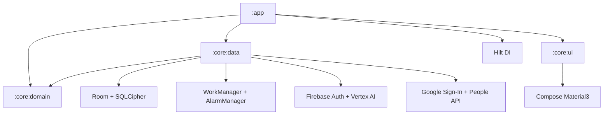
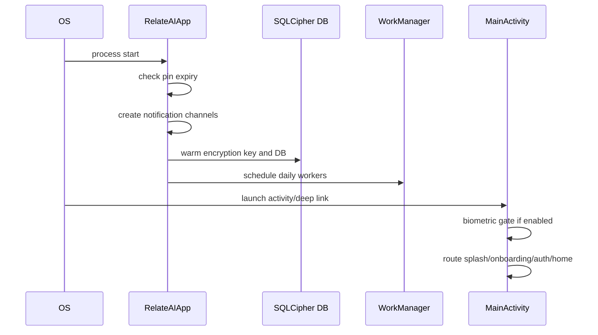
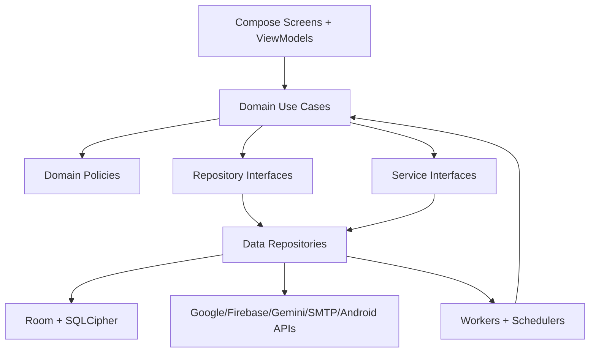

# RelateAI PLAN.md

Version: 1.0.0
Date: 2026-06-26
Status: Active rebuild and stabilization plan
Repository: `/Users/yashsomani/Desktop/Android Project/AI-Birthday`

Companion execution docs:

- [PRODUCT_BLUEPRINT.md](PRODUCT_BLUEPRINT.md): refined product idea, user journeys, operating model, and release definition.
- [IMPLEMENTATION_TASKS.md](IMPLEMENTATION_TASKS.md): micro achievable tasks, phase order, acceptance criteria, and validation commands.
- [IMPLEMENTATION_PROGRESS.md](IMPLEMENTATION_PROGRESS.md): incremental implementation log with UX impact and validation evidence.

## 0. Executive Summary

RelateAI is a local-first Android relationship assistant. The active product in source code is an Android app that imports Google/device contacts, discovers birthdays and anniversaries, generates personalized AI wishes, routes them through review or automation, sends over SMS/WhatsApp/Gmail, stores encrypted local relationship data, and supports backup/restore.

The repo is close to a full product, but it has several production blockers:

| Priority | Finding | Evidence | Required resolution |
| --- | --- | --- | --- |
| Done | ✅ RESOLVED: early-send and dispatch policy split | [DispatchEligibilityPolicy.kt](core/domain/src/main/kotlin/com/example/domain/automation/DispatchEligibilityPolicy.kt) is used by [MessageDispatchWorker.kt](core/data/src/main/kotlin/com/example/core/automation/workers/MessageDispatchWorker.kt), [DispatchMessageUseCase.kt](core/domain/src/main/kotlin/com/example/domain/usecase/DispatchMessageUseCase.kt), and notification approval decisions; it now owns future-time, quiet-hour, and blackout-date send deferral. [DailyScheduler.kt](core/data/src/main/kotlin/com/example/core/automation/scheduler/DailyScheduler.kt) passes delayed WorkManager fallback requests; domain dispatch writes redacted activity logs | Continue with background-worker activity-log parity and failed-retry explanation follow-ups |
| Done | ✅ RESOLVED: event-aware AI fallback | [AiServiceImpl.kt](core/data/src/main/kotlin/com/example/core/gemini/AiServiceImpl.kt) passes event type to `ResponseParser.parseMessageVariants` in generation and regeneration; [ResponseParser.kt](core/data/src/main/kotlin/com/example/core/gemini/ResponseParser.kt) returns structured parse metadata; malformed/error AI responses are logged as fallback reasons without raw response bodies | Continue with remaining worker reuse for holiday/revival/follow-up paths |
| Done | ✅ RESOLVED: weekly generation worker use-case reuse | [MessageGenerationWorker.kt](core/data/src/main/kotlin/com/example/core/automation/workers/MessageGenerationWorker.kt) now delegates each 7-day lookahead event to [GenerateMessageUseCase.kt](core/domain/src/main/kotlin/com/example/domain/usecase/GenerateMessageUseCase.kt); failed occurrences can be regenerated through an explicit worker request while foreground generation still blocks duplicates | Continue with dispatch worker orchestration cleanup and other generator workers |
| Done | ✅ RESOLVED: contact classification prompt/parser schema | [ContactClassificationContract.kt](core/domain/src/main/kotlin/com/example/domain/service/ContactClassificationContract.kt) defines canonical field names and accepted values; [PromptBuilder.kt](core/data/src/main/kotlin/com/example/core/gemini/PromptBuilder.kt), [ResponseParser.kt](core/data/src/main/kotlin/com/example/core/gemini/ResponseParser.kt), and [ClassifyContactUseCase.kt](core/domain/src/main/kotlin/com/example/domain/usecase/ClassifyContactUseCase.kt) use it for prompt output, legacy parsing, enum normalization, default telemetry, and persisted style | Continue with classification rationale codes if product explanations require them |
| Done | ✅ RESOLVED: event data integrity stabilization | Standard manual events use canonical contact/type identity through [EventIdentityPolicy.kt](core/domain/src/main/kotlin/com/example/domain/event/EventIdentityPolicy.kt); discovery and manual save share [EventDatePolicy.kt](core/domain/src/main/kotlin/com/example/domain/event/EventDatePolicy.kt); route and regeneration readiness are covered by targeted tests | Continue with product UX follow-up for merge/keep actions and richer readiness badges |
| P1 | ⚠️ PARTIAL: backup v2 and replace restore exist, DB-key/security work remains | [BackupServiceImpl.kt](core/data/src/main/kotlin/com/example/core/backup/BackupServiceImpl.kt) now exports a v2 manifest with counts/checksum, activity logs, message feedback, and non-secret preference subset while excluding credential keys; selected-URI exports clean up the internal encrypted copy; import preview shows version/app/counts before mutation; restore is explicit replace mode with merge deferred | Finish DB-key migration/security tasks |
| P1 | ⚡ CONFLICT: active product docs disagree | Source app is RelateAI; `docs/startup-idea/product-requirements-document.md` describes LeadRescue AI at [docs/startup-idea/product-requirements-document.md:1](docs/startup-idea/product-requirements-document.md:1) | Move unrelated docs out of active product docs or mark archived |
| P1 | ⚠️ PARTIAL: full release validation remains open | Targeted Gradle suites now run with `JAVA_HOME=/opt/homebrew/opt/openjdk@21`; full unit baseline, lint, assemble, and device/emulator validation are still separate P7 tasks | Run full unit, lint, assemble, and runtime validation before release |

North-star architecture: a modular, local-first Android app with a single automation policy engine, typed domain models, typed AI contracts, encrypted persistence, clear review gates, explicit delivery route eligibility, and UI states backed by string resources instead of hardcoded strings.

## 1. Repository Analysis

### 1.1 Inventory

Audited active source, Gradle config, resources, tests, scripts, CI, and docs under `app`, `core`, `scripts`, `docs`, `.github`, and `gradle`.

| Category | Count or status |
| --- | --- |
| Active repository files in audited roots | 335 |
| Kotlin production source lines | 25,561 |
| Kotlin test files | 87 |
| Android modules | `:app`, `:core:domain`, `:core:data`, `:core:ui` |
| Main product docs | [SSOT.md](SSOT.md) plus unrelated startup docs |
| TODO/FIXME/HACK scan | No direct TODO/FIXME/HACK markers found in audited active roots |
| Existing `PLAN.md` before this write | Not present |

Generated caches, local Gradle outputs, VCS internals, and binary launcher assets were not semantically analyzed line by line. They are implementation artifacts, not product behavior sources.

### 1.2 Module Graph



Expected rule: `app` owns Android screens and navigation, `core:data` owns persistence/external integrations/workers, `core:domain` owns pure policy/use cases/models, and `core:ui` owns reusable design-system components.

Current concern: `core:domain` owns Room entities under `com.example.core.db.entities` and depends on Room runtime. That makes domain policies depend on persistence-shaped models. The rebuild should either accept "domain entities are Room entities" as a deliberate local-first shortcut or move Room entities into `core:data` and expose pure domain models.

### 1.3 Major Path Map

| Area | Files |
| --- | --- |
| App startup | [app/src/main/java/com/example/RelateAIApp.kt](app/src/main/java/com/example/RelateAIApp.kt), [app/src/main/java/com/example/MainActivity.kt](app/src/main/java/com/example/MainActivity.kt), [app/src/main/AndroidManifest.xml](app/src/main/AndroidManifest.xml) |
| Navigation | [app/src/main/java/com/example/ui/navigation/Screen.kt](app/src/main/java/com/example/ui/navigation/Screen.kt), [app/src/main/java/com/example/ui/navigation/NavGraph.kt](app/src/main/java/com/example/ui/navigation/NavGraph.kt), [app/src/main/java/com/example/ui/navigation/RouteArgumentCodec.kt](app/src/main/java/com/example/ui/navigation/RouteArgumentCodec.kt) |
| Screens | `app/src/main/java/com/example/ui/screens/**` |
| ViewModels | `app/src/main/java/com/example/ui/viewmodel/**`, [app/src/main/java/com/example/ui/screens/chat/ChatHistoryViewModel.kt](app/src/main/java/com/example/ui/screens/chat/ChatHistoryViewModel.kt) |
| Domain use cases | `core/domain/src/main/kotlin/com/example/domain/usecase/**` |
| Domain policies | `core/domain/src/main/kotlin/com/example/domain/automation/**` |
| Repositories/services contracts | `core/domain/src/main/kotlin/com/example/domain/repository/**`, `core/domain/src/main/kotlin/com/example/domain/service/**` |
| Persistence | [core/data/src/main/kotlin/com/example/core/db/AppDatabase.kt](core/data/src/main/kotlin/com/example/core/db/AppDatabase.kt), `core/domain/src/main/kotlin/com/example/core/db/entities/**`, `core/domain/src/main/kotlin/com/example/core/db/dao/**` |
| Data integrations | `core/data/src/main/kotlin/com/example/core/auth/**`, `core/data/src/main/kotlin/com/example/core/contacts/**`, `core/data/src/main/kotlin/com/example/core/gemini/**`, `core/data/src/main/kotlin/com/example/core/backup/**` |
| Automation workers | `core/data/src/main/kotlin/com/example/core/automation/workers/**`, `core/data/src/main/kotlin/com/example/core/automation/scheduler/**`, `core/data/src/main/kotlin/com/example/core/automation/sender/**` |
| Notifications | `core/data/src/main/kotlin/com/example/core/automation/notifications/**` |
| Accessibility | `core/data/src/main/kotlin/com/example/core/accessibility/**` |
| Reusable UI | `core/ui/src/main/kotlin/com/example/core/ui/**` |
| Resources | `app/src/main/res/**`, `core/data/src/main/res/**`, `core/ui/src/main/res/**` |
| Tests | `app/src/test/**`, `core/data/src/test/**`, `core/domain/src/test/**` |
| Build/CI | [settings.gradle.kts](settings.gradle.kts), [build.gradle.kts](build.gradle.kts), [gradle/libs.versions.toml](gradle/libs.versions.toml), [.github/workflows/android.yml](.github/workflows/android.yml) |

### 1.4 Routes

Routes are declared in [app/src/main/java/com/example/ui/navigation/Screen.kt:12](app/src/main/java/com/example/ui/navigation/Screen.kt:12):

| Route | Screen |
| --- | --- |
| `splash` | startup routing |
| `onboarding` | onboarding |
| `auth` | sign-in/guest |
| `home` | dashboard |
| `contacts` | contact list |
| `contacts/{contactId}` | contact detail |
| `events` | event list/manual events |
| `messages` | message inbox/review |
| `settings` | app configuration |
| `analytics` | relationship analytics |
| `activity-history` | activity log |
| `wish/{contactId}/{messageRef}` | wish preview/editor |
| `chat-history/{contactId}` | sent message history |
| `style-coach` | writing style profile |
| `backup-restore` | encrypted backup/restore |
| `automation-setup` | automation diagnostics/setup |
| `memory-vault/{contactId}` | contact memories |
| `gift-advisor/{contactId}` | gift tracking and suggestions |

### 1.5 Startup Flow



### 1.6 Build System and Dependency Notes

| File | Finding |
| --- | --- |
| [settings.gradle.kts](settings.gradle.kts) | Multi-module Android project named `RelateAI` |
| [gradle/libs.versions.toml](gradle/libs.versions.toml) | Central versions: AGP 9.2.1, Kotlin 2.2.10, Room 2.7.0, Hilt 2.59.2, WorkManager 2.9.0, SQLCipher 4.5.4, Firebase BOM 34.12.0 |
| [app/build.gradle.kts](app/build.gradle.kts) | Application id `com.aistudio.relateai.qxtjrk`, namespace `com.example`, release minify/shrink enabled, release signing guarded by env vars |
| [core:data/build.gradle.kts](core/data/build.gradle.kts) | Integrates Room, SQLCipher, WorkManager, Firebase, Google APIs, JavaMail |
| [.github/workflows/android.yml](.github/workflows/android.yml) | CI runs unit tests, lint, assemble, coverage, release signing guard |

### 1.7 Oversized File Registry

These files exceed the desired maintainability target of 300 lines and should be split by feature/state/components/policies:

| Lines | File |
| ---: | --- |
| 1348 | [app/src/main/java/com/example/ui/screens/messages/MessagesScreen.kt](app/src/main/java/com/example/ui/screens/messages/MessagesScreen.kt) |
| 822 | [app/src/main/java/com/example/ui/screens/contacts/ContactDetailScreen.kt](app/src/main/java/com/example/ui/screens/contacts/ContactDetailScreen.kt) |
| 818 | [app/src/main/java/com/example/ui/screens/giftadvisor/GiftAdvisorScreen.kt](app/src/main/java/com/example/ui/screens/giftadvisor/GiftAdvisorScreen.kt) |
| 815 | [app/src/main/java/com/example/ui/screens/settings/SettingsScreen.kt](app/src/main/java/com/example/ui/screens/settings/SettingsScreen.kt) |
| 654 | [app/src/main/java/com/example/ui/screens/wish/WishPreviewScreen.kt](app/src/main/java/com/example/ui/screens/wish/WishPreviewScreen.kt) |
| 637 | [app/src/main/java/com/example/ui/screens/events/EventsScreen.kt](app/src/main/java/com/example/ui/screens/events/EventsScreen.kt) |
| 605 | [app/src/main/java/com/example/ui/screens/home/HomeScreen.kt](app/src/main/java/com/example/ui/screens/home/HomeScreen.kt) |
| 585 | [app/src/main/java/com/example/ui/screens/setup/AutomationSetupScreen.kt](app/src/main/java/com/example/ui/screens/setup/AutomationSetupScreen.kt) |
| 551 | [app/src/main/java/com/example/ui/viewmodel/MessagesViewModel.kt](app/src/main/java/com/example/ui/viewmodel/MessagesViewModel.kt) |
| 551 | [app/src/main/java/com/example/ui/screens/stylecoach/StyleCoachScreen.kt](app/src/main/java/com/example/ui/screens/stylecoach/StyleCoachScreen.kt) |
| 539 | [app/src/main/java/com/example/ui/viewmodel/AutomationSetupViewModel.kt](app/src/main/java/com/example/ui/viewmodel/AutomationSetupViewModel.kt) |
| 535 | [core/data/src/main/kotlin/com/example/core/db/AppDatabase.kt](core/data/src/main/kotlin/com/example/core/db/AppDatabase.kt) |
| 468 | [app/src/main/java/com/example/ui/screens/backup/BackupRestoreScreen.kt](app/src/main/java/com/example/ui/screens/backup/BackupRestoreScreen.kt) |
| 439 | [app/src/main/java/com/example/ui/screens/memoryvault/MemoryVaultScreen.kt](app/src/main/java/com/example/ui/screens/memoryvault/MemoryVaultScreen.kt) |
| 421 | [app/src/main/java/com/example/ui/viewmodel/WishPreviewViewModel.kt](app/src/main/java/com/example/ui/viewmodel/WishPreviewViewModel.kt) |
| 412 | [core/data/src/main/kotlin/com/example/core/gemini/PromptBuilder.kt](core/data/src/main/kotlin/com/example/core/gemini/PromptBuilder.kt) |
| 397 | [core/ui/src/main/kotlin/com/example/core/ui/components/RelateComponents.kt](core/ui/src/main/kotlin/com/example/core/ui/components/RelateComponents.kt) |
| 397 | [app/src/main/java/com/example/ui/screens/analytics/AnalyticsScreen.kt](app/src/main/java/com/example/ui/screens/analytics/AnalyticsScreen.kt) |
| 367 | [core/data/src/main/kotlin/com/example/core/contacts/GoogleContactsSync.kt](core/data/src/main/kotlin/com/example/core/contacts/GoogleContactsSync.kt) |
| 353 | [app/src/main/java/com/example/MainActivity.kt](app/src/main/java/com/example/MainActivity.kt) |
| 339 | [app/src/main/java/com/example/ui/screens/contacts/ContactListScreen.kt](app/src/main/java/com/example/ui/screens/contacts/ContactListScreen.kt) |
| 323 | [app/src/main/java/com/example/ui/navigation/NavGraph.kt](app/src/main/java/com/example/ui/navigation/NavGraph.kt) |
| 321 | [app/src/main/java/com/example/ui/screens/activity/ActivityHistoryScreen.kt](app/src/main/java/com/example/ui/screens/activity/ActivityHistoryScreen.kt) |
| 300 | [app/src/main/java/com/example/ui/viewmodel/SettingsViewModel.kt](app/src/main/java/com/example/ui/viewmodel/SettingsViewModel.kt) |

Acceptance criteria:

- No new feature file exceeds 300 lines without a documented exception.
- Existing oversized screens are split opportunistically by state section, dialog, list item, and action bar.
- `AppDatabase.kt` is reduced by moving type converters, migrations, callbacks, and builders into separate files.

## 2. Feature Audit

### 2.1 Authentication and Guest Mode

| Field | Audit |
| --- | --- |
| Files | `core/data/src/main/kotlin/com/example/core/auth/**`, [app/src/main/java/com/example/ui/viewmodel/AuthViewModel.kt](app/src/main/java/com/example/ui/viewmodel/AuthViewModel.kt), auth screen |
| Intended behavior | Google sign-in, guest mode, account state persistence, sign-out, local data clear on sign-out |
| Current behavior | Firebase/Google auth paths exist; `SecurePrefs.clearAll()` clears backing prefs at [core/data/src/main/kotlin/com/example/core/prefs/SecurePrefs.kt:171](core/data/src/main/kotlin/com/example/core/prefs/SecurePrefs.kt:171) |
| Risks | 🚧 INCOMPLETE: cached singleton `EncryptedSharedPreferences` instances remain in process after clear; sign-out/data wipe should also invalidate in-memory handles or restart app process |
| Rebuild spec | Auth state is a sealed domain state: `SignedOut`, `Guest`, `SignedIn(userId,email)`, `Locked`. All sign-out flows clear secrets, DB key, WorkManager jobs, notifications, and in-memory preference handles |

Acceptance criteria:

- Signing out cancels pending automation and clears local data.
- Re-login after sign-out does not expose old encrypted preference values through cached objects.
- Guest mode clearly marks cloud sync and Google Contacts as unavailable without throwing generic errors.

### 2.2 Permissions and Device Capabilities

| Field | Audit |
| --- | --- |
| Files | [app/src/main/AndroidManifest.xml](app/src/main/AndroidManifest.xml), [app/src/main/java/com/example/MainActivity.kt](app/src/main/java/com/example/MainActivity.kt), automation setup |
| Intended behavior | Request SMS, contacts, notification, exact alarm, and accessibility capabilities when needed |
| Current behavior | Manifest declares `SEND_SMS`, `READ_CONTACTS`, exact alarm, notification, foreground service, boot, and wake lock at [app/src/main/AndroidManifest.xml:5](app/src/main/AndroidManifest.xml:5). Main permission rationale checks SMS and notifications only at [app/src/main/java/com/example/MainActivity.kt:341](app/src/main/java/com/example/MainActivity.kt:341) |
| Risks | 🚧 INCOMPLETE: READ_CONTACTS is not part of the core permission rationale; exact alarm and accessibility readiness are split into setup diagnostics |
| Rebuild spec | Central `CapabilityState` combines permission, OS support, user setup, and channel availability per feature |

Acceptance criteria:

- Contact sync shows a specific "contacts permission missing" state.
- Send actions are disabled or rerouted when SMS/email/WhatsApp setup is missing.
- Exact-alarm denial never causes early send.

### 2.3 Contact Sync

| Field | Audit |
| --- | --- |
| Files | [core/domain/src/main/kotlin/com/example/domain/usecase/SyncContactsUseCase.kt](core/domain/src/main/kotlin/com/example/domain/usecase/SyncContactsUseCase.kt), [core/data/src/main/kotlin/com/example/core/contacts/GoogleContactsSync.kt](core/data/src/main/kotlin/com/example/core/contacts/GoogleContactsSync.kt), [core/data/src/main/kotlin/com/example/core/contacts/DeviceContactsReader.kt](core/data/src/main/kotlin/com/example/core/contacts/DeviceContactsReader.kt) |
| Intended behavior | Merge Google People API and local device contacts, preserve enrichment, discover events |
| Current behavior | Google sync, device sync, merge by phone/email/name, then event discovery. People API connection URLs are built with encoded query parameters, and device contacts permission denial returns a specific sync outcome instead of looking like an empty list |
| Risks | 🚧 INCOMPLETE: richer Google error taxonomy and recovery for auth expiry/rate limits still need to be first-class UI states |
| Rebuild spec | Sync pipeline returns typed outcomes: `Success`, `PartialSuccess`, `PermissionRequired`, `GoogleAuthRequired`, `RateLimited`, `NetworkFailure` |

Acceptance criteria:

- Google failure plus local contacts permission denial produces actionable UI, not a generic empty list. Current stabilization covers device permission denial through `SyncOutcome.deviceContactsPermissionDenied`.
- Sync tokens are encoded. Invalid-token recovery remains a future typed outcome.
- Merge rules preserve user-edited names, event dates, preferences, memory notes, and relationship type.

### 2.4 Event Discovery and Manual Events

| Field | Audit |
| --- | --- |
| Files | [core/domain/src/main/kotlin/com/example/domain/usecase/DiscoverEventsUseCase.kt](core/domain/src/main/kotlin/com/example/domain/usecase/DiscoverEventsUseCase.kt), [core/domain/src/main/kotlin/com/example/domain/usecase/SaveManualEventUseCase.kt](core/domain/src/main/kotlin/com/example/domain/usecase/SaveManualEventUseCase.kt), events UI |
| Intended behavior | Discover birthdays, anniversaries, work anniversaries, and custom/manual dates |
| Current behavior | Standard manual events use canonical contact/type ids unless the user explicitly saves a separate duplicate. Discovery skips matching active manual/verified events, invalid dates are rejected by `EventDatePolicy`, same contact/type date conflicts return a visible conflict outcome before persistence, the Events list derives trust labels for source/verification/duplicate/date-conflict states, and conflict rows expose explicit merge or keep-separate actions |
| Risks | 🚧 INCOMPLETE: source-history audit beyond current source/verification/conflict chips remains a product UX follow-up |
| Rebuild spec | Events have canonical identity for standard contact events, non-lenient date validation, visible conflict state, and explicit user-controlled paths for merging into a selected event or keeping separate reminders |

Acceptance criteria:

- Saving a manual birthday then running discovery results in one birthday event.
- Invalid imported dates are rejected or quarantined, never rolled into another month.
- Same contact/type with a different date shows a conflict warning before mutation.
- Event source, verification, duplicate, and date-conflict state are visible in the event list.
- Event duplicates/conflicts can be resolved by explicitly merging into the selected row or keeping the active reminders separate.

### 2.5 AI Message Generation

| Field | Audit |
| --- | --- |
| Files | [core/domain/src/main/kotlin/com/example/domain/usecase/GenerateMessageUseCase.kt](core/domain/src/main/kotlin/com/example/domain/usecase/GenerateMessageUseCase.kt), [core/data/src/main/kotlin/com/example/core/gemini/AiServiceImpl.kt](core/data/src/main/kotlin/com/example/core/gemini/AiServiceImpl.kt), [core/data/src/main/kotlin/com/example/core/gemini/PromptBuilder.kt](core/data/src/main/kotlin/com/example/core/gemini/PromptBuilder.kt), [core/data/src/main/kotlin/com/example/core/gemini/ResponseParser.kt](core/data/src/main/kotlin/com/example/core/gemini/ResponseParser.kt) |
| Intended behavior | Build personalized prompt from contact/event/style/history/memory/gifts, parse multiple variants, select quality-gated draft |
| Current behavior | Prompting and parser exist; quality gate downgrades fully-auto fallback/generic drafts; `AiServiceImpl` passes event type into the parser so fallback copy matches birthdays, anniversaries, work anniversaries, and revival contexts. Message variant parsing now returns structured metadata (`SUCCESS` or `FALLBACK`, plus `malformed_json` or `error_payload` reason) and service logging records fallback reason without raw AI response text. The weekly `MessageGenerationWorker` delegates prompt, AI, approval, quality, channel, persistence, scheduling, and notification behavior to `GenerateMessageUseCase` |
| Risks | 🚧 INCOMPLETE: holiday, revival, and post-event generator workers still contain generation-policy logic that should move behind use cases/services |
| Rebuild spec | AI gateway must use typed prompt contracts, typed parse results, event-aware fallbacks, redacted parse telemetry, and a single generation service used by both UI and workers |

Acceptance criteria:

- Anniversary, work anniversary, and revival fallback text always matches event type.
- Malformed AI responses produce structured telemetry and `isUsingFallback = true` without logging raw AI response content.
- No worker duplicates prompt, parsing, approval, or quality-gate logic.

### 2.6 Contact Classification

| Field | Audit |
| --- | --- |
| Files | [core/domain/src/main/kotlin/com/example/domain/usecase/ClassifyContactUseCase.kt](core/domain/src/main/kotlin/com/example/domain/usecase/ClassifyContactUseCase.kt), [core/data/src/main/kotlin/com/example/core/gemini/PromptBuilder.kt](core/data/src/main/kotlin/com/example/core/gemini/PromptBuilder.kt), [core/data/src/main/kotlin/com/example/core/gemini/ResponseParser.kt](core/data/src/main/kotlin/com/example/core/gemini/ResponseParser.kt) |
| Intended behavior | AI classifies relationship, language, formality, and communication style |
| Current behavior | Classification only runs for unknown relationship types. Prompt output uses canonical `relationship_type`, `relationship_subtype`, `confidence`, `language`, `formality`, and `communication_style` fields from `ContactClassificationContract`; parser accepts legacy `type`, `subtype`, `communicationStyle`, and `style`; enum-like values are normalized before persistence |
| Risks | 🚧 INCOMPLETE: classification rationale codes remain a follow-up if product explanations need them |
| Rebuild spec | Define `ContactClassificationResponse` JSON schema with `relationship_type`, optional `relationship_subtype`, `confidence`, `language`, `formality`, `communication_style`, and `rationale_code` |

Acceptance criteria:

- Prompt and parser field names are identical.
- Invalid enum values are normalized or rejected.
- Unit tests cover canonical fields, legacy aliases, missing/invalid style defaults, and persisted normalized style.

### 2.7 Approval Modes and Dispatch

| Field | Audit |
| --- | --- |
| Files | [core/domain/src/main/kotlin/com/example/domain/automation/ApprovalModeResolver.kt](core/domain/src/main/kotlin/com/example/domain/automation/ApprovalModeResolver.kt), [core/domain/src/main/kotlin/com/example/domain/usecase/DispatchMessageUseCase.kt](core/domain/src/main/kotlin/com/example/domain/usecase/DispatchMessageUseCase.kt), [core/data/src/main/kotlin/com/example/core/automation/workers/MessageDispatchWorker.kt](core/data/src/main/kotlin/com/example/core/automation/workers/MessageDispatchWorker.kt) |
| Intended behavior | Fully auto sends without review, smart approve gives a review window, VIP requires explicit approval or expires, always ask requires explicit approval |
| Current behavior | `DispatchEligibilityPolicy` now governs worker dispatch, domain dispatch use-case paths, and notification approval decisions. The policy defers future approved messages, defers otherwise-sendable messages during quiet hours or blackout dates, sends due smart-approve messages, keeps VIP/always-ask review-gated, expires VIP after the window, and blocks handled states. `MessageDispatchWorker` injects `PreferencesRepository` and passes timing preferences into the policy instead of computing send timing locally. Domain dispatch records redacted activity logs for deferred, needs-approval, expired, blocked, contact-missing, and sent outcomes |
| Risks | 🚧 INCOMPLETE: background-worker activity-log parity and failed-retry notification outcomes still need richer policy-detail coverage |
| Rebuild spec | One `DispatchEligibilityPolicy.evaluate(message, now)` returns `SendNow`, `DeferUntil(ms)`, `NeedApproval`, `Expire`, `Reject`, or `NoRoute` |

Acceptance criteria:

- Worker and UI use the same dispatch eligibility policy.
- `scheduledForMs` is checked before every send, regardless of status.
- Smart approve pending messages send only at or after scheduled time.
- VIP/always-ask messages never auto-send.

### 2.8 Delivery Channels

| Field | Audit |
| --- | --- |
| Files | `core/data/src/main/kotlin/com/example/core/automation/sender/**`, [core/domain/src/main/kotlin/com/example/domain/automation/AutoSendChannelSelector.kt](core/domain/src/main/kotlin/com/example/domain/automation/AutoSendChannelSelector.kt), settings/setup UI |
| Intended behavior | Choose eligible route among SMS, WhatsApp, Email based on contact data, history, preferences, blackout, and setup |
| Current behavior | Runtime dispatcher has route resolver and fallback. Generation, holiday, revival, post-event follow-up, and regeneration paths now call `AutoSendChannelSelector.selectRoute()`; no-route results force drafts to `ALWAYS_ASK`/`PENDING` and avoid automatic scheduling |
| Risks | 🚧 INCOMPLETE: Messages now has initial task-state buckets and readiness badges; preview UI and direct fix actions still need richer route/readiness handling |
| Rebuild spec | Channel selection returns `EligibleRoute(channel, reason)` list or `NoEligibleRoute(reasons)` |

Acceptance criteria:

- No draft is marked ready for automatic dispatch when all channels are blacked out or missing setup.
- WhatsApp automation explicitly requires accessibility service enabled and reachable.
- Email sends require validated Gmail app password setup.

### 2.9 Message Review, Regeneration, and Feedback

| Field | Audit |
| --- | --- |
| Files | [app/src/main/java/com/example/ui/viewmodel/WishPreviewViewModel.kt](app/src/main/java/com/example/ui/viewmodel/WishPreviewViewModel.kt), [core/domain/src/main/kotlin/com/example/domain/usecase/RegeneratePendingMessageUseCase.kt](core/domain/src/main/kotlin/com/example/domain/usecase/RegeneratePendingMessageUseCase.kt), messages UI |
| Intended behavior | User reviews variants, edits text, approves/schedules/rejects, regenerates with feedback |
| Current behavior | Review and regenerate exist. Wish Preview shows an approval-plan summary for event type, route, schedule, approval mode, and AI/fallback quality before the editable draft. It now recalculates draft readiness after variant changes, edits, regeneration, and approval attempts; blank drafts disable approval and are blocked before mutation. Regeneration re-runs quality gating, recomputes route readiness, re-resolves approval mode, clears stale edited/approved state by default, and only preserves user edits or approval when explicitly requested |
| Risks | 🚧 INCOMPLETE: preview still needs shared route/setup readiness from the same helper used by Messages, Dispatch, and AI Doctor |
| Rebuild spec | Regeneration must re-run quality gate and dispatch readiness, while preserving user-approved status only when explicitly requested |

Acceptance criteria:

- Regenerated fallback/generic output downgrades automation if needed.
- Editing text marks the draft user-edited and recalculates readiness.
- Feedback is stored for future prompt conditioning.

### 2.10 Memory Vault

| Field | Audit |
| --- | --- |
| Files | [app/src/main/java/com/example/ui/viewmodel/MemoryVaultViewModel.kt](app/src/main/java/com/example/ui/viewmodel/MemoryVaultViewModel.kt), [app/src/main/java/com/example/ui/screens/memoryvault/MemoryVaultScreen.kt](app/src/main/java/com/example/ui/screens/memoryvault/MemoryVaultScreen.kt), memory DAO/entity |
| Intended behavior | Capture important personal facts and memories for AI personalization |
| Current behavior | Notes, categories, pinning, deletion, and validation exist |
| Risks | 🚧 INCOMPLETE: AI context should cap, rank, and redact memory notes by relevance and sensitivity |
| Rebuild spec | Memory notes have category, sensitivity, pinned flag, last-used metadata, and prompt eligibility |

Acceptance criteria:

- Prompt builder includes only allowed and relevant memories.
- Sensitive notes can be excluded from AI.
- Memory edits update personalization quality.

### 2.11 Gift Advisor

| Field | Audit |
| --- | --- |
| Files | [app/src/main/java/com/example/ui/screens/giftadvisor/GiftAdvisorScreen.kt](app/src/main/java/com/example/ui/screens/giftadvisor/GiftAdvisorScreen.kt), [app/src/main/java/com/example/ui/viewmodel/GiftAdvisorViewModel.kt](app/src/main/java/com/example/ui/viewmodel/GiftAdvisorViewModel.kt), AI gift suggestion parser |
| Intended behavior | Track gifts and ask AI for budget-aware suggestions |
| Current behavior | Gift history, validation, deletion, and suggestions exist |
| Risks | 🚧 INCOMPLETE: suggestions need stronger schema validation, dedupe against history, and explicit safety/budget bounds |
| Rebuild spec | Gift suggestions are typed objects with title, category, estimated cost, rationale, avoid-repeat flag, and source confidence |

Acceptance criteria:

- Suggestions above budget are rejected.
- Suggestions duplicate with prior gifts are flagged.
- Gift history is included in backup and AI context.

### 2.12 Style Coach

| Field | Audit |
| --- | --- |
| Files | [app/src/main/java/com/example/ui/screens/stylecoach/StyleCoachScreen.kt](app/src/main/java/com/example/ui/screens/stylecoach/StyleCoachScreen.kt), [app/src/main/java/com/example/ui/viewmodel/StyleCoachViewModel.kt](app/src/main/java/com/example/ui/viewmodel/StyleCoachViewModel.kt), style profile DAO/entity |
| Intended behavior | Let user tune writing voice |
| Current behavior | Style profile is persisted and used in prompt context |
| Risks | 🚧 INCOMPLETE: style profile should be validated against generated message quality and localized strings |
| Rebuild spec | Style profile is a first-class domain model with language/formality/style enums and examples |

Acceptance criteria:

- All generated prompts include resolved style profile.
- Invalid style values cannot enter the DB.
- UI reflects current profile immediately after save.

### 2.13 Analytics and Activity History

| Field | Audit |
| --- | --- |
| Files | analytics screen/viewmodel, activity history screen/viewmodel, activity log DAO/entity |
| Intended behavior | Show relationship health, automation history, and action trails |
| Current behavior | Screens and viewmodels exist. Backup v2 now includes activity logs in the encrypted payload, and Activity History has task filters for dispatch, AI, sync, backup, settings, messages, events, and analytics |
| Risks | 🚧 INCOMPLETE: activity history still needs redaction review, common-entry task naming, and safe resolve/mark-reviewed actions |
| Rebuild spec | Activity logging is a cross-cutting domain event sink used by sync, AI, review, dispatch, backup, and settings changes |

Acceptance criteria:

- Every automatic send attempt writes one activity record.
- User-facing analytics can be rebuilt from local data after restore.
- Sensitive logs are redacted.

### 2.14 Backup and Restore

| Field | Audit |
| --- | --- |
| Files | [core/data/src/main/kotlin/com/example/core/backup/BackupServiceImpl.kt](core/data/src/main/kotlin/com/example/core/backup/BackupServiceImpl.kt), backup UI/viewmodel |
| Intended behavior | Encrypted export/import for local relationship data |
| Current behavior | AES/passphrase backup exists and exports v2 payloads with manifest, app version, export timestamp, record counts, SHA-256 payload checksum, contacts, events, pending/sent messages, style profile, memory notes, gift history, activity logs, message feedback, and non-secret preferences. Import remains v1-compatible and rejects mismatched v2 manifest checksums. File selection previews backup version, app version, restore mode, and record count before the user confirms restore. Confirmed restore uses replace mode: existing restorable relationship data is cleared inside the same database transaction before backup rows are inserted, so invalid restores roll back without losing current local data. When the user exports to a selected URI, the internal encrypted copy is deleted after the copy attempt |
| Risks | 🚧 INCOMPLETE: DB-key migration and deeper security validation remain open |
| Rebuild spec | Keep backup manifest, version migrations, secret exclusions, explicit replace restore mode, future merge mode, and cleanup policy for temporary files |

Acceptance criteria:

- Backup includes user-generated local data: contacts, events, pending/sent, style profile, memory, gifts, feedback, activity logs, non-secret preferences.
- Backup excludes OAuth tokens, API keys, email app passwords, cached DB keys, and device-specific identifiers.
- Restore validates schema version and shows a preview before mutating DB.
- Restore copy and service behavior agree: initial restore mode is replace, merge is deferred, and invalid restore attempts roll back all pre-insert deletes.

### 2.15 Settings and Localization

| Field | Audit |
| --- | --- |
| Files | [app/src/main/java/com/example/ui/screens/settings/SettingsScreen.kt](app/src/main/java/com/example/ui/screens/settings/SettingsScreen.kt), [app/src/main/java/com/example/ui/viewmodel/SettingsViewModel.kt](app/src/main/java/com/example/ui/viewmodel/SettingsViewModel.kt), `strings.xml`, `values-hi/strings.xml` |
| Intended behavior | Configure AI, automation, quiet hours, channel blackouts, email sender, backup reminders, biometrics, language |
| Current behavior | Settings exist and use many string resources; Home, Contact List, Contact Detail preference errors, Events, and Messages cleaned ViewModel copy now resolve through resources; manual-event and contact-preference validation use typed reasons; some domain-owned activity-log text remains to translate at the data-to-UI boundary |
| Risks | 🚧 INCOMPLETE: remaining domain activity-log strings and any unscanned niche flows can bypass localization if not mapped before display |
| Rebuild spec | All UI-facing text exits ViewModels as `UiText.StringResource` or typed domain error resolved by UI |

Acceptance criteria:

- No new user-facing string literals in cleaned ViewModels/use cases.
- Domain use cases return typed validation reasons when the UI needs localized copy.
- English and Hindi resource parity tests cover app and data module strings.
- Runtime language changes update top-level UI without process restart where feasible.

### 2.16 Widget, Shortcuts, and Deep Links

| Field | Audit |
| --- | --- |
| Files | manifest, shortcuts XML, widget provider/resources, deep links in `NavGraph` |
| Intended behavior | Quick entry to compose/contacts and birthday widget |
| Current behavior | Launcher shortcuts, deep links, and widget resources exist |
| Risks | ⚠️ UNVERIFIED: no device/runtime widget validation was performed |
| Rebuild spec | Widget and deep-link behavior must be included in instrumentation/smoke checks |

Acceptance criteria:

- Deep links to wish/contact/settings land on the expected route with decoded arguments.
- Widget empty/loading/error states render safely.
- Shortcuts do not expose inaccessible routes when user is signed out or locked.

## 3. Conflict Resolutions

### CR-001: Dispatch Eligibility

Decision: `scheduledForMs` is authoritative for every automatic send. `APPROVED` means user or policy has authorized sending; it does not mean send immediately.

Resolved model:

| Approval mode | Initial status | Review notification | Auto dispatch | Expiry |
| --- | --- | --- | --- | --- |
| `FULLY_AUTO` | `APPROVED` | No | At `scheduledForMs` only | No |
| `SMART_APPROVE` | `PENDING` | Yes | At `scheduledForMs` if not rejected/edited to manual-only | No |
| `VIP_APPROVE` | `PENDING` | Yes | Never | Expire after configured approval window |
| `ALWAYS_ASK` | `PENDING` | Yes | Never | Optional stale reminder, no auto-send |

Implementation target: `DispatchEligibilityPolicy` in domain:

```kotlin
sealed interface DispatchDecision {
    data object SendNow : DispatchDecision
    data class DeferUntil(val epochMs: Long, val reason: Reason) : DispatchDecision
    data class NeedsApproval(val mode: ApprovalMode) : DispatchDecision
    data class Expire(val reason: Reason) : DispatchDecision
    data class Blocked(val reason: Reason) : DispatchDecision
}
```

Acceptance criteria:

- `MessageDispatchWorker`, `DispatchMessageUseCase`, notification actions, and setup diagnostics all call the same policy.
- A unit test proves a future `APPROVED` message is deferred, not sent.
- A unit test proves `SMART_APPROVE` pending sends only at/after scheduled time.

### CR-002: Product Documentation

Decision: RelateAI is the active product. LeadRescue AI docs are unrelated and must not drive app architecture.

Acceptance criteria:

- Move `docs/startup-idea/product-requirements-document.md` to an archived/unrelated area or replace it with a RelateAI PRD.
- The canonical product source is `SSOT.md` plus this `PLAN.md`.
- CI docs checks should fail if active docs mention unrelated product names in product-definition files.

### CR-003: Event Identity

Decision: standard contact-derived and manual events use canonical contact/type identity. Exact same-date matches are treated as duplicates, same contact/type different-date matches are surfaced as conflicts before mutation, and explicit save-anyway creates a separate manual reminder.

Acceptance criteria:

- Manual birthday plus discovery yields one event.
- Source/verification state is visible in the event list.
- User verification wins over imported data when dates match.
- Date conflicts are visible and require explicit user choice before a separate reminder is saved.

### CR-004: Backup Scope

Decision: backup is for restoreable relationship data and non-secret preferences. Device-bound credentials and tokens are excluded.

Include:

- contacts, events, pending messages, sent messages
- message feedback, activity logs, style profile
- memory notes, gift history
- quiet hours, channel blackouts, automation defaults, onboarding complete, backup reminder preference, language preference

Exclude:

- OAuth tokens and refresh/session state
- Gemini API key if user stores one locally
- Gmail sender app password
- SQLCipher DB key or derivation inputs
- Android ID, sync account identifiers, accessibility state

Acceptance criteria:

- Backup manifest includes `schemaVersion`, `createdAt`, `appVersion`, record counts, and encrypted payload checksum.
- Import preview lists what will change.
- Restore supports replace mode initially; merge mode can be later.

### CR-005: Domain Taxonomy

Decision: use enum/value-class domain models, not parallel sealed classes and raw strings.

Evidence: the removed `core/domain/src/main/kotlin/com/example/domain/model/AutomationMode.kt` file defined sealed classes that were not the active approval model, while production code uses `ApprovalMode`, `MessageChannel`, and persistence strings.

Current progress:

- Contact preference updates now cross the use-case boundary as `ApprovalMode`: [UpdateContactPreferencesUseCase.kt](core/domain/src/main/kotlin/com/example/domain/usecase/UpdateContactPreferencesUseCase.kt) accepts `Request.automationMode: ApprovalMode`, rejects `ApprovalMode.UNKNOWN`, and writes only `.raw` at the Room entity boundary.
- Contact preference preferred-channel saves now cross the use-case boundary as `MessageChannel`: [UpdateContactPreferencesUseCase.kt](core/domain/src/main/kotlin/com/example/domain/usecase/UpdateContactPreferencesUseCase.kt) accepts `Request.preferredChannel: MessageChannel`, rejects unknown/unsupported channel values, and writes only `.raw` at the Room entity boundary.
- [ContactDetailScreen.kt](app/src/main/java/com/example/ui/screens/contacts/ContactDetailScreen.kt) maps persisted/UI channel strings through `MessageChannel.fromRaw()` for quick actions, personalization quality checks, and preference saves; unsupported legacy channel values fall back to SMS in the picker before saving.
- [ContactDetailScreen.kt](app/src/main/java/com/example/ui/screens/contacts/ContactDetailScreen.kt) maps persisted/UI automation strings through `ApprovalMode.fromRaw()` before saving preferences.
- Settings channel blackout controls now pass `MessageChannel` values into [SettingsViewModel.kt](app/src/main/java/com/example/ui/viewmodel/SettingsViewModel.kt); persisted blackout JSON is parsed/written only at the `SecurePrefs` edge, unknown legacy channel values are filtered, and `MessageChannel.UNKNOWN` cannot be saved.
- `AutoSendChannelSelector` and `DeliveryChannelResolver` now return typed `MessageChannel` route decisions; generation, regeneration, holiday, follow-up, revival, and dispatch map raw persisted channel strings only at their storage/dispatch edges.
- AI prompt contact context now stores `MessageChannel`; [PromptBuilder.kt](core/data/src/main/kotlin/com/example/core/gemini/PromptBuilder.kt) maps stored contact channel strings at the prompt edge and emits raw channel labels only when rendering the Gemini prompt.
- `AutomationSchedulePolicy.isChannelBlocked()` now accepts `MessageChannel`; Messages readiness parses pending-message channel strings once at the read edge before evaluating blackout and route prerequisites.
- Contact defaults and manual-event contact creation now derive the preferred-channel storage default from `MessageChannel.SMS.raw`.
- Automation Setup email readiness now counts email-preferred contacts through `MessageChannel.fromRaw()` so legacy-cased stored channel values trigger the correct Gmail setup diagnostic.
- Wish Preview and Messages review surfaces now render channel labels/icons through `MessageChannel.fromRaw()` so legacy-cased stored routes display as localized SMS, WhatsApp, and Email labels.
- Auto-send route selector tests now derive supported contact, history, and blackout channel fixtures from `MessageChannel.raw`, leaving raw lower-case values only for explicit legacy normalization coverage.
- Prompt-builder tests now derive supported previous-wish and prompt channel fixtures from `MessageChannel.raw`, leaving unsupported legacy channel fallback explicit.
- Dispatch use-case tests now derive pending-message channel fixtures and dispatch outcome assertions from `MessageChannel.SMS.raw`.
- Generation use-case tests now derive contact preferred-channel fixtures and pending-message channel assertions from `MessageChannel.raw`.
- Regeneration use-case tests now derive pending-message helper defaults, no-route contact fixtures, and saved-channel assertions from `MessageChannel.SMS.raw`.
- Approve, reject, and revoke use-case tests now derive review-action pending-message channel fixtures from `MessageChannel.SMS.raw`.
- Wish Preview and Messages ViewModel tests now derive review-summary, channel-filter, readiness, and task-bucket channel fixtures from `MessageChannel.raw`.
- Analytics report, backup, DAO, and pending-entity tests now derive persistence-shaped supported SMS channel fixtures from `MessageChannel.SMS.raw`.
- Dispatch eligibility, revival cadence, notification approval action, SMS status receiver, and automation pipeline tests now derive supported route fixtures from `MessageChannel.SMS.raw`.
- Dashboard metrics and style-analysis use-case tests now derive supported SMS route fixtures from `MessageChannel.SMS.raw`.
- Contact Detail quality/body-section and Contact List tests now derive supported SMS/Email contact preference fixtures from `MessageChannel.raw`.
- Chat History ViewModel and screen interaction tests now derive supported WhatsApp sent-message fixtures from `MessageChannel.WHATSAPP.raw`.
- Wish Preview screen interaction tests now derive supported SMS review fixtures from `MessageChannel.SMS.raw`.
- Messages screen interaction tests now derive supported SMS, WhatsApp, and Email queue fixtures from `MessageChannel.raw`.
- Settings channel blackout tests now derive supported SMS, WhatsApp, and Email JSON tokens from `MessageChannel.raw`.
- Automation Setup tests now derive SMS recommendation-title fixtures from `MessageChannel.SMS.raw`.
- Final supported-channel literal sweep found no production/test supported raw channel fixtures outside `MessageChannel` and explicit legacy/casing parser coverage.
- Holiday, post-event follow-up, and revival worker tests now derive background-generated draft channel fixtures and no-route assertions from `MessageChannel.SMS.raw`.
- Message dispatch worker tests now derive scheduled dispatch, smart-approve, quiet-hours, failure, and double-send guard channel fixtures from `MessageChannel.SMS.raw`.
- [ApprovalModeResolver.kt](core/domain/src/main/kotlin/com/example/domain/automation/ApprovalModeResolver.kt) now accepts typed `ApprovalMode` values; generation, regeneration, holiday, follow-up, and revival paths map persisted/preference strings at their edges before invoking the resolver.
- [DispatchEligibilityPolicy.kt](core/domain/src/main/kotlin/com/example/domain/automation/DispatchEligibilityPolicy.kt) now accepts typed `ApprovalMode` values; dispatch use case, dispatch worker, and notification approval action policy map persisted pending-message strings before invoking it.
- Generation and approval use-case success outcomes now return typed `ApprovalMode` values instead of raw strings.
- Messages, Wish Preview, Contact Detail quick actions, and Contacts VIP filtering now map approval-mode read models through `ApprovalMode.fromRaw()` before display/filter comparisons.
- Settings global automation-mode UI state now uses `ApprovalMode`, mapping raw `SecurePrefs` values only at load/save boundaries.
- `PreferencesRepository` now exposes global automation mode as `ApprovalMode`; `PreferencesRepositoryImpl` normalizes raw `SecurePrefs` storage values and writes raw strings only at the storage boundary.
- `SecurePrefs` now exposes typed global approval-mode helpers; Settings, the repository adapter, and holiday/follow-up/revival workers consume typed values while backup/import still preserves raw storage payloads.
- Contact Detail's personalization automation picker now stores typed `ApprovalMode` values, falls back unsupported legacy overrides to Default, and no longer exposes raw enum names in the field title.
- Dead duplicate `AutomationMode`/`CommunicationChannel`/`RelationshipType` sealed taxonomy was removed, and ContactEntity/SecurePrefs/backup defaults now derive approval strings from `ApprovalMode.*.raw`.
- Initial approved/pending status writes in holiday, follow-up, revival, approve, revoke, and retry paths now use `MessageStatus.*.raw`; revoke parses legacy status values with `MessageStatus.fromRaw()`.
- Non-SQL pending-message status defaults, notification action writes, reject/dispatch/regeneration status transitions, the Wish Preview review queue, and the widget pending count now use `MessageStatus`.
- Sent-message delivery status now uses `MessageDeliveryStatus` for route-history success checks, SMS dispatch writes, SMS callback updates, and Analytics reliability filtering.
- Activity-log open/resolved status writes now use `ActivityLogStatus` in dispatch audit records, Wish Preview feedback logs, and entity defaults while preserving raw Room storage.
- Dispatch audit metadata decision labels now use `DispatchActivityDecision` in dispatch activity recording while preserving the existing raw JSON payload values.
- Activity-log severity writes and Activity History severity colors now use `ActivityLogSeverity` while preserving raw Room severity values.
- Activity-log producers, Activity History type filters/icons, and status filtering now use `ActivityLogType`/`ActivityLogStatus` readers while preserving raw Room type/status values.
- Broader approval-mode string cleanup remains open for Room SQL schema/query literals where Room requires raw text, serialized backup/import payload fields, legacy fixture JSON, and remaining persistence mapping paths.

Acceptance criteria:

- Delete or migrate dead `AutomationMode`, `CommunicationChannel`, and duplicate relationship type definitions.
- Persistence boundaries convert raw DB strings to typed domain values once.
- Unknown values map to explicit `Unknown(raw)` or safe defaults with telemetry.

## 4. Target Architecture

### 4.1 Layering



Required rule: workers may orchestrate but must not duplicate domain behavior. A worker can load entities and call domain use cases/services. It should not have its own prompt, quality, approval, or dispatch business rules.

### 4.2 Architectural Decision Records

| ADR | Decision | Why |
| --- | --- | --- |
| ADR-001 | Local-first, no custom backend | Matches SSOT and current code; privacy-sensitive relationship data stays on device |
| ADR-002 | SQLCipher Room DB | Current storage model and encryption requirements |
| ADR-003 | Hilt for DI | Already used across app/data/workers |
| ADR-004 | Single automation policy engine | Prevents early sends, split semantics, and route drift |
| ADR-005 | Typed AI contracts | Prompt/parser drift is already causing bugs |
| ADR-006 | UI text through resources | Required for localization and consistent errors |
| ADR-007 | External integrations behind ports | Allows fake services in tests and avoids worker duplication |

### 4.3 Target Packages

```text
app/
  src/main/java/com/example/
    app/                 # Activity, app shell, permissions, biometric gate
    navigation/          # routes, deep link codecs
    feature/
      auth/
      home/
      contacts/
      events/
      messages/
      settings/
      setup/
      analytics/
      backup/
      memory/
      gifts/

core/domain/
  model/                 # pure domain models/enums/value classes
  policy/                # dispatch, scheduling, quality, channel eligibility
  usecase/               # app workflows
  repository/            # persistence ports
  service/               # external/service ports
  error/                 # typed failures

core/data/
  db/                    # Room entities/DAO/migrations/converters
  repository/            # repository implementations
  integration/
    auth/
    contacts/
    ai/
    email/
    sms/
    whatsapp/
  automation/
    workers/
    scheduler/
    notifications/
  security/
  backup/

core/ui/
  theme/
  components/
  text/
```

## 5. Data Model and Storage

### 5.1 Core Entities

| Entity | Role | Notes |
| --- | --- | --- |
| `ContactEntity` | local contact profile and personalization fields | Should separate imported fields from user overrides |
| `EventEntity` | birthday/anniversary/custom event | Needs canonical merge identity |
| `PendingMessageEntity` | AI draft/review/scheduled send | Needs typed status, approval mode, route readiness, generated metadata |
| `SentMessageEntity` | delivery history | SMS pending-delivery lifecycle should be explicit |
| `StyleProfileEntity` | user writing preferences | Should use typed enums |
| `MemoryNoteEntity` | personalization memories | Needs sensitivity/prompt eligibility |
| `GiftHistoryEntity` | gift tracking | Used by Gift Advisor and prompts |
| `ActivityLogEntity` | audit trail | Should be included in backup |
| `MessageFeedbackEntity` | improvement feedback | Should feed regeneration and future prompts |

### 5.2 SQLCipher Keying

Current issue: DB key is derived from Android ID, app certificate hash, and constant material at [core/data/src/main/kotlin/com/example/core/db/DatabaseKeyDerivation.kt:69](core/data/src/main/kotlin/com/example/core/db/DatabaseKeyDerivation.kt:69), then cached.

Target:

- Generate a random 256-bit SQLCipher key on first run.
- Store it in Android Keystore-backed encrypted storage.
- Never derive the DB key from stable device/app identifiers.
- On sign-out or data reset, wipe key and close DB before deletion.
- Provide migration handling for existing deterministic-key installs.

Acceptance criteria:

- New install key material is random.
- Existing installs migrate once without data loss.
- Unit tests cover key persistence, wipe, and migration states.

### 5.3 Backup Model

Backup data must be versioned independently from Room schema:

```json
{
  "version": 2,
  "timestampMs": 0,
  "manifest": {
    "backupVersion": 2,
    "appVersion": "x.y.z",
    "exportedAtMs": 0,
    "counts": {},
    "dataChecksumSha256": "..."
  },
  "contacts": [],
  "events": [],
  "pendingMessages": [],
  "sentMessages": [],
  "activityLogs": [],
  "messageFeedback": [],
  "styleProfile": {},
  "memoryNotes": [],
  "giftHistory": [],
  "preferences": {}
}
```

## 6. State Architecture

### 6.1 Current State Owners

| State | Owner |
| --- | --- |
| `AuthUiState` | [app/src/main/java/com/example/ui/viewmodel/AuthViewModel.kt](app/src/main/java/com/example/ui/viewmodel/AuthViewModel.kt) |
| `HomeUiState` | [app/src/main/java/com/example/ui/viewmodel/HomeViewModel.kt](app/src/main/java/com/example/ui/viewmodel/HomeViewModel.kt) |
| `ContactListUiState` | [app/src/main/java/com/example/ui/viewmodel/ContactListViewModel.kt](app/src/main/java/com/example/ui/viewmodel/ContactListViewModel.kt) |
| `ContactDetailUiState` | [app/src/main/java/com/example/ui/viewmodel/ContactDetailViewModel.kt](app/src/main/java/com/example/ui/viewmodel/ContactDetailViewModel.kt) |
| `EventsUiState` | [app/src/main/java/com/example/ui/viewmodel/EventsViewModel.kt](app/src/main/java/com/example/ui/viewmodel/EventsViewModel.kt) |
| `MessagesUiState` | [app/src/main/java/com/example/ui/viewmodel/MessagesViewModel.kt](app/src/main/java/com/example/ui/viewmodel/MessagesViewModel.kt) |
| `WishPreviewUiState` | [app/src/main/java/com/example/ui/viewmodel/WishPreviewViewModel.kt](app/src/main/java/com/example/ui/viewmodel/WishPreviewViewModel.kt) |
| `SettingsUiState` | [app/src/main/java/com/example/ui/viewmodel/SettingsViewModel.kt](app/src/main/java/com/example/ui/viewmodel/SettingsViewModel.kt) |
| `AutomationSetupUiState` | [app/src/main/java/com/example/ui/viewmodel/AutomationSetupViewModel.kt](app/src/main/java/com/example/ui/viewmodel/AutomationSetupViewModel.kt) |
| `AnalyticsUiState` | [app/src/main/java/com/example/ui/viewmodel/AnalyticsViewModel.kt](app/src/main/java/com/example/ui/viewmodel/AnalyticsViewModel.kt) |
| `ActivityHistoryUiState` | [app/src/main/java/com/example/ui/viewmodel/ActivityHistoryViewModel.kt](app/src/main/java/com/example/ui/viewmodel/ActivityHistoryViewModel.kt) |
| `BackupRestoreUiState` | [app/src/main/java/com/example/ui/viewmodel/BackupRestoreViewModel.kt](app/src/main/java/com/example/ui/viewmodel/BackupRestoreViewModel.kt) |
| `MemoryVaultUiState` | [app/src/main/java/com/example/ui/viewmodel/MemoryVaultViewModel.kt](app/src/main/java/com/example/ui/viewmodel/MemoryVaultViewModel.kt) |
| `GiftAdvisorUiState` | [app/src/main/java/com/example/ui/viewmodel/GiftAdvisorViewModel.kt](app/src/main/java/com/example/ui/viewmodel/GiftAdvisorViewModel.kt) |
| `StyleCoachUiState` | [app/src/main/java/com/example/ui/viewmodel/StyleCoachViewModel.kt](app/src/main/java/com/example/ui/viewmodel/StyleCoachViewModel.kt) |
| `ChatHistoryUiState` | [app/src/main/java/com/example/ui/screens/chat/ChatHistoryViewModel.kt](app/src/main/java/com/example/ui/screens/chat/ChatHistoryViewModel.kt) |

### 6.2 Target State Rules

- Every screen state has `isLoading`, data payload, typed error, and transient event channel.
- ViewModels expose immutable `StateFlow`.
- UI effects are one-shot and not stored as booleans that can replay after rotation.
- Domain errors are mapped to `UiText` at the UI boundary.
- Long-running operations expose progress, retry eligibility, and cancellation where appropriate.

## 7. API and Integration Contracts

RelateAI has no custom backend. All external contracts are device or third-party APIs.

| Contract | Current integration | Target failure model |
| --- | --- | --- |
| Firebase Auth / Google Sign-In | `core/data/auth` | `SignedOut`, `Cancelled`, `Network`, `ProviderError`, `AccountMissing` |
| Google People API | [core/data/src/main/kotlin/com/example/core/contacts/GoogleContactsSync.kt](core/data/src/main/kotlin/com/example/core/contacts/GoogleContactsSync.kt) | `AuthRequired`, `SyncTokenExpired`, `RateLimited`, `Network`, `ParseError` |
| Android ContactsProvider | device contacts reader | `PermissionMissing`, `ProviderUnavailable`, `Empty` |
| Gemini / Vertex AI / Google AI | Gemini client and AI service | `Disabled`, `AuthMissing`, `Quota`, `SafetyBlocked`, `MalformedResponse`, `FallbackUsed` |
| Android SMS | SMS sender | `PermissionMissing`, `NoTelephony`, `PendingDelivery`, `Failed` |
| WhatsApp Accessibility | accessibility service/sender | `ServiceDisabled`, `WhatsAppNotFound`, `UiChanged`, `SendFailed` |
| Gmail SMTP | JavaMail sender | `CredentialsMissing`, `AuthFailed`, `Network`, `SmtpRejected` |
| AlarmManager / WorkManager | schedulers/workers | `ScheduledExact`, `ScheduledInexact`, `Deferred`, `PermissionMissing` |

### Google People API Target Request

```text
GET https://people.googleapis.com/v1/people/me/connections
Authorization: Bearer <token>
personFields=names,emailAddresses,phoneNumbers,birthdays,events,biographies,metadata
syncToken=<encoded optional>
pageToken=<encoded optional>
```

Acceptance criteria:

- URL parameters are encoded.
- Sync-token invalidation is tested.
- No access token appears in logs or activity records.

## 8. UI/UX Audit

### 8.1 Screen Coverage

| Screen | Audit status | Key improvements |
| --- | --- | --- |
| Splash | Exists | Keep routing deterministic and test onboarding/auth/home branches |
| Onboarding | Exists | Ensure automation setup path is optional and localizable |
| Auth | Exists | Clarify guest limitations |
| Home | Exists, oversized | Ranked primary/supporting actions, backup freshness, and setup progress implemented; split dashboard sections and keep capability warnings compact |
| Contacts | Exists | Distinguish empty, permission denied, sync failed, and loading |
| Contact Detail | Exists, oversized | Split preference editor, events, insights, actions |
| Events | Exists, oversized | Make source/verification visible; prevent duplicates |
| Messages | Exists, very oversized | Task-state tabs and readiness badges implemented; split row components, filters, dialogs, and fix actions next |
| Wish Preview | Exists, oversized | Approval-plan, fallback summary, and edit-readiness implemented; shared route/setup readiness and split action sections next |
| Settings | Exists, oversized | Group sensitive settings, validate secrets, remove hardcoded errors |
| Analytics | Exists | Ensure metrics are derived from restorable data |
| Activity History | Exists | Dispatch/AI/sync/backup/settings filters implemented; add redaction and deeper backup coverage next |
| Automation Setup | Exists, oversized | Ranked recommended fix, generic-message risk, and grouped diagnostics implemented; make diagnostics share `CapabilityState` next |
| Backup Restore | Exists | Manifest preview, replace-mode warning, replace restore transaction, and temp-file cleanup implemented; DB-key/security work remains |
| Memory Vault | Exists | Add sensitivity/prompt eligibility controls |
| Gift Advisor | Exists | Improve suggestion validation and dedupe |
| Style Coach | Exists | Add stronger enum validation |
| Chat History | Exists | Show delivery statuses and failures consistently |
| Widget/shortcuts | Exists | ⚠️ UNVERIFIED at runtime |

### 8.2 UI Requirements

- Use Material 3 components consistently.
- Keep operational screens dense and scannable; avoid marketing-style hero layouts inside the app.
- Every actionable row needs disabled/loading/error states.
- Every dangerous action has confirmation and clear consequences.
- Accessibility labels are required for icon-only actions; cleaned `IconButton`/FAB action surfaces now have a regression test that enforces non-null screen reader labels.
- All user-facing copy must be in resources.
- Hindi resource parity must remain tested.

## 9. Error Handling

### 9.1 Target Error Model

```kotlin
sealed interface RelateFailure {
    val retryable: Boolean
    data class Permission(val permission: String) : RelateFailure
    data class Auth(val provider: String, val reason: String) : RelateFailure
    data class Network(val service: String) : RelateFailure
    data class Validation(val field: String, val reason: String) : RelateFailure
    data class Ai(val reason: AiReason, val fallbackUsed: Boolean) : RelateFailure
    data class Dispatch(val reason: DispatchReason) : RelateFailure
    data class Storage(val reason: String) : RelateFailure
}
```

### 9.2 Current Gaps

| Gap | Evidence |
| --- | --- |
| Hardcoded errors in ViewModels | Examples include message and event errors in ViewModel source |
| Generic exceptions from sync | Contact sync can throw when Google fails and local contacts are empty |
| Parser hides AI malformed responses | `ResponseParser` catches broadly and returns fallback at [core/data/src/main/kotlin/com/example/core/gemini/ResponseParser.kt:86](core/data/src/main/kotlin/com/example/core/gemini/ResponseParser.kt:86) |
| Dispatch failure handling split | Worker, dispatcher, setup diagnostics, and UI readiness each reason independently |

Acceptance criteria:

- No UI state stores raw `Throwable.message` as user copy.
- Every background failure writes a structured log and a user-actionable state where relevant.
- Retry policy is explicit per failure class.

## 10. Security and Privacy

### 10.1 Current Security Controls

| Control | Status |
| --- | --- |
| SQLCipher DB | Present |
| EncryptedSharedPreferences | Present |
| Android backup disabled | `android:allowBackup="false"` at [app/src/main/AndroidManifest.xml:21](app/src/main/AndroidManifest.xml:21) |
| Network security config | Present at [app/src/main/res/xml/network_security_config.xml](app/src/main/res/xml/network_security_config.xml) |
| Certificate pins | Expire 2027-06-01 at [app/src/main/res/xml/network_security_config.xml:7](app/src/main/res/xml/network_security_config.xml:7) |
| Pin expiry check | Logs warning only at [app/src/main/java/com/example/SecurityChecks.kt:17](app/src/main/java/com/example/SecurityChecks.kt:17) |
| Accessibility service permission | Bound with `BIND_ACCESSIBILITY_SERVICE` at [app/src/main/AndroidManifest.xml:63](app/src/main/AndroidManifest.xml:63) |
| No custom server | Matches source design |

### 10.2 Required Fixes

| Priority | Fix |
| --- | --- |
| P0 | Replace deterministic DB key derivation with random key storage and migration |
| P0 | Never send before schedule, even under exact-alarm denial |
| P1 | Add pin-expiry operational check to CI or release checklist, not only runtime log |
| P1 | Redact tokens, phone numbers, email addresses, and message bodies from logs by default |
| P1 | Define backup secret exclusion and encrypted temp-file cleanup |
| P1 | Verify deep-link argument decoding cannot route to unauthorized locked screens |
| P2 | Add privacy review for memory notes and AI prompt payloads |

Acceptance criteria:

- Static scan finds no secrets except non-secret Firebase config where explicitly allowed.
- Release build fails if certificate pins expire inside the release support window.
- Backup restore cannot import malformed or untrusted plaintext.

## 11. Performance and Reliability

### 11.1 Risks

| Risk | Impact | Fix |
| --- | --- | --- |
| Oversized Compose screens | Slow builds, hard review, accidental recomposition costs | Split composables and state sections |
| Worker/domain duplication | Divergent behavior | Move logic to domain policies/use cases |
| Raw sync client creation | Harder testing, connection inefficiency | Inject shared OkHttp client |
| Background scheduling ambiguity | Early or missed sends | Central scheduling/dispatch policy |
| AI rate limiting | Slow generation or fallback bursts | Queue, cache, backoff, and typed quota states |
| Backup temp files | Storage growth and sensitive residue | Write through scoped temp and cleanup |

### 11.2 Android Runtime Acceptance Criteria

- Contact sync for 5,000 contacts completes without ANR.
- Message list renders 1,000 pending/sent rows with paging or bounded queries.
- Daily workers are idempotent and safe after reboot.
- Dispatch retries are bounded and recorded.
- App cold start does not block main thread on DB or network work.

⚠️ UNVERIFIED: no APK size, startup trace, memory profile, or runtime UI screenshot validation has been executed. Targeted JVM unit suites have run with explicit `JAVA_HOME=/opt/homebrew/opt/openjdk@21`, but full release validation remains a P7 task.

## 12. Testing Strategy

### 12.1 Current Test Footprint

The repository has 87 Kotlin test files across app/domain/data. Existing tests cover many domain policies, parsers, schedulers, backup pieces, localization parity, and dispatch components. Targeted stabilization suites now run locally with `JAVA_HOME=/opt/homebrew/opt/openjdk@21`; full unit baseline, lint, debug assembly, emulator/device, and runtime smoke validation remain open.

### 12.2 Required P0 Tests

| Test | Expected |
| --- | --- |
| Future approved message with exact alarm denied | WorkManager fallback defers; dispatcher does not send before `scheduledForMs` |
| `SMART_APPROVE` pending before scheduled time | `DispatchEligibilityPolicy` returns `DeferUntil` or `NeedsApproval`, not `SendNow` |
| `SMART_APPROVE` pending at scheduled time | Policy returns `SendNow` |
| `VIP_APPROVE` pending after deadline | Policy returns `Expire`; no send |
| AiService anniversary fallback | Fallback text is anniversary-specific |
| Classification schema | Prompt emits canonical fields; parser reads canonical and legacy fields, normalizes style, and defaults unsupported style with telemetry |
| Manual birthday then discovery | Exactly one birthday event remains |
| Invalid discovered date | Rejected/quarantined; no lenient rollover |

### 12.3 Required P1 Tests

| Area | Tests |
| --- | --- |
| Backup | manifest preview, secret exclusion, activity log inclusion, version mismatch, temp cleanup |
| Channel routing | no-route state, blackout all channels, email missing credentials, WhatsApp service disabled |
| Localization | no hardcoded ViewModel strings, app/data English-Hindi parity |
| Security | DB key migration/wipe, pin expiry guard, log redaction |
| Sync | permission denied, Google auth missing, sync token invalid, merge conflict |
| UI | route deep links, disabled actions, empty/error/loading states |

### 12.4 Commands

Run locally with JDK 21 configured:

```bash
./gradlew testDebugUnitTest --no-configuration-cache
./gradlew lintDebug --no-configuration-cache
./gradlew assembleDebug --no-configuration-cache
./gradlew jacocoTestReport --no-configuration-cache
```

Current validation result:

```text
Targeted stabilization unit suites: passed with JAVA_HOME=/opt/homebrew/opt/openjdk@21.
Full unit baseline, lintDebug, assembleDebug, coverage, emulator, and device validation: not yet run.
```

## 13. Developer Experience

### 13.1 Environment

| Requirement | Value |
| --- | --- |
| JDK | 21 recommended by Gradle toolchain config |
| Android SDK | compile SDK 37, target SDK 36 |
| Kotlin | 2.2.10 |
| Gradle | wrapper-managed |
| CI | GitHub Actions Android workflow |

### 13.2 Workflow Rules

- Keep source changes scoped to feature modules.
- Add or update tests with every policy/use-case change.
- Prefer typed domain values over raw strings.
- Keep generated Room schemas committed when migrations change.
- Do not put secrets in Gradle files, resources, or logs.
- Update `PLAN.md` when a conflict is resolved or a P0/P1 item changes status.

### 13.3 Definition of Done

For a production change:

- Unit tests added or updated.
- Existing relevant tests pass.
- Lint passes.
- UI states include loading/empty/error/success.
- Security/privacy impact is reviewed.
- Backup/restore impact is documented.
- Activity logging impact is documented.
- Localization resources updated.

## 14. Roadmap

### Phase 0: Safety Stabilization

| Item | Status | Owner area | Acceptance |
| --- | --- | --- | --- |
| Fix early-send bug | Implemented in stabilization slice | automation scheduler/worker | Future approved sends are deferred under scheduler, worker, and domain dispatch paths |
| Unify dispatch eligibility | Implemented in stabilization slice | domain/data | Worker and UI dispatch use same policy |
| Fix event-aware AI fallback | Implemented in stabilization slice | AI service/parser | All event types receive correct fallback |
| Fix classification schema | Implemented in stabilization slice | prompt/parser/domain/tests | Canonical classification fields and legacy aliases normalize before persistence |
| Resolve product-doc conflict | Open | docs | Active docs no longer describe LeadRescue AI as this product |
| Configure Java runtime | Partial | dev environment | Targeted Gradle suites run with explicit JDK 21; full P7 validation remains open |

### Phase 1: Data Integrity and Recovery

| Item | Status | Acceptance |
| --- | --- | --- |
| Canonical event merge | Implemented in stabilization slice | Manual/imported birthdays do not duplicate |
| Event date conflicts | Implemented in stabilization slice | Same contact/type different-date conflicts are visible before mutation |
| Non-lenient event dates | Implemented in stabilization slice | Invalid imported dates do not roll over |
| Contact sync token/permission integrity | Implemented in stabilization slice | People API tokens are encoded; device contacts permission denial is actionable |
| Regeneration readiness | Implemented in stabilization slice | Regeneration recomputes quality, approval, channel readiness, and stale edit/approval state |
| Channel no-route state | Implemented in stabilization slice | Automation blocks with actionable reason |
| Backup v2 foundation | Implemented in stabilization slice | Manifest, counts, checksum, activity logs, feedback, non-secret preferences, and secret-key exclusion tests exist |
| Backup import preview | Implemented in stabilization slice | User sees backup version, app version, and restorable record count before mutation |
| Backup replace restore mode | Implemented in stabilization slice | UI warns that restore replaces existing relationship data; service clears and inserts restorable rows in one rollback-safe transaction |
| Home backup freshness | Implemented in stabilization slice | Never-backed-up and stale-backup prompts route to Backup/Restore without starting export automatically |
| Home ranked next action | Implemented in stabilization slice | Home shows one primary action and supporting actions for setup, approval, and backup work |
| Home setup blocker summary | Implemented in stabilization slice | Home names the top setup blocker for contact sync, AI access, or disabled AI generation before routing to AI Doctor |
| Home low-health relationship action | Implemented in stabilization slice | Worst low-health contact can become the ranked action and routes to Contact Detail for user-controlled follow-up |
| AI Doctor recommended fix and generic-message risk | Implemented in stabilization slice | AI Doctor ranks actionable setup problems and shows one deterministic recommended fix, plus warns when contact context can produce generic messages |
| Contact quality state | Implemented in stabilization slice | Contacts compute and surface ready, missing-event, missing-channel, and missing-context labels |
| Contact action filters | Implemented in stabilization slice | Contacts can filter missing relationship, missing channel, low-health, and VIP groups |
| Contact Detail grouping | Implemented in stabilization slice | Contact Detail content is grouped into essentials, personalization, automation, and history sections |
| Contact Detail quality impact | Implemented in stabilization slice | Personalization quality card explains how missing context affects AI wish specificity |
| Event trust labels | Implemented in stabilization slice | Event rows explain source, verification, duplicate, and date-conflict trust state |
| Event conflict resolution actions | Implemented in stabilization slice | Event rows expose explicit merge-here and keep-separate controls for duplicate/conflict families |
| Messages task-state tabs | Implemented in stabilization slice | Messages tabs are Needs review, Scheduled, Blocked, Sent, and Failed, with blocked approval hidden |
| Wish Preview approval plan | Implemented in stabilization slice | Preview shows event type, route, schedule, approval mode, and AI/fallback quality before approval |
| Wish Preview edit readiness | Implemented in stabilization slice | Preview recalculates draft readiness after edits and blocks blank approval |
| DB key migration | Open | Random key for new installs, migration for old installs |

### Phase 2: Architecture Cleanup

| Item | Acceptance |
| --- | --- |
| Worker use-case reuse | Weekly message generation worker implemented; continue until no worker duplicates prompt/approval/dispatch rules |
| Domain model typing | Contact preference approval/channel saves, Contact Detail automation/channel picker state and read checks, Settings global mode/channel-blackout state, channel blackout policy, generation-time/runtime delivery routing, AI prompt channel context, contact channel storage defaults, setup email readiness diagnostics, review-screen channel labels/icons, route-selector, prompt-builder, generation, regeneration, dispatch use-case, review-action, review read-model, persistence/reporting, automation policy, dashboard/style, contact UI, chat history, Wish Preview interaction, Messages interaction, Settings blackout JSON, Automation Setup display, message-dispatch-worker, background-worker channel fixtures, and the final supported-channel literal sweep now use typed models; SecurePrefs/PreferencesRepository global mode boundaries, approval-mode storage defaults, approval-mode resolver inputs, dispatch eligibility, generation/approval outcomes, worker global-mode reads, selected UI/read-model comparisons, non-SQL pending-message status transitions/defaults/read filters, delivery-status routing/analytics/callbacks, activity-log open/resolved statuses, dispatch audit metadata decisions, activity-log severity, activity-log types/filters, and dead duplicate taxonomy removal now use typed models; continue until approval/status/relationship raw strings are isolated at persistence boundaries |
| Split oversized files | Largest files reduced below 300 lines or explicitly excepted |
| Error model | Typed failures and localized UI text |
| Sync client injection | People API client testable and encoded |

### Phase 3: Product Hardening

| Item | Acceptance |
| --- | --- |
| Runtime UI smoke tests | Main screens and deep links render on emulator |
| Widget validation | Widget states tested |
| Performance pass | Large contact/message datasets tested |
| Privacy controls | Sensitive memory prompt exclusions |
| Analytics integrity | Activity logs and analytics survive restore |

## 15. Debt Registry

| ID | Marker | Priority | Debt | Evidence | Fix |
| --- | --- | --- | --- | --- | --- |
| D-001 | ✅ RESOLVED | Done | Approved future sends can happen early | [DispatchEligibilityPolicy.kt](core/domain/src/main/kotlin/com/example/domain/automation/DispatchEligibilityPolicy.kt), [DailyScheduler.kt](core/data/src/main/kotlin/com/example/core/automation/scheduler/DailyScheduler.kt), [MessageDispatchWorkerTest.kt](app/src/test/java/com/example/core/automation/workers/MessageDispatchWorkerTest.kt) | Shared schedule guard and delayed WorkManager fallback |
| D-002 | ✅ RESOLVED | Done | Dispatch status policy split | [DispatchMessageUseCase.kt](core/domain/src/main/kotlin/com/example/domain/usecase/DispatchMessageUseCase.kt), [MessageDispatchWorker.kt](core/data/src/main/kotlin/com/example/core/automation/workers/MessageDispatchWorker.kt), [DispatchEligibilityPolicyTest.kt](core/domain/src/test/kotlin/com/example/domain/automation/DispatchEligibilityPolicyTest.kt) | Shared policy across worker and use-case dispatch |
| D-003 | ✅ RESOLVED | Done | Event fallback copy defaults to birthday | [AiServiceImpl.kt](core/data/src/main/kotlin/com/example/core/gemini/AiServiceImpl.kt), [ResponseParserTest.kt](app/src/test/java/com/example/core/gemini/ResponseParserTest.kt), [AiServiceImplTest.kt](app/src/test/java/com/example/core/gemini/AiServiceImplTest.kt) | Generation/regeneration parse with event type, structured fallback metadata, and redacted fallback logging |
| D-004 | ✅ RESOLVED | Done | Classification schema mismatch | [ContactClassificationContract.kt](core/domain/src/main/kotlin/com/example/domain/service/ContactClassificationContract.kt), [PromptBuilder.kt](core/data/src/main/kotlin/com/example/core/gemini/PromptBuilder.kt), [ResponseParser.kt](core/data/src/main/kotlin/com/example/core/gemini/ResponseParser.kt), [ClassifyContactUseCaseTest.kt](app/src/test/java/com/example/domain/usecase/ClassifyContactUseCaseTest.kt) | Prompt/parser/use-case share canonical classification fields, legacy aliases, enum normalization, and persisted style coverage |
| D-005 | ✅ RESOLVED | Done | Manual/contact event duplicates and same-type date conflicts | [EventIdentityPolicy.kt](core/domain/src/main/kotlin/com/example/domain/event/EventIdentityPolicy.kt), [EventResolutionPolicy.kt](core/domain/src/main/kotlin/com/example/domain/event/EventResolutionPolicy.kt), [SaveManualEventUseCaseTest.kt](app/src/test/java/com/example/domain/usecase/SaveManualEventUseCaseTest.kt), [DiscoverEventsUseCaseTest.kt](app/src/test/java/com/example/domain/usecase/DiscoverEventsUseCaseTest.kt), [ResolveEventConflictUseCaseTest.kt](app/src/test/java/com/example/domain/usecase/ResolveEventConflictUseCaseTest.kt) | Canonical IDs, duplicate warning, conflict outcome, explicit separate-event override, row-level merge/keep-separate actions |
| D-006 | ✅ RESOLVED | Done | Lenient discovered date math | [EventDatePolicy.kt](core/domain/src/main/kotlin/com/example/domain/event/EventDatePolicy.kt), [SaveManualEventUseCaseTest.kt](app/src/test/java/com/example/domain/usecase/SaveManualEventUseCaseTest.kt), [DiscoverEventsUseCaseTest.kt](app/src/test/java/com/example/domain/usecase/DiscoverEventsUseCaseTest.kt) | Shared non-lenient validation and leap-day tests |
| D-007 | ⚠️ PARTIAL | P1 | Backup scope/security incomplete | [BackupServiceImpl.kt](core/data/src/main/kotlin/com/example/core/backup/BackupServiceImpl.kt), [BackupServiceImplTest.kt](core/data/src/test/kotlin/com/example/core/backup/BackupServiceImplTest.kt), [BackupRestoreViewModelTest.kt](app/src/test/java/com/example/ui/viewmodel/BackupRestoreViewModelTest.kt), [BackupRestoreScreenInteractionTest.kt](app/src/test/java/com/example/ui/screens/backup/BackupRestoreScreenInteractionTest.kt) | V2 manifest/count/checksum, activity log, feedback, non-secret preference, secret-key exclusion, selected-URI temp cleanup, import preview, and replace restore mode implemented; DB-key migration/security remains |
| D-008 | ✅ RESOLVED | Done | No-route channel selector still returns SMS/preferred | [AutoSendChannelSelector.kt](core/domain/src/main/kotlin/com/example/domain/automation/AutoSendChannelSelector.kt), [AutoSendChannelSelectorTest.kt](core/domain/src/test/kotlin/com/example/domain/automation/AutoSendChannelSelectorTest.kt), generation worker tests | Typed no-route result forces review-only drafts and prevents no-route auto-scheduling |
| D-009 | ✅ RESOLVED | Done | Regenerate does not re-run readiness/quality | [RegeneratePendingMessageUseCase.kt](core/domain/src/main/kotlin/com/example/domain/usecase/RegeneratePendingMessageUseCase.kt), [RegeneratePendingMessageUseCaseTest.kt](app/src/test/java/com/example/domain/usecase/RegeneratePendingMessageUseCaseTest.kt), [WishPreviewViewModelTest.kt](app/src/test/java/com/example/ui/viewmodel/WishPreviewViewModelTest.kt) | Regeneration recomputes quality, route, approval mode, scheduling, and stale edit/approval state |
| D-010 | ⚡ CONFLICT | P1 | RelateAI repo contains LeadRescue product docs | [product-requirements-document.md:1](docs/startup-idea/product-requirements-document.md:1) | Archive/replace docs |
| D-011 | ⚠️ UNVERIFIED | P1 | Runtime/widget/UI not smoke-tested | No emulator/browser execution in this audit | Add instrumentation/smoke tests |
| D-012 | 🚧 INCOMPLETE | P1 | READ_CONTACTS missing from core permission rationale | [MainActivity.kt:341](app/src/main/java/com/example/MainActivity.kt:341) | Central capability state |
| D-013 | 🚧 INCOMPLETE | P1 | DB key derived from device/app identifiers | [DatabaseKeyDerivation.kt:69](core/data/src/main/kotlin/com/example/core/db/DatabaseKeyDerivation.kt:69) | Random key migration |
| D-014 | 🚧 INCOMPLETE | P1 | Pin expiry only runtime log | [SecurityChecks.kt:17](app/src/main/java/com/example/SecurityChecks.kt:17) | CI/release guard |
| D-015 | 🚧 INCOMPLETE | P2 | Oversized screens/viewmodels | [MessagesScreen.kt](app/src/main/java/com/example/ui/screens/messages/MessagesScreen.kt) and others | Split files |
| D-016 | 🚧 INCOMPLETE | P2 | Dead/duplicate automation/channel taxonomy | [AutomationMode.kt:7](core/domain/src/main/kotlin/com/example/domain/model/AutomationMode.kt:7) | Remove/migrate |
| D-017 | 🚧 INCOMPLETE | P2 | Domain depends on Room-shaped entities | Entities/DAOs live under domain module | Decide and document model boundary |
| D-018 | ⚠️ PARTIAL | P2 | Full release validation not executed | Targeted unit suites pass with explicit JDK 21; full unit baseline, lint, assemble, coverage, emulator, and device validation remain open | Run P7 validation matrix |

## 16. Acceptance Criteria for the Rebuild

The rebuild is production-ready only when all of the following are true:

- P0 debt items D-001 through D-004 are fixed and covered by unit tests.
- The dispatch policy has one implementation used everywhere.
- No automatic send can occur before `scheduledForMs`.
- AI generation and regeneration use event-aware parsing and typed fallback results.
- Contact classification prompt/parser schemas match.
- Manual and discovered events merge without duplicates, invalid event dates do not roll, and same-type date conflicts are visible before mutation.
- No-route drafts and regenerated drafts are downgraded to review when automatic delivery is not currently safe.
- Backup v2 has a documented include/exclude manifest, import preview, and explicit replace restore mode.
- Secrets are excluded from backup and redacted from logs.
- Gradle unit tests, lint, and debug assembly pass on JDK 21.
- Active product docs refer to RelateAI, not unrelated products.
- New UI-facing text is resource-backed and localization parity remains tested.

## 17. Glossary

| Term | Meaning |
| --- | --- |
| Approval mode | Policy deciding whether a generated message can send automatically |
| `FULLY_AUTO` | Sends at scheduled time without review if quality and route gates pass |
| `SMART_APPROVE` | User can review first; sends at scheduled time if not rejected |
| `VIP_APPROVE` | Requires explicit user approval; expires after approval window |
| `ALWAYS_ASK` | Requires explicit user approval; never auto-sends |
| Pending message | Generated draft that may be reviewed, scheduled, sent, rejected, or expired |
| Dispatch eligibility | Final decision on whether a message may send now, later, or never |
| Route eligibility | Whether SMS, WhatsApp, or Email can currently send to the contact |
| Fallback message | Template copy used when AI output is unavailable or invalid |
| Relationship data | Local contacts, dates, messages, memories, gifts, feedback, and activity logs |
| Secret | Token, password, API key, DB key, or device-bound credential |
