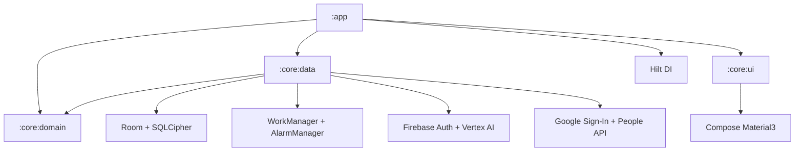
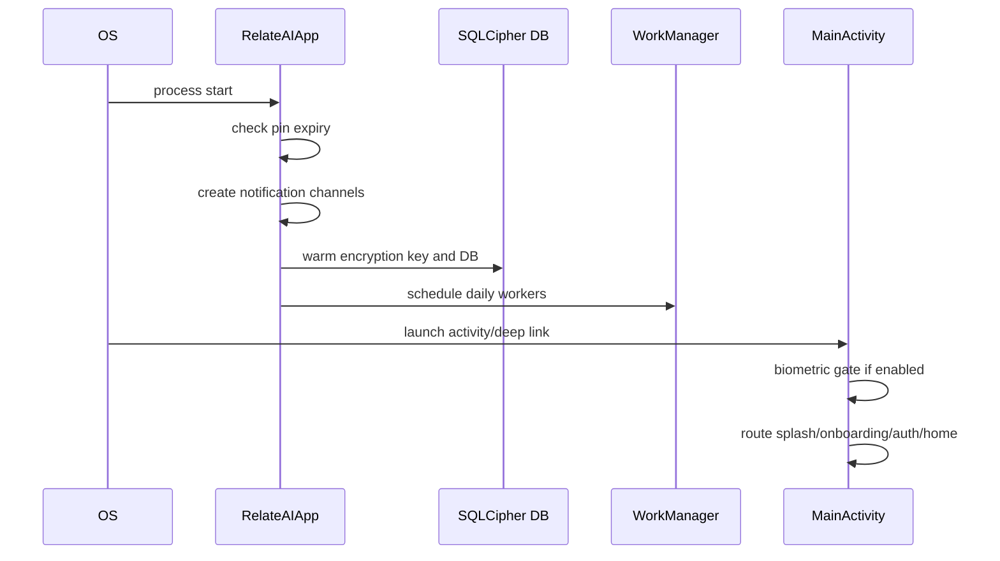
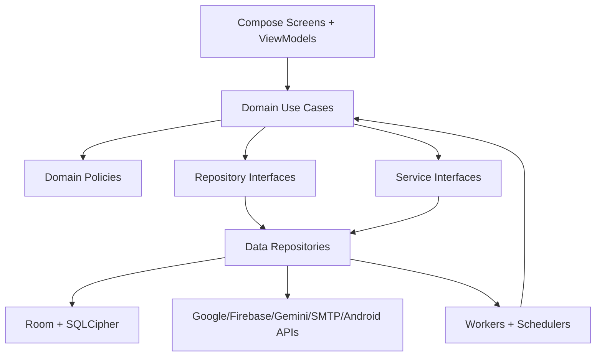

# RelateAI PLAN.md

Version: 1.0.0
Date: 2026-06-26
Status: Active rebuild and stabilization plan
Repository: `/Users/yashsomani/Desktop/Android Project/AI-Birthday`

Companion execution docs:

- [PRODUCT_BLUEPRINT.md](PRODUCT_BLUEPRINT.md): refined product idea, user journeys, operating model, and release definition.
- [IMPLEMENTATION_TASKS.md](IMPLEMENTATION_TASKS.md): micro achievable tasks, phase order, acceptance criteria, and validation commands.
- [IMPLEMENTATION_PROGRESS.md](IMPLEMENTATION_PROGRESS.md): incremental implementation log with UX impact and validation evidence.

## 0. Executive Summary

RelateAI is a local-first Android relationship assistant. The active product in source code is an Android app that imports Google/device contacts, discovers birthdays and anniversaries, generates personalized AI wishes, routes them through review or automation, sends over SMS/WhatsApp/Gmail, stores encrypted local relationship data, and supports backup/restore.

The repo is close to a full product, but it has several production blockers:

| Priority | Finding | Evidence | Required resolution |
| --- | --- | --- | --- |
| P0 | 🐛 BUG: approved messages can send early when exact alarm permission is missing | `DailyScheduler` immediately enqueues WorkManager fallback at [core/data/src/main/kotlin/com/example/core/automation/scheduler/DailyScheduler.kt:56](core/data/src/main/kotlin/com/example/core/automation/scheduler/DailyScheduler.kt:56), while `MessageDispatchWorker` sends any `APPROVED` message without checking `scheduledForMs` at [core/data/src/main/kotlin/com/example/core/automation/workers/MessageDispatchWorker.kt:67](core/data/src/main/kotlin/com/example/core/automation/workers/MessageDispatchWorker.kt:67) | Worker must defer all messages until `scheduledForMs`; WorkManager fallback must use initial delay |
| P0 | ⚡ CONFLICT: dispatch approval semantics are split | `GenerateMessageUseCase` schedules `SMART_APPROVE` while storing it as `PENDING` at [core/domain/src/main/kotlin/com/example/domain/usecase/GenerateMessageUseCase.kt:133](core/domain/src/main/kotlin/com/example/domain/usecase/GenerateMessageUseCase.kt:133), worker auto-sends `SMART_APPROVE` after scheduled time at [core/data/src/main/kotlin/com/example/core/automation/workers/MessageDispatchWorker.kt:89](core/data/src/main/kotlin/com/example/core/automation/workers/MessageDispatchWorker.kt:89), but `DispatchMessageUseCase` rejects non-`APPROVED` drafts at [core/domain/src/main/kotlin/com/example/domain/usecase/DispatchMessageUseCase.kt:27](core/domain/src/main/kotlin/com/example/domain/usecase/DispatchMessageUseCase.kt:27) | Create one dispatch eligibility policy shared by worker and use case |
| P0 | 🐛 BUG: non-birthday AI fallback copy can become birthday copy | `AiServiceImpl` calls `ResponseParser.parseMessageVariants(response)` without event type at [core/data/src/main/kotlin/com/example/core/gemini/AiServiceImpl.kt:47](core/data/src/main/kotlin/com/example/core/gemini/AiServiceImpl.kt:47), while parser defaults to `BIRTHDAY` at [core/data/src/main/kotlin/com/example/core/gemini/ResponseParser.kt:59](core/data/src/main/kotlin/com/example/core/gemini/ResponseParser.kt:59) | Always parse variants with event type |
| P0 | 🐛 BUG: contact classification prompt and parser disagree | Prompt asks for `type`, `confidence`, `language`, `formality` at [core/data/src/main/kotlin/com/example/core/gemini/PromptBuilder.kt:62](core/data/src/main/kotlin/com/example/core/gemini/PromptBuilder.kt:62); parser expects `communication_style` at [core/data/src/main/kotlin/com/example/core/gemini/ResponseParser.kt:52](core/data/src/main/kotlin/com/example/core/gemini/ResponseParser.kt:52) | Align JSON schema and add tests |
| P1 | 🐛 BUG: manual birthdays can duplicate after discovery | Manual save writes a `manual_UUID` event and also mutates contact birthday fields at [core/domain/src/main/kotlin/com/example/domain/usecase/SaveManualEventUseCase.kt:56](core/domain/src/main/kotlin/com/example/domain/usecase/SaveManualEventUseCase.kt:56); discovery later creates `${contact.id}_birthday` at [core/domain/src/main/kotlin/com/example/domain/usecase/DiscoverEventsUseCase.kt:49](core/domain/src/main/kotlin/com/example/domain/usecase/DiscoverEventsUseCase.kt:49) | Stable event identity per contact/type/date or replace/upsert canonical event |
| P1 | 🚧 INCOMPLETE: backup is not full app restore | Export covers contacts/events/pending/sent/style/memory/gifts at [core/data/src/main/kotlin/com/example/core/backup/BackupServiceImpl.kt:168](core/data/src/main/kotlin/com/example/core/backup/BackupServiceImpl.kt:168), but omits local preferences, activity logs, feedback, automation setup, sync metadata, and secret-handling rules | Define full backup contract and exclusion list |
| P1 | ⚡ CONFLICT: active product docs disagree | Source app is RelateAI; `docs/startup-idea/product-requirements-document.md` describes LeadRescue AI at [docs/startup-idea/product-requirements-document.md:1](docs/startup-idea/product-requirements-document.md:1) | Move unrelated docs out of active product docs or mark archived |
| P1 | ⚠️ UNVERIFIED: tests could not run in this shell | `./gradlew testDebugUnitTest --no-configuration-cache` failed before Gradle started: no Java runtime found | Install/configure JDK 21 and rerun test, lint, assemble |

North-star architecture: a modular, local-first Android app with a single automation policy engine, typed domain models, typed AI contracts, encrypted persistence, clear review gates, explicit delivery route eligibility, and UI states backed by string resources instead of hardcoded strings.

## 1. Repository Analysis

### 1.1 Inventory

Audited active source, Gradle config, resources, tests, scripts, CI, and docs under `app`, `core`, `scripts`, `docs`, `.github`, and `gradle`.

| Category | Count or status |
| --- | --- |
| Active repository files in audited roots | 335 |
| Kotlin production source lines | 25,561 |
| Kotlin test files | 87 |
| Android modules | `:app`, `:core:domain`, `:core:data`, `:core:ui` |
| Main product docs | [SSOT.md](SSOT.md) plus unrelated startup docs |
| TODO/FIXME/HACK scan | No direct TODO/FIXME/HACK markers found in audited active roots |
| Existing `PLAN.md` before this write | Not present |

Generated caches, local Gradle outputs, VCS internals, and binary launcher assets were not semantically analyzed line by line. They are implementation artifacts, not product behavior sources.

### 1.2 Module Graph



Expected rule: `app` owns Android screens and navigation, `core:data` owns persistence/external integrations/workers, `core:domain` owns pure policy/use cases/models, and `core:ui` owns reusable design-system components.

Current concern: `core:domain` owns Room entities under `com.example.core.db.entities` and depends on Room runtime. That makes domain policies depend on persistence-shaped models. The rebuild should either accept "domain entities are Room entities" as a deliberate local-first shortcut or move Room entities into `core:data` and expose pure domain models.

### 1.3 Major Path Map

| Area | Files |
| --- | --- |
| App startup | [app/src/main/java/com/example/RelateAIApp.kt](app/src/main/java/com/example/RelateAIApp.kt), [app/src/main/java/com/example/MainActivity.kt](app/src/main/java/com/example/MainActivity.kt), [app/src/main/AndroidManifest.xml](app/src/main/AndroidManifest.xml) |
| Navigation | [app/src/main/java/com/example/ui/navigation/Screen.kt](app/src/main/java/com/example/ui/navigation/Screen.kt), [app/src/main/java/com/example/ui/navigation/NavGraph.kt](app/src/main/java/com/example/ui/navigation/NavGraph.kt), [app/src/main/java/com/example/ui/navigation/RouteArgumentCodec.kt](app/src/main/java/com/example/ui/navigation/RouteArgumentCodec.kt) |
| Screens | `app/src/main/java/com/example/ui/screens/**` |
| ViewModels | `app/src/main/java/com/example/ui/viewmodel/**`, [app/src/main/java/com/example/ui/screens/chat/ChatHistoryViewModel.kt](app/src/main/java/com/example/ui/screens/chat/ChatHistoryViewModel.kt) |
| Domain use cases | `core/domain/src/main/kotlin/com/example/domain/usecase/**` |
| Domain policies | `core/domain/src/main/kotlin/com/example/domain/automation/**` |
| Repositories/services contracts | `core/domain/src/main/kotlin/com/example/domain/repository/**`, `core/domain/src/main/kotlin/com/example/domain/service/**` |
| Persistence | [core/data/src/main/kotlin/com/example/core/db/AppDatabase.kt](core/data/src/main/kotlin/com/example/core/db/AppDatabase.kt), `core/domain/src/main/kotlin/com/example/core/db/entities/**`, `core/domain/src/main/kotlin/com/example/core/db/dao/**` |
| Data integrations | `core/data/src/main/kotlin/com/example/core/auth/**`, `core/data/src/main/kotlin/com/example/core/contacts/**`, `core/data/src/main/kotlin/com/example/core/gemini/**`, `core/data/src/main/kotlin/com/example/core/backup/**` |
| Automation workers | `core/data/src/main/kotlin/com/example/core/automation/workers/**`, `core/data/src/main/kotlin/com/example/core/automation/scheduler/**`, `core/data/src/main/kotlin/com/example/core/automation/sender/**` |
| Notifications | `core/data/src/main/kotlin/com/example/core/automation/notifications/**` |
| Accessibility | `core/data/src/main/kotlin/com/example/core/accessibility/**` |
| Reusable UI | `core/ui/src/main/kotlin/com/example/core/ui/**` |
| Resources | `app/src/main/res/**`, `core/data/src/main/res/**`, `core/ui/src/main/res/**` |
| Tests | `app/src/test/**`, `core/data/src/test/**`, `core/domain/src/test/**` |
| Build/CI | [settings.gradle.kts](settings.gradle.kts), [build.gradle.kts](build.gradle.kts), [gradle/libs.versions.toml](gradle/libs.versions.toml), [.github/workflows/android.yml](.github/workflows/android.yml) |

### 1.4 Routes

Routes are declared in [app/src/main/java/com/example/ui/navigation/Screen.kt:12](app/src/main/java/com/example/ui/navigation/Screen.kt:12):

| Route | Screen |
| --- | --- |
| `splash` | startup routing |
| `onboarding` | onboarding |
| `auth` | sign-in/guest |
| `home` | dashboard |
| `contacts` | contact list |
| `contacts/{contactId}` | contact detail |
| `events` | event list/manual events |
| `messages` | message inbox/review |
| `settings` | app configuration |
| `analytics` | relationship analytics |
| `activity-history` | activity log |
| `wish/{contactId}/{messageRef}` | wish preview/editor |
| `chat-history/{contactId}` | sent message history |
| `style-coach` | writing style profile |
| `backup-restore` | encrypted backup/restore |
| `automation-setup` | automation diagnostics/setup |
| `memory-vault/{contactId}` | contact memories |
| `gift-advisor/{contactId}` | gift tracking and suggestions |

### 1.5 Startup Flow



### 1.6 Build System and Dependency Notes

| File | Finding |
| --- | --- |
| [settings.gradle.kts](settings.gradle.kts) | Multi-module Android project named `RelateAI` |
| [gradle/libs.versions.toml](gradle/libs.versions.toml) | Central versions: AGP 9.2.1, Kotlin 2.2.10, Room 2.7.0, Hilt 2.59.2, WorkManager 2.9.0, SQLCipher 4.5.4, Firebase BOM 34.12.0 |
| [app/build.gradle.kts](app/build.gradle.kts) | Application id `com.aistudio.relateai.qxtjrk`, namespace `com.example`, release minify/shrink enabled, release signing guarded by env vars |
| [core:data/build.gradle.kts](core/data/build.gradle.kts) | Integrates Room, SQLCipher, WorkManager, Firebase, Google APIs, JavaMail |
| [.github/workflows/android.yml](.github/workflows/android.yml) | CI runs unit tests, lint, assemble, coverage, release signing guard |

### 1.7 Oversized File Registry

These files exceed the desired maintainability target of 300 lines and should be split by feature/state/components/policies:

| Lines | File |
| ---: | --- |
| 1348 | [app/src/main/java/com/example/ui/screens/messages/MessagesScreen.kt](app/src/main/java/com/example/ui/screens/messages/MessagesScreen.kt) |
| 822 | [app/src/main/java/com/example/ui/screens/contacts/ContactDetailScreen.kt](app/src/main/java/com/example/ui/screens/contacts/ContactDetailScreen.kt) |
| 818 | [app/src/main/java/com/example/ui/screens/giftadvisor/GiftAdvisorScreen.kt](app/src/main/java/com/example/ui/screens/giftadvisor/GiftAdvisorScreen.kt) |
| 815 | [app/src/main/java/com/example/ui/screens/settings/SettingsScreen.kt](app/src/main/java/com/example/ui/screens/settings/SettingsScreen.kt) |
| 654 | [app/src/main/java/com/example/ui/screens/wish/WishPreviewScreen.kt](app/src/main/java/com/example/ui/screens/wish/WishPreviewScreen.kt) |
| 637 | [app/src/main/java/com/example/ui/screens/events/EventsScreen.kt](app/src/main/java/com/example/ui/screens/events/EventsScreen.kt) |
| 605 | [app/src/main/java/com/example/ui/screens/home/HomeScreen.kt](app/src/main/java/com/example/ui/screens/home/HomeScreen.kt) |
| 585 | [app/src/main/java/com/example/ui/screens/setup/AutomationSetupScreen.kt](app/src/main/java/com/example/ui/screens/setup/AutomationSetupScreen.kt) |
| 551 | [app/src/main/java/com/example/ui/viewmodel/MessagesViewModel.kt](app/src/main/java/com/example/ui/viewmodel/MessagesViewModel.kt) |
| 551 | [app/src/main/java/com/example/ui/screens/stylecoach/StyleCoachScreen.kt](app/src/main/java/com/example/ui/screens/stylecoach/StyleCoachScreen.kt) |
| 539 | [app/src/main/java/com/example/ui/viewmodel/AutomationSetupViewModel.kt](app/src/main/java/com/example/ui/viewmodel/AutomationSetupViewModel.kt) |
| 535 | [core/data/src/main/kotlin/com/example/core/db/AppDatabase.kt](core/data/src/main/kotlin/com/example/core/db/AppDatabase.kt) |
| 468 | [app/src/main/java/com/example/ui/screens/backup/BackupRestoreScreen.kt](app/src/main/java/com/example/ui/screens/backup/BackupRestoreScreen.kt) |
| 439 | [app/src/main/java/com/example/ui/screens/memoryvault/MemoryVaultScreen.kt](app/src/main/java/com/example/ui/screens/memoryvault/MemoryVaultScreen.kt) |
| 421 | [app/src/main/java/com/example/ui/viewmodel/WishPreviewViewModel.kt](app/src/main/java/com/example/ui/viewmodel/WishPreviewViewModel.kt) |
| 412 | [core/data/src/main/kotlin/com/example/core/gemini/PromptBuilder.kt](core/data/src/main/kotlin/com/example/core/gemini/PromptBuilder.kt) |
| 397 | [core/ui/src/main/kotlin/com/example/core/ui/components/RelateComponents.kt](core/ui/src/main/kotlin/com/example/core/ui/components/RelateComponents.kt) |
| 397 | [app/src/main/java/com/example/ui/screens/analytics/AnalyticsScreen.kt](app/src/main/java/com/example/ui/screens/analytics/AnalyticsScreen.kt) |
| 367 | [core/data/src/main/kotlin/com/example/core/contacts/GoogleContactsSync.kt](core/data/src/main/kotlin/com/example/core/contacts/GoogleContactsSync.kt) |
| 353 | [app/src/main/java/com/example/MainActivity.kt](app/src/main/java/com/example/MainActivity.kt) |
| 339 | [app/src/main/java/com/example/ui/screens/contacts/ContactListScreen.kt](app/src/main/java/com/example/ui/screens/contacts/ContactListScreen.kt) |
| 323 | [app/src/main/java/com/example/ui/navigation/NavGraph.kt](app/src/main/java/com/example/ui/navigation/NavGraph.kt) |
| 321 | [app/src/main/java/com/example/ui/screens/activity/ActivityHistoryScreen.kt](app/src/main/java/com/example/ui/screens/activity/ActivityHistoryScreen.kt) |
| 300 | [app/src/main/java/com/example/ui/viewmodel/SettingsViewModel.kt](app/src/main/java/com/example/ui/viewmodel/SettingsViewModel.kt) |

Acceptance criteria:

- No new feature file exceeds 300 lines without a documented exception.
- Existing oversized screens are split opportunistically by state section, dialog, list item, and action bar.
- `AppDatabase.kt` is reduced by moving type converters, migrations, callbacks, and builders into separate files.

## 2. Feature Audit

### 2.1 Authentication and Guest Mode

| Field | Audit |
| --- | --- |
| Files | `core/data/src/main/kotlin/com/example/core/auth/**`, [app/src/main/java/com/example/ui/viewmodel/AuthViewModel.kt](app/src/main/java/com/example/ui/viewmodel/AuthViewModel.kt), auth screen |
| Intended behavior | Google sign-in, guest mode, account state persistence, sign-out, local data clear on sign-out |
| Current behavior | Firebase/Google auth paths exist; `SecurePrefs.clearAll()` clears backing prefs at [core/data/src/main/kotlin/com/example/core/prefs/SecurePrefs.kt:171](core/data/src/main/kotlin/com/example/core/prefs/SecurePrefs.kt:171) |
| Risks | 🚧 INCOMPLETE: cached singleton `EncryptedSharedPreferences` instances remain in process after clear; sign-out/data wipe should also invalidate in-memory handles or restart app process |
| Rebuild spec | Auth state is a sealed domain state: `SignedOut`, `Guest`, `SignedIn(userId,email)`, `Locked`. All sign-out flows clear secrets, DB key, WorkManager jobs, notifications, and in-memory preference handles |

Acceptance criteria:

- Signing out cancels pending automation and clears local data.
- Re-login after sign-out does not expose old encrypted preference values through cached objects.
- Guest mode clearly marks cloud sync and Google Contacts as unavailable without throwing generic errors.

### 2.2 Permissions and Device Capabilities

| Field | Audit |
| --- | --- |
| Files | [app/src/main/AndroidManifest.xml](app/src/main/AndroidManifest.xml), [app/src/main/java/com/example/MainActivity.kt](app/src/main/java/com/example/MainActivity.kt), automation setup |
| Intended behavior | Request SMS, contacts, notification, exact alarm, and accessibility capabilities when needed |
| Current behavior | Manifest declares `SEND_SMS`, `READ_CONTACTS`, exact alarm, notification, foreground service, boot, and wake lock at [app/src/main/AndroidManifest.xml:5](app/src/main/AndroidManifest.xml:5). Main permission rationale checks SMS and notifications only at [app/src/main/java/com/example/MainActivity.kt:341](app/src/main/java/com/example/MainActivity.kt:341) |
| Risks | 🚧 INCOMPLETE: READ_CONTACTS is not part of the core permission rationale; exact alarm and accessibility readiness are split into setup diagnostics |
| Rebuild spec | Central `CapabilityState` combines permission, OS support, user setup, and channel availability per feature |

Acceptance criteria:

- Contact sync shows a specific "contacts permission missing" state.
- Send actions are disabled or rerouted when SMS/email/WhatsApp setup is missing.
- Exact-alarm denial never causes early send.

### 2.3 Contact Sync

| Field | Audit |
| --- | --- |
| Files | [core/domain/src/main/kotlin/com/example/domain/usecase/SyncContactsUseCase.kt](core/domain/src/main/kotlin/com/example/domain/usecase/SyncContactsUseCase.kt), [core/data/src/main/kotlin/com/example/core/contacts/GoogleContactsSync.kt](core/data/src/main/kotlin/com/example/core/contacts/GoogleContactsSync.kt), [core/data/src/main/kotlin/com/example/core/contacts/DeviceContactsReader.kt](core/data/src/main/kotlin/com/example/core/contacts/DeviceContactsReader.kt) |
| Intended behavior | Merge Google People API and local device contacts, preserve enrichment, discover events |
| Current behavior | Google sync, device sync, merge by phone/email/name, then event discovery. Device reader returns empty when permission is denied |
| Risks | 🚧 INCOMPLETE: permission failure can look like "no contacts"; Google sync builds raw People API requests and should encode tokens/page tokens |
| Rebuild spec | Sync pipeline returns typed outcomes: `Success`, `PartialSuccess`, `PermissionRequired`, `GoogleAuthRequired`, `RateLimited`, `NetworkFailure` |

Acceptance criteria:

- Google failure plus local contacts permission denial produces actionable UI, not a generic empty list.
- Sync tokens are encoded and invalid token recovery is covered by tests.
- Merge rules preserve user-edited names, event dates, preferences, memory notes, and relationship type.

### 2.4 Event Discovery and Manual Events

| Field | Audit |
| --- | --- |
| Files | [core/domain/src/main/kotlin/com/example/domain/usecase/DiscoverEventsUseCase.kt](core/domain/src/main/kotlin/com/example/domain/usecase/DiscoverEventsUseCase.kt), [core/domain/src/main/kotlin/com/example/domain/usecase/SaveManualEventUseCase.kt](core/domain/src/main/kotlin/com/example/domain/usecase/SaveManualEventUseCase.kt), events UI |
| Intended behavior | Discover birthdays, anniversaries, work anniversaries, and custom/manual dates |
| Current behavior | Discovery creates canonical contact-derived ids like `${contact.id}_birthday`; manual save creates `manual_UUID` and also updates contact date fields |
| Risks | 🐛 BUG: manual birthday can duplicate after discovery; 🐛 BUG: discovery date math uses lenient `Calendar` at [core/domain/src/main/kotlin/com/example/domain/usecase/DiscoverEventsUseCase.kt:107](core/domain/src/main/kotlin/com/example/domain/usecase/DiscoverEventsUseCase.kt:107) |
| Rebuild spec | Events have canonical identity `(contactId, type, month, day, sourceKind)` with a merge policy and non-lenient date validation |

Acceptance criteria:

- Saving a manual birthday then running discovery results in one birthday event.
- Invalid imported dates are rejected or quarantined, never rolled into another month.
- Event source and verification are visible in detail/debug views.

### 2.5 AI Message Generation

| Field | Audit |
| --- | --- |
| Files | [core/domain/src/main/kotlin/com/example/domain/usecase/GenerateMessageUseCase.kt](core/domain/src/main/kotlin/com/example/domain/usecase/GenerateMessageUseCase.kt), [core/data/src/main/kotlin/com/example/core/gemini/AiServiceImpl.kt](core/data/src/main/kotlin/com/example/core/gemini/AiServiceImpl.kt), [core/data/src/main/kotlin/com/example/core/gemini/PromptBuilder.kt](core/data/src/main/kotlin/com/example/core/gemini/PromptBuilder.kt), [core/data/src/main/kotlin/com/example/core/gemini/ResponseParser.kt](core/data/src/main/kotlin/com/example/core/gemini/ResponseParser.kt) |
| Intended behavior | Build personalized prompt from contact/event/style/history/memory/gifts, parse multiple variants, select quality-gated draft |
| Current behavior | Prompting and parser exist; quality gate downgrades fully-auto fallback/generic drafts; worker path passes event type to parser, service path does not |
| Risks | 🐛 BUG: non-birthday fallback copy may be wrong; parser silently falls back on malformed JSON; generation logic is duplicated between use case and worker |
| Rebuild spec | AI gateway must use typed prompt contracts, typed parse results, event-aware fallbacks, and a single generation service used by both UI and workers |

Acceptance criteria:

- Anniversary, work anniversary, and revival fallback text always matches event type.
- Malformed AI responses produce structured telemetry and `isUsingFallback = true`.
- No worker duplicates prompt, parsing, approval, or quality-gate logic.

### 2.6 Contact Classification

| Field | Audit |
| --- | --- |
| Files | [core/domain/src/main/kotlin/com/example/domain/usecase/ClassifyContactUseCase.kt](core/domain/src/main/kotlin/com/example/domain/usecase/ClassifyContactUseCase.kt), [core/data/src/main/kotlin/com/example/core/gemini/PromptBuilder.kt](core/data/src/main/kotlin/com/example/core/gemini/PromptBuilder.kt), [core/data/src/main/kotlin/com/example/core/gemini/ResponseParser.kt](core/data/src/main/kotlin/com/example/core/gemini/ResponseParser.kt) |
| Intended behavior | AI classifies relationship, language, formality, and communication style |
| Current behavior | Classification only runs for unknown relationship types, but schema mismatch defaults communication style to `WARM` |
| Risks | 🐛 BUG: communication style never reliably changes |
| Rebuild spec | Define `ContactClassificationResponse` JSON schema with `relationship_type`, `confidence`, `language`, `formality`, `communication_style`, `rationale_code` |

Acceptance criteria:

- Prompt and parser field names are identical.
- Invalid enum values are normalized or rejected.
- Unit tests cover all expected style fields.

### 2.7 Approval Modes and Dispatch

| Field | Audit |
| --- | --- |
| Files | [core/domain/src/main/kotlin/com/example/domain/automation/ApprovalModeResolver.kt](core/domain/src/main/kotlin/com/example/domain/automation/ApprovalModeResolver.kt), [core/domain/src/main/kotlin/com/example/domain/usecase/DispatchMessageUseCase.kt](core/domain/src/main/kotlin/com/example/domain/usecase/DispatchMessageUseCase.kt), [core/data/src/main/kotlin/com/example/core/automation/workers/MessageDispatchWorker.kt](core/data/src/main/kotlin/com/example/core/automation/workers/MessageDispatchWorker.kt) |
| Intended behavior | Fully auto sends without review, smart approve gives a review window, VIP requires explicit approval or expires, always ask requires explicit approval |
| Current behavior | `ApprovalModeResolver.schedulesAutomaticDispatch` returns true for `FULLY_AUTO` and `SMART_APPROVE` at [core/domain/src/main/kotlin/com/example/domain/automation/ApprovalModeResolver.kt:32](core/domain/src/main/kotlin/com/example/domain/automation/ApprovalModeResolver.kt:32); worker implements smart auto-send and VIP expiry; domain dispatch use case only allows `APPROVED` |
| Risks | ⚡ CONFLICT: UI/manual dispatch and worker dispatch disagree; 🐛 BUG: approved future messages can send early |
| Rebuild spec | One `DispatchEligibilityPolicy.evaluate(message, now)` returns `SendNow`, `DeferUntil(ms)`, `NeedApproval`, `Expire`, `Reject`, or `NoRoute` |

Acceptance criteria:

- Worker and UI use the same dispatch eligibility policy.
- `scheduledForMs` is checked before every send, regardless of status.
- Smart approve pending messages send only at or after scheduled time.
- VIP/always-ask messages never auto-send.

### 2.8 Delivery Channels

| Field | Audit |
| --- | --- |
| Files | `core/data/src/main/kotlin/com/example/core/automation/sender/**`, [core/domain/src/main/kotlin/com/example/domain/automation/AutoSendChannelSelector.kt](core/domain/src/main/kotlin/com/example/domain/automation/AutoSendChannelSelector.kt), settings/setup UI |
| Intended behavior | Choose eligible route among SMS, WhatsApp, Email based on contact data, history, preferences, blackout, and setup |
| Current behavior | Runtime dispatcher has route resolver and fallback; generation selector returns a fallback SMS/preferred channel even when no channel is available at [core/domain/src/main/kotlin/com/example/domain/automation/AutoSendChannelSelector.kt:24](core/domain/src/main/kotlin/com/example/domain/automation/AutoSendChannelSelector.kt:24) |
| Risks | 🐛 BUG: generated pending messages can store an unavailable channel instead of a no-route state |
| Rebuild spec | Channel selection returns `EligibleRoute(channel, reason)` list or `NoEligibleRoute(reasons)` |

Acceptance criteria:

- No draft is marked ready for automatic dispatch when all channels are blacked out or missing setup.
- WhatsApp automation explicitly requires accessibility service enabled and reachable.
- Email sends require validated Gmail app password setup.

### 2.9 Message Review, Regeneration, and Feedback

| Field | Audit |
| --- | --- |
| Files | [app/src/main/java/com/example/ui/viewmodel/WishPreviewViewModel.kt](app/src/main/java/com/example/ui/viewmodel/WishPreviewViewModel.kt), [core/domain/src/main/kotlin/com/example/domain/usecase/RegeneratePendingMessageUseCase.kt](core/domain/src/main/kotlin/com/example/domain/usecase/RegeneratePendingMessageUseCase.kt), messages UI |
| Intended behavior | User reviews variants, edits text, approves/schedules/rejects, regenerates with feedback |
| Current behavior | Review and regenerate exist; regenerate replaces variants but does not recompute channel, schedule, approval mode, or quality score at [core/domain/src/main/kotlin/com/example/domain/usecase/RegeneratePendingMessageUseCase.kt:57](core/domain/src/main/kotlin/com/example/domain/usecase/RegeneratePendingMessageUseCase.kt:57) |
| Risks | 🚧 INCOMPLETE: regenerated drafts can retain stale automation eligibility |
| Rebuild spec | Regeneration must re-run quality gate and dispatch readiness, while preserving user-approved status only when explicitly requested |

Acceptance criteria:

- Regenerated fallback/generic output downgrades automation if needed.
- Editing text marks the draft user-edited and recalculates readiness.
- Feedback is stored for future prompt conditioning.

### 2.10 Memory Vault

| Field | Audit |
| --- | --- |
| Files | [app/src/main/java/com/example/ui/viewmodel/MemoryVaultViewModel.kt](app/src/main/java/com/example/ui/viewmodel/MemoryVaultViewModel.kt), [app/src/main/java/com/example/ui/screens/memoryvault/MemoryVaultScreen.kt](app/src/main/java/com/example/ui/screens/memoryvault/MemoryVaultScreen.kt), memory DAO/entity |
| Intended behavior | Capture important personal facts and memories for AI personalization |
| Current behavior | Notes, categories, pinning, deletion, and validation exist |
| Risks | 🚧 INCOMPLETE: AI context should cap, rank, and redact memory notes by relevance and sensitivity |
| Rebuild spec | Memory notes have category, sensitivity, pinned flag, last-used metadata, and prompt eligibility |

Acceptance criteria:

- Prompt builder includes only allowed and relevant memories.
- Sensitive notes can be excluded from AI.
- Memory edits update personalization quality.

### 2.11 Gift Advisor

| Field | Audit |
| --- | --- |
| Files | [app/src/main/java/com/example/ui/screens/giftadvisor/GiftAdvisorScreen.kt](app/src/main/java/com/example/ui/screens/giftadvisor/GiftAdvisorScreen.kt), [app/src/main/java/com/example/ui/viewmodel/GiftAdvisorViewModel.kt](app/src/main/java/com/example/ui/viewmodel/GiftAdvisorViewModel.kt), AI gift suggestion parser |
| Intended behavior | Track gifts and ask AI for budget-aware suggestions |
| Current behavior | Gift history, validation, deletion, and suggestions exist |
| Risks | 🚧 INCOMPLETE: suggestions need stronger schema validation, dedupe against history, and explicit safety/budget bounds |
| Rebuild spec | Gift suggestions are typed objects with title, category, estimated cost, rationale, avoid-repeat flag, and source confidence |

Acceptance criteria:

- Suggestions above budget are rejected.
- Suggestions duplicate with prior gifts are flagged.
- Gift history is included in backup and AI context.

### 2.12 Style Coach

| Field | Audit |
| --- | --- |
| Files | [app/src/main/java/com/example/ui/screens/stylecoach/StyleCoachScreen.kt](app/src/main/java/com/example/ui/screens/stylecoach/StyleCoachScreen.kt), [app/src/main/java/com/example/ui/viewmodel/StyleCoachViewModel.kt](app/src/main/java/com/example/ui/viewmodel/StyleCoachViewModel.kt), style profile DAO/entity |
| Intended behavior | Let user tune writing voice |
| Current behavior | Style profile is persisted and used in prompt context |
| Risks | 🚧 INCOMPLETE: style profile should be validated against generated message quality and localized strings |
| Rebuild spec | Style profile is a first-class domain model with language/formality/style enums and examples |

Acceptance criteria:

- All generated prompts include resolved style profile.
- Invalid style values cannot enter the DB.
- UI reflects current profile immediately after save.

### 2.13 Analytics and Activity History

| Field | Audit |
| --- | --- |
| Files | analytics screen/viewmodel, activity history screen/viewmodel, activity log DAO/entity |
| Intended behavior | Show relationship health, automation history, and action trails |
| Current behavior | Screens and viewmodels exist, but backup export omits activity logs |
| Risks | 🚧 INCOMPLETE: activity logs are not part of backup; event and dispatch telemetry should feed analytics consistently |
| Rebuild spec | Activity logging is a cross-cutting domain event sink used by sync, AI, review, dispatch, backup, and settings changes |

Acceptance criteria:

- Every automatic send attempt writes one activity record.
- User-facing analytics can be rebuilt from local data after restore.
- Sensitive logs are redacted.

### 2.14 Backup and Restore

| Field | Audit |
| --- | --- |
| Files | [core/data/src/main/kotlin/com/example/core/backup/BackupServiceImpl.kt](core/data/src/main/kotlin/com/example/core/backup/BackupServiceImpl.kt), backup UI/viewmodel |
| Intended behavior | Encrypted export/import for local relationship data |
| Current behavior | AES/passphrase backup exists and exports core relational data |
| Risks | 🚧 INCOMPLETE: scope is undefined; internal encrypted copy is created in `filesDir` at [core/data/src/main/kotlin/com/example/core/backup/BackupServiceImpl.kt:181](core/data/src/main/kotlin/com/example/core/backup/BackupServiceImpl.kt:181), even when exporting to URI |
| Rebuild spec | Define backup manifest, version migrations, secret exclusions, import merge/replace modes, and cleanup policy for temporary files |

Acceptance criteria:

- Backup includes user-generated local data: contacts, events, pending/sent, style profile, memory, gifts, feedback, activity logs, non-secret preferences.
- Backup excludes OAuth tokens, API keys, email app passwords, cached DB keys, and device-specific identifiers.
- Restore validates schema version and shows a preview before mutating DB.

### 2.15 Settings and Localization

| Field | Audit |
| --- | --- |
| Files | [app/src/main/java/com/example/ui/screens/settings/SettingsScreen.kt](app/src/main/java/com/example/ui/screens/settings/SettingsScreen.kt), [app/src/main/java/com/example/ui/viewmodel/SettingsViewModel.kt](app/src/main/java/com/example/ui/viewmodel/SettingsViewModel.kt), `strings.xml`, `values-hi/strings.xml` |
| Intended behavior | Configure AI, automation, quiet hours, channel blackouts, email sender, backup reminders, biometrics, language |
| Current behavior | Settings exist and use many string resources; several ViewModels and use cases still return hardcoded English errors |
| Risks | 🚧 INCOMPLETE: hardcoded strings bypass localization and parity tests |
| Rebuild spec | All UI-facing text exits ViewModels as `UiText.StringResource` or typed domain error resolved by UI |

Acceptance criteria:

- No new user-facing string literals in ViewModels/use cases.
- English and Hindi resource parity tests cover app and data module strings.
- Runtime language changes update top-level UI without process restart where feasible.

### 2.16 Widget, Shortcuts, and Deep Links

| Field | Audit |
| --- | --- |
| Files | manifest, shortcuts XML, widget provider/resources, deep links in `NavGraph` |
| Intended behavior | Quick entry to compose/contacts and birthday widget |
| Current behavior | Launcher shortcuts, deep links, and widget resources exist |
| Risks | ⚠️ UNVERIFIED: no device/runtime widget validation was performed |
| Rebuild spec | Widget and deep-link behavior must be included in instrumentation/smoke checks |

Acceptance criteria:

- Deep links to wish/contact/settings land on the expected route with decoded arguments.
- Widget empty/loading/error states render safely.
- Shortcuts do not expose inaccessible routes when user is signed out or locked.

## 3. Conflict Resolutions

### CR-001: Dispatch Eligibility

Decision: `scheduledForMs` is authoritative for every automatic send. `APPROVED` means user or policy has authorized sending; it does not mean send immediately.

Resolved model:

| Approval mode | Initial status | Review notification | Auto dispatch | Expiry |
| --- | --- | --- | --- | --- |
| `FULLY_AUTO` | `APPROVED` | No | At `scheduledForMs` only | No |
| `SMART_APPROVE` | `PENDING` | Yes | At `scheduledForMs` if not rejected/edited to manual-only | No |
| `VIP_APPROVE` | `PENDING` | Yes | Never | Expire after configured approval window |
| `ALWAYS_ASK` | `PENDING` | Yes | Never | Optional stale reminder, no auto-send |

Implementation target: `DispatchEligibilityPolicy` in domain:

```kotlin
sealed interface DispatchDecision {
    data object SendNow : DispatchDecision
    data class DeferUntil(val epochMs: Long, val reason: Reason) : DispatchDecision
    data class NeedsApproval(val mode: ApprovalMode) : DispatchDecision
    data class Expire(val reason: Reason) : DispatchDecision
    data class Blocked(val reason: Reason) : DispatchDecision
}
```

Acceptance criteria:

- `MessageDispatchWorker`, `DispatchMessageUseCase`, notification actions, and setup diagnostics all call the same policy.
- A unit test proves a future `APPROVED` message is deferred, not sent.
- A unit test proves `SMART_APPROVE` pending sends only at/after scheduled time.

### CR-002: Product Documentation

Decision: RelateAI is the active product. LeadRescue AI docs are unrelated and must not drive app architecture.

Acceptance criteria:

- Move `docs/startup-idea/product-requirements-document.md` to an archived/unrelated area or replace it with a RelateAI PRD.
- The canonical product source is `SSOT.md` plus this `PLAN.md`.
- CI docs checks should fail if active docs mention unrelated product names in product-definition files.

### CR-003: Event Identity

Decision: contact-derived and manual events must merge by `(contactId, type, month, day)` unless the user explicitly creates a separate custom event.

Acceptance criteria:

- Manual birthday plus discovery yields one event.
- Source history records `MANUAL`, `CONTACTS`, or `MERGED`.
- User verification wins over imported data when dates conflict.

### CR-004: Backup Scope

Decision: backup is for restoreable relationship data and non-secret preferences. Device-bound credentials and tokens are excluded.

Include:

- contacts, events, pending messages, sent messages
- message feedback, activity logs, style profile
- memory notes, gift history
- quiet hours, channel blackouts, automation defaults, onboarding complete, backup reminder preference, language preference

Exclude:

- OAuth tokens and refresh/session state
- Gemini API key if user stores one locally
- Gmail sender app password
- SQLCipher DB key or derivation inputs
- Android ID, sync account identifiers, accessibility state

Acceptance criteria:

- Backup manifest includes `schemaVersion`, `createdAt`, `appVersion`, record counts, and encrypted payload checksum.
- Import preview lists what will change.
- Restore supports replace mode initially; merge mode can be later.

### CR-005: Domain Taxonomy

Decision: use enum/value-class domain models, not parallel sealed classes and raw strings.

Evidence: [core/domain/src/main/kotlin/com/example/domain/model/AutomationMode.kt](core/domain/src/main/kotlin/com/example/domain/model/AutomationMode.kt) defines sealed classes that are not the active approval model, while production code uses `ApprovalMode`, `MessageChannel`, and raw strings.

Acceptance criteria:

- Delete or migrate dead `AutomationMode`, `CommunicationChannel`, and duplicate relationship type definitions.
- Persistence boundaries convert raw DB strings to typed domain values once.
- Unknown values map to explicit `Unknown(raw)` or safe defaults with telemetry.

## 4. Target Architecture

### 4.1 Layering



Required rule: workers may orchestrate but must not duplicate domain behavior. A worker can load entities and call domain use cases/services. It should not have its own prompt, quality, approval, or dispatch business rules.

### 4.2 Architectural Decision Records

| ADR | Decision | Why |
| --- | --- | --- |
| ADR-001 | Local-first, no custom backend | Matches SSOT and current code; privacy-sensitive relationship data stays on device |
| ADR-002 | SQLCipher Room DB | Current storage model and encryption requirements |
| ADR-003 | Hilt for DI | Already used across app/data/workers |
| ADR-004 | Single automation policy engine | Prevents early sends, split semantics, and route drift |
| ADR-005 | Typed AI contracts | Prompt/parser drift is already causing bugs |
| ADR-006 | UI text through resources | Required for localization and consistent errors |
| ADR-007 | External integrations behind ports | Allows fake services in tests and avoids worker duplication |

### 4.3 Target Packages

```text
app/
  src/main/java/com/example/
    app/                 # Activity, app shell, permissions, biometric gate
    navigation/          # routes, deep link codecs
    feature/
      auth/
      home/
      contacts/
      events/
      messages/
      settings/
      setup/
      analytics/
      backup/
      memory/
      gifts/

core/domain/
  model/                 # pure domain models/enums/value classes
  policy/                # dispatch, scheduling, quality, channel eligibility
  usecase/               # app workflows
  repository/            # persistence ports
  service/               # external/service ports
  error/                 # typed failures

core/data/
  db/                    # Room entities/DAO/migrations/converters
  repository/            # repository implementations
  integration/
    auth/
    contacts/
    ai/
    email/
    sms/
    whatsapp/
  automation/
    workers/
    scheduler/
    notifications/
  security/
  backup/

core/ui/
  theme/
  components/
  text/
```

## 5. Data Model and Storage

### 5.1 Core Entities

| Entity | Role | Notes |
| --- | --- | --- |
| `ContactEntity` | local contact profile and personalization fields | Should separate imported fields from user overrides |
| `EventEntity` | birthday/anniversary/custom event | Needs canonical merge identity |
| `PendingMessageEntity` | AI draft/review/scheduled send | Needs typed status, approval mode, route readiness, generated metadata |
| `SentMessageEntity` | delivery history | SMS pending-delivery lifecycle should be explicit |
| `StyleProfileEntity` | user writing preferences | Should use typed enums |
| `MemoryNoteEntity` | personalization memories | Needs sensitivity/prompt eligibility |
| `GiftHistoryEntity` | gift tracking | Used by Gift Advisor and prompts |
| `ActivityLogEntity` | audit trail | Should be included in backup |
| `MessageFeedbackEntity` | improvement feedback | Should feed regeneration and future prompts |

### 5.2 SQLCipher Keying

Current issue: DB key is derived from Android ID, app certificate hash, and constant material at [core/data/src/main/kotlin/com/example/core/db/DatabaseKeyDerivation.kt:69](core/data/src/main/kotlin/com/example/core/db/DatabaseKeyDerivation.kt:69), then cached.

Target:

- Generate a random 256-bit SQLCipher key on first run.
- Store it in Android Keystore-backed encrypted storage.
- Never derive the DB key from stable device/app identifiers.
- On sign-out or data reset, wipe key and close DB before deletion.
- Provide migration handling for existing deterministic-key installs.

Acceptance criteria:

- New install key material is random.
- Existing installs migrate once without data loss.
- Unit tests cover key persistence, wipe, and migration states.

### 5.3 Backup Model

Backup data must be versioned independently from Room schema:

```json
{
  "version": 2,
  "createdAtMs": 0,
  "appVersion": "x.y.z",
  "counts": {},
  "payload": {
    "contacts": [],
    "events": [],
    "pendingMessages": [],
    "sentMessages": [],
    "activityLogs": [],
    "messageFeedback": [],
    "styleProfile": {},
    "memoryNotes": [],
    "giftHistory": [],
    "preferences": {}
  }
}
```

## 6. State Architecture

### 6.1 Current State Owners

| State | Owner |
| --- | --- |
| `AuthUiState` | [app/src/main/java/com/example/ui/viewmodel/AuthViewModel.kt](app/src/main/java/com/example/ui/viewmodel/AuthViewModel.kt) |
| `HomeUiState` | [app/src/main/java/com/example/ui/viewmodel/HomeViewModel.kt](app/src/main/java/com/example/ui/viewmodel/HomeViewModel.kt) |
| `ContactListUiState` | [app/src/main/java/com/example/ui/viewmodel/ContactListViewModel.kt](app/src/main/java/com/example/ui/viewmodel/ContactListViewModel.kt) |
| `ContactDetailUiState` | [app/src/main/java/com/example/ui/viewmodel/ContactDetailViewModel.kt](app/src/main/java/com/example/ui/viewmodel/ContactDetailViewModel.kt) |
| `EventsUiState` | [app/src/main/java/com/example/ui/viewmodel/EventsViewModel.kt](app/src/main/java/com/example/ui/viewmodel/EventsViewModel.kt) |
| `MessagesUiState` | [app/src/main/java/com/example/ui/viewmodel/MessagesViewModel.kt](app/src/main/java/com/example/ui/viewmodel/MessagesViewModel.kt) |
| `WishPreviewUiState` | [app/src/main/java/com/example/ui/viewmodel/WishPreviewViewModel.kt](app/src/main/java/com/example/ui/viewmodel/WishPreviewViewModel.kt) |
| `SettingsUiState` | [app/src/main/java/com/example/ui/viewmodel/SettingsViewModel.kt](app/src/main/java/com/example/ui/viewmodel/SettingsViewModel.kt) |
| `AutomationSetupUiState` | [app/src/main/java/com/example/ui/viewmodel/AutomationSetupViewModel.kt](app/src/main/java/com/example/ui/viewmodel/AutomationSetupViewModel.kt) |
| `AnalyticsUiState` | [app/src/main/java/com/example/ui/viewmodel/AnalyticsViewModel.kt](app/src/main/java/com/example/ui/viewmodel/AnalyticsViewModel.kt) |
| `ActivityHistoryUiState` | [app/src/main/java/com/example/ui/viewmodel/ActivityHistoryViewModel.kt](app/src/main/java/com/example/ui/viewmodel/ActivityHistoryViewModel.kt) |
| `BackupRestoreUiState` | [app/src/main/java/com/example/ui/viewmodel/BackupRestoreViewModel.kt](app/src/main/java/com/example/ui/viewmodel/BackupRestoreViewModel.kt) |
| `MemoryVaultUiState` | [app/src/main/java/com/example/ui/viewmodel/MemoryVaultViewModel.kt](app/src/main/java/com/example/ui/viewmodel/MemoryVaultViewModel.kt) |
| `GiftAdvisorUiState` | [app/src/main/java/com/example/ui/viewmodel/GiftAdvisorViewModel.kt](app/src/main/java/com/example/ui/viewmodel/GiftAdvisorViewModel.kt) |
| `StyleCoachUiState` | [app/src/main/java/com/example/ui/viewmodel/StyleCoachViewModel.kt](app/src/main/java/com/example/ui/viewmodel/StyleCoachViewModel.kt) |
| `ChatHistoryUiState` | [app/src/main/java/com/example/ui/screens/chat/ChatHistoryViewModel.kt](app/src/main/java/com/example/ui/screens/chat/ChatHistoryViewModel.kt) |

### 6.2 Target State Rules

- Every screen state has `isLoading`, data payload, typed error, and transient event channel.
- ViewModels expose immutable `StateFlow`.
- UI effects are one-shot and not stored as booleans that can replay after rotation.
- Domain errors are mapped to `UiText` at the UI boundary.
- Long-running operations expose progress, retry eligibility, and cancellation where appropriate.

## 7. API and Integration Contracts

RelateAI has no custom backend. All external contracts are device or third-party APIs.

| Contract | Current integration | Target failure model |
| --- | --- | --- |
| Firebase Auth / Google Sign-In | `core/data/auth` | `SignedOut`, `Cancelled`, `Network`, `ProviderError`, `AccountMissing` |
| Google People API | [core/data/src/main/kotlin/com/example/core/contacts/GoogleContactsSync.kt](core/data/src/main/kotlin/com/example/core/contacts/GoogleContactsSync.kt) | `AuthRequired`, `SyncTokenExpired`, `RateLimited`, `Network`, `ParseError` |
| Android ContactsProvider | device contacts reader | `PermissionMissing`, `ProviderUnavailable`, `Empty` |
| Gemini / Vertex AI / Google AI | Gemini client and AI service | `Disabled`, `AuthMissing`, `Quota`, `SafetyBlocked`, `MalformedResponse`, `FallbackUsed` |
| Android SMS | SMS sender | `PermissionMissing`, `NoTelephony`, `PendingDelivery`, `Failed` |
| WhatsApp Accessibility | accessibility service/sender | `ServiceDisabled`, `WhatsAppNotFound`, `UiChanged`, `SendFailed` |
| Gmail SMTP | JavaMail sender | `CredentialsMissing`, `AuthFailed`, `Network`, `SmtpRejected` |
| AlarmManager / WorkManager | schedulers/workers | `ScheduledExact`, `ScheduledInexact`, `Deferred`, `PermissionMissing` |

### Google People API Target Request

```text
GET https://people.googleapis.com/v1/people/me/connections
Authorization: Bearer <token>
personFields=names,emailAddresses,phoneNumbers,birthdays,events,biographies,metadata
syncToken=<encoded optional>
pageToken=<encoded optional>
```

Acceptance criteria:

- URL parameters are encoded.
- Sync-token invalidation is tested.
- No access token appears in logs or activity records.

## 8. UI/UX Audit

### 8.1 Screen Coverage

| Screen | Audit status | Key improvements |
| --- | --- | --- |
| Splash | Exists | Keep routing deterministic and test onboarding/auth/home branches |
| Onboarding | Exists | Ensure automation setup path is optional and localizable |
| Auth | Exists | Clarify guest limitations |
| Home | Exists, oversized | Split dashboard sections; show capability warnings compactly |
| Contacts | Exists | Distinguish empty, permission denied, sync failed, and loading |
| Contact Detail | Exists, oversized | Split preference editor, events, insights, actions |
| Events | Exists, oversized | Make source/verification visible; prevent duplicates |
| Messages | Exists, very oversized | Split tabs, row components, filters, readiness badges, dialogs |
| Wish Preview | Exists, oversized | Recalculate readiness on edit/regenerate; surface fallback state |
| Settings | Exists, oversized | Group sensitive settings, validate secrets, remove hardcoded errors |
| Analytics | Exists | Ensure metrics are derived from restorable data |
| Activity History | Exists | Include filters and redaction; add backup coverage |
| Automation Setup | Exists, oversized | Make diagnostics share `CapabilityState` |
| Backup Restore | Exists | Add manifest preview and temp-file cleanup |
| Memory Vault | Exists | Add sensitivity/prompt eligibility controls |
| Gift Advisor | Exists | Improve suggestion validation and dedupe |
| Style Coach | Exists | Add stronger enum validation |
| Chat History | Exists | Show delivery statuses and failures consistently |
| Widget/shortcuts | Exists | ⚠️ UNVERIFIED at runtime |

### 8.2 UI Requirements

- Use Material 3 components consistently.
- Keep operational screens dense and scannable; avoid marketing-style hero layouts inside the app.
- Every actionable row needs disabled/loading/error states.
- Every dangerous action has confirmation and clear consequences.
- Accessibility labels are required for icon-only actions.
- All user-facing copy must be in resources.
- Hindi resource parity must remain tested.

## 9. Error Handling

### 9.1 Target Error Model

```kotlin
sealed interface RelateFailure {
    val retryable: Boolean
    data class Permission(val permission: String) : RelateFailure
    data class Auth(val provider: String, val reason: String) : RelateFailure
    data class Network(val service: String) : RelateFailure
    data class Validation(val field: String, val reason: String) : RelateFailure
    data class Ai(val reason: AiReason, val fallbackUsed: Boolean) : RelateFailure
    data class Dispatch(val reason: DispatchReason) : RelateFailure
    data class Storage(val reason: String) : RelateFailure
}
```

### 9.2 Current Gaps

| Gap | Evidence |
| --- | --- |
| Hardcoded errors in ViewModels | Examples include message and event errors in ViewModel source |
| Generic exceptions from sync | Contact sync can throw when Google fails and local contacts are empty |
| Parser hides AI malformed responses | `ResponseParser` catches broadly and returns fallback at [core/data/src/main/kotlin/com/example/core/gemini/ResponseParser.kt:86](core/data/src/main/kotlin/com/example/core/gemini/ResponseParser.kt:86) |
| Dispatch failure handling split | Worker, dispatcher, setup diagnostics, and UI readiness each reason independently |

Acceptance criteria:

- No UI state stores raw `Throwable.message` as user copy.
- Every background failure writes a structured log and a user-actionable state where relevant.
- Retry policy is explicit per failure class.

## 10. Security and Privacy

### 10.1 Current Security Controls

| Control | Status |
| --- | --- |
| SQLCipher DB | Present |
| EncryptedSharedPreferences | Present |
| Android backup disabled | `android:allowBackup="false"` at [app/src/main/AndroidManifest.xml:21](app/src/main/AndroidManifest.xml:21) |
| Network security config | Present at [app/src/main/res/xml/network_security_config.xml](app/src/main/res/xml/network_security_config.xml) |
| Certificate pins | Expire 2027-06-01 at [app/src/main/res/xml/network_security_config.xml:7](app/src/main/res/xml/network_security_config.xml:7) |
| Pin expiry check | Logs warning only at [app/src/main/java/com/example/SecurityChecks.kt:17](app/src/main/java/com/example/SecurityChecks.kt:17) |
| Accessibility service permission | Bound with `BIND_ACCESSIBILITY_SERVICE` at [app/src/main/AndroidManifest.xml:63](app/src/main/AndroidManifest.xml:63) |
| No custom server | Matches source design |

### 10.2 Required Fixes

| Priority | Fix |
| --- | --- |
| P0 | Replace deterministic DB key derivation with random key storage and migration |
| P0 | Never send before schedule, even under exact-alarm denial |
| P1 | Add pin-expiry operational check to CI or release checklist, not only runtime log |
| P1 | Redact tokens, phone numbers, email addresses, and message bodies from logs by default |
| P1 | Define backup secret exclusion and encrypted temp-file cleanup |
| P1 | Verify deep-link argument decoding cannot route to unauthorized locked screens |
| P2 | Add privacy review for memory notes and AI prompt payloads |

Acceptance criteria:

- Static scan finds no secrets except non-secret Firebase config where explicitly allowed.
- Release build fails if certificate pins expire inside the release support window.
- Backup restore cannot import malformed or untrusted plaintext.

## 11. Performance and Reliability

### 11.1 Risks

| Risk | Impact | Fix |
| --- | --- | --- |
| Oversized Compose screens | Slow builds, hard review, accidental recomposition costs | Split composables and state sections |
| Worker/domain duplication | Divergent behavior | Move logic to domain policies/use cases |
| Raw sync client creation | Harder testing, connection inefficiency | Inject shared OkHttp client |
| Background scheduling ambiguity | Early or missed sends | Central scheduling/dispatch policy |
| AI rate limiting | Slow generation or fallback bursts | Queue, cache, backoff, and typed quota states |
| Backup temp files | Storage growth and sensitive residue | Write through scoped temp and cleanup |

### 11.2 Android Runtime Acceptance Criteria

- Contact sync for 5,000 contacts completes without ANR.
- Message list renders 1,000 pending/sent rows with paging or bounded queries.
- Daily workers are idempotent and safe after reboot.
- Dispatch retries are bounded and recorded.
- App cold start does not block main thread on DB or network work.

⚠️ UNVERIFIED: no APK size, startup trace, memory profile, or runtime UI screenshot validation was executed during this plan generation because Java/Gradle execution is unavailable in the current shell.

## 12. Testing Strategy

### 12.1 Current Test Footprint

The repository has 87 Kotlin test files across app/domain/data. Existing tests cover many domain policies, parsers, schedulers, backup pieces, localization parity, and dispatch components. Test execution could not be validated in this environment because no Java runtime was available.

### 12.2 Required P0 Tests

| Test | Expected |
| --- | --- |
| Future approved message with exact alarm denied | WorkManager fallback defers; dispatcher does not send before `scheduledForMs` |
| `SMART_APPROVE` pending before scheduled time | `DispatchEligibilityPolicy` returns `DeferUntil` or `NeedsApproval`, not `SendNow` |
| `SMART_APPROVE` pending at scheduled time | Policy returns `SendNow` |
| `VIP_APPROVE` pending after deadline | Policy returns `Expire`; no send |
| AiService anniversary fallback | Fallback text is anniversary-specific |
| Classification schema | Prompt includes `communication_style`; parser reads it |
| Manual birthday then discovery | Exactly one birthday event remains |
| Invalid discovered date | Rejected/quarantined; no lenient rollover |

### 12.3 Required P1 Tests

| Area | Tests |
| --- | --- |
| Backup | manifest preview, secret exclusion, activity log inclusion, version mismatch, temp cleanup |
| Channel routing | no-route state, blackout all channels, email missing credentials, WhatsApp service disabled |
| Localization | no hardcoded ViewModel strings, app/data English-Hindi parity |
| Security | DB key migration/wipe, pin expiry guard, log redaction |
| Sync | permission denied, Google auth missing, sync token invalid, merge conflict |
| UI | route deep links, disabled actions, empty/error/loading states |

### 12.4 Commands

Run locally after JDK 21 is installed/configured:

```bash
./gradlew testDebugUnitTest --no-configuration-cache
./gradlew lintDebug --no-configuration-cache
./gradlew assembleDebug --no-configuration-cache
./gradlew jacocoTestReport --no-configuration-cache
```

Current validation result:

```text
./gradlew testDebugUnitTest --no-configuration-cache
failed before Gradle started: Unable to locate a Java Runtime.
```

## 13. Developer Experience

### 13.1 Environment

| Requirement | Value |
| --- | --- |
| JDK | 21 recommended by Gradle toolchain config |
| Android SDK | compile SDK 37, target SDK 36 |
| Kotlin | 2.2.10 |
| Gradle | wrapper-managed |
| CI | GitHub Actions Android workflow |

### 13.2 Workflow Rules

- Keep source changes scoped to feature modules.
- Add or update tests with every policy/use-case change.
- Prefer typed domain values over raw strings.
- Keep generated Room schemas committed when migrations change.
- Do not put secrets in Gradle files, resources, or logs.
- Update `PLAN.md` when a conflict is resolved or a P0/P1 item changes status.

### 13.3 Definition of Done

For a production change:

- Unit tests added or updated.
- Existing relevant tests pass.
- Lint passes.
- UI states include loading/empty/error/success.
- Security/privacy impact is reviewed.
- Backup/restore impact is documented.
- Activity logging impact is documented.
- Localization resources updated.

## 14. Roadmap

### Phase 0: Safety Stabilization

| Item | Owner area | Acceptance |
| --- | --- | --- |
| Fix early-send bug | automation scheduler/worker | Future approved sends are deferred under all scheduler paths |
| Unify dispatch eligibility | domain/data | Worker and UI dispatch use same policy |
| Fix event-aware AI fallback | AI service/parser | All event types receive correct fallback |
| Fix classification schema | prompt/parser/tests | `communication_style` round trips |
| Resolve product-doc conflict | docs | Active docs no longer describe LeadRescue AI as this product |
| Configure Java runtime | dev environment | Gradle tests can run locally |

### Phase 1: Data Integrity and Recovery

| Item | Acceptance |
| --- | --- |
| Canonical event merge | Manual/imported birthdays do not duplicate |
| Non-lenient event dates | Invalid imported dates do not roll over |
| Backup v2 | Includes restorable local data and excludes secrets |
| DB key migration | Random key for new installs, migration for old installs |
| Channel no-route state | Automation blocks with actionable reason |

### Phase 2: Architecture Cleanup

| Item | Acceptance |
| --- | --- |
| Worker use-case reuse | No duplicated prompt/approval/dispatch rules in workers |
| Domain model typing | Approval/channel/status/relationship raw strings isolated at persistence boundary |
| Split oversized files | Largest files reduced below 300 lines or explicitly excepted |
| Error model | Typed failures and localized UI text |
| Sync client injection | People API client testable and encoded |

### Phase 3: Product Hardening

| Item | Acceptance |
| --- | --- |
| Runtime UI smoke tests | Main screens and deep links render on emulator |
| Widget validation | Widget states tested |
| Performance pass | Large contact/message datasets tested |
| Privacy controls | Sensitive memory prompt exclusions |
| Analytics integrity | Activity logs and analytics survive restore |

## 15. Debt Registry

| ID | Marker | Priority | Debt | Evidence | Fix |
| --- | --- | --- | --- | --- | --- |
| D-001 | 🐛 BUG | P0 | Approved future sends can happen early | `DailyScheduler` fallback enqueue at [DailyScheduler.kt:62](core/data/src/main/kotlin/com/example/core/automation/scheduler/DailyScheduler.kt:62) and worker immediate approved send at [MessageDispatchWorker.kt:67](core/data/src/main/kotlin/com/example/core/automation/workers/MessageDispatchWorker.kt:67) | Add schedule guard and delayed fallback |
| D-002 | ⚡ CONFLICT | P0 | Dispatch status policy split | [DispatchMessageUseCase.kt:27](core/domain/src/main/kotlin/com/example/domain/usecase/DispatchMessageUseCase.kt:27) vs [MessageDispatchWorker.kt:89](core/data/src/main/kotlin/com/example/core/automation/workers/MessageDispatchWorker.kt:89) | Shared policy |
| D-003 | 🐛 BUG | P0 | Event fallback copy defaults to birthday | [AiServiceImpl.kt:47](core/data/src/main/kotlin/com/example/core/gemini/AiServiceImpl.kt:47), [ResponseParser.kt:59](core/data/src/main/kotlin/com/example/core/gemini/ResponseParser.kt:59) | Pass event type |
| D-004 | 🐛 BUG | P0 | Classification schema mismatch | [PromptBuilder.kt:62](core/data/src/main/kotlin/com/example/core/gemini/PromptBuilder.kt:62), [ResponseParser.kt:52](core/data/src/main/kotlin/com/example/core/gemini/ResponseParser.kt:52) | Align schema |
| D-005 | 🐛 BUG | P1 | Manual/contact event duplicates | [SaveManualEventUseCase.kt:56](core/domain/src/main/kotlin/com/example/domain/usecase/SaveManualEventUseCase.kt:56), [DiscoverEventsUseCase.kt:49](core/domain/src/main/kotlin/com/example/domain/usecase/DiscoverEventsUseCase.kt:49) | Canonical merge |
| D-006 | 🐛 BUG | P1 | Lenient discovered date math | [DiscoverEventsUseCase.kt:107](core/domain/src/main/kotlin/com/example/domain/usecase/DiscoverEventsUseCase.kt:107) | Non-lenient validation |
| D-007 | 🚧 INCOMPLETE | P1 | Backup scope incomplete | [BackupServiceImpl.kt:168](core/data/src/main/kotlin/com/example/core/backup/BackupServiceImpl.kt:168) | Backup v2 |
| D-008 | 🐛 BUG | P1 | No-route channel selector still returns SMS/preferred | [AutoSendChannelSelector.kt:24](core/domain/src/main/kotlin/com/example/domain/automation/AutoSendChannelSelector.kt:24) | Return typed no-route |
| D-009 | 🚧 INCOMPLETE | P1 | Regenerate does not re-run readiness/quality | [RegeneratePendingMessageUseCase.kt:57](core/domain/src/main/kotlin/com/example/domain/usecase/RegeneratePendingMessageUseCase.kt:57) | Recompute policy |
| D-010 | ⚡ CONFLICT | P1 | RelateAI repo contains LeadRescue product docs | [product-requirements-document.md:1](docs/startup-idea/product-requirements-document.md:1) | Archive/replace docs |
| D-011 | ⚠️ UNVERIFIED | P1 | Runtime/widget/UI not smoke-tested | No emulator/browser execution in this audit | Add instrumentation/smoke tests |
| D-012 | 🚧 INCOMPLETE | P1 | READ_CONTACTS missing from core permission rationale | [MainActivity.kt:341](app/src/main/java/com/example/MainActivity.kt:341) | Central capability state |
| D-013 | 🚧 INCOMPLETE | P1 | DB key derived from device/app identifiers | [DatabaseKeyDerivation.kt:69](core/data/src/main/kotlin/com/example/core/db/DatabaseKeyDerivation.kt:69) | Random key migration |
| D-014 | 🚧 INCOMPLETE | P1 | Pin expiry only runtime log | [SecurityChecks.kt:17](app/src/main/java/com/example/SecurityChecks.kt:17) | CI/release guard |
| D-015 | 🚧 INCOMPLETE | P2 | Oversized screens/viewmodels | [MessagesScreen.kt](app/src/main/java/com/example/ui/screens/messages/MessagesScreen.kt) and others | Split files |
| D-016 | 🚧 INCOMPLETE | P2 | Dead/duplicate automation/channel taxonomy | [AutomationMode.kt:7](core/domain/src/main/kotlin/com/example/domain/model/AutomationMode.kt:7) | Remove/migrate |
| D-017 | 🚧 INCOMPLETE | P2 | Domain depends on Room-shaped entities | Entities/DAOs live under domain module | Decide and document model boundary |
| D-018 | ⚠️ UNVERIFIED | P2 | Gradle tests not executed | Missing Java runtime | Install JDK 21 and rerun |

## 16. Acceptance Criteria for the Rebuild

The rebuild is production-ready only when all of the following are true:

- P0 debt items D-001 through D-004 are fixed and covered by unit tests.
- The dispatch policy has one implementation used everywhere.
- No automatic send can occur before `scheduledForMs`.
- AI generation and regeneration use event-aware parsing and typed fallback results.
- Contact classification prompt/parser schemas match.
- Manual and discovered events merge without duplicates.
- Backup v2 has a documented include/exclude manifest and import preview.
- Secrets are excluded from backup and redacted from logs.
- Gradle unit tests, lint, and debug assembly pass on JDK 21.
- Active product docs refer to RelateAI, not unrelated products.
- New UI-facing text is resource-backed and localization parity remains tested.

## 17. Glossary

| Term | Meaning |
| --- | --- |
| Approval mode | Policy deciding whether a generated message can send automatically |
| `FULLY_AUTO` | Sends at scheduled time without review if quality and route gates pass |
| `SMART_APPROVE` | User can review first; sends at scheduled time if not rejected |
| `VIP_APPROVE` | Requires explicit user approval; expires after approval window |
| `ALWAYS_ASK` | Requires explicit user approval; never auto-sends |
| Pending message | Generated draft that may be reviewed, scheduled, sent, rejected, or expired |
| Dispatch eligibility | Final decision on whether a message may send now, later, or never |
| Route eligibility | Whether SMS, WhatsApp, or Email can currently send to the contact |
| Fallback message | Template copy used when AI output is unavailable or invalid |
| Relationship data | Local contacts, dates, messages, memories, gifts, feedback, and activity logs |
| Secret | Token, password, API key, DB key, or device-bound credential |
