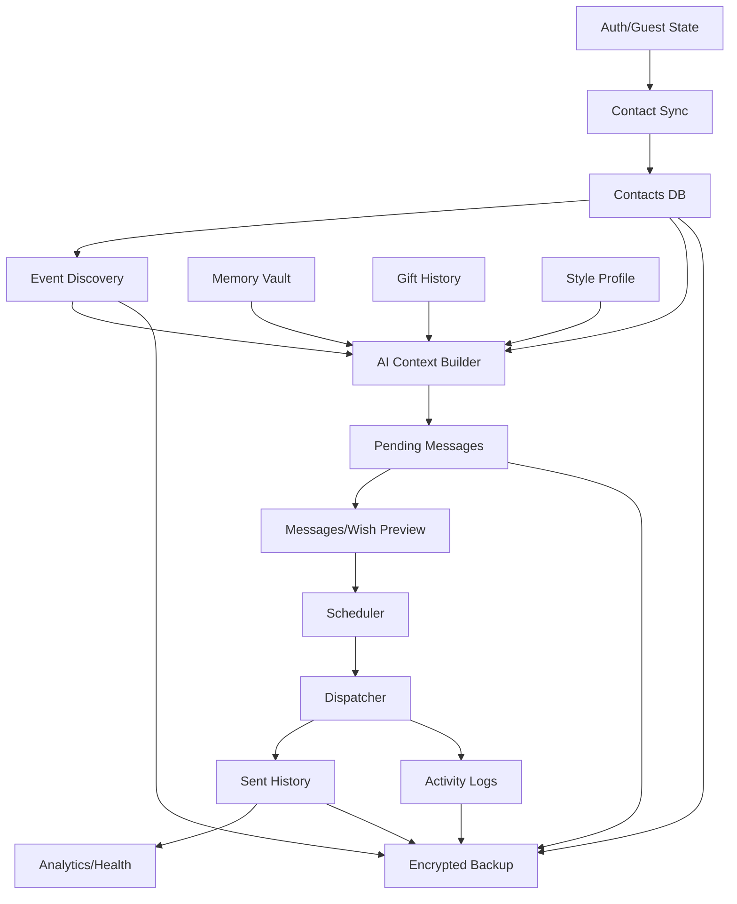

# RelateAI Product, UX, Workflow, and Technical Analysis

Version: 1.0.0
Date: 2026-06-26
Source documents: [SSOT.md](SSOT.md), [PLAN.md](PLAN.md), [PRODUCT_BLUEPRINT.md](PRODUCT_BLUEPRINT.md), [IMPLEMENTATION_TASKS.md](IMPLEMENTATION_TASKS.md)
Status: Comprehensive analysis and implementation guide

## 1. Executive Summary

RelateAI is a local-first Android relationship operating assistant. It imports Google and device contacts, discovers relationship events, enriches contact context, generates personalized AI messages, routes drafts through approval modes, schedules delivery, sends through SMS/WhatsApp/Gmail, logs activity, and supports encrypted backup/restore.

The product has enough implemented surface to be more than a birthday reminder, but the next step is to make it feel like a trustworthy daily command center. The highest-value improvements are:

1. Make Home rank the next best relationship action instead of showing many competing cards.
2. Make Messages the operational control room for review, blocked sends, scheduled sends, and failures.
3. Make AI Doctor a guided fix sequence instead of a diagnostic report users must interpret.
4. Eliminate automation ambiguity so scheduled messages never send early and users always see why a send is allowed, delayed, or blocked.
5. Improve AI contract correctness so generated or fallback content matches event type and classification fields.
6. Make backup, recovery, and privacy status visible before a user needs them.

## 2. Current State Analysis

### 2.1 Modules and Feature Areas

| Area | Current state | Primary files/modules |
| --- | --- | --- |
| App shell | Compose app with biometric gate, bottom navigation, permission rationale, deep links | `:app`, `MainActivity`, `RelateAIApp`, navigation |
| Authentication | Google sign-in, Firebase auth, guest/local mode, sign-out purge | `core/data/auth`, `AuthViewModel` |
| Contacts | Google People API sync, device contacts import, dedupe/merge, contact list/detail | contact sync use cases, contacts screens |
| Events | Birthday, anniversary, work anniversary, manual/custom events, reminders | event use cases, events screen, reminder scheduler |
| AI personalization | Gemini-backed message generation, classification, style profile, memory, gift history | Gemini service, prompt builder, parser, style/memory/gift flows |
| Messages | Pending, approved, sent, failed, rejected states; wish preview; bulk actions | messages screen/viewmodel, wish preview |
| Automation | Approval modes, daily workers, exact alarms, WorkManager fallback, boot recovery | domain policies, workers, schedulers |
| Delivery | SMS, WhatsApp accessibility, Gmail SMTP, route resolver, status callbacks | sender package |
| Operations | AI Doctor, activity history, analytics, CSV export, health scoring | setup, activity, analytics features |
| Security | SQLCipher, encrypted preferences, biometric lock, pinning, redaction | DB, prefs, security utilities |
| Backup | Encrypted export/import with passphrase | backup service and UI |
| Developer support | Gradle modules, CI, tests, lint, coverage | Gradle, GitHub Actions |

### 2.2 User Journeys

| Journey | Current flow | Friction |
| --- | --- | --- |
| First setup | Onboarding -> auth/guest -> sync -> setup checks -> settings | Setup spans several screens; next step can be unclear |
| Daily use | Home -> event/message/setup/contact action | Many cards compete for attention; next best action needs stronger ranking |
| Contact enrichment | Contacts -> Contact Detail -> preferences/memory/gifts/style | User must know which fields improve AI quality |
| Event creation | Events -> manual event -> reminder | Duplicate risk and event source trust need clearer feedback |
| Draft review | Messages/Home/notification -> Wish Preview -> approve/reject/edit/regenerate | Review can require navigation back to queue unless review-next flow is used |
| Automation setup | Settings -> AI Doctor -> system settings or related surfaces | Diagnostics can overwhelm; guided fix sequence is needed |
| Failed send recovery | Messages Failed tab -> AI Doctor -> retry | Failure reason should route directly to fix-and-retry path |
| Backup and restore | Settings -> Backup Restore -> passphrase -> export/import | Backup freshness is not prominent enough in daily workflow |
| Analytics | Analytics -> report/export -> interpret | Metrics need direct recommended actions |

### 2.3 User Roles and Permissions

| Role/state | Capabilities | Constraints |
| --- | --- | --- |
| Signed-out user | Onboarding, auth, guest entry | Cannot sync Google contacts or use authenticated cloud AI path |
| Guest/local user | Local demo/contact flow, device-only actions where allowed | Needs clear labels for missing Google sync/auth behavior |
| Signed-in user | Google sync, Gemini/Firebase-backed paths, full local relationship data | Still must grant contacts/SMS/notification/exact-alarm/accessibility as needed |
| Locked user | Biometric/device credential prompt | Deep links and shortcuts must not bypass lock |
| Automation-enabled user | Scheduled review/send workflows | Critical sends still respect approval mode, schedule, permissions, quiet hours, blackout, route readiness |

### 2.4 Existing Workflows

| Workflow | Manual steps | Automated steps |
| --- | --- | --- |
| Contact sync | User signs in/grants permission/triggers sync | Google/device import, merge, event discovery |
| Classification | User may review/edit relationship data | AI classifies unknown contacts |
| Message creation | User reviews or generates manually | Daily workers generate drafts from upcoming events |
| Approval | User edits/approves/rejects/revokes | Notifications and queues surface pending work |
| Scheduling | User sets global/contact preferences | Scheduler computes send time, quiet hours, blackout deferral |
| Dispatch | User configures channels and permissions | Dispatcher resolves route and attempts SMS/WhatsApp/email |
| Recovery | User inspects failures and retries | Activity logs, dead-letter queue, AI Doctor diagnostics |
| Backup | User chooses passphrase and destination | App serializes/encrypts local data |

### 2.5 Data Flow

### 2.6 Dependencies and Integrations

| Integration | Purpose | UX risk | Safeguard |
| --- | --- | --- | --- |
| Firebase Auth / Google Sign-In | Identity and auth state | Sign-in failure can block sync | Guest mode, explicit retry, clear account state |
| Google People API | Google contacts | Token/sync failures can appear as empty data | Typed sync outcomes and permission/auth messages |
| Android ContactsProvider | Device contacts | Permission denial can look like no contacts | Permission-specific empty state |
| Gemini / Google AI | Drafts, classification, gifts, style | Malformed or generic output | Typed contracts, event-aware fallback, quality gate |
| SMS APIs | SMS sending | Permission/SIM/delivery uncertainty | Explicit readiness and status callbacks |
| WhatsApp Accessibility | WhatsApp automation | High trust burden and UI fragility | Opt-in setup, transparent service copy, manual fallback |
| Gmail SMTP | Email sending | Credential errors | Test email, setup diagnostics, no secret logging |
| AlarmManager / WorkManager | Scheduling | Exact-alarm denial can cause timing bugs | Policy-level schedule guard and delayed fallback |
| SQLCipher / Encrypted prefs | Local privacy | Key migration and recoverability complexity | Random key, explicit encrypted backup |

## 3. UX and Product Audit by Feature

| Feature | Current behavior | UX issues | Accessibility issues | Performance concerns | Click/cognitive load | Recommended improvement |
| --- | --- | --- | --- | --- | --- | --- |
| Onboarding | Explains setup and links to automation readiness | Setup is spread across auth, permissions, AI Doctor, settings | Progress changes should be announced | Recomputing setup checks can be expensive | User must infer next setup step | Add guided setup resume path with one next fix |
| Auth/guest | Google sign-in and guest mode exist | Guest limitations may appear only after a blocked action | Auth failures need clear live-region copy | OAuth retries can feel stalled | User may not know why sync/AI is unavailable | Add guest banner and upgrade action on Home |
| Home | Dashboard, setup progress, quick actions, planner | Many competing cards; stale backup not prominent enough | Status must not rely on color | Sync-on-empty must stay bounded | User must choose from many cards | Rank one primary next action plus secondary actions |
| Contacts list | Search/filter/sort, sync controls | Missing context is not always task-oriented | Filter chips need labels and 48dp targets | Large local filtering may need profiling | User opens each contact to inspect gaps | Add contact quality chips and missing-data filters |
| Contact detail | Rich profile, automation, memory/gift/chat links | Dense fields and technical automation values | Group headings and controls must be focusable | Loading many sections can grow costly | User must know what improves AI | Essentials first, advanced collapsed, quality impact visible |
| Events | Lists discovered/manual events | Source/confidence/duplicates need clearer display | Event state labels must be textual | Large event lists need stable keys | Duplicate/conflict handling needs fewer decisions | Show source, verification, conflict/merge actions |
| Messages | Tabs, bulk actions, readiness labels | Lifecycle statuses require learning | Bulk selected state and status labels need clear text | Large queues need bounded filtering | User can scan multiple tabs to find work | Reorganize by Needs review, Scheduled, Blocked, Sent, Failed |
| Wish Preview | Variants, edit, regenerate, approve/reject | Risk/readiness and route details should be stronger | Variant selection and editor need clear labels | Regeneration should not block UI | User may not know why draft is generic | Show event, route, schedule, quality, fallback, why signals |
| AI Doctor | Grouped diagnostics | Technical terms can overwhelm | Group status should be screen-reader friendly | Checks should be cached/cancellable | User jumps between fix screens | Ranked guided fix sequence |
| Backup/Restore | Passphrase export/import | Backup freshness not visible enough; passphrase anxiety | Password strength/status announcements | Large files need progress | User must remember backup state | Home stale-backup prompt, manifest preview, restore rehearsal checklist |
| Analytics | Metrics and CSV export | Insights not always actionable | Charts need text alternatives | DAO aggregates may be needed for scale | User translates data to action | Attach actions to low health, failed channels, stale contacts |
| Activity History | Timeline and filters | Operational details need task framing | Filters need labels | Large logs need paging/limits | User hunts for cause | Add action-oriented filters and deep links |
| Memory Vault | Notes, categories, pin/delete | Sensitive prompt inclusion needs control | Chip/button labels needed | Prompt context should be bounded | Blank page effort | Suggested prompts, sensitivity, prompt eligibility |
| Gift Advisor | Gift history and AI suggestions | Suggestions need dedupe and confidence | Dialog fields need clear labels | AI calls can be slow | User evaluates repeated ideas | Budget/dedupe guard and explain rationale |
| Settings | AI, automation, credentials, privacy, sign-out | Dense and sensitive | Destructive flows need focus order | Settings loads should avoid blocking | User navigates for setup state | Group by outcome and link AI Doctor top fixes |
| Widget/shortcuts | Quick birthday/contact access | Locked/signed-out behavior must be clear | Widget text contrast/labels | Updates should be bounded | User may enter blocked route | Lock-aware shortcuts and tested widget states |

## 4. Automation Opportunities

| Automation | Business value | User benefit | Implementation approach | Risks and safeguards |
| --- | --- | --- | --- | --- |
| Ranked next action on Home | Better activation and retention | User knows what to do first | `NextBestActionUseCase` combines pending reviews, setup blockers, stale backup, upcoming events, low health | Navigation only; no send/sync/backup starts without explicit action |
| Guided setup sequence | Higher setup completion | One fix at a time | Rank AI Doctor checks by required/quality/reliability/recovery and route to fix | Never auto-enable permissions or credentials |
| Contact quality scoring | Better AI personalization | User sees missing details | Shared helper for relationship, event, channel, memory, style, gift context | Suggestions only; user controls edits |
| Event duplicate prevention | Fewer duplicate reminders/messages | Less cleanup work | Canonical event identity and duplicate warning | Allow explicit "save anyway" for intentional separate event |
| Message readiness precheck | Fewer failed sends | User sees blockers before approval | Shared readiness helper for Messages, Wish Preview, Dispatcher, AI Doctor | Approval may still be allowed when send is not impossible, but auto-send stays blocked |
| Event-aware AI fallback | Correct output under AI failures | No birthday copy for anniversaries/work events | Pass event type through all AI parse paths | Fallback is labeled; user can edit/regenerate |
| Classification schema alignment | Better default personalization | Relationship style fields actually populate | Shared AI contract constants/model | Low-confidence results remain editable |
| Smart backup prompt | Lower data-loss risk | User sees backup need at the right time | Home/settings backup freshness and reminder | Export requires passphrase and destination |
| Failed-send recovery assistant | Lower support burden | Direct fix-and-retry path | Map failure reasons to setup actions and message retry | User explicitly retries; no silent resend |
| Review-next queue | Faster approvals | Sequential review without hunting | Wish Preview next pending route | User chooses Review next; no auto-approval |
| Sensitive memory controls | Privacy trust | User controls what AI sees | Memory sensitivity and prompt eligibility | Default conservative for sensitive categories |
| Smart channel defaults | Fewer setup mistakes | Suggested channel per contact | Use history and available routes | User can override per contact/message |

## 5. UX Improvement Recommendations

### 5.1 Information Architecture

- Make Home the command center.
- Make Messages the queue for message work.
- Make AI Doctor the guided repair tool.
- Keep Contact Detail for profile depth, not routine queue work.
- Keep Analytics action-oriented, not just descriptive.

### 5.2 Reduced Click Paths

| Task | Current issue | Target path |
| --- | --- | --- |
| Review pending approval | Home may show multiple cards | Home primary action -> Messages Needs review or Wish Preview |
| Fix automation setup | Settings/AI Doctor/system screens | Home/AI Doctor top fix -> exact destination |
| Add missing contact context | Contact list lacks task framing | Contacts filter -> Contact Detail focused section |
| Recover failed send | Failed row plus diagnostics | Failed tab assistant -> exact setup fix -> retry |
| Create backup | Settings only | Home stale backup prompt -> Backup Restore |

### 5.3 Feedback and Status

- Use textual status labels alongside color.
- Show "waiting for approval", "scheduled", "blocked by quiet hours", "missing SMS permission", "missing email setup", "fallback AI copy", and "ready to send".
- Show when background work is running and what will happen next.
- Make destructive and external actions explicit.

### 5.4 Error Prevention and Recovery

- Prevent early sends at policy level.
- Warn on duplicates before manual event persistence.
- Block impossible route auto-dispatch before approval.
- Validate AI contract fields before trusting parsed data.
- Show backup/restore preview before DB mutation.
- Preserve manual retry control for failed sends.

## 6. Prioritized Improvement Roadmap

### Quick Wins, 1-3 Days

| Item | Priority | Impact | Effort | Dependencies | Business value |
| --- | --- | --- | --- | --- | --- |
| Fix AI classification schema drift | P0 | High | Low | Prompt/parser tests | Better personalization quality |
| Fix event-aware AI fallback path | P0 | High | Low | AI service/parser tests | Prevents wrong-event copy |
| Add dispatch policy tests for early-send bug | P0 | High | Low | Test environment | Automation trust |
| Add Home stale-backup prompt model | P1 | Medium | Low | SecurePrefs timestamp | Reduces data loss |
| Add richer Messages blocked reason text | P1 | High | Medium | readiness helper | Fewer failed retries |
| Add docs link hierarchy and execution status | P1 | Medium | Low | existing docs | Better engineering focus |

### Short-Term, 1-2 Weeks

| Item | Priority | Impact | Effort | Dependencies | Business value |
| --- | --- | --- | --- | --- | --- |
| Unified dispatch eligibility policy | P0 | Very high | Medium | domain/data integration | Prevents critical automation bugs |
| Delayed WorkManager fallback for exact-alarm denial | P0 | Very high | Medium | scheduler tests | Prevents accidental early sends |
| Canonical event identity and merge | P1 | High | Medium | event tests | Prevents duplicate reminders/messages |
| No-route channel state | P1 | High | Medium | route resolver | Fewer failed sends |
| Guided AI Doctor fix sequence | P1 | High | Medium | setup summary | Better activation |
| Backup v2 manifest preview | P1 | High | Medium | backup service | Recovery confidence |

### Medium-Term, 2-6 Weeks

| Item | Priority | Impact | Effort | Dependencies | Business value |
| --- | --- | --- | --- | --- | --- |
| Next-best-action engine | P1 | Very high | High | setup/message/contact metrics | Product becomes daily command center |
| Contact quality model across Contacts/Home/AI Doctor | P1 | High | Medium | contact data helpers | Better AI quality |
| Sensitive memory prompt controls | P1 | High | Medium | memory schema/UI | Privacy trust |
| Worker use-case reuse | P2 | High | High | domain policy cleanup | Maintainability |
| Split oversized screens | P2 | Medium | High | UI tests | Lower change risk |
| Typed error model and localization mapping | P2 | High | High | domain refactor | Better UX and maintainability |

### Long-Term Strategic Improvements

| Item | Priority | Impact | Effort | Dependencies | Business value |
| --- | --- | --- | --- | --- | --- |
| Full release validation matrix | P1 | Very high | High | device/emulator automation | Production confidence |
| Backup restore rehearsal and migration assistant | P2 | High | High | backup v2 | Trust and recoverability |
| Predictive relationship planner | P2 | High | High | analytics/health/event history | Differentiated product value |
| Privacy-aware AI context controls | P2 | Very high | High | memory/style/contact models | Long-term trust |
| Power-user batch approval with transparency | P2 | Medium | High | message readiness/policy | Efficiency for high-volume users |

## 7. Implementation Plan

### 7.1 Technical Architecture Changes

- Add shared `DispatchEligibilityPolicy` and use it from workers, use cases, notification actions, and readiness UI.
- Add shared AI contract models/constants for message variants and classification.
- Add shared message readiness helper for Messages, Wish Preview, Dispatch, and AI Doctor.
- Add shared contact quality helper for Contact Detail, Contacts, Home, and AI Doctor.
- Extract setup readiness summary into a reusable use case/service.
- Move worker business logic toward domain use cases.

### 7.2 Frontend Improvements

- Home: primary next-action card, stale backup prompt, setup blocker, low-health action.
- Messages: task-state tabs, readiness badges, failure assistant, direct fix-and-retry.
- Wish Preview: stronger schedule/route/quality/fallback visibility.
- Contacts: quality chips and filters.
- Events: source/verification/conflict states.
- AI Doctor: guided fix sequence.
- Backup: manifest preview and clearer recovery guidance.

### 7.3 Backend/Data Improvements

- Canonical event identity and non-lenient date handling.
- Backup v2 manifest with explicit include/exclude rules.
- Random SQLCipher key generation and migration plan.
- Persist richer dispatch/failure reason where useful.
- Encode People API tokens and return typed sync outcomes.

### 7.4 API and Integration Enhancements

- Typed AI response contracts with event-aware fallback.
- People API request builder with encoded params.
- Delivery route eligibility result model.
- Gmail/SMS/WhatsApp setup diagnostics with actionable outcomes.

### 7.5 State Management Improvements

- One immutable UI state per screen with data, loading, typed error, and one-shot effects.
- Domain failures mapped to `UiText` at UI boundary.
- Shared summary state for setup/readiness instead of recomputing differently per screen.
- Avoid raw strings in ViewModels and use cases for user-facing messages.

### 7.6 Performance Optimizations

- Keep Home bounded and avoid repeated background sync on every reload.
- Add paging or bounded queries for large Messages, Activity History, Contacts, and Analytics flows.
- Cache diagnostic checks where safe.
- Keep backup/import work off the UI thread with progress.
- Use stable keys and incremental filtering in long Compose lists.

### 7.7 Analytics and Tracking Recommendations

Keep tracking local and privacy-safe:

- setup completed
- contacts enriched
- approvals reviewed
- blocked sends by reason
- failed sends fixed
- backups exported/imported
- AI regenerations accepted
- messages sent on time
- stale relationships acted on

These metrics should support product decisions without collecting message bodies or sensitive relationship data externally.

## 8. Improvement Backlog Alignment

The highest-impact implementation tasks remain:

1. T000-T001: make Java/Gradle validation work and record baseline.
2. T100-T118: unified dispatch eligibility and no-early-send safeguards.
3. T200-T211: AI event fallback and classification schema correctness.
4. T300-T316: event/channel/regeneration data integrity.
5. T400-T414: backup/security/recovery.
6. T500-T519: product UX next-action improvements.

## 9. Control and Safety Rules

- Automation may prepare, rank, route, schedule, and remind.
- Automation must not silently grant permissions, enter credentials, export backups, approve VIP messages, or send before schedule.
- Every automatic decision must have a visible reason.
- Every critical action must be reversible, cancellable, or explicitly confirmed where possible.
- Users must always be able to edit, reject, disable, or override suggestions.

## 10. First Incremental Implementation Target

Start with AI contract correctness because it is high-impact and low-risk:

- Add `communication_style` to classification prompt schema.
- Ensure parser and prompt use the same field names.
- Pass `event.type` into message variant parsing in AI generate/regenerate paths.
- Add or update focused tests when the local Java environment is available.

Expected UX improvement:

- Users receive event-appropriate fallback copy.
- Contact style defaults become more accurate.
- Less manual correction is needed.
- User control is preserved because AI classification and generated drafts remain editable/reviewable.

