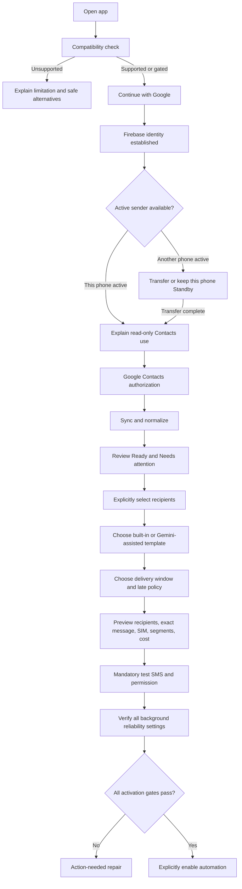
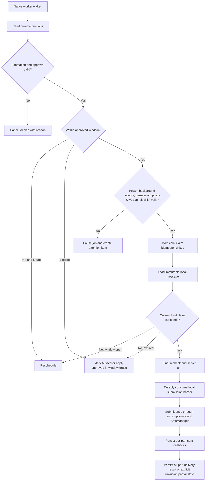
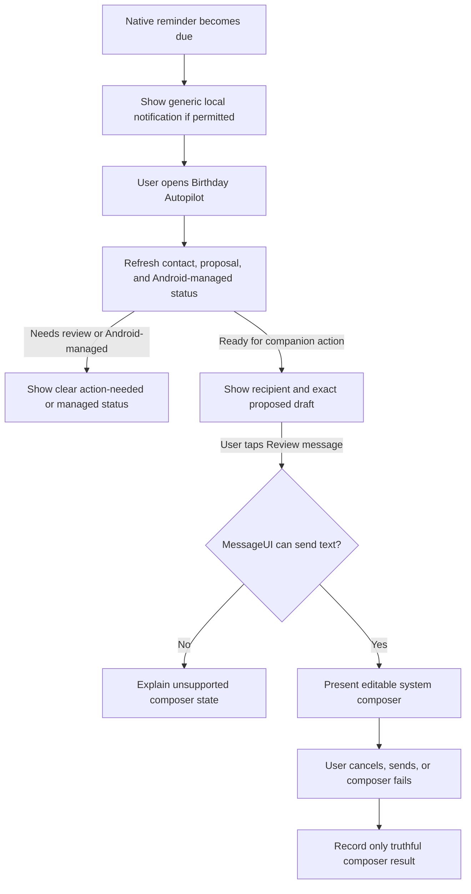
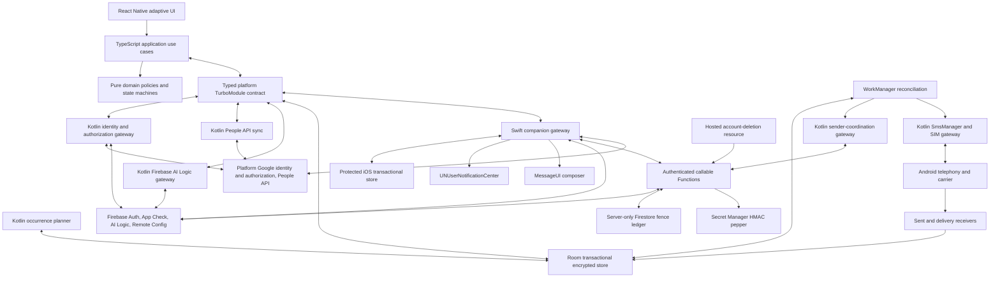

# Birthday Autopilot — Project About and Sole Source of Truth

Date: 2026-07-12

Status: **implementation in progress; activation, restricted packaging, and release remain fail-closed behind Section 19 evidence gates**

Authority: **This is the only product and technical source of truth. Gated implementation candidates may be built and tested before every external Phase 0 decision is complete, but no restricted SMS artifact may be packaged or distributed and neither platform may be activated or represented as production-ready until its applicable Section 19 evidence gates pass.**

Directive supersession: **the user's later, explicit Birthday Autopilot React Native instructions for Android and iOS supersede the earlier attached VS Code Developer Workbench objective. That earlier objective is historical context only and has no product, architecture, scope, or implementation authority.**

## 1. Binding product decision

Birthday Autopilot is a cross-platform React Native product with two deliberately different platform editions. The Android Automation Edition helps a user enroll selected Google Contacts and send each enrolled person one pre-approved birthday SMS from the user's chosen phone SIM during a configured delivery window without requiring action on the birthday. The iOS Companion Edition shares birthday planning, Contacts, templates, approvals, activity, privacy controls, and reminders, but every SMS remains a foreground, user-confirmed MessageUI composer action.

### Product promise

**On supported Android Automation Edition devices, set it up once, clearly see whether it is ready, and send a safe birthday greeting to the right approved people without a birthday-day task. On iPhone, keep the same birthday plan and receive a useful reminder, then review and send through Apple's system message composer.**

### Exact meaning of the promise

- **Appropriate person** means an Android automated recipient or iOS proposed composer recipient the user explicitly enables. Gemini never decides who matters, infers relationships, or automatically enrolls contacts. On iOS the user can still change the final recipient in MessageUI; that edit is outside the app's approval state and visibility.
- **Automated** applies only to Android Automation Edition and means no confirmation at send time after the user has approved the recipient, number, final message, SIM policy, recurrence, and delivery window.
- **SMS** on Android Automation Edition means a carrier SMS sent from the Android device's SIM through Android SmsManager. On iOS Companion Edition, the app can only present Apple's editable MessageUI composer inside the foreground app with an initial recipient and draft; the user controls edits and the Send or Cancel action, while iOS/Messages controls the available sender line and final SMS/MMS/iMessage transport. The app cannot select, observe, or guarantee that final sender line, transport, payload, carrier acceptance, or delivery. Neither edition is WhatsApp, email, a cloud SMS number, or a marketing campaign.
- **Companion** means iOS provides the shared planning and review experience plus best-effort local reminders, but never sends in the background, bypasses the system composer, or represents a composer result as carrier delivery.
- **Shared** means equivalent product capabilities and shared React Native presentation where safe, not cloud replication of raw contacts, approvals, schedules, or message content. Each device authorizes Contacts and keeps its private working data locally.
- **Reliable** means best effort within a visible time window with truthful status and recovery. It does not mean exact-minute execution or guaranteed carrier delivery.
- **One Google login** means one visible Google account selection becomes the Firebase identity and the account used for Google Contacts. Gemini shows no additional login. Google Contacts consent and platform permission or composer surfaces remain separate security prompts.
- **No access tokens** means the user never creates, pastes, sees, stores, or manages a token or API key. OAuth, Firebase, and App Check credentials still exist internally because Google APIs require them; official SDKs manage them outside React Native JavaScript and logs.
- **All ages** means the UI is accessible, plain-language, and usable by adults with varied technical ability. It does not make the app child-directed or eligible for a Families program without a separate compliance design.

### Primary unattended release target

The requested unattended behavior is the primary requirement, so the first product target is an **Android Automation Edition**. It uses immutable pre-approved messages, native scheduling, and direct SIM sending.

Public Google Play distribution is not assumed. SEND_SMS is hard-restricted, and a birthday-only app may not receive Google's reviewed permission exception. An unattended build may use only a named, tested distribution path whose installer or enterprise mobility manager allowlists hard-restricted SEND_SMS before Android offers the runtime grant; the user cannot create this allowlist manually. Managed Google Play private apps and every Play test track are still Play distribution and are not presumed exempt from restricted-permission review. The product must never disguise itself as a default SMS app merely to obtain permission.

If the owner requires normal Google Play distribution and Google rejects the SMS permission path, one of the product requirements must change:

1. require the user to tap Send in the system composer;
2. use a paid backend SMS provider and a service-owned sender number; or
3. build a genuine full default SMS/MMS client.

None of those substitutions may happen silently.

The iOS Companion Edition is also required for MVP, but it is not a substitute implementation of unattended sending. Its value is cross-platform planning and reminders with an explicitly reviewed, user-controlled composer. Android distribution or SEND_SMS failure never authorizes an iOS background-send workaround or a claim that iOS satisfies the unattended promise.

### Platform scope

- **Shared MVP:** one React Native mobile product for Android and iOS with Google identity, read-only Google Contacts, normalization, explicit recipient selection, deterministic and Gemini-assisted templates, approval previews, birthday planning, Home, People, Activity, Settings, privacy controls, and accessible English/Hindi UI.
- **Android Automation Edition MVP:** Android phone with telephony messaging and supported Google Play services; unattended sending remains subject to every distribution, permission, background, coordination, SIM, carrier, and physical-device gate in this document.
- **iOS Companion Edition MVP:** supported iPhone with Google/Firebase services and MessageUI capability; best-effort local reminders lead only to a foreground system composer that the user reviews and sends.
- **Not MVP:** iOS unattended or background SMS, tablets without the platform capability needed by their edition, Android devices without supported Google services, web, desktop, cross-device raw-data synchronization, or a full SMS client.

## 2. Product goals, users, and success

### Primary users

| User                          | Need                                                        | Product outcome                                                                             |
| ----------------------------- | ----------------------------------------------------------- | ------------------------------------------------------------------------------------------- |
| Busy individual               | Stop forgetting birthdays and repetitive texting            | Android automates approved greetings; iOS prepares reviewable reminder and composer actions |
| Older or less technical adult | Minimal setup and unambiguous status                        | Plain language, large controls, one main action per screen                                  |
| Privacy-conscious user        | Use contacts without uploading the address book             | Read-only Google sync, encrypted local storage, PII-free Gemini prompts                     |
| Android dual-SIM user         | Know which number pays for and sends each automated message | Explicit validated SIM policy and no silent SIM switching                                   |
| User with many contacts       | Select safely without configuring every field               | Ready/Needs attention grouping, bulk review, global defaults                                |
| Support/release operator      | Diagnose failures without seeing private content            | Content-free health state, error codes, and redacted support export                         |

### User jobs

- Connect the same Google account once and avoid repeated account login.
- See which contacts have a usable birthday and a valid candidate number for an SMS attempt.
- Choose exactly who may receive an Android automated greeting or an iOS reminder and composer draft.
- Approve a simple message and delivery window.
- Know at a glance whether Android automation or iOS reminder/composer preparation is ready.
- Understand whether Android submitted a message or whether iOS merely opened, cancelled, failed, or received a system-reported Sent result from the composer; neither edition invents delivery evidence.
- Pause everything immediately and delete all app-owned data, with an honest explanation of SMS copies outside the app.

### Success measures

- At least 90% of supported first-time users complete their platform setup in under five minutes, excluding Google, Android, and iOS system dialogs.
- Zero unintended, concurrent, blind, or post-unknown duplicate SmsManager submissions. One logical occurrence has one immutable idempotency key; multiple uniquely identified attempts are allowed only after a proven zero-acceptance transient failure.
- Zero background or programmatic iOS SMS attempts; MessageUI appears only after a foreground user action and review.
- Zero unapproved Android recipients and zero Android automated sends while global automation is off.
- At least 95% of Android automation jobs on supported, unrestricted physical devices are submitted within the configured window; delayed or blocked devices are reported honestly. iOS reminder timing is measured separately and never represented as an exact-send SLO.
- All message, contact, phone, prompt, and credential data is absent from logs, analytics, crash reports, and support bundles.
- TalkBack, VoiceOver, 200% text scaling, dark theme, high contrast, pseudo-RTL layout, and reduced-motion acceptance tests pass.

### Non-goals

The product is not:

- a marketing, CRM, campaign, broadcast, or promotional messaging tool;
- a default SMS/MMS replacement;
- a contact editor or cloud address-book replacement;
- a relationship score, social graph, gift tracker, memory vault, or generic chatbot;
- an exact alarm clock;
- a delivery-guarantee or read-receipt service;
- an iOS background-SMS workaround, an auto-opened composer, or evidence of the final edited MessageUI payload;
- a simultaneous multi-device automated sender; the iOS system composer is a separate user-controlled action, not another automation epoch;
- a raw-contact, approval, schedule, or message synchronization service between Android and iOS;
- an AI system that chooses recipients or invents private facts;
- an application that reads SMS inboxes, call logs, contact notes, photos, addresses, occupations, emails, or unrelated profile fields.

## 3. Feasibility and non-negotiable platform truths

| Area                               | Verified truth                                                                                                                                                                                                                                                                                                                               | Binding consequence                                                                                                                                                                                                                                                                             |
| ---------------------------------- | -------------------------------------------------------------------------------------------------------------------------------------------------------------------------------------------------------------------------------------------------------------------------------------------------------------------------------------------- | ----------------------------------------------------------------------------------------------------------------------------------------------------------------------------------------------------------------------------------------------------------------------------------------------- |
| Direct Android SMS                 | SmsManager can send text, but it requires SEND_SMS. The permission is dangerous and hard-restricted.                                                                                                                                                                                                                                         | Native Kotlin gateway; permission and installer eligibility gate before activation                                                                                                                                                                                                              |
| Google Play                        | SMS permissions normally require default handler status or a reviewed exception. Device automation is listed as a possible exception, not a guarantee.                                                                                                                                                                                       | Submit the permission declaration early; no Play launch claim until written approval                                                                                                                                                                                                            |
| Message confirmation               | Play policy requires users to be able to confirm message content and intended recipients.                                                                                                                                                                                                                                                    | Final recipient, number, text, SIM, date rule, and window are approved before automation                                                                                                                                                                                                        |
| Background work                    | WorkManager is persistent but inexact and may be delayed by Doze, restrictions, force-stop, or hibernation.                                                                                                                                                                                                                                  | Delivery window and best-effort wording; native reconciliation and visible health                                                                                                                                                                                                               |
| Android power and network controls | App Standby bucket, user/OEM background restriction, Doze allowlist, unused-app restrictions, Data Saver, and API 33+ Low Power Standby are independent. Android 13+ can move an inactive non-exempt app to Restricted after eight days, normally allowing one batched job session/day for up to ten minutes.                                | Detect each separately; require verified background-network readiness, never infer it from opening the app                                                                                                                                                                                      |
| App hibernation                    | Android 12+ can reset SEND_SMS and stop jobs after months without user interaction; scheduled work alone is not app usage.                                                                                                                                                                                                                   | Check unused-app restrictions and require a supported exemption state before activation                                                                                                                                                                                                         |
| Exact alarms                       | Exact alarm access adds policy and user-permission burden and is intended for truly precise user-facing cases.                                                                                                                                                                                                                               | Do not declare USE_EXACT_ALARM or SCHEDULE_EXACT_ALARM in MVP                                                                                                                                                                                                                                   |
| iOS                                | MessageUI presents a user-controlled composer; no public unattended device-SIM send API exists. Local notifications are best effort and can be denied, delayed, or suppressed by system settings.                                                                                                                                            | Required Companion Edition with foreground review and user Send only; never reuse Android automation claims, status labels, or timing guarantees                                                                                                                                                |
| App Store login review             | App Review Guideline 4.8 generally requires an equivalent privacy-preserving login option when third-party login establishes the primary app account, with an exception for clients of a specific third-party service whose account is required to access that content.                                                                      | Treat Google-only login as release-gated: document why Google Contacts makes the app a specific-service client and obtain App Review acceptance, or use formal change control for an alternative identity design; never silently add a second login that breaks the one-Google-account contract |
| Authentication                     | Android Credential Manager and iOS native Google sign-in authenticate identity; each platform's Google authorization SDK separately authorizes user data.                                                                                                                                                                                    | One account-selection experience per platform, followed by one-time in-context Contacts consent                                                                                                                                                                                                 |
| Google Contacts                    | People API connections require contacts.readonly or contacts OAuth scope and a Bearer access token.                                                                                                                                                                                                                                          | Use only contacts.readonly; token stays native and short-lived                                                                                                                                                                                                                                  |
| Ongoing Google access              | A granted on-device scope can normally obtain later access tokens silently. True server-side offline access requires a refresh token.                                                                                                                                                                                                        | MVP stores no refresh token and caches approved schedules locally                                                                                                                                                                                                                               |
| Gemini                             | Firebase AI Logic can call Gemini from mobile/React Native and protect it with Firebase Auth and App Check.                                                                                                                                                                                                                                  | No embedded personal API key; enforce App Check and authenticated-users mode                                                                                                                                                                                                                    |
| Firebase config                    | The historical JSON targeted Firebase project relateai-birthday-ysomani and Android package com.aistudio.relateai.qxtjrk. Its identifiers are recorded below, but the mismatched file has been removed so it cannot enter an artifact. Console state and signing fingerprints are not locally proven, and no valid tier config is preserved. | Verify the console, register each tier/platform app, and refresh both platform configs before compiling production auth                                                                                                                                                                         |

Official references:

- [Google Play SMS and Call Log permission policy](https://support.google.com/googleplay/android-developer/answer/10208820?hl=en)
- [Google Play Spam policy](https://support.google.com/googleplay/android-developer/answer/9899034?hl=en)
- [Android SEND_SMS permission](https://developer.android.com/reference/android/Manifest.permission#SEND_SMS)
- [Android restricted permissions](https://source.android.com/docs/core/permissions/runtime_perms)
- [Android SmsManager](https://developer.android.com/reference/android/telephony/SmsManager)
- [Android PendingIntent mutability](https://developer.android.com/reference/android/app/PendingIntent)
- [Google Play permission declaration process](https://support.google.com/googleplay/android-developer/answer/9214102?hl=en)
- [Android persistent work](https://developer.android.com/develop/background-work/background-tasks/persistent)
- [Android alarm guidance](https://developer.android.com/develop/background-work/services/alarms)
- [Android Doze behavior](https://developer.android.com/training/monitoring-device-state/doze-standby)
- [Android App Standby buckets](https://developer.android.com/topic/performance/appstandby)
- [Android background restrictions](https://developer.android.com/develop/background-work/background-tasks/bg-work-restrictions)
- [Android user-initiated background restrictions](https://developer.android.com/topic/performance/background-optimization)
- [Android app hibernation](https://developer.android.com/topic/performance/app-hibernation)
- [Android Data Saver](https://developer.android.com/develop/connectivity/network-ops/data-saver)
- [Android Low Power Standby](<https://developer.android.com/reference/android/os/PowerManager#isLowPowerStandbyEnabled()>)
- [Android Credential Manager Google sign-in](https://developer.android.com/identity/sign-in/credential-manager-siwg-implementation)
- [Android Google user-data authorization](https://developer.android.com/identity/authorization)
- [Google OAuth 2.0](https://developers.google.com/identity/protocols/oauth2)
- [People API connections](https://developers.google.com/people/api/rest/v1/people.connections/list)
- [Firebase Google authentication](https://firebase.google.com/docs/auth/android/google-signin)
- [Firebase AI Logic](https://firebase.google.com/products/firebase-ai-logic)
- [Firebase AI Logic App Check](https://firebase.google.com/docs/ai-logic/app-check)
- [Firebase Play Integrity App Check for Android](https://firebase.google.com/docs/app-check/android/play-integrity-provider)
- [Firebase AI Logic authenticated-users mode](https://firebase.google.com/docs/ai-logic/auth-mode)
- [Firebase AI Logic monitoring](https://firebase.google.com/docs/ai-logic/monitoring)
- [Firebase AI Logic production model guidance](https://firebase.google.com/docs/ai-logic/models)
- [Firebase callable Functions](https://firebase.google.com/docs/functions/callable)
- [Firestore transactions](https://firebase.google.com/docs/firestore/manage-data/transactions)
- [Firestore TTL](https://firebase.google.com/docs/firestore/ttl)
- [App Check for Cloud Functions](https://firebase.google.com/docs/app-check/cloud-functions)
- [Firestore recursive deletion considerations](https://firebase.google.com/docs/firestore/manage-data/delete-data)
- [Firebase Delete User Data extension](https://firebase.google.com/docs/extensions/official/delete-user-data)
- [Google API Services User Data Policy](https://developers.google.com/terms/api-services-user-data-policy)
- [OAuth app verification](https://support.google.com/cloud/answer/13463073?hl=en)
- [Google Play User Data policy](https://support.google.com/googleplay/android-developer/answer/10144311?hl=en)
- [Google Play account-deletion requirements](https://support.google.com/googleplay/android-developer/answer/13327111?hl=en)
- [Google Play prominent disclosure guidance](https://support.google.com/googleplay/android-developer/answer/11150561?hl=en)
- [Google Play target API requirements](https://developer.android.com/google/play/requirements/target-sdk)
- [Android developer verification](https://developer.android.com/developer-verification)
- [Apple App Review Guidelines](https://developer.apple.com/app-store/review/guidelines/)
- [Apple message composer](https://developer.apple.com/documentation/messageui/mfmessagecomposeviewcontroller)
- [Apple local notifications](https://developer.apple.com/documentation/usernotifications/scheduling-a-notification-locally-from-your-app)

## 4. Product principles

- Safety before convenience: no contact starts enabled.
- Automation follows explicit standing approval; it never expands its own scope.
- On Android, Google Contacts, Gemini, and React Native JavaScript are never required at send time. A native Firebase coordination claim/arm is required before SmsManager; without a valid online result the app waits inside the window or safely misses rather than risking a cross-device duplicate. On iOS there is no unattended send time: the app must be foregrounded and the user must open and operate MessageUI.
- The deterministic approved template is the source of truth; AI is an optional authoring helper.
- One account and one cloud-fenced active Android sender epoch, one durable Android local outbox, and one global occurrence/destination claim per automated send; iOS is companion-only.
- Read the smallest Google field set and keep raw contact data local.
- Use native Kotlin for Android authorization, persistence, scheduling, and SMS reliability, and native Swift for iOS authorization, protected persistence, reminders, and foreground MessageUI presentation.
- Show text status, not optimistic animation or color-only state.
- Unknown is a valid delivery state and must never be relabeled as failure or success.
- Defaults minimize configuration; advanced per-person settings remain later.
- Every denial, revocation, offline state, empty state, partial sync, and retry has a designed UI.
- No ads, third-party identity trackers, or PII-bearing telemetry.

## 5. Feature decision matrix

Decision meanings:

- **MVP core:** required for the first complete cross-platform MVP; only Android automation entries participate in unattended sending.
- **Merge:** useful only inside another MVP workflow, not a separate screen or subsystem.
- **Later:** requires reliability evidence and a new approval.
- **Remove:** conflicts with safety, scope, platform policy, or user value.

| ID    | Capability                                                                               | Decision                      | Product judgment                                                                                                    |
| ----- | ---------------------------------------------------------------------------------------- | ----------------------------- | ------------------------------------------------------------------------------------------------------------------- |
| BA-01 | Distribution and device eligibility gate                                                 | MVP core                      | Prevents activation on an unsupported or noncompliant device/channel                                                |
| BA-02 | One Google account identity coordinator                                                  | MVP core                      | One visible account choice and no separate Gemini login                                                             |
| BA-03 | Read-only Google Contacts authorization and sync                                         | MVP core                      | Authoritative birthday/name/phone source with least privilege                                                       |
| BA-04 | Contact, birthday, and phone normalization                                               | MVP core                      | Prevents wrong-number, duplicate, and invalid-date sends                                                            |
| BA-05 | Explicit recipient enrollment and blocklist                                              | MVP core                      | Defines “appropriate person” safely                                                                                 |
| BA-06 | Birthday recurrence and occurrence planner                                               | MVP core                      | Handles annual dates, leap day, timezone, and missed windows                                                        |
| BA-07 | Built-in message templates                                                               | MVP core                      | Offline, deterministic, useful without Gemini                                                                       |
| BA-08 | Gemini template assistant                                                                | MVP core, optional at runtime | Meets the AI goal without sending contact PII or depending on AI                                                    |
| BA-09 | Immutable approval snapshot                                                              | MVP core                      | Freezes recipient, number, text, SIM policy, recurrence, and cost context                                           |
| BA-10 | Global send window and late-send policy                                                  | MVP core                      | Simple configuration without false exact-time claims                                                                |
| BA-11 | Native scheduler and reconciliation                                                      | MVP core                      | Automation must survive a stopped React Native runtime                                                              |
| BA-12 | Native SMS and SIM gateway                                                               | MVP core, release-gated       | Required for unattended carrier SMS and dual-SIM correctness                                                        |
| BA-13 | Atomic outbox, cloud sender fencing, callbacks, and safe retry                           | MVP core                      | Prevents local/cross-device duplicates and tells the truth about outcomes                                           |
| BA-14 | Test SMS and activation review                                                           | MVP core                      | Finds permission, SIM, carrier, and message problems before enabling                                                |
| BA-15 | Home readiness and upcoming view                                                         | MVP core                      | Answers “will this work?” immediately                                                                               |
| BA-16 | People and recipient manager                                                             | MVP core                      | Enables selection, repair, search, pause, and preview                                                               |
| BA-17 | Activity, attention queue, and privacy-safe diagnostics                                  | MVP core                      | Makes failures and unknown states recoverable                                                                       |
| BA-18 | Privacy, account, and data controls                                                      | MVP core                      | Required for Google data, SMS consent, disconnect, and deletion                                                     |
| BA-19 | Accessibility, localization, and adaptive design                                         | MVP core                      | Required for the all-age usability goal                                                                             |
| BA-20 | Notifications                                                                            | Merge                         | Optional success/attention signals; denial never disables sending                                                   |
| BA-21 | Per-recipient language, tone, window, and timezone                                       | Later                         | Powerful but increases setup and error surface                                                                      |
| BA-22 | Google Contact label-based rules                                                         | Later                         | Useful at scale only after explicit-selection safety is proven                                                      |
| BA-23 | Encrypted backup and device migration                                                    | Later                         | Needs a strict one-active-sender protocol                                                                           |
| BA-24 | iOS Companion Edition: shared planning, reminders, and user-confirmed MessageUI composer | MVP core                      | Required cross-platform value without weakening or imitating Android unattended sending                             |
| BA-25 | Home-screen widget                                                                       | Later                         | Convenience after core reliability and privacy are proven                                                           |
| BA-26 | Multiple Google accounts                                                                 | Later                         | Complicates identity, duplicate contacts, and active sender ownership                                               |
| BA-27 | Manual non-Google contacts                                                               | Later                         | Adds a second source-of-truth and editing workflow                                                                  |
| BA-28 | Full default SMS/MMS application                                                         | Remove                        | Disproportionate and hostile to minimal setup                                                                       |
| BA-29 | AI recipient or relationship inference                                                   | Remove                        | Unsafe, invasive, subjective, and unnecessary                                                                       |
| BA-30 | Live Gemini generation at send time                                                      | Remove                        | Unreviewed content and a network/AI single point of failure                                                         |
| BA-31 | Exact-minute alarm guarantee                                                             | Remove                        | Adds policy/battery burden without birthday value                                                                   |
| BA-32 | Cloud replication of raw contacts/messages                                               | Remove                        | Unnecessary privacy and breach surface                                                                              |
| BA-33 | Marketing, campaigns, WhatsApp, email, or CRM                                            | Remove                        | Different product, policies, consent, and delivery model                                                            |
| BA-34 | Gifts, memories, relationship scores, streaks, or chatbot                                | Remove                        | Adds clutter without improving reliable birthday SMS                                                                |
| BA-35 | SMS inbox, reply, or call-log reading                                                    | Remove                        | No core need and expands restricted permissions                                                                     |
| BA-36 | Simultaneous multi-device automated sending                                              | Remove                        | Creates unavoidable duplicate risk; user-controlled iOS MessageUI remains governed by BA-24 coexistence suppression |

Totals: **20 MVP core, 1 merge, 6 later, 9 remove.**

## 6. Detailed MVP feature contracts

Each contract is binding. “Done” means its acceptance conditions and the relevant Section 18 tests pass.

### BA-01 — Distribution and device eligibility gate

**Problem and value:** The app is useless and potentially noncompliant if it cannot lawfully hold SEND_SMS or if the device lacks telephony.

**Workflow and UI:**

1. Before account setup, run a non-sensitive capability check.
2. Show Supported, Limited, or Unsupported with one plain-language reason.
3. Explain that carrier charges may apply and timing is best effort.
4. Do not request SEND_SMS yet.
5. Recheck foreground TestReady before each TEST Arm; recheck the stricter AutomationReady predicate before Birthday enable/resume and every Birthday Arm.

**Required evidence:** telephony-messaging feature, supported Android version, Google Play services availability, signed app/version, named install channel, installer or EMM hard-restricted-permission allowlist, SMS policy eligibility, SIM readiness, ActivityManager.isBackgroundRestricted, PowerManager.isIgnoringBatteryOptimizations, PackageManagerCompat unused-app-restriction status, ConnectivityManager.getRestrictBackgroundStatus, API 33+ PowerManager Low Power Standby state/exemption where observable, and UsageStatsManager standby bucket for diagnostics only.

**Hard-restriction rule:** a successful sideload is not evidence that SEND_SMS can be granted. For every supported installer/EMM, Android version, OEM, package, and signing certificate combination, a release test must prove that the installer allowlists SEND_SMS before the runtime request and that the signed app can retain and use the grant. If allowlisting is absent or unknown, the device is Unsupported; Settings instructions cannot repair it.

**Binding background-readiness predicate:** unattended activation requires all of:

- `!isBackgroundRestricted()`;
- `isIgnoringBatteryOptimizations(packageName)`;
- unused-app status `DISABLED` or `FEATURE_NOT_AVAILABLE`;
- Data Saver status `RESTRICT_BACKGROUND_STATUS_DISABLED` or `RESTRICT_BACKGROUND_STATUS_WHITELISTED`, never `ENABLED`;
- on API 29–32, Low Power Standby is not applicable; on API 33, `!isLowPowerStandbyEnabled()` because no public exemption query exists; on API 34+, either Low Power Standby is disabled or `isExemptFromLowPowerStandby()` is true.

Read every applicable value after each Settings return, app resume, worker entry, package replacement, reboot reconciliation, and immediately after server Arm before the local barrier; never trust an activity result or persisted answer. `getAppStandbyBucket()` is diagnostic only because opening setup usually promotes the app and the OEM can change it later.

**Power/network-setting workflow:** explain each need in context. For Doze, open ACTION_IGNORE_BATTERY_OPTIMIZATION_SETTINGS; a distribution path with documented task-automation eligibility may instead use ACTION_REQUEST_IGNORE_BATTERY_OPTIMIZATIONS and declare REQUEST_IGNORE_BATTERY_OPTIMIZATIONS, subject to policy review. For a true user/OEM Restricted state, open the official app/battery Settings surface; no API changes it silently. For Data Saver `ENABLED`, open `ACTION_IGNORE_BACKGROUND_DATA_RESTRICTIONS_SETTINGS` for this package and verify the return value afterward. An ordinary app has no portable Low Power Standby exemption flow: API 33 with it enabled is At risk/Unsupported, and API 34+ is supported only when the public exemption query passes or the setting is disabled; uncertified OEM/channel combinations remain unsupported. Never request exact alarms, background location, dialer status, fake notifications, or unrelated privileges to escape restrictions.

If a power prerequisite is later lost, preserve the user's desired automation, approvals, and future schedule but mark readiness `At risk / Needs action` and refuse claim/arm. Verified repair resumes only future unexpired occurrences. Hibernation or SEND_SMS reset additionally invalidates the test receipt and requires permission repair, a new mandatory test, reconciliation, and explicit reactivation.

**Hibernation rule:** use PackageManagerCompat.getUnusedAppRestrictionsStatus. If restrictions apply, explain why long-term background automation needs an exemption and open the official settings surface with IntentCompat.createManageUnusedAppRestrictionsIntent. `API_30_BACKPORT`, `API_30`, and `API_31` mean enabled; `ERROR` means unknown. Only `DISABLED` or `FEATURE_NOT_AVAILABLE` passes. Error, unknown, or user refusal leaves automation off; the app remains useful for review and assisted alternatives.

**Edge behavior:** No SIM, Wi-Fi tablet, unsupported/non-allowlisting installer, background Restricted, missing Doze exemption, Data Saver-restricted background access, unsafe/unknown Low Power Standby state, unknown/enabled hibernation status, missing Play services, restricted profile, or policy loss yields Limited/Unsupported; it never crashes or pretends to be ready. OEM auto-start/kill controls have no portable detector, so only empirically certified device/channel combinations are supported.

**Acceptance:** unsupported devices cannot activate, and every failure links to a safe action or an honest “not supported.”

### BA-02 — One Google account identity coordinator

**Problem and value:** Repeated logins create friction, but one credential cannot legitimately authorize unrelated security boundaries.

**Workflow and UI:**

1. One visible Continue with Google action uses Android Credential Manager on Android and the supported native Google sign-in flow on iOS.
2. The selected Google ID token is exchanged natively for Firebase Authentication.
3. On Android, the account becomes the default AuthorizationClient account; on iOS, the native Google authorization client binds the same selected subject for incremental Contacts consent.
4. On Android, the same Firebase session registers this installation with the sender-coordination Function; the first eligible installation receives sender epoch 1 in `TEST_ONLY`, while a later Android installation is `STANDBY` until explicit transfer/takeover. On iOS, the Firebase session may query the read-only Android-managed companion status but the installation is never registered as an arm-capable sender and never receives an epoch. No additional identity screen appears and Birthday arming is still off.
5. Gemini and callable safety coordination use the resulting Firebase session automatically.
6. Contacts consent is requested later in context through the platform-native Google authorization flow without another app login screen.
7. Sign-out first asks **Retain for this account** or **Wipe setup**, then pauses the applicable edition and cancels work, reminders, and background People sync. On Android, Retain sets desired mode `PAUSED_REPAIR`, clears the usable owner lease online when reachable without revoking the installation or changing epoch, signs out Firebase Auth, calls Credential Manager clearCredentialState, and preserves the encrypted setup only for the exact stored Google subject/Firebase UID. If offline, the local block is immediate, the possibly stale server mode is disclosed, and its prior lease expires within ten minutes. Same-subject reauthentication proves the existing installation key, converges `PAUSED_REPAIR`, renews that same epoch, and may keep the TestReceipt only when every binding is unchanged; full readiness and atomic resume are still required. Android Wipe sign-out revokes/releases the installation, cancels callback tokens, and deletes setup. On iOS, Retain signs out through the official Firebase/Google SDKs, cancels app-owned reminder requests, and may preserve protected setup only for the exact stored subject/UID; iOS has no sender epoch or TestReceipt. iOS Wipe cancels reminders and deletes the protected companion setup. A different returned subject/UID never attaches to retained data and cannot open a new chooser/workflow until old local/server setup deletion completes.

**Credential boundary:**

- Google ID token, Firebase tokens, People access tokens, App Check tokens, and authorization codes never enter React Native state, AsyncStorage, logs, crash reports, or analytics.
- Tokens are not interchangeable.
- Firebase SDK maintains Firebase session refresh.
- The platform-native Google authorization SDK obtains a short-lived People token when needed. App-owned code never persists it, although the platform provider may maintain its documented protected token cache.
- A People refresh token is never requested, received, or stored by this app or an app backend. No OAuth client secret is stored on device.

**Failures:** user cancels, account removed, Workspace policy blocks access, Play services missing, offline first launch, Firebase user disabled, or security reauthentication required.

**Acceptance:** after initial setup, normal launches show no login; revocation produces a clear reconnect state rather than a loop; retained same-account sign-out/resume preserves the epoch only through verified same-subject PAUSED_REPAIR renewal and never silently activates; a changed epoch invalidates the receipt and requires a new TEST; and a different-account chooser is unreachable until old setup deletion succeeds.

### BA-03 — Read-only Google Contacts authorization and sync

**Problem and value:** Birthday automation needs a current source of names, birthdays, and phone numbers without broad device-contact access.

**Scope:** only https://www.googleapis.com/auth/contacts.readonly.

**Field mask:** names,birthdays,phoneNumbers,metadata. Never request photos, notes, email, addresses, organizations, relations, or write access.

**Workflow:**

1. Show a prominent disclosure immediately before authorization: the raw contact dataset stays in encrypted device storage; for an enabled due recipient, only the fixed-length pseudonymous safety bases described in Section 8.5 cross to Firebase coordination, never the raw name, People ID, birthday, phone, or message.
2. The platform-native Google authorization SDK returns a short-lived token silently if already granted or opens Google's consent resolution when required.
3. After either path, Kotlin on Android or Swift on iOS verifies that grantedScopes contains the exact contacts.readonly scope and that a non-null access token exists. Denial or a partial grant becomes action needed; no People request occurs.
4. The native platform gateway calls people/me/connections with pagination and requestSyncToken.
5. Normalize each page into a staging transaction.
6. Commit only after a complete, internally consistent sync.
7. Use incremental sync when possible; sync tokens expire after seven days, so expired tokens trigger a bounded full sync.
8. Apply deleted-person tombstones.
9. Schedule background refresh; if Google requires foreground resolution, stop and add an attention item.

**Data returned to JavaScript:** stable local ID, display name, masked phone summary, birthday availability, readiness status, and user-selected fields. The access token is never returned.

**Failures:** On one 401, clear the invalid token through the platform Google authorization SDK, authorize again, and retry once. If resolution is required, stop and queue foreground reconnect. A 403, repeated 401, 429, expired sync token, pagination interruption, parameter mismatch, malformed person, empty account, partial source merge, offline state, or cancellation never enters an unbounded loop.

**Acceptance:** a failed sync cannot partially corrupt active schedules; disconnect deletes cached Google-derived data and cancels associated jobs.

### BA-04 — Contact, birthday, and phone normalization

**Problem and value:** People data can be partial, duplicated, conflicting, international, or unsuitable for SMS.

**Contact rules:**

- Use People resource/source metadata as identity evidence and a separate local UUID as the durable database key.
- Automated enrollment additionally requires one stable Google CONTACT source ID for the opaque cross-device recipient guard; missing, conflicting, or non-CONTACT source identity is Needs attention and is never replaced by name/phone guessing.
- Merge only when source evidence supports it; never merge on name alone.
- A deleted contact pauses future jobs after sync.
- A phone or birthday change invalidates the approval snapshot and requires review.
- A display-name or structured given-name change never rewrites the approved SMS in the background; it invalidates approval and requires review even when a generic no-name template would render unchanged.

**Birthday rules:**

- Month and day are required; year is optional.
- Multiple conflicting birthdays require user selection.
- February 29 requires a user policy: February 28, March 1, or skip in non-leap years.
- Never infer birthday from age, messages, email, social data, or Gemini.

**Phone rules:**

- Normalize using a maintained libphonenumber implementation.
- Prefer a phone explicitly marked mobile only as a suggestion, never as proof it can receive SMS.
- Multiple valid numbers require user selection.
- Require a country or region only when normalization is ambiguous.
- Block malformed, extension-only, emergency, premium, and known short-code forms.
- If two enabled contacts resolve to the same number and occurrence, block both for review rather than sending twice.

**Acceptance:** every Ready contact has one chosen normalized number, one valid birthday rule, and no duplicate conflict.

### BA-05 — Explicit recipient enrollment and blocklist

**Problem and value:** Importing contacts is not consent to message them.

**Workflow and UI:**

- All contacts default to Off.
- People are grouped as Ready, Needs attention, and Unavailable.
- User may select individual contacts or Select all ready, but a final recipient count and list review is mandatory.
- Every enabled recipient shows birthday, masked chosen number, message preview, and status.
- Master blocklist and per-recipient Excluded state override all templates and schedules.
- Pausing or excluding cancels unclaimed jobs immediately.
- Re-enabling after a material contact change requires approval again.

**No AI role:** Gemini cannot rank, suggest “important” people, or infer recipients.

**Acceptance:** database and end-to-end tests prove no imported contact can become enabled without an explicit enrollment event.

### BA-06 — Birthday recurrence and occurrence planner

**Problem and value:** Annual dates cross leap years, timezones, clock changes, and missed windows.

**MVP policy:**

The civil-date, leap-day, timezone, DST, and window-planning rules are shared. Android alone applies unattended-send idempotency, ResetSafety, ClockTrust, claim/arm, and Missed-send gates. iOS uses the same planned dates for best-effort reminders and foreground proposal review but never turns reminder eligibility into permission to send.

- Device timezone is the scheduling timezone.
- Global delivery window default: 09:00–11:00 local time.
- Default late policy: an occurrence that has not been submitted remains eligible only inside its approved same-birthday-day window; an optional configured grace remains part of that one eligibility interval. When the final window/grace closes, the occurrence becomes Missed. This never authorizes retry after an ambiguous submission.
- Store local birthday date plus resolved UTC window; never store only a fixed UTC annual timestamp.
- Recalculate after timezone/date/time change, reboot, app update, SIM change, relevant settings change, or contact sync.
- With an intact continuous safety ledger, enabling today's occurrence while its approved window/grace remains open may offer **Send this birthday now** through the normal Birthday claim/arm path, or Start next year, only when both ledgers prove no prior app submission for that recipient and destination. After final eligibility closes, mark Missed and offer only Start next year or the explicit user-controlled system composer; there is no unattended out-of-window exception.
- After a fresh install, app-data wipe, disconnect/revoke reset, missing/corrupt ledger, or restore, persist a non-contact reset generation, reset local date/zone, and at most eight live blocked-civil-date entries. Each entry is `{civilDate, releaseAfterTrustedServerInstant}`. Add every current local date observed during the 24-hour reset fence and again at first post-reset activation; a timezone/date change can add but never early-remove a blocked date. Set releaseAfter to the later of birthdayAutomationNotBefore and the latest legal end of that civil date's approved window/grace in any supported timezone (the next-day boundary at UTC−12 because MVP never crosses local midnight), plus the five-minute clock tolerance. Purge an entry only after a fresh online trusted-server verification is strictly beyond releaseAfter. If a ninth live date would be required, fail Birthday automation closed and require foreground automatic-time/timezone repair plus online compaction; never evict a live guard. No birthday on a blocked civil date is eligible for unattended sending; offer only an explicit system-composer alternative that date. The server fence is additional defense, not proof that the civil date advanced. It fences Birthday automation only; an explicitly confirmed foreground TEST remains available under TestReady and its own budget.
- Daylight-saving gaps move to the next valid instant inside the window; overlaps choose the first valid instant.
- Every coordination response returns server time. Persist the greatest trusted server instant and compare device wall-clock epoch before planning/arming. A benign monotonic maximum/anchor/last-verification refresh uses a narrow Room transaction outside SubmissionGate and does not increment blockerRevision, but only while every ClockTrust and ResetSafety blocking predicate remains unchanged. Any response or local observation that enters or leaves an unsafe/repair/reset status is applied under SubmissionGate and increments blockerRevision; every Armed-result handler also evaluates its own returned server time during the final gated recheck. A backward move or absolute server/device drift greater than five minutes pauses automation until foreground automatic-date/time repair and a fresh online verification. Timezone changes do not change epoch time and instead recalculate occurrences normally.
- Within the 400-day ledger, the idempotency key and dual guards prevent rollback duplicates. Beyond retention or after reset, the trusted-server-time gate—not an expired key—prevents recreation of an old civil-date occurrence.

**Acceptance:** deterministic tests cover at least 20 years, all leap policies, representative DST zones, UTC+14↔UTC−12 travel after reset, five-minute tolerance boundaries, rollback beyond 400 days, wrong clock on fresh setup, repeated reset/timezone churn, eight-entry release and ninth-entry fail-closed behavior, and reset/restore behavior.

### BA-07 — Built-in message templates

**Problem and value:** Message authoring, preview, and the exact approved payload must work offline and without AI; this does not bypass the separate online sender-safety claim required for submission.

**MVP templates:**

- Human-reviewed English and Hindi concise neutral defaults; for example, “Happy birthday, {firstName}! Wishing you a wonderful day.”
- Supported placeholders: firstName only in MVP.
- A personalized template contains exactly one {firstName}. Use only People names.givenName after Unicode/control/bidi validation; never guess a first name by splitting displayName.
- If no safe givenName exists, the person is Needs attention and the user may either repair the name in Google Contacts or explicitly approve a human-reviewed no-placeholder generic greeting such as “Happy birthday! Wishing you a wonderful day.” No empty punctuation or inferred name is allowed.
- The user chooses one global English or Hindi message language; per-recipient language remains BA-21.
- User may edit the template in foreground.
- Preview shows final interpolation, Unicode encoding, character count, segment count, and unresolved-variable errors.
- No URL, tracking marker, promotion, sensitive attribute, age, or invented memory.
- Default segment cap is 2; user may lower it, not silently exceed it.
- The app preserves a versioned template and validation result.

**Acceptance:** every template renders deterministically for Unicode, bidi input, emoji, apostrophes, very long names, empty preferred name, and control-character input.

### BA-08 — Gemini template assistant

**Problem and value:** Gemini can help users write warm, multilingual templates without becoming an autonomous sender.

**Allowed input:** requested English/Hindi language, one MVP tone, maximum characters/segments, placeholder mode (exactly one {firstName}, or no placeholder for the explicitly selected generic-name fallback), and generic safety instructions.

**MVP tones:** Warm is the default. Simple and Cheerful are the only alternatives, shown as three plain-language radio choices with one sample each. Relationship-specific, romantic, religious, humorous, professional, and custom tone taxonomies are not inferred; the user can edit the resulting text directly.

**Forbidden input:** contact list, phone number, birthday date/year, email, notes, photos, relationship history, messages, precise identity, or user secrets.

**Workflow:**

1. User explicitly asks for template suggestions while foregrounded.
2. Firebase AI Logic calls a pinned stable Gemini model through the production Vertex AI Gemini API provider.
3. Firebase Auth authenticated-users mode, App Check baseline enforcement, and replay protection with limited-use tokens are enforced.
4. Gemini returns structured candidates.
5. Local validator rejects malformed, unsafe, overlength, promotional, URL-bearing, or placeholder-breaking output.
6. User selects or edits a candidate.
7. The selected template becomes normal deterministic local data.
8. At Android send time there is no Gemini or People call; the exact approved text is already local and the separate content-free coordination claim remains mandatory. At iOS composer time the reviewed proposed draft is also local, but MessageUI remains user-editable and no Android claim/arm is created.

**Provider decision:** production uses the Vertex AI Gemini API through Firebase AI Logic. It requires the environment's Google Cloud project, billing, selected supported location, quota, and provider data-governance review, but no Gemini provider API key is embedded in the app. The Gemini Developer API is not a production fallback; adopting it requires change control, a separate proxy-side key restricted only to the Generative Language API, and a new pricing, retention, and abuse review.

**Monitoring privacy:** Firebase AI Logic AI monitoring is Off in every MVP environment. It can otherwise sample actual prompts and outputs into Cloud Logging. If monitoring is ever approved, prompt/response storage must first be disabled with the `_Default` sink exclusion `resource.type="firebasevertexai.googleapis.com/Model"`, access and retention must be reviewed, and an automated cloud-project inspection must prove that content is not stored. Aggregate API usage, latency, error, token, and cost metrics may be used without request content.

**Fallback:** built-in template is always available. Gemini quota, safety block, offline state, model retirement, invalid output, auth failure, or timeout never blocks message authoring or an already approved template; only the independent send-safety coordination requirement can block an unattended submission.

**Cost controls:** bounded candidate count and input/output token cap; a local per-user daily generation limit that is explicitly only a bypassable UX guard; supported Firebase AI Logic per-user rate limits; project provider quotas and any provider spending cap available for the selected plan; budget alerts that warn but do not cap spend; and a pinned stable model name. Remote Config is a cached client feature switch, not an immediate security boundary. A trusted backend is required if a hard custom per-user daily limit is ever needed.

**Acceptance:** prompts and model responses contain no contact PII; adversarial names cannot alter the system prompt because names are interpolated locally after generation; replay protection is enforced for the signed release build; and cloud-project inspection finds no sampled prompt or response content.

### BA-09 — Immutable approval snapshot

**Problem and value:** Unattended sending is defensible only if what will be sent is frozen and auditable.

This contract is Android-only. iOS uses BA-24's immutable proposed-draft/reminder approval, which cannot claim to freeze the user-editable MessageUI payload or sender line.

**Snapshot fields:** local recipient ID, encrypted normalized phone and masked display, exact rendered final text, source template version for provenance, birthday recurrence and leap policy, send-window rule, late policy, SIM policy and resolved subscription identity, segment count plus ordered-part/encoding-plan hash, carrier-cost disclosure version, consent/disclosure version, approval timestamp, and cryptographic content hash. The resolved date and UTC window belong only to BirthdayOccurrence.

**Rules:**

- Any material change to number, birthday, text, template, placeholder semantics, SIM policy/resolved subscription, send window, segment count/ordered-part plan, or disclosure invalidates approval.
- The worker sends only a valid snapshot.
- A claimed job freezes its rendered text.
- No background AI edit or automatic migration can alter an approved snapshot.
- The user can preview and revoke unarmed future approval at any time. A server-Armed or already submitted occurrence cannot be recalled; pause/revoke blocks every later occurrence and shows that one in-flight safety permit may still finish once.

**Annual behavior:** the same approved deterministic template may recur annually. A different Gemini message requires a new foreground approval.

**Acceptance:** mutation tests prove every material field invalidates approval and no non-approved payload reaches SmsManager.

### BA-10 — Global send window and late-send policy

**Problem and value:** A single global policy keeps setup simple and avoids false precision.

This contract governs Android send eligibility. iOS may reuse the user-facing window as a reminder preference but never claims exact notification presentation or an authorized send interval.

**MVP controls:**

- Start and end time with a minimum 30-minute and maximum 4-hour total eligibility window.
- Device-local timezone.
- Late policy: no grace (mark Missed at the primary-window end), or remain eligible later the same day until a configurable grace end; the primary window plus grace never exceeds the same four-hour bound.
- Quiet hours are represented by the chosen window rather than a second overlapping system.
- Maximum daily sends, default 10 and hard safety cap 20 for MVP.
- Fixed MVP minimum spacing of 5 elapsed minutes between actual recipient submissions; it is not a basic or advanced user setting. Delays may make spacing longer, never shorter.
- Before activation and after every contact/policy/timezone change, deterministically simulate every planned arm over the next 400 days. Validate each local calendar day against the user cap, each strict-end window against `ceil(windowMinutes / 6)`, and every sliding 24-hour interval—including adjacent birthday dates—against the server ceiling of 20. Six minutes is the versioned MVP arm-slot interval: a one-minute maximum server-issued submit window followed by the guaranteed five-minute submission gap. Because the end instant itself is closed, 30, 36, and 120 minutes guarantee at most 5, 6, and 20 slots respectively. If any conflicts, activation or the affected occurrences pause until the user reduces recipients, widens the window, or explicitly raises the local cap up to 20. The app never chooses a subset or priority with AI.
- Every Birthday/Test/retry arm transaction sets `serverSubmitNotAfter` no later than one minute after Arm and advances AccountFence.nextArmNotBefore to at least `serverSubmitNotAfter + 5 minutes`. A Birthday operation derives `effectiveSubmitNotAfter = min(serverSubmitNotAfter, approvedWindowOrGraceEnd)`; a foreground TEST uses the server deadline. The payload-bound permit and every initial/recovery gateway call require the applicable effective deadline to remain open, otherwise the Armed operation suppresses. Therefore even the latest permitted first submission and earliest next submission remain five elapsed minutes apart across process death, clock changes, and sender transfer. A local planner may schedule later but never earlier than the server fence.
- Before any Arm request, the claim returns/persists `maxPossibleSubmitNotAfter = claimExpiresAt + 1 minute`. Birthday caps this with its window/grace end and TEST uses it directly as the knowable unresolved-Arm cutoff. The actual Arm deadline can only be equal or earlier; lost Arm/status responses can therefore fail closed without guessing a deadline created inside an unseen transaction.

**UI:** one simple summary: Send Birthday greetings between 9:00 and 11:00 using the selected/default SIM, at least five minutes apart, with at most 20 distinct automated Birthday greetings in any rolling 24 hours. Up to three explicitly requested TEST messages have a separate rolling budget. A proven-zero Birthday retry is not another greeting-budget entry but still obeys the shared spacing fence. Advanced per-recipient overrides are later.

**Acceptance:** invalid, overnight, zero-length, and cap-conflicting policies cannot be saved; strict 30/36/120-minute boundary tests prove 5/6/20 guaranteed slots; no Birthday API call can occur at or after effectiveSubmitNotAfter on initial execution or recovery.

### BA-11 — Native scheduler and reconciliation

**Problem and value:** JavaScript timers and a live React Native process cannot provide background reliability.

**Architecture:**

- Kotlin WorkManager owns uniquely named periodic reconciliation.
- One-shot inexact work is scheduled near the next window; no exact-alarm permission.
- Each send worker handles at most one recipient attempt, persists its result/boundary, enqueues unique one-shot work for the next eligible recipient, and returns promptly. It never sleeps for spacing and never uses a long-running foreground service to hold a batch open.
- Room is the native-accessible source of truth for local payload/state; the server ledger is the active-sender and global duplicate-fence authority.
- Boot, package replacement, date/time/timezone change, and relevant SIM change trigger bounded reconciliation.
- React Native only configures policies and observes state through a typed Turbo Native Module.

**Worker preflight:**

1. Verify global automation, app/account/active-epoch binding, consent, approval, device/power/channel eligibility, contact freshness, window, blocklist, SIM, permission, daily cap, and local idempotency.
2. Atomically claim one due job.
3. Load the immutable payload.
4. Compute opaque versioned bases, obtain the online server claim, and durably record CloudClaimed; otherwise wait only inside the approved window.
5. Acquire SubmissionGate, recheck the complete binding local blocker set, capture the durable blockerRevision, and persist the exact Arm request/attempt plus its one-shot dispatch commitment as ArmReconciling. Release the gate immediately after that local commit; the request, every response wait, polling, backoff, and reconciliation to the claim-known cutoff run outside it.
6. If the Arm result is ambiguous, remain ArmReconciling with no barrier, permit, or SMS capability and reconcile the exact request by status outside the gate only until the known cutoff. A five-second timer is only an ungated fast-response UX/diagnostic threshold, never a lock deadline or evidence of no write.
7. On any authoritative Armed evidence, including an immediate response, reacquire SubmissionGate, compare-and-set the exact request/attempt, require the same installation/epoch and unchanged blockerRevision, and immediately re-read the complete local set plus every observable external background/permission/SIM condition and both deadlines. Only if all still pass, persist CloudArmed, consume the local barrier, and submit before effectiveSubmitNotAfter through the sole typed SMS gateway; otherwise commit ArmedSuppressed.
8. Record callback state locally and report only its content-free class asynchronously.
9. Persist next eligibility, enqueue one unique successor constrained by both local elapsed time and AccountFence.nextArmNotBefore, then return without waiting for the next recipient.

**Reliability truth:** Doze, user/OEM restriction, Data Saver, Low Power Standby, force-stop, hibernation, device shutdown, OEM policy, permission reset, connectivity loss, or Functions/Firestore outage can delay or stop work. Home reports the last worker heartbeat, last coordination success, active sender, and remediation. An expired window becomes Missed, never a late unapproved catch-up.

**Acceptance:** the send path works with the JS engine never started, requires the server fence, and survives process death plus two-installation races between every state transition without a duplicate.

### BA-12 — Native SMS and SIM gateway

**Problem and value:** True unattended SMS and multi-SIM correctness require Android telephony APIs.

**Permission:** request SEND_SMS only at Test and Enable after disclosure and eligibility checks. Stop immediately if permission or approved policy status is lost.

**SIM policy:**

- Minimum-permission mode uses a valid system default SMS subscription.
- Resolve and reject `SubscriptionManager.INVALID_SUBSCRIPTION_ID`; never silently fall back to slot 0 and never call `SmsManager.getDefault()`.
- If explicit active-SIM enumeration is approved, request READ_PHONE_STATE separately and explain why.
- Validate an explicitly selected subscription against the current active-subscription list under READ_PHONE_STATE immediately before approval, Test, and every Birthday attempt.
- Persist the user policy and the subscription ID resolved at approval/test, then validate both before every attempt.
- If the policy says “use default,” a later system-default change invalidates the approval and pauses affected jobs; it never silently follows the new default.
- SIM removal, eSIM change, no default, roaming policy, or deactivation pauses affected jobs.

**Message handling:**

- Bind SmsManager to the validated subscription with the minSdk branch: API 29–30 use `SmsManager.getSmsManagerForSubscriptionId(subId)`; API 31+ use the system-service `SmsManager.createForSubscriptionId(subId)`. Both branches receive identical payload, segmentation, callback, and rejection tests.
- Immediately before server Arm, run the bound SmsManager.divideMessage on the exact immutable text and compare part count, ordered-part hash/encoding plan, and cap with the approved snapshot. Any difference invalidates approval before Arm and requires foreground review; the worker never silently accepts a new billable segment plan.
- Use the resulting verified ordered parts for one multipart call, or the exact text for one-part sending.
- PendingIntent equality ignores extras. A backup-excluded random installation ID plus random callback-generation nonce scopes every callback lifetime. For every `{installation, callbackGeneration, operation, attempt, part, sent|delivery}`, allocate a monotonic positive 31-bit callback ID transactionally (never a hash), retain it through the 30-day callback window, and create an explicit-component broadcast intent whose fully populated namespaced action, package-private data URI, package, component, and request code encode that identity. Refuse allocation before wrap/collision and use no alias-prone update flag. The sent PendingIntent is immutable on every API. The delivery PendingIntent is default-mutable on API 29–30 and explicitly `FLAG_MUTABLE` on API 31+ because SmsManager supplies the required status-report `pdu` and `format` as fill-in extras; all routing fields are already fixed, and the receiver treats those extras as untrusted bounded input.
- Sent/delivery receivers are non-exported and accept only an expected current installation/callback-generation identity present in Room. They use goAsync plus a bounded executor for one idempotent Room transaction and always call finish in `finally`; they never perform network work, and enqueue content-free server reporting separately. Before any in-app wipe deletes Room, reconstruct each outstanding token identity, retrieve it with `FLAG_NO_CREATE` plus the original mutability, call `PendingIntent.cancel()` when present, mark the generation retired, then erase. A system data wipe/reinstall creates a new random installation/generation, so any uncancelled old callback is rejected rather than matched to new state.
- Track callbacks for every part.
- A delivery callback is evidence only after decoding its raw status-report PDU with the supplied 3GPP/3GPP2 format, verifying `isStatusReportMessage`, and classifying `getStatus` as STATUS_COMPLETE, STATUS_PENDING, STATUS_FAILED, or unknown. Pending reports may repeat and are nonterminal; malformed/missing PDU, unsupported format/status, or decode failure remains Unknown. Raw PDU bytes are never logged/persisted and are discarded/overwritten immediately after bounded parsing. Tests prove the mutable delivery PendingIntent receives these platform-supplied extras on every supported API/OEM while its prefilled routing identity cannot be altered.
- Show estimated billable segments and carrier/roaming charge warning before approval.
- Never send emergency, premium, short-code, malformed, or blocked destinations.

**Acceptance:** physical-device tests cover direct API 29/30/31+ binding, single SIM, dual SIM, a physical default-SIM switch, invalid/no default subscription, wrong explicit SIM, SIM removal, airplane mode, radio off, no service, roaming, Unicode multipart, segment-plan change before Arm, PendingIntent collision/spoof attempts, old callbacks after wipe/reconfiguration, malformed/temporary/final delivery PDUs, process death in receiver work, and partial callback loss.

### BA-13 — Atomic outbox, cloud sender fencing, callbacks, and safe retry

**Problem and value:** A crash, ambiguous callback, reinstall, or second active phone can create duplicate greetings unless local and shared state fence the only SMS call.

**Idempotency key:** account + canonical local recipient ID + birthday local occurrence date + channel. It never includes mutable approval, template, phone, or policy versions; those remain payload and audit fields. Reapproval before sending updates or replaces the one unclaimed occurrence, while reapproval after any submission can never create a second birthday send.

**Destination duplicate guard:** independently maintain the encrypted local fingerprint and server-HMAC destination occurrence guard defined in Section 8.5. Any prior Armed-or-later logical job blocks another same-day job, even if a contact was deleted/recreated or its local ID changed. The guard has no MVP override, never appears in telemetry, and is retained for the audited idempotency period.

**State machine:**

```mermaid
stateDiagram-v2
    [*] --> Planned
    Planned --> Prepared
    Prepared --> Scheduled
    Scheduled --> Claimed
    Claimed --> Cancelled: local blocker before server claim
    Claimed --> Scheduled: server proves no claim or Arm and window remains
    Claimed --> Missed: never Armed and window expired
    Claimed --> CoordinationBlocked: offline or service unavailable, never armed
    CoordinationBlocked --> Scheduled: bounded retry inside window
    Claimed --> CloudClaimed: server transaction owns both guards
    CloudClaimed --> Scheduled: server-expired and proven never armed
    CloudClaimed --> Missed: proven never armed when window expires
    CloudClaimed --> Cancelled: blocker before arm
    CloudClaimed --> ArmReconciling: durable Arm-start marker before one dispatch
    ArmReconciling --> CloudClaimed: authoritative retryable no-write; claim/revision/window valid, fresh Arm request required
    ArmReconciling --> CloudArmed: Armed proof; revision and final gate pass while deadlines open
    ArmReconciling --> ArmedSuppressed: Armed proof but blocker, revision, or deadline fails
    ArmReconciling --> Cancelled: never Armed with blocker/revision/supersession, or destructive reset/delete owns cleanup
    ArmReconciling --> Scheduled: never Armed; claim reclaimable, unchanged revision, eligible window
    ArmReconciling --> Missed: never Armed; final window closed without prior cancellation
    ArmReconciling --> CoordinationUnknown: unresolved at cutoff or boot/time anchor invalid
    CoordinationUnknown --> ArmedSuppressed: later confirms server Armed, no local barrier
    CoordinationUnknown --> Cancelled: never Armed with blocker/revision/supersession, or destructive reset/delete owns cleanup
    CoordinationUnknown --> Scheduled: never Armed; claim expired, unchanged revision, eligible window
    CoordinationUnknown --> Missed: never Armed; final window closed without prior cancellation
    CloudArmed --> SubmissionBarrierConsumed: durable local compare-and-set
    CloudArmed --> ArmedSuppressed: blocker or permit expiry before local barrier
    SubmissionBarrierConsumed --> Submitted
    SubmissionBarrierConsumed --> PermanentFailure: synchronous definitive rejection
    SubmissionBarrierConsumed --> Unknown: process death or ambiguous API boundary
    Submitted --> SentFromDevice
    SentFromDevice --> Delivered: every part has success delivery evidence
    SentFromDevice --> DeliveryFailed: complete definitive failure evidence
    SentFromDevice --> PartialDelivery: complete mixed delivery evidence
    SentFromDevice --> PartialDeliveryUnknown: some evidence missing
    Submitted --> RetryableFailure: attempt 1 proven no part accepted
    Submitted --> RetryExhausted: attempt 2 proven no part accepted; no attempt 3
    Submitted --> PermanentFailure
    Submitted --> Unknown
    Submitted --> PartialUnknown
    SentFromDevice --> DeliveryUnknown
    Planned --> Cancelled
    Prepared --> Cancelled
    Scheduled --> Cancelled
    Scheduled --> Skipped: explicit user or date policy suppresses before eligibility
    Scheduled --> Missed: approved window elapsed before claim
    CoordinationBlocked --> Cancelled
    RetryableFailure --> Scheduled: attempt 1 only; one safe retry inside window
    RetryableFailure --> Missed: retry window expired
    RetryableFailure --> Cancelled
    RetryExhausted --> [*]
    Delivered --> [*]
    DeliveryUnknown --> [*]
    DeliveryFailed --> [*]
    PartialDelivery --> [*]
    PartialDeliveryUnknown --> [*]
    Unknown --> [*]
    PartialUnknown --> [*]
    PermanentFailure --> [*]
    Skipped --> [*]
    Missed --> [*]
    Cancelled --> [*]
    ArmedSuppressed --> [*]
    CoordinationBlocked --> Missed: approved window expired
```



**Truthful labels:**

- Submitted means Android accepted the API call, not the carrier.
- CloudClaimed means the server reserved both opaque guards but no Arm dispatch has been durably marked. ArmReconciling means the one exact Arm request may have committed but has no local barrier, permit, or SMS capability; every response wait and status poll occurs outside SubmissionGate. Only an authenticated exact-request committed `armWritten=false` outcome, including the transactional initial/retry expiry seal, clears that ambiguity as no-write. Timeout, coroutine cancellation, transport failure, a read-only or missing pre-expiry outcome, or an absent response never does. CloudArmed is globally irreversible for that occurrence. SubmissionBarrierConsumed is the local safety point after which a crash is treated as a possible call and never retried blindly.
- ArmedSuppressed means the server arm succeeded but a last-moment local blocker prevented the barrier/API call; the occurrence is sacrificed and never unlocked for another device.
- CoordinationUnknown means an arm response could not be reconciled before the claim-known unresolvedArmCutoff, or the monotonic boot/time anchor was lost. It never permits SmsManager and remains uncertain until authoritative server evidence arrives. Proven Armed becomes ArmedSuppressed. Proven never-Armed returns to Scheduled only after the old claim is authoritatively expired and final eligibility remains open; it becomes Missed only when the final window/grace has closed.
- Skipped means an explicit user/date policy suppressed an occurrence before it became eligible. Missed means an intended eligible occurrence reached its final approved window/grace end without a permitted submission. Window expiry is never relabeled Skipped.
- Sent from device requires successful sent-intent callbacks for every part. It does not prove carrier acceptance or recipient delivery.
- Delivered requires durable, correctly correlated successful delivery-intent callback evidence for every expected SMS part in the same attempt. One callback can never mark a multipart message Delivered.
- A definitive negative result for a single-part message, or complete all-failed multipart evidence, becomes DeliveryFailed. Complete mixed success/failure evidence becomes PartialDelivery. Missing any expected part at the watchdog becomes PartialDeliveryUnknown when some evidence exists, or DeliveryUnknown when no complete evidence exists.
- DeliveryFailed, PartialDelivery, PartialDeliveryUnknown, and DeliveryUnknown are terminal for submission safety and never authorize another SMS because the phone already reported the message sent.
- Crash after submission with no durable callback becomes Unknown.
- Unknown and PartialUnknown outcomes are never automatically retried. Permanent failure is terminal. Only an attempt-1 RetryableFailure with proof that no SMS part was accepted may create the one new uniquely numbered SMS attempt for the same logical job. RetryExhausted means attempt 2 also proved zero parts accepted; the UI says no message was accepted and the automatic retry limit was reached, and it never creates attempt 3.

**Callback deadlines and late evidence:** a Birthday sent watchdog closes at the earlier of 15 minutes after the API boundary or its approved window/grace end. A TEST sent watchdog closes exactly 15 minutes after its API boundary because TEST has no Birthday window. The delivery watchdog closes 72 hours after SentFromDevice. Expected callback identities remain locally correlatable for 30 days; afterward an unrecognized late callback is discarded without content logging. A valid late or out-of-order callback appends an immutable DeliveryEvent and may monotonically refine a separate OutcomeProjection (for example Unknown to “Sent evidence later received,” or DeliveryUnknown to Delivered) but never changes the terminal no-retry safety state, releases a server guard, creates an attempt, or backdates a success. Unknown/malformed evidence cannot overwrite stronger evidence.

**Retry:** the versioned MVP automatic-retry allowlist is closed: every expected part must report `RESULT_ERROR_RADIO_OFF` or every expected part must report `RESULT_ERROR_NO_SERVICE` before the sent deadline, proving zero accepted parts. No mixed code qualifies. Every other, new, vendor, RIL, generic, limit, null-PDU, permission, invalid-number, SIM/policy, cap, timeout, unmapped, or ambiguous result defaults to no automatic retry. A qualifying outcome permits at most one automatic SMS retry for the occurrence, using bounded backoff inside the approved window and the server RETRYABLE_ZERO CAS; it never releases the destination guard. Coordination may refresh an expired never-Armed authorization for that one retry, but this does not create another SMS-attempt allowance.

**Acceptance:** two-device races, sender transfer, Functions/Firestore outage, local/server transaction contention, crash injection at every claim/arm/barrier boundary, callback duplication/reordering, reboot, and database tests produce zero unintended, concurrent, blind, old-epoch, or post-unknown submissions; separately identified retries occur only through RetryableFailure and the same server guard.

### BA-14 — Test SMS and activation review

**Problem and value:** Users need proof that the chosen SIM and permission path work before trusting automation.

**Account modes and readiness:** sender registration assigns the active installation an epoch in `TEST_ONLY`; manual pause or a repair-triggering invalidation uses `PAUSED_REPAIR`; only a successful enable/resume transaction enters `AUTOMATION_ACTIVE`. Foreground TestReady permits TEST arms in `TEST_ONLY` or `PAUSED_REPAIR` and requires supported signed/install channel, current active sender epoch, a valid or mode-specifically renewable owner lease, App Check/network/Test budget, telephony/SIM, exact preview, blocklist, and grantable/granted SEND_SMS. It deliberately excludes TestReceipt and background power predicates, so a user-initiated foreground TEST can establish readiness without a cycle. Birthday Arm is legal only in `AUTOMATION_ACTIVE`. AutomationReady additionally requires the passing bound TestReceipt, `!isBackgroundRestricted`, Doze allowlisting, unused-app status DISABLED/FEATURE_NOT_AVAILABLE, Data Saver DISABLED/WHITELISTED, passing API-specific Low Power Standby status, valid contacts/approvals/cap/window, a valid or AUTOMATION_ACTIVE-renewable lease, and every other Section 8.5 coordination gate.

**Workflow:**

1. User chooses Send a test to my own manually entered number or another explicitly confirmed number.
2. Show exact text, destination, SIM, segment count, and charge warning.
3. Request SEND_SMS just in time.
4. Persist a TEST operation, then use the same authenticated claim/arm, effective permit deadline, local barrier, subscription-bound gateway, and callbacks to send one clearly labeled test message on a separate rate-limited TEST channel.
5. Require successful sent-intent callbacks for every part and show “Sent from this phone; delivery not confirmed.” A delivery callback is not required.
6. Verify background-not-Restricted, Doze allowlisting, unused-app DISABLED/FEATURE_NOT_AVAILABLE, background Data Saver access, and the API-specific Low Power Standby predicate, explaining and opening each available approved Settings surface when repair is possible.
7. Final activation screen summarizes account, contact count, excluded/problem count, template preview, window, late policy, SIM, daily cap, privacy behavior, and limitations.
8. User explicitly enables automation; one server transaction revalidates the current epoch/TestReceipt binding and changes `TEST_ONLY` or `PAUSED_REPAIR` to `AUTOMATION_ACTIVE`.

**Rules:** the test SMS is mandatory and has no MVP override. Failure, Unknown, partial success, permit expiry, or coordination failure blocks activation; delivery confirmation is optional. A durable passing TestReceipt is bound to request/config hash, masked/encrypted destination binding, exact text/segment plan, SIM/subscription, signed build/install channel, active installation/sender epoch, App Check policy, SEND_SMS eligibility/grant, callback result, and timestamp; a typed invalidation reason replaces it whenever any material binding changes. A TEST sent watchdog closes 15 minutes after its API boundary. Before Arm, claimTest supplies the authenticated maxPossibleSubmitNotAfter and monotonic anchor. TestArmReconciling has no barrier, permit, or SMS capability and is reconciled outside SubmissionGate only until that known bound; missing boot/time anchor becomes immediate TestCoordinationUnknown. Authoritative proof of an already-expired Arm maps immediately to TestArmedSuppressed, even before maxPossibleSubmitNotAfter, rather than waiting merely to represent known evidence. TestCleanupCancelled is a separate terminal safety state used only when destructive reset, DELETING, or missing control/claim state owns cleanup before the barrier while server Arm history is unavailable; it asserts neither Armed nor no-write, never calls the gateway, mints no receipt, and permits no automatic retry. A test does not enroll its number, consume a Birthday occurrence guard, bypass the blocklist, or prove delivery; the server limits tests to three per UID per rolling 24 hours. Activation is impossible after failed eligibility, background readiness, coordination, cleanup cancellation, or hibernation preflight.

**TEST transition table:**

| From                                                                     | To                                        | Only when                                                                                                                                                                                                                         |
| ------------------------------------------------------------------------ | ----------------------------------------- | --------------------------------------------------------------------------------------------------------------------------------------------------------------------------------------------------------------------------------- |
| TestPrepared                                                             | TestCloudClaimed                          | `claimTest` succeeds idempotently before its authorization expiry                                                                                                                                                                 |
| TestPrepared/TestCloudClaimed                                            | TestFailed                                | authenticated typed claim/pre-dispatch refusal, or authoritative proof after authorization expiry that no Arm occurred                                                                                                            |
| TestCloudClaimed                                                         | TestArmReconciling                        | exact request/attempt, known bound, boot anchor, live foreground confirmation, and blockerRevision are durable before the one Arm dispatch; zero permit/API capability                                                            |
| TestArmReconciling                                                       | TestFailed                                | authenticated exact-request structured `armWritten=false` evidence proves no Arm write; timeout, cancellation, exception, or transport failure never qualifies                                                                    |
| TestArmReconciling                                                       | TestCloudArmed                            | authoritative evidence proves Armed while actual serverSubmitNotAfter and the original foreground confirmation remain open, and the exact request/revision plus full final-gate recheck pass                                      |
| TestArmReconciling                                                       | TestArmedSuppressed                       | authoritative evidence proves Armed but its actual deadline, foreground confirmation, blockerRevision, or another final-gate predicate has closed; zero barrier/API call, including proof received before the later known maximum |
| TestArmReconciling                                                       | TestCoordinationUnknown                   | Arm remains unresolved at claim-known maxPossibleSubmitNotAfter, or boot/time anchor is lost; zero API call                                                                                                                       |
| TestCoordinationUnknown                                                  | TestArmedSuppressed                       | later server evidence proves Armed; evidence refinement only, with no gateway call or receipt                                                                                                                                     |
| TestCoordinationUnknown                                                  | TestFailed                                | later authoritative server evidence proves never Armed after claim expiry; no automatic retry                                                                                                                                     |
| TestPrepared/TestCloudClaimed/TestArmReconciling/TestCoordinationUnknown | TestCleanupCancelled                      | destructive reset, DELETING, or missing AccountFence/exact claim owns cleanup before the barrier; terminal zero-send state that asserts neither Armed nor no-write                                                                |
| TestCloudArmed                                                           | TestArmedSuppressed                       | any blocker/deadline closes, or process death loses foreground confirmation before the local barrier; TEST never reconstructs a pre-barrier permit                                                                                |
| TestCloudArmed                                                           | TestBarrierConsumed                       | full post-Arm recheck passes and Room commits the barrier before the deadline                                                                                                                                                     |
| TestBarrierConsumed                                                      | TestPermanentFailure                      | the sole gateway produces a proven synchronous no-acceptance rejection; never retry automatically                                                                                                                                 |
| TestBarrierConsumed                                                      | TestSubmitted/TestUnknown                 | the API boundary is accepted, or process/API ambiguity prevents proof; never retry                                                                                                                                                |
| TestSubmitted                                                            | TestSentFromDevice                        | every expected sent callback succeeds and the final callback transaction commits strictly before the 15-minute watchdog                                                                                                           |
| TestSubmitted                                                            | TestFailed/TestPartialUnknown/TestUnknown | complete failure, partial evidence, or watchdog without complete all-part success                                                                                                                                                 |
| TestSentFromDevice                                                       | TestPassed                                | the same transaction creates the one valid bound TestReceipt                                                                                                                                                                      |
| TestPassed                                                               | TestReceiptInvalidated                    | any receipt binding changes or setup is deleted                                                                                                                                                                                   |

A TEST has no RetryableFailure transition. A callback or later coordination result arriving after the watchdog or TestCleanupCancelled may monotonically refine OutcomeProjection for display, but it never changes the terminal safety state, creates or revalidates a TestReceipt, enables automation, or retrospectively turns cleanup cancellation into TestFailed/TestArmedSuppressed. The user must explicitly preview and request a new budgeted TEST.

**Acceptance:** tests prove TestReady can run safely in TEST_ONLY/PAUSED_REPAIR before background setup while AutomationReady and Birthday Arm cannot; denial, Don't ask again, permission revocation, Data Saver/Low Power Standby or other background refusal/error, coordination failure, arm expiry, and TEST Unknown/failure have accessible recovery paths. Initial enable or repair with an invalid receipt is TEST_ONLY/PAUSED_REPAIR → passing bound receipt → full preflight → atomic AUTOMATION_ACTIVE. A simple manual pause with a still-valid receipt may use PAUSED_REPAIR → full preflight → atomic AUTOMATION_ACTIVE. Neither path is circular and no blocked mode can arm a Birthday.

### BA-15 — Home readiness and upcoming view

**Purpose:** answer the two most important questions: Is this edition ready for its promised action? Who is next? Android answers automation readiness; iOS answers reminder/composer readiness without an automation claim.

**Android Home content:**

- Large text banner: Automation on, Paused, or Action needed.
- Next scheduled greeting with masked number and preview access.
- Today and next seven days.
- Count of enabled, needs attention, and unavailable people.
- Last Contacts sync and scheduler heartbeat.
- Active sender device/epoch and last successful safety coordination.
- Master pause.
- Activity and Fix issues actions.

**Rules:** no celebratory Sent animation before successful sent-intent callbacks for every SMS part; lock-screen notifications hide names and messages by default.

**Acceptance:** loading, no contacts, no upcoming birthdays, offline/coordination unavailable, active-other-device/transfer, stale sync, power risk, permission denied, SIM missing, worker delayed, and partial sync states have distinct copy and actions.

**iOS adaptation:** replace automation, SIM, worker, and carrier-delivery status with reminders On/Off/Needs attention, notification visibility, next proposed draft, `Managed by Android`, MessageUI capability, last reminder reconciliation, and truthful composer-result activity. Notification denial, Android-managed or unavailable status, stale proposal, `canSendText == false`, delayed reminder, and Composer outcome unknown each have distinct copy and actions.

### BA-16 — People and recipient manager

**Information architecture:**

- Search by locally normalized display name.
- Filters: Enabled, Ready, Needs attention, Excluded.
- Row: name, birthday, status text/icon, masked selected phone.
- Detail: source status, selected number, enable/pause, final preview, next occurrence, last outcome, Fix in Google Contacts link.
- No contact editing; source corrections happen in Google Contacts and then sync.

**Bulk action:** Select all ready is allowed only with a review summary and explicit confirmation. No background auto-enrollment.

**Acceptance:** screen reader announces name, date, status, and action; destructive and bulk actions are reversible until final approval.

### BA-17 — Activity, attention queue, and privacy-safe diagnostics

**Activity:** content-minimized Android records for planned, coordination-blocked, armed-suppressed, skipped/missed, submitted, sent-from-device, delivered, delivery-failed/partial/unknown, submission-failed/unknown, paused, approval invalidated, sync, transfer, and settings changes; and iOS records for reminder planned/reconciled, reminder visibility unknown, Android-managed suppression, composer opened/cancelled/failed/reported-Sent/outcome-unknown, proposal invalidation, sync, and settings changes.

**Attention queue:** groups actionable issues by account, contacts, approval/proposal, Android SIM/permission/background/carrier state, iOS notification/MessageUI/Android-managed state, or Gemini.

**Diagnostics export:** explicit preview and share sheet; includes app/build, platform/device class, capability flags, redacted error codes, applicable job or reminder state transitions, timestamps, and scheduler/reminder heartbeat. It excludes names, phone numbers, birthdays, message text, prompts, tokens, reversible contact IDs, and account email.

**Retention:** ordinary user-facing Activity, attention, and AuditEvent rows remain local for at most 30 days and have a clear-history action. Android's separate content-free 400-day duplicate-safety projection is not ordinary Activity and survives Clear activity as disclosed. iOS Clear activity instead retains only its minimum opaque ComposerTerminalMarker through the BA-24 release rule; it never claims to have Android's 400-day sender ledger. No feed content uploads beyond the explicitly disclosed minimal coordination outcome classes and deletion-compliance records.

**Merged notification contract:** Android action-needed notifications cover permission, installer/policy, SIM, account/revocation, active-other-device/transfer, coordination outage, stale contacts, hibernation/background restriction, missed window, failed test/send, and Unknown/PartialUnknown. iOS birthday reminders and companion attention signals follow BA-24. On both platforms, dedupe to at most one notification per category per local day unless severity materially increases. Use generic lock-screen text, never a name, number, birthday, or message; tap deep-links to the exact repair or review screen after unlock. Android success notifications are Off by default; the only optional success surface in MVP is one content-free daily summary. Request platform notification permission in context, and treat denial as a visibility limitation, never as an Android sending blocker or loss of iOS in-app planning.

**Acceptance:** automated scans confirm zero PII or credential fields in logs, crash data, telemetry, and export.

### BA-18 — Privacy, account, and data controls

**Controls:**

- Sync now.
- Pause all locally. On Android, use the short SubmissionGate: increment blockerRevision and commit the Room pause without waiting for lease/claim/Arm I/O or reconciliation, then mirror AccountFence `PAUSED_REPAIR` when online. Arm dispatch releases the gate before any response wait, and every result must reacquire it; only a final barrier/API boundary already holding the gate can finish first. If Pause wins before the barrier, the revision mismatch suppresses any later Armed proof. An offline pause still blocks this device and queues the server update. Birthday Arm is forbidden in `PAUSED_REPAIR`, while a foreground TEST remains available after online convergence. Resume increments the revision again, so it cannot revive an old reconciling attempt; with an intact valid TestReceipt it uses full readiness preflight then an atomic `AUTOMATION_ACTIVE` transition, and with an invalidated receipt a new TEST must pass first. On iOS, Pause commits reminders Off in the protected store and cancels app-owned notification requests; it has no Arm, permit, epoch, or TEST behavior.
- Disconnect Contacts locally: pause the applicable edition, cancel Android work or iOS reminders, stop sync, and delete every Google-derived contact snapshot, approval/proposal, and job/reminder payload while retaining Google's OAuth grant. On Android, also delete destination fingerprints and server coordination claims: the server first transactionally advances sender epoch and destructive resetGeneration, enters `PAUSED_REPAIR`, and installs a no-new-stale-Birthday-child-write fence; only then may recursive derived-key deletion and absence verification run. Every delayed old-generation claim/Arm/status/report returns reset-suppressed without writing a UID child. Keep only the non-contact birthdayAutomationNotBefore timestamp that blocks Android Birthday arming for 24 elapsed hours after reset. It does not itself block a later explicitly confirmed foreground TEST after Contacts reconnects into `PAUSED_REPAIR` and TestReady passes. iOS has no sender epoch, claim, TestReceipt, or TEST path.
- Revoke all Google access for this app: disclose that Android AuthorizationClient.revokeAccess or the equivalent official iOS Google revoke operation revokes every OAuth scope granted to the application, not only Contacts, then pause the applicable edition, cancel Android work/iOS reminders, revoke, and delete Google-derived local data. When an Android sender exists, also perform the same server deletion/epoch increment and keep only the non-contact 24-hour Birthday-automation reset fence.
- Sign out: pause/cancel first and choose Retain for this account or Wipe setup. On Android, Retain converges `PAUSED_REPAIR`, clears the owner lease without revoking/changing the epoch, then signs out Firebase Auth and clears Credential Manager state; only verified reauthentication to the exact stored subject/UID with the installation key can renew it. Offline retain is locally blocked and truthfully remote-pending until the old lease expires/convergence succeeds. Android Wipe revokes/releases, cancels callback tokens, and deletes local setup. On iOS, Retain signs out through the official Firebase/Google SDKs, cancels reminders, and preserves protected setup only for exact same-subject reauthentication; Wipe cancels reminders and deletes the protected store and Keychain material. A different account always requires completed old setup cleanup first.
- Delete app account: first disclose any server-Armed permit or submitted attempt that cannot be recalled before its deadline. After recent Google reauthentication, call the authenticated deletion orchestrator with one durable canonical lowercase UUIDv4. That UUID is also the 122-random-bit content-free bearer deletion receipt: the raw value remains only in the requester's protected native operation journal or, on the hosted page, the visible copy control and this tab's temporary `sessionStorage` journal until exact completion is displayed or the user explicitly clears it. It is never placed in a URL, local storage, cookie, analytics event, log, Firestore field, or support transcript unless the user deliberately supplies it. Before a user-selected immediate local wipe can destroy the account stores while server acceptance is failed or ambiguous, native code additionally seals equality-only, per-operation-salted, domain-separated digests of the exact Firebase UID and Google provider subject into the backup-excluded recovery journal. No raw UID, subject, email, provider token, or digest crosses React Native; the digests can only reject a different returned account and authorize replay of that same private UUID for the exact original identity. They may be erased after exact replay acceptance is durably persisted and retry is disabled, and otherwise must be erased no later than exact completion. The server persists only `SHA-256("birthday-deletion-receipt-v1\0" + receiptId)` as the external receipt document key and atomically creates its `IN_PROGRESS` record with the accepted deletion fence; it stores no UID, email, provider subject, token, request UUID, contact, phone, or message in that receipt. When an Android AccountFence exists, the same first transaction sets it to `DELETING`, rejects every new claim/Arm, and freezes `deletionDrainUntil = max(server now, latestIssuedSubmitNotAfter)` while retaining the current epoch/guards so a previously issued permit remains truthfully bounded. An iOS-only account with no Android fence first transactionally creates an isolated deletion tombstone and never creates an Android sender binding merely to delete data. Every non-deletion callable that can create or mutate UID-scoped state—including first Android registration, lease, claim, Arm, status expiry-seal, retry/outcome reporting, and companion-status maintenance—must read both the isolated tombstone and AccountFence in its complete transaction before any child write. Either deletion fence returns deletion-suppressed with no UID-child write; first Android registration cannot race an iOS-only deletion into creating AccountFence or Installation. Only when trusted server time is strictly beyond any applicable Android drain may the next idempotent phase increment the Android epoch, revoke installations, recursively delete installations/claims/guards/ArmBudget and other UID children, and verify child absence while retaining a minimum DELETING tombstone. It then deletes and verifies absence of the Firebase Auth user. Only after recursive account/presence absence and Auth absence are proven does one final Firestore transaction delete the tombstone and mark the unlinkable receipt `COMPLETED`; a repair worker resumes any interrupted earlier phase. After verified success, clear Android Credential Manager or the equivalent iOS Google/Firebase credential state, optionally perform the separately disclosed all-scope Google revoke, cancel platform work/reminders, and wipe app-owned local data. Client FirebaseUser.delete is allowed only after server cleanup is proven and never as the sole app-account deletion path. The sole exception is immediate cleanup of a never-attached Auth user that the current official Firebase exchange explicitly reports as `isNewUser == true`, either during exact-subject deletion recovery or after an ordinary pre-attachment failure. Commit-ambiguous local storage failure requires an exact durable non-attachment re-read before deletion; existing or possibly attached users are only signed out, never deleted.
- Clear Gemini templates.
- Clear activity.
- Delete all app-owned local data and cancel all Android work and iOS reminder requests, without claiming to erase external SMS or Messages copies.
- View data inventory, consent versions, last sync, storage size, and retention.
- Open privacy policy, terms, support, and system permission settings.

**Android local deletion order:** pause → cancel work → under SubmissionGate retrieve every durable outstanding sent/delivery token with `FLAG_NO_CREATE` and call `PendingIntent.cancel()` → retire the callback generation → revoke/release the installation online when possible → clear app-owned authorization/session state through official APIs as selected → delete encrypted database, cache, files, preferences, and key material → verify app-owned absence → show a receipt that lists remote-pending state and external copies not erased. An offline wipe destroys the local installation key immediately; the stale cloud assignment cannot arm without that key/session and is replaced only by explicit takeover. If remote disconnect cleanup cannot run, local desired state and deleted payload/key state block this installation immediately, but the remote AccountFence may truthfully remain stale `AUTOMATION_ACTIVE`; show cleanup pending and block reconnect, switch, and automation until authenticated cleanup succeeds.

**Android deletion and repair journal invariant:** a pending deletion receipt projects a state only when the backup-excluded lifecycle journal is readable and has the exact operation/receipt relation. Reviewed local erase stays `remote-unknown` until strict `IN_PROGRESS` proof; accepted deletion stays `remote-draining`; missing, corrupt, mismatched, or unpersistable evidence stays `unavailable`. Recovery and generic lifecycle repair use separate identity lanes. Deletion retry compares the salted Google subject before Firebase, verifies the original UID after exchange, never attaches setup, and signs out on every outcome. Generic repair exists only when a preexisting active Room account can be compared before Firebase; it grants one five-minute, single-use in-memory lease, requires exact authoritative server lifecycle proof, and actively clears Firebase/Credential Manager on failure or abandonment. Ordinary onboarding deletes a failed Firebase exchange only when `isNewUser == true`; a Room storage failure first performs an exact non-repairing durable reread and deletes only on proven absence. A completed receipt plus an unreadable or mismatched lifecycle journal is deliberately support-required: native preserves the completed proof and never guesses, overwrites it, or admits ordinary sign-in. When the relation is readable, native sanitizes the exact local-erased lifecycle record before retiring a completed receipt at the next ordinary identity or different-operation boundary. A crash may shorten optional historical display only after exact sanitation; it cannot bind account A's receipt to account B.

**iOS local deletion order:** for an acceptance-failed or ambiguous delete, consume a one-time native review cryptographically bound to the exact active delete UUID and atomically mark that same delete operation as local-wipe recovery → persist the raw private receipt plus separate salted, operation-bound equality digests of the original Google subject and Firebase UID in a complete-protection, backup-excluded native journal → persist the content-free receipt marker → disable reminders → cancel every app-owned pending/delivered notification request → dismiss or refuse any new composer presentation → clear app-owned authorization/session state through official APIs as selected → delete the protected database, cache, files, preferences, and Keychain material → verify app-owned absence → show `remote-unknown` until strict receipt proof or exact-account idempotent replay confirms acceptance, then `remote-draining` until exact completion. The native recovery-intent marker survives a crash before the separate journal write but never enters a React Native projection. A different Google subject is rejected before Firebase sign-in; only a replacement Firebase UID explicitly reported as newly created by this exchange is deletion-attempted under its fresh credential. A later non-new UID mismatch is signed out and routed to verified support unless separate durable provenance can prove it is that exact earlier replacement. The equality binding is erased with exact remote completion; the raw content-free receipt then follows its normal proof-retention rule. Every state discloses that Messages/iCloud/carrier/recipient copies are not erased. A composer already handed to MessageUI remains user/system controlled and cannot be recalled by deletion.

**iOS deletion SDK-session invariant:** local account-deletion cleanup does not mark `localDataErased` until both `Auth.auth().currentUser` and `GIDSignIn.sharedInstance.currentUser` are verified absent before and after native protected-store destruction. Every App Check-only signed-out receipt lookup acquires one MainActor-native identity-operation lease before repeating official Firebase/Google sign-out, holds it through every Functions callback/terminal path, and blocks ordinary sign-in, recovery sign-in, URL attachment, restore, and reauthentication while held. Ordinary onboarding, deletion recovery, recent reauthentication, and restoration acquire the same exclusive lease for their complete chooser/exchange/attachment window, so receipt lookup cannot sign sessions out beneath an in-flight identity operation. Session-cleanup or lease-acquisition failure returns the success-level `{kind: "unavailable", reason: "coordination-unavailable"}` projection and never enables exact-account replay. The backend independently rejects a receipt request carrying Firebase Auth with failed-precondition `SIGNED_OUT_REQUIRED`; iOS maps that refusal directly to unavailable without treating it as `NOT_FOUND`, network ambiguity, or replay authorization. Recovery-created replacement Firebase users are deletion-attempted before provider/profile validation, but every replacement path must also verify Firebase and Google sign-out; sign-out failure remains fail-closed and is never reported as submitted or available for ordinary setup. Ordinary onboarding similarly deletes a Firebase user only when `isNewUser == true` proves this exchange created it and failure occurred before People attachment. A People storage failure is commit-ambiguous: native code performs a non-repairing durable re-read and deletes only if exact attachment is proven absent; unreadable or exact-attached state is signed out without Auth deletion. Workflow-binding failure occurs after People attachment and never authorizes Auth deletion.

**iOS completed-proof handoff:** before any ordinary Firebase credential exchange or protected-store attachment can establish the next account lifecycle, native code retires the prior `COMPLETED` deletion proof. Configuration, App Check, presenter, and Google chooser failure or cancellation leave that still-useful proof intact; after successful account selection, retirement occurs immediately before Firebase Auth, and retirement failure signs the selected Google session out. While receipt A remains authoritative, retirement synchronously clears and verifies only A's exact recovery journal, then removes and verifies A's receipt; mismatch, corruption, or any removal failure aborts sign-in. Therefore a later accepted or ambiguous deletion B can never coexist with A in the single native receipt slot, and a crash after B's recovery journal commits but before B's receipt write cannot expose stale A as the current deletion.

**Remote account-deletion failure:** reauthentication, request acceptance, permit drain, recursive Firestore cleanup, or Auth deletion can fail offline/server-side. If acceptance committed, AccountFence remains DELETING and no installation may create a new claim/Arm; only a permit issued before DELETING may cross before the frozen drain deadline. The signed-out receipt deliberately exposes no internal stage, so an ambiguous response or unavailable/`NOT_FOUND` lookup never lets the client infer whether the request committed. Offer idempotent retry, the external/admin route, and a separately reviewed immediate device erase. That erase cancels this installation's work/reminders/callbacks, clears SDK credentials, destroys app-owned protected data and keys, and preserves only the private bearer plus equality-only original-account binding needed for recovery. Ordinary setup and automation remain blocked. A later retry opens the official Google chooser, compares the salted subject proof before any Firebase sign-in so a different Google account cannot create a Firebase user, then verifies the Firebase UID proof before replaying the same UUID only for the exact original identity. If Firebase nevertheless reports that the matching Google credential just created a new Auth user because the original user is already absent, recovery never attaches it or creates app data and must delete and prove absence of that fresh empty user before clearing the SDK session; failure remains a dedicated cleanup-pending state. When Firebase does not explicitly report `isNewUser == true`, a mismatched existing UID is never inferred to be app-created and is never deleted: recovery signs both SDKs out, preserves the journal, and routes to support/external cleanup. Retrying deletion of an earlier replacement would require separately durable exact replacement-UID provenance. Every recovery outcome signs out again and returns to signed-out receipt polling; an unreadable recovery journal stays fail-closed. The UI conservatively states that Firebase identity and coordination record classes may remain—never an exact record list or deletion stage—and that another device's pre-issued permit may finish during the bounded drain. Google OAuth revoke, Firebase/coordination account deletion, local disconnect, local wipe, and system/carrier SMS deletion are distinct operations and never share an ambiguous “delete everything” label.

Deleting a Firestore parent does not delete subcollections. The orchestrator enumerates/recursively deletes UID-scoped children, verifies child absence while retaining the DELETING tombstone, deletes Auth, then deletes/verifies that tombstone. An Auth user-deletion trigger or configured recursive Delete User Data repair is defense in depth, never the sole deletion path.

**Deletion-start response contract:** `requestAccountDeletion` accepts exactly `{contractVersion: 1, requestId: <canonical lowercase UUIDv4>}`. `STARTED` and `REPLAYED` return exactly `{kind, receiptId, tombstone, fence}`. `receiptId` exactly echoes the request UUID only in the TLS response and is never persisted or logged raw. `tombstone` has exactly `schemaVersion: 1`, the domain-separated 64-character lowercase `requestKey`, `stage`, `drainUntilMs`, `createdAtMs`, `updatedAtMs`, and optional `cleanupAtMs`; scheduler fields such as `nextSweepAtMs` and `sweepAttemptCount` never cross the callable boundary. `fence` is either `null` for an iOS-only account or exactly `{mode: "DELETING", senderEpoch, resetGeneration, deletionDrainUntilMs}` for an Android account, with its drain equal to the tombstone drain. `REFUSED` is exactly `{kind: "REFUSED", reason: "COORDINATION_OPERATION_IN_PROGRESS" | "REQUEST_MISMATCH"}`. Clients require exact outer and nested key sets, receipt equality, a locally derived WebCrypto/native hash match, valid stages, nonnegative safe-integer ordered timestamps, positive generations, and equal drains; kind-only or malformed evidence is unknown and never accepted.

**Signed-out deletion-receipt contract:** `accountDeletionReceipt` is the only public status lookup. It requires enforced App Check and a consumed limited-use App Check token, requires Firebase Auth to be absent, and rejects any request carrying Firebase Auth with `SIGNED_OUT_REQUIRED`. Its request is exactly `{contractVersion: 1, receiptId: <the original canonical lowercase requestAccountDeletion UUIDv4>}`. The strict responses are exactly one of:

- `{kind: "NOT_FOUND"}` with no other field. This can mean a mistyped, unissued, not-yet-visible, expired, or legacy receipt and is never success, failure, nonexistence, or permission proof; mobile keeps its conservative local pending marker and the website offers retry/verified support.
- `{kind: "IN_PROGRESS", requestedAtMs, updatedAtMs}` where both timestamps are nonnegative safe-integer server milliseconds and `requestedAtMs <= updatedAtMs`. This is not completion, and its server receipt has no TTL while the saga remains active.
- `{kind: "COMPLETED", requestedAtMs, completedAtMs, appAccountDeleted: true, serverDataDeleted: true, externalCopiesNotDeleted: true}` where both timestamps are nonnegative safe-integer server milliseconds and `requestedAtMs <= completedAtMs`. Only this exact response permits a signed-out client to refine remote-pending to verified complete. The completed content-free server receipt becomes TTL-eligible exactly 365 days after `completedAtMs`.

This status callable returns no UID, email, Google subject, raw receipt UUID, provider token, request body, failure object, or internal deletion stage. Android and iOS keep a pending or structurally unreadable local receipt fail-closed with no client-side expiry. When immediate local erase precedes known acceptance, the readable native journal may also retain only the equality digests described above; it never exposes them and uses them solely for exact-account replay. Exact `COMPLETED` is necessary to unblock ordinary setup, but a mismatching or unreadable native journal remains support-required and is never silently replaced. A request-scoped completed proof is displayable for at most 365 days and may be retired earlier, in sanitize-first order, immediately before the next ordinary account identity or a different protected lifecycle operation. Android then retains only a content-free `EXPIRED` marker. iOS retains no terminal operation marker: while the completed receipt is still present and authoritative, it synchronously deletes and verifies absence of the exact matching recovery journal, and only after that succeeds deletes and verifies absence of the completed receipt file. A crash after recovery deletion but before receipt deletion leaves the completed proof for an idempotent next pass; a mismatching or unreadable recovery journal retains the completed proof fail-closed, so recovery-only state can never recreate `PENDING`. The raw bearer never crosses React Native: Android projects its separate `privacy_<32 lowercase hex>` public operation ID, while iOS projects only a domain-separated `privacy_<64 lowercase hex>` SHA-256 identifier and constant-time maps it back inside native code. Shared runtime schemas reject a canonical UUIDv4 in every delete-account ID field. The hosted page persists only the pending UUIDv4 in this tab's `sessionStorage` so a crash or reload can recover an ambiguous submission; it never uses a URL, local storage, cookie, analytics, or log, and removes the journal only after exact `COMPLETED` has been displayed or the user explicitly chooses Clear. The visible paste/copy controls remain explicit, and closing the tab session ends the browser-held copy. App Check rejection, `SIGNED_OUT_REQUIRED`, session-cleanup failure, timeout, cancellation, malformed response, `NOT_FOUND`, and every unrecognized field/discriminant remain unknown and never clear the marker.

**Mobile ambiguous-acceptance projection:** a readable reviewed recovery journal plus verified local erase is never labeled remote-draining before the server proves `IN_PROGRESS`. Native projects exactly `{kind: "remote-unknown", id: <content-free projection ID>, action: "delete-account", reason: "coordination-unavailable", updatedAt, localDataErased: true, remoteDeletionComplete: false, sameAccountRetryAvailable, externalSmsCopiesNotErased: true}`. `sameAccountRetryAvailable` starts false and becomes true only after a strict signed-out lookup returns `NOT_FOUND` or a network/status/App-Check/malformed-response failure occurs after the signed-out identity boundary was proven; SDK-session, local configuration, or identity-lease failure never authorizes retry. It authorizes only the exact-account recovery path, not ordinary sign-in. Exact `IN_PROGRESS` removes that retry authorization and refines the projection to remote-draining; exact `COMPLETED` refines it to complete. A missing or structurally unreadable receipt/recovery journal remains `unavailable`, exposes no retry, and is never silently replaced. Shared UI uses separate neutral copy for remote-unknown and never says that online deletion is running.

**External deletion route:** before any Google Play or Apple App Store upload, publish a functional HTTPS page that prominently names Birthday Autopilot and the developer and lets a user request Firebase-account and associated server-data deletion without reinstalling the app. The deterministic public routes are `/`, `/delete/`, `/privacy/`, `/terms/`, and `/support/` under one separately provisioned HTTPS base URL; no base URL, developer identity, or support address is invented in source. Enter the exact `/delete/` URL in Play Console Data safety and every applicable App Store privacy/support field. The primary path uses in-memory-only Firebase Auth, Google reauthentication immediately before deletion, reCAPTCHA Enterprise App Check, and a consumed limited-use callable token; it requests no Contacts scope, reads no provider access token, and maps only the exact frozen projections. Explicit and post-acceptance sign-out must await the SDK result and verify `auth.currentUser === null`; a failure keeps the identity visible, shows a fixed warning and retry action, and never claims sign-out. Prefer Google reauthentication; if the Firebase user is disabled or Google access is lost, route to a separately protected, minimally invasive identity-verified support/admin workflow using Firebase Admin SDK. Authenticated, disabled-user, and admin deletion all invoke the same DELETING permit-drain and recursive-cleanup saga when an Android sender exists; no admin shortcut revokes an epoch before its frozen drain deadline. Acknowledge within 7 calendar days, complete verified requests within 30 days unless a disclosed legal hold applies, retain only the separately defined identity-support evidence and unlinkable deletion receipt, and issue an explicit request receipt plus exact signed-out completion lookup.

**Backup:** all app-private database/files/preferences, including official Firebase SDK session/cache state, are excluded from Android cloud/device-transfer backup and iOS iCloud/device-transfer backup through tested platform rules until BA-23 is approved. Google Play services, Apple platform services, and Google-account state remain outside the app's backup boundary.

**Post-wipe safety:** the deletion receipt explains that Android same-day unattended sends remain conservatively disabled after reconfiguration because the duplicate-safety ledger no longer exists. iOS does not restore reminders or proposals silently and requires fresh Contacts sync and review.

**Acceptance:** uninstall and reinstall cannot silently restore active automation; retained sign-out renews only the exact same account/installation in PAUSED_REPAIR and never a changed epoch; each operation changes only the disclosed stores; authenticated and verified-admin deletion use the same permit drain and prove recursive Firebase/coordination absence; a failed remote deletion cannot be represented as complete; only the exact strict signed-out `COMPLETED` receipt clears remote-pending while `NOT_FOUND`, malformed, unavailable, or expired stays nonterminal; Credential Manager state is cleared on sign-out/account deletion/local-only failure cleanup; the external deletion route passes an unauthenticated browser journey; no UI implies that app deletion removes SMS Provider, carrier, recipient, or backup copies; and a reset ledger can never enable a same-day send.

### BA-19 — Accessibility, localization, and adaptive design

**Standard:** shared React Native design tokens with Material 3 behavior on Android, familiar iOS navigation and controls, and platform-native permission, identity, notification, and composer surfaces.

**Requirements:**

- Minimum 48dp interactive targets.
- Dynamic type without clipping at 200%.
- TalkBack and VoiceOver names, roles, state, hints, error announcements, and logical focus.
- Status uses text and icon, never color alone.
- Light, dark, high-contrast-aware themes and reduced motion.
- MVP UI and built-in message locales are English and Hindi, with human-reviewed copy; any other device locale falls back to English.
- Gemini template generation supports only English and Hindi in MVP. Per-recipient language is Later.
- Locale-aware names, dates, times, pluralization, Unicode segmentation, and phone display; never translate or reorder a person's name.
- Pseudo-RTL layout and bidi-safety tests are mandatory, but the product claims no RTL language support until native-language review is approved.
- Plain language near a 13-year-old reading level.
- No swipe-only action, unlabeled icon, timed consent, auto-dismissed critical error, or decorative animation blocking use.
- One primary action per screen.
- Destructive actions name the exact consequence.

**Acceptance:** automated accessibility checks plus manual TalkBack and VoiceOver, large-text, switch and keyboard, contrast, English/Hindi, pseudo-RTL, and low-vision review on physical Android and iOS devices.

### BA-24 — iOS Companion Edition

**Problem and value:** iPhone users need the same trusted birthday planning experience even though iOS does not permit unattended device-SIM SMS. The companion must add useful reminders and a fast reviewed composer without pretending to provide Android automation.

**Shared scope:** the iOS app uses the shared React Native navigation, design system, Home, People, template authoring, approval review, Activity, Settings, privacy controls, and English/Hindi copy. It supports the same Google account, read-only People field mask, normalization, explicit enrollment, deterministic built-in templates, optional PII-free Gemini suggestions, recurrence rules, and material-change invalidation. Each iPhone authorizes and stores its own private working set; this is feature parity, not raw cross-device synchronization.

**Native iOS boundary:** Swift owns Google/Firebase credential handling, People access tokens, protected local persistence, Keychain key material, local-notification scheduling, lifecycle reconciliation, and MessageUI presentation. Credentials and provider objects never enter React Native JavaScript, logs, diagnostics, analytics, or app-owned tables. iOS never registers as an Android arm-capable sender, requests an Android sender epoch, creates an ArmedAttemptPermit, or calls the Android claim/arm/SmsManager path.

**Workflow:**

1. The user connects Google and grants read-only Contacts access through the supported native iOS Google authorization flow.
2. The user selects people, resolves birthday and phone issues, reviews a deterministic draft, and chooses a reminder window.
3. Native iOS schedules best-effort local reminders with generic lock-screen content. Notification denial or Focus behavior limits visibility but never corrupts the plan.
4. A reminder tap opens the app. The user reviews the proposed recipient and exact prefilled text, then explicitly chooses **Review message**.
5. After `MFMessageComposeViewController.canSendText()` passes, native iOS durably records one opaque Composer opened operation before presenting `MFMessageComposeViewController` inside the foreground app with the reviewed draft. The system composer remains editable; the user controls recipient/body edits and Send or Cancel, while iOS/Messages controls which sender-line and SMS/MMS/iMessage options, if any, are available. A lost delegate result refines that operation to Unknown and never auto-reopens it.
6. Activity records only `Composer opened`, `Composer cancelled`, `Composer failed`, `Composer outcome unknown`, or `Composer reported sent`. A reported-sent result means MessageUI reported the user-edited message queued or sent; it does not expose the final edited payload or prove carrier acceptance or delivery. Process death or a lost delegate result becomes Unknown, never inferred success or failure.

**Native composer state machine:** React Native never passes a free-form recipient/body directly to a presentation-only native API. After a current foreground review, it passes only the protected proposal ID, expected revision, and one-use foreground action nonce. Under one native-store transaction, Swift rechecks the proposal, account, Android-managed account-global status, reset safety, terminal marker, foreground scene, and nonce, then compare-and-sets `ProposalReady -> ComposerOpenCommitted` with one random operation ID before presentation. Exactly one operation may be in flight. Presentation completion advances to `ComposerPresented`. A definitive presentation failure advances to `ComposerFailed`; a delegate result transaction advances to `ComposerCancelled`, `ComposerReportedSent`, `ComposerFailed`, or `ComposerOutcomeUnknown` before the app dismisses/resolves. Store failure, process death, stale session generation, lost delegate, or an `OpenCommitted/Presented` operation found on a later clean launch becomes `ComposerOutcomeUnknown`. Backgrounding alone does not refine an operation while the same composer remains presented. Duplicate taps, stale revisions/nonces, wrong-scene requests, and duplicate/out-of-order delegate results are idempotently refused.

**Composer repeat and reset safety:** `ComposerReportedSent` and `ComposerOutcomeUnknown` are terminal for the in-app composer action for that local occurrence and cannot auto-open or create another app-prefilled composer. `ComposerCancelled` or a definitive `ComposerFailed` may return to a new explicit review. Clear activity removes display history but retains the minimum opaque terminal marker until the later of 30 days and a fresh trusted-server instant beyond the last legal end of that occurrence's civil date in every supported timezone; this is an iOS local repeat marker, not Android's 400-day sender ledger. Local wipe removes the marker only while installing reset safety. After a fresh install, app-data wipe, restore, or corrupt/missing companion ledger, persist a non-contact reset generation and block the in-app composer for every current civil date observed before release. A timezone/date change adds the observed date to an at-most-eight-entry set and never removes an entry early; overflow blocks all companion composer actions. An entry is released only after foreground automatic-time/timezone repair and a fresh authenticated companion-status response whose server time is beyond the latest possible end of that civil date at UTC-12 plus five minutes. Planning and generic reminders remain available, and the UI may explain that the user can use Messages independently. This conservative local rule does not claim to prevent manual messages outside the app.

**Coexistence rule:** the companion-status request intentionally carries no contact, date, destination, or message basis, so suppression is account-global, never recipient-specific. While the same account has any live Android sender binding, including `TEST_ONLY`, `PAUSED_REPAIR`, `AUTOMATION_ACTIVE`, `TRANSFER_PENDING`, or `DELETING`, or any unresolved/in-flight Android occurrence, iOS labels every in-app birthday composer action **Managed by Android** and offers no composer for any recipient. Unknown or unavailable status similarly suppresses every in-app composer action as **Safety status unavailable**. This prevents an iOS composer result from racing a later Android activation or resume without adding a manual-send state to the Android ledger. iOS may continue to show generic reminders and planning. Composer availability returns only after a fresh authenticated server response proves account-wide absence of every live Android sender binding and unresolved permit; a later fresh Android setup still follows the existing same-day reset fence. A manual message sent outside Birthday Autopilot remains outside the app's duplicate guarantee.

**Approval semantics:** the iOS approval freezes the proposed contact choice, prefilled draft, recurrence, reminder window, and disclosure version. It does not freeze the final MessageUI payload or SIM because the user can edit both in Apple's composer. A material contact, birthday, template, or reminder-policy change invalidates the proposal and requires review.

**Reminders and recovery:** reminders are convenience signals, not exact alarms. Native iOS computes the next 400 days, sorts by civil date, coalesces every due recipient on one date into one generic request, and schedules at most 60 birthday-date requests so system capacity remains for bounded companion-attention signals. Every request uses an opaque random identifier mapped only in the protected store; identifier, title, body, category, and `userInfo` contain no name, number, birthday, message, account value, or reversible contact ID. One serialized reconciliation generation adds/replaces stable desired requests, verifies them through `getPendingNotificationRequests`, removes only obsolete app-owned IDs, verifies again, and commits the observed scheduled horizon. Any add/query/remove mismatch records `HorizonPartial` with the earliest unscheduled date and never claims full coverage. Later planned dates remain visible on Home but are not represented as scheduled. App launch, foreground, timezone/clock change, contact sync, authorization change, notification-setting change, and app update reconcile; concurrent or stale generations cannot overwrite the newest result. A notification tap carries only its opaque request ID, opens the app, and must revalidate the current proposal, reset safety, and account-global Android-managed status before review. The product does not depend on iOS granting background execution to replenish the horizon. Missed, exhausted-horizon, delayed, denied, or Focus-suppressed notifications never auto-open MessageUI, never catch up by sending, and remain actionable from Home.

**Privacy and deletion:** disconnect, revoke, sign-out, local wipe, and account deletion apply the same truthful data-boundary copy. iOS additionally cancels app-owned notification requests, removes protected local stores and Keychain material in the documented order, and never claims to delete Messages, carrier, recipient, iCloud, or other external copies.

**Acceptance:** physical-iPhone tests prove no background or programmatic SMS path; no free-form JS-to-composer presentation path; no composer without a current foreground review, matching proposal revision, one-use nonce, explicit tap, and successful native CAS; crash injection before/after OpenCommitted, presentation, delegate persistence, dismissal, background/foreground, and process restart; double-tap, duplicate/out-of-order delegate, wrong-scene, `canSendText`, cancelled, failed, reported-sent, and lost-result Unknown behavior; terminal-marker survival after Clear activity; reset-date timezone travel, clock rollback, eight-entry release, ninth-entry fail-closed, wipe/restore/corrupt-ledger suppression; no claim about the final sender line, SMS/MMS/iMessage transport, payload, carrier acceptance, or delivery; deterministic 400-day/60-request horizon ordering, opaque notification payloads, add/query/remove partial failure, denial/delay/Focus/concurrent reconciliation; VoiceOver and Dynamic Type; secure backup/deletion behavior; account-global suppression for an unrelated unresolved Android occurrence; and iOS-only deletion racing first Android registration.

## 7. User experience and workflows

### 7.1 Minimal setup

Each edition uses four progressive steps, not a permission wall or tutorial carousel.

#### Android Automation Edition

1. **Welcome and compatibility**

   - “Send approved birthday texts automatically from this Android phone.”
   - Compatibility result and best-effort/cost explanation.
   - Continue with Google.

2. **Connect contacts**

   - Plain-language disclosure: the app reads only names, birthdays, phone numbers, and source metadata; raw values stay on the phone, while opaque duplicate-safety codes for enabled due greetings go to Firebase coordination.
   - One Google account and one-time read-only Contacts authorization.
   - Invisible sender registration; if another phone is active, stop and offer an explicit transfer/lost-device flow rather than auto-taking over.
   - Sync summary: Ready, Needs attention, Unavailable.

3. **Choose people and message**

   - All contacts Off by default.
   - Choose people individually or Select all ready with review.
   - Built-in template or optional Gemini suggestions.
   - Global time window and late policy.

4. **Test and enable**
   - SIM or default-SIM summary.
   - SEND_SMS disclosure and system permission.
   - Mandatory successful test SMS; delivery confirmation is not required.
   - Verified background-not-Restricted, Doze allowlist, unused-app/hibernation, Data Saver, and API-specific Low Power Standby steps.
   - Online sender claim/arm explanation: no connection means wait or miss, never an unsafe duplicate.
   - Immutable final activation summary.
   - Enable automation.

#### iOS Companion Edition

1. **Welcome and compatibility**
   - “Plan birthday messages and get a reminder to review them in Messages.”
   - Explain that the app cannot send automatically on iPhone and that notification timing is best effort.
   - Continue with Google.
2. **Connect contacts**
   - Use the same limited-field disclosure and one-time read-only Contacts authorization.
   - Sync summary: Ready, Needs attention, Unavailable.
3. **Choose people and draft**
   - All contacts Off by default; review individual or bulk-ready selection.
   - Choose a built-in template or optional Gemini suggestion, then review the prefilled draft and reminder window.
4. **Enable reminders**
   - Request notification permission in context, while keeping Home useful if denied.
   - Show the exact reminder behavior, editable system-composer limitation, possible carrier charges, and Android-managed coexistence state.
   - Enable reminders; MessageUI is still opened only by a later foreground tap.

The following setup flow is Android-only:



### 7.2 Android unattended send flow



### 7.3 Navigation

Three primary tabs:

- **Home**
- **People**
- **Settings**

Activity is opened from Home. Setup and repair flows are task screens, not permanent tabs. Android Home centers automation readiness; iOS Home centers reminder readiness, upcoming drafts, Android-managed status where applicable, and the explicit **Review message** action.

### 7.4 Compact Android wireframes

```text
HOME
┌──────────────────────────────────┐
│ Automation on                    │
│ Ready • Last checked 08:12       │
│ Sender: this phone • Safety online│
├──────────────────────────────────┤
│ Next                             │
│ Priya • Tomorrow • 09:00–11:00   │
│ [View approved message]          │
├──────────────────────────────────┤
│ Today 0       Next 7 days 3      │
│ Needs attention 1  [Fix]         │
├──────────────────────────────────┤
│ [Pause automation]  [Activity]   │
└──────────────────────────────────┘

PEOPLE
┌──────────────────────────────────┐
│ Search people                    │
│ Enabled | Ready | Needs attention│
├──────────────────────────────────┤
│ Priya       12 Jul      Enabled  │
│ +91 •••• 1204                    │
│ Omar        14 Jul      Review   │
│ Choose one of 2 phone numbers    │
└──────────────────────────────────┘
```

### 7.5 Android sender transfer, reinstall, and lost phone

- A second installation may complete Google identity only far enough to learn that another sender is active; it cannot sync/enroll/arm silently.
- Cooperative transfer asks the old phone to Pause and confirm. The first server transaction enters `TRANSFER_PENDING`, blocks every new Birthday/TEST Arm, and records the latest outstanding serverSubmitNotAfter. It waits until trusted server time is strictly beyond every issued permit, warning that a permit Armed before the request may still cross once. Only then does a second transaction increment the epoch, revoke the old installation, and register the target in `TEST_ONLY`; there is never an overlap of arm-capable epochs.
- If the old phone is lost/offline, the target requires recent Google reauthentication and a destructive “Replace active sender” confirmation, then uses the same bounded `TRANSFER_PENDING` drain. There is no automatic stale-lease takeover.
- The new phone resyncs Google Contacts and reapproves recipients/messages because raw schedules and approvals are not cloud-migrated in MVP.
- Reinstall or app-data wipe creates a new installation ID and follows the same takeover path. No automation is silently restored, and same-date unattended occurrences remain blocked by the reset-ledger rule.
- When an old phone later reconnects after transfer completion, the old sender epoch is rejected before claim/arm or permit reconstruction. A permit issued before `TRANSFER_PENDING` could have crossed only before the drain deadline; after completion no old permit remains valid and the new phone cannot duplicate an Armed occurrence.

### 7.6 iOS reminder and composer flow



## 8. Technical architecture

### 8.1 Technology decision

- React Native current stable at scaffold time, TypeScript strict mode, Hermes, and New Architecture enabled.
- Bare React Native project with first-class Android and iOS targets; do not use Expo Go because Android SMS/WorkManager/receivers and iOS credential, notification, protected-storage, and MessageUI boundaries require native code.
- Kotlin owns reliability-critical Android behavior. Swift owns iOS credentials, protected persistence, reminder reconciliation, and MessageUI presentation; it exposes no background-send capability.
- Second-generation callable Functions use strict TypeScript on a separately pinned supported GA runtime; Firestore Admin access is confined to small coordination/deletion modules.
- React Native owns shared presentation, navigation, form workflows, and non-critical orchestration, adapting copy and actions to the active platform edition.
- Native Room is Android's transactional source of truth for contact snapshots, approvals, exact SMS payloads, schedules, callback evidence, and local outbox state. A reviewed native transactional store is the equivalent local authority for iOS contact snapshots, proposals, reminder schedules, and composer-result activity. The server-only coordination ledger remains the authority for Android active-sender epoch and cross-install occurrence/destination fencing. Plain AsyncStorage is not allowed for either platform's durable product or safety state.
- Sensitive columns and database keys use reviewed Android Keystore-backed and iOS Data Protection/Keychain-backed encryption designs selected by platform storage spikes.
- Approved Firebase MVP products are Authentication, App Check, AI Logic, Remote Config, second-generation Cloud Functions, server-only Cloud Firestore, and Hosting only for the public deletion resource. Firestore mobile rules deny all direct client reads/writes; Functions is the sole coordination API. Realtime Database, Cloud Storage, FCM, Analytics, ad SDKs, and raw contact/message cloud storage are not MVP dependencies.
- The reviewed Gemini implementation candidate is Vertex AI through Firebase AI Logic with stable `gemini-3.5-flash` in location `global` (required by this Gemini 3.x model), Android `firebase-ai` 17.13.0 with Play Integrity App Check 19.2.0, and Apple `FirebaseAILogic` 12.15.0 in the same exact Firebase family as Auth/App Check/Functions. These pins do not satisfy the release gate by themselves; signed-channel attestation, model availability, billing/quota, authenticated-users mode, replay enforcement, and monitoring-Off evidence remain mandatory.
- Dependency versions are pinned through lockfiles and a version catalog; direct selection or use of preview models, SDKs, or APIs is forbidden in production. A beta-labeled vendor-internal transitive module that the required stable SDK itself registers is not a product-selected preview API: it must remain unreferenced by app code, appear in the SBOM and release dependency review, and be rechecked against the upstream stable SDK before every release. Release remains blocked if that transitive surface becomes callable or exposed by the app, is no longer supported as part of the stable SDK, or cannot pass the normal security and compatibility review.

[React Native's New Architecture](https://reactnative.dev/blog/2024/10/23/the-new-architecture-is-here) is the production baseline; typed Turbo Native Modules define the JavaScript/native boundary.

### 8.2 Component architecture



### 8.3 Layer rules

| Layer                            | May do                                                                                                        | Must not do                                                                                                        |
| -------------------------------- | ------------------------------------------------------------------------------------------------------------- | ------------------------------------------------------------------------------------------------------------------ |
| Presentation                     | Render view models, collect explicit intent, navigate                                                         | Access tokens, SmsManager, SQL, or business rules                                                                  |
| TypeScript application           | Coordinate UI use cases and typed native calls                                                                | Own durable send state or background scheduling                                                                    |
| Domain                           | Pure recurrence, approval, validation, and state-transition logic                                             | Import React Native, Android, Firebase, network, or storage                                                        |
| Native gateway                   | Platform identity, People, Gemini, protected DB, Android scheduler/SMS/callbacks, and iOS reminders/MessageUI | Return credentials or raw provider objects to JavaScript; expose an iOS background-send command                    |
| Infrastructure                   | Official APIs, platform-native transactional storage, encryption, and network adapters                        | Prompt users unexpectedly or bypass domain policy                                                                  |
| Android workers and receivers    | Reconcile and advance durable Android jobs                                                                    | Depend on JS runtime, UI, live Gemini, or unapproved content                                                       |
| iOS reminder and composer bridge | Reconcile local reminders and present MessageUI only after an explicit foreground review action               | Auto-open MessageUI, claim final edited content, report carrier delivery, or participate in Android SMS submission |
| Coordination backend             | Fence active sender/occurrences transactionally, rate-limit, delete UID-scoped server data                    | Receive/store raw names, numbers, birthdays, messages, prompts, People IDs, or make recipient/content decisions    |

### 8.4 Target folder structure

```text
src/
  app/
    navigation/
    providers/
    startup/
  features/
    onboarding/
    home/
    people/
    messages/
    automation/
    activity/
    settings/
    privacy/
  application/
    use-cases/
    ports/
    view-models/
  domain/
    account/
    contacts/
    birthdays/
    approvals/
    scheduling/
    delivery/
    privacy/
  design-system/
    components/
    tokens/
    accessibility/
  localization/
  shared/
    errors/
    result/
    validation/
android/app/src/main/java/<application-id-path>/
  identity/
  contacts/
  ai/
  database/
  scheduling/
  coordination/
  sms/
  receivers/
  security/
  diagnostics/
ios/BirthdayAutopilot/
  Identity/
  Contacts/
  AI/
  Database/
  Planning/
  Reminders/
  MessageComposer/
  Security/
  Diagnostics/
backend/
  functions/src/
    coordination/
    account-deletion/
    security/
  functions/test/
  firestore.rules
  firestore.indexes.json
  hosting/account-deletion/
infrastructure/
  firebase/
  runbooks/
specs/
  native/BirthdayNative.ts
tests/
  unit/
  integration/
  e2e/
  fixtures/
  security/
  performance/
  accessibility/
```

Feature folders own screens, local UI state, copy, and tests. Domain and application packages never import feature UI. There is no generic services dumping ground or global reducer containing all product data.

### 8.5 Minimal sender-coordination control plane

**Why it is mandatory:** Room-only idempotency cannot detect two existing Android Automation Edition installations signed into the same Google/Firebase account. Both could hold valid approvals, SEND_SMS, and independent ledgers. Firebase Auth identifies the user but provides no transaction or mutual exclusion. Therefore a direct consumer build cannot truthfully promise one active Android sender without a shared fence. An iOS Companion Edition installation is never arm-capable and never competes for that sender epoch.

**Binding scope:** callable Cloud Functions is the only client-facing coordination API. A server-only Firestore ledger uses transactions to fence an active Android installation epoch and reserve each logical recipient occurrence plus a second destination/date guard. It also enforces the immutable MVP ceiling of 20 newly armed occurrences per UID in any rolling 24 hours, independent of the softer user-configured local cap. Functions requires Firebase Auth and enforced App Check with consumable limited-use tokens. The native SDK attaches those credentials; none enters React Native JavaScript or user workflows. Mobile Firestore rules deny all reads and writes. iOS may use a read-only, content-free companion-status callable immediately before composer review to learn only whether any live Android sender binding or unresolved permit exists. The request carries no contact, date, destination, or message basis, so its result is deliberately account-global: any live binding or unresolved permit suppresses every in-app iOS composer action, including for unrelated recipients. Unknown or unavailable status also suppresses every in-app composer rather than weakening Android fencing.

**Opaque identity derivation:** Android Kotlin generates a backup-excluded random 128-bit sender installation ID. For each due Birthday job it length-prefix serializes and hashes two versioned, purpose-separated bases. iOS never derives or transmits these bases and never claims, arms, retries, or reports an Android submission.

- recipient basis: Google CONTACT source ID + resolved local occurrence date + SMS channel;
- destination basis: exact approved normalized destination + resolved local occurrence date + SMS channel.

The callable request carries only fixed-length SHA-256 bases, never the raw source ID, phone, birthday, name, or message. These prehashes are still pseudonymous and dictionary-sensitive in transit, so request bodies and exception objects are never logged. The Function immediately HMACs each basis with Firebase UID, purpose separation, and a versioned pepper held in Secret Manager, and persists only the HMAC outputs. Canonicalization or pepper migration checks both old and new aliases for the full retention period before it can create a new key.

A mandatory Test SMS uses a separate TEST namespace: random idempotent testRequestId + active installation/epoch + material test-configuration hash + test-destination prehash. It needs no Google CONTACT source or birthday and never reads/writes Birthday OccurrenceClaim or DestinationGuard records. Repeating the same request ID is idempotent; a deliberately requested retest creates a new TestClaim and is governed by its own rolling budget.

**Server-owned records:**

| Record                                      | Minimum fields                                                                                                                                                                                                                                                                                                                                                                                            | Forbidden fields                                                     |
| ------------------------------------------- | --------------------------------------------------------------------------------------------------------------------------------------------------------------------------------------------------------------------------------------------------------------------------------------------------------------------------------------------------------------------------------------------------------- | -------------------------------------------------------------------- |
| GlobalControl                               | armingEnabled, ledgerGeneration/continuityState, minimum supported build/policy version, allowed distribution channels, reason code, schema/timestamps                                                                                                                                                                                                                                                    | user or contact data                                                 |
| AccountFence                                | `TEST_ONLY`/`PAUSED_REPAIR`/`AUTOMATION_ACTIVE`/`TRANSFER_PENDING`/`DELETING`, activeInstallationId, monotonically increasing senderEpoch, ownerLeaseUntil, nextArmNotBefore, latestIssuedSubmitNotAfter, resetGeneration/birthdayAutomationNotBefore, transfer target/transferDrainUntil/deletionDrainUntil, schema/timestamps                                                                           | email, contact/message data                                          |
| Installation                                | random installation ID, ACTIVE/STANDBY/REVOKED, epoch, app version, signed distribution channel, last seen/status timestamp                                                                                                                                                                                                                                                                               | hardware serial, advertising ID, phone number                        |
| ArmBudget                                   | bounded server-time entries keyed by purpose + idempotent claim/test ID, newestEntryAt, cleanupAfter = newestEntryAt + 24 hours                                                                                                                                                                                                                                                                           | recipient/destination/message data                                   |
| OccurrenceClaim                             | opaque recipient occurrence ID, opaque destination guard ID, claim request UUID, owner installation/epoch/resetGeneration, CLAIMED/EXPIRED_NO_ARM/ARMED/RETRYABLE_ZERO/RETRY_CLAIMED/RETRY_EXPIRED_NO_ARM/TERMINAL state, attempt number and retry-authorization generation, claimExpiresAt, server-authenticated maxPossibleSubmitNotAfter, actual serverSubmitNotAfter when Armed, retention timestamps | name, raw People ID, birthday, destination, text, approval hash      |
| DestinationGuard                            | opaque destination occurrence ID, linked claim, owner epoch, Reserved/ExpiredNoArmReclaimable/Armed, timestamps                                                                                                                                                                                                                                                                                           | raw or reversibly encoded destination/date                           |
| TestClaim                                   | opaque TEST request/config/destination ID, request UUID, owner installation/epoch/resetGeneration, CLAIMED/EXPIRED_NO_ARM/ARMED/terminal state, attempt/barrier outcome, claimExpiresAt, server-authenticated maxPossibleSubmitNotAfter, actual serverSubmitNotAfter when Armed, retention timestamps                                                                                                     | Google source, birthday, raw destination, ordinary Birthday guard ID |
| ArmRequestOutcome                           | purpose, opaque claim/Test ID, Arm request UUID, owner installation/epoch/resetGeneration, exact attempt, `ARMED` or typed `NO_WRITE`, actual deadline when Armed, resolvedAt, cleanupAfter                                                                                                                                                                                                               | recipient/destination/message/config data, raw error or request body |
| DeletionRequest, isolated from coordination | request ID, minimum account email/Firebase UID when known, identity-verification evidence reference, status/SLA, operator audit timestamps                                                                                                                                                                                                                                                                | contacts, phone numbers, birthdays, messages, prompts, sender claims |

Birthday Armed/terminal claims and guards retain for 400 days; TestClaim records retain for 30 days. Authorization for any never-Armed claim expires after at most ten minutes, while its document merely becomes eligible for physical TTL cleanup after 24 hours. An ARMED ArmRequestOutcome is transactionally immutable and retains with its Birthday claim/guard for 400 days or TestClaim for 30 days so exact-request status never loses the winning Arm/deadline. A NO_WRITE outcome remains through the later of claim authorization expiry and 24 hours after resolution; after that, the transactionally EXPIRED_NO_ARM claim or other terminal control state keeps the old request ineligible. Each ArmBudget document is TTL-cleanup-eligible at newestEntryAt + 24 hours; every transaction still ignores and prunes expired entries before evaluating caps because TTL is delayed. AccountFence and the active Installation live only while the Firebase account/registration exists. An inactive STANDBY installation is deleted after 90 days without last-seen renewal, and REVOKED metadata after 30 days. A device whose STANDBY/REVOKED record expired re-registers as STANDBY and never regains an old epoch; the deliberately retained current installation in PAUSED_REPAIR instead follows the verified same-account renewal path. After the bounded DELETING drain, account deletion recursively removes all UID children and retains only the minimum tombstone until Auth/tombstone verification completes. From creation of either an isolated iOS-only deletion tombstone or AccountFence DELETING, every non-deletion callable is a no-new-UID-child-write path; only the deletion orchestrator may create/update the deletion tombstone or advance the drain. GlobalControl is non-user operational configuration with no UID/contact fields: the current version lives while deployed, and superseded signed configuration/change-approval versions retain one year. Stored UID-scoped metadata remains pseudonymous personal/behavioral data and appears in the privacy inventory and deletion workflow.

External deletion identity evidence is the sole intentionally raw account-identity exception. It lives in a separately IAM-restricted collection with no application-query path, is deleted within 30 days after resolution, and leaves only a content-free request ID/time/outcome audit receipt for one year. It never enters coordination logs, diagnostics, or support exports.

Managed Firestore backups and point-in-time recovery are disabled for this minimal personal ledger so live recursive deletion is not contradicted by retained snapshots. Infrastructure/configuration is reproducible from code, but user ledger data is never restored from an undisclosed backup. Missing/mismatched GlobalControl continuity or ledger generation fails arming closed; disaster recovery creates a reviewed new generation, forces re-registration/reapproval/reset safety, and blocks same-date automation rather than treating an empty ledger as proof of no prior send.

**AccountFence modes:**

| Mode              | Entered by                                                                              | Permitted SMS operation                                                                                                                        |
| ----------------- | --------------------------------------------------------------------------------------- | ---------------------------------------------------------------------------------------------------------------------------------------------- |
| TEST_ONLY         | first sender registration, completed transfer/takeover, or pre-activation reset         | Explicit foreground TEST only                                                                                                                  |
| PAUSED_REPAIR     | manual pause, material invalidation, reconnect repair, or failed readiness              | Explicit foreground TEST only after online convergence; no Birthday                                                                            |
| AUTOMATION_ACTIVE | atomic enable/resume after a valid bound TestReceipt and full AutomationReady preflight | Birthday claim/arm; no ad-hoc TEST until the user pauses into repair                                                                           |
| TRANSFER_PENDING  | cooperative transfer or recent-reauthenticated takeover request                         | No new claim/Arm; one permit issued before entry may cross only before frozen transferDrainUntil, then epoch switch                            |
| DELETING          | authenticated or verified-admin deletion orchestrator                                   | No new claim/Arm; one permit issued before entry may cross only before frozen deletionDrainUntil, then epoch revocation and recursive deletion |

**Mode-specific lease renewal:** a lease is at most ten minutes and expiry never transfers ownership. In `TEST_ONLY` or `PAUSED_REPAIR`, native TestReady excluding the lease itself, TestReceipt, and background-readiness predicates runs first; `renewTestLease` then transactionally verifies Auth/App Check, exact UID/installation key/current epoch, ACTIVE installation, AccountFence mode, GlobalControl build/channel/policy/schema, and no transfer/delete state. It may renew the same epoch only and cannot enable Birthday. In `AUTOMATION_ACTIVE`, claim/renewal requires every AutomationReady predicate except the lease being renewed, plus the binding server predicates; the returned lease is then rechecked before claim/Arm. `TRANSFER_PENDING` and `DELETING` never renew. This lets long setup, dormant active automation, or retained same-account repair obtain the needed lease without circularly requiring it first.

**Sender ownership:** first sender registration transactionally assigns epoch 1 and AccountFence `TEST_ONLY`; Birthday automation is still off. Lease expiry freezes new claims/Arms and never lets another device auto-take ownership. Retained same-account sign-out clears the lease and uses `PAUSED_REPAIR` without changing epoch; verified same-subject/UID plus installation-key reauthentication may use the mode-specific renewal, while any epoch change invalidates the TestReceipt. A second installation is STANDBY until explicit cooperative transfer or recent-reauthenticated lost-device takeover. Transfer is a two-transaction drain: first set `TRANSFER_PENDING`, reject every new Birthday/TEST claim or Arm, and freeze `transferDrainUntil = max(server now, latestIssuedSubmitNotAfter)`; a permit issued before that transition may still cross before its deadline. Only when trusted server time is strictly later than the drain deadline may the completion transaction increment the epoch, revoke the old installation, activate the target in `TEST_ONLY`, and preserve nextArmNotBefore. Account deletion uses the same no-new-Arm/frozen-deadline rule before epoch revocation and recursive deletion. DELETING additionally prohibits every non-deletion callable from creating or updating a UID child, so delayed claim/Arm/status/report work cannot repopulate a collection after recursive absence verification. Disconnect/revoke destructive reset applies the same no-new-child rule to every stale resetGeneration Birthday request before deleting derived keys; a manual PAUSED_REPAIR without reset does not. Every later request from the old epoch/reset generation fails, and no old permit can be reconstructed after drain completion/reset. Armed occurrence/guard records remain globally spent, so the target cannot duplicate them. Because raw schedules are not synced, a transferred device resyncs Contacts, reapproves messages, and passes a new bound TEST before activation.

**Claim and arm boundary:**

1. SubmissionGate protects short local decision boundaries, not network availability. Under it, native preflight verifies AccountFence intent/mode, exact approval/payload, ResetSafety/ClockTrust, contact freshness, window, pause, blocklist, signed policy/channel, every background-readiness predicate, permission, SIM, cap, active installation/epoch, and local idempotency; the local claim transaction captures the current durable blockerRevision. Release the gate before every lease-renewal or claim network wait. Any binding or blocking semantic change increments blockerRevision in its gated Room transaction, including a change followed by a revert; a benign monotonic trusted-time/anchor observation that changes no predicate is explicitly excluded.
2. With network connectivity, the mode-specific lease operation and `claimOccurrence` run outside SubmissionGate. `claimOccurrence` validates Auth/App Check, GlobalControl, build/channel/policy version, schema, rate limits, installation, current epoch/unexpired lease, exact current resetGeneration, AccountFence `AUTOMATION_ACTIVE`, every supported identifier alias, and both unique guards in one Firestore transaction. Missing AccountFence or a stale destructive resetGeneration returns reset-suppressed without creating a claim/guard/outcome child. A repeated request UUID returns the same result. The server stores/returns claimExpiresAt no more than ten minutes ahead and `maxPossibleSubmitNotAfter = claimExpiresAt + 1 minute`. The authenticated callable response includes serverNow; Room can persist a conservative same-boot `elapsedRealtime` mapping from the request-start anchor. Expiry is checked in code, not delegated to TTL cleanup.
3. After a claim response, native reacquires SubmissionGate and requires the same local job/installation/epoch/blockerRevision plus the complete preflight before Room durably records CloudClaimed, claimExpiresAt, maxPossibleSubmitNotAfter, serverNow, the request-start elapsed anchor, and boot generation. If anything changed, it never dispatches Arm. If the claim response itself is lost, no Arm is requested; bounded reconciliation may recover it, otherwise the operation safely fails/misses.
4. Immediately before the only Arm dispatch, still under SubmissionGate, native repeats the complete preflight and atomically moves the exact request/attempt from CloudClaimed to ArmReconciling with `armDispatched`, the known bounds/anchor/boot generation, and `armStartBlockerRevision`. It commits a non-blocking durable one-shot dispatcher handoff, then releases SubmissionGate before DNS, socket, TLS, callable, or response work. The request/response, five-second fast-response timer, and all status polling/backoff run outside it. Timeout/cancellation is never proof that the server did not Arm, and the exact Arm request is never re-dispatched.
5. `armAttempt` runs one binding authorization transaction whose read set includes AccountFence, the exact ArmRequestOutcome, exact claim, and linked guard before any child write. An existing outcome replays exactly. Missing AccountFence or exact claim, AccountFence `DELETING`, or a request whose resetGeneration is stale after destructive disconnect/revoke returns missing/reset/deletion-suppressed without creating/updating any UID child and never labels unknown history NO_WRITE. Otherwise the transaction re-reads GlobalControl arming/build/channel/policy; the permitted AccountFence mode, reset generation, active installation, current epoch, unexpired owner lease, nextArmNotBefore, and no transfer state; Installation ACTIVE; the exact request/owner/attempt and matching CLAIMED or RETRY_CLAIMED authorization; linked destination guard and every identifier alias; and ArmBudget. If trusted server time is at/after claimExpiresAt, this same transaction writes an immutable typed expiry outcome. An initial unarmed authorization becomes `NO_WRITE(EXPIRED)` plus EXPIRED_NO_ARM and marks only its still-unarmed reservation ExpiredNoArmReclaimable. A safe-retry authorization becomes `NO_WRITE(EXPIRED_RETRY)` plus RETRY_EXPIRED_NO_ARM while its historically Armed destination guard, original Armed outcome, rolling-budget entry, and one-retry provenance remain unchanged. Before expiry, success guarantees actual `serverSubmitNotAfter = min(server now + 1 minute, maxPossibleSubmitNotAfter)`, requires server time at or after birthdayAutomationNotBefore, prunes/ignores budget entries older than 24 hours, and enforces at most 20 distinct Birthday occurrences. It then writes the exact immutable ArmRequestOutcome and either (a) advances nextArmNotBefore to at least actual serverSubmitNotAfter plus five minutes, updates latestIssuedSubmitNotAfter, appends the budget ID when new, and changes the exact claim/guard to Armed with the actual deadline; or (b) for another failed binding predicate, records typed `NO_WRITE` without changing claim/guard/budget/spacing state. The authenticated response maps committed `NO_WRITE` to `armWritten=false`; timeout, cancellation, exception, transport failure, and every suppressed no-child path are never mapped to it. Armed records are never released by normal recovery. Arm and TRANSFER_PENDING/DELETING/reset transactions serialize on AccountFence: control-first prevents Arm/child recreation, while Arm-first records its deadline before drain/reset cleanup continues.
6. `getArmStatus` runs one Firestore transaction whose read set includes AccountFence, the exact outcome, exact claim, and linked guard. An existing outcome replays exactly without a write. Missing AccountFence/claim, DELETING, or stale destructive resetGeneration returns suppressed/unknown with no child write. Before claim expiry, a missing outcome remains UNKNOWN. At or after expiry, if the exact current attempt remains never Armed, the transaction rechecks trusted server time/state and creates the matching immutable expiry result: ordinary CLAIMED becomes NO_WRITE(EXPIRED)/EXPIRED_NO_ARM with only an unarmed reservation reclaimable; RETRY_CLAIMED becomes NO_WRITE(EXPIRED_RETRY)/RETRY_EXPIRED_NO_ARM with the already-Armed destination guard and prior attempt history unchanged. A concurrent Arm/control transaction conflicts and retries against this complete read/write set; whichever commits first determines ARMED, NO_WRITE, or destructive suppression, so a read-only absence can never clear ambiguity, erase Armed history, or repopulate cleanup.
7. Every immediate response or later authoritative status result is evidence, not a permit, and must reacquire SubmissionGate before changing send eligibility. Authenticated exact-request `armWritten=false` evidence clears Arm ambiguity only when it is the direct committed response or immutable NO_WRITE outcome, including the transactional expiry seal. No-write evidence cannot create a barrier, permit, or call. An allowlisted retryable refusal may return ArmReconciling to CloudClaimed only while the old claim, unchanged blockerRevision, full preflight, and window remain valid; a later Arm uses a fresh request identity and never re-dispatches the refused one. A current blocker, revision change, permanent policy/mode/epoch/guard/budget refusal, or supersession becomes Cancelled/action needed. Once the old claim is transactionally EXPIRED_NO_ARM/reclaimable, a never-Armed result becomes Scheduled only with unchanged revision, no blocker, and an open window; final close becomes Missed unless cancellation already committed. A destructive-reset/DELETING/missing-state suppressed response cancels local work owned by cleanup without asserting whether deleted historical state had Armed.
8. To use Armed evidence while its actual and effective deadlines remain open, native must reacquire SubmissionGate, compare-and-set the exact ArmReconciling request/attempt, require the same installation/epoch and unchanged armStartBlockerRevision, and re-read every local blocker plus observable external background/permission/SIM value and the result's server time from step 1. A changed revision, missing state, blocker, invalid foreground confirmation for TEST, or closed deadline commits ArmedSuppressed when storage remains, and otherwise abandons the response with no call. Otherwise it durably records CloudArmed and both deadlines, compare-and-sets CloudArmed to SubmissionBarrierConsumed, and commits before the external call. External-setting races are fault-tested and the gateway performs the final OS/deadline checks.
9. The only SMS entry point is `SmsGateway.submit(ArmedAttemptPermit, LocalSendPayload)`. ArmedAttemptPermit is a Kotlin-only, non-serializable capability bound to operation/attempt/install/epoch, payload hash, armStartBlockerRevision, serverSubmitNotAfter, and effectiveSubmitNotAfter; permit metadata is durable but the capability exists only in memory and never crosses the TurboModule. The gateway maps trusted server time to `elapsedRealtime` conservatively from a bounded request start, fails closed on reboot/time uncertainty, and rechecks the effective monotonic deadline immediately before SmsManager.
10. The same gated execution invokes SmsManager once. Callbacks update Room and later report only a terminal outcome class; reporting failure never unlocks the server record.

**Known unresolved-Arm bound:** before Arm, Birthday derives `unresolvedArmCutoff = min(maxPossibleSubmitNotAfter, approvedWindowOrGraceEnd)` and TEST uses maxPossibleSubmitNotAfter. If the Arm response and idempotent status query are both unavailable, ArmReconciling has no permit and no API call is possible. Reconciliation queries run without SubmissionGate and can never delay Pause/Delete; on the same boot they use the persisted conservative `elapsedRealtime` anchor only until the known cutoff, then commit CoordinationUnknown. Same-boot process death may reuse the persisted boot generation/anchor for this wait but not invent an Arm result. Reboot, missing anchor, or clock-trust uncertainty moves an ArmReconciling Birthday immediately to CoordinationUnknown, and a TEST to TestCoordinationUnknown, with zero barrier/permit/call rather than using wall time. CloudClaimed without the durable Arm-start marker is not treated as an ambiguous Arm. Later authoritative server evidence may refine the state under the documented Birthday/TEST transitions, but can never resurrect an expired send opportunity; any Armed proof received after CoordinationUnknown is suppression/evidence only, never a send path.

For Birthday only, after same-installation process restart, CloudArmed with an intact local database, no consumed barrier, the current epoch, a still-open approved window/grace, and online proof that both serverSubmitNotAfter and effectiveSubmitNotAfter remain open may recreate one in-memory permit, repeat the full blocker check, durably consume the barrier, and invoke once. A foreground TEST never reconstructs after process death before its barrier; it becomes TestArmedSuppressed. Reboot/time uncertainty, either expired deadline, a consumed barrier, missing/corrupt database, changed installation, transfer completion, Unknown, partial outcome, or revoked/old epoch never reconstructs or calls. An expired unsubmitted Arm remains globally spent, while a Claimed-but-never-Armed Birthday record can expire and be reclaimed.

Safe retry is a server CAS on the same occurrence and destination guard: `ARMED(attempt 1) -> RETRYABLE_ZERO(attempt 1) -> RETRY_CLAIMED/ARMED(attempt 2)`. MVP permits no attempt 3. Only the same claim may use this exception; the destination guard stays Armed, the original rolling-budget entry is reused, and attempt 2 receives a fresh claimExpiresAt/maxPossibleSubmitNotAfter plus actual/effective deadlines while nextArmNotBefore advances again only when it Arms. If an attempt-2 authorization expires before Arm, it becomes RETRY_EXPIRED_NO_ARM and may refresh only that same attempt-2 authorization with a new request/generation while the final window remains open; it never becomes an ordinary unarmed claim and never releases or makes the destination guard reclaimable. The zero-acceptance outcome report carries an idempotent report UUID and expected attempt/state, so a lost/repeated response cannot increment twice. Every attempt-2 outcome, Unknown, partial, submitted-success, permanent, unmapped, old-epoch, or different-claim outcome is refused for further automatic SMS retry.

`claimTest` and `armTestAttempt` use the durable local TEST operation, TestClaim, TestArmReconciling state, and TEST portion of ArmBudget. If the lease expired, the client first uses the mode-specific `renewTestLease`; it never asks for a TestReceipt or background readiness. The claim transaction requires GlobalControl, ACTIVE installation/current epoch/valid lease, AccountFence `TEST_ONLY` or `PAUSED_REPAIR`, Auth/App Check, exact config/request idempotency, foreground confirmation, and the three-distinct-tests rolling-24-hour budget; it stores/returns claimExpiresAt plus maxPossibleSubmitNotAfter and the monotonic anchor before Arm. The Arm transaction rechecks those predicates and spacing, rejects at claim expiry, sets actual serverSubmitNotAfter no later than the known maximum, updates latestIssuedSubmitNotAfter, and advances nextArmNotBefore to actual serverSubmitNotAfter plus five minutes; that actual deadline is also the TEST effective deadline. Because TEST cannot consume a Birthday occurrence, it does not evaluate birthdayAutomationNotBefore or the local blocked-civil-date set and never accesses Birthday claims or destination guards. A material channel, SIM, installation, epoch, build, App Check policy, text/segment plan, or destination change produces a new explicit config hash; repeating the same request stays idempotent. A lost Arm response/query uses the known unresolved bound or fails immediately on boot/clock-anchor uncertainty, always with zero API call. Authoritative Armed proof after the actual TEST deadline transitions directly to TestArmedSuppressed, even if the known maximum remains open. Process death or loss of the original foreground confirmation before the barrier also suppresses a proven Arm. An Unknown TEST is never auto-retried—a new foreground preview/confirmation consumes another 3/24-hour budget entry.

**Availability tradeoff:** unattended submission requires an online claim/arm during the approved window. WorkManager uses a network constraint and retries only while the window or approved grace remains open. If coordination is unavailable when it closes, record `Missed — safety coordination unavailable`; never bypass the server and never catch up outside the window. Contacts, exact messages, schedules, previews, pause, and built-in templates remain local. This chooses at-most-one accepted app submission over availability; a separately numbered retry exists only after complete proof that the prior attempt accepted zero parts. Firestore and SmsManager cannot form one atomic transaction, so a crash after the durable barrier can sacrifice a greeting rather than risk a duplicate.

**Boundary of the guarantee:** under the signed unmodified app, one Firebase UID, stable canonicalization, and the sole native SMS gateway, the design prevents concurrent or blind duplicate app submissions across installations. It cannot guarantee carrier delivery or prevent carrier duplication, a manual SMS, a rooted/modified client, two different Firebase accounts, or a new Firebase identity after deletion. Fresh/reset-ledger same-day suppression remains defense in depth.

## 9. Identity, authorization, and “one login” contract

### 9.1 Credential separation

| Credential                                       | Purpose                                        | Managed by                                                                                                                              | Exposure                                                                                                             |
| ------------------------------------------------ | ---------------------------------------------- | --------------------------------------------------------------------------------------------------------------------------------------- | -------------------------------------------------------------------------------------------------------------------- |
| Google ID token                                  | Prove selected Google identity to Firebase     | Platform-native Google sign-in and native Firebase exchange                                                                             | Native memory only                                                                                                   |
| Firebase ID and refresh session                  | Authenticate app user and Gemini calls         | Firebase Auth SDK                                                                                                                       | Never logged or returned to JS                                                                                       |
| People OAuth access token                        | Authorize contacts.readonly request            | Platform-native Google authorization SDK                                                                                                | Short-lived and never app-persisted; the provider may maintain its documented protected SDK cache                    |
| People refresh token                             | Server-side offline Google access              | Not used in MVP                                                                                                                         | Never requested, received, or stored by the app or an app backend                                                    |
| App Check token                                  | Prove authentic app and device                 | Firebase App Check with the approved production platform attestation provider                                                           | SDK-managed                                                                                                          |
| Android installation ID and armed-attempt permit | Fence one sender epoch and one native SMS call | Kotlin coordination gateway and callable Function; permit metadata in encrypted Room, non-serializable capability only in native memory | Android-native-only, backup-excluded, never user-managed or usable as Google authorization; no iOS equivalent exists |
| Firebase API key and config                      | Identify Firebase project and app              | google-services.json                                                                                                                    | Not user authorization or a secret                                                                                   |
| Vertex AI provider authorization                 | Authorize the selected provider project        | Firebase AI Logic service and Google Cloud IAM                                                                                          | No provider API key is embedded or user-managed                                                                      |

On Android, Credential Manager's GetGoogleIdOption.setServerClientId uses the environment's Web OAuth client ID generated as default_web_client_id. The Android OAuth client is identified separately by the exact application ID and signing-certificate fingerprint; an Android client ID is never substituted for serverClientId. On iOS, the tier-specific native Google sign-in configuration uses its exact iOS OAuth client and URL scheme; it is not reused as an Android serverClientId.

### 9.2 Sequence

The sequence below is the Android Automation Edition identity and authorization path. iOS uses the equivalent native Google/Firebase/People boundaries defined in BA-24 but never performs sender registration, claim, or Arm.

```mermaid
sequenceDiagram
    participant U as User
    participant RN as React Native UI
    participant N as Kotlin gateway
    participant CM as Credential Manager
    participant FA as Firebase Auth
    participant AC as AuthorizationClient
    participant P as People API
    participant G as Firebase AI Logic
    participant CF as Coordination Function

    U->>RN: Continue with Google
    RN->>N: startGoogleIdentity
    N->>CM: request selected account
    CM-->>N: Google ID credential
    N->>FA: exchange credential
    FA-->>N: managed Firebase session
    N->>CF: register installation with Auth and App Check
    CF-->>N: TEST_ONLY active epoch or STANDBY result
    N-->>RN: account profile DTO only
    U->>RN: Connect contacts
    RN->>N: authorizeContactsReadonly
    N->>AC: request contacts.readonly
    opt Google resolution required
        AC-->>N: Google PendingIntent
        N-->>U: Google consent UI
        U-->>N: authorization result
    end
    alt exact scope granted and token non-null
        AC-->>N: short-lived access token
        N->>P: names birthdays phoneNumbers metadata
        P-->>N: contact pages and sync token
    else denied, partial grant, or missing token
        N-->>RN: action needed; no People request
    end
    U->>RN: Generate template ideas
    RN->>N: safe generic prompt
    N->>G: Firebase Auth and App Check attached by SDK
    G-->>N: structured generic candidates
    N-->>RN: validated candidates
```

### 9.3 Promises and limitations

The app can promise:

- one account-selection experience;
- no separate Gemini login;
- no user-managed token or API key;
- no token in JS, logs, database, or support output;
- silent later Contacts authorization when Google still considers the grant valid.
- invisible Firebase-authenticated sender coordination with no second login.

The app cannot promise:

- no tokens exist;
- first-time Contacts access without consent;
- no future reauthorization after revocation, account removal, admin policy, or security event;
- that Firebase Auth alone grants People API access;
- that a People token grants Gemini access;
- that Google login grants Android SMS permission or device settings.
- unattended sending without connectivity to obtain the mandatory cross-device claim/arm inside the approved window.

## 10. Contacts synchronization and freshness

### Full sync

1. Acquire a short-lived native contacts.readonly access token.
2. Request page size up to 1000 with a constant field mask and requestSyncToken.
3. Write normalized pages to staging tables under one generation ID.
4. Validate page sequence, source metadata, counts, and duplicate rules.
5. Commit the new generation atomically.
6. Store only the next sync token, sync-parameters hash, and timestamp.
7. Reconcile changed or removed contacts against approvals and future jobs.

### Incremental sync

- Use the same parameters as the full sync.
- Apply updated contacts and deletion tombstones transactionally.
- A seven-day-expired sync token triggers a new full sync.
- A 429 uses bounded backoff and never loops aggressively.
- A transient sync failure leaves the last verified generation active.
- Background authorization that requires a PendingIntent creates an action-needed state; it never launches UI from a worker.

### Freshness policy

- Normal: last verified sync within 7 days.
- Stale warning: 8–30 days; approved schedules remain visible and background sync continues trying.
- Safety pause: more than 30 days without a verified sync, detected explicit authorization revocation, account mismatch, or contact-material change. In-app revoke pauses synchronously; an external Google-side revoke pauses as soon as the next authorization/sync attempt detects it because Android provides no continuous revoke callback. The exact stale threshold is a Phase 0 usability and safety test and must not be increased silently.
- Manual Sync now is always available when online.
- Sending uses the approved local snapshot, not a live People call.

## 11. Message and Gemini safety contract

### Prompt contract

The system instruction requires:

- generic personal birthday greeting;
- the requested placeholder mode: exactly one {firstName}, or no placeholder for an explicitly selected generic-name fallback;
- requested supported language and tone;
- no URLs, hashtags, marketing, sensitive attributes, age, gender assumption, religion, health, relationship claim, or invented shared memory;
- character and segment budget;
- structured output with candidate text and language.

### Local output validation

Reject if:

- JSON or schema is invalid;
- placeholder presence/count does not exactly match the requested personalized or generic mode, or the placeholder is altered;
- unresolved variables remain;
- output is blank, over the segment cap, contains unsafe control or bidi override characters, or includes a URL;
- language is unsupported or mismatched;
- content includes promotional, hateful, sexual, self-harm, violent, deceptive, or targeted sensitive claims;
- the model returns explanatory prose instead of only candidates.

Names are untrusted data. Normalize display-safe Unicode, strip control characters, and interpolate after Gemini returns. Never insert a phone number or contact note.

### Reproducibility

Store model identifier, prompt-policy version, validator version, template source, and resulting local template. Do not store raw provider tokens. Production uses an explicit stable model name; Remote Config can switch to another approved stable model behind a kill switch after evaluation.

Native authoring keeps at most three validated candidate exact-text digests in process memory for 15 minutes, bound to a one-way hash of the exact local/Firebase account session. Preview may copy model, prompt-policy, validator, and source provenance into its protected review only on an exact digest and language/tone/placeholder/segment-cap match; save consumes that match after the durable review commit. Any edit, expiry, account mismatch, sign-out, revoke, deletion, or reset removes the match, so the resulting template is conservatively classified as user-authored. Raw unselected candidates are never added to durable native storage.

## 12. Scheduling, SMS, and recovery algorithms

This section is binding for Android Automation Edition. iOS Companion Edition uses BA-24's native reminder reconciliation and foreground MessageUI flow and never enters these claim, Arm, barrier, callback, or retry algorithms.

### Occurrence preparation

- Reconcile all enabled contacts for the next 400 days.
- Create at most one occurrence per contact, birthday, and date.
- Copy the exact foreground-approved rendered text and verify the snapshot hash; never re-render or regenerate it in the worker.
- Create a planned job only if approval, blocklist, contact freshness, and policy are valid.
- Cancel superseded unclaimed jobs transactionally.
- Never delete terminal history needed for current idempotency until its retention window ends.

### Claim and submit

The local claim transaction selects one due Scheduled row, re-evaluates local preflight, compare-and-sets it to Claimed, writes attempt/request IDs, and commits. Kotlin then obtains the Section 8.5 server claim and commits CloudClaimed. No SmsManager call site accepts Scheduled, Claimed, CoordinationBlocked, or CloudClaimed.

Before arm/call, the native gateway uses one process/file-backed SubmissionGate as a short linearization boundary. Every semantic change to pause/account mode, approval, blocklist, policy/channel, cap/window, ResetSafety or blocking ClockTrust status, selected SIM, installation/epoch, deletion, transfer, or account switch acquires the same gate and increments durable blockerRevision; a benign monotonic trusted-time/anchor observation that changes no predicate does neither. External Android setting changes cannot acquire the gate and are therefore re-read immediately around the barrier/API boundary. Lease/claim/Arm network waits and Arm status reconciliation never hold the gate. The sequence is:

1. re-read account mode/pause, approval/payload hash, blocklist, contact freshness, ResetSafety/ClockTrust, distribution/policy, all background-readiness values including Data Saver/Low Power Standby, permission, SIM, window/grace, cap, active installation, and sender epoch;
2. persist the exact request/attempt, known cutoff/anchor/boot generation, `armDispatched`, and armStartBlockerRevision as ArmReconciling, commit its one-shot armAttempt handoff, and release SubmissionGate immediately before any response wait;
3. a query-only reconciler polls outside the gate; at the known cutoff or immediately on invalid boot/monotonic trust it commits CoordinationUnknown with no barrier, permit, or SMS call. The five-second fast-response timer is ungated UX/diagnostic behavior only;
4. authenticated exact-request `armWritten=false` evidence reacquires the gate, clears ambiguity with zero permit capability, and maps through the documented retryable/Cancelled/Scheduled/Missed edges; no timeout or transport outcome qualifies;
5. when authoritative Armed evidence arrives with open actual/effective deadlines, always reacquire SubmissionGate, compare-and-set the exact ArmReconciling request/attempt, require unchanged blockerRevision and matching installation/epoch, then repeat the complete step-1 set, the result's server time, and current deadlines;
6. if a blocker/revision mismatch/deadline closure is present, move the proven server Arm to terminal ArmedSuppressed and leave its irreversible server guards in place;
7. otherwise persist CloudArmed, atomically compare-and-set it to SubmissionBarrierConsumed, commit, construct the deadline-bound in-memory ArmedAttemptPermit, invoke the sole SmsManager text/multipart entry point exactly once before effectiveSubmitNotAfter, persist Submitted, and release the gate.

SubmissionBarrierConsumed is the local safety point of no return: after it, process death is treated as a possible API call even if the call never occurred. Server Arm is separately the transfer/control point after which a pre-issued unexpired permit may cross until its deadline. Pause/Delete never wait for claim/Arm network work or reconciliation; every result has to reacquire SubmissionGate. If the mutation wins before the barrier, blockerRevision makes every late Armed result suppress; if the final boundary already holds the gate, the UI tells the user that its Armed, barrier-consumed, or submitted SMS may no longer be recallable. This intentionally prefers a missed greeting to a duplicate.

After submission:

- persist Submitted synchronously before releasing SubmissionGate where possible;
- sent and delivery receivers update by immutable installation/callback-generation/operation/attempt/part IDs;
- duplicate or out-of-order callbacks are idempotent;
- sent callback PendingIntents are immutable; delivery callback PendingIntents are explicit, package-scoped, fully routed, and mutable only so SmsManager can attach bounded `pdu`/`format` evidence;
- a watchdog queries stale Birthday Claimed/CloudClaimed states and may return only a proven never-Armed expired claim to Scheduled inside the window; ArmReconciling uses the persisted claim-known cutoff outside SubmissionGate, never an unseen actual deadline, and boot/anchor loss immediately yields CoordinationUnknown; CloudArmed with an intact unconsumed local barrier can resume only while online proof, the approved window/grace, both actual deadlines, and the captured blockerRevision remain valid, otherwise it becomes ArmedSuppressed; TestArmReconciling becomes terminal at its claim-known maximum or anchor loss and an expired proven Arm suppresses immediately; SubmissionBarrierConsumed or Submitted without conclusive callback evidence becomes Unknown and never returns to Scheduled.

### Batch behavior

- Process one recipient at a time.
- One worker performs at most one attempt and returns; spacing is durable rescheduling plus the server nextArmNotBefore fence anchored at the prior permit's latest possible submission time, never an in-worker delay loop or foreground service.
- Respect maximum daily sends and the fixed five-minute minimum elapsed spacing.
- Each recipient receives an individual SMS; never group recipients.
- Stop the batch on any account/background-readiness, permission, policy, or SIM loss.
- Continue past a single known permanent recipient failure without retrying it.
- Show remaining jobs as delayed or action needed.

### Recovery triggers

Reconcile on:

- app foreground;
- successful sign-in, authorization, or sync;
- WorkManager periodic run;
- boot completed where allowed;
- app package replaced;
- date, time, timezone, or locale change;
- SIM or subscription change where observable;
- settings, approval, blocklist, or permission change;
- sent or delivery callback.

## 13. Data model and invariants

| Entity              | Key fields                                                                                                                                                                                                                                                                                                                                                           |
| ------------------- | -------------------------------------------------------------------------------------------------------------------------------------------------------------------------------------------------------------------------------------------------------------------------------------------------------------------------------------------------------------------- |
| Account             | local ID, Google subject hash, Firebase UID, display email, locale, active state, durable monotonic blockerRevision                                                                                                                                                                                                                                                  |
| ConsentReceipt      | disclosure version, Contacts scope, SMS standing approval, terms version, timestamp                                                                                                                                                                                                                                                                                  |
| SyncState           | generation, sync token, parameter hash, last full/incremental success, freshness, last error category                                                                                                                                                                                                                                                                |
| ContactSnapshot     | local ID, encrypted People resource/source ID, source etag, display name, birthday components, deleted flag, syncedAt                                                                                                                                                                                                                                                |
| ContactPhone        | local ID, contact ID, encrypted raw/normalized number, masked display, type, region, validity                                                                                                                                                                                                                                                                        |
| RecipientPolicy     | contact ID, enabled, chosen phone ID, excluded or block reason, approval status                                                                                                                                                                                                                                                                                      |
| Template            | ID, built-in/user/Gemini source, text, language, tone, versions, validation state                                                                                                                                                                                                                                                                                    |
| ApprovalSnapshot    | ID, recipient, phone snapshot, birthday policy, template/final text, window, SIM policy/resolved subscription, segment count and ordered-part/encoding-plan hash, consent versions, hash                                                                                                                                                                             |
| BirthdayOccurrence  | contact, local birthday date, resolved window, leap policy, unique occurrence key                                                                                                                                                                                                                                                                                    |
| SendJob             | Birthday occurrence, approval, immutable encrypted text, subscription policy, idempotency key, destination duplicate fingerprint, state, timestamps                                                                                                                                                                                                                  |
| TestJob             | random TEST request ID, config/destination hashes, encrypted exact text/destination, SIM/subscription, segment plan, installation/epoch/build/App Check policy, barrier/callback state, claim expiry/maxPossible/actual deadlines, monotonic anchor/boot generation, terminal/invalidation reason, timestamps                                                        |
| TestReceipt         | TestJob, passing all-part sent evidence, request/config binding, masked destination, SIM/subscription, installation/epoch/build/channel/App Check/SEND_SMS policy versions, passedAt, valid/typed invalidation reason                                                                                                                                                |
| SendAttempt         | Birthday/Test operation, attempt, callback generation and per-part IDs, Android result codes, timestamps                                                                                                                                                                                                                                                             |
| InstallationBinding | backup-excluded random installation ID and callback-generation nonce, ACTIVE/STANDBY/REVOKED state, account mode, sender epoch, last verified server lease                                                                                                                                                                                                           |
| CoordinationPermit  | Birthday/Test operation, claim and Arm request UUIDs, opaque claim/guard aliases as applicable, CloudClaimed/ArmReconciling/Armed/barrier state, armDispatched, armStartBlockerRevision, epoch, claimExpiresAt, maxPossibleSubmitNotAfter, serverNow/request-start elapsed/boot generation, actual serverSubmitNotAfter/effectiveSubmitNotAfter, attempt, timestamps |
| ResetSafety         | non-contact reset generation, reset instant/local date/zone, at most eight `{civilDate, releaseAfterTrustedServerInstant}` entries, birthdayAutomationNotBefore, repair/overflow state                                                                                                                                                                               |
| ClockTrust          | greatest trusted server instant, last device wall instant, tolerance/status, last verification                                                                                                                                                                                                                                                                       |
| DeliveryEvent       | installation/callback generation, Birthday/Test operation and part, sent or delivery callback, result, timestamp                                                                                                                                                                                                                                                     |
| OutcomeProjection   | Birthday/Test operation, immutable submission-safety state, latest monotonic user-visible evidence, completeness/deadline, refinedAt                                                                                                                                                                                                                                 |
| ReadinessState      | distribution, auth, sync, approval, permission, SIM, scheduler, background restriction/Doze/unused-app/Data Saver/Low Power Standby, coordination/network, active-sender/account-mode, Gemini flags                                                                                                                                                                  |
| AuditEvent          | content-free type, opaque local reference, reason category, timestamp                                                                                                                                                                                                                                                                                                |

The table above is the Android Automation Edition safety model. iOS persists a strict companion subset: Account/Consent/SyncState, ContactSnapshot/ContactPhone, RecipientPolicy, Template, CompanionProposal, planned ReminderOccurrence and bounded opaque NotificationRequest identity, serialized ReminderReconciliation generation/horizon result, ComposerOperation with its foreground nonce/session generation, minimum ComposerTerminalMarker, CompanionResetSafety with at most eight blocked civil dates, companion ReadinessState, OutcomeProjection, and content-free AuditEvent. It has no SendJob, TestJob, TestReceipt, SendAttempt, InstallationBinding sender epoch, CoordinationPermit, Armed state, callback generation, or SMS retry entity. Shared contract fixtures keep normalization, recurrence, proposal invalidation, retention, and UI projections aligned without treating the two native stores as synchronized replicas.

### Hard invariants

- One active Google account; one server-fenced active installation and monotonically increasing sender epoch in MVP.
- Sender registration begins in TEST_ONLY; a new TEST Arm is allowed only in TEST_ONLY/PAUSED_REPAIR and a new Birthday Arm only in AUTOMATION_ACTIVE. TRANSFER_PENDING/DELETING issues no new claim or Arm, but a permit issued before mode entry may cross only before its frozen drain/effective deadline while the original epoch remains current.
- Lease renewal never changes epoch or mode: TEST_ONLY/PAUSED_REPAIR uses the TestReady subset without the lease/receipt/background predicates; AUTOMATION_ACTIVE uses every AutomationReady predicate except the lease being renewed and rechecks the returned lease; transfer/delete modes cannot renew.
- TRANSFER_PENDING and DELETING cannot increment/revoke the current epoch or complete until trusted server time is strictly beyond latestIssuedSubmitNotAfter; no prior permit can cross afterward.
- No contact is enabled by import.
- One selected phone per enabled recipient.
- One valid approval per material configuration version.
- Exactly one logical job key per account + canonical local recipient + birthday local occurrence date + channel; approval, phone, template, and policy versions never alter that key.
- An Armed-or-later local/server destination guard blocks another job to that number on the same local occurrence date and channel, including after contact recreation.
- No server-Armed claim or destination guard is released by ordinary retry, transfer, crash recovery, or callback-report failure.
- SmsManager has exactly one production call site, and its type signature requires an unexpired, payload-bound in-memory ArmedAttemptPermit created from matching server epoch plus a durably consumed local barrier.
- Before Arm, each claim durably supplies claimExpiresAt and maxPossibleSubmitNotAfter; actual serverSubmitNotAfter can never exceed that known maximum. Unresolved Arm uses the maximum's conservative same-boot monotonic mapping, while reboot/anchor uncertainty becomes CoordinationUnknown with zero call.
- ArmReconciling/TestArmReconciling and either CoordinationUnknown state have zero capability to construct a permit, consume a barrier, or call SmsManager. SubmissionGate releases immediately after the durable one-shot dispatch commitment; every response wait and resolver runs outside it, and the exact Arm request is never re-dispatched.
- Only an authenticated exact-request committed `armWritten=false` outcome, including the transactional NO_WRITE(EXPIRED) or NO_WRITE(EXPIRED_RETRY) seal, clears Arm ambiguity as no-write; timeout, cancellation, exception, transport failure, read-only expiry observation, or missing pre-expiry outcome never does and can never create a permit. Retryable, terminal, superseded, expired/reclaimable, and final-close results follow the documented state edges.
- Before claim expiry, an absent ArmRequestOutcome is UNKNOWN, never proof of no write. Every committed outcome is immutable and exact-request idempotent; NO_WRITE fences that request forever, while ARMED agrees with the irreversible claim/guard state.
- At/after an initial unarmed claim expiry, only a transaction that writes NO_WRITE(EXPIRED) while terminalizing the same claim/guard read by Arm may prove never Armed; a read-only absence is never proof. ARMED Birthday outcomes retain 400 days and ARMED TEST outcomes 30 days, matching the authoritative claim/guard lifecycle.
- A safe-retry authorization expires as NO_WRITE(EXPIRED_RETRY)/RETRY_EXPIRED_NO_ARM for attempt 2, never EXPIRED_NO_ARM: the destination guard and attempt-1 Armed history remain Armed, only attempt-2 authorization may refresh, and no attempt 3 exists in MVP.
- Only attempt 1 can transition to RetryableFailure and obtain automatic SMS attempt 2; a proven-zero attempt 2 transitions to terminal RetryExhausted and server policy rejects another retry CAS.
- TestCleanupCancelled is the only TEST cleanup-owned terminal state without an Armed/no-write assertion. It has zero barrier/permit/call/receipt/retry capability, and later evidence can refine display only.
- DELETING is a no-new-UID-child-write fence for every non-deletion callable. Existing outcomes may be read, but a missing outcome yields deletion-suppressed/unknown rather than a newly written or falsely inferred NO_WRITE; recursive absence verification therefore cannot race child repopulation.
- The isolated iOS-only deletion tombstone is an equivalent no-new-UID-child-write fence. First Android registration and every callable that could create AccountFence, Installation, claim, outcome, report, or other UID state reads it transactionally before any write; deletion versus first-registration races can only end in deletion-suppressed or a registration that committed before the tombstone and is then converted to the normal AccountFence DELETING drain.
- Destructive disconnect/revoke advances resetGeneration before derived-key deletion. Every stale-generation Birthday callable and every callable missing its AccountFence/exact claim is a no-child-write suppressed path; manual pause without a reset does not erase or recreate this fence.
- Every binding/blocking semantic change increments blockerRevision under SubmissionGate. Benign monotonic trusted-server-time/anchor persistence that changes no ClockTrust/ResetSafety predicate does not. Armed evidence can reach the barrier only through an exact request/attempt compare-and-set under the gate, unchanged armStartBlockerRevision, matching installation/epoch, and a complete blocker/deadline recheck; Pause then Resume or edit then revert never revives the old attempt.
- Each server Arm has serverSubmitNotAfter no more than one minute after authorization; a Birthday permit also ends at its earlier approved window/grace end. Every new arm advances nextArmNotBefore to at least serverSubmitNotAfter plus five minutes, so any two permitted API submissions remain at least five elapsed minutes apart.
- No valid online claim/arm inside the approved window means no unattended submission.
- Missing or reset safety history can only reduce sending: it blocks same-day automation and can never be interpreted as proof that no earlier message was sent.
- Before Birthday arming, a reset generation plus current-local-date block and server birthdayAutomationNotBefore must all pass. A blocked date leaves the at-most-eight-entry set only after fresh trusted server time passes its worst-zone release instant; overflow blocks instead of evicting. The separate foreground TEST namespace is deliberately outside this Birthday-only fence.
- Device wall time more than five minutes behind the trusted maximum or away from current server time blocks planning/arming until foreground repair.
- Claimed message text is immutable.
- Global pause/account mode, blocklist, permission/policy loss, failed background-readiness predicate, unsafe ClockTrust/ResetSafety status, and account disconnect dominate all schedules; every mutation that changes one of those binding/blocking semantics shares the short SubmissionGate and advances blockerRevision.
- Callback identity includes the current backup-excluded installation and callback-generation nonce; an old or retired generation can never update a new operation.
- No OAuth, App Check, or Firebase credential appears in application tables.
- No raw contact or message data appears in logs, analytics, crash reports, or default lock-screen notifications.
- No raw name, People ID, birthday, phone, message, approval hash, or prompt enters Firestore or a coordination request; only the documented fixed-length pseudonymous bases enter the callable boundary, and only server HMAC outputs persist.
- A state can move only along the documented transition table.
- Delivered is possible only when every expected SMS part in one attempt has a durable, correlated successful delivery callback.
- Late callbacks may monotonically refine OutcomeProjection for 30 days but never reopen the immutable submission-safety state, server guard, or retry eligibility.
- iOS has no programmatic or background SMS submission capability; the only message surface is foreground `MFMessageComposeViewController` after a current explicit review action.
- An iOS reminder, notification tap, proposal, or Composer reported-Sent result can never create or mutate an Android sender epoch, claim, Arm, permit, barrier, retry, delivery state, or TestReceipt.
- iOS treats the MessageUI recipient/body as user-editable and the final sender line and SMS/MMS/iMessage transport as system-controlled and unknowable to the app; no local or server state may assert the final payload, sender, transport, carrier acceptance, or delivery.
- iOS Composer reported-Sent or outcome-Unknown is terminal for that local occurrence; missing/reset companion history blocks the in-app composer for the current civil date rather than allowing a possible repeat.
- iOS composer presentation requires the native protected-store `ProposalReady -> ComposerOpenCommitted` compare-and-set for the exact proposal/revision and one-use foreground nonce; JavaScript never supplies a free-form send payload to a presentation-only API, and at most one operation is in flight.
- Clear activity cannot remove the minimum iOS ComposerTerminalMarker. Wipe may remove it only while atomically installing CompanionResetSafety; blocked-date overflow, clock uncertainty, or unavailable trusted server status can only reduce composer availability.
- iOS reminder reconciliation is serialized and bounded to 60 generic birthday-date requests over the computed 400-day plan. Only a verified pending-request query may mark a horizon scheduled; any mismatch is HorizonPartial, and notification identifiers/content/userInfo contain no contact or message data.
- Any live Android sender binding, unresolved occurrence, unknown state, or unavailable Android-managed status dominates the iOS in-app composer action and fails closed while leaving planning and generic reminders available.

## 14. Corner-case catalogue

| Domain        | Case                                                                                                                   | Required behavior                                                                                                                                                                                                                                                                                                                                                                                                                                                                                                                                        |
| ------------- | ---------------------------------------------------------------------------------------------------------------------- | -------------------------------------------------------------------------------------------------------------------------------------------------------------------------------------------------------------------------------------------------------------------------------------------------------------------------------------------------------------------------------------------------------------------------------------------------------------------------------------------------------------------------------------------------------- |
| Account       | User cancels account chooser                                                                                           | Stay on setup with retry and privacy explanation                                                                                                                                                                                                                                                                                                                                                                                                                                                                                                         |
| Account       | Google account removed, OAuth explicitly revoked, or account mismatch                                                  | Immediately upon detection, pause sync and all automation, cancel unclaimed work, and request foreground reconnect                                                                                                                                                                                                                                                                                                                                                                                                                                       |
| Account       | Transient token acquisition or sync failure without revocation                                                         | Keep the last verified generation only until the freshness threshold; retry with bounds and never launch consent from background                                                                                                                                                                                                                                                                                                                                                                                                                         |
| Account       | Workspace admin blocks scope                                                                                           | Explain policy; no retry loop                                                                                                                                                                                                                                                                                                                                                                                                                                                                                                                            |
| Account       | Account switch                                                                                                         | Require completed old local/server setup deletion before opening the new chooser; then full setup for the new account. Cancel leaves the old account signed out and retained only for same-account resume                                                                                                                                                                                                                                                                                                                                                |
| Account       | Retained same-account sign-out resumes                                                                                 | Verify exact stored Google subject/Firebase UID and installation key, converge PAUSED_REPAIR, renew the same epoch/lease, retain TestReceipt only if every binding is unchanged, then require full readiness and explicit resume                                                                                                                                                                                                                                                                                                                         |
| Account       | Retained sign-out returns a different account or changed epoch                                                         | Never attach retained data; require old setup deletion. A changed epoch invalidates TestReceipt and requires the TEST_ONLY setup path                                                                                                                                                                                                                                                                                                                                                                                                                    |
| Account       | Same Firebase account signs in on a second phone                                                                       | Register it Standby; no activation or arm until explicit transfer/takeover increments sender epoch                                                                                                                                                                                                                                                                                                                                                                                                                                                       |
| Account       | Cooperative sender transfer                                                                                            | Enter TRANSFER_PENDING, block all new arms, warn that a pre-issued permit may cross, wait past latestIssuedSubmitNotAfter, then increment epoch/revoke old/activate target in TEST_ONLY; target resyncs, reapproves, and retests                                                                                                                                                                                                                                                                                                                         |
| Account       | Old phone lost or offline                                                                                              | Recent reauthentication plus explicit takeover using the same server-time permit drain; no stale-lease takeover and no arm-capable epoch overlap                                                                                                                                                                                                                                                                                                                                                                                                         |
| Account       | Offline first launch                                                                                                   | Cannot connect; show built-in explanation only                                                                                                                                                                                                                                                                                                                                                                                                                                                                                                           |
| Account       | Firebase user disabled                                                                                                 | Pause automation, block Gemini and identity-dependent actions, and preserve local data until the user reconnects or chooses delete                                                                                                                                                                                                                                                                                                                                                                                                                       |
| Contacts      | No contacts                                                                                                            | Empty state with Sync again and Google Contacts link                                                                                                                                                                                                                                                                                                                                                                                                                                                                                                     |
| Contacts      | No usable birthdays                                                                                                    | Explain required month and day and how to repair the source                                                                                                                                                                                                                                                                                                                                                                                                                                                                                              |
| Contacts      | Missing birth year                                                                                                     | Valid annual birthday                                                                                                                                                                                                                                                                                                                                                                                                                                                                                                                                    |
| Contacts      | Missing month or day                                                                                                   | Unavailable; never infer                                                                                                                                                                                                                                                                                                                                                                                                                                                                                                                                 |
| Contacts      | Multiple birthdays                                                                                                     | Needs attention; explicit choice                                                                                                                                                                                                                                                                                                                                                                                                                                                                                                                         |
| Contacts      | February 29                                                                                                            | Ask 28 February, 1 March, or skip policy                                                                                                                                                                                                                                                                                                                                                                                                                                                                                                                 |
| Contacts      | Multiple phone numbers                                                                                                 | Needs attention; explicit number                                                                                                                                                                                                                                                                                                                                                                                                                                                                                                                         |
| Contacts      | Duplicate normalized number                                                                                            | Block duplicate occurrence for review                                                                                                                                                                                                                                                                                                                                                                                                                                                                                                                    |
| Contacts      | Deleted contact                                                                                                        | Pause and cancel unclaimed jobs after verified sync                                                                                                                                                                                                                                                                                                                                                                                                                                                                                                      |
| Contacts      | Deleted and recreated contact on a date already submitted                                                              | Destination fingerprint suppresses another same-day send; no override in MVP                                                                                                                                                                                                                                                                                                                                                                                                                                                                             |
| Contacts      | Phone or birthday changed                                                                                              | Invalidate approval                                                                                                                                                                                                                                                                                                                                                                                                                                                                                                                                      |
| Contacts      | Name changed only                                                                                                      | Update display, invalidate the old approval, and require explicit approval of the newly rendered exact text                                                                                                                                                                                                                                                                                                                                                                                                                                              |
| Contacts      | Sync token expired                                                                                                     | Full sync with bounded quota handling                                                                                                                                                                                                                                                                                                                                                                                                                                                                                                                    |
| Contacts      | Partial page or 429                                                                                                    | Keep last verified generation                                                                                                                                                                                                                                                                                                                                                                                                                                                                                                                            |
| Phone         | Ambiguous local number                                                                                                 | Ask home region or select another number                                                                                                                                                                                                                                                                                                                                                                                                                                                                                                                 |
| Phone         | Emergency, premium, or short code                                                                                      | Block                                                                                                                                                                                                                                                                                                                                                                                                                                                                                                                                                    |
| Phone         | Extension-only or landline label                                                                                       | Needs attention; never assume SMS                                                                                                                                                                                                                                                                                                                                                                                                                                                                                                                        |
| Gemini        | Offline, quota, or timeout                                                                                             | Built-in template remains available                                                                                                                                                                                                                                                                                                                                                                                                                                                                                                                      |
| Gemini        | Model retired or 404                                                                                                   | Kill switch and approved stable-model update                                                                                                                                                                                                                                                                                                                                                                                                                                                                                                             |
| Gemini        | Malformed or unsafe output                                                                                             | Reject locally; do not save                                                                                                                                                                                                                                                                                                                                                                                                                                                                                                                              |
| Gemini        | Prompt injection in name                                                                                               | Name never sent; sanitize local interpolation                                                                                                                                                                                                                                                                                                                                                                                                                                                                                                            |
| Gemini        | Output too long or Unicode multipart                                                                                   | Reject or require explicit edit under cap                                                                                                                                                                                                                                                                                                                                                                                                                                                                                                                |
| Date          | Device timezone changes                                                                                                | Recalculate future UTC windows; idempotency prevents duplicate                                                                                                                                                                                                                                                                                                                                                                                                                                                                                           |
| Date          | DST gap or overlap                                                                                                     | Next valid time or first occurrence inside window                                                                                                                                                                                                                                                                                                                                                                                                                                                                                                        |
| Date          | Clock moves backward                                                                                                   | Never recreate terminal occurrence                                                                                                                                                                                                                                                                                                                                                                                                                                                                                                                       |
| Date          | Existing continuous setup enables during today's open window/grace                                                     | Offer Send this birthday now through the normal claim/arm path or Start next year only when both ledgers prove no prior submission; after final close, Missed plus next-year/composer only                                                                                                                                                                                                                                                                                                                                                               |
| Date          | Device off for whole approved window/grace                                                                             | Mark Missed; never catch up. Skipped is reserved for an explicit pre-eligibility user/date suppression                                                                                                                                                                                                                                                                                                                                                                                                                                                   |
| Date          | Repeated reset/timezone churn needs a ninth live blocked date                                                          | Block Birthday automation, require automatic-time/timezone repair and fresh trusted-server compaction; never evict a live date                                                                                                                                                                                                                                                                                                                                                                                                                           |
| Background    | Dynamic App Standby bucket changes                                                                                     | Report diagnostically only; never treat a freshly Active bucket as durable readiness evidence                                                                                                                                                                                                                                                                                                                                                                                                                                                            |
| Background    | ActivityManager reports user/OEM background Restricted                                                                 | Block activation/arming; open official battery Settings and verify again after return                                                                                                                                                                                                                                                                                                                                                                                                                                                                    |
| Background    | Doze allowlist absent or later lost                                                                                    | Block activation/arming; explain task-automation need and open approved Settings/request flow without nagging                                                                                                                                                                                                                                                                                                                                                                                                                                            |
| Background    | Data Saver restricts this app                                                                                          | Block AutomationReady/worker Arm on metered background access; open per-app unrestricted-data Settings and verify DISABLED/WHITELISTED after return                                                                                                                                                                                                                                                                                                                                                                                                      |
| Background    | API 33+ Low Power Standby enabled                                                                                      | API 33 is At risk/Unsupported; API 34+ requires disabled or isExemptFromLowPowerStandby; no fake app-controlled exemption                                                                                                                                                                                                                                                                                                                                                                                                                                |
| Background    | WorkManager wakes late despite verified exemptions                                                                     | If approved eligibility window is closed, mark Missed; never catch up                                                                                                                                                                                                                                                                                                                                                                                                                                                                                    |
| Background    | User force-stops app                                                                                                   | Automation can stop until next manual launch; disclose and diagnose                                                                                                                                                                                                                                                                                                                                                                                                                                                                                      |
| Background    | App hibernation resets permission/jobs/cache                                                                           | Pause; never catch up; on next launch regrant, mandatory-test, reconcile/reschedule, and explicitly reactivate                                                                                                                                                                                                                                                                                                                                                                                                                                           |
| Background    | Reboot or app update                                                                                                   | Native reconciliation restores work                                                                                                                                                                                                                                                                                                                                                                                                                                                                                                                      |
| Coordination  | Offline or Functions/Firestore unavailable inside window                                                               | CoordinationBlocked with bounded retry; Missed at expiry; never bypass claim/arm                                                                                                                                                                                                                                                                                                                                                                                                                                                                         |
| Coordination  | Claim response lost                                                                                                    | Never issue Arm without a durably known claim/bound; query by request ID or fail/miss with zero SMS                                                                                                                                                                                                                                                                                                                                                                                                                                                      |
| Coordination  | Birthday Arm response and status query lost                                                                            | Release SubmissionGate immediately after the durable ArmReconciling dispatch commitment; use `min(claim.maxPossibleSubmitNotAfter, window/grace end)` outside the gate through the persisted same-boot monotonic anchor. At cutoff or anchor loss, CoordinationUnknown with zero SMS. Later Armed proof suppresses; authoritative never-Armed proof maps to Cancelled/Scheduled/Missed by revision, blocker, claim, and final-window state                                                                                                               |
| Coordination  | TEST Arm response and status query lost                                                                                | Release SubmissionGate immediately after the durable TestArmReconciling dispatch commitment; use claim.maxPossibleSubmitNotAfter outside the gate through the same-boot monotonic anchor. At cutoff or boot/anchor loss, TestCoordinationUnknown with zero SMS and no passing receipt; proof of an already-expired Arm immediately suppresses                                                                                                                                                                                                            |
| Coordination  | Authoritative Arm no-write result                                                                                      | Only a direct committed response or immutable exact-request NO_WRITE outcome clears ambiguity; expiry proof requires a transaction that writes NO_WRITE(EXPIRED) and seals the same claim/guard against a concurrent Arm. Retryable Birthday refusal uses a fresh Arm request only with valid claim/revision/window; a permanent/blocking/superseded result cancels, reclaimable never-Armed evidence schedules, and final close misses. TEST fails and requires a new explicit request. Pre-expiry absence and transport ambiguity never enter this row |
| Coordination  | Safe-retry authorization expires unresolved                                                                            | Transactionally write NO_WRITE(EXPIRED_RETRY)/RETRY_EXPIRED_NO_ARM for attempt 2, leave the destination guard and attempt-1 history Armed, and allow only an in-window refresh of attempt 2 with a fresh request identity; never create attempt 3 or ordinary reclaimability                                                                                                                                                                                                                                                                             |
| Coordination  | Delayed Arm/status during DELETING                                                                                     | Every non-deletion callable performs no UID-child write. Existing ARMED evidence may be read during the drain; a missing/deleted outcome returns deletion-suppressed/unknown, Birthday cleanup cancels and TEST uses TestCleanupCancelled with zero send, and final recursive absence cannot be repopulated                                                                                                                                                                                                                                              |
| Coordination  | Delayed old request during disconnect/revoke reset                                                                     | The reset transaction advances resetGeneration and installs the no-new-stale-Birthday-child fence before deleting derived keys. Old-generation or missing-claim Arm/status/report work returns reset-suppressed without recreating an outcome, claim, or guard                                                                                                                                                                                                                                                                                           |
| Coordination  | Pause/Delete or blocker edit during Arm reconciliation                                                                 | The gated mutation commits locally, increments blockerRevision, and never waits for the claim-known cutoff. Later Armed evidence is spent-but-suppressed; a later Resume/revert cannot revive the attempt                                                                                                                                                                                                                                                                                                                                                |
| Coordination  | Two installations race to claim                                                                                        | Firestore transaction and epoch permit at most one; loser reports active-other-device/duplicate blocked                                                                                                                                                                                                                                                                                                                                                                                                                                                  |
| Coordination  | Transfer requested with an unexpired Arm                                                                               | TRANSFER_PENDING blocks new arms and defers epoch switch until the latest issued permit expires; disclose that the pre-issued permit may cross during drain                                                                                                                                                                                                                                                                                                                                                                                              |
| Coordination  | Cloud Armed but local barrier absent                                                                                   | Resume only with intact matching Room/install/epoch, full blocker recheck, online proof, and open effective deadline; otherwise ArmedSuppressed                                                                                                                                                                                                                                                                                                                                                                                                          |
| Coordination  | Last local/background/permission/SIM blocker appears after server Arm but before barrier                               | Complete post-Arm recheck makes ArmedSuppressed terminal; no API call and no release/reassignment for that occurrence                                                                                                                                                                                                                                                                                                                                                                                                                                    |
| Coordination  | Local barrier consumed, DB corrupt, or installation changed                                                            | Unknown/blocked; never call again or reconstruct a permit                                                                                                                                                                                                                                                                                                                                                                                                                                                                                                |
| Coordination  | Outcome report cannot reach server                                                                                     | Local truth remains; irreversible server guard stays Armed and blocks others                                                                                                                                                                                                                                                                                                                                                                                                                                                                             |
| Permission    | SEND_SMS denied                                                                                                        | No activation; provide safe explanation                                                                                                                                                                                                                                                                                                                                                                                                                                                                                                                  |
| Permission    | Don't ask again                                                                                                        | Deep link to app settings; no nag loop                                                                                                                                                                                                                                                                                                                                                                                                                                                                                                                   |
| Permission    | Permission later revoked                                                                                               | Stop before next attempt and pause                                                                                                                                                                                                                                                                                                                                                                                                                                                                                                                       |
| SIM           | No active SIM or no telephony                                                                                          | Unsupported or action needed                                                                                                                                                                                                                                                                                                                                                                                                                                                                                                                             |
| SIM           | Two SIMs and no default                                                                                                | Require system default or explicit approved selection                                                                                                                                                                                                                                                                                                                                                                                                                                                                                                    |
| SIM           | System default changes after default-SIM approval                                                                      | Invalidate approval and pause; require review and a new test rather than following the new default                                                                                                                                                                                                                                                                                                                                                                                                                                                       |
| SIM           | Saved SIM removed or ID changed                                                                                        | Pause; never switch silently                                                                                                                                                                                                                                                                                                                                                                                                                                                                                                                             |
| SIM           | Roaming                                                                                                                | Follow user policy and show possible cost                                                                                                                                                                                                                                                                                                                                                                                                                                                                                                                |
| Carrier       | Radio off or no service                                                                                                | Bounded retry within window                                                                                                                                                                                                                                                                                                                                                                                                                                                                                                                              |
| Carrier       | Rate or limit exceeded                                                                                                 | Stop batch and create attention item                                                                                                                                                                                                                                                                                                                                                                                                                                                                                                                     |
| Carrier       | Multipart partial result                                                                                               | Unknown or partial; never retry whole message automatically                                                                                                                                                                                                                                                                                                                                                                                                                                                                                              |
| Carrier       | Test SMS has any failed, missing, or partial sent callback                                                             | Block activation with no MVP override; delivery callback is not required                                                                                                                                                                                                                                                                                                                                                                                                                                                                                 |
| Carrier       | Sent callback missing                                                                                                  | Birthday: Unknown at 15 minutes or approved window/grace end, whichever is first. TEST: Unknown at 15 minutes after API boundary. No retry                                                                                                                                                                                                                                                                                                                                                                                                               |
| Carrier       | No delivery callback arrives                                                                                           | DeliveryUnknown at 72 hours after SentFromDevice, not failed                                                                                                                                                                                                                                                                                                                                                                                                                                                                                             |
| Carrier       | Some multipart delivery callbacks are missing                                                                          | PartialDeliveryUnknown; never infer full delivery or retry                                                                                                                                                                                                                                                                                                                                                                                                                                                                                               |
| Carrier       | All multipart delivery callbacks arrive with mixed results                                                             | PartialDelivery; never infer full delivery or retry                                                                                                                                                                                                                                                                                                                                                                                                                                                                                                      |
| Carrier       | Temporary delivery status report repeats                                                                               | Keep delivery pending until complete/final/deadline; dedupe identical evidence                                                                                                                                                                                                                                                                                                                                                                                                                                                                           |
| Carrier       | Missing/malformed/unsupported status-report PDU                                                                        | Unknown evidence; discard raw bytes, never claim delivery                                                                                                                                                                                                                                                                                                                                                                                                                                                                                                |
| Callback      | Arrives before Submitted persistence or out of order                                                                   | Correlate by durable identity and append idempotently; state projection waits for complete evidence                                                                                                                                                                                                                                                                                                                                                                                                                                                      |
| Callback      | Valid callback arrives after watchdog                                                                                  | Refine OutcomeProjection only; never release guard or retry                                                                                                                                                                                                                                                                                                                                                                                                                                                                                              |
| Callback      | Spoofed/aliased/colliding or old-generation PendingIntent identity                                                     | Non-exported explicit receiver plus installation/generation/action/data/request-code and current Room expectation reject it; in-app wipe cancels every durable outstanding token first                                                                                                                                                                                                                                                                                                                                                                   |
| Carrier       | Recipient blocks sender or no balance                                                                                  | Not reliably observable; never claim delivery                                                                                                                                                                                                                                                                                                                                                                                                                                                                                                            |
| Concurrency   | Two workers wake                                                                                                       | Transactional claim permits only one                                                                                                                                                                                                                                                                                                                                                                                                                                                                                                                     |
| Crash         | Local Claimed/CloudClaimed before durable Arm-start marker                                                             | No Arm was dispatched; reconcile the claim by request ID and recover/reschedule only after the server proves never Armed, otherwise wait or Missed at window expiry                                                                                                                                                                                                                                                                                                                                                                                      |
| Crash         | ArmReconciling before an authoritative result                                                                          | The durable marker means Arm may have committed. Query outside SubmissionGate only to the known monotonic cutoff; boot/anchor loss becomes immediate CoordinationUnknown and never a wall-clock send                                                                                                                                                                                                                                                                                                                                                     |
| Crash         | Server CloudArmed before local barrier                                                                                 | With intact matching Room/install/epoch and absent barrier, revalidate and consume once; missing/corrupt state becomes ArmedSuppressed/blocked, never reconstruction                                                                                                                                                                                                                                                                                                                                                                                     |
| Crash         | After local barrier or around SmsManager call                                                                          | Unknown unless durable callbacks prove more; never blind retry                                                                                                                                                                                                                                                                                                                                                                                                                                                                                           |
| Crash         | After submit before state update                                                                                       | Unknown unless durable callbacks refine evidence; never blind retry                                                                                                                                                                                                                                                                                                                                                                                                                                                                                      |
| Storage       | Fresh install, wipe, restore, or corrupt/missing safety ledger on a birthday date                                      | Do not automate any same-day occurrence; start next occurrence and offer only the user-controlled composer today                                                                                                                                                                                                                                                                                                                                                                                                                                         |
| User          | Master pause during batch                                                                                              | Arm dispatch releases SubmissionGate before every response wait, so Pause never waits for Arm/claim I/O or reconciliation. If Pause acquires the gate before the final barrier it advances blockerRevision and suppresses late Armed proof; if the final boundary already holds the gate, its one call may finish and the UI discloses this. PAUSED_REPAIR forbids every later Birthday Arm                                                                                                                                                              |
| User          | Recipient opts out                                                                                                     | Blocklist cancels all unclaimed future jobs                                                                                                                                                                                                                                                                                                                                                                                                                                                                                                              |
| Privacy       | Delete data during work                                                                                                | Pause and cancel first, then app-owned data and key deletion; disclose external SMS copies                                                                                                                                                                                                                                                                                                                                                                                                                                                               |
| Notification  | Android permission denied                                                                                              | Android sending continues; Home shows alerts unavailable                                                                                                                                                                                                                                                                                                                                                                                                                                                                                                 |
| iOS companion | Notification denied, Focus-suppressed, or delayed                                                                      | Keep planning and Home available; never infer exact reminder delivery or auto-open the composer                                                                                                                                                                                                                                                                                                                                                                                                                                                          |
| iOS companion | Planned dates exceed the current pending-notification limit or the rolling horizon expires while the app is not opened | Coalesce by civil date, schedule the earliest bounded set, show later dates as not yet scheduled, and replenish only on a real reconciliation opportunity; never claim full-horizon reminder coverage                                                                                                                                                                                                                                                                                                                                                    |
| iOS companion | Reminder opens after contact, draft, account, or Android-managed state changed                                         | Revalidate before review; show the new issue/status and do not present stale MessageUI content                                                                                                                                                                                                                                                                                                                                                                                                                                                           |
| iOS companion | `canSendText()` is false                                                                                               | Explain that the system composer is unavailable; preserve the proposal and offer retry after capability repair                                                                                                                                                                                                                                                                                                                                                                                                                                           |
| iOS companion | User edits recipient/body or iOS changes the available sender/transport in MessageUI                                   | Treat the final payload, sender line, and SMS/MMS/iMessage transport as outside app visibility; never rewrite approval or claim exact content/channel                                                                                                                                                                                                                                                                                                                                                                                                    |
| iOS companion | Composer cancelled or failed                                                                                           | Record the exact composer result only; allow a new foreground review, never background retry                                                                                                                                                                                                                                                                                                                                                                                                                                                             |
| iOS companion | Composer reports Sent                                                                                                  | Record “Messages reported sent; delivery not confirmed”; never claim carrier acceptance or delivery                                                                                                                                                                                                                                                                                                                                                                                                                                                      |
| iOS companion | Process dies or delegate result is lost while composer is open                                                         | Record Composer outcome unknown on reconciliation; never infer Sent or auto-reopen                                                                                                                                                                                                                                                                                                                                                                                                                                                                       |
| iOS companion | User tries the same in-app occurrence again after reported-Sent or Unknown                                             | Keep the composer action terminal and unavailable; show truthful history and no automatic/manual-in-app retry                                                                                                                                                                                                                                                                                                                                                                                                                                            |
| iOS companion | Fresh install, wipe, restore, or corrupt/missing companion activity ledger on the birthday date                        | Install CompanionResetSafety; add every observed date across timezone/clock changes up to eight; release only with fresh trusted server time after the worst-zone boundary; overflow blocks all in-app composers; manual Messages remains outside the app                                                                                                                                                                                                                                                                                                |
| iOS companion | Any live Android sender binding, any unrelated unresolved occurrence, or unavailable coexistence status exists         | Suppress every account in-app composer action—not just a matching recipient—and show Managed by Android or safety status unavailable                                                                                                                                                                                                                                                                                                                                                                                                                     |
| Localization  | Pseudo-RTL, long name, bidi input, or emoji                                                                            | Correct rendering, sanitization, segment count, and accessible order; do not claim an unsupported RTL locale                                                                                                                                                                                                                                                                                                                                                                                                                                             |

## 15. Privacy, security, abuse, and legal controls

### Data minimization

- People scope is read-only.
- Field mask is limited to names, birthdays, phoneNumbers, and metadata.
- The synced contact dataset, approval records, and schedule remain in encrypted app-owned storage on the device; they are never copied into an app-operated contact cloud.
- Android sending necessarily discloses the selected destination and final message, including the interpolated first name, to Android's telephony stack, the system SMS Provider, the mobile carrier path, and the recipient. Opening MessageUI on iOS discloses the proposed recipient and draft to Apple's system composer; the user may edit them before the carrier and recipient receive the final SMS.
- Gemini receives no contact PII.
- Firebase Auth stores the remote app identity/session record. Gemini processes only a generic template prompt and generic candidate output; the approved rendered recipient message is never sent to Gemini.
- No raw contact dataset, People ID, birthday, phone, approved rendered SMS, or prompt is stored in Firestore. Coordination sends only fixed-length pseudonymous bases and persists only server-HMAC fences. Realtime Database and Cloud Storage are not used.
- Pseudonymous coordination values are Google-user-data-derived and are used only for sender fencing, duplicate prevention, security, and user-requested deletion—never analytics, profiling, advertising, model training, recipient selection, or cross-user joins.
- No advertising SDKs or identity-based analytics.
- The hosted deletion resource has no analytics, advertising, session replay, or non-essential cookies and collects only the minimum identity/support evidence needed for the request.
- Crash and performance tooling is optional and must be configured with collection off until its redaction audit passes.

### Data locations and deletion boundary

| Location                                                               | Data                                                                                                                                                                                                                                                                                     | Retention and deletion truth                                                                                                                                                                                                                                                                                                                                                                                                                                                                                                                                                                                                                                                                                                                                                                                                                                                                                                                                                         |
| ---------------------------------------------------------------------- | ---------------------------------------------------------------------------------------------------------------------------------------------------------------------------------------------------------------------------------------------------------------------------------------- | ------------------------------------------------------------------------------------------------------------------------------------------------------------------------------------------------------------------------------------------------------------------------------------------------------------------------------------------------------------------------------------------------------------------------------------------------------------------------------------------------------------------------------------------------------------------------------------------------------------------------------------------------------------------------------------------------------------------------------------------------------------------------------------------------------------------------------------------------------------------------------------------------------------------------------------------------------------------------------------ |
| App-owned protected native stores/files                                | Android Room state listed in Section 13; iOS account/sync/contact/phone/recipient/template/proposal/occurrence/reminder/reconciliation/composer-result/minimum-terminal-marker/reset-safety/readiness/activity state                                                                     | Backup-excluded. Sign-out may retain inactive protected setup only for the exact same account; disconnect removes Google-derived content; account switch requires old setup deletion. Android wipe cancels callbacks before database/files/keys; iOS wipe cancels notification requests before its database/files/Keychain material and atomically installs reset safety when local use may continue. Ordinary activity and terminal detail use the numeric limits below                                                                                                                                                                                                                                                                                                                                                                                                                                                                                                             |
| Official SDK/app-service device state                                  | Firebase Auth ID/refresh session, Firebase Installations/App Check cache, platform Google sign-in/authorization state, Android Credential Manager chooser state, and provider grant/token caches                                                                                         | Never copied to app tables or JS. App-private SDK stores are backup-excluded; Firebase and platform Google sign-out/revoke/credential-clear APIs perform their documented scope. Local app wipe/uninstall does not claim to erase Google Play services, Apple platform services, or Google-account records. Reconnect/account switch follows the explicit lifecycle                                                                                                                                                                                                                                                                                                                                                                                                                                                                                                                                                                                                                  |
| Google Contacts / OAuth                                                | The user's source contacts and Google's authorization grant                                                                                                                                                                                                                              | Source contacts remain in the Google account; local disconnect does not revoke; all-scope app revoke removes the app grant but not source contacts                                                                                                                                                                                                                                                                                                                                                                                                                                                                                                                                                                                                                                                                                                                                                                                                                                   |
| Firebase Authentication                                                | Firebase UID, linked Google provider identity, and server-side session/account metadata                                                                                                                                                                                                  | Authenticated/admin deletion orchestrator removes the Firebase user after associated server cleanup; local wipe alone does not                                                                                                                                                                                                                                                                                                                                                                                                                                                                                                                                                                                                                                                                                                                                                                                                                                                       |
| Firebase Installations, App Check, and Remote Config                   | Firebase installation identifier, attestation/device-integrity result, app/build metadata, and content-free configuration requests                                                                                                                                                       | Required for protected AI/config delivery; never contains contacts or messages; provider retention and deletion behavior is disclosed and verified per tier                                                                                                                                                                                                                                                                                                                                                                                                                                                                                                                                                                                                                                                                                                                                                                                                                          |
| Cloud Functions and server-only Firestore                              | Firebase UID; AccountFence mode/epoch/lease/spacing/reset/transfer data or isolated iOS-only deletion tombstone; random app Installation records; ArmBudget; opaque HMAC Birthday/Test claims and destination guards; distribution/build metadata; content-free state classes/timestamps | No direct mobile Firestore access. Never-Armed authorization expires in 10 minutes and cleans after 24 hours; ArmBudget transactionally ignores/prunes entries after 24 hours and its document TTL is newestEntryAt + 24 hours; Test records retain 30 days; Birthday guards retain 400 days; inactive STANDBY installations retain at most 90 days and REVOKED 30 days; AccountFence/current installation remain only while the Firebase account exists. Either deletion fence blocks all new UID-child writes; account deletion drains any issued one-minute permit, recursively removes UID children, then atomically removes the deletion tombstone and completes the separate unlinkable receipt only after Auth absence. GlobalControl is non-user configuration: current while deployed, superseded signed versions one year. Managed backups/PITR are disabled; provider-internal deletion lifecycle follows disclosed Google terms. Timestamps can reveal automation timing |
| Unlinkable deletion completion receipt                                 | Domain-separated SHA-256 document key derived from the requester's random UUID; `IN_PROGRESS` or `COMPLETED`; request/update/completion timestamps; three fixed external-copy/account/server truth booleans only in the public response                                                  | Raw bearer UUID, UID, email, subject, and account key are absent from this collection. `IN_PROGRESS` has no TTL while deletion is unresolved. Exact `COMPLETED` is written with final tombstone removal after recursive/Auth absence and becomes TTL-eligible 365 days later. Consumed-App-Check callable lookup needs the raw bearer but no Auth; `NOT_FOUND` is nonterminal. While deletion is pending, a privileged Firestore operator can correlate the hashed receipt key with the same `requestKey` on the UID-keyed tombstone; after final tombstone removal the live receipt has no such join, although privileged backups or Data Access history may retain correlation for their separately disclosed provider retention. This is operational unlinkability after completion, not anonymity from authorized historical control-plane access                                                                                                                                                                                                                                                                                                                                                                    |
| Hosted deletion browser-tab session                                   | One random pending bearer UUIDv4 in temporary `sessionStorage`; Firebase Auth remains SDK-managed in memory                                                                                                                                                                               | The UUID journal is tab/session scoped solely to recover an ambiguous submission after reload. It is absent from URLs, local storage, cookies, analytics, and logs and clears only after exact `COMPLETED` is displayed or the user explicitly clears it; closing the tab session ends the browser-held copy. The page stores no account identity beside the bearer                                                                                                                                                                                                                                                                                                                                                                                                                                                                                                                                                                                                                 |
| Hosted deletion request + restricted admin identity-support collection | Minimum account email/Firebase UID if known, identity-verification evidence reference, request correspondence/status, operator timestamps                                                                                                                                                | Separate from the unlinkable bearer receipt and accessible only to the identity-verification workflow and authorized operators. Raw identity/support evidence deletes within 30 days after resolution; any required content-free operator compliance evidence retains one year; never contains contact or SMS content                                                                                                                                                                                                                                                                                                                                                                                                                                                                                                                                                                                                                                                                |
| Vertex AI Gemini API through Firebase AI Logic                         | Generic no-contact prompt, generic candidates, provider request metadata, and aggregate metrics                                                                                                                                                                                          | AI monitoring is Off; provider terms, location, abuse retention, and deletion limits are reviewed before release                                                                                                                                                                                                                                                                                                                                                                                                                                                                                                                                                                                                                                                                                                                                                                                                                                                                     |
| Android SMS Provider                                                   | Destination and exact outbound message automatically recorded by the system for a non-default SMS app on Android 4.4+                                                                                                                                                                    | Outside app-owned storage; app wipe/uninstall does not erase it, and the user manages it through the system messaging experience                                                                                                                                                                                                                                                                                                                                                                                                                                                                                                                                                                                                                                                                                                                                                                                                                                                     |
| iOS MessageUI and Messages                                             | Proposed recipient/draft passed to MessageUI, user-edited final content, system-controlled sender line/transport, composer result, and any Messages/iCloud copy                                                                                                                          | The app keeps only the bounded local proposal and truthful composer-result class. Final content, sender line, SMS/MMS/iMessage transport, and Messages/iCloud copies are outside app visibility and are not erased by app wipe or account deletion                                                                                                                                                                                                                                                                                                                                                                                                                                                                                                                                                                                                                                                                                                                                   |
| Carrier, recipient device, and their backups                           | Destination, sender metadata, exact SMS, delivery metadata                                                                                                                                                                                                                               | Outside app control; cannot be recalled or erased by app/account deletion                                                                                                                                                                                                                                                                                                                                                                                                                                                                                                                                                                                                                                                                                                                                                                                                                                                                                                            |

### Default app-owned retention

- Current contact snapshots, active approvals, templates, consent receipts, and sync state remain only while the account/setup needs them; disconnect, account switch with wipe, or local deletion removes them.
- Unselected Gemini candidates live only for the foreground authoring session. A selected candidate becomes a normal local template.
- A completed job's duplicate exact-text copy and callback detail are deleted after 30 days unless the same text remains in an active approval needed for a future recurrence.
- Ordinary Activity and AuditEvent rows, attention history, redacted operational errors, scheduler traces, terminal TEST job detail, and retired callback identities delete after at most 30 days. A still-valid TestReceipt retains only its minimum binding/evidence while the same setup remains active; invalidation or setup deletion removes it, with terminal evidence covered by the 30-day rule.
- An iOS ComposerTerminalMarker retains no recipient, number, or message and remains only until the later of 30 days and fresh trusted server time beyond the occurrence date's worst-zone release boundary. Clear activity does not delete it. Wipe may delete it only while installing CompanionResetSafety; each blocked-date entry deletes after its trusted release, and reset overflow remains fail-closed rather than evicting a live entry.
- While Contacts remain connected, content-free terminal outcome metadata, idempotency keys, and keyed destination duplicate fingerprints remain for 400 days to span the next annual occurrence and prevent recreation duplicates. Disconnect/revoke transactionally increments the sender epoch, deletes every contact-derived key, and replaces it only with a non-contact birthdayAutomationNotBefore timestamp that blocks Birthday cloud arming for 24 elapsed hours; the separately confirmed TEST namespace remains governed by TestReady, spacing, and its own budget.
- A live ResetSafety entry remains only until a fresh trusted-server verification passes its per-date releaseAfter; live entries cap at eight and overflow fails closed. Account/Installation/ClockTrust/Readiness metadata remains only while needed for the registered setup and is removed by local/account deletion.
- Server Birthday Armed/terminal occurrence/destination guards and ARMED ArmRequestOutcome records use 400 days; TestClaim and its ARMED outcomes use 30 days. Never-Armed authorization ends at ten minutes and its document may clean after 24 hours; NO_WRITE outcomes remain through the later of authorization expiry and 24 hours after resolution. ArmBudget entries/document, AccountFence, ACTIVE/STANDBY/REVOKED installations, and GlobalControl follow the exact Section 8.5 lifecycle. Account deletion recursively removes live UID records under the DELETING no-new-child-write fence; managed backups/PITR are disabled so no app-controlled snapshot can restore them, while provider-internal deletion lifecycle follows disclosed service terms.
- No raw Android logcat retention is designed into the app. App-created content-free security/abuse audit records retain at most 90 days and contain no UID or request identifiers; mandatory Google Cloud control-plane audit logs follow the provider's disclosed retention and are not represented as user-deletable, but callable bodies and app UID fields are excluded from them.
- The unlinkable signed-out deletion receipt remains `IN_PROGRESS` without TTL until resolved; exact `COMPLETED` becomes TTL-eligible 365 days after completion. Separately, external deletion raw identity/support evidence deletes within 30 days after resolution and any required content-free operator compliance evidence retains one year. Neither record contains contact or SMS content, and the identity-support collection never doubles as the public bearer lookup.
- Clear activity removes user-facing history but cannot remove Android's minimal local/server 400-day safety ledger or iOS's minimum ComposerTerminalMarker while its BA-24 release rule remains live; the platform-specific confirmation states exactly which marker remains. Local wipe removes the local ledger/marker only while installing the applicable reset fence, while Disconnect or Delete account invokes the separately disclosed server deletion path.
- Changing any retention period requires privacy review, UI/data-inventory updates, migration tests, and change control.

### Storage and transport

- TLS applies to People, Firebase Auth, App Check, Remote Config, Firebase AI Logic, callable Functions, Firestore service traffic, and the hosted deletion resource. Carrier SMS is not covered by this TLS claim.
- Room transactions protect durable Android state; a reviewed native transactional store protects durable iOS companion state.
- Android Keystore-backed and iOS Data Protection/Keychain-backed encryption protect contacts, phone numbers, messages, identifiers, approvals, and proposals.
- Firestore rules deny all mobile access; Functions uses a least-privilege service account, Secret Manager versioned HMAC pepper, server-side encryption, request-log exclusions, schema/size/rate limits, and UID-scoped recursive deletion.
- Sensitive data excluded from Android and iOS backup/device transfer.
- Database migrations are forward-tested and rollback-safe; destructive migration is forbidden in production.
- Screenshot and recents protection is evaluated for message and phone detail screens, balanced against accessibility.
- Clipboard copying is explicit and warned.

### Consent and user control

- Prominent Contacts disclosure immediately before Google authorization.
- That disclosure distinguishes local raw contact storage from the fixed-length pseudonymous recipient/destination occurrence bases sent only to the Firebase duplicate-safety service, including timing inference, retention, and deletion.
- Prominent Android SMS automation disclosure immediately before SEND_SMS; prominent iOS editable-composer and reminder disclosure immediately before enabling reminders and again before the first MessageUI presentation.
- Exact recipients, message, SIM, window, and cost context before activation.
- Privacy policy, terms, support contact, OAuth branding, Data Safety declaration, permission-declaration materials, reviewer access, and the functional external account-deletion URL are complete before uploading a SEND_SMS build to any Google Play track, including Internal, Closed, or Open testing.
- App Store privacy labels, privacy manifest and required-reason API declarations where applicable, notification/MessageUI review notes, reviewer access, support, and the same functional external account-deletion URL are complete before TestFlight external testing or App Store submission.
- Direct or managed testers receive the same privacy, cost, automation, external-copy, and deletion disclosures before installation or activation.
- Google disconnect or revoke and local deletion are separate, clear actions.
- Consent receipts are versioned; material policy changes require reapproval.

### Abuse prevention

- Personal non-commercial greetings only.
- No arbitrary bulk number import in MVP.
- Daily cap and batch spacing.
- No hidden URL, promotion, affiliate content, or tracking.
- Explicit recipient allowlist and blocklist.
- No AI importance scoring, profiling, or recipient inference.
- Terms prohibit harassment, spam, discriminatory content, and unlawful automated messaging.
- Country-specific legal and telecom review is required before launch; Play approval is not proof of recipient-consent compliance.

### Threat model

| Threat                                 | Control                                                                                                                                                                                                                                                                                                                                                                                                           |
| -------------------------------------- | ----------------------------------------------------------------------------------------------------------------------------------------------------------------------------------------------------------------------------------------------------------------------------------------------------------------------------------------------------------------------------------------------------------------- |
| Stolen token                           | Official SDKs, short-lived People token, no JS, database, or log exposure, revoke and clear                                                                                                                                                                                                                                                                                                                       |
| AI endpoint abuse                      | Firebase AI Logic proxy, platform-approved App Check attestation, limited-use tokens with replay protection, authenticated-users mode, quotas, kill switch; no Vertex provider key in app                                                                                                                                                                                                                         |
| Malicious contact name                 | Treat as untrusted data, sanitize locally, never place in model instructions                                                                                                                                                                                                                                                                                                                                      |
| Wrong number due to stale sync         | Material-change invalidation, freshness threshold, explicit phone snapshot                                                                                                                                                                                                                                                                                                                                        |
| Duplicate local/cross-device execution | Unique work, active sender epoch, transactional server claim plus destination guard, durable local barrier, sole typed SMS call site                                                                                                                                                                                                                                                                              |
| Coordination request or ledger leak    | TLS, no request-body/error logging, fixed-length prehash only in transit, server HMAC/Secret Manager at rest, short schema, 400-day maximum, recursive deletion; disclose residual dictionary/timing sensitivity                                                                                                                                                                                                  |
| Backend privilege abuse                | Direct Firestore deny-all, least-privilege Functions identity, separated tier projects, IAM review/audit alerts, no contact/message fields, break-glass runbook                                                                                                                                                                                                                                                   |
| Functions/Firestore outage             | Bounded in-window retry and safe Missed state; never bypass global arm                                                                                                                                                                                                                                                                                                                                            |
| Permission or policy loss mid-batch    | Recheck before every claim and stop                                                                                                                                                                                                                                                                                                                                                                               |
| PII in diagnostics                     | Structured allowlist logging and automated leak scans                                                                                                                                                                                                                                                                                                                                                             |
| Deletion-request identity leakage      | Separate deny-by-default collection/IAM, no app query or logs, minimal evidence, operator audit, 30-day raw-evidence purge                                                                                                                                                                                                                                                                                        |
| Tampered client                        | App Check protects Firebase AI Logic and callable Functions, while platform signing/attestation, Android trusted-installer controls, server fencing, and no reusable server secret reduce risk. People API, local Android SmsManager, and iOS MessageUI are not themselves protected by App Check; a rooted, jailbroken, or modified client can bypass local enforcement, which remains a disclosed residual risk |
| Database extraction                    | Keystore-backed encryption, device lock assumption, backup exclusion                                                                                                                                                                                                                                                                                                                                              |
| Supply-chain compromise                | Lockfiles, SBOM, signed provenance, dependency review, minimal SDK set                                                                                                                                                                                                                                                                                                                                            |

## 16. UI design system

### Visual direction

- Shared calm, neutral tokens rather than celebratory clutter; Material 3 behavior on Android and familiar native navigation, sheets, and composer transitions on iOS.
- System font, high legibility, no script font.
- One accent color plus semantic success, warning, and error tokens.
- Cards only when they group a real task; avoid vanity dashboard tiles.
- Rounded components and spacing follow one token scale.
- Motion is short, optional, and never communicates status alone.
- Dates are written plainly: Tue, 14 July; no ambiguous 07/11 format.
- Phone numbers are masked in lists and shown fully only in explicit detail or approval context.

### Components

- ReadinessBanner
- ActiveSenderStatus
- CompanionStatus
- PrimaryAction
- StatusRow
- PersonRow
- EmptyState
- InlineIssue
- PermissionExplanation
- ApprovalSummary
- MessagePreview
- ComposerReview
- SegmentCostNotice
- DestructiveConfirmation
- LoadingSkeleton
- AccessibleFilterChips

Every component has loading, disabled, focus, pressed, error, large-text, dark, and pseudo-RTL/bidi-safe states before use.

### Copy rules

- Say “Needs your attention,” not “configuration invalid.”
- Say “Sending from this phone,” while Submitted; after successful sent-intent callbacks say “Sent from this phone; delivery not confirmed.” Never call that carrier acceptance.
- Say “Delivery not confirmed,” not “Failed,” when no delivery report arrives.
- Say “Google needs permission to read names, birthdays, and phone numbers,” not “OAuth scope required.”
- Say “Safety check unavailable; no text was sent,” not “server error,” when claim/arm cannot complete.
- Say “Another phone is the active sender,” not “epoch conflict,” and make transfer an explicit separate task.
- On iOS say “Ready to review message,” never “Scheduled to send” or “Open Messages.” MessageUI is presented inside the foreground app. After MessageUI reports Sent, say “Messages reported sent; delivery not confirmed,” and never claim the app knows the final edited text, sender line, transport, carrier acceptance, or delivery.
- When Android owns the account-global companion action, iOS says “Managed by your Android phone” and does not show **Review message** for any recipient.
- Never promise “guaranteed,” “always,” “exactly at,” or “zero setup.”

## 17. Observability and operations

### Local operational signals

- Android scheduler or iOS reminder-reconciliation heartbeat;
- next due window;
- last verified Contacts sync;
- current account binding;
- Android active/standby installation, sender epoch/lease, last claim/arm success, and pending transfer/deletion state, or iOS companion/Android-managed status;
- applicable distribution, permission, SIM, background, notification, and MessageUI readiness;
- counts by job state;
- redacted error categories;
- app, build, schema, and policy versions.

### Remote telemetry

MVP defaults to no product analytics. If later approved:

- explicit opt-in where required;
- only aggregate content-free events;
- no stable contact, phone, birthday, message, prompt, email, Google subject, or advertising identity;
- no third-party session replay;
- documented retention and deletion;
- tested schema allowlist.

The coordination service necessarily has content-free operational monitoring: aggregate claim/arm latency, success/error class, transaction contention, old-epoch/App Check rejection, quota, Function/Firestore availability, TTL backlog, and deletion completion. Application logs never include callable bodies, UID, installation ID, opaque basis/guard IDs, request UUIDs, or exception objects that embed them. App-created content-free security/abuse audit logs are access-controlled, contain no account linkage, and retain at most 90 days. Provider-mandated Google Cloud control-plane audit logs follow Google's disclosed retention and deletion boundary and still receive no callable bodies or app UID fields.

Firebase AI Logic AI monitoring is a separate cloud-console control, not product analytics. It remains Off for MVP because its default detailed mode can sample prompt and response content into Cloud Logging. Release automation inspects every used Firebase/Cloud project and fails unless AI monitoring is Off. If an approved change enables it, release fails unless every content-capturing Cloud Logging sink and destination, including `_Default`, excludes `resource.type="firebasevertexai.googleapis.com/Model"` and inspection proves prompts/responses are not stored. Only aggregate content-free API metrics are approved.

### Incident controls

- Remote Config is a cached rollout switch that can disable Gemini on clients after fetch; it cannot silently change approved content and is not the emergency security/cost boundary. Provider/API disablement and server-side quota controls are the immediate operator controls.
- Server GlobalControl is the immediate fail-closed arming kill switch for unsafe build/channel/policy versions. It can stop new SMS permits but cannot recall an already Armed or submitted occurrence.
- The read-only companion-status service can suppress iOS in-app composer availability when Android ownership is unsafe or unknown; it never turns MessageUI into a remote send service.
- A local emergency master pause always works offline on the active installation and queues server `PAUSED_REPAIR`; no Birthday resume or new arm is allowed until online convergence and the documented reactivation sequence succeed.
- Release rollback, signing-key incident, HMAC-pepper rotation, Functions/Firestore outage or data corruption, sender-epoch/duplicate incident, recursive-deletion failure, Gemini cost spike, OAuth revocation, and SMS-policy suspension runbooks are required.
- Support cannot request screenshots containing private contact or message content by default.

## 18. Testing and production quality gates

### Test pyramid

- Pure domain unit tests for recurrence, normalization, validation, approval, idempotency, state transitions, and retry.
- Property-based tests for dates, Unicode, phone normalization, hashes, and state machines.
- Room migration, transaction, corruption, concurrency, and crash-injection tests.
- iOS protected-store migration, transaction, corruption, Keychain-loss, notification reconciliation, lifecycle, and MessageUI delegate tests.
- MockWebServer contract tests for People pagination, 401, 403, 429, tombstones, and expired sync tokens.
- Firebase Auth test environment and AI gateway fake with schema-safe fixtures.
- Firebase Emulator Suite tests for callable Auth/App Check enforcement, deny-all Firestore client rules, transaction races, account modes/sender epochs/TRANSFER_PENDING and DELETING drains, claim-known maximum versus actual Arm deadline enforcement, dual guards, request idempotency, HMAC/canonicalization aliases, every control-record TTL/lifecycle, rate limits, and recursive deletion.
- Android native instrumentation tests for permissions, receivers, WorkManager, process death, and callbacks; iOS native tests for authorization, notifications, foreground-only MessageUI presentation, process/lifecycle loss, and truthful result mapping.
- React Native component and navigation tests on Android and iOS platform projections.
- Evaluated end-to-end automation framework for real setup and repair journeys.
- Physical-device matrix for supported Android releases, single and dual SIM, OEM background policies, and supported iOS releases/iPhones with notification and MessageUI capability; both cover English/Hindi locale, pseudo-RTL, font size, dark mode, and accessibility.
- Platform device labs for non-SMS coverage; real Android carrier and SIM lab for actual unattended sending and physical iPhones for MessageUI behavior.
- Static analysis, secret scanning, SBOM, dependency vulnerability scan, license scan, and reproducible release checks.

### Supported Android, iOS, and build levels

- MVP minSdk is API 29 (Android 10).
- The binding supported RN 0.86 production baseline is compileSdk/targetSdk 36 with Android Gradle Plugin 8.12, Gradle 9.3.1, Kotlin 2.1.20, Build Tools 36, and NDK 27.1. API 37/AGP 9.1.1 is research and runtime-compatibility evidence only and may not replace that baseline without a supported-stack upgrade plus full regression, signing, page-size, dependency, and release evidence. Recheck the Google Play target requirement before every release; if the required floor exceeds 36, release is blocked until the supported production stack is upgraded—neither a warning suppression nor the research lane is an automatic promotion.
- Physical and emulator runtime coverage spans API 29 through the latest stable Android release, including API 37 research/runtime coverage while target remains 36. The oldest, newest, and each materially different permission/background behavior level receive the full suite; intermediate levels receive smoke and regression coverage.
- The exact minimum iOS deployment target is pinned to a stable, security-supported version compatible with the selected React Native baseline during the platform spike. Physical and simulator coverage spans that minimum through the latest stable iOS release, with at least one older supported iPhone and one current iPhone in the full companion matrix.
- Google Play services, React Native, Kotlin, Swift toolchain/Xcode, Android Gradle Plugin, CocoaPods or selected iOS dependency manager, Firebase SDKs, Functions/Firestore SDKs, WorkManager, Credential Manager, and platform Google authorization SDK versions are pinned in lock/build/CI files and updated only with compatibility evidence.

### Binding performance and resource budgets

Phase 0 names and records one reproducible mid-tier Android reference phone with at least 6 GB RAM and one reproducible supported reference iPhone. On each unchanged device and its release-like signed build, the shared cold/warm/search/normalization and crash budgets below apply; Android-only worker, claim/arm, and background-battery budgets apply only to the Automation Edition:

- cold start to interactive Home: P95 at or below 2.5 seconds;
- warm Home local-data render to interactive: P95 at or below 1.0 second;
- local search over 10,000 normalized contacts: P95 at or below 150 ms after each keystroke;
- post-download normalization plus one atomic commit for 10,000 contacts: at or below 5 seconds wall time and 250 MB peak app RSS;
- no-due reconciliation worker: at or below 2 seconds CPU time per run;
- claim plus arm callable latency on the recorded reference 4G/Wi-Fi networks: P95 at or below 2.5 seconds and P99 at or below 5 seconds, excluding an explicitly measured cold-start budget;
- coordination service monthly SLO: at least 99.9% successful valid requests, with alerting on latency, error, contention, quota, auth/App Check rejection, and regional outage;
- controlled 24-hour no-due background benchmark: added battery use at or below 0.1 percentage points versus the control build;
- zero reproducible app-caused ANR, main-thread network/database access, or out-of-memory failure in the stress matrix.

On the reference iPhone, reminder reconciliation with no due changes completes within 2 seconds of CPU time, computing the 400-day plan and replacing the bounded next set of notification requests within the current iOS system limit completes within 2 seconds wall time, and presenting a ready MessageUI composer after the explicit tap has P95 latency at or below 1 second excluding system animation.

Phase 0 may tighten these budgets. Relaxing one requires measured device evidence, a documented user impact, and normal change control; “best effort” is not a performance waiver.

### Binding Android power and long-idle release matrix

Use the release-signed artifact installed through every supported channel on physical active-SIM devices: API 29; API 30; API 31/32; API 33–35; API 36; and the current stable release line. Cover Pixel/AOSP plus at least one current Samsung and one current Xiaomi/OnePlus-class device. Each forced case runs ten times per device/channel. Every run requires zero duplicate, wrong-recipient, wrong-SIM, unapproved, old-epoch, or out-of-window submission and captures `dumpsys jobscheduler`, WorkManager state, power predicates, coordination state, and callbacks.

1. **Doze without exemption:** unplug and run `adb shell dumpsys deviceidle force-idle`, then `unforce` and reset battery. Expect no assumed worker execution while idle; after exit, send only if every gate and the approved window remain valid, otherwise Missed.
2. **Doze with production exemption:** obtain the exemption through the actual onboarding UI, verify `isIgnoringBatteryOptimizations == true`, force Doze, and empirically prove one online claim/arm and one submission in-window. The setting alone is not evidence; a failing OEM/channel is unsupported.
3. **App Standby diagnostic:** force `adb shell am set-standby-bucket <package> restricted` and inspect `get-standby-bucket`. Repeat with and without Doze exemption to prove the app does not confuse this dynamic diagnostic with the binding readiness predicate.
4. **User/OEM background Restricted:** set `RUN_ANY_IN_BACKGROUND deny/allow` through appops in the lab and verify isBackgroundRestricted, activation/arming block, API 33+ boot limitations, foreground repair, and no expired catch-up.
5. **Hibernation/unused app:** use Android's official accelerated hibernation sequence on applicable versions, including a temporary auto-revoke threshold and Permission Controller job, then restore the original threshold. Verify permission reset, no claim/SMS, no catch-up, cache-loss resilience, and next-launch regrant + mandatory test + reconciliation + explicit reactivation.
6. **Data Saver:** on metered data force restricted, per-app allowlisted, and disabled states. Restricted must block AutomationReady/Arm; allowlisted/disabled may proceed only when every other gate passes. Repeat a toggle while `armAttempt` is in flight and require the complete post-Arm recheck to suppress.
7. **Low Power Standby:** on API 33+ force enabled/disabled while non-interactive. API 33 enabled must classify At risk/Unsupported; API 34+ requires disabled or a true `isExemptFromLowPowerStandby` result. Toggle during `armAttempt`, prove no false-ready submission, and exclude any OEM/channel that cannot meet the predicate.
8. **Natural nine-day soak:** on every API 33+ OEM family, configure once, do not open or interact for nine days, and use a QA birthday on day 9. With every required background/network predicate and data connectivity, pass only on one in-window cloud arm and one carrier submission with no JS, People, or Gemini dependency. Paired coordination-offline, Data Saver-blocked, and unsafe Low Power Standby soaks must produce Missed and zero SmsManager calls.

The Doze direct-request permission is included only when the chosen distribution policy approves the documented task-automation use. No exact-alarm, background-location, dialer-role, fake-notification, or interaction-gaming workaround is accepted.

### Binding carrier and SIM matrix

Phase 0 names every launch country and every carrier/SIM combination the product will call Supported. For each claimed carrier, test at least one prepaid and one postpaid plan where offered, physical SIM and eSIM where supported, single/default/explicit dual-SIM paths, IMS/legacy transport observed on the launch devices, roaming policy, GSM-7 and Unicode multipart, sent callbacks, status-report delivery decoding, balance/rate limits, and carrier charge disclosure. A carrier or MVNO without physical evidence is labeled `Not certified — best effort` and is excluded from the 95% timing metric; Play/policy approval never substitutes for carrier evidence.

For iOS Companion Edition, test `canSendText`, in-app MessageUI presentation, cancellation, failure, reported-Sent, user edits, system-selected or user-selectable sender-line variants where actually exposed, SMS/MMS/iMessage routing variants without asserting which one occurred, SIM/eSIM configurations, and no-SIM devices on physical iPhones. These tests validate composer behavior only and never create an unattended, exact-transport, carrier-delivery, or exact-final-payload claim.

### Mandatory scenarios

- first setup under/over the ten-minute lease, mode-specific lease renewal with no receipt, denial, cancellation, retry, local disconnect, all-scope revoke, retained same-account sign-out/resume with valid/invalid receipt, different-account rejection, wipe sign-out, orchestrated Firebase/coordination deletion, disabled/lost-account admin deletion, external web deletion, remote-deletion failure, and account switch;
- zero and large contact sets, pagination, expired sync token, deletion, duplicate number;
- leap years, DST, ordinary timezone travel, reset plus UTC+14↔UTC−12, wrong device clock, trusted-server drift, rollback beyond 400 days, eight live reset dates/ninth-entry fail-closed, strict 30/36/120-minute 5/6/20-slot boundaries, and open-window versus post-close late enable;
- Gemini offline, invalid JSON, unsafe output, quota, model switch;
- reboot, update, process death, Doze, Data Saver, API 33/34+ Low Power Standby, hibernation exemption/refusal/reset, force-stop followed by in-window relaunch, and force-stop followed by out-of-window relaunch with no catch-up;
- hard-restricted SEND_SMS allowlisting across each supported installer/EMM; permission revoke; API 29–30 versus API 31+ subscription-bound manager; invalid subscription; SIM removal; physical dual-SIM default switch; wrong explicit selection; no default; and roaming;
- single/multipart sent and decoded delivery callbacks: before Submitted, missing, malformed PDU, temporary/final, reordered, duplicate, late refinement, PendingIntent collision/spoof, mutable-delivery routing, and delayed old-generation delivery after in-app wipe/reconfiguration;
- concurrent workers and crash at every durable boundary; a full 20-recipient batch uses one worker per attempt with process termination between recipients, enforces the six-minute arm-slot fence, and never permits submissions less than five elapsed minutes apart;
- subscription, carrier-configuration, Unicode encoding, and segment-plan/count change between approval/test and Arm;
- two physical installations race TEST_ONLY/PAUSED_REPAIR/AUTOMATION_ACTIVE transitions and mode-specific lease expiry/renewal, claim, arm, TRANSFER_PENDING during the one-minute submit window, transfer drain completion, authenticated/remote-admin DELETING during an outstanding permit, deletion drain completion, lost-device takeover, permit/effective-window expiry and reconstruction, reinstall, lost Arm response plus lost status query across same-boot process death and reboot/clock-anchor uncertainty, authoritative retryable/permanent/expired `armWritten=false` outcomes from both armAttempt and status, expiry-status versus in-flight-Arm transaction ordering, ARMED-outcome retention/replay after 24 hours, missing-fence/claim plus DELETING/disconnect/revoke delayed-callable no-child-write races, blockerRevision Pause/Delete/Resume and edit/revert ABA races during the full claim-known ambiguity interval, offline recovery, old epoch, Functions outage, Firestore contention, pepper/canonicalization migration, and recursive account deletion;
- TEST job/receipt persistence, invalidation, exact 15-minute sent timeout, unresolved-Arm expiry, process death after TestCloudArmed before barrier, destructive-reset/DELETING/missing-state TestCleanupCancelled without a false Armed/no-write assertion, synchronous proven-no-acceptance rejection after TestBarrierConsumed, late all-success evidence without receipt minting, and three-per-24-hour budget;
- toggle every local blocker and every observable external background/permission/SIM value before dispatch, during the ungated Arm response wait, throughout gate-free reconciliation, before the final gate, and after the barrier; prove Pause/Delete never waits for network/claim expiry, duplicate/stale resolvers never create a permit, benign ClockTrust refresh does not self-invalidate, and unsafe/repair/reset trust changes do;
- ArmBudget dormant TTL, AccountFence/account-deletion lifecycle, ACTIVE/STANDBY/REVOKED installation expiry, GlobalControl non-user classification, 30-day Activity/Audit/Test detail, 90-day app security audit, and recursive absence;
- iOS Google/Firebase identity and read-only Contacts consent; protected-store migration/key loss; deterministic 400-day/60-request notification horizon, opaque request payloads, allow/deny/delay/Focus/partial/concurrent reconciliation; native foreground proposal CAS; `canSendText`; editable recipient/body plus unknowable sender line/transport; cancel/failed/reported-Sent/lost-delegate Unknown; crash boundaries, terminal-marker retention, fresh-install/wipe/restore/corrupt-ledger reset-date timezone/clock/overflow suppression; account-global Android-managed and unavailable coexistence status; background/terminated launch; local wipe/Keychain/notification cancellation; iOS-only deletion racing first Android registration; and proof that no free-form JavaScript or background/programmatic SMS API exists;
- TalkBack, VoiceOver, 200% text, switch and keyboard, contrast, reduced motion, and pseudo-RTL layout.
- English/Hindi fallback and human-reviewed copy, pseudo-RTL/bidi safety, notification denial/deduplication/redaction, App Check direct-build attestation/replay, and cloud AI-monitoring exclusion.

### Release gates

- Zero unintended/concurrent SmsManager invocation across local worker and two-installation stress/fault injection; only explicitly numbered proven-zero retries may invoke again.
- Zero iOS background, free-form JavaScript, or programmatic SMS path and zero MessageUI presentation without an explicit current foreground review action, matching proposal revision/one-use nonce, and durable native OpenCommitted CAS. Composer cancellation, failure, lost result, and reported-Sent are distinct; none proves final sender line, SMS/MMS/iMessage transport, carrier acceptance, delivery, or the final edited payload. Reported-Sent/Unknown cannot reopen the same in-app occurrence, Clear activity preserves the minimum terminal marker, and missing/reset history cannot open a blocked-date composer.
- Every iOS coexistence check suppresses the in-app composer while any live Android sender binding, in-flight/unresolved occurrence, or unavailable status exists; iOS never receives a sender epoch or Android permit.
- iOS coexistence suppression is account-global because the status request carries no recipient/date/destination basis: an unrelated unresolved Android occurrence suppresses every in-app iOS composer action, and no UI may imply per-recipient matching.
- Zero Birthday send without a valid approval hash, matching server-Armed OccurrenceClaim/DestinationGuard, active sender epoch, and durably consumed local barrier.
- Zero TEST send without an explicitly confirmed exact TestJob/config hash, matching server-Armed TestClaim, active sender epoch, and durably consumed local barrier; TEST never requires or writes a Birthday DestinationGuard.
- Zero Birthday API call at or after effectiveSubmitNotAfter, including crash/restart recovery, and zero TEST API call at or after serverSubmitNotAfter.
- Every Arm's actual serverSubmitNotAfter is at or before the claim-persisted maxPossibleSubmitNotAfter. An unresolved Arm with no authoritative result uses only the known monotonic cutoff; reboot/anchor uncertainty produces zero call and CoordinationUnknown.
- SubmissionGate is never held for lease/claim/Arm response I/O or polling/backoff: it releases immediately after the durable one-shot Arm dispatch commitment, and every result must reacquire it. ArmReconciling/TestArmReconciling has zero permit/API capability; Pause/Delete and blocker edits during reconciliation advance blockerRevision and force every later Armed proof for that request to suppress.
- Every authoritative no-write transition is backed by a direct committed result or immutable exact-request NO_WRITE outcome; both armAttempt and status handle expiry through the same-document transactional NO_WRITE(EXPIRED) or NO_WRITE(EXPIRED_RETRY) seal. Outcome absence before expiry and all transport ambiguity leave ArmReconciling unresolved. ARMED outcomes retain with their authoritative Birthday/Test guards, and retry expiry never unarms one. DELETING, missing fence/claim, and stale destructive resetGeneration permit no child write. Benign trusted-time persistence cannot self-invalidate blockerRevision, while a binding ClockTrust/ResetSafety status change must invalidate it under SubmissionGate.
- An isolated iOS-only deletion tombstone and AccountFence DELETING are equivalent transactional no-new-UID-child-write fences. First Android registration races, delayed status/report work, and every other non-deletion callable either commit before the fence and enter the normal drain or return deletion-suppressed without creating/repopulating any UID child.
- Zero new claim/Arm outside its permitted TEST_ONLY/PAUSED_REPAIR or AUTOMATION_ACTIVE mode. During TRANSFER_PENDING/DELETING, only a permit issued before mode entry may cross while the original epoch remains current and strictly before both its effective and frozen drain deadlines; no new or reconstructed permit is allowed.
- Apart from that explicit bounded drain case, zero send while paused, blocked, stale beyond policy, background Restricted, outside the Doze allowlist, Data Saver-restricted, Low Power Standby-unsafe, hibernation-enabled/unknown, lacking a valid online server Arm, permissionless, or SIM-invalid. Connectivity loss after an already known valid Arm does not revoke its short permit, but every deadline and local blocker still applies.
- No raw contact/message/prompt or credential appears in logs, crash data, diagnostics, Gemini, callable request logs, coordination records, or ordinary support/admin output. The only raw account-identity exception is the isolated deletion-request record with documented IAM, schema, 30-day post-resolution purge, and content-free one-year receipt; scans prove it never leaks elsewhere.
- Firebase/Cloud inspection finds AI monitoring Off or the approved prompt/response exclusion in every used tier; aggregate metrics contain no content.
- Every Delivered UI state has successful, correlated delivery-callback evidence for every expected part in the same attempt; negative, mixed, or missing part evidence maps to its explicit terminal state.
- Android and iOS accessibility audits have no critical or high findings.
- Every numeric performance and resource budget above passes on the recorded reference device.
- The full Android forced and natural background matrix, including Data Saver and API-specific Low Power Standby, passes with bounded work and no exact-alarm/background-location/dialer workaround; any REQUEST_IGNORE_BATTERY_OPTIMIZATIONS use has recorded task-automation policy approval. The iOS reminder matrix passes without background-SMS, silent-push, notification-gaming, or exact-timing claims.
- The named launch carrier/SIM matrix, API 29–30/31+ binding branches, full-cap one-worker-per-attempt batch, callback-generation/PDU security matrix, and segment-revalidation matrix pass; untested carriers remain explicitly uncertified.
- OAuth verification materials, Google Play and App Store privacy metadata, iOS privacy manifest/required-reason declarations where applicable, privacy pages, and the tested external account-deletion resource/admin runbook are complete.
- App Review accepts the documented specific-third-party-service rationale for Google-only primary login under the current login-services guideline, or an explicitly approved identity change is implemented consistently across product promises, Contacts authorization, Firebase identity, deletion, UI, and tests before iOS release.
- The mandatory TEST reaches SentFromDevice strictly before its 15-minute watchdog through the real TEST job/claim/arm/barrier path, atomically creates a bound durable receipt, and all background/coordination/eligibility checks pass before each first activation or material channel/SIM/epoch change. Late evidence never mints a receipt; only the atomic AUTOMATION_ACTIVE transition enables Birthday Arm.
- Each unattended distribution path has written policy eligibility plus signed-artifact evidence that its installer/EMM allowlists SEND_SMS; a user-side Settings grant is not accepted as evidence.
- No SEND_SMS artifact is uploaded to any Google Play track until the SMS Permissions Declaration, privacy materials, reviewer access, and required approval path are ready; no unattended Play release occurs without written approval.
- Android developer-verification protections begin 2026-09-30 for users in Brazil, Indonesia, Singapore, and Thailand, initially for installations from Google's listed participating stores: Google, Honor, OPlus, Samsung, Transsion, vivo, and Xiaomi. Recheck whether each actual direct/store channel is in scope before launch, register owner/package/signing identity when required, prepare for later expansion, and retain any managed-enterprise exemption evidence.
- Every signed Android build from an actual channel passes Firebase AI Logic and every state-changing callable Function through enforced Play Integrity App Check and limited-use-token replay protection. Every signed iOS build passes AI Logic and its companion-status callable through the approved production iOS App Check provider with equivalent replay enforcement where supported; no debug provider ships.
- Firestore direct-client deny rules, least-privilege IAM, Secret Manager pepper rotation, account-mode/transfer/arm-budget/spacing/alias races, hard 20-Birthday and 3-Test rolling caps, outage behavior, every exact Section 8.5 control-record lifecycle, 10-minute authorization/24-hour cleanup/30-day Test/400-day Birthday retention, recursive deletion, backups/PITR disabled, continuity-generation fail-closed disaster recovery, and coordination SLO evidence pass in every tier.
- Signed Android AAB or APK and signed iOS archive/IPA, SBOM, provenance, rollback, incident, App Store review, and data-deletion evidence exist for the editions being released.

## 19. Environments, Firebase, roadmap, and implementation gates

### 19.1 Firebase preservation and remediation

Historical config inventory (the mismatched file is intentionally no longer present):

- former path: app/google-services.json, removed to prevent accidental reuse;
- Firebase project: relateai-birthday-ysomani;
- project number: 339889410493;
- Android app ID: 1:339889410493:android:e6c8650b60dfdc6b8bc2d4;
- registered package: com.aistudio.relateai.qxtjrk;
- expected SHA-256: a890656e5723da63f187757fce398f645ff21d99d080488c56839748dda5473f;
- configuration contains Android and web OAuth client entries, but console enablement and signing fingerprints are not proven;
- no iOS Firebase app, bundle identifier, GoogleService-Info.plist, URL scheme, signing capability, or production App Check registration is preserved or locally proven.

Before activating real provider integrations or packaging any restricted/production artifact:

1. Verify Firebase and Google Cloud console ownership, IAM, billing account, budget alerts, quota owners, and incident contacts.
2. The binding production identifiers are Android application ID `com.yashsomani.birthdayautopilot` and iOS bundle identifier `com.yashsomani.birthdayautopilot`. Android development, staging, and restricted lab builds use `.dev`, `.staging`, and `.lab` suffixes respectively. Any identifier change requires normal change control and new OAuth, Firebase, App Check, signing, store, privacy, and migration evidence. The historical `com.aistudio.relateai.qxtjrk` registration is never activated for the new app.
3. Create a separate Firebase and Google Cloud project for every tier that is actually used. Assign the retained relateai-birthday-ysomani project to exactly one of dev, staging, or production; no project, Firebase app, OAuth client, API key, App Check registration, quota, or data is shared across tiers.
4. Register every Android debug, staging, direct-release, and Play App Signing certificate as applicable: SHA-1 for the Android OAuth client/Firebase Google sign-in and SHA-256 for App Check. Register a separate iOS Firebase app and Google OAuth client for each used tier with the exact bundle identifier, URL scheme, signing/team capability, and App Store/TestFlight configuration. Repeat registration whenever package, bundle, certificate, team, or signing configuration changes.
5. Verify the environment Web OAuth client and generated default_web_client_id used by Android GetGoogleIdOption.setServerClientId. Verify separately that each Android OAuth client matches the exact application ID and certificate, and that each iOS Google sign-in configuration and reversed-client URL scheme match its exact tier/bundle.
6. Enable the Google provider in Firebase Auth and test create, sign-out, recent reauthentication, disabled-user, client cleanup, authenticated deletion orchestrator, Auth deletion trigger/repair, and Admin deletion behavior.
7. Enable People API and configure OAuth brand, domains, privacy, terms, support, and contacts.readonly. Test partial grant, one bounded 401 recovery, local disconnect, and the disclosed all-application-scope effect of revokeAccess.
8. Refresh each Firebase client configuration after auth setup. Android stores exactly one matching file per used flavor at `android/app/src/<dev|staging|lab|prod>/google-services.json`; no generic `android/app/google-services.json` is allowed because it could silently cross tiers. iOS stores each used tier at `ios/Config/<environment>/GoogleService-Info.plist` and selects it through a reviewed build-configuration setting and copy phase; Debug/Release defaults may not choose a config implicitly. Keep the retired historical `app/google-services.json` path absent, and validate every produced artifact's application/bundle ID, Firebase project number/app ID, OAuth client, API-key restriction, App Check registration, and signing identity before packaging.
9. Configure the production-selected Vertex AI Gemini API through Firebase AI Logic for the reviewed `gemini-3.5-flash` candidate in `global`: authenticated-users mode, billing, provider terms/data governance, project quotas, supported per-user rates, budget alerts, and kill switch. Re-verify that the pinned model remains stable and available immediately before release; changing the model or location requires evaluation and change control. Provider spending protection must be documented; an alert is never represented as a cap.
10. Register each signed Android app with the built-in Play Integrity App Check provider using SHA-256 and configure its documented channel settings. For exclusively outside-Play builds, PLAY_RECOGNIZED and LICENSED are not required and Device integrity is required. For exclusively Play builds, PLAY_RECOGNIZED and LICENSED are required and device integrity is not explicitly checked. For the same Firebase Android app distributed both on and outside Play, PLAY_RECOGNIZED is required, LICENSED is not required, and device integrity is not explicitly checked. Register each iOS tier with the approved production App Check provider and its required entitlements/environment, with an explicit supported-device fallback policy if the primary attestation provider requires one. A custom provider is optional only if a built-in provider cannot satisfy a documented channel need. Never ship either platform's debug provider.
11. Enforce App Check baseline and limited-use-token replay protection for Firebase AI Logic and every state-changing callable Function, plus the iOS read-only companion-status callable. A signed build from every real Android and iOS channel must successfully attest, call Gemini, and complete its applicable non-SMS coordination/status probe before that channel is supported.
12. Keep Firebase AI Logic AI monitoring Off. CI/release evidence inspects the real cloud project and proves prompts/responses are not sampled; if monitoring is later approved, the required `_Default` Cloud Logging exclusion is in place first.
13. Apply Android application restrictions to each public Firebase configuration API key using the exact application ID and SHA-1 certificate and iOS application restrictions using the exact bundle identifier. API-restrict each key to only the Firebase APIs the measured platform SDK call graph needs, including Firebase AI Logic API firebasevertexai.googleapis.com. Never allow Generative Language API on those public keys. The selected Vertex provider uses no Gemini provider key. If change control ever selects Gemini Developer API, its separate proxy-side key allows only Generative Language API and is never a mobile configuration key.
14. Configure the minimal coordination/control plane: server-only Firestore with direct-client deny rules, selected region, managed backups/PITR disabled, exact AccountFence/Installation/ArmBudget/claim/Test lifecycle and TTL rules from Section 8.5, indexes/transaction limits, continuity generation, and recursive deletion; second-generation callable Functions with Auth/App Check consumption, bounded timeouts/concurrency, least-privilege service identity, no request-body logging, UID/install quotas, and Secret Manager versioned HMAC pepper; and Hosting only for the public deletion resource. Verify Cloud Logging/Data Access exclusions and retention against the deletion-bearer model: callable bodies are absent, direct clients cannot enumerate receipt keys, and the privileged pending-tombstone hash correlation plus any historical backup/audit retention is documented and access-restricted. Record cost and fail-closed regional disaster evidence.
15. Verify no Realtime Database, Cloud Storage, FCM, Analytics, ad SDK, raw-contact cloud store, or unapproved Crashlytics/Performance collection is enabled. Verify the app has no direct Firestore SDK call path even though the dependency may exist transitively.
16. Pin the mobile JavaScript toolchain to exactly Node 24.18.0 and npm 11.6.0 in .nvmrc, package metadata, local preflight, and CI. Pin iOS builds to Xcode 26.5 with the iOS 26.5 SDK, Ruby 3.4.10, Bundler 4.0.15, and CocoaPods 1.16.2 in CI and lockfiles; keep the iOS 15.1 deployment target. Pin the Functions runtime separately to a currently supported GA runtime. The reported Node 20.19.6/npm 11.13.0 pair is unsupported; `--force` is not an accepted bypass.

Never place a service-account key, HMAC pepper, OAuth client secret, refresh token, signing key, or any future Gemini Developer API provider key in the repository.

### 19.2 Phase 0 — mandatory decisions and spikes

Implementation candidates, fail-closed native boundaries, disposable spikes, UI fixtures, and non-restricted dev/staging builds may be created while these gates are resolved. They are not evidence that a gate passed. Android TEST/Birthday activation, any artifact that merges `SEND_SMS`, restricted lab/prod packaging or distribution, iOS production account/reminder/composer activation, store submission, and every production-ready claim remain forbidden until their applicable gates below have named, reviewable evidence:

- **Distribution gate:** choose a named installer/EMM and unattended channel or obtain a credible Google Play SMS permission review path. For every signed artifact/device combination, prove installer allowlisting of hard-restricted SEND_SMS; distinguish direct distribution, enterprise managed distribution, and every Play test/release track. Record owner and evidence.
- **Approval model gate:** accept immutable Android pre-approved recipient, number, message, SIM, and window semantics plus iOS proposed-draft/reminder semantics; no live Gemini at Android send time and no claim that MessageUI preserves the final user-edited payload.
- **Identity gate:** accept that tokens exist internally on both platforms and approve the no-user-managed and no-JS-exposure contract.
- **Firebase gate:** verify separate tier projects; Android package and iOS bundle IDs; Web, Android, and iOS OAuth clients; Android SHA-1/SHA-256 and iOS signing/URL configuration; Auth/orchestrated deletion; People API; Vertex-backed AI Logic; callable Functions; server-only Firestore; Hosting deletion page; Secret Manager; platform App Check baseline/replay; API-key allowlists; AI-monitoring privacy; and the retained project's single environment assignment.
- **Coordination gate:** accept that Android unattended submission needs online claim/arm, then prove TEST_ONLY/PAUSED_REPAIR versus AUTOMATION_ACTIVE lease-renewal predicates, active sender epoch, recipient claim, destination guard, old/new canonicalization aliases, claim-known maximum/actual/effective permit deadlines and monotonic boot anchors, local barrier, two-device TRANSFER_PENDING and authenticated/admin DELETING drains, outage/Missed behavior, hard server arm cap, exact control-record lifecycles, iOS read-only Android-managed suppression, and zero raw contact/message fields or logs.
- **Background gate:** accept the background-not-Restricted, Doze-allowlisted, unused-app-disabled, Data Saver DISABLED/WHITELISTED, and API-specific Low Power Standby readiness predicate; approve any task-automation Doze request for the chosen channel; name the supported API/OEM matrix and prove every forced race plus nine-day soak case.
- **Gemini provider gate:** confirm Vertex AI location, model availability, billing, quota, spending protection, provider terms, data governance, and no-contact-PII test fixtures.
- **Legal gate:** name launch countries and complete automated-personal-message and privacy review.
- **Carrier gate:** name supported carriers/MVNOs, prepaid/postpaid and SIM/eSIM combinations for each launch country, complete the physical matrix, and label every untested network Not certified — best effort.
- **Storage spike:** prove Android Room transactions/encryption/migration, durable TEST job/receipt and callback generation, eight-entry ResetSafety overflow, server control-record transactions/deny rules/TTL/recursive deletion, worker/receiver access, corruption recovery, exact retention jobs, and 10,000-contact performance. Prove equivalent iOS protected-store transactions/migrations, Keychain loss behavior, backup exclusion, reminder persistence/reconciliation, corruption recovery, retention, and 10,000-contact performance.
- **Background and SMS spike:** on physical single/dual-SIM phones installed through the chosen channel, prove installer allowlisting, every background predicate/race and nine-day soak, real coordination claim/arm, mandatory TEST callbacks/timeouts, API 29–30 and 31+ subscription binding, default/explicit SIM switching, callback cancellation/old-generation rejection, effective-deadline recovery, process-death boundaries, and duplicate prevention across two installations.
- **Account and deletion spike:** prove local disconnect, server-derived-key deletion/reset marker, all-scope revoke, account modes, sender TRANSFER_PENDING/takeover drain, retained same-account PAUSED_REPAIR renewal, different-account refusal, wipe sign-out/clearCredentialState, recent reauthentication, callback cancellation before wipe, successful/failed authenticated/admin DELETING drain and recursive Firebase deletion, external route, offline local wipe, and truthful external-SMS-copy receipts.
- **iOS companion gate:** name the bundle ID, deployment target, supported iPhone matrix, native Google/People implementation, protected store, notification horizon/reconciliation, MessageUI bridge, App Check provider, App Store privacy/entitlement declarations, current login-services review rationale/acceptance, and Android-managed coexistence behavior. Prove no background/programmatic SMS path, truthful cancel/fail/Sent/Unknown outcomes, notification/Keychain cancellation and absence after sign-out/revoke/wipe/account deletion, and no silent restore on physical iPhones.
- **UX test:** representative older and less technical English and Hindi users complete the platform's four-step setup. Android users complete all background/network settings and mandatory TEST and explain safety coordination, another-active-phone permit drain, carrier cost, delivery uncertainty, and deletion limits. iOS users explain reminder uncertainty, editable MessageUI content, app-unknown sender line and SMS/MMS/iMessage transport, explicit Send, account-global Android-managed status, and external Messages/iCloud copies.

Disposable Phase 0 spike code must not become production code without review against this document.

### 19.3 Phase 1 — foundation

Build:

- React Native and TypeScript shell and adaptive cross-platform design system;
- typed TurboModule contract with Kotlin Android and Swift iOS implementations;
- Android Room/Keystore and iOS protected-store/Data Protection/Keychain foundations;
- account and auth coordinator;
- callable Functions/Firestore sender-fence foundation and hosted deletion route;
- read-only People sync on Android and iOS;
- normalization and recurrence domain;
- privacy and data controls;
- test infrastructure and CI.

Exit: one account connects on each platform, an Android installation is cloud-fenced without another login, iOS remains companion-only, contacts normalize transactionally, no credentials/raw contact data cross prohibited boundaries, recursive deletion works, and the cross-platform accessibility baseline passes.

### 19.4 Phase 2 — safe platform MVP

Build:

- recipient enrollment;
- templates and Gemini authoring;
- approval snapshots;
- global schedule;
- native WorkManager planner;
- active-sender registration/transfer and cloud claim/arm/local barrier;
- SMS and SIM gateway;
- outbox and callback state machine;
- Home, People, Activity, and Settings;
- test SMS and activation;
- iOS companion planning, protected proposals, bounded reminder reconciliation, Android-managed suppression, foreground MessageUI review, truthful composer activity, and iOS privacy/wipe controls.

Exit: all Section 18 Android automation and iOS companion release gates pass on their physical-device, carrier, reminder, accessibility, and composer matrices.

### 19.5 Phase 3 — controlled launch

- Complete OAuth verification and public privacy, terms, and support.
- Complete SMS distribution approval or managed or direct release controls.
- Run a closed real-device beta only through the chosen approved distribution path, with explicit carrier-cost and external-copy disclosure; a Play track is not used as a shortcut around the pre-upload permission-declaration gate.
- Run the iOS Companion Edition through TestFlight and App Store review with explicit reminder, editable-composer, carrier-cost, Android-managed, and external-copy disclosures; never describe it as automated SMS.
- Measure Android duplicates, delays, missed coordination windows, claim/arm latency/availability/contention/cost, transfer/deletion outcomes, and battery; measure iOS reminder visibility/delay, composer outcomes, coexistence suppression, and VoiceOver usability; measure shared setup completion, support burden, and Gemini safety/cost.
- Fix every critical and high issue before expansion.

### 19.6 Later discovery

Only with evidence and explicit change approval: BA-21 through BA-23 and BA-25 through BA-27. BA-24 is now MVP core. BA-28 through BA-36 remain removed.

## 20. Definition of done and change control

The product is not production-ready merely because both apps build, a happy-path Android SMS sends, or an iOS composer opens.

It is done only when:

- every MVP contract is implemented;
- every Phase 0 decision has named evidence;
- all release gates pass;
- Google, Firebase, Android, and iOS console configuration matches each signed artifact;
- Android unattended distribution is lawful and technically permitted, and iOS distribution passes applicable App Store review without an automation claim;
- user-facing promises match real Android, iOS, MessageUI, notification, and carrier behavior;
- data inventory, privacy policy, OAuth consent, Play/Data Safety and App Store privacy declarations, and implementation agree;
- setup and repair are accessible and understandable;
- no unresolved critical or high product, privacy, security, policy, accessibility, duplicate-send, or data-loss issue remains.

To change scope:

1. record dated user or business evidence;
2. identify effects on recipients, consent, Google scopes, permissions, data, UI, state machines, background behavior, costs, privacy, abuse, tests, and release declarations;
3. update the feature decision and relevant contracts in this file;
4. obtain product, engineering, privacy and security, legal and policy, and release approval;
5. update implementation and tests in the same change.

No README, ticket, design mockup, comment, generated report, or code behavior may silently override this file.
