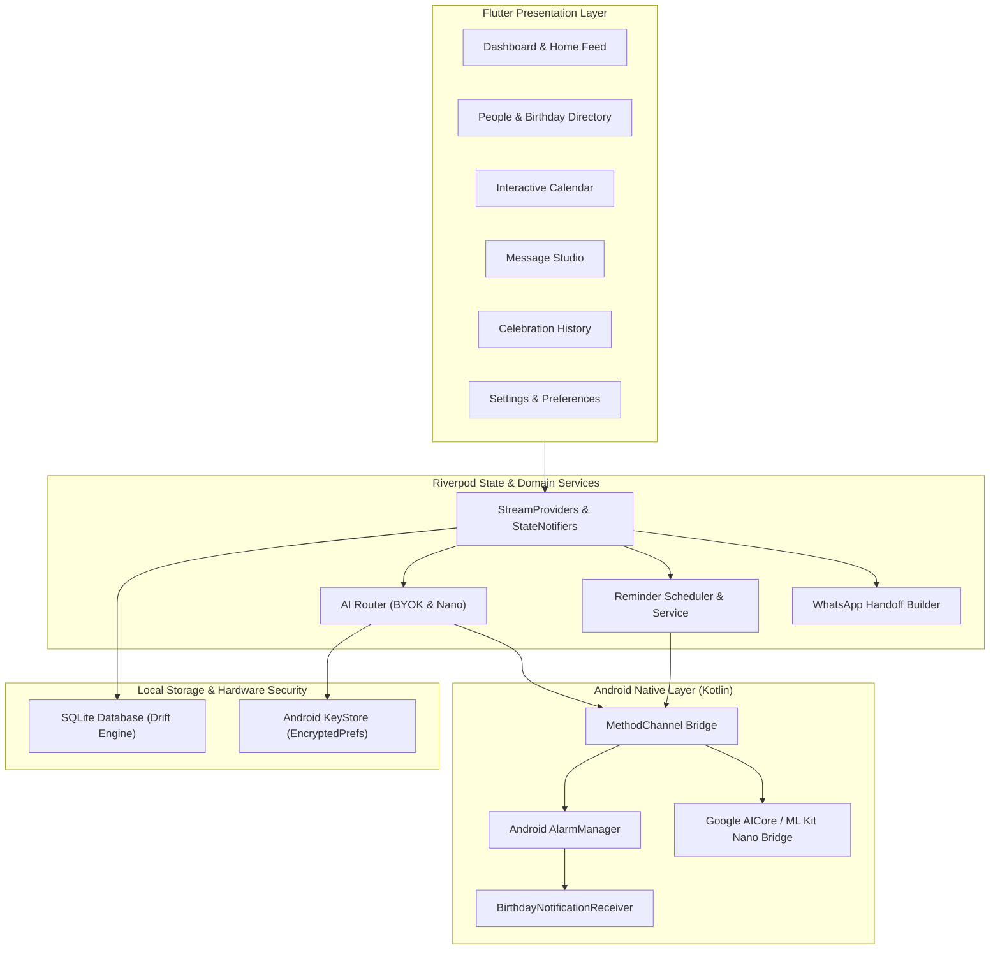

# AI-Birthday 🎂

> **A local-first personal birthday assistant with AI-assisted, user-controlled messaging.**

AI-Birthday is a Flutter & Android application engineered to help you remember important birthdays and compose personalized wishes tailored to each relationship. Birthday and contact data is stored locally by default. Cloud backup is optional and, when enabled, stores the app's saved people, birthday cycles, message drafts, and reminder settings in the app's Firestore project under the signed-in user's account.

---

## 🌟 Key Highlights & Architecture Principles

- **Local-First SQLite Persistence**: Powered by [Drift](https://drift.simonbinder.eu/) SQLite on-device storage. Fast queries, offline-first reliability, and reactive UI streams.
- **Privacy & Transparent Data Architecture**: Contact names, phone numbers, birthdates, notes, drafts, and reminder settings remain local by default. Cloud Backup is opt-in and account-scoped to the authenticated Firebase UID.
- **Credential Security**: User Gemini API keys are stored through `flutter_secure_storage` and are not written to the SQLite database or cloud backup.
- **Bring-Your-Own-Key (BYOK) & On-Device AI Routing**:
  - Direct client-to-API inference via a current stable Google Gemini Flash-Lite model.
  - Native Android platform channel bridge for Gemini Nano (Google AICore / ML Kit GenAI), truthfully reported as unavailable until on-device model weights are loaded and verified.
  - Strict Prompt Boundary: recipient facts, drafts, and custom rewrite requests are passed as user data, not executable instructions; the prompt explicitly forbids invented personal details.
- **Native Android Notification Delivery**: Real exact alarms scheduled via `AlarmManager` with high-priority notification channels and customizable Quiet Hours (e.g., 22:00–08:00) that respect sleep schedules. Clean cancellation of scheduled `PendingIntent`s upon disabling.
- **Human-in-the-Loop WhatsApp Handoff**: The application never sends messages autonomously. It constructs pre-filled WhatsApp deep links, opens native WhatsApp for user inspection, and transitions to completed only after explicit user confirmation.

---

## 🏗️ System Architecture



---

## 📱 Feature Overview

### 1. Unified Dashboard
- **Today's Celebrations**: Instant hero banners for birthdays happening today with quick action to open Message Studio.
- **Upcoming Feed**: Chronologically sorted birthdays within a 30-day window with real-time countdown chips (`in X days`).
- **Action Needed**: Visual indicators for upcoming birthdays requiring attention.
- **Quick Actions**: One-tap shortcuts to Add Person or Browse Calendar.

### 2. Recipient Management
- Full CRUD operations with soft-delete and instant **Undo** snackbar.
- Supports comprehensive metadata: Full Name, Month/Day, optional Birth Year (calculates milestone ages), Phone Number (E.164 normalized), Relationship Category (Family, Friend, Colleague, Partner, Other), Relationship Closeness, Preferred Tone, Preferred Language, and Important Facts.
- Full Gregorian leap-year handling (Feb 29 birthdays correctly resolve in leap and non-leap years).

### 3. Interactive Birthday Calendar
- Visual month grid view with responsive day cells.
- Colored event dot indicators for birthdays.
- Multi-month navigation with automatic today highlight.
- Bottom sheet breakdown of all celebrations occurring in the selected month.

### 4. Message Studio
- **Personalized AI Generation**: Uses the configured AI route, subject to the app's subscription entitlement. When a user Gemini API key is configured, requests go directly to Google's Gemini API; Gemini Nano is used when the supported on-device route is available.
- **Tone Selector**: Warm, Playful, Formal, Short, or Heartfelt.
- **Relationship Context**: Incorporates relationship closeness and verified user facts.
- **Editing & Polishing**: Full draft editing, copy-to-clipboard, and regenerate controls.

### 5. Native WhatsApp Delivery Flow
- Formats E.164 phone numbers and encodes custom greeting messages into official WhatsApp URL schemes.
- Launches native WhatsApp app or WhatsApp Business (`com.whatsapp`, `com.whatsapp.w4b`).
- Post-send confirmation dialog updates database draft status to `confirmedSent` and birthday status to `completed`.

### 6. Local Notifications & Exact Alarms
- Configurable reminder milestones: 7 days before, 2 days before, 1 day before, and Birthday Day.
- Night Quiet Hours window (defaults to 22:00 – 08:00) prevents notifications from disturbing sleep.
- Android 13+ runtime notification permissions (`POST_NOTIFICATIONS`) and Android 12+ exact alarm scheduling (`SCHEDULE_EXACT_ALARM`).

---

## 🛠️ Development Setup

### Prerequisites
- [Flutter SDK](https://flutter.dev/docs/get-started/install) (3.11.0+)
- [Android SDK](https://developer.android.com/studio) with API 35 (Android 15) and build-tools
- Java 17 (Zulu or OpenJDK)
- Physical Android device or Emulator

### Installation & Run

1. **Clone the repository:**
   ```bash
   git clone https://github.com/yhsomani/AI-Birthday.git
   cd AI-Birthday
   ```

2. **Install Flutter dependencies:**
   ```bash
   flutter pub get
   ```

3. **Generate Drift SQLite code (if modifying schema):**
   ```bash
   dart run build_runner build --delete-conflicting-outputs
   ```

4. **Run static analysis and tests:**
   ```bash
   dart analyze
   flutter test
   ```

5. **Deploy to connected Android device:**
   ```bash
   flutter run -d <device_id>
   ```

---

## 🧪 Quality Assurance & Test Suite

The repository contains unit, domain, repository, widget, integration, E2E, and backend tests covering:
  - Guided 3-step onboarding flow and state persistence
  - Calendar math and leap year resolution (`BirthdayEngine`)
  - Drift SQLite persistence & sync envelope with version increments and field preservation
  - Redaction of sensitive credentials (`AppLogger`, `SecureCredentialStorage`)
  - Subscription verification truthfulness (no local Pro fallback grants)
  - Cloud Backup verified write success checks and auth headers
  - Delivery status truthfulness (`handedOff` vs `confirmedSent`)
  - AI prompt construction and model fallback routing
  - WhatsApp deep-link generation and validation
  - Reminder scheduler, exact alarm pending intent cancellation, and quiet-hours windowing
  - Full UI flows and widget navigation
- **Backend Verification**: Vitest coverage includes Firestore authorization rules, deletion workflows, privacy policies, transport validation, and subscription verification. CI must be used as the execution evidence for current pass/fail status.

---

## 🔒 Security & Privacy Practices

1. **Default Local Storage**: Contact names, relationships, phone numbers, and birth dates remain local unless the user explicitly uses cloud backup or an external delivery/AI feature that requires the data.
2. **Secure API Key Storage**: Gemini API keys are stored through `flutter_secure_storage`; the key is not included in normal database or cloud-backup records.
3. **Structured Log Redaction**: Internal logger (`ConsoleAppLogger`) automatically redacts API keys, phone numbers, and authentication tokens before printing.
4. **Release Signing**: Release builds do not fall back to the debug signing key. A Play-ready signed artifact requires release keystore configuration in the build environment.

---

## 📄 License

This project is licensed under the MIT License - see the LICENSE file for details.
