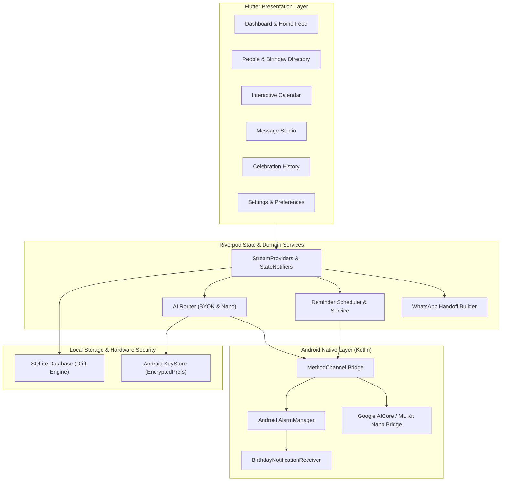

# AI-Birthday 🎂

> **A Privacy-First, Local-First Personal Birthday Assistant with AI-Assisted, User-Controlled Messaging.**

AI-Birthday is a Flutter & Android application engineered to help you remember important birthdays and compose heartfelt, personalized wishes tailored to each relationship. Built with a strict **Local-First, Zero-Cloud PII** philosophy, all recipient details and birthday dates reside exclusively on your physical device.

---

## 🌟 Key Highlights & Architecture Principles

- **Local-First SQLite Persistence**: Powered by [Drift](https://drift.simonbinder.eu/) SQLite on-device storage. Fast queries, offline-first reliability, and reactive UI streams.
- **Privacy & Zero-Cloud PII**: Contact names, phone numbers, birthdates, and private notes are **never** synced to third-party tracking servers or cloud analytics.
- **Hardware-Backed Credential Security**: User API keys (Gemini BYOK) are stored in Android's hardware-backed KeyStore via `EncryptedSharedPreferences` (`FlutterSecureStorage`).
- **Bring-Your-Own-Key (BYOK) & On-Device AI Routing**:
  - Direct client-to-API inference via Google Gemini Flash Lite.
  - Native Android platform channel bridge for Gemini Nano (Google AICore / ML Kit GenAI).
  - Strict Prompt Boundary: The AI prompt contains *only* verified facts provided by the user; private notes and untrusted inputs are never injected as instructions.
- **Native Android Notification Delivery**: Real exact alarms scheduled via `AlarmManager` with high-priority notification channels and customizable Quiet Hours (e.g., 22:00–08:00) that respect sleep schedules.
- **Human-in-the-Loop WhatsApp Handoff**: The application never sends messages autonomously. It constructs pre-filled WhatsApp deep links (`https://wa.me/`), opens native WhatsApp for user inspection, and marks birthdays as completed only upon explicit user confirmation.

---

## 🏗️ System Architecture



---

## 📱 Feature Overview

### 1. Unified Dashboard
- **Today's Celebrations**: Instant hero banners for birthdays happening today with quick action to open Message Studio.
- **Upcoming Feed**: Chronologically sorted birthdays within a 30-day window with real-time countdown chips (`in X days`).
- **Action Needed**: Visual indicators for upcoming birthdays requiring attention.
- **Quick Actions**: One-tap shortcuts to Add Person or Browse Calendar.

### 2. Recipient Management
- Full CRUD operations with soft-delete and instant **Undo** snackbar.
- Supports comprehensive metadata: Full Name, Month/Day, optional Birth Year (calculates milestone ages), Phone Number (E.164 normalized), Relationship Category (Family, Friend, Colleague, Partner, Other), Relationship Closeness, Preferred Tone, Preferred Language, and Important Facts.
- Full Gregorian leap-year handling (Feb 29 birthdays correctly resolve in leap and non-leap years).

### 3. Interactive Birthday Calendar
- Visual month grid view with responsive day cells.
- Colored event dot indicators for birthdays.
- Multi-month navigation with automatic today highlight.
- Bottom sheet breakdown of all celebrations occurring in the selected month.

### 4. Message Studio
- **Personalized AI Generation**: Leverages Google Gemini (`gemini-2.5-flash-lite`) using your personal Gemini API key.
- **Tone Selector**: Warm, Playful, Formal, Short, or Heartfelt.
- **Relationship Context**: Incorporates relationship closeness and verified user facts.
- **Editing & Polishing**: Full draft editing, copy-to-clipboard, and regenerate controls.

### 5. Native WhatsApp Delivery Flow
- Formats E.164 phone numbers and encodes custom greeting messages into official WhatsApp URL schemes.
- Launches native WhatsApp app or WhatsApp Business (`com.whatsapp`, `com.whatsapp.w4b`).
- Post-send confirmation dialog updates database draft status to `confirmedSent` and birthday status to `completed`.

### 6. Local Notifications & Exact Alarms
- Configurable reminder milestones: 7 days before, 2 days before, 1 day before, and Birthday Day.
- Night Quiet Hours window (defaults to 22:00 – 08:00) prevents notifications from disturbing sleep.
- Android 13+ runtime notification permissions (`POST_NOTIFICATIONS`) and Android 12+ exact alarm scheduling (`SCHEDULE_EXACT_ALARM`).

---

## 🛠️ Development Setup

### Prerequisites
- [Flutter SDK](https://flutter.dev/docs/get-started/install) (3.11.0+)
- [Android SDK](https://developer.android.com/studio) with API 35 (Android 15) and build-tools
- Java 17 (Zulu or OpenJDK)
- Physical Android device or Emulator

### Installation & Run

1. **Clone the repository:**
   ```bash
   git clone https://github.com/yhsomani/AI-Birthday.git
   cd AI-Birthday
   ```

2. **Install Flutter dependencies:**
   ```bash
   flutter pub get
   ```

3. **Generate Drift SQLite code (if modifying schema):**
   ```bash
   dart run build_runner build --delete-conflicting-outputs
   ```

4. **Run static analysis and tests:**
   ```bash
   dart analyze
   flutter test
   ```

5. **Deploy to connected Android device:**
   ```bash
   flutter run -d <device_id>
   ```

---

## 🧪 Quality Assurance & Test Suite

The repository maintains strict quality gates:

- **100% Static Analysis Compliance**: 0 errors, warnings, or lints (`dart analyze`).
- **119 Automated Flutter Tests**: Unit, domain, repository, widget, and integration tests covering:
  - Calendar math and leap year resolution (`BirthdayEngine`)
  - Drift SQLite persistence & sync envelope
  - Redaction of sensitive credentials (`AppLogger`, `SecureCredentialStorage`)
  - AI prompt construction and model fallback routing
  - WhatsApp deep-link generation and validation
  - Reminder scheduler and quiet-hours windowing
  - Full UI flows and widget navigation
- **Backend Verification**: 68 Vitest tests validating Firebase Firestore security rules, deletion orchestrators, and privacy policies.

---

## 🔒 Security & Privacy Practices

1. **Zero Contact Telemetry**: Contact names, relationships, phone numbers, and birth dates never leave the local SQLite database.
2. **Encrypted API Keys**: Gemini API keys are encrypted at rest using AES-256 via Android KeyStore / Keystore-backed shared preferences.
3. **Structured Log Redaction**: Internal logger (`ConsoleAppLogger`) automatically redacts API keys, phone numbers, and authentication tokens before printing.
4. **Release Signing**: Production builds utilize standard release signing configs and R8/ProGuard obfuscation rules (`android/app/build.gradle.kts`).

---

## 📄 License

This project is licensed under the MIT License - see the LICENSE file for details.
