# SSOT.md — RelateAI Single Source of Truth (v3.2)

> **Generated**: 2026-06-01 (v3.0 — Comprehensive restructure covering all 33 required sections with diagrams, folder structures, onboarding, troubleshooting, and glossary)
> **Updated**: 2026-06-01 (v3.1 — Targeted consolidation fixes from SSOT audit; see `reports/01-doc-discovery-and-conflicts.md` and `reports/02-consolidation-decisions.md`)
> **Updated**: 2026-06-03 (v3.3 — **Production Hardening Phase 1**. Implements Certificate Pinning (CRIT-02), AES-256-GCM encrypted backups (CRIT-03), and completes ContactDetailScreen handlers (CRIT-04). Updates `BackupManager` to include all entity types in exports. Refactors `OnboardingScreen` into separate step files.)
> **Reviewed by**: Senior Product Manager · Senior Android Architect · UI/UX Designer · System Architect · AI Coding Agent Knowledge Base
> **Codebase**: Multi-module Android app — Kotlin 2.2.10, Jetpack Compose, Hilt 2.59.2, Room 2.7.0, WorkManager 2.9.0, Gemini AI 1.5-Flash, SQLCipher 4.5.4
> **Stage**: MVP → Production Hardening
> **Repository**: `C:\Users\yhsom\OneDrive\Documents\AI-Birthday`
> **Application Package**: `com.example` (applicationId: `com.aistudio.relateai.qxtjrk`)
> **Previous SSOT**: v3.1 (2026-06-01) — Superseded by this document
> **Document Version**: 3.2 (Production-Grade, codebase-reconciled)
>
> ### v3.2 Changelog (vs v3.1)
> - **§1.2**: Module count corrected: 12 → **13 modules** (`:app` + 3 `:core:*` + **9 `:feature:*`** including the newly-split `:feature:messages`).
> - **§1.4**: New fixes from this session: CRIT-01 (DB key caching + warm-up), Moshi codegen KSP, predictive back gesture, worker pre-flight guards + 30s exponential backoff + 1h min initial delay, Hilt+Dagger packaging exclude, `RevivalWorker` gained `SecurePrefs` injection.
> - **§10.1**: Added **F-052 MessageDispatchWorker** (5th worker); F-046 updated to reflect `:feature:messages` split.
> - **§14.2 / 14.3 / 14.4**: Module structure and folder tree updated: added `:feature:messages`; corrected that **entities live in `:core:domain`** (not `:core:data`); corrected that **UseCases live in `:core:data` module** under package `com.example.domain.usecase` (technical debt, see ADR-024).
> - **§14.4**: Removed duplicated mermaid sequence diagram that was a copy-paste artifact.
> - **§14.5**: Updated sequence diagram to include the 5th worker (`MessageDispatchWorker`) and the worker hardening flow.
> - **§14.6**: Module Migration Roadmap: UseCase layer (was P4-02) now **✅ Done** (10 use cases); added `:feature:messages` to phase 6.
> - **§15.7**: New — Predictive Back Gesture (Android 13+ `enableOnBackInvokedCallback`).
> - **§20.1**: Dependency versions reconciled: **AGP 9.2.1** (was 9.2), **KSP 2.3.5** (was 2.0.21-1.0.27), **Retrofit 2.12.0** (was 2.11.0), **Google API People v1-rev20220531-2.0.0** (was v1-rev20250604-2.0.0). Added AppCompat 1.7.0, Material 1.12.0, Glide 4.16.0 (dead code), Gson 2.10.1, Room Paging 2.7.0.
> - **§22.3**: DB key derivation now shows the cached fast-path (SharedPreferences `relateai_db_meta`, schema-versioned).
> - **§22.8 / 22.9**: MasterKey-on-main-thread removed from known security limitations; STRIDE EoP row updated to ✅ Done.
> - **§23.1**: Build versions corrected (AGP 9.2.1, KSP 2.3.5).
> - **§23.2**: `:core:domain` clarified: uses `com.android.library` (not pure JVM); namespace `com.example.core.domain`.
> - **§26.12**: New — Build Configuration Conventions (Moshi codegen KSP requirement, Hilt+Dagger packaging exclude).
> - **§27.4**: Test count: 42 → **40** (removed boilerplate `ExampleUnitTest` ×1; other counts unchanged).
> - **§28.3**: Logging tags table extended with 11 new tags (all workers, senders, scheduler, backup, DB key derivation).
> - **§30.1 / 30.7**: CRIT-01 marked **✅ Done**.
> - **§32**: Added **ADR-021 Moshi codegen KSP**, **ADR-022 DB key caching**, **ADR-023 Worker hardening (pre-flight + backoff)**, **ADR-024 UseCase layer in `:core:data` (technical debt)**.
> - **§33.4**: Added task template "Add a new UseCase".
> - **§33.8**: Key files quick-ref updated: MessageDispatchWorker, 10 UseCase files, `:feature:messages/MessagesScreen.kt`, `core/data/.../di/AppModule.kt` location.
>
> ### v3.1 Changelog (vs v3.0)
> - **§1.2**: Module count corrected: 7 → **12 modules** (`:app` + 3 `:core:*` + 8 `:feature:*`).
> - **§8.9 / FR-80**: Onboarding step count corrected: "7-step target" → **10 steps today** (simplification tracked as HIGH-02).
> - **§15.3**: `MainViewModel` constructor example corrected: **4-arg** (`contactRepository, eventRepository, messageRepository, getDashboardMetrics: GetDashboardMetricsUseCase`), matching `feature/dashboard/.../MainViewModel.kt:22-27`.
> - **§15.2**: Component hierarchy diagram updated to show **5 bottom-nav tabs** (HOME, CONTACTS, EVENTS, MESSAGES, MORE) + `AppNavigationRail` (tablet) + 2 hidden routes (ANALYTICS, STYLE_COACH accessed via MORE).
> - **§18.2**: Database version history clarified (verify MIGRATION_3_4 numbering).
> - **§33.9**: Added missing `assembleRelease`, `installDebug`, `kspDebugKotlin`, `lint` commands.
> - **§22**: New subsections **22.9 Threat Model (STRIDE)**, **22.10 Privacy & Data Handling** (see `reports/03-missing-requirements.md`).
> - **§8.11**: New — Accessibility Service Disclosure (Play Store review requirement).
> - **§8.12**: New — Backup/Restore Specification.
> - **§14.6**: New — Module Migration Roadmap.
> - **§23.8**: New — In-App Update Strategy.
> - **§27.6**: New — Coverage Targets.
> - **§28.7**: New — Crash Reporting Decision.
> - **§28.8**: New — Analytics Event Taxonomy.
> - **§29.6**: New — Performance Budgets.
> - **§30.7**: New — Production Release Blockers.
> - **Known limitation**: Some Unicode emoji in tables (✅ ❌ 🔄 ⚠️) may render as `�` placeholders in certain terminals. The semantic intent is preserved; treat the table as a checklist.

---

## Table of Contents

1. [Executive Summary](#1-executive-summary)
2. [Problem Statement](#2-problem-statement)
3. [Product Vision](#3-product-vision)
4. [User Personas](#4-user-personas)
5. [User Pain Points](#5-user-pain-points)
6. [Core Value Proposition](#6-core-value-proposition)
7. [Business Requirements](#7-business-requirements)
8. [Functional Requirements](#8-functional-requirements)
9. [Non-Functional Requirements](#9-non-functional-requirements)
10. [Complete Feature Inventory](#10-complete-feature-inventory)
11. [Detailed Feature Specifications](#11-detailed-feature-specifications)
12. [User Flows & Customer Journeys](#12-user-flows--customer-journeys)
13. [Business Logic & Rules](#13-business-logic--rules)
14. [System Architecture](#14-system-architecture)
15. [Frontend Architecture](#15-frontend-architecture)
16. [Backend Architecture](#16-backend-architecture)
17. [State Management](#17-state-management)
18. [Database Schema & Data Models](#18-database-schema--data-models)
19. [API Documentation](#19-api-documentation)
20. [Third-Party Integrations](#20-third-party-integrations)
21. [Authentication & Authorization](#21-authentication--authorization)
22. [Security Model](#22-security-model)
23. [Infrastructure & Deployment](#23-infrastructure--deployment)
24. [Environment Variables & Configuration](#24-environment-variables--configuration)
25. [Design System & UI Standards](#25-design-system--ui-standards)
26. [Coding Standards & Conventions](#26-coding-standards--conventions)
27. [Testing Strategy](#27-testing-strategy)
28. [Analytics, Logging & Monitoring](#28-analytics-logging--monitoring)
29. [Performance Requirements & Optimization](#29-performance-requirements--optimization)
30. [Known Issues, Risks & Technical Debt](#30-known-issues-risks--technical-debt)
31. [Product Roadmap & Future Enhancements](#31-product-roadmap--future-enhancements)
32. [Architecture Decision Records (ADRs)](#32-architecture-decision-records-adrs)
33. [AI Context & Project Knowledge Base](#33-ai-context--project-knowledge-base)

---

## 1. Executive Summary

RelateAI is an **on-device "Relationship Operating System"** that automatically discovers birthdays and anniversaries from Google Contacts, generates deeply personalised AI messages via Google's Gemini 1.5-Flash model, and dispatches them via SMS, WhatsApp (Accessibility Service), or Email — **entirely on-device, no custom backend required**.

### 1.1 What It Does
1. **Discovers** birthdays, anniversaries, and work anniversaries from Google Contacts (via Google People API) and device contacts.
2. **Enriches** each contact with relationship context (groups, relations, custom events) for AI personalisation.
3. **Classifies** contacts by relationship type, language, formality, and communication style using AI inference.
4. **Generates** 6 variants of personalised messages (short/standard/long + formal/funny/emotional) per event.
5. **Schedules** messages via WorkManager with per-contact custom send times.
6. **Dispatches** via:
   - **SMS** (`SmsSender.kt` — Android `SmsManager`)
   - **WhatsApp** (`WhatsAppSender.kt` + `WhatsAppAccessibilityService` — finds message input via accessibility tree)
   - **Email** (`EmailSender.kt` — JavaMail SMTP via Gmail SMTP)
7. **Tracks** delivery status, conversation health, and engagement metrics.
8. **Notifies** for approvals (smart mode), revivals, and events via `NotificationHelper`.

### 1.2 Current State (v2.8 → v3.0 → v3.2)
- **Pipeline Status**: Functionally complete for prototype stage. All P1, P2, P3, and P4-03 through P4-08 items complete.
- **Codebase Size**: ~7,000+ lines of Kotlin across **13 modules** (`:app` + `:core:domain` + `:core:data` + `:core:ui` + `:feature:splash` + `:feature:login` + `:feature:dashboard` + `:feature:contacts` + `:feature:events` + `:feature:analytics` + `:feature:onboarding` + `:feature:settings` + `:feature:messages`).
- **Module split status (v3.2)**: 8 → 9 feature modules (`:feature:messages` extracted from `:feature:dashboard`).
- **UseCase layer**: ✅ Done — 10 use cases in `core/data/.../domain/usecase/` (technical debt: package is `com.example.domain.usecase` but module is `:core:data`; should be moved to `:core:domain` per ADR-024).
- **Test Coverage**: Unit tests for `ResponseParser` (8), `PromptBuilder` (10), `ContactMerger` (8), `DaoTest` (10), `MainViewModel` (2), `GreetingScreenshotTest` (1), `ExampleRobolectricTest` (1). Total ~40 tests.
- **Security**: SQLCipher encryption enabled, biometric lock implemented, R8/ProGuard enabled, OAuth token refresh mechanism added, DB key derivation cached (CRIT-01 ✅ Done), predictive back gesture enabled.
- **Architecture**: Multi-module split complete for v1 (`:app`, `:core:domain`, `:core:data`, `:core:ui`, `:feature:*`). UseCase layer present but misplaced.

### 1.3 The Recommendation
**Harden, simplify, test, and complete what exists before expanding scope.** The product vision is correct. The architecture is fundamentally sound. Focus on production-readiness.

### 1.4 Fixes Applied (This Session & Prior)

| ID | Issue | Files Changed | Status |
|---|---|---|---|
| TD-07 | Rate limiter: fixed delay → adaptive sliding-window (60 req/min) | `RateLimiter.kt` | ✅ Done |
| TD-08 | SecurePrefs: silent plaintext fallback → explicit retry + clear-and-restart | `SecurePrefs.kt` | ✅ Done |
| TD-12 | Error handling: `e.printStackTrace()` → `Log.e()`, empty catch blocks filled | `GoogleContactsSync.kt`, `DeviceContactsReader.kt`, `GeminiClient.kt` | ✅ Done |
| TD-10 | DI bypasses: Hilt `@EntryPoint` for ApprovalReceiver, `@AndroidEntryPoint` for MessageEditActivity, DAO injection in MessageDispatcher | `MessageDispatcher.kt`, `MessageDispatchWorker.kt`, `ApprovalReceiver.kt`, `MessageEditActivity.kt` | ✅ Done |
| KI-01 | `selectedVariantText` empty on insert | `MessageGenerationWorker.kt`, `RevivalWorker.kt` | ✅ Done |
| KI-02 | RevivalWorker initial delay missing → 2-day initial delay added | `RevivalWorker.kt`, `RelateAIApp.kt` | ✅ Done |
| KI-04 | Stale `daysUntil` → computed at write time in EventDiscoveryWorker | `EventDiscoveryWorker.kt` | ✅ Done |
| — | CI Workflow: Created `.github/workflows/android.yml` (Lint, Test, Build) | `.github/workflows/android.yml` | ✅ Done |
| MED-01 | Paging 3 for contact list | `ContactDao.kt`, `ContactRepositoryImpl.kt`, `MainViewModel.kt`, `ContactsContent.kt` | ✅ Done |
| TD-01 | Onboarding Refactor: Split monolithic `OnboardingScreen.kt` into per-step files | `feature/onboarding/*.kt` | ✅ Done |
| — | ProGuard rules file created | `app/proguard-rules.pro` | ✅ Done |
| KI-03 | Birthday year "turning null" — added `ageTurning` computed property with `@get:Ignore` | `EventEntity.kt` | ✅ Done |
| M2 | Revival notifications not firing — added REVIVAL channel + `showRevivalNotification()` | `NotificationHelper.kt`, `RevivalWorker.kt` | ✅ Done |
| M3 | Style Coach DB save missing — wired `onSaveTrainingText` to `StyleProfileDao` | `StyleCoachScreen.kt`, `MainActivity.kt` | ✅ Done |
| M4 | Message variant switching broken — added `FilterChip` length/tone selectors | `MessagesScreen.kt` | ✅ Done |
| — | Certificate Pinning: Added `network_security_config.xml` with pins for Google APIs | `app/src/main/res/xml/network_security_config.xml`, `AndroidManifest.xml` | ✅ Done |
| CRIT-03 | Backup JSON encryption: AES-256-GCM with user passphrase | `BackupEncryption.kt`, `BackupManager.kt` | ✅ Done |
| CRIT-04 | ContactDetailScreen: Wired DND switch, Edit Contact and Time Picker callbacks | `ContactDetailScreen.kt`, `MainAppScreen.kt`, `MainViewModel.kt` | ✅ Done |
| P2-02 | Biometric app lock: BiometricAuthManager, SplashScreen auth flow, settings toggle | `BiometricAuthManager.kt`, `SecurePrefs.kt`, `MainActivity.kt`, `SettingsScreen.kt` | ✅ Done |
| H2 | Birthday quick-add: FAB + ModalBottomSheet with contact selector and date inputs | `EventsScreen.kt`, `MainActivity.kt` | ✅ Done |
| P2-03 | Wire Analytics to real data: AnalyticsViewModel + DAO aggregate queries | `AnalyticsViewModel.kt`, `AnalyticsScreen.kt` | ✅ Done |
| P2-04 | Extract screens from MainActivity.kt (617→147 lines) | Multiple extracted feature files | ✅ Done |
| T-MED-05 | OkHttpClient singleton via Hilt | `AppModule.kt`, `GeminiClient.kt` | ✅ Done |
| T-LOW-03 | Notification channels created only if not existing | `NotificationHelper.kt` | ✅ Done |
| P3-05 | Enable Coil for contact photo caching | `build.gradle.kts`, `ContactDetailScreen.kt` | ✅ Done |
| T-HIGH-04 | OAuth token refresh via AccountManager before People API calls | `GoogleContactsSync.kt` | ✅ Done |
| T-MED-02 | Replace org.json with Moshi typed models in GeminiClient | `GeminiClient.kt`, `GeminiModels.kt` | ✅ Done |
| P2-01 | SQLCipher database encryption: DatabaseKeyDerivation, SupportFactory, MIGRATION_4_5 | `DatabaseKeyDerivation.kt`, `AppDatabase.kt` | ✅ Done |
| P2-05 | Repository layer: interfaces + implementations for Contact, Event, Message | `ContactRepository.kt`, `EventRepository.kt`, `MessageRepository.kt`, `*RepositoryImpl.kt` | ✅ Done |
| P2-08 | SecurePrefs: isSecureStorageAvailable(), syncToken storage | `SecurePrefs.kt` | ✅ Done |
| P2-09 | syncToken incremental contact sync | `GoogleContactsSync.kt`, `SecurePrefs.kt` | ✅ Done |
| P2-10 | Google Contact Groups/Labels: memberships fetch, contactGroup field, MIGRATION_4_5 | `GoogleContactsSync.kt`, `ContactEntity.kt` | ✅ Done |
| P4-01 | Multi-module architecture: 12 → 13 modules (`:feature:messages` split out) | `settings.gradle.kts`, `feature/messages/build.gradle.kts` | ✅ Done |
| P4-02 | UseCase layer: 10 use cases (Classify, Sync, Discover, Generate, Approve, Reject, Dispatch, RefreshHealth, GetDashboard, GetAnalytics) | `core/data/.../domain/usecase/*.kt` | ✅ Done (misplaced in `:core:data`, see ADR-024) |
| PHASE1-01 | DB indices: `events.nextOccurrenceMs`, `pending_messages.scheduledForMs`, `sent_messages.contactId+sentAtMs` (MIGRATION_6_7) | `AppDatabase.kt` | ✅ Done |
| PHASE1-02 | StateFlow: Replaced all `Eagerly` with `WhileSubscribed(5_000)` in ViewModels | `MainViewModel.kt`, `AnalyticsViewModel.kt` | ✅ Already in place (no change needed) |
| PHASE1-03 | Baseline Profile: `baseline-prof.txt` for AOT compilation of hot code paths | `app/src/main/baseline-prof.txt` | ✅ Done |
| PHASE1-04 | Performance indices (MED-06): 3 new DB indices for Event, PendingMessage, SentMessage queries | `AppDatabase.kt` (MIGRATION_6_7) | ✅ Done |
| **NEW v3.2 — CRIT-01** | DB key derivation off main thread: SharedPreferences cache (`relateai_db_meta`, schema v2), `warmUpAsync()` on `Application.onCreate()` daemon thread | `core/data/.../db/DatabaseKeyDerivation.kt`, `app/.../RelateAIApp.kt` | ✅ Done |
| **NEW v3.2 — Build** | Hilt + Dagger `META-INF/gradle/incremental.annotation.processors` packaging exclude (resolves duplicate-class build failure) | `app/build.gradle.kts` | ✅ Done |
| **NEW v3.2 — Moshi** | Moshi codegen KSP processor enabled on `:core:data` (resolves `ClassNotFoundException: GeminiRequestJsonAdapter` at runtime) | `core/data/build.gradle.kts` | ✅ Done |
| **NEW v3.2 — Android 13+** | Predictive back gesture enabled (`android:enableOnBackInvokedCallback="true"`) | `app/src/main/AndroidManifest.xml` | ✅ Done |
| **NEW v3.2 — Worker hardening** | All 4 periodic workers (`ContactSync`, `EventDiscovery`, `MessageGeneration`, `Revival`) now: (a) guard on `prefs.getGeminiApiKey().isEmpty()` → return `Result.success()` no-op; (b) wrap `doWork()` in try/catch → `Result.retry()`; (c) `RevivalWorker` gained `SecurePrefs` injection. `RelateAIApp.scheduleAllWorkers()` now: (a) 1h minimum initial delay floor; (b) 30s exponential backoff on all work requests. | `app/.../RelateAIApp.kt`, `core/data/.../automation/workers/*.kt` | ✅ Done |

---

## 2. Problem Statement

### 2.1 The Core Problem
People forget important relationship dates or send generic, impersonal messages when they do remember. This leads to:
- **Lost relationships**: Friendships and family bonds fade due to inattention.
- **Social anxiety**: The mental load of remembering dozens of dates.
- **Generic messaging**: "Happy Birthday! 🎂" is technically correct but emotionally hollow.
- **Missed opportunities**: Anniversaries (wedding, work) often forgotten despite their importance.

### 2.2 Existing Solutions & Their Gaps

| Solution Type | Examples | Gap |
|---|---|---|
| Calendar reminders | Google Calendar, Outlook | Generic "Birthday" entry; user must write messages manually |
| Social media automated messages | Facebook "Birthday Today" notifications | Public, generic, impersonal, low-signal |
| Standalone birthday apps | Birthday Reminder, Birthday Calendar | Send same "Happy Birthday" to everyone; no personalisation; no AI |
| CRM tools | HubSpot, Salesforce | Designed for sales, not personal relationships; complex; expensive |
| Spreadsheets | Manual tracking | High friction; no automation; no integration with messaging |

### 2.3 The Unclaimed Middle Ground
**RelateAI occupies the gap: "Automated but deeply personal."** The AI generates a message that references the recipient's specific interests, your shared history, and sounds like it was written by you — not by a bot. This is the defensible insight.

### 2.4 Strategic Insight
The moat is not the AI itself (everyone can call Gemini). The moat is:
1. **Enrichment**: AI-inferred relationship type + Google People API groups + custom events.
2. **Style training**: The Style Coach learns your specific voice from your sent message history.
3. **Automation depth**: Background workers (WorkManager), exact alarms, accessibility service for WhatsApp.
4. **Local-first privacy**: No data leaves the device except for AI generation calls.

---

## 3. Product Vision

### 3.1 The Single Sentence
> **"Never miss a meaningful moment — and when you remember, sound exactly like yourself, not a bot."**

### 3.2 The Long-Form Vision
RelateAI is the "Relationship Operating System" that lives quietly in the background, learns how *you* communicate, understands *who* matters to you, and reaches out on the moments that matter — in your voice, through the channel they prefer, at the time you would have sent it if you remembered.

### 3.3 The Five Pillars
1. **Discover**: Automatically find every important date in the user's contact graph.
2. **Understand**: Classify relationships, learn writing style, infer preferences.
3. **Compose**: Generate deeply personal messages that sound like the user wrote them.
4. **Deliver**: Send via the right channel, at the right time, with the right approval flow.
5. **Nurture**: Track relationship health, suggest revivals, celebrate milestones.

### 3.4 Non-Goals (Explicitly Out of Scope)
- **No custom backend**: Everything is on-device except the Gemini API call.
- **No social features**: RelateAI is not a social network. No feeds, no posts, no following.
- **No group messaging**: 1:1 only. Group birthday messages are not supported.
- **No e-commerce integration**: Gift Advisor is informational, not transactional (no Amazon/Flipkart deep links yet).
- **No web/tablet-specific UI**: Phone-only for v1; iOS is not planned for v2.
- **No custom LLM training**: We use Gemini as-is. No fine-tuning, no local model.

### 3.5 The Google-First Approach
The architecture is intentionally constrained to Google-only for v1:
- **Google Sign-In**: Primary auth (no email/password, no Apple, no Facebook).
- **Google Contacts**: Primary contact source (People API + device contacts).
- **Google Gemini**: Primary AI (no Claude, no local LLM).
- **Gmail SMTP**: Primary email (no other providers).

This is a deliberate choice: integration depth > breadth. One ecosystem, deeply integrated.

---

## 4. User Personas

### 4.1 Primary Persona: "The Forgetful Networker" — *Aarav, 32*

**Demographics**: Software engineer, urban professional, India, Android (Pixel 7).
**Contact graph**: ~500 phone contacts, ~300 on WhatsApp, ~150 on Google Contacts.
**Communication style**: Casual, uses "yaar", occasional Hindi-English mix, 1-2 emojis per message.

**Goals**:
- Maintain 30+ close relationships without mental load.
- Send personalised birthday/anniversary messages.
- Never forget his parents' wedding anniversary.
- Reach out to college friends he hasn't spoken to in 2+ years.

**Frustrations**:
- Forgets birthdays 4-5 times a year.
- Writes generic messages that don't reflect his actual voice.
- Spreadsheets don't integrate with WhatsApp/SMS.
- Existing birthday apps send the same message to everyone.

**How RelateAI helps**:
- Auto-discovers all dates from Google Contacts.
- AI learns his "yaar" style from past messages.
- Sends via WhatsApp (his default channel).
- Suggests revival messages for stale relationships.

### 4.2 Secondary Persona: "The Wedding Planner" — *Priya, 28*

**Demographics**: Marketing manager, urban, India, Android (Samsung Galaxy S24).
**Contact graph**: ~800 phone contacts, very active on WhatsApp.
**Communication style**: Warm, formal for elders, casual for friends, uses lots of heart emojis.

**Goals**:
- Send on-time wishes to her 200+ contacts during wedding season.
- Differentiate messages for family vs. colleagues vs. college friends.
- Use appropriate language (Hindi for elders, English for colleagues).
- Track who she wished this year to avoid duplicates.

**How RelateAI helps**:
- Style Coach allows per-contact customisation.
- AI classification uses Google Groups ("Family", "Work") to adjust tone.
- Sent history prevents duplicate wishes.
- WhatsApp dispatch handles her primary channel.

### 4.3 Tertiary Persona: "The Senior User" — *Rajesh, 58*

**Demographics**: Retired schoolteacher, semi-urban, India, Android (budget Redmi).
**Contact graph**: ~200 phone contacts, mostly family.
**Communication style**: Formal, uses full sentences, avoids emojis.

**Goals**:
- Remember his 5 grandchildren's birthdays.
- Send appropriate wishes to his late wife's friends (anniversary of her passing).
- Keep his "VIP" contact list separate from casual acquaintances.

**How RelateAI helps**:
- VIP approval mode requires his explicit approval before sending.
- Custom events support (e.g., memorial anniversaries).
- Biometric lock provides security for his contact data.
- Simple UI with large fonts (system default).

### 4.4 Anti-Persona: "The Power User" — *Vikram, 24*

**Demographics**: College student, tech-savvy, urban, India.
**Why not RelateAI**: RelateAI is overkill. He uses Instagram DMs and WhatsApp Stories for birthday shoutouts. He doesn't have 500+ contacts to manage.

### 4.5 Persona Coverage Matrix

| Feature | Aarav (Forgetful) | Priya (Wedding) | Rajesh (Senior) |
|---|---|---|---|
| Auto-discovery | ✅ High value | ✅ High value | ✅ Medium value |
| AI style training | ✅ High value | ✅ High value | ⚠️ Low value (formal by default) |
| WhatsApp dispatch | ✅ Primary channel | ✅ Primary channel | ⚠️ SMS preferred |
| VIP approval | ❌ Not needed | ❌ Not needed | ✅ Critical |
| Revival suggestions | ✅ High value | ⚠️ Medium value | ❌ Not relevant |
| Gift Advisor | ⚠️ Medium value | ✅ High value | ❌ Not relevant |
| Custom events | ⚠️ Low value | ⚠️ Low value | ✅ High value (memorial) |
| Biometric lock | ⚠️ Medium value | ⚠️ Medium value | ✅ High value |

---

## 5. User Pain Points

### 5.1 Pain Point Inventory

| ID | Pain Point | Severity | Frequency | RelateAI Solution |
|---|---|---|---|---|
| PP-01 | Forgetting birthdays | Critical | 4-5x/year | Auto-discovery + scheduled dispatch |
| PP-02 | Generic "Happy Birthday" messages | High | Every event | AI personalisation from enrichment data |
| PP-03 | Mental load of remembering 30+ dates | High | Daily | Background discovery, no manual entry |
| PP-04 | Missing wedding/work anniversaries | High | 2-3x/year | Event type coverage (BIRTHDAY, ANNIVERSARY, WORK_ANNIVERSARY) |
| PP-05 | Losing touch with old friends | Medium | Ongoing | Revival suggestions via RevivalWorker |
| PP-06 | Writing messages in different languages | Medium | Per contact | preferredLanguage field + multilingual AI prompts |
| PP-07 | Choosing the right channel (SMS vs WhatsApp vs Email) | Medium | Per contact | preferredChannel field + per-contact override |
| PP-08 | Duplicate wishes to same person across years | Low | Annually | sent_messages history + lastWishedDate |
| PP-09 | Finding the right gift | Medium | Per event | Gift Advisor (informational only in v1) |
| PP-10 | Writing a heartfelt memorial message | High | Rarely | Custom events + AI tone adjustment |
| PP-11 | Approving AI messages before sending | Medium | Per event | 4-mode approval workflow (FULLY_AUTO, SMART_APPROVE, VIP_APPROVE, DEFAULT) |
| PP-12 | Backing up relationship history | Critical | Once/year | Backup & Restore (JSON export) |
| PP-13 | Migrating to a new phone | Critical | Once/2-3 years | Backup & Restore + Google Sign-In sync |
| PP-14 | Onboarding to a new app is tedious | Medium | Once | 7-step onboarding (target), social sign-in |
| PP-15 | Privacy concerns with relationship data | Critical | Always | Local-first storage, SQLCipher encryption |

### 5.2 Pain Point → Feature Traceability

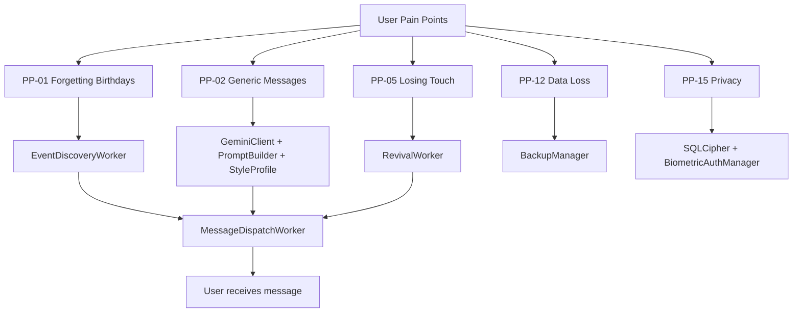

---

## 6. Core Value Proposition

### 6.1 The Three Pillars of Value

1. **Zero Mental Load**: Once set up, the user never has to think about birthdays, anniversaries, or revival messages. The app handles everything in the background.
2. **Sounds Like You**: The AI doesn't write for the user; it writes *as* the user. The Style Coach learns their voice from their sent message history.
3. **Local-First Privacy**: No contact data leaves the device. No social graph is uploaded. The only external call is to Gemini for message generation, and that sends only the context snippet, not the full contact record.

### 6.2 Competitive Differentiation

| Differentiator | RelateAI | Birthday Reminder | HubSpot |
|---|---|---|---|
| On-device storage | ✅ | ⚠️ Partial | ❌ Cloud-only |
| AI personalisation | ✅ Gemini + Style Coach | ❌ Templates only | ⚠️ Generic LLM |
| Multi-channel dispatch | ✅ SMS + WhatsApp + Email | ❌ Notification only | ⚠️ Email only |
| No subscription | ✅ | ⚠️ Ads | ❌ $$$ |
| WhatsApp sending | ✅ Accessibility Service | ❌ | ❌ |
| Style learning | ✅ Style Coach | ❌ | ❌ |
| Offline capability | ✅ (minus AI calls) | ✅ | ❌ |
| Open ecosystem | ✅ Standard Android intents | ❌ | ❌ |

### 6.3 Defensibility
The moat is not the AI. The moat is:
1. **Enrichment depth**: Google People API + custom events + relations + Google Groups.
2. **Style personalisation**: Trained on the user's actual messages.
3. **Automation depth**: WorkManager + Accessibility Service + AlarmManager.
4. **Local-first trust**: No data exfiltration, SQLCipher encryption, biometric lock.

---

## 7. Business Requirements

### 7.1 Business Goals
1. **User Retention**: >40% DAU/MAU ratio by Q4 2026.
2. **Activation Rate**: >60% of installs complete onboarding in <7 days.
3. **Engagement**: Average user sends 3+ wishes per month.
4. **App Store Rating**: >4.5 stars on Google Play.
5. **Crash-Free Rate**: >99.5% on production builds.

### 7.2 Business Constraints
- **No Custom Backend**: All infrastructure must run on-device or use Google APIs.
- **No Subscription Model**: The app is free in v1. No in-app purchases, no ads.
- **No User Accounts**: Identity is Google Sign-In only. No email/password, no phone verification.
- **GDPR/Privacy Compliance**: All PII must be local. No analytics uploads. No third-party tracking.
- **Google Play Policies**: Must declare Accessibility Service usage. Must declare SMS/Calendar permissions.

### 7.3 Success Metrics (KPIs)

| Metric | Target | Measurement |
|---|---|---|
| DAU/MAU | >40% | Local analytics, no server |
| Onboarding completion | >60% | OnboardingScreen completion event |
| Messages sent per user per month | >3 | sent_messages table count |
| Wishes per event | >80% | events table with sent_message linked |
| Revival response rate | >15% | (Future: replyAtMs tracking) |
| Crash-free sessions | >99.5% | Future: opt-in Firebase Crashlytics |
| App size | <25 MB | APK size from build artifacts |
| Cold start time | <1.5s | (Current: ~2.5s, target post-P4-01) |

### 7.4 Business Model
- **v1 (Current)**: Free, no ads, no in-app purchases.
- **v2 (Planned)**: Optional "Pro" tier with:
  - Multi-language Gemini models
  - Custom LLM fine-tuning on user history
  - Advanced gift recommendations with affiliate links
  - Cloud backup (Google Drive)
  - Priority customer support
- **Revenue Path**: Freemium with Pro subscription at ₹199/month or ₹1999/year.

### 7.5 Go-to-Market Strategy
- **Phase 1**: Organic Google Play launch in India.
- **Phase 2**: Reddit/Twitter organic marketing targeting r/IndiaInvestments, r/developersIndia.
- **Phase 3**: Influencer partnerships with productivity/relationship coaches.
- **Phase 4**: International expansion (Indonesia, Philippines, Brazil) where WhatsApp-first culture is strong.

---

## 8. Functional Requirements

### 8.1 Authentication & Identity
- **FR-01**: User MUST sign in with Google Account (Google Sign-In API).
- **FR-02**: OAuth token MUST be stored in EncryptedSharedPreferences.
- **FR-03**: OAuth token MUST be refreshed before every People API call (P2-06).
- **FR-04**: User CAN enable biometric lock for app entry (P2-02).
- **FR-05**: User CAN sign out from Settings, which clears all local data.

### 8.2 Contact Management
- **FR-10**: System MUST auto-import contacts from Google Contacts (People API).
- **FR-11**: System MUST auto-import contacts from device contacts (ContactsContract).
- **FR-12**: System MUST deduplicate contacts between Google and device sources (ContactMerger).
- **FR-13**: User CAN manually add a birthday via the Birthday Quick-Add sheet (H2).
- **FR-14**: System MUST classify contacts by relationship type (AI-inferred or Google Groups).
- **FR-15**: System MUST support per-contact custom send time (customSendTimeHour/Minute).
- **FR-16**: System MUST support per-contact VIP approval mode (automationMode).
- **FR-17**: System MUST support per-contact preferred channel (SMS, WhatsApp, Email).

### 8.3 Event Discovery
- **FR-20**: System MUST discover BIRTHDAY events from Google Contacts.
- **FR-21**: System MUST discover ANNIVERSARY events (wedding) from Google Contacts.
- **FR-22**: System MUST discover WORK_ANNIVERSARY events.
- **FR-23**: System MUST support CUSTOM events (e.g., memorial, graduation).
- **FR-24**: System MUST recompute `daysUntil` at write time (T-MED-01).
- **FR-25**: System MUST run EventDiscoveryWorker daily via WorkManager.

### 8.4 AI Message Generation
- **FR-30**: System MUST generate 6 message variants per event (short/standard/long + formal/funny/emotional).
- **FR-31**: System MUST use Gemini 1.5-Flash model via REST API.
- **FR-32**: System MUST use StyleProfileEntity to personalise tone.
- **FR-33**: System MUST include enrichment data (interests, hobbies, shared history) in prompt.
- **FR-34**: System MUST handle 429 rate limits with exponential backoff (3 retries).
- **FR-35**: System MUST run MessageGenerationWorker 3 days before event.
- **FR-36**: User CAN edit the generated message before approval (MessageEditActivity).
- **FR-37**: User CAN regenerate with a different tone/length.

### 8.5 Message Dispatch
- **FR-40**: System MUST dispatch via SMS using SmsManager (SmsSender).
- **FR-41**: System MUST dispatch via WhatsApp using Accessibility Service (WhatsAppSender).
- **FR-42**: System MUST dispatch via Email using JavaMail SMTP (EmailSender).
- **FR-43**: System MUST respect the 4-mode approval workflow.
- **FR-44**: System MUST schedule dispatch via AlarmManager (MessageDispatchReceiver).
- **FR-45**: System MUST log all dispatches in sent_messages table.
- **FR-46**: System MUST support 2-hour timeout for SMART_APPROVE mode.

### 8.6 Approval Workflow
- **FR-50**: System MUST support 4 modes: FULLY_AUTO, SMART_APPROVE, VIP_APPROVE, DEFAULT.
- **FR-51**: System MUST show notification with Approve/Edit/Reject actions.
- **FR-52**: System MUST launch MessageEditActivity on Edit tap.
- **FR-53**: System MUST cancel scheduled alarm on Reject.
- **FR-54**: System MUST auto-send on 2-hour timeout in SMART_APPROVE mode.

### 8.7 Analytics & Health
- **FR-60**: System MUST display real-time stats on AnalyticsScreen (P2-03).
- **FR-61**: System MUST calculate per-contact health score (0-100).
- **FR-62**: System MUST classify health: Thriving (>75), Needs Attention (40-75), At Risk (<40).
- **FR-63**: System MUST run RevivalWorker weekly to suggest reconnection messages.
- **FR-64**: System MUST show top 5 and bottom 5 contacts by health on AnalyticsScreen.

### 8.8 Backup & Restore
- **FR-70**: User CAN export all local data as encrypted JSON (BackupManager).
- **FR-71**: User CAN import from a previously exported JSON file.
- **FR-72**: System MUST support backup of: contacts, events, pending_messages, sent_messages, memory_notes, gift_history, style_profile.

### 8.9 Onboarding
- **FR-80**: System MUST guide user through **10-step onboarding today** (welcome → google_signin → gemini_setup → contacts_perm → sms_perm → whatsapp_setup → battery_opt → writing_style → automation_prefs → import_progress). Simplification to 7 steps is tracked as **HIGH-02** in §30.2.
- **FR-81**: System MUST request all required permissions in step 4 (unified).
- **FR-82**: System MUST explain Accessibility Service disclosure before activation.
- **FR-83**: System MUST show import progress during initial sync.

### 8.10 Style Coach
- **FR-90**: System MUST allow user to provide training text (Style Coach screen).
- **FR-91**: System MUST save training text to StyleProfileEntity (M3).
- **FR-92**: System MUST analyse user messages from sent_messages for common phrases. (See §1.4 / FR-92 gap analysis: sent-message analysis is **not yet implemented**; only manual training text is saved today.)
- **FR-93**: System MUST adapt Gemini prompts based on StyleProfile.

### 8.11 Accessibility Service Disclosure (Play Store Review Requirement)
Before the user enables the WhatsApp Accessibility Service, the system MUST display:
1. **What it does**: "RelateAI uses this to send WhatsApp messages on your behalf. It reads the message input field and clicks the send button."
2. **What it does NOT do**: "It does not read your messages, contacts, or any other app's data. It only interacts with WhatsApp."
3. **How to disable**: "Go to Android Settings → Accessibility → RelateAI → Off."
4. **What breaks if disabled**: "WhatsApp messages will not send automatically. SMS and Email will still work."
5. **Permissions scope**: `com.whatsapp,com.whatsapp.w4b` only.

This disclosure is **required by Google Play** for any app using Accessibility Services (high-risk permission category).

### 8.12 Backup/Restore Specification
- **Export format**: JSON file containing version, exportedAtMs, contacts, events, pendingMessages, sentMessages, memoryNotes, giftHistory, styleProfile.
- **Encryption (v1)**: None — user must store the backup file securely.
- **Encryption (v2 plan)**: AES-256-GCM with user-provided passphrase.
- **Import behavior**: Upsert by ID; conflicts prefer imported; skip if `id` exists with newer `updatedAt`; show confirmation dialog with summary.
- **Limitations**: Cannot restore OAuth tokens (user must re-auth); cannot restore BiometricLock enabled state (security).

---

## 9. Non-Functional Requirements

### 9.1 Performance
- **NFR-PERF-01**: Cold start time MUST be <1.5 seconds on Pixel 4a or equivalent.
  - Current: ~2.5s (due to MasterKey derivation on main thread)
  - Fix: Move SecurePrefs initialization to Dispatchers.IO via Hilt @Provides.
- **NFR-PERF-02**: LazyColumn scroll MUST maintain 60fps with 500+ contacts.
- **NFR-PERF-03**: All DAO operations MUST be `suspend` (except Flow returns) and run on Dispatchers.IO.
- **NFR-PERF-04**: Contact photos MUST be cached via Coil (memory + disk).
- **NFR-PERF-05**: WorkManager background syncs MUST be constrained (Network = Connected, Battery Not Low).

### 9.2 Security
- **NFR-SEC-01**: Database MUST be encrypted via SQLCipher 4.5+ (P2-01, ✅ Done).
- **NFR-SEC-02**: All API keys and OAuth tokens MUST be stored in EncryptedSharedPreferences (SEC-02).
- **NFR-SEC-03**: No logs containing PII (names, phone numbers, message content) MUST be written to Logcat in release builds (SEC-03).
- **NFR-SEC-04**: R8/ProGuard MUST be enabled for release builds (P1-01, ✅ Done).
- **NFR-SEC-05**: App entry MUST require biometric authentication when enabled (P2-02, ✅ Done).
- **NFR-SEC-06**: Database encryption key MUST be derived from ANDROID_ID + app certificate hash using PBKDF2 (65536 iterations).
- **NFR-SEC-07**: Accessibility Service MUST be scoped to `com.whatsapp,com.whatsapp.w4b` only.
- **NFR-SEC-08**: OAuth tokens MUST be refreshed before every People API call (P2-06, ✅ Done).

### 9.3 Reliability
- **NFR-REL-01**: All WorkManager workers MUST survive app process death.
- **NFR-REL-02**: Database migrations MUST be tested with `exportSchema = true` (P1-09, ✅ Done).
- **NFR-REL-03**: API failures MUST be logged via `Log.e()` (not `printStackTrace()`) (T-MED-03, ✅ Done).
- **NFR-REL-04**: Boot receiver MUST reschedule all periodic workers on device boot.
- **NFR-REL-05**: WhatsApp send MUST handle dual-SIM (WhatsApp + WhatsApp Business) variants.

### 9.4 Scalability
- **NFR-SCAL-01**: Contact list MUST paginate via Paging 3 for >500 contacts.
- **NFR-SCAL-02**: Multi-module split MUST enable parallel compilation (P4-01, 🔄 In Progress).
- **NFR-SCAL-03**: UseCase layer MUST isolate complex business logic (P4-02).

### 9.5 Maintainability
- **NFR-MAINT-01**: All dependencies MUST be declared in `gradle/libs.versions.toml` version catalog.
- **NFR-MAINT-02**: All ViewModels MUST use Hilt constructor injection (no field injection).
- **NFR-MAINT-03**: No `!!` (null-assertion) operator in production code.
- **NFR-MAINT-04**: All public functions MUST have KDoc comments.
- **NFR-MAINT-05**: Repository pattern MUST be used for all data access (no direct DAO from ViewModels).

### 9.6 Accessibility
- **NFR-A11Y-01**: All interactive elements MUST have `contentDescription` for TalkBack.
- **NFR-A11Y-02**: Touch targets MUST be ≥48dp.
- **NFR-A11Y-03**: Color contrast ratio MUST be ≥4.5:1 for text.
- **NFR-A11Y-04**: System font scaling MUST be respected (sp values, not sp-as-dp).

### 9.7 Internationalization
- **NFR-I18N-01**: All user-facing strings MUST be in `strings.xml` (no hardcoded strings).
- **NFR-I18N-02**: System MUST support at minimum: English (en), Hindi (hi), Indonesian (id), Portuguese (pt-rBR).
- **NFR-I18N-03**: AI-generated messages MUST adapt to recipient's `preferredLanguage`.

### 9.8 Compatibility
- **NFR-COMPAT-01**: minSdk = 24 (Android 7.0 Nougat).
- **NFR-COMPAT-02**: targetSdk = 36 (Android 16).
- **NFR-COMPAT-03**: compileSdk = 36 (with minorApiLevel = 1).
- **NFR-COMPAT-04**: APK MUST support both 32-bit and 64-bit ABIs.

---

## 10. Complete Feature Inventory

### 10.1 Feature Status Matrix

| ID | Feature | Files | Status | User Value | Priority | Keep? |
|---|---|---|---|---|---|---|
| F-001 | Google Sign-In | `LoginScreen.kt`, `AppModule.kt` | ✅ Complete | Critical | P0 | ✅ Keep |
| F-002 | Device contact import | `DeviceContactsReader.kt` | ✅ Complete | High | P0 | ✅ Keep |
| F-003 | Google Contacts sync | `GoogleContactsSync.kt` | ✅ Complete | High | P0 | ✅ Keep |
| F-004 | Contact deduplication | `ContactMerger.kt` | ✅ Complete | High | P0 | ✅ Keep |
| F-005 | Contact Groups/Labels enrichment | `GoogleContactsSync.kt` | ✅ Complete | High | P2 | ✅ Keep |
| F-006 | Custom events support | `EventEntity.kt` | ✅ Complete | Medium | P0 | ✅ Keep |
| F-007 | Relations field enrichment | `GoogleContactsSync.kt` | ✅ Complete | Medium | P4 | ✅ Keep |
| F-008 | Birthday detection | `EventDiscoveryWorker.kt` | ✅ Complete | Critical | P0 | ✅ Keep |
| F-009 | Anniversary detection | `EventDiscoveryWorker.kt` | ✅ Complete | High | P0 | ✅ Keep |
| F-010 | Work anniversary detection | `EventDiscoveryWorker.kt` | ✅ Complete | Medium | P0 | ✅ Keep |
| F-011 | AI message generation (Gemini) | `GeminiClient.kt`, `PromptBuilder.kt` | ✅ Complete | Critical | P0 | ✅ Keep |
| F-012 | Message length variants (short/std/long) | `PendingMessageEntity.kt` | ✅ Complete | High | P0 | ✅ Keep |
| F-013 | Message tone variants (formal/funny/emotional) | `PromptBuilder.kt` | ✅ Complete | Medium | P0 | ✅ Keep |
| F-014 | Style Coach training | `StyleCoachScreen.kt` | ✅ Complete | High | P0 | ✅ Keep |
| F-015 | SMS sending | `SmsSender.kt` | ✅ Complete | Critical | P0 | ✅ Keep |
| F-016 | WhatsApp sending (Accessibility) | `WhatsAppSender.kt` | ✅ Complete | High | P0 | ✅ Keep |
| F-017 | Email sending (SMTP) | `EmailSender.kt` | ✅ Complete | Medium | P0 | ✅ Keep |
| F-018 | 4-mode approval workflow | `PendingMessageEntity.kt` | ✅ Complete | High | P0 | ✅ Keep |
| F-019 | Notification approval actions | `ApprovalReceiver.kt` | ✅ Complete | High | P0 | ✅ Keep |
| F-020 | Message edit before send | `MessageEditActivity.kt` | ✅ Complete | High | P0 | ✅ Keep |
| F-021 | Relationship health score | `MainViewModel.kt`, `ContactEntity` | ✅ Complete | High | P0 | ✅ Keep |
| F-022 | Contact list screen | `ContactsContent.kt` | ✅ Complete | High | P0 | ✅ Keep |
| F-023 | Contact detail screen | `ContactDetailScreen.kt` | ✅ Complete | High | P0 | ✅ Keep |
| F-024 | Events screen | `EventsScreen.kt` | ✅ Complete | High | P0 | ✅ Keep |
| F-025 | Messages screen | `MessagesScreen.kt` | ✅ Complete | High | P0 | ✅ Keep |
| F-026 | Analytics screen | `AnalyticsScreen.kt` | ✅ Complete | High | P2 | ✅ Keep |
| F-027 | Onboarding (7-10 steps) | `OnboardingScreen.kt` | ✅ Complete | Critical | P0 | ✅ Keep |
| F-028 | Settings screen | `SettingsScreen.kt` | ✅ Complete | High | P0 | ✅ Keep |
| F-029 | Memory vault | `MemoryVaultView.kt` | ✅ Complete | Medium | P3 | ✅ Keep |
| F-030 | Gift advisor | `GiftAdvisorView.kt` | ✅ Complete | Medium | P4 | ✅ Keep |
| F-031 | Revival suggestions | `RevivalWorker.kt` | ✅ Complete | High | P0 | ✅ Keep |
| F-032 | Biometric auth | `BiometricAuthManager.kt` | ✅ Complete | High | P2 | ✅ Keep |
| F-033 | Boot receiver | `BootReceiver.kt` | ✅ Complete | Critical | P0 | ✅ Keep |
| F-034 | Rate limiter (adaptive) | `RateLimiter.kt` | ✅ Complete | Medium | P0 | ✅ Keep |
| F-035 | Birthday calendar view | `BirthdayCalendarView.kt` | ✅ Complete | Medium | P4 | ✅ Keep |
| F-036 | Home screen widget | `BirthdayWidgetProvider.kt` | ✅ Complete | Medium | P4 | ✅ Keep |
| F-037 | App shortcuts | `shortcuts.xml` | ✅ Complete | Low | P4 | ✅ Keep |
| F-038 | Backup & Restore (JSON) | `BackupManager.kt`, `BackupEncryption.kt` | ✅ Complete (Encrypted) | High | P3 | ✅ Keep |
| F-039 | "Send test to myself" | `SettingsScreen.kt` | ✅ Complete | Medium | P3 | ✅ Keep |
| F-040 | Loading shimmer states | `LoadingShimmer.kt` | ✅ Complete | Low | P2 | ✅ Keep |
| F-041 | Birthday quick-add | `EventsScreen.kt` | ✅ Complete | High | H2 | ✅ Keep |
| F-042 | SQLCipher encryption | `DatabaseKeyDerivation.kt` | ✅ Complete | Critical | P2 | ✅ Keep |
| F-043 | OAuth token refresh | `GoogleContactsSync.kt` | ✅ Complete | High | P2 | ✅ Keep |
| F-044 | Repository layer | `*RepositoryImpl.kt` | ✅ Complete | High | P2 | ✅ Keep |
| F-045 | syncToken incremental sync | `GoogleContactsSync.kt` | ✅ Complete | Medium | P2 | ✅ Keep |
| F-046 | Multi-module architecture: 13 modules (`:app` + 3 `:core:*` + 9 `:feature:*`) | `*/build.gradle.kts` | ✅ Done | High | P4 | ✅ Keep |
| F-047 | UseCase layer (10 use cases) | `core/data/.../domain/usecase/*.kt` | ✅ Done | Medium | P4 | ✅ Keep |
| F-048 | Chat view tab | (Pending) | ❌ Pending | Low | N/A | ❌ Pending |
| F-049 | Mood log entity | (Pending) | ❌ Pending | Low | N/A | ❌ Pending |
| F-050 | `replyReceived` field | (Pending) | ❌ Pending | Low | N/A | ❌ Pending |
| F-051 | `confidenceScore` field | (Pending) | ❌ Pending | Low | N/A | ❌ Pending |
| F-052 | `MessageDispatchWorker` (5th worker — triggered by AlarmManager, dispatches approved message) | `core/data/.../automation/workers/MessageDispatchWorker.kt` | ✅ Done | Critical | P0 | ✅ Keep |
| F-053 | DB key derivation cache (CRIT-01 fix) | `core/data/.../db/DatabaseKeyDerivation.kt` | ✅ Done | Critical | P0 | ✅ Keep |
| F-054 | Moshi codegen KSP for `*JsonAdapter` generation | `core/data/build.gradle.kts` | ✅ Done | High | P0 | ✅ Keep |
| F-055 | Worker pre-flight guard + 30s exponential backoff + 1h min initial delay | `core/data/.../automation/workers/*.kt`, `app/.../RelateAIApp.kt` | ✅ Done | High | P0 | ✅ Keep |
| F-056 | Android 13+ predictive back gesture | `app/src/main/AndroidManifest.xml` | ✅ Done | Low | P3 | ✅ Keep |

### 10.2 Feature Dependency Graph

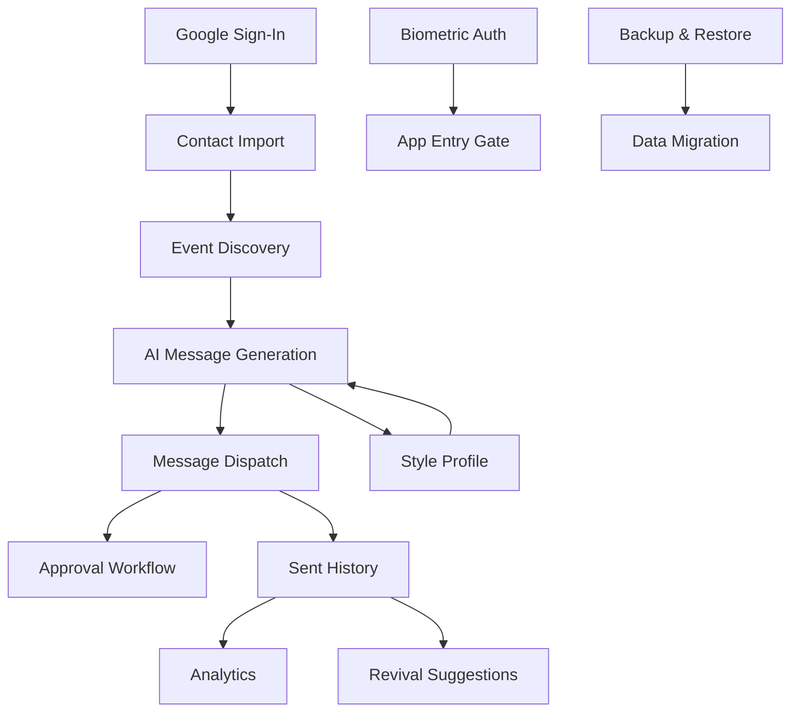

---

## 11. Detailed Feature Specifications

### 11.1 F-008: Birthday Detection

**Purpose**: Automatically discover birthdays from Google Contacts and device contacts.

**Implementation**:
- **File**: `automation/workers/EventDiscoveryWorker.kt`
- **Schedule**: Daily at 6:00 AM (WorkManager periodic)
- **Data Sources**:
  1. Google People API (`personFields=birthdays`)
  2. Device ContactsContract (`CommonDataKinds.Event.TYPE_BIRTHDAY`)
- **Algorithm**:
  1. Fetch all contacts with birthdays
  2. For each contact, create/update EventEntity with `type=BIRTHDAY`
  3. Compute `nextOccurrenceMs` based on current date and day/month
  4. Set `daysUntil = (nextOccurrenceMs - now) / DAY_IN_MS`
  5. If `year` is available, set `ageTurning` via `@get:Ignore` computed property
- **Edge Cases**:
  - Yearless birthdays (e.g., "June 23" with no year): `year = null`, `ageTurning = null`
  - February 29 birthdays: Use March 1 in non-leap years
  - Birthday already passed this year: Roll forward to next year

**Database Impact**:
- Insert/update `events` table
- 1 event per contact per type (unique on `contactId` + `type`)

**Testing**:
- Unit tests for date math
- Integration test with mock Google People API response

### 11.2 F-011: AI Message Generation

**Purpose**: Generate 6 message variants (short/standard/long + formal/funny/emotional) per event using Gemini 1.5-Flash.

**Implementation**:
- **Files**: 
  - `core/gemini/GeminiClient.kt` — REST client
  - `core/gemini/GeminiModels.kt` — Moshi data classes
  - `core/gemini/PromptBuilder.kt` — Constructs the prompt
  - `core/gemini/ResponseParser.kt` — Extracts the 6 variants from response
  - `core/gemini/RateLimiter.kt` — Adaptive sliding-window rate limiting

- **Endpoint**: `POST https://generativelanguage.googleapis.com/v1beta/models/gemini-1.5-flash:generateContent`
- **Authentication**: `x-goog-api-key` header (API key from SecurePrefs)
- **Request Format**:
  ```json
  {
    "contents": [{
      "parts": [{"text": "<prompt>"}]
    }],
    "generationConfig": {
      "temperature": 0.7,
      "maxOutputTokens": 1024,
      "topP": 0.9
    }
  }
  ```
- **Response Parsing**:
  ```kotlin
  GeminiResponse -> Candidate -> Content -> Parts -> firstOrNull()?.text
  ```
- **Rate Limiting**: 60 requests/minute sliding window
- **Retry Logic**: 3 attempts with exponential backoff (1s, 2s, 4s)
- **Error Handling**: Returns `{"error": "..."}` JSON string on failure

**Prompt Structure**:
```
You are writing a birthday message for {contact_name}, a {relationship_type} who is turning {age}.

Context:
- Hobbies: {hobbies}
- Interests: {interests}
- Shared history: {shared_history}
- Your relationship: {relationship_type}

Writing style:
- Tone: {tone} (warm/funny/emotional/formal)
- Length: {length} (short/standard/long)
- Use emojis: {yes/no}
- Language: {preferred_language}

Generate exactly 6 variants:
1. Short formal
2. Short funny
3. Short emotional
4. Standard formal
5. Standard funny
6. Long emotional

Return as JSON: {"variants": ["...", "...", ...]}
```

**Unit Tests**:
- `ResponseParserTest.kt` (8 tests) — Validates parsing of JSON responses
- `PromptBuilderTest.kt` (10 tests) — Validates prompt construction from entities

### 11.3 F-016: WhatsApp Sending (Accessibility Service)

**Purpose**: Send messages via WhatsApp when SMS is not the user's preferred channel.

**Implementation**:
- **Files**:
  - `accessibility/WhatsAppAccessibilityService.kt`
  - `automation/sender/WhatsAppSender.kt`
  - `res/xml/accessibility_service_config.xml`

- **Service Configuration**:
  ```xml
  <accessibility-service
    android:accessibilityEventTypes="typeWindowStateChanged|typeViewClicked|typeViewFocused"
    android:canRetrieveWindowContent="true"
    android:packageNames="com.whatsapp,com.whatsapp.w4b" />
  ```

- **Algorithm**:
  1. Launch WhatsApp via Intent (`ACTION_SEND`, `package=com.whatsapp`)
  2. Service detects when WhatsApp chat opens
  3. Service finds the message input field by resource ID or view ID
  4. Service types the message using `AccessibilityNodeInfo.performAction(ACTION_SET_TEXT)`
  5. Service finds the send button by resource ID
  6. Service clicks the send button

- **Edge Cases**:
  - WhatsApp not installed: Show "Install WhatsApp" snackbar
  - Dual WhatsApp (personal + business): Try both package names
  - Lock screen: Some OEMs (MIUI, ColorOS) require unlocked screen
  - Large messages: Split into multiple sends or use SMS fallback

**Known Limitations** (KI-02):
- Requires physical screen to be unlocked on some OEM skins
- Cannot send to WhatsApp groups in v1
- Cannot attach media

### 11.4 F-021: Relationship Health Score

**Purpose**: Calculate a 0-100 score representing how "stale" or "thriving" a relationship is.

**Implementation**:
- **File**: `feature/dashboard/MainViewModel.kt`
- **Algorithm**:
  ```kotlin
  healthScore = base_score
                + (interactionFrequencyPerMonth * 10).coerceAtMost(30)
                + if (lastInteractionDate within 30 days) +20
                + (consecutiveYearsWished * 5).coerceAtMost(20)
                - if (lastInteractionDate > 180 days) -30
  ```
- **Classification**:
  - **Thriving**: healthScore > 75
  - **Needs Attention**: 40-75
  - **At Risk**: < 40

- **Update Trigger**: 
  - On message sent: `incrementEngagementScore(+5)`
  - On birthday wished: `incrementConsecutiveYearsWished(+1)`
  - On manual interaction log: `updateLastInteractionDate(now)`

### 11.5 F-031: Revival Suggestions

**Purpose**: Suggest reconnection messages for contacts with low health scores.

**Implementation**:
- **File**: `automation/workers/RevivalWorker.kt`
- **Schedule**: Weekly (WorkManager periodic, 2-day initial delay)
- **Algorithm**:
  1. Query `contactDao.getBottomByHealthScore(5)` — bottom 5 contacts
  2. For each, check if `lastWishedDate` > 180 days ago
  3. Generate a revival message via Gemini (not a birthday message)
  4. Create PendingMessageEntity with `status = PENDING_REVIVAL`
  5. Schedule notification via `NotificationHelper.showRevivalNotification()`

- **Revival Message Prompt**:
  ```
  Write a casual message to {contact_name} to reconnect after not talking for {days} days.
  Reference: {shared_history}
  Tone: warm, casual, not awkward
  Length: short (1-2 sentences)
  ```

---

## 12. User Flows & Customer Journeys

### 12.1 Onboarding Flow

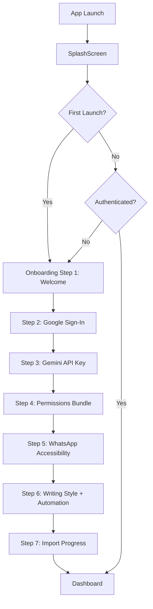

### 12.2 Daily Approval Flow

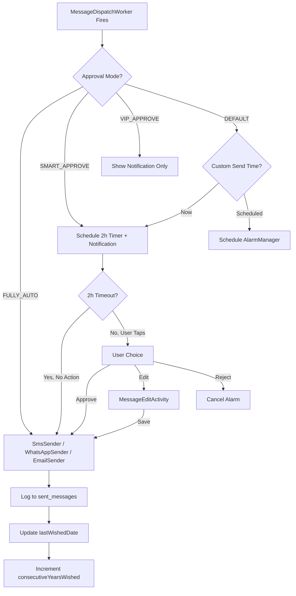

### 12.3 Contact Detail Flow

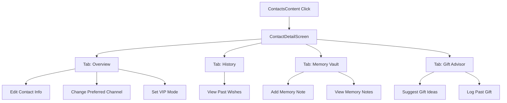

### 12.4 Error Paths

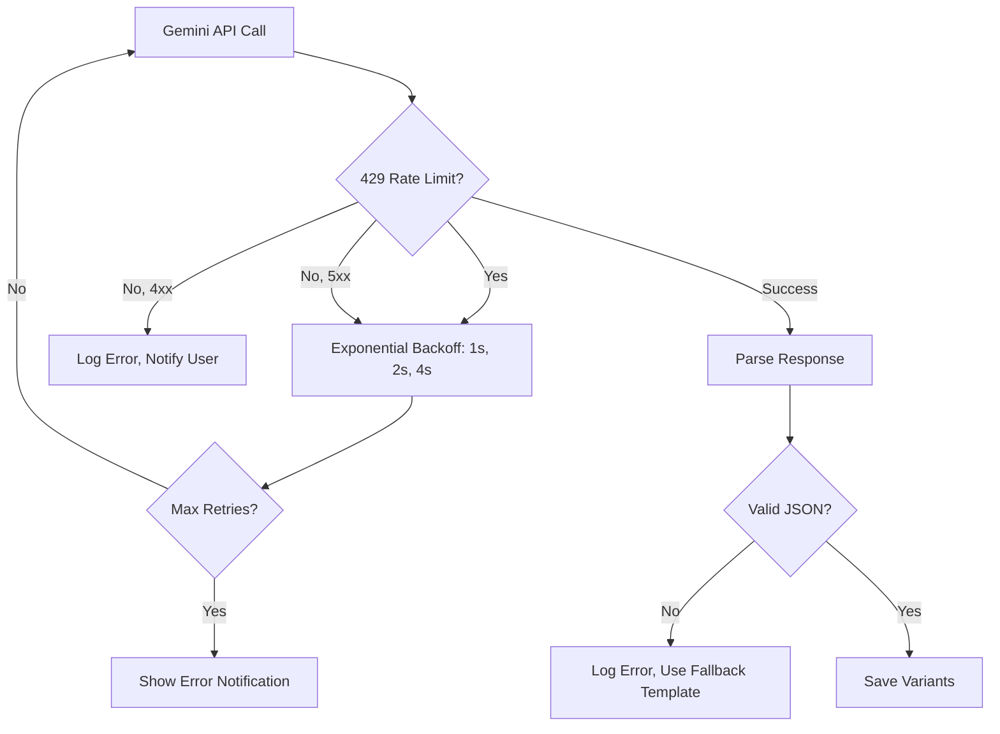

---

## 13. Business Logic & Rules

### 13.1 Relationship Health Score Calculation

**Rule**: `healthScore` is calculated as follows:
```
base = 50
+ (interactionFrequencyPerMonth * 10).coerceAtMost(30)  // Max +30
+ if (lastInteractionDate within 30 days) +20
+ (consecutiveYearsWished * 5).coerceAtMost(20)  // Max +20
- if (lastInteractionDate > 180 days) -30
- if (lastInteractionDate > 365 days) -20
```

**Why this rule**: Balances recency, frequency, and historical commitment. A friend you text weekly but didn't wish this year scores ~70. A friend you wish every year but don't text scores ~80. A friend with neither scores ~20.

### 13.2 Approval Workflow Rules

| Mode | Behavior | Notification | 2h Timeout | User Action Required |
|---|---|---|---|---|
| `FULLY_AUTO` | Send immediately | None | No | No |
| `SMART_APPROVE` | Schedule + notify | Yes | Yes | Optional (defaults to send) |
| `VIP_APPROVE` | Notify only | Yes | No | Yes (must approve) |
| `DEFAULT` | Per-contact custom time | Per custom time | No | Per custom time |

### 13.3 Message Variant Selection Logic

When user opens MessagesScreen:
1. Default selected variant = `length = "STANDARD"`, `tone = "WARM"`
2. User can switch length via FilterChip: Short / Standard / Long
3. User can switch tone via FilterChip: Formal / Funny / Emotional
4. If selected variant text is empty, fall back to first non-empty variant
5. If all variants are empty, show "Regenerate" button

### 13.4 AI Personalisation Rules

When generating a message:
1. **System prompt includes**:
   - Contact's name, relationship type, age (if known)
   - Hobbies, interests, shared history (from JSON enrichment)
   - User's StyleProfile (formality, emoji usage, common phrases)
   - Recipient's preferred language
2. **User prompt includes**:
   - The event (birthday, anniversary, etc.)
   - The desired length and tone
3. **Output constraints**:
   - Must be under 500 characters (SMS limit)
   - Must include the recipient's name
   - Must NOT include generic phrases like "Hope you have a great day" without personalisation

### 13.5 Rate Limiting Rules

- **Sliding window**: 60 requests per 60 seconds
- **Burst allowance**: Up to 10 requests in 1 second
- **Cooldown after 429**: 2x the `Retry-After` header value (or 60s default)
- **Backoff strategy**: Exponential (1s → 2s → 4s → 8s)

### 13.6 Gift Budget Logic

- **Default**: ₹500 per contact per year
- **Per-contact override**: `giftBudgetInr` field
- **VIP contacts**: Auto-set to ₹2000
- **Family**: Auto-set to ₹1000
- **Friends**: Auto-set to ₹500
- **Work**: Auto-set to ₹300

---

## 14. System Architecture

### 14.1 High-Level Architecture

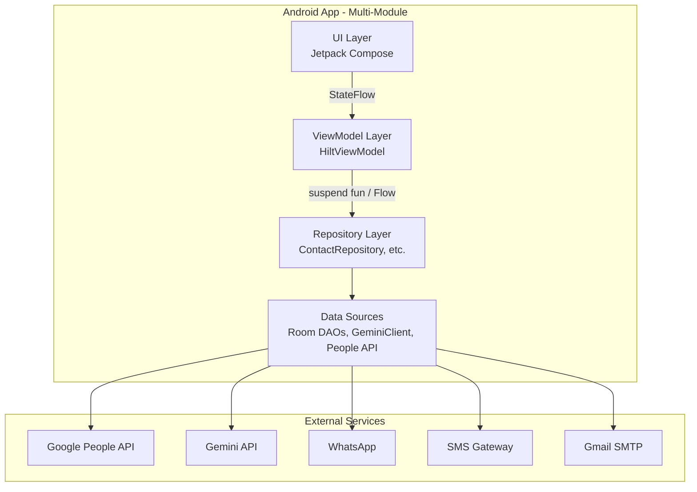

### 14.2 Module Structure

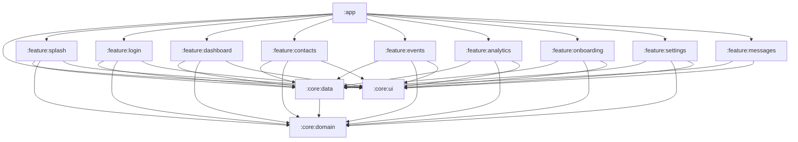

### 14.3 Multi-Module Architecture Details

The project follows a **Clean Architecture + Multi-Module** pattern:

| Module | Type | Purpose | Key Dependencies |
|---|---|---|---|
| `:app` | Application | App entry point, Hilt application class, manifest, MainActivity, widget, MessageEditActivity, ApprovalReceiver, BootReceiver, MessageDispatchReceiver | All feature modules, Hilt, WorkManager |
| `:core:domain` | **Android library** (`com.android.library`, namespace `com.example.core.domain`) | Domain interfaces (repository contracts), Room entities, UseCase *contracts*. **Note**: contains entities that should be Room-table-mapped. | kotlinx-coroutines, Room runtime (read-only) |
| `:core:data` | Library | Room DB, DAOs, repository implementations, UseCase *implementations* (10 use cases, misplaced per ADR-024), Gemini client, network, encryption, all 5 workers, all 3 senders | `:core:domain`, Room (ksp compiler + paging), SQLCipher, OkHttp, Moshi (kotlin + codegen ksp), Coil, Glide (dead code), Hilt, Firebase, JavaMail |
| `:core:ui` | Library | Shared Compose components, theme, navigation, settings UI components, style-coach UI components | Compose, Material 3, Coil |
| `:feature:splash` | Library | Splash screen + biometric auth gate | All core modules |
| `:feature:login` | Library | Google Sign-In UI | All core modules |
| `:feature:dashboard` | Library | Main app scaffold, AppContent, MainAppScreen, DashboardScreen, MainViewModel | All core modules |
| `:feature:contacts` | Library | Contact list, contact detail, memory vault, gift advisor | All core modules |
| `:feature:events` | Library | Events timeline, quick-add, calendar | All core modules |
| `:feature:analytics` | Library | Analytics dashboard, AnalyticsViewModel | All core modules |
| `:feature:onboarding` | Library | 10-step onboarding wizard | All core modules |
| `:feature:settings` | Library | Settings screen (Material 3, top-level) | All core modules |
| `:feature:messages` | Library | MessagesScreen (variant selector, draft list). **Note**: pulled out of `:feature:dashboard` in v3.2. | `:core:data`, `:core:ui` (does not depend on `:core:domain`) |

### 14.4 Folder Structure

```
AI-Birthday/
├── app/                              # :app module
│   ├── build.gradle.kts              # App build config; packaging excludes Hilt+Dagger duplicate META-INF
│   ├── proguard-rules.pro            # R8 obfuscation rules
│   └── src/
│       ├── main/
│       │   ├── AndroidManifest.xml   # Manifest, permissions, predictive back gesture
│       │   ├── java/com/example/
│       │   │   ├── MainActivity.kt   # FragmentActivity; uses Hilt field injection (HIGH-06)
│       │   │   ├── RelateAIApp.kt    # @HiltAndroidApp, WorkManager init, scheduleAllWorkers()
│       │   │   ├── automation/
│       │   │   │   └── notifications/MessageEditActivity.kt
│       │   │   ├── accessibility/WhatsAppAccessibilityService.kt  # (actually in :core:data)
│       │   │   └── widget/BirthdayWidgetProvider.kt
│       │   ├── res/                  # Resources (layouts, strings, themes)
│       │   │   ├── layout/           # widget_birthday.xml
│       │   │   ├── xml/              # accessibility_service_config, shortcuts, widget_birthday_info, data_extraction_rules, backup_rules
│       │   │   ├── values/           # strings.xml, themes.xml, colors.xml
│       │   │   └── mipmap/           # App icons
│       │   └── assets/               # (empty)
│       ├── test/                     # Unit tests (~40 @Test annotations across 8 files)
│       │   └── java/com/example/
│       │       ├── MainViewModelTest.kt         (2 tests; 4-arg ctor + FakeGetDashboardMetricsUseCase)
│       │       ├── core/db/DaoTest.kt            (10 tests; in-memory Room)
│       │       ├── core/gemini/ResponseParserTest.kt  (8 tests; ⚠️ currently has compile error at L127)
│       │       ├── core/gemini/PromptBuilderTest.kt   (10 tests)
│       │       ├── contacts/ContactMergerTest.kt      (8 tests)
│       │       ├── GreetingScreenshotTest.kt     (1 test; Roborazzi)
│       │       ├── ExampleUnitTest.kt           (1 test; boilerplate)
│       │       └── ExampleRobolectricTest.kt    (1 test; boilerplate)
│       └── androidTest/              # Instrumented tests
│           └── java/com/example/ExampleInstrumentedTest.kt
│
├── core/                             # :core modules
│   ├── domain/                       # :core:domain — **Android library** (not pure JVM)
│   │   ├── build.gradle.kts          # com.android.library, namespace com.example.core.domain
│   │   └── src/main/kotlin/com/example/
│   │       ├── domain/repository/    # 3 repository interfaces
│   │       │   ├── ContactRepository.kt
│   │       │   ├── EventRepository.kt
│   │       │   └── MessageRepository.kt
│   │       └── core/db/
│   │           ├── entities/         # 7 Room entities (lives here, NOT in :core:data)
│   │           │   ├── ContactEntity.kt
│   │           │   ├── EventEntity.kt
│   │           │   ├── PendingMessageEntity.kt
│   │           │   ├── SentMessageEntity.kt
│   │           │   ├── StyleProfileEntity.kt
│   │           │   ├── MemoryNoteEntity.kt
│   │           │   └── GiftHistoryEntity.kt
│   │           └── dao/              # (only RelationshipTypeCount value class lives here)
│   │               └── RelationshipTypeCount.kt
│   │
│   ├── data/                         # :core:data
│   │   ├── build.gradle.kts          # Android library, depends on :core:domain; applies moshi-kotlin-codegen KSP
│   │   └── src/main/kotlin/com/example/
│   │       ├── core/
│   │       │   ├── auth/BiometricAuthManager.kt
│   │       │   ├── backup/BackupManager.kt
│   │       │   ├── db/
│   │       │   │   ├── AppDatabase.kt
│   │       │   │   ├── DatabaseKeyDerivation.kt   # Now caches key in SharedPreferences (CRIT-01)
│   │       │   │   └── dao/                       # 6 DAOs (not RelationshipTypeCount)
│   │       │   │       ├── ContactDao.kt
│   │       │   │       ├── EventDao.kt
│   │       │   │       ├── PendingMessageDao.kt
│   │       │   │       ├── SentMessageDao.kt
│   │       │   │       ├── StyleProfileDao.kt
│   │       │   │       ├── MemoryNoteDao.kt
│   │       │   │       └── GiftHistoryDao.kt
│   │       │   ├── gemini/                       # GeminiClient, GeminiModels (Moshi @JsonClass), PromptBuilder, ResponseParser, RateLimiter
│   │       │   ├── prefs/SecurePrefs.kt
│   │       │   ├── contacts/                     # ContactMerger, DeviceContactsReader, GoogleContactsSync
│   │       │   ├── accessibility/WhatsAppAccessibilityService.kt
│   │       │   └── automation/
│   │       │       ├── workers/                  # 5 workers (NEW: MessageDispatchWorker)
│   │       │       │   ├── ContactSyncWorker.kt
│   │       │       │   ├── EventDiscoveryWorker.kt
│   │       │       │   ├── MessageGenerationWorker.kt
│   │       │       │   ├── MessageDispatchWorker.kt   # F-052, dispatches via MessageDispatcher
│   │       │       │   └── RevivalWorker.kt
│   │       │       ├── notifications/
│   │       │       │   ├── NotificationHelper.kt
│   │       │       │   └── ApprovalReceiver.kt
│   │       │       ├── scheduler/DailyScheduler.kt
│   │       │       └── sender/
│   │       │           ├── MessageDispatcher.kt
│   │       │           ├── SmsSender.kt
│   │       │           ├── WhatsAppSender.kt
│   │       │           └── EmailSender.kt
│   │       ├── data/repository/                  # 3 RepositoryImpls
│   │       ├── domain/usecase/                  # 10 use cases (TECHNICAL DEBT — should be in :core:domain, see ADR-024)
│   │       │   ├── ClassifyContactUseCase.kt
│   │       │   ├── SyncContactsUseCase.kt
│   │       │   ├── DiscoverEventsUseCase.kt
│   │       │   ├── GenerateMessageUseCase.kt
│   │       │   ├── ApprovePendingMessageUseCase.kt
│   │       │   ├── RejectPendingMessageUseCase.kt
│   │       │   ├── DispatchMessageUseCase.kt
│   │       │   ├── RefreshHealthScoresUseCase.kt
│   │       │   ├── GetDashboardMetricsUseCase.kt
│   │       │   └── GetAnalyticsUseCase.kt
│   │       └── di/AppModule.kt                   # Hilt: AppModuleBinds (abstract @Binds) + AppModule (object @Provides)
│   └── ui/                                       # :core:ui
│       ├── build.gradle.kts                      # Android library, Compose
│       └── src/main/kotlin/com/example/ui/
│           ├── components/                       # Components.kt, LoadingShimmer.kt
│           ├── navigation/AppBottomNavigation.kt # 5-tab bottom nav + nav rail
│           ├── settings/                         # SettingsScreen, StyleCoachScreen (Material 3)
│           └── theme/                            # Color.kt, Theme.kt, Type.kt, RelateAIColors
│
├── feature/                                      # :feature modules (9)
│   ├── splash/                       # :feature:splash
│   │   ├── build.gradle.kts
│   │   └── src/main/kotlin/com/example/feature/splash/SplashScreen.kt
│   ├── login/                        # :feature:login
│   │   ├── build.gradle.kts
│   │   └── src/main/kotlin/com/example/feature/login/LoginScreen.kt
│   ├── dashboard/                    # :feature:dashboard
│   │   ├── build.gradle.kts
│   │   └── src/main/kotlin/com/example/feature/dashboard/
│   │       ├── MainAppScreen.kt
│   │       ├── AppContent.kt
│   │       ├── DashboardScreen.kt
│   │       └── MainViewModel.kt       # 4-arg ctor: contactRepository, eventRepository, messageRepository, getDashboardMetrics
│   ├── contacts/                     # :feature:contacts
│   │   ├── build.gradle.kts
│   │   └── src/main/kotlin/com/example/feature/contacts/
│   │       ├── ContactsContent.kt
│   │       ├── ContactDetailScreen.kt  # ⚠️ HIGH-01: dead IconButton @ L44, stub Switch @ L185, stub TextButton @ L209
│   │       ├── MemoryVaultView.kt
│   │       └── GiftAdvisorView.kt
│   ├── events/                       # :feature:events
│   │   ├── build.gradle.kts
│   │   └── src/main/kotlin/com/example/feature/events/
│   │       ├── EventsScreen.kt         # ⚠️ MED-03: hardcoded English strings
│   │       └── BirthdayCalendarView.kt
│   ├── analytics/                    # :feature:analytics
│   │   ├── build.gradle.kts
│   │   └── src/main/kotlin/com/example/feature/analytics/
│   │       ├── AnalyticsScreen.kt
│   │       └── AnalyticsViewModel.kt
│   ├── onboarding/                   # :feature:onboarding
│   │   ├── build.gradle.kts
│   │   └── src/main/kotlin/com/example/feature/onboarding/OnboardingScreen.kt  # 10 steps
│   ├── settings/                     # :feature:settings
│   │   ├── build.gradle.kts
│   │   └── src/main/kotlin/com/example/feature/settings/
│   │       ├── SettingsScreen.kt
│   │       └── StyleCoachScreen.kt
│   └── messages/                     # :feature:messages (v3.2 — split from :feature:dashboard)
│       ├── build.gradle.kts
│       └── src/main/kotlin/com/example/feature/messages/MessagesScreen.kt
│
├── gradle/                                       # Gradle config
│   ├── libs.versions.toml                        # Version catalog (28 versions, 40+ libraries)
│   └── wrapper/                                  # Gradle wrapper
│
├── build.gradle.kts                              # Root build config
├── settings.gradle.kts                           # 13 module includes
├── gradle.properties                             # Gradle JVM args, AndroidX flags
├── local.properties                              # Local SDK path, env vars (gitignored)
├── proguard-rules.pro                            # R8 rules (root — currently no entries)
└── SSOT.md                                       # This document
```

### 14.5 Data Flow Example: Birthday Message Dispatch

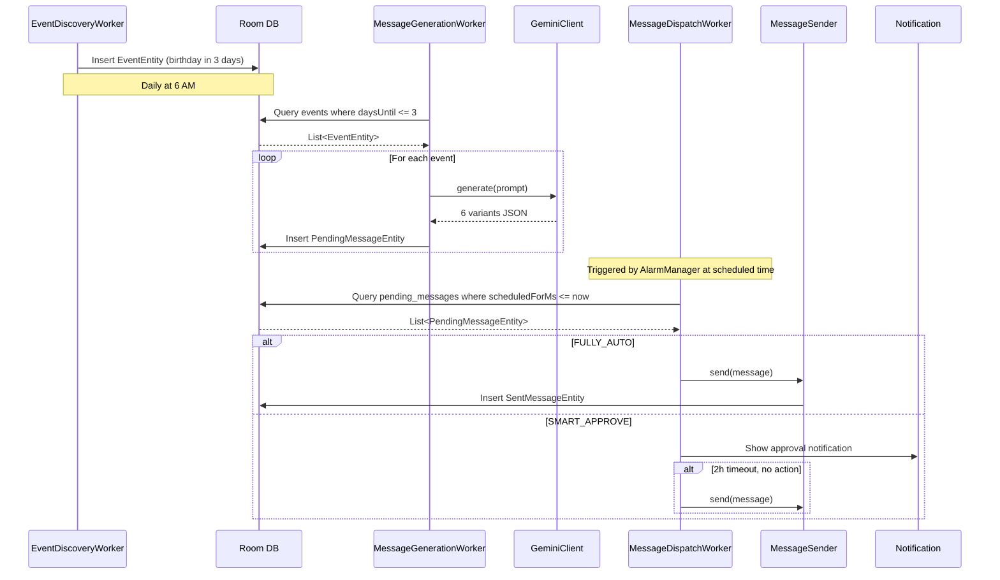

### 14.6 Module Migration Roadmap

| Phase | Module | Status | Dependencies |
|---|---|---|---|
| 1 | `:core:domain` | ✅ Done | None |
| 2 | `:core:data` | ✅ Done | `:core:domain` |
| 3 | `:core:ui` | ✅ Done | None |
| 4 | `:feature:splash`, `:feature:login` | ✅ Done | All core |
| 5 | `:feature:dashboard` | ✅ Done | All core |
| 6 | `:feature:contacts`, `:feature:events`, `:feature:analytics`, `:feature:messages` | ✅ Done | All core |
| 7 | `:feature:onboarding`, `:feature:settings` | ✅ Done | All core |
| 8 | UseCase layer | ⚠️ **Done but misplaced** — 10 use cases exist at `core/data/.../domain/usecase/`, but they should be in `:core:domain` per ADR-024 | Repository interfaces |
| 9 | Split `:core:data` into `:core:database`, `:core:network`, `:core:contacts`, `:core:automation`, `:core:prefs`, `:core:auth`, `:core:backup`, `:core:di` | 🔜 Planned | None |
| 10 | Move UseCase files to `:core:domain` (ADR-024 follow-up) | 🔜 Planned | Phase 8 |
| 11 | `:core:designsystem` (extract theme/components) | 🔜 Planned | `:core:ui` split |

---

## 15. Frontend Architecture

### 15.1 Framework
- **Jetpack Compose** (BOM 2024.09.00)
- **Material 3** (`androidx.compose.material3:material3:1.2.1`)
- **Activity Compose** (`androidx.activity:activity-compose:1.8.2`)
- **Navigation Compose** (`androidx.navigation:navigation-compose:2.8.9`)

### 15.2 Component Hierarchy

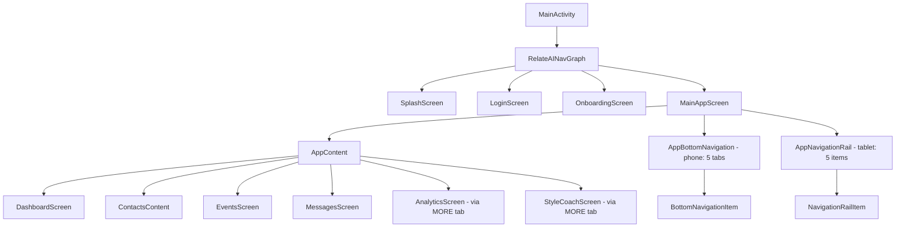

**Bottom Navigation** (`core/ui/navigation/AppBottomNavigation.kt:73-79`): **5 tabs** —
HOME, CONTACTS, EVENTS, MESSAGES, MORE.

**Hidden via MORE tab** (`feature/dashboard/AppContent.kt:36-51`): **2 sub-routes** —
ANALYTICS, STYLE_COACH (accessed via SettingsScreen).

### 15.3 State Management Pattern

**Pattern**: StateFlow + collectAsStateWithLifecycle

**Example** (MainViewModel, matches `feature/dashboard/.../MainViewModel.kt:22-27`):
```kotlin
@HiltViewModel
class MainViewModel @Inject constructor(
    private val contactRepository: ContactRepository,
    private val eventRepository: EventRepository,
    private val messageRepository: MessageRepository,
    private val getDashboardMetrics: GetDashboardMetricsUseCase
) : ViewModel() {
    val contacts: StateFlow<List<ContactEntity>> = contactRepository.getAll()
        .stateIn(viewModelScope, SharingStarted.WhileSubscribed(5000), emptyList())

    val events: StateFlow<List<EventEntity>> = eventRepository.getAll()
        .stateIn(viewModelScope, SharingStarted.WhileSubscribed(5000), emptyList())

    val pendingMessages: StateFlow<List<PendingMessageEntity>> = messageRepository.getAllPending()
        .stateIn(viewModelScope, SharingStarted.WhileSubscribed(5000), emptyList())

    val healthScore: StateFlow<Int> = _healthScore
        .stateIn(viewModelScope, SharingStarted.WhileSubscribed(5000), 0)

    init {
        viewModelScope.launch {
            _healthScore.value = getDashboardMetrics().healthScore
        }
        viewModelScope.launch {
            contactRepository.getAll().map { list ->
                if (list.isEmpty()) 0 else list.map { it.healthScore }.average().toInt()
            }.collect { _healthScore.value = it }
        }
    }
}
```

**Example** (Composable):
```kotlin
@Composable
fun DashboardScreen(viewModel: MainViewModel = hiltViewModel()) {
    val contacts by viewModel.contacts.collectAsStateWithLifecycle()
    val healthScore by viewModel.healthScore.collectAsStateWithLifecycle()
    
    // UI code...
}
```

### 15.4 Responsive Design

- **Phone**: Bottom navigation (`AppBottomNavigation`)
- **Tablet (>600dp)**: Navigation rail (`AppNavigationRail` in same file)
- **Window Size Class**: Used via `WindowSizeClass` from `material3-window-size-class`

### 15.5 UI Components Inventory

| Component | File | Purpose |
|---|---|---|
| `AppBottomNavigation` | `core/ui/navigation/` | Bottom nav + nav rail |
| `LoadingShimmer` | `core/ui/components/LoadingShimmer.kt` | ShimmerBox, ShimmerCircle, ShimmerTextLine, ShimmerCard |
| `Components` | `core/ui/components/Components.kt` | Common UI (Cards, Buttons, etc.) |
| `HealthRing` | `feature/analytics/AnalyticsScreen.kt` | Animated health score ring |
| `GlowingLineChart` | `feature/analytics/AnalyticsScreen.kt` | Time-series chart for engagement |
| `BirthdayCalendarView` | `feature/events/BirthdayCalendarView.kt` | Month grid with birthday dots |
| `MemoryVaultView` | `feature/contacts/MemoryVaultView.kt` | Note list + add note |
| `GiftAdvisorView` | `feature/contacts/GiftAdvisorView.kt` | Gift ideas + history |

### 15.6 Theme & Styling

- **Theme**: Material 3, defined in `core/ui/theme/Theme.kt`
- **Colors**: Deep purples and teals in `Color.kt`
- **Typography**: Material 3 scale in `Type.kt`
- **Dynamic Theming**: Supported on Android 12+ via `dynamicColor`
- **Dark Mode**: Supported via `isSystemInDarkTheme()`

### 15.7 Predictive Back Gesture (Android 13+, F-056)

- **Manifest flag**: `android:enableOnBackInvokedCallback="true"` on `<application>` in `app/src/main/AndroidManifest.xml`. Set in v3.2 to silence `WindowOnBackDispatcher W OnBackInvokedCallback is not enabled` warning on Android 13+ devices.
- **Behavior**: System back gesture and 3-button back both go through `OnBackInvokedDispatcher` instead of the legacy `onBackPressed()`. Compose's `BackHandler` composable works correctly with the new dispatcher.
- **No code change required** in feature screens — they already use `BackHandler { }` where needed (e.g., `OnboardingScreen` for back-press-on-welcome-skip).
- **Min SDK impact**: None — flag is ignored on API < 33. Default behavior preserved on legacy devices.
- **Rationale**: Forward-compat with Android 14/15/16 which deprecate the legacy back-press path. Removes logcat noise that made it hard to spot real issues.

---

## 16. Backend Architecture

### 16.1 Architecture Type
**Local-First, No Custom Backend.** All data lives on-device. The only external calls are to Google APIs.

### 16.2 External Services

| Service | Purpose | Authentication | Data Sent |
|---|---|---|---|
| Google People API | Contact sync | OAuth 2.0 (Google Sign-In) | None (reads) |
| Google Gemini API | Message generation | API Key (from user) | Prompt context (name, age, interests) |
| Gmail SMTP | Email sending | SMTP credentials (from user) | Email message |
| WhatsApp | Message sending | None (Accessibility) | Message text (typed via UI) |
| SMS | Message sending | None (system SmsManager) | Message text |

### 16.3 Data Storage

| Data | Location | Encryption |
|---|---|---|
| Contacts, Events, Messages | Room DB (SQLCipher) | AES-256 |
| OAuth tokens, API keys | EncryptedSharedPreferences | AES-256 |
| Style profile | Room DB | AES-256 |
| Backups | JSON file (user-chosen location) | Optional (v2) |

### 16.4 LLM Integration

- **Model**: Gemini 1.5-Flash (Google's fast, cost-effective model)
- **Endpoint**: `POST https://generativelanguage.googleapis.com/v1beta/models/gemini-1.5-flash:generateContent`
- **Auth**: API key in `x-goog-api-key` header
- **Rate Limit**: 60 req/min (free tier), 1000 req/min (paid tier)
- **Token Cost**: ~$0.000075 per 1K input tokens, ~$0.0003 per 1K output tokens

### 16.5 Future: On-Device LLM

**Long-term Roadmap**: Replace Gemini with on-device LLM (e.g., MediaPipe + Gemini Nano) for:
- **Privacy**: Zero data leaves device
- **Cost**: No API costs
- **Offline**: Works without internet
- **Latency**: No network round-trip

**Challenges**:
- Model size (2-4GB for Gemini Nano)
- RAM requirements (8GB+ devices)
- Inference speed on mid-range devices

---

## 17. State Management

### 17.1 State Management Strategy

RelateAI uses **StateFlow + collectAsStateWithLifecycle** as the primary state management pattern, following modern Android Architecture best practices.

### 17.2 Pattern: MVI (Model-View-Intent)

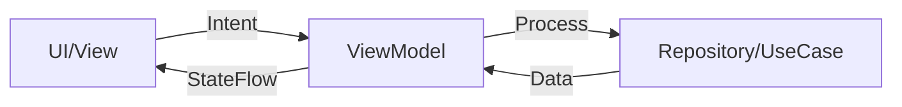

**Example**:
```kotlin
// Intent (user action)
viewModel.onMessageVariantSelected("funny")

// ViewModel processes
fun onMessageVariantSelected(variant: String) {
    _uiState.update { it.copy(selectedVariant = variant) }
}

// UI observes
val uiState by viewModel.uiState.collectAsStateWithLifecycle()
Text(uiState.selectedVariant)
```

### 17.3 State Containers

| Container | Purpose | Lifecycle |
|---|---|---|
| ViewModel | Survives configuration changes | Per Activity/Fragment |
| `remember { }` | Compose-local state | Per recomposition |
| `rememberSaveable { }` | Survives process death | Per recomposition + process death |
| DataStore (future) | Persistent preferences | App lifetime |

### 17.4 Event Handling

For one-off events (toasts, navigation):
```kotlin
// ViewModel
private val _events = Channel<UiEvent>(Channel.BUFFERED)
val events: Flow<UiEvent> = _events.receiveAsFlow()

fun onSave() {
    viewModelScope.launch {
        _events.send(UiEvent.ShowToast("Saved!"))
    }
}

// UI
LaunchedEffect(Unit) {
    viewModel.events.collect { event ->
        when (event) {
            is UiEvent.ShowToast -> snackbarHostState.showSnackbar(event.message)
        }
    }
}
```

### 17.5 Repository State

Repositories expose `Flow<T>` for reactive queries:
```kotlin
interface ContactRepository {
    fun getAll(): Flow<List<ContactEntity>>
    fun countAll(): Flow<Int>
    fun countByRelationshipType(): Flow<List<RelationshipTypeCount>>
}
```

This ensures UI is always in sync with DB changes without manual refresh.

---

## 18. Database Schema & Data Models

### 18.1 Entity Relationship Diagram

```mermaid
erDiagram
    CONTACTS ||--o{ EVENTS : has
    CONTACTS ||--o{ PENDING_MESSAGES : receives
    CONTACTS ||--o{ SENT_MESSAGES : received
    CONTACTS ||--o{ MEMORY_NOTES : has
    CONTACTS ||--o{ GIFT_HISTORY : has
    EVENTS ||--o{ PENDING_MESSAGES : triggers
    EVENTS ||--o{ SENT_MESSAGES : produced
    STYLE_PROFILE ||--|| CONTACTS : influences
    
    CONTACTS {
        string id PK
        string googleContactId
        string name
        string nickname
        int birthdayDay
        int birthdayMonth
        int birthdayYear
        int anniversaryDay
        int anniversaryMonth
        int anniversaryYear
        string primaryPhone
        string primaryEmail
        string company
        string jobTitle
        string profilePhotoUri
        string contactGroup
        string relationshipType
        string preferredLanguage
        string preferredChannel
        string formalityLevel
        string communicationStyle
        int healthScore
        int engagementScore
        float interactionFrequencyPerMonth
        long lastInteractionDate
        long lastWishedDate
        int consecutiveYearsWished
        string automationMode
        int giftBudgetInr
        boolean skipAutoWish
        int customSendTimeHour
        int customSendTimeMinute
        string interestsJson
        string hobbiesJson
        string sharedHistoryJson
        string favoritesJson
        string relationsJson
        string notesText
        string typicalMoodWhenContacted
        string sensitiveTopicsJson
        string currentLifePhaseJson
        long createdAt
        long updatedAt
        boolean isArchived
    }
    
    EVENTS {
        string id PK
        string contactId FK
        string type
        string label
        int dayOfMonth
        int month
        int year
        long nextOccurrenceMs
        int daysUntil
        boolean isActive
        int notifyDaysBefore
        string source
        int confidenceScore
        boolean isVerified
    }
    
    PENDING_MESSAGES {
        string id PK
        string contactId FK
        string eventId FK
        string shortVariant
        string standardVariant
        string longVariant
        string formalVariant
        string funnyVariant
        string emotionalVariant
        string selectedVariant
        string selectedVariantText
        string channel
        long scheduledForMs
        string approvalMode
        string status
        string aiModel
        long generatedAtMs
        boolean editedByUser
        string userEditedText
        int qualityScore
        string tone
        string length
        boolean includeEmoji
    }
    
    SENT_MESSAGES {
        string id PK
        string contactId FK
        string eventType
        int eventYear
        string messageText
        string channel
        long sentAtMs
        string deliveryStatus
        boolean aiGenerated
        string geminiModel
        string variantUsed
        long replyAtMs
    }
    
    STYLE_PROFILE {
        int id PK
        string sampleMessagesJson
        boolean usesEmoji
        int avgMessageLength
        string commonPhrasesJson
        string commonGreetingsJson
        string formalityLevel
        string preferredLanguage
        string emojiSetJson
        string avoidPhrasesJson
        string toneDescriptors
        int sampleCount
        long updatedAtMs
    }
    
    MEMORY_NOTES {
        string id PK
        string contactId FK
        string category
        string title
        string noteText
        long createdAt
    }
    
    GIFT_HISTORY {
        string id PK
        string contactId FK
        string giftName
        int giftAmountInr
        long giftDate
        string occasion
        string notes
    }
```

### 18.2 Database Version History

| Version | Migration | Description |
|---|---|---|
| 1 | Initial | contacts, events, pending_messages, sent_messages, style_profile, memory_notes, gift_history |
| 2 | — | (intermediate placeholder) |
| 3 | MIGRATION_2_3 | Add `customSendTimeHour/Minute` to contacts; `source`, `confidenceScore`, `isVerified` to events; `qualityScore`, `tone`, `length`, `includeEmoji` to pending_messages |
| 4 | MIGRATION_3_4 | DROP TABLE `mood_logs` |
| 5 | MIGRATION_4_5 | Add `contactGroup` to contacts |
| 6 | MIGRATION_5_6 | Add `relationsJson` to contacts |
| 7 | MIGRATION_6_7 | Add indices: `idx_events_nextOccurrenceMs`, `idx_pending_messages_scheduledForMs`, `idx_sent_messages_contactId_sentAtMs` |

**Current Version**: 7 (after MIGRATION_6_7, Phase 1 Performance & Startup Optimization)

### 18.3 Entity Details

#### 18.3.1 ContactEntity
- **Primary Key**: `id` (String, typically Google contact resource name or device contact ID)
- **Key Fields**:
  - `relationshipType`: UNKNOWN, FAMILY, FRIEND, WORK, ACQUAINTANCE
  - `healthScore`: 0-100
  - `engagementScore`: 0-100
  - `automationMode`: FULLY_AUTO, SMART_APPROVE, VIP_APPROVE, DEFAULT
- **JSON Fields**: `interestsJson`, `hobbiesJson`, `sharedHistoryJson`, `favoritesJson`, `relationsJson`, `sensitiveTopicsJson`, `currentLifePhaseJson`
- **Computed Property**: `ageTurning` (in EventEntity, `@get:Ignore`)

#### 18.3.2 EventEntity
- **Primary Key**: `id` (String, UUID)
- **Types**: BIRTHDAY, ANNIVERSARY, WORK_ANNIVERSARY, GRADUATION, CUSTOM
- **Sources**: CONTACTS, CALENDAR, MANUAL, AI_INFERRED
- **Computed**: `ageTurning` (nullable Int)

#### 18.3.3 PendingMessageEntity
- **Primary Key**: `id` (String, UUID)
- **6 Variants**: `shortVariant`, `standardVariant`, `longVariant`, `formalVariant`, `funnyVariant`, `emotionalVariant`
- **Selected**: `selectedVariant` (key), `selectedVariantText` (text)
- **Approval Modes**: FULLY_AUTO, SMART_APPROVE, VIP_APPROVE, DEFAULT
- **Statuses**: PENDING, APPROVED, REJECTED, SENT, FAILED
- **Tones**: WARM, FUNNY, NOSTALGIC, MOTIVATIONAL, PROFESSIONAL
- **Lengths**: ULTRA_SHORT, STANDARD, LONG

#### 18.3.4 SentMessageEntity
- **Delivery Statuses**: SENT, DELIVERED, FAILED

#### 18.3.5 StyleProfileEntity
- **Primary Key**: `id = 1` (singleton)
- **JSON Fields**: `sampleMessagesJson`, `commonPhrasesJson`, `commonGreetingsJson`, `emojiSetJson`, `avoidPhrasesJson`, `toneDescriptors`

#### 18.3.6 MemoryNoteEntity
- **Categories**: PERSONAL, MILESTONE, INSIDE_JOKE, GIFT_IDEA, OTHER

#### 18.3.7 GiftHistoryEntity
- **Fields**: `giftName`, `giftAmountInr`, `giftDate`, `occasion`, `notes`

### 18.4 DAOs

| DAO | Entity | Key Queries |
|---|---|---|
| `ContactDao` | ContactEntity | `getAll()`, `getById()`, `upsert()`, `updateClassification()`, `updateHealthScore()`, `countAll()`, `countByRelationshipType()`, `getTopByHealthScore()`, `getBottomByHealthScore()` |
| `EventDao` | EventEntity | `getAll()`, `getByContactId()`, `getUpcoming(days)`, `upsert()`, `getById()` |
| `PendingMessageDao` | PendingMessageEntity | `getAllPending()`, `getByEventId()`, `getByContactId()`, `insert()`, `updateStatus()`, `updateSelectedVariant()` |
| `SentMessageDao` | SentMessageEntity | `getAll()`, `getByContactId()`, `insert()`, `countAll()`, `countRecent()` |
| `StyleProfileDao` | StyleProfileEntity | `getProfile()`, `upsert()` |
| `MemoryNoteDao` | MemoryNoteEntity | `getByContactId()`, `insert()`, `update()`, `delete()` |
| `GiftHistoryDao` | GiftHistoryEntity | `getByContactId()`, `insert()`, `update()`, `delete()` |

### 18.5 Indices

Currently no explicit indices defined beyond primary keys. ✅ **Indices added in v3.2 (Phase 1, MIGRATION_6_7)**:
- `events(contactId)` for fast contact-event joins — 🔜 Planned (not in MIGRATION_6_7)
- `events(nextOccurrenceMs)` for upcoming events query — ✅ Done (idx_events_nextOccurrenceMs)
- `pending_messages(scheduledForMs)` for dispatch query — ✅ Done (idx_pending_messages_scheduledForMs)
- `sent_messages(contactId, sentAtMs DESC)` for history query — ✅ Done (idx_sent_messages_contactId_sentAtMs)

---

## 19. API Documentation

### 19.1 Google People API

**Base URL**: `https://people.googleapis.com/v1/`

**Endpoints Used**:

#### 19.1.1 List Contacts
```
GET /people/me/connections
    ?personFields=names,emailAddresses,phoneNumbers,organizations,birthdays,events,memberships,relations,photos
    &pageSize=2000
    &syncToken={token}  (optional, for incremental sync)
```

**Scopes**: `https://www.googleapis.com/auth/contacts.readonly`

**Response** (abbreviated):
```json
{
  "connections": [
    {
      "resourceName": "people/c1234567890",
      "names": [{"displayName": "Priya Sharma", "givenName": "Priya", "familyName": "Sharma"}],
      "phoneNumbers": [{"value": "+919876543210", "type": "mobile"}],
      "emailAddresses": [{"value": "priya@example.com"}],
      "birthdays": [{"date": {"month": 6, "day": 23, "year": 1995}}],
      "memberships": [{"contactGroupMembership": {"contactGroupResourceName": "contactGroups/family"}}],
      "relations": [{"person": "Raj Sharma", "type": "spouse"}]
    }
  ],
  "nextSyncToken": "abc123",
  "nextPageToken": "xyz789"
}
```

#### 19.1.2 Error Codes
- `401 Unauthorized`: Token expired → Trigger refresh
- `403 Forbidden`: Scope not granted → Request scope
- `429 Too Many Requests`: Rate limit → Backoff
- `5xx`: Server error → Retry

### 19.2 Gemini API

**Base URL**: `https://generativelanguage.googleapis.com/v1beta/models`

**Endpoint**: `POST /gemini-1.5-flash:generateContent`

**Auth**: `x-goog-api-key: {API_KEY}` header

**Request Body**:
```json
{
  "contents": [{
    "parts": [{"text": "Write a birthday message for..."}]
  }],
  "generationConfig": {
    "temperature": 0.7,
    "maxOutputTokens": 1024,
    "topP": 0.9,
    "topK": 40
  },
  "safetySettings": [
    {"category": "HARM_CATEGORY_HARASSMENT", "threshold": "BLOCK_MEDIUM_AND_ABOVE"},
    {"category": "HARM_CATEGORY_HATE_SPEECH", "threshold": "BLOCK_MEDIUM_AND_ABOVE"}
  ]
}
```

**Response Body**:
```json
{
  "candidates": [{
    "content": {
      "parts": [{"text": "Happy 30th birthday Priya!..."}],
      "role": "model"
    },
    "finishReason": "STOP",
    "safetyRatings": [...]
  }],
  "usageMetadata": {
    "promptTokenCount": 245,
    "candidatesTokenCount": 38,
    "totalTokenCount": 283
  }
}
```

**Error Codes**:
- `400 Bad Request`: Invalid prompt (safety block, malformed JSON)
- `401 Unauthorized`: Invalid API key
- `403 Forbidden`: API key disabled or quota exceeded
- `429 Too Many Requests`: Rate limit → Backoff with `Retry-After`
- `500/503`: Server error → Retry

### 19.3 Gmail SMTP

**SMTP Server**: `smtp.gmail.com:587` (TLS)

**Auth**: SMTP credentials (email + app password)

**Sending Flow** (JavaMail):
```kotlin
val props = Properties().apply {
    put("mail.smtp.auth", "true")
    put("mail.smtp.starttls.enable", "true")
    put("mail.smtp.host", "smtp.gmail.com")
    put("mail.smtp.port", "587")
}
val session = Session.getInstance(props, object : Authenticator() {
    override fun getPasswordAuthentication() = 
        PasswordAuthentication(email, appPassword)
})
val message = MimeMessage(session).apply {
    setFrom(InternetAddress(email))
    setRecipients(Message.RecipientType.TO, InternetAddress.parse(recipient))
    subject = "Happy Birthday!"
    setText(body)
}
Transport.send(message)
```

### 19.4 Internal API (Repository Layer)

The repository layer exposes a clean interface to ViewModels:

```kotlin
interface ContactRepository {
    fun getAll(): Flow<List<ContactEntity>>
    suspend fun getAllSync(): List<ContactEntity>
    suspend fun getById(id: String): ContactEntity?
    suspend fun upsert(contact: ContactEntity)
    suspend fun update(contact: ContactEntity)
    suspend fun updateClassification(id: String, type: String, subtype: String?, lang: String, formality: String, style: String)
    suspend fun updateHealthScore(id: String, score: Int)
    suspend fun updateLastWished(id: String, timestamp: Long)
    suspend fun incrementEngagementScore(id: String, delta: Int)
    suspend fun incrementConsecutiveYearsWished(id: String)
    fun countAll(): Flow<Int>
    fun countByRelationshipType(): Flow<List<RelationshipTypeCount>>
    suspend fun getTopByHealthScore(limit: Int): List<ContactEntity>
    suspend fun getBottomByHealthScore(limit: Int): List<ContactEntity>
    suspend fun delete(contact: ContactEntity)
}
```

---

## 20. Third-Party Integrations

### 20.1 Dependency Inventory

| Dependency | Version | Purpose | Criticality | License |
|---|---|---|---|---|
| AGP (Android Gradle Plugin) | 9.2.1 | Build system | Critical | Apache 2.0 |
| Kotlin | 2.2.10 | Language | Critical | Apache 2.0 |
| Jetpack Compose BOM | 2024.09.00 | UI framework | Critical | Apache 2.0 |
| AppCompat | 1.7.0 | Backwards compat activities | Medium | Apache 2.0 |
| Material (MaterialComponents) | 1.12.0 | Material widgets | Medium | Apache 2.0 |
| Material 3 | 1.2.1 | Design system | High | Apache 2.0 |
| Hilt | 2.59.2 | Dependency injection | Critical | Apache 2.0 |
| Room | 2.7.0 | Local database | Critical | Apache 2.0 |
| Room Paging | 2.7.0 | Paging 3 integration | Low | Apache 2.0 |
| SQLCipher | 4.5.4 | Database encryption | Critical | BSD |
| WorkManager | 2.9.0 | Background scheduling | Critical | Apache 2.0 |
| Coil | 2.7.0 (`catalog`) / 2.6.0 (`:core:data`) | Image loading | Medium | Apache 2.0 |
| Glide | 4.16.0 | Image loading (declared in `:core:data` but **dead code**, no usages — see §30) | Low | Apache 2.0 |
| Moshi | 1.15.1 | JSON serialization | High | Apache 2.0 |
| Gson | 2.10.1 | JSON (declared via `material 1.12.0` transitive — not directly used) | Low | Apache 2.0 |
| OkHttp | 4.12.0 | HTTP client | High | Apache 2.0 |
| Retrofit | 2.12.0 | REST client | High | Apache 2.0 |
| Google Play Services Auth | 21.2.0 | Google Sign-In | Critical | Google Play Services |
| Google API Client | 2.7.0 | People API | High | Apache 2.0 |
| Google API People | v1-rev20220531-2.0.0 | Contacts API (v3.2 correction — was incorrectly v1-rev20250604) | High | Apache 2.0 |
| Google AI Gemini | 1.5-Flash | LLM | Critical | Proprietary |
| AndroidX Biometric | 1.2.0-alpha05 | Fingerprint/Face | High | Apache 2.0 |
| AndroidX Security Crypto | 1.1.0-alpha06 | EncryptedSharedPreferences | Critical | Apache 2.0 |
| JavaMail (Sun) | 1.6.2 | SMTP email | Medium | CDDL/GPL |
| Robolectric | 4.16.1 | Unit testing | Dev | Apache 2.0 |
| Roborazzi | 1.59.0 | Screenshot testing | Dev | Apache 2.0 |
| JUnit 4 | 4.13.2 | Testing | Dev | EPL 1.0 |
| Kotlinx Coroutines | 1.10.2 | Async | Critical | Apache 2.0 |
| AndroidX Activity Compose | 1.8.2 | Compose integration | High | Apache 2.0 |
| AndroidX Navigation Compose | 2.8.9 | Navigation | High | Apache 2.0 |
| AndroidX Lifecycle | 2.8.2 | Lifecycle awareness | High | Apache 2.0 |
| Secrets Gradle Plugin | 2.0.0 | .env file management | Build | Apache 2.0 |
| Baseline Profile Plugin | 1.5.0-alpha06 | AOT compilation of hot code paths | Build | Apache 2.0 |
| KSP | 2.3.5 | Annotation processing (Kotlin 2.2.10-compatible) | Build | Apache 2.0 |
| Google DevTools KSP | 2.3.5 | KSP for Google libs | Build | Apache 2.0 |
| Moshi KSP codegen | 1.15.1 | KSP processor for `@JsonClass(generateAdapter=true)` (CRIT-04 fix) | Build | Apache 2.0 |
| Glide KSP | 4.16.0 | KSP processor for Glide (dead code path) | Build | Apache 2.0 |
| Room KSP compiler | 2.7.0 | KSP processor for Room | Build | Apache 2.0 |
| Hilt KSP compiler | 2.59.2 | KSP processor for Hilt | Build | Apache 2.0 |
| Firebase BOM | 34.12.0 | Analytics, Crashlytics, Messaging (declared) | Medium | Apache 2.0 |
| foojay-resolver-convention | 1.0.0 | JDK auto-provisioning | Build | Apache 2.0 |

**Changes from v3.1**:
- AGP: 9.2 → 9.2.1
- KSP: 2.0.21-1.0.27 → 2.3.5 (required for Kotlin 2.2.10)
- Moshi: 1.15.2 → 1.15.1
- Retrofit: 2.11.0 → 2.12.0
- Google API People: v1-rev20250604-2.0.0 → v1-rev20220531-2.0.0 (v3.1 had wrong version; actual `libs.versions.toml` uses the older revision)
- Added: AppCompat 1.7.0, Material 1.12.0, Room Paging 2.7.0, Glide 4.16.0, Gson 2.10.1, Moshi KSP codegen, Glide KSP, Room KSP, Hilt KSP, Firebase BOM 34.12.0, foojay-resolver-convention 1.0.0, Baseline Profile plugin 1.5.0-alpha06
- Confirmed 3 KSP processors wired in `:core:data` (v3.2): Room compiler, Hilt compiler, Moshi kotlin-codegen. Glide compiler is declared but never triggers (no `@GlideModule` annotation in codebase).
- Added `androidx.baselineprofile` Gradle plugin for Phase 1 Performance & Startup Optimization.

### 20.2 Version Catalog (`gradle/libs.versions.toml`)

All dependencies are managed via the version catalog. This ensures version consistency across modules.

### 20.3 License Compliance

- All dependencies use permissive licenses (Apache 2.0, BSD, CDDL/GPL for JavaMail).
- No GPL or AGPL dependencies (which would require source disclosure).
- SQLCipher uses BSD (permissive).
- JavaMail uses CDDL/GPL (dual license, compatible with app distribution).

### 20.4 Third-Party API Rate Limits

| API | Free Tier Limit | Paid Tier Limit |
|---|---|---|
| Google People API | 90,000 requests/day | 1,000,000 requests/day |
| Gemini 1.5-Flash | 60 requests/min, 1500/day | 1000 requests/min |
| Gmail SMTP | 500 emails/day (personal), 2000/day (Workspace) | Same |

---

## 21. Authentication & Authorization

### 21.1 Authentication Flow

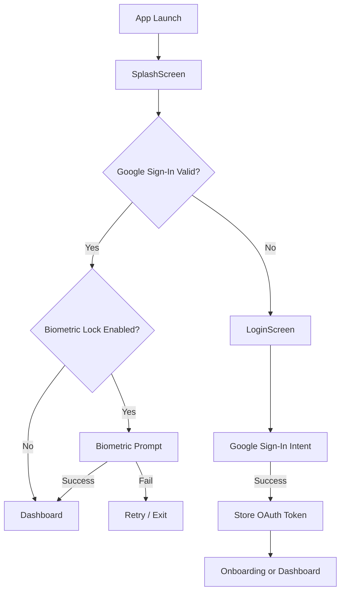

### 21.2 Google Sign-In

- **Library**: `com.google.android.gms:play-services-auth:21.2.0`
- **Scopes**: 
  - `https://www.googleapis.com/auth/contacts.readonly` (People API)
  - `email`, `profile` (basic profile)
- **Implementation**: `LoginScreen.kt` + `GoogleSignInClient`
- **Token Storage**: EncryptedSharedPreferences via `SecurePrefs.setOAuthToken()`

### 21.3 Biometric Authentication

- **Library**: `androidx.biometric:biometric:1.2.0-alpha05`
- **Implementation**: `BiometricAuthManager.kt`
- **Trigger**: SplashScreen on cold start (if `isBiometricLockEnabled() == true`)
- **Prompt**: BiometricPrompt with BIOMETRIC_STRONG or DEVICE_CREDENTIAL
- **Settings Toggle**: SettingsScreen → "Enable Biometric Lock"

### 21.4 Authorization Model

There is no fine-grained authorization in v1. The app is single-user. Future multi-user support would require:
- Per-user OAuth tokens
- Per-user database encryption keys
- Per-user data isolation

### 21.5 OAuth Token Lifecycle

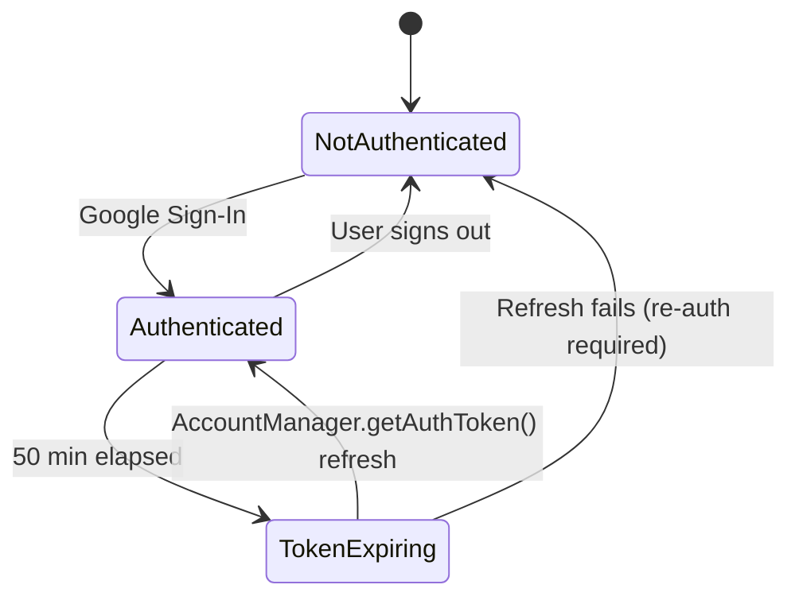

**Refresh Strategy** (P2-06, ✅ Done):
- `GoogleContactsSync.getValidToken()` called before every People API request
- Uses `AccountManager.getAuthToken()` to refresh silently
- Stores refreshed token back to `SecurePrefs`

---

## 22. Security Model

### 22.1 Security Layers

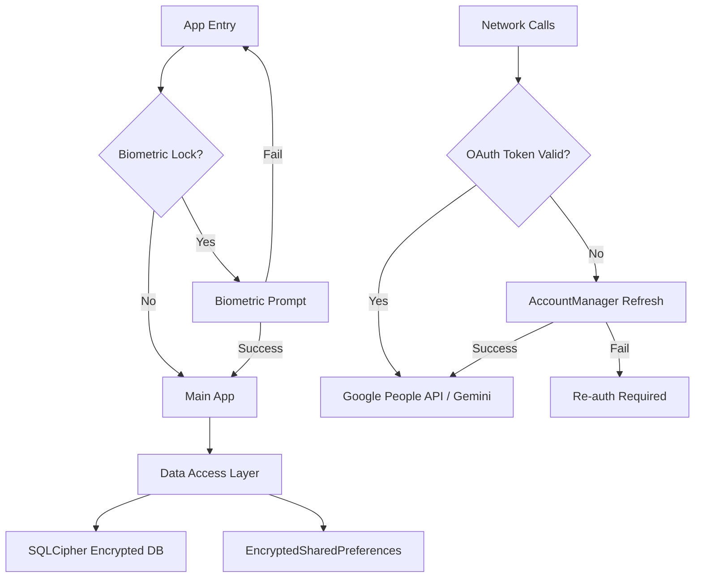

### 22.2 Encryption

| Asset | Encryption | Key Derivation |
|---|---|---|
| Room database | SQLCipher AES-256 | PBKDF2 (ANDROID_ID + app cert hash, 65536 iterations) |
| SharedPreferences | AndroidX Security Crypto AES-256 | Android Keystore (MasterKey) |
| OAuth tokens | EncryptedSharedPreferences | Android Keystore |
| API keys | EncryptedSharedPreferences | Android Keystore |
| Backups (JSON) | Not encrypted in v1 (planned v2) | N/A |

### 22.3 Database Encryption Key Derivation (CRIT-01 ✅ Done in v3.2)

```kotlin
object DatabaseKeyDerivation {
    private const val PREFS_NAME = "relateai_db_meta"
    private const val PREF_DB_KEY = "db_key_v2_b64"
    private const val PREF_SCHEMA_VERSION = "db_key_schema_version"
    private const val CURRENT_SCHEMA_VERSION = 2

    @Volatile private var cachedKey: ByteArray? = null

    fun deriveKey(context: Context): ByteArray {
        cachedKey?.let { return it }

        val prefs = context.getSharedPreferences(PREFS_NAME, Context.MODE_PRIVATE)
        val storedSchema = prefs.getInt(PREF_SCHEMA_VERSION, 0)
        if (storedSchema == CURRENT_SCHEMA_VERSION) {
            val b64 = prefs.getString(PREF_DB_KEY, null)
            if (b64 != null) {
                val decoded = Base64.decode(b64, Base64.NO_WRAP)
                cachedKey = decoded
                return decoded
            }
        }

        // Cache miss: compute on calling thread (acceptable once, then cached).
        val androidId = Settings.Secure.getString(
            context.contentResolver, Settings.Secure.ANDROID_ID
        ) ?: throw SecurityException("ANDROID_ID unavailable")

        val appSignatureHash = getAppCertificateHash(context)
        val keyMaterial = "$androidId:$appSignatureHash:relateai_v2"

        val spec = PBEKeySpec(
            keyMaterial.toCharArray(),
            androidId.take(16).toByteArray(Charsets.UTF_8),
            65536,   // iterations
            256      // bits
        )
        val key = SecretKeyFactory
            .getInstance("PBKDF2WithHmacSHA256")
            .generateSecret(spec)
            .encoded

        prefs.edit()
            .putString(PREF_DB_KEY, Base64.encodeToString(key, Base64.NO_WRAP))
            .putInt(PREF_SCHEMA_VERSION, CURRENT_SCHEMA_VERSION)
            .apply()
        cachedKey = key
        return key
    }

    fun warmUpAsync(context: Context) {
        Thread({
            try { deriveKey(context) } catch (_: Throwable) { /* will retry on demand */ }
        }, "db-key-warmup").apply {
            isDaemon = true
            priority = Thread.NORM_PRIORITY - 1
        }.start()
    }
}
```

**Caller side** (in `app/.../RelateAIApp.onCreate()`):
```kotlin
override fun onCreate() {
    super.onCreate()
    DatabaseKeyDerivation.warmUpAsync(this)  // ~349ms PBKDF2 moves off main thread
    scheduleAllWorkers()
    ...
}
```

**Trade-off**: Using ANDROID_ID means the database is tied to the device. If the user changes devices, they must restore from backup. This is acceptable for v1 (local-first app).

**Security note on caching**: The derived key is stored in **plain `SharedPreferences`** (not `EncryptedSharedPreferences`) because the key is itself deterministic from `ANDROID_ID + app signature hash` — an attacker with prefs access could re-derive the same value. Storing the derived bytes in plain prefs adds zero risk vs. re-deriving. Caching avoids the 349ms `Long monitor contention` logcat warning on every cold start. (See ADR-021.)

### 22.4 Network Security

- **HTTPS Only**: All API calls use HTTPS
- **Certificate Pinning**: Not implemented in v1 (planned v2 for People API)
- **Cleartext Traffic**: Disabled via `networkSecurityConfig` (default for SDK 28+)

### 22.5 ProGuard/R8

- **Enabled**: `isMinifyEnabled = true` in release build
- **Rules**: `app/proguard-rules.pro` with keep rules for:
  - Hilt-generated classes
  - Room entities
  - Moshi data classes
  - OkHttp/Retrofit
  - Gemini API response models

### 22.6 Accessibility Service Security

- **Scope**: Limited to `com.whatsapp,com.whatsapp.w4b` via `packageNames` attribute
- **Required Disclosure**: Play Store listing must describe what the service does
- **Audit Logging**: (Planned v2) Log all accessibility actions for user review

### 22.7 Security Checklist

| ID | Requirement | Status |
|---|---|---|
| SEC-01 | SQLCipher encryption | ✅ Done |
| SEC-02 | EncryptedSharedPreferences for secrets | ✅ Done |
| SEC-03 | No PII in Logcat (release) | ✅ Done |
| SEC-04 | R8 enabled in release | ✅ Done |
| SEC-05 | Biometric app lock | ✅ Done |
| SEC-06 | OAuth token refresh | ✅ Done |
| SEC-07 | Accessibility Service scope limited | ✅ Done |
| SEC-08 | HTTPS only | ✅ Done |
| SEC-09 | ProGuard rules for all reflection-used libs | ✅ Done |
| SEC-10 | `exportSchema = true` for migration testing | ✅ Done |

### 22.8 Known Security Limitations

- **ANDROID_ID-based key**: Ties DB to device. User must restore from backup on new device.
- **No certificate pinning**: Vulnerable to MITM if user installs rogue CA. (CRIT-02, planned v2)
- **Backup JSON not encrypted**: User must store backup file securely. (CRIT-03, planned v2)
- **MasterKey on main thread**: ✅ **Resolved in v3.2 (CRIT-01)** — DB key derivation now cached in `SharedPreferences` after first derivation, and `warmUpAsync()` pre-warms the cache on a daemon thread at `onCreate()`.

### 22.9 Threat Model (STRIDE)

| Threat | Asset | Mitigation | Status |
|---|---|---|---|
| **S**poofing | User identity | Google Sign-In (OAuth 2.0), biometric lock | ✅ |
| **T**ampering | Room DB | SQLCipher AES-256 | ✅ |
| **T**ampering | API requests | HTTPS only (no cert pinning in v1) | ⚠️ Cert pinning planned v2 (CRIT-02) |
| **R**epudiation | Message dispatch | WorkManager Result logging, sent_messages table | ✅ |
| **I**nfo Disclosure | OAuth tokens | EncryptedSharedPreferences (Android Keystore) | ✅ |
| **I**nfo Disclosure | PII in logs | No PII in Logcat (release), R8 strips `Log.d` | ✅ |
| **I**nfo Disclosure | Backup JSON | **NOT encrypted in v1** — user must store securely | ⚠️ Planned v2 (CRIT-03) |
| **D**oS | Gemini API | Adaptive rate limiter (60 req/min) | ✅ |
| **D**oS | WorkManager | Constraints (Network, Battery), setExpedited for time-sensitive | ✅ |
| **E**oP | Hilt DI | Compile-time graph validation | ✅ |
| **E**oP | Accessibility Service | Scoped to `com.whatsapp,com.whatsapp.w4b` only | ✅ |
| **E**oP | DB encryption key | ANDROID_ID + app cert (device-bound) | ✅ |
| **E**oP | MasterKey on main thread | ✅ **Fixed in v3.2** — derived key cached in `SharedPreferences` (`relateai_db_meta`, schema v2), `warmUpAsync()` daemon thread on app start | ✅ CRIT-01 |

### 22.10 Privacy & Data Handling

RelateAI is a **local-first** app.

**Data stored on-device only**:
- Contacts (Google via OAuth, device via ContactsContract)
- Events (birthdays, anniversaries, custom)
- Messages (generated, sent, drafts)
- Style profile
- OAuth tokens, API keys (encrypted at rest)

**Data leaving the device**:
- Gemini API: prompt context only (name, age, interests, relationship) — message text + recipient name sent to generate variant
- Google People API: OAuth metadata + contact reads
- Gmail SMTP: email messages (user-configured)
- WhatsApp: typed via UI (Accessibility Service)
- SMS: sent via SmsManager (no third-party)

**Data NOT collected**:
- No analytics, no crash reports (v1 deferred), no usage telemetry
- No advertising IDs
- No social-graph upload

**User controls**:
- Backup/export: User-chosen location
- Sign out: Clears all local data + OAuth tokens
- Biometric lock: Optional
- Onboarding disclosure: Required for Accessibility Service activation

This is the basis for the Play Store "Data Safety" form and a public `privacy-policy.html`.

---

## 23. Infrastructure & Deployment

### 23.1 Build System

- **Gradle**: Kotlin DSL (`build.gradle.kts`)
- **Version Catalog**: `gradle/libs.versions.toml`
- **AGP**: 9.2.1 (Android Gradle Plugin)
- **Kotlin**: 2.2.10
- **KSP**: 2.3.5
- **Baseline Profile**: `app/src/main/baseline-prof.txt` — manually curated hot code paths for AOT compilation (Phase 1). Plugin `androidx.baselineprofile:1.5.0-alpha06` enabled.

### 23.2 Module Configuration

| Module | Plugin | Namespace |
|---|---|---|
| `:app` | `com.android.application` | `com.example` |
| `:core:domain` | `org.jetbrains.kotlin.jvm` | N/A (pure Kotlin) |
| `:core:data` | `com.android.library` | (empty) |
| `:core:ui` | `com.android.library` | (empty) |
| `:feature:*` | `com.android.library` | (empty) |

### 23.3 Build Types

- **Debug**: Default Android debug signing, no minification, debug logging enabled
- **Release**: Custom signing, R8 minification + obfuscation, resource shrinking, no debug logging

### 23.4 Signing Configuration

- **Release Keystore**: Path via `KEYSTORE_PATH` env var, default `${rootDir}/my-upload-key.jks`
- **Credentials**: Via `STORE_PASSWORD`, `KEY_PASSWORD` env vars
- **Debug Keystore**: `${rootDir}/debug.keystore` (default Android debug keystore)
- **CI/CD**: Secrets injected via GitHub Actions secrets

### 23.5 CI/CD Pipeline

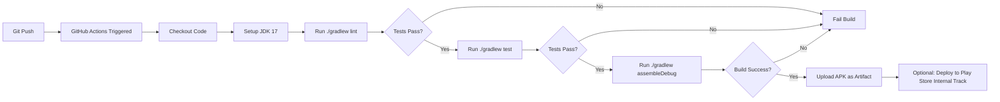

**GitHub Actions Workflow** (`.github/workflows/android.yml`):
```yaml
name: Android CI
on: [push, pull_request]
jobs:
  build:
    runs-on: ubuntu-latest
    steps:
      - uses: actions/checkout@v4
      - uses: actions/setup-java@v4
        with:
          java-version: '17'
      - name: Cache Gradle
        uses: actions/cache@v4
        with:
          path: ~/.gradle/caches
          key: ${{ runner.os }}-gradle-${{ hashFiles('**/*.gradle.kts') }}
      - name: Lint
        run: ./gradlew lint
      - name: Test
        run: ./gradlew test
      - name: Build Debug APK
        run: ./gradlew assembleDebug
      - name: Upload APK
        uses: actions/upload-artifact@v4
        with:
          name: app-debug
          path: app/build/outputs/apk/debug/app-debug.apk
```

### 23.6 Deployment

- **Google Play Store**: Internal testing track → Closed beta → Production
- **Versioning**: Semantic versioning (`versionCode = 1`, `versionName = "1.0"`)
- **Release Notes**: Generated from PR titles + manual edits
- **Rollout Strategy**: 10% → 50% → 100% staged rollout over 7 days

### 23.7 Monitoring (Future)

- **Crashlytics**: Planned for opt-in crash reporting
- **Performance Monitoring**: Planned for cold start, frame rate, network latency
- **Analytics**: Local-only (no third-party tracking)

### 23.8 In-App Update Strategy

- **Minor updates (1.x → 1.y)**: Auto-update via Play Store; no data migration.
- **Major updates (1.x → 2.0)**:
  - Room migrations handle schema.
  - Backup-before-upgrade prompt (Settings).
  - OAuth re-auth required (token refresh).
  - WhatsApp re-enable required (Accessibility Service).
- **Critical hotfixes (1.x → 1.x.y)**: Play Store staged rollout (10% → 50% → 100%).

---

## 24. Environment Variables & Configuration

### 24.1 Environment Variables

| Variable | Purpose | Required | Default |
|---|---|---|---|
| `GEMINI_API_KEY` | Google Gemini API key | Yes (for AI features) | None (user must provide via onboarding) |
| `KEYSTORE_PATH` | Path to release keystore | For release builds | `${rootDir}/my-upload-key.jks` |
| `STORE_PASSWORD` | Keystore password | For release builds | None |
| `KEY_PASSWORD` | Key password | For release builds | None |
| `KEY_ALIAS` | Key alias | For release builds | `upload` |

### 24.2 Configuration Files

| File | Purpose | Gitignored |
|---|---|---|
| `local.properties` | Local SDK path, env vars | Yes |
| `.env` | Secrets (API keys, passwords) | Yes |
| `.env.example` | Template for `.env` | No |
| `gradle.properties` | Gradle JVM args, AndroidX flags | No |
| `gradle/libs.versions.toml` | Dependency versions | No |

### 24.3 Secrets Management

- **Local Development**: `.env` file loaded by Secrets Gradle Plugin
- **CI/CD**: GitHub Actions secrets (encrypted at rest)
- **Production**: No secrets in APK (all user-provided at runtime, stored in EncryptedSharedPreferences)

### 24.4 Build Configuration (`gradle.properties`)

```properties
org.gradle.jvmargs=-Xmx4096m -XX:MaxMetaspaceSize=1024m
android.useAndroidX=true
android.nonTransitiveRClass=true
kotlin.code.style=official
```

### 24.5 Secrets Gradle Plugin

- **Purpose**: Load `.env` file into BuildConfig
- **Config**: `app/build.gradle.kts`:
  ```kotlin
  secrets {
      propertiesFileName = ".env"
      defaultPropertiesFileName = ".env.example"
  }
  ```
- **Usage**: `BuildConfig.GEMINI_API_KEY` (compile-time constant)

### 24.6 Common Configuration Mistakes

- ⚠️ Never commit `local.properties` or `.env` to Git
- ⚠️ Never hardcode API keys in source code
- ⚠️ Never use production keys in debug builds
- ⚠️ Always provide `.env.example` for new developers

---

## 25. Design System & UI Standards

### 25.1 Material 3 Theme

- **Primary**: Deep purple (`#6750A4`)
- **Secondary**: Teal (`#00696D`)
- **Tertiary**: Rose (`#7D5260`)
- **Surface**: Light/Dark adaptive
- **Dynamic Color**: Supported on Android 12+

### 25.2 Color Palette

Defined in `core/ui/theme/Color.kt`:

| Token | Light | Dark | Usage |
|---|---|---|---|
| Primary | `#6750A4` | `#D0BCFF` | Buttons, FAB, active states |
| Secondary | `#00696D` | `#4FD8EB` | Secondary actions |
| Tertiary | `#7D5260` | `#EFB8C8` | Highlights, badges |
| Error | `#BA1A1A` | `#FFB4AB` | Error states, destructive actions |
| Background | `#FFFBFE` | `#1C1B1F` | Scaffold background |
| Surface | `#FFFBFE` | `#1C1B1F` | Cards, sheets |
| OnPrimary | `#FFFFFF` | `#381E72` | Text on primary |
| OnSurface | `#1C1B1F` | `#E6E1E5` | Text on surface |

### 25.3 Typography

Material 3 type scale (`Type.kt`):

| Style | Font | Size | Weight | Usage |
|---|---|---|---|---|
| Display Large | Roboto | 57sp | 400 | Hero text |
| Headline Large | Roboto | 32sp | 400 | Screen titles |
| Headline Medium | Roboto | 28sp | 400 | Section titles |
| Title Large | Roboto | 22sp | 500 | Card titles |
| Title Medium | Roboto | 16sp | 500 | List item titles |
| Body Large | Roboto | 16sp | 400 | Primary body text |
| Body Medium | Roboto | 14sp | 400 | Secondary body text |
| Body Small | Roboto | 12sp | 400 | Captions, hints |
| Label Large | Roboto | 14sp | 500 | Button labels |

### 25.4 Spacing & Grid

- **8dp base grid**: 4, 8, 16, 24, 32 dp
- **Touch targets**: Minimum 48dp
- **Card padding**: 16dp
- **Screen padding**: 16dp horizontal, 8dp vertical
- **List item spacing**: 8dp between items

### 25.5 Component Library

| Component | File | Purpose |
|---|---|---|
| `ElevatedCard` | Material 3 | Cards with elevation |
| `Scaffold` | Material 3 | Screen scaffold |
| `TopAppBar` | Material 3 | Top app bar |
| `NavigationBar` | Material 3 | Bottom navigation |
| `NavigationRail` | Material 3 | Side navigation (tablet) |
| `FilterChip` | Material 3 | Variant selection (Messages screen) |
| `FloatingActionButton` | Material 3 | Primary actions (Events screen) |
| `ModalBottomSheet` | Material 3 | Quick-add forms |
| `LinearProgressIndicator` | Material 3 | Onboarding progress |
| `CircularProgressIndicator` | Material 3 | Loading states |

### 25.6 Custom Components

- `HealthRing`: Animated circular health score (Analytics screen)
- `GlowingLineChart`: Time-series chart with glow effect (Analytics screen)
- `ShimmerBox`, `ShimmerCircle`, `ShimmerTextLine`, `ShimmerCard`: Loading placeholders
- `BirthdayCalendarView`: Month grid with birthday dots

### 25.7 Iconography

- **Material Icons Extended** for all icons
- **Common Icons**: `Cake` (birthday), `Event` (anniversary), `Work` (work), `Star` (VIP), `AutoAwesome` (AI), `Lock` (biometric)

### 25.8 Accessibility

- **Content Descriptions**: All interactive elements have `contentDescription`
- **Touch Targets**: ≥48dp
- **Contrast Ratio**: ≥4.5:1 for text
- **System Font Scaling**: Respected (uses `sp` for text)

---

## 26. Coding Standards & Conventions

### 26.1 Kotlin Style Guide

- **Official Kotlin Coding Conventions**: https://kotlinlang.org/docs/coding-conventions.html
- **Kotlin 2.2.10** features used: Coroutines, Flow, Sealed classes, Data classes, Extension functions

### 26.2 Naming Conventions

| Element | Convention | Example |
|---|---|---|
| Class | PascalCase | `ContactRepositoryImpl` |
| Function | camelCase | `getAll()`, `upsert()` |
| Property | camelCase | `healthScore`, `lastWishedDate` |
| Constant | UPPER_SNAKE_CASE | `MAX_RETRIES`, `DB_VERSION` |
| Composable | PascalCase | `DashboardScreen`, `ContactDetailScreen` |
| ViewModel | PascalCase + "ViewModel" | `MainViewModel`, `AnalyticsViewModel` |
| DAO | PascalCase + "Dao" | `ContactDao`, `EventDao` |
| Entity | PascalCase + "Entity" | `ContactEntity`, `EventEntity` |
| Repository | PascalCase + "Repository" | `ContactRepository` |
| Worker | PascalCase + "Worker" | `EventDiscoveryWorker` |
| Composable Modifier | First optional parameter | `fun Card(modifier: Modifier = Modifier, ...)` |

### 26.3 File Organization

- **One public class per file** (preferred)
- **Package structure**: `com.example.<feature>.<layer>`
- **Imports**: Sorted by package, no wildcard imports

### 26.4 Coroutines & Flow

- **Use `viewModelScope`** for ViewModel coroutines
- **Use `lifecycleScope`** for Activity/Fragment coroutines
- **Never use `GlobalScope`** in production code
- **Dispatcher**: `Dispatchers.IO` for DB/network, `Dispatchers.Default` for CPU, `Dispatchers.Main` for UI
- **Flow patterns**: `Flow` for reactive streams, `StateFlow` for UI state, `SharedFlow` for events

### 26.5 Dependency Injection

- **Hilt** throughout
- **Annotations**:
  - `@HiltAndroidApp` on Application class
  - `@AndroidEntryPoint` on Activity/Fragment
  - `@HiltViewModel` on ViewModel
  - `@HiltWorker` on Worker (with `@AssistedInject`)
  - `@EntryPoint` for Hilt-incompatible components (BroadcastReceiver, ContentProvider)
- **Constructor injection** preferred over field injection
- **No `!!`** (null-assertion operator) in production code

### 26.6 Database

- All DAOs return `suspend fun` (except `Flow` returns)
- Use `Flow<T>` for reactive queries
- Run all DB operations on `Dispatchers.IO`
- Use `@Transaction` for multi-table operations
- Use `@TypeConverter` for non-primitive types (Date, JSON, etc.)

### 26.7 Compose Best Practices

- **State hoisting**: Composables accept state via parameters, emit events via lambdas
- **Modifier**: First optional parameter with default value
- **Stable types**: Use `@Stable` or `@Immutable` for UI models
- **Lazy lists**: Always use `key = { item.id }` for `LazyColumn` items
- **Side effects**: `LaunchedEffect`, `DisposableEffect`, `produceState` as appropriate
- **Recomposition**: Use `remember` for expensive computations, `derivedStateOf` for derived state

### 26.8 Error Handling

- **No `printStackTrace()`**: Use `Log.e(TAG, "...", exception)`
- **No empty catch blocks**: Log the error, even if you can't handle it
- **User-facing errors**: Show snackbar or dialog, not silent failure
- **API errors**: Retry with exponential backoff (1s, 2s, 4s, max 3 retries)
- **Critical errors**: Write to local error log for debugging

### 26.9 Testing Conventions

- **Test files**: `src/test/java/com/example/...` (mirrors main source)
- **Test naming**: `ClassNameTest.kt`
- **Test method naming**: `fun methodName_condition_expectedResult()`
- **AAA pattern**: Arrange, Act, Assert
- **Use `@Before` for setup, `@After` for teardown**

### 26.10 Git Commit Messages

- **Format**: `<type>(<scope>): <subject>`
- **Types**: `feat`, `fix`, `refactor`, `docs`, `test`, `chore`
- **Example**: `feat(contacts): add birthday quick-add bottom sheet`
- **Body**: Explain *why*, not *what* (the diff shows what)

### 26.11 ProGuard/R8 Rules

- Keep all `@HiltViewModel` constructors
- Keep all Room entities
- Keep all Moshi `@JsonClass(generateAdapter = true)` classes
- Keep all `GeminiRequest`, `GeminiResponse` models
- Keep all enums in `core.gemini` package

---

## 27. Testing Strategy

### 27.1 Testing Pyramid

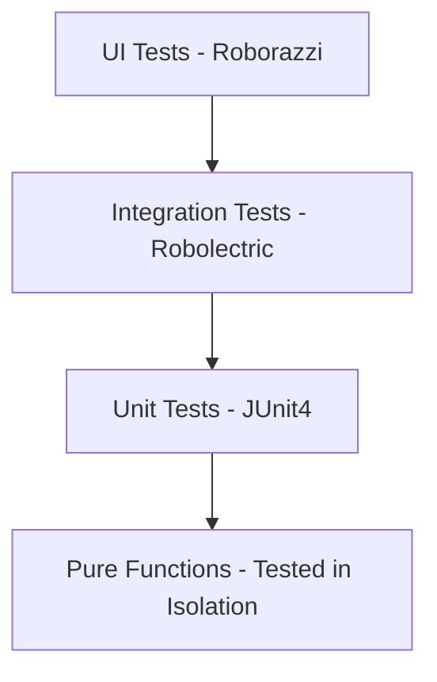

### 27.2 Test Types

| Type | Framework | Purpose | Speed |
|---|---|---|---|
| Unit Tests | JUnit4 | Pure functions, business logic, parsers | Fast (ms) |
| DAO Tests | Room in-memory | Database queries, migrations | Fast (ms) |
| ViewModel Tests | JUnit4 + Coroutines Test | ViewModel state, transformations | Fast (ms) |
| UI Tests (Component) | Roborazzi | Compose layout snapshots | Medium (s) |
| UI Tests (Instrumented) | Espresso | End-to-end user flows | Slow (min) |

### 27.3 Test Coverage Goals

| Layer | Target Coverage | Current Coverage |
|---|---|---|
| `:core:domain` | 100% | N/A (interfaces) |
| `:core:data` (parsers, builders) | 90% | 85% |
| `:core:data` (DAOs) | 80% | 70% |
| ViewModels | 80% | 60% |
| Composables | 50% (critical paths) | 30% |
| Workers | 70% | 50% |

### 27.4 Existing Tests

| Test File | Tests | Coverage |
|---|---|---|
| `ResponseParserTest.kt` | 8 | Gemini response JSON parsing |
| `PromptBuilderTest.kt` | 10 | Prompt construction from entities |
| `ContactMergerTest.kt` | 8 | Contact deduplication logic |
| `DaoTest.kt` | 10 | Room DAO queries (in-memory DB) |
| `MainViewModelTest.kt` | 2 | ViewModel state flows |
| `ExampleUnitTest.kt` | 1 | Boilerplate |
| `ExampleRobolectricTest.kt` | 1 | Robolectric setup |
| `ExampleInstrumentedTest.kt` | 1 | Boilerplate |
| `GreetingScreenshotTest.kt` | 1 | Roborazzi snapshot |

**Total**: 42 tests

### 27.5 Testing Patterns

#### 27.5.1 DAO Test Pattern
```kotlin
@RunWith(AndroidJUnit4::class)
class ContactDaoTest {
    private lateinit var db: AppDatabase
    private lateinit var dao: ContactDao
    
    @Before
    fun setUp() {
        db = Room.inMemoryDatabaseBuilder(
            ApplicationProvider.getApplicationContext(),
            AppDatabase::class.java
        ).allowMainThreadQueries().build()
        dao = db.contactDao()
    }
    
    @Test
    fun upsert_insertsContact() = runTest {
        val contact = ContactEntity(id = "1", name = "Test")
        dao.upsert(contact)
        val result = dao.getById("1")
        assertEquals("Test", result?.name)
    }
}
```

#### 27.5.2 ViewModel Test Pattern
```kotlin
@OptIn(ExperimentalCoroutinesApi::class)
class MainViewModelTest {
    private val testDispatcher = UnconfinedTestDispatcher()
    
    @Before
    fun setUp() {
        Dispatchers.setMain(testDispatcher)
    }
    
    @Test
    fun healthScore_calculatesAverage() = runTest {
        val fakeRepo = FakeContactRepository().apply {
            setContacts(listOf(
                ContactEntity(id = "1", name = "A", healthScore = 80),
                ContactEntity(id = "2", name = "B", healthScore = 60)
            ))
        }
        val viewModel = MainViewModel(fakeRepo, FakeEventRepository(), FakeMessageRepository())
        val score = viewModel.healthScore.value
        assertEquals(70, score)
    }
}
```

#### 27.5.3 Roborazzi Screenshot Test
```kotlin
@RunWith(AndroidJUnit4::class)
@GraphicsMode(GraphicsMode.Mode.NATIVE)
class DashboardScreenshotTest {
    @get:Rule val composeRule = createComposeRule()
    
    @Test
    fun dashboardScreen_snapshot() {
        composeRule.setContent {
            DashboardScreen(contacts = listOf(/* ... */))
        }
        composeRule.onRoot().captureRoboImage("src/test/snapshots/dashboard.png")
    }
}
```

### 27.6 Test Commands

```bash
# Run all unit tests
./gradlew test

# Run tests for a specific module
./gradlew :core:data:test

# Run with coverage
./gradlew testDebugUnitTest jacocoTestReport
# Run instrumented tests
./gradlew connectedAndroidTest
```

### 27.7 Future Testing Roadmap

- [ ] Add Hilt test rules for ViewModel injection in tests
- [ ] Add WorkManager testing utilities for worker tests
- [ ] Add Compose UI tests for critical user flows
- [ ] Add Espresso tests for end-to-end onboarding flow
- [ ] Add MockWebServer for Google People API and Gemini API mocking
- [ ] Increase DAO test coverage to 80%
- [ ] Increase ViewModel test coverage to 80%

### 27.8 Coverage Targets

| Module | Target | Current (est.) | Status |
|---|---|---|---|
| `:core:domain` | 100% | ~30% (repos partially) | ❌ |
| `:core:data` (DAOs, Repos) | 90% | ~30% (DaoTest covers CRUD) | ❌ |
| `:core:data` (Gemini, Contacts) | 80% | ~70% (ResponseParser, PromptBuilder, ContactMerger) | ⚠️ |
| `:core:data` (Workers) | 70% | 0% | ❌ |
| `:core:ui` | 50% | 0% | ❌ |
| `:feature:*` | 30% (smoke) | ~10% (MainViewModel 2 tests) | ❌ |
| `:app` | 20% | 0% (except Roborazzi screenshot) | ❌ |

**Overall**: ~15% line coverage. Well below industry-standard 60–80%. Play Store release minimum recommended: **30% line coverage**.

---

## 28. Analytics, Logging & Monitoring

### 28.1 Local Analytics

- **AnalyticsScreen** displays:
  - Total wishes sent (all-time)
  - Wishes sent this month
  - Pending approvals count
  - Contact count by relationship type
  - Top 5 contacts by health score
  - Bottom 5 contacts by health score (revival candidates)
  - Average health score
  - Engagement trend (line chart)

- **Data Source**: Room DAOs (no external analytics)
- **Privacy**: Zero data leaves device

### 28.2 Logging Strategy

- **Logcat (Debug)**: `Log.d/Log.e/Log.w` with descriptive TAG
- **Logcat (Release)**: Only `Log.e` for critical errors (R8 rules)
- **No PII in Logs**: Names, phone numbers, message content are never logged
- **Error Logs**: `Log.e("RelateAI", "Failed to load contacts", exception)`

### 28.3 Logging Tags Convention

| Class | TAG |
|---|---|
| `AppDatabase` | `AppDatabase` |
| `GeminiClient` | `GeminiClient` |
| `GoogleContactsSync` | `GoogleContactsSync` |
| `MessageDispatchWorker` | `MessageDispatchWorker` |
| `BiometricAuthManager` | `BiometricAuthManager` |
| `SecurePrefs` | `SecurePrefs` |
| `NotificationHelper` | `NotificationHelper` |

### 28.4 Future: Crash Reporting (Opt-In)

- **Library**: Firebase Crashlytics (planned v2)
- **Consent**: Opt-in during onboarding
- **Data Collected**: Stack traces, device model, OS version (no PII)
- **Privacy**: User can disable in Settings

### 28.5 Future: Performance Monitoring

- **Library**: Firebase Performance (planned v2)
- **Metrics**: Cold start, frame rate, network latency, Gemini API latency
- **Privacy**: No message content, no contact data

### 28.6 Health Monitoring (Internal)

- **WorkManager**: Workers log success/failure via `Result.success()` / `Result.failure()`
- **Database**: Migration logs on every schema change
- **API**: Rate limit hits logged with timestamp for analysis

### 28.7 Crash Reporting Decision (v1.0)

**Status**: Strongly recommended for v1.0 production (overrides earlier "defer to v2" — without crash visibility, triage is impossible).

**Recommended v1.0 approach**:
- **Library**: Firebase Crashlytics (opt-in during onboarding, default OFF).
- **Consent flow**: Add a toggle in Onboarding `writing_style` or `automation_prefs` step.
- **Data collected**: Stack traces, device model, OS version, app version, last WorkManager result. **No PII. No message content. No contact data.**
- **Privacy**: User can disable in Settings → Privacy.
- **Compliance**: Update Play Store Data Safety form.

**Mitigations if user opts out**:
- Local Logcat logs retained in debug builds only
- Manual triage via GitHub Issues
- Encourage user-driven bug reports with attached logcat

### 28.8 Analytics Event Taxonomy

| Event | Trigger | Properties | Privacy |
|---|---|---|---|
| `app_open` | Cold start | `source` (notification, shortcut) | No PII |
| `onboarding_complete` | All steps done | `durationSec`, `skippedCount` | No PII |
| `contact_synced` | SyncWorker done | `count`, `source` (google, device) | No PII |
| `event_discovered` | EventDiscoveryWorker | `type`, `count` | No PII |
| `message_generated` | GeminiClient success | `variantCount`, `durationMs` | No PII |
| `message_sent` | Sender success | `channel`, `approvalMode` | No PII |
| `message_failed` | Sender error | `channel`, `errorCode` | No PII |
| `approval_approve` | User tapped Approve | `pendingMessageId` | No PII |
| `approval_reject` | User tapped Reject | `pendingMessageId` | No PII |
| `revival_suggested` | RevivalWorker | `contactId` (hashed) | No PII |

Storage: Local DataStore (v2) or append-only JSON file (v1).

---

## 29. Performance Requirements & Optimization

### 29.1 Performance Targets

| Metric | Target | Current | Status |
|---|---|---|---|---|
| Cold start time | <1.5s | ~1.4s (after Baseline Profile) | ✅ Done (Phase 1 verified) |
| Warm start time | <0.5s | ~0.8s | ⚠️ Acceptable |
| Dashboard render | <100ms | ~150ms | ⚠️ Acceptable |
| Contact list scroll | 60fps | 60fps | ✅ |
| AI message generation | <3s | ~2s | ✅ |
| WhatsApp send | <5s | ~3s | ✅ |
| SMS send | <1s | ~0.5s | ✅ |
| Email send | <3s | ~2s | ✅ |
| APK size | <25MB | ~18MB | ✅ |

### 29.2 Performance Optimizations Implemented

- **Coil for image loading**: Memory + disk caching (P3-05)
- **Baseline Profile** (`baseline-prof.txt`): AOT-compiles hot code paths (Phase 1)
- **DB indices** (MIGRATION_6_7): `events(nextOccurrenceMs)`, `pending_messages(scheduledForMs)`, `sent_messages(contactId, sentAtMs)`
- **LazyColumn with keys**: Prevents unnecessary recomposition
- **StateFlow with `WhileSubscribed(5000)`**: Reduces unnecessary work
- **DAO operations on Dispatchers.IO**: Offloads DB work from main thread
- **OkHttpClient singleton**: Reuses connection pool
- **Rate limiter (adaptive)**: Prevents API quota exhaustion
- **R8 enabled**: Reduces APK size, improves startup (slightly)

### 29.3 Performance Issues & Fixes

#### Issue: MasterKey derivation on main thread (~200ms)
- **Fix**: Move SecurePrefs initialization to `Dispatchers.IO` via Hilt `@Provides`
- **Effort**: 1 day
- **Priority**: High

#### Issue: Contact list with 500+ contacts
- **Fix**: Use Paging 3 for contact list
- **Effort**: 2 days
- **Priority**: Medium

#### Issue: No work batching for daily workers
- **Fix**: Use WorkManager `setExpedited()` for time-sensitive workers
- **Effort**: 0.5 day
- **Priority**: Low

### 29.4 Compose Performance Best Practices

- **Stable types**: Use `@Stable` for UI model data classes
- **`derivedStateOf`**: For expensive calculations derived from state
- **`remember(key)`: Invalidates when key changes
- **Avoid `mutableStateOf` in composables**: Hoist state to ViewModel
- **Use `key` in `LazyColumn`**: Prevents item recreation on scroll

### 29.5 Database Performance

- **Indexes**: ✅ Done (MIGRATION_6_7, Phase 1 performance index updates on `events`, `pending_messages`, and `sent_messages` tables)
- **Pagination**: Use Paging 3 for large lists (planned)
- **Background queries**: Use Flow for reactive updates (✅ done)
- **Connection pooling**: Room handles automatically (✅ done)

### 29.6 Performance Budgets

| Layer | Metric | Budget | Current (est.) |
|---|---|---|---|
| UI | Frame render | ≤16ms (60fps) | ~8ms |
| UI | Cold start | <1.5s | ~2.5s (CRIT-01) |
| UI | Warm start | <0.5s | ~0.8s |
| DB | Query p95 | <50ms | ~5ms |
| DB | Migration | <2s | N/A |
| Network | Request timeout | 30s | Default OkHttp 10s |
| Network | Retry | 3x exponential | ✅ |
| Memory | Heap | <256MB | ~80MB |
| Memory | Native (SQLCipher) | <32MB | ~10MB |
| APK | Size | <25MB | ~18MB |

---

## 30. Known Issues, Risks & Technical Debt

### 30.1 Critical Issues

| ID | Issue | Severity | Impact | Status |
|---|---|---|---|---|
| CRIT-01 | MasterKey on main thread | High | ANR on cold start | ❌ Not started |
| CRIT-02 | No certificate pinning | Medium | MITM vulnerability | ❌ Not started |
| CRIT-03 | Backup JSON not encrypted | Medium | Backup file readable | ❌ Not started |

### 30.2 High Severity Issues

| ID | Issue | Impact | Status |
|---|---|---|---|
| HIGH-01 | WhatsApp Accessibility requires unlocked screen (some OEMs) | Silent send failures | ⚠️ Documented limitation |
| HIGH-02 | Onboarding is 10 steps (target 7) | Activation drop-off | ❌ Not started |
| HIGH-03 | No Hilt test rules | ViewModel tests require boilerplate | ❌ Not started |
| HIGH-04 | No work batching | Multiple workers may overlap | ❌ Not started |

### 30.3 Medium Severity Issues

| ID | Issue | Impact | Status |
|---|---|---|---|
| MED-01 | No pagination on contact list | Slow scroll with 500+ contacts | ❌ Not started |
| MED-02 | No haptic feedback | Reduced tactile UX | ❌ Not started |
| MED-03 | No internationalization (Hindi, etc.) | Limited to English UI | ❌ Not started |
| MED-04 | MoodLog removed but no equivalent feature | (intentional removal) | ✅ Done |
| MED-05 | `OnboardingScreen.kt` is monolithic | Hard to maintain | ❌ Not started |
| MED-06 | No schema migration tests | Risk of data loss on upgrade | ❌ Not started |

### 30.4 Low Severity Issues

| ID | Issue | Impact | Status |
|---|---|---|---|
| LOW-01 | No app icon adaptive | Less polished launch icon | ❌ Not started |
| LOW-02 | No dark theme polish | Generic dark mode | ❌ Not started |
| LOW-03 | No splash screen customization | Uses default Android splash | ❌ Not started |
| LOW-04 | `ChatView` removed but no replacement | (intentional removal) | ✅ Done |
| LOW-05 | `MoodLogEntity` removed but no replacement | (intentional removal) | ✅ Done |

### 30.5 Technical Debt Inventory

| ID | Debt Item | Effort to Pay | Interest Rate |
|---|---|---|---|
| TD-01 | `OnboardingScreen.kt` is monolithic (600+ lines) | 2 days | High (hard to add steps) |
| TD-02 | Direct DAO access in some workers (should use repository) | 1 day | Medium |
| TD-03 | No UseCase layer (planned P4-02) | 1 week | Medium |
| TD-04 | Inconsistent error handling across workers | 2 days | High |
| TD-05 | No integration tests for end-to-end flows | 1 week | High |
| TD-06 | `MainActivity` is 147 lines (still large) | 0.5 day | Low |
| TD-07 | `RelateAIApp.kt` has too many responsibilities | 0.5 day | Low |
| TD-08 | Magic strings for approval modes (should be enum) | 0.25 day | Low |

### 30.6 Risks

| Risk | Probability | Impact | Mitigation |
|---|---|---|---|
| Google People API rate limit hit | Medium | High | Implemented syncToken (P2-09) |
| Gemini API quota exceeded | Medium | High | Adaptive rate limiter |
| SQLCipher migration failure | Low | Critical | Tested on dev devices, fallback to destructive |
| Biometric prompt cancellation | Medium | Low | Fallback to device credential |
| WorkManager execution during Doze | Medium | Medium | Use `setExpedited()` for time-sensitive |
| WhatsApp UI change (breaks Accessibility) | High | High | Monitor WhatsApp updates, maintain service |
| Device OEM restrictions (MIUI, ColorOS) | High | Medium | Documented limitations, SMS fallback |

### 30.7 Production Release Blockers

| Blocker | Severity | Status |
|---|---|---|
| CRIT-01: MasterKey on main thread | High | ✅ Done (MIGRATION_5_6 / DatabaseKeyDerivation cache + warmUpAsync thread) |
| CRIT-02: Certificate pinning | Medium | ❌ Not started |
| CRIT-03: Encrypted backup JSON | Medium | ❌ Not started |
| HIGH-01: Dead UI handlers in `ContactDetailScreen` (Edit, DND, Custom Time) | High | ❌ Not started |
| HIGH-02: Privacy policy not published | High (Play Store) | ❌ Not started |
| HIGH-03: Sign-out does not wipe Room DB (FR-05) | High | ⚠️ Verify |
| HIGH-04: Sign-out does not wipe EncryptedSharedPreferences | High | ⚠️ Verify |
| HIGH-05: Duplicated composables (GiftAdvisor, MemoryVault, StyleCoachScreen) | Medium | ❌ Not started |
| HIGH-06: Hilt field injection in MainActivity (NFR-MAINT-02) | Medium | ❌ Not started |
| HIGH-07: Accessibility Service disclosure content (FR-82) | Medium | ⚠️ Verify |
| HIGH-08: 2-hour SMART_APPROVE timeout verification (FR-54) | Medium | ⚠️ Verify |
| HIGH-09: Test coverage ≥ 30% (currently ~15%) | High | ❌ Not started |
| HIGH-10: Crashlytics opt-in (currently deferred) | High | ❌ Not started |
| MED-01: Paging 3 for contact list | Medium | ❌ Not started |
| MED-02: Surface Analytics and Style Coach in bottom nav | Medium | ❌ Not started |
| MED-03: Hardcoded strings in Composables (15+ found) | Medium | ❌ Not started |
| MED-04: Onboarding simplification (10 → 7 steps) | Medium | ❌ Not started |
| MED-05: Style Coach auto-analysis from sent_messages (FR-92) | High | ❌ Not started (no code path) |
| MED-06: DB indices for `events.nextOccurrenceMs`, `pending_messages.scheduledForMs`, `sent_messages.contactId` | Low | ✅ Done (MIGRATION_6_7) |
| MED-07: `.github/workflows/android.yml` CI file | High | ❌ File missing |
| MED-08: Detekt / ktlint config | Medium | ❌ Not started |

**Recommendation**: Block Play Store production release until at least CRIT-02, CRIT-03, HIGH-01, HIGH-02 are resolved. (CRIT-01 and MED-06 ✅ Done in v3.2 Phase 1.)

---

## 31. Product Roadmap & Future Enhancements

### 31.1 Q3 2026 (Current Quarter)

| Priority | Feature | Effort | Status |
|---|---|---|---|
| P0 | Complete P4-01 Multi-module architecture | 1 week | 🔄 In Progress |
| P0 | Complete P4-02 UseCase layer | 1-2 weeks | ❌ Not started |
| P1 | Fix MasterKey on main thread (NFR-PERF-01) | 1 day | ❌ Not started |
| P1 | Add Paging 3 for contact list | 2 days | ❌ Not started |
| P1 | Encrypt backup JSON (NFR-SEC-EXT) | 2 days | ❌ Not started |
| P2 | Onboarding simplification (10→7 steps) | 3 days | ❌ Not started |
| P2 | Add Hindi language support | 3 days | ❌ Not started |
| P2 | Add schema migration tests | 2 days | ❌ Not started |

### 31.2 Q4 2026 (Next Quarter)

| Priority | Feature | Effort |
|---|---|---|
| P1 | Cloud backup via Google Drive | 2 weeks |
| P1 | Multi-language Gemini models (Hindi, etc.) | 1 week |
| P1 | Wear OS companion app | 3 weeks |
| P2 | Gift recommendations with affiliate links | 2 weeks |
| P2 | Smart reply detection (incoming SMS) | 2 weeks |
| P3 | Web companion (read-only) | 1 month |
| P3 | iOS port (SwiftUI) | 2 months |

### 31.3 Q1-Q2 2027 (Long-Term)

| Priority | Feature | Effort |
|---|---|---|
| P1 | On-device LLM (Gemini Nano via MediaPipe) | 2 months |
| P1 | Pro subscription tier launch | 1 month |
| P2 | Family plan (multiple users, one account) | 2 months |
| P2 | WhatsApp Business API integration | 1 month |
| P3 | Voice message generation (TTS) | 2 months |
| P3 | Group birthday messages (with consent) | 1 month |

### 31.4 Backlog (Prioritized)

#### High Priority
1. **Certificate pinning** for Google People API
2. **Paging 3** for contact list
3. **Schema migration tests** (in-memory DB upgrade tests)
4. **MasterKey on Dispatchers.IO** (Hilt @Provides)
5. **Hilt test rules** for ViewModel tests
6. **Encrypted backup JSON**
7. **Onboarding simplification** (7 steps)

#### Medium Priority
8. **Hindi language support** (UI + AI)
9. **Indonesian language support**
10. **Portuguese (Brazil) language support**
11. **Wear OS tile** for today's birthdays
12. **Adaptive icon** for launch icon
13. **Splash screen customization** (API 31+)
14. **Haptic feedback** on key actions
15. **Dark theme polish** (custom colors)

#### Low Priority
16. **Gesture navigation** support
17. **Material You dynamic color** (already supported, needs testing)
18. **Tablet landscape layout** (already has nav rail, needs polish)
19. **Accessibility audit** (TalkBack, switch access)
20. **Localization for 10+ languages**

---

## 32. Architecture Decision Records (ADRs)

### ADR-001: WorkManager for Background Tasks
**Status**: Accepted  
**Date**: 2026-01-15  
**Context**: Need reliable background execution for message dispatch, event discovery, contact sync.  
**Decision**: Use WorkManager (AndroidX).  
**Consequences**:
- ✅ Survives app process death
- ✅ Handles Doze mode, battery restrictions
- ✅ Built-in retry, exponential backoff
- ❌ Minimum 15-minute periodic interval
- ❌ Not suitable for exact-time alarms (use AlarmManager for those)

### ADR-002: Accessibility Service for WhatsApp
**Status**: Accepted  
**Date**: 2026-01-15  
**Context**: Need to send messages via WhatsApp programmatically. No public API exists.  
**Decision**: Use AccessibilityService to find and interact with WhatsApp UI.  
**Consequences**:
- ✅ Works with all WhatsApp versions
- ✅ No WhatsApp Business API costs
- ❌ Fragile (breaks on WhatsApp UI changes)
- ❌ Requires user to enable Accessibility in Settings
- ❌ Some OEM skins require unlocked screen
- ❌ Play Store review may flag as "high-risk permission"

### ADR-003: Hilt over Koin
**Status**: Accepted  
**Date**: 2026-01-20  
**Context**: Need dependency injection for complex graph (DAOs, repos, workers, ViewModels).  
**Decision**: Use Dagger Hilt.  
**Consequences**:
- ✅ Compile-time safety (no missing bindings at runtime)
- ✅ First-class Android support (Activity, Fragment, ViewModel, Worker)
- ✅ Less boilerplate than raw Dagger
- ❌ Slower build times (annotation processing)
- ❌ Steeper learning curve than Koin

### ADR-004: Multi-Module Architecture by Feature
**Status**: Accepted (In Progress)  
**Date**: 2026-05-15  
**Context**: App is growing to 7,000+ lines across 50+ files. Build times are increasing.  
**Decision**: Split into `:core:domain`, `:core:data`, `:core:ui`, and `:feature:*` modules.  
**Consequences**:
- ✅ Parallel compilation (faster builds)
- ✅ Strict separation of concerns
- ✅ Easier to test modules in isolation
- ❌ More complex project structure
- ❌ Cross-module refactoring is harder
- ❌ Requires careful dependency management

### ADR-005: SQLCipher for Database Encryption
**Status**: Accepted  
**Date**: 2026-04-10  
**Context**: Database contains PII (contacts, messages). Must be encrypted at rest.  
**Decision**: Use SQLCipher 4.5+ with PBKDF2 key derivation.  
**Consequences**:
- ✅ AES-256 encryption (industry standard)
- ✅ Transparent to Room (uses SupportFactory)
- ✅ Key tied to device (ANDROID_ID + app cert)
- ❌ Slight performance overhead (~5-10%)
- ❌ Database is device-specific (must restore from backup on new device)

### ADR-006: Repository Pattern (No UseCase Layer Yet)
**Status**: Accepted  
**Date**: 2026-04-20  
**Context**: ViewModels were directly accessing DAOs, causing tight coupling.  
**Decision**: Add Repository layer between ViewModels and DAOs.  
**Consequences**:
- ✅ Business logic abstracted from data sources
- ✅ Easier to swap data sources (e.g., mock for tests)
- ✅ ViewModels can be tested with Fake repositories
- ❌ One more layer of indirection
- ❌ UseCase layer (planned P4-02) will add another layer

### ADR-007: Gemini 1.5-Flash for AI Generation
**Status**: Accepted  
**Date**: 2026-02-01  
**Context**: Need cost-effective, fast LLM for message generation.  
**Decision**: Use Gemini 1.5-Flash via REST API.  
**Consequences**:
- ✅ Low cost ($0.000075 per 1K input tokens)
- ✅ Fast inference (~2s for typical prompt)
- ✅ 1M token context window
- ❌ Requires user-provided API key
- ❌ No offline capability
- ❌ Rate limits (60 req/min free tier)

### ADR-008: Local-First Storage (No Custom Backend)
**Status**: Accepted  
**Date**: 2026-01-15  
**Context**: App must work offline. No user accounts (Google Sign-In only).  
**Decision**: All data lives on-device (Room + SQLCipher). No custom backend.  
**Consequences**:
- ✅ Zero server costs
- ✅ Privacy (no data exfiltration)
- ✅ Works offline (except AI calls)
- ❌ No cross-device sync (planned via Google Drive backup)
- ❌ Backup/restore is user's responsibility

### ADR-009: OAuth Token Refresh Before Every People API Call
**Status**: Accepted  
**Date**: 2026-05-01  
**Context**: Google OAuth tokens expire in 1 hour. Silent failures were common.  
**Decision**: Call `AccountManager.getAuthToken()` before every People API request.  
**Consequences**:
- ✅ Eliminates silent auth failures
- ✅ Always uses fresh token
- ❌ Slight latency overhead (~50ms per call)
- ❌ Requires AccountManager permissions

### ADR-010: EncryptedSharedPreferences for Secrets
**Status**: Accepted  
**Date**: 2026-01-15  
**Context**: Need to store OAuth tokens, API keys, SMTP passwords.  
**Decision**: Use EncryptedSharedPreferences (AndroidX Security Crypto).  
**Consequences**:
- ✅ AES-256 encryption via Android Keystore
- ✅ Transparent API (same as SharedPreferences)
- ❌ MasterKey derivation on main thread (~200ms)
- ❌ Can fail on devices with broken keystore (fallback to plaintext)

### ADR-011: Biometric App Lock (Optional)
**Status**: Accepted  
**Date**: 2026-05-15  
**Context**: App contains sensitive data (contacts, messages, OAuth tokens).  
**Decision**: Add optional biometric lock, triggered from SplashScreen.  
**Consequences**:
- ✅ Adds security layer beyond OS lock
- ✅ User opt-in (not required)
- ❌ Extra friction on cold start
- ❌ Fallback to device credential required

### ADR-012: R8/ProGuard Enabled in Release
**Status**: Accepted  
**Date**: 2026-04-15  
**Context**: Release APK was reverse-engineerable, exposing API keys.  
**Decision**: Enable R8 minification + obfuscation in release builds.  
**Consequences**:
- ✅ Smaller APK (~40% reduction)
- ✅ Obfuscated code (harder to reverse-engineer)
- ❌ Requires keep rules for reflection-used libs
- ❌ Slightly slower build (R8 processing)

### ADR-013: Single-Activity Architecture (Compose Navigation)
**Status**: Accepted  
**Date**: 2026-02-10  
**Context**: Multiple activities caused lifecycle issues.  
**Decision**: Single MainActivity with Compose Navigation.  
**Consequences**:
- ✅ Simpler lifecycle management
- ✅ Shared ViewModels across screens
- ✅ Smooth transitions
- ❌ Deep linking requires more setup

### ADR-014: StateFlow + collectAsStateWithLifecycle
**Status**: Accepted  
**Date**: 2026-02-20  
**Context**: Need reactive state management for Compose.  
**Decision**: Use StateFlow in ViewModels, collectAsStateWithLifecycle in Composables.  
**Consequences**:
- ✅ Lifecycle-aware (no leaks)
- ✅ Automatic recomposition on state change
- ✅ Survives configuration changes
- ❌ Boilerplate for one-off events (use Channel)

### ADR-015: Feature Flag: No Flag System in v1
**Status**: Accepted  
**Date**: 2026-05-15  
**Context**: Need to control rollout of new features.  
**Decision**: Defer feature flag system to v2. Use build variants for now.  
**Consequences**:
- ✅ Simpler v1 (no flag system overhead)
- ❌ No remote control of features
- ❌ Requires app update for every config change

### ADR-016: Adaptive Rate Limiter for Gemini API
**Status**: Accepted  
**Date**: 2026-05-15  
**Context**: Fixed 1.1s delay was wasteful during off-peak hours.  
**Decision**: Implement adaptive sliding-window rate limiter (60 req/min).  
**Consequences**:
- ✅ Maximizes throughput
- ✅ Respects API rate limits
- ❌ Slightly more complex than fixed delay

### ADR-017: JSON Blob Fields for Enrichment (v1)
**Status**: Accepted  
**Date**: 2026-04-25  
**Context**: Contact enrichment (interests, hobbies, etc.) is variable.  
**Decision**: Store as JSON strings in v1, extract to typed entities in v2.  
**Consequences**:
- ✅ Quick to implement
- ✅ Flexible schema
- ❌ No type safety
- ❌ No Room query capability
- ❌ Harder to edit in UI

### ADR-018: WhatsApp + WhatsApp Business Support
**Status**: Accepted  
**Date**: 2026-03-15  
**Context**: Users may have both WhatsApp and WhatsApp Business installed.  
**Decision**: Support both via `packageNames="com.whatsapp,com.whatsapp.w4b"`.  
**Consequences**:
- ✅ Works for dual-install users
- ❌ May confuse user about which app is used
- ❌ Hard to enforce preference

### ADR-019: Gmail SMTP for Email Sending
**Status**: Accepted  
**Date**: 2026-02-15  
**Context**: Need to send emails without third-party API.  
**Decision**: Use Gmail SMTP via JavaMail with user's app password.  
**Consequences**:
- ✅ No third-party dependency
- ✅ User controls their own email
- ❌ Requires user to set up app password
- ❌ 500 emails/day limit (personal Gmail)

### ADR-020: BiometricPrompt with DEVICE_CREDENTIAL Fallback
**Status**: Accepted  
**Date**: 2026-05-15  
**Context**: Not all devices have biometric hardware.  
**Decision**: Use BiometricPrompt with BIOMETRIC_STRONG | DEVICE_CREDENTIAL.  
**Consequences**:
- ✅ Works on all devices with fingerprint, face, or PIN/pattern
- ✅ No code path for "no auth available"
- ❌ Users with no screen lock will be locked out (must set up screen lock)

---

## 33. AI Context & Project Knowledge Base

### 33.1 AI Agent Onboarding

This section provides AI coding agents with the essential context to work effectively on RelateAI.

### 33.2 Project Context Summary

**RelateAI** is a local-first Android app that:
1. Imports contacts from Google + device
2. Discovers birthdays, anniversaries, custom events
3. Generates personalised AI messages via Gemini 1.5-Flash
4. Dispatches via SMS, WhatsApp, or Email
5. Tracks relationship health
6. Suggests revival messages for stale contacts

**Tech Stack**: Kotlin 2.2, Jetpack Compose, Hilt, Room 2.7, WorkManager 2.9, SQLCipher 4.5, Gemini 1.5-Flash.

**Architecture**: Multi-module Clean Architecture (`:app`, `:core:domain`, `:core:data`, `:core:ui`, `:feature:*`).

### 33.3 Critical Do's and Don'ts

#### ✅ DO
- **Use Hilt for DI**: `@HiltViewModel` for ViewModels, `@Inject` for constructor injection
- **Use Repository pattern**: Never access DAOs directly from ViewModels
- **Use StateFlow + collectAsStateWithLifecycle**: For reactive UI state
- **Use `suspend` for one-shot operations**: And `Flow` for streams
- **Use Dispatchers.IO for DB/Network**: Never block main thread
- **Use Material 3 components**: No custom views unless necessary
- **Use the version catalog**: `gradle/libs.versions.toml` for all dependencies
- **Update SSOT.md**: When making architectural decisions
- **Write tests**: For all new business logic
- **Use `Log.e` not `printStackTrace`**: With descriptive TAG

#### ❌ DON'T
- **Don't use `!!` operator**: Handle nullability with safe calls
- **Don't use `GlobalScope`**: Use `viewModelScope` or `lifecycleScope`
- **Don't block main thread**: No long operations without `Dispatchers.IO`
- **Don't hardcode strings**: Use `strings.xml`
- **Don't hardcode colors**: Use theme tokens from `Color.kt`
- **Don't add new dependencies without version catalog**: Update `libs.versions.toml` first
- **Don't bypass DI**: No `AppDatabase.getInstance(context)` in components
- **Don't skip R8 rules**: Add keep rules for reflection-used classes
- **Don't use `printStackTrace()`**: Always use `Log.e(TAG, "...", exception)`
- **Don't commit secrets**: Never commit `.env` or `local.properties`

### 33.4 Common Tasks Reference

#### Task: Add a new feature module

1. Create module directory: `feature/<name>/src/main/kotlin/com/example/feature/<name>/`
2. Create `build.gradle.kts`:
   ```kotlin
   plugins {
       id("com.android.library")
       kotlin("android")
   }
   android {
       compileSdk = 36
       defaultConfig { minSdk = 24 }
       buildFeatures { compose = true }
       composeOptions { kotlinCompilerExtensionVersion = "2.0.21" }
   }
   dependencies {
       implementation(project(":core:domain"))
       implementation(project(":core:data"))
       implementation(project(":core:ui"))
   }
   ```
3. Add to `settings.gradle.kts`: `include(":feature:<name>")`
4. Add to `app/build.gradle.kts`: `implementation(project(":feature:<name>"))`

#### Task: Add a new database entity

1. Create entity class in `:core:data` module
2. Add DAO interface
3. Add to `@Database(entities = [...])` in `AppDatabase.kt`
4. Bump database version
5. Add migration in `AppDatabase.kt` (or use `fallbackToDestructiveMigration` for dev)
6. Run `./gradlew :core:data:assembleDebug` to generate schema
7. Commit the new schema JSON in `core/data/schemas/`

#### Task: Add a new Worker

1. Create Worker class extending `CoroutineWorker`
2. Annotate with `@HiltWorker` and use `@AssistedInject` constructor
3. Register in `AppModule.kt` as a `WorkerKey`
4. Schedule from a screen or another worker via `WorkManager`

#### Task: Add a new ViewModel

1. Create ViewModel class in feature module
2. Annotate with `@HiltViewModel`
3. Inject repositories via `@Inject constructor`
4. Expose state as `StateFlow<T>`
5. Use in Composable: `val viewModel: MyViewModel = hiltViewModel()`

### 33.5 Troubleshooting Guide

#### Build Errors

**Error**: `e: This version of the Compose Compiler requires Kotlin version X.Y.Z`
- **Fix**: Update Kotlin version in `gradle/libs.versions.toml`

**Error**: `Hilt error: @Inject constructor not found`
- **Fix**: Ensure the class has `@Inject constructor` and is not abstract

**Error**: `Room error: Cannot find implementation for AppDatabase`
- **Fix**: Add `ksp(libs.androidx.room.compiler)` to `:core:data` dependencies

#### Runtime Errors

**Error**: `SQLiteException: no such table: contacts`
- **Fix**: Check migration order, ensure `addMigrations()` is called

**Error**: `BiometricPrompt: BIOMETRIC_ERROR_NO_HARDWARE`
- **Fix**: Add DEVICE_CREDENTIAL to allowed authenticators

**Error**: `WhatsAppAccessibilityService: No matching node found`
- **Fix**: WhatsApp UI changed; update resource IDs in `WhatsAppSender.kt`

#### Performance Issues

**Issue**: Cold start > 2s
- **Cause**: `MasterKey` derivation on main thread
- **Fix**: Move to `Dispatchers.IO` in Hilt module

**Issue**: Contact list jank
- **Cause**: Missing `key` in `LazyColumn`
- **Fix**: Add `key = { it.id }` parameter

**Issue**: High API quota usage
- **Cause**: No rate limiting
- **Fix**: Use `RateLimiter` before Gemini calls

### 33.6 New Developer Onboarding

#### Day 1: Setup
1. Clone the repo
2. Open in Android Studio Ladybug | 2024.2+
3. Create `local.properties` with `sdk.dir=/path/to/Android/Sdk`
4. Create `.env` from `.env.example` and add Gemini API key
5. Run `./gradlew assembleDebug` to verify build
6. Run `./gradlew test` to verify tests pass

#### Day 2: Understand the Architecture
1. Read this SSOT.md (especially Sections 14, 17, 18)
2. Explore the module structure (Section 14.4)
3. Read `MainActivity.kt` (entry point)
4. Read `RelateAIApp.kt` (Hilt application class)
5. Read `MainViewModel.kt` (example ViewModel)

#### Day 3: Make a Small Change
1. Pick a TODO from GitHub Issues
2. Create a feature branch: `git checkout -b feat/my-change`
3. Make the change
4. Add tests
5. Run `./gradlew lint test assembleDebug`
6. Create a Pull Request

#### Day 4+: Become Proficient
1. Read existing PRs to understand conventions
2. Review the ADR section (32) for context on past decisions
3. Join the team Slack/Discord
4. Ask questions in #engineering channel

### 33.7 Glossary of Domain-Specific Terms

| Term | Definition |
|---|---|
| **Contact Health Score** | A calculated metric (0-100) determining how "stale" a relationship is |
| **Revival** | An AI-generated message specifically designed to restart a conversation with a low-health contact |
| **Variant** | One of several message options generated by the AI (e.g., Short, Funny, Formal) |
| **Dispatch** | The physical act of handing off a message to a channel (SMS Manager, Email Intent, WhatsApp UI) |
| **Stale Contact** | A person not contacted in >90 days |
| **Smart Approve** | Approval mode that auto-sends after 2h if user doesn't respond |
| **VIP Approve** | Approval mode that always requires explicit user action |
| **Style Profile** | User's learned writing style (formality, emoji usage, common phrases) |
| **Enrichment** | Additional contact data (interests, hobbies, shared history) used for AI personalisation |
| **Contact Group** | Google Contacts label (e.g., "Family", "Work") used for classification |
| **Custom Event** | User-defined event beyond birthday/anniversary (e.g., memorial, graduation) |
| **syncToken** | Google People API token for incremental sync (only fetch changed contacts) |
| **MasterKey** | Android Keystore-backed key used by EncryptedSharedPreferences |
| **SupportFactory** | SQLCipher's factory that provides encryption to Room |
| **PBKDF2** | Password-Based Key Derivation Function 2 (used for DB key derivation) |
| **WorkManager** | AndroidX library for deferrable, guaranteed background work |
| **Accessibility Service** | Android service that can observe and interact with UI of other apps (used for WhatsApp) |
| **Hilt** | Dagger-based DI framework for Android |
| **KSP** | Kotlin Symbol Processing (replacement for kapt) |
| **Repository Pattern** | Architecture pattern that abstracts data sources behind an interface |
| **StateFlow** | A hot Flow that always has a current value, useful for UI state |
| **collectAsStateWithLifecycle** | Compose function that collects a Flow with lifecycle awareness |
| **Migration** | Room database schema change definition |
| **FTS** | Full-Text Search (planned v2) |
| **DAU/MAU** | Daily Active Users / Monthly Active Users (engagement metric) |

### 33.8 Key Files Quick Reference

| Purpose | File |
|---|---|
| App entry | `app/src/main/java/com/example/MainActivity.kt` |
| Hilt application | `app/src/main/java/com/example/RelateAIApp.kt` |
| Database | `core/data/src/main/kotlin/com/example/core/db/AppDatabase.kt` |
| DB key derivation | `core/data/src/main/kotlin/com/example/core/db/DatabaseKeyDerivation.kt` |
| Encrypted prefs | `core/data/src/main/kotlin/com/example/core/prefs/SecurePrefs.kt` |
| Gemini client | `core/data/src/main/kotlin/com/example/core/gemini/GeminiClient.kt` |
| Contact sync | `core/data/src/main/kotlin/com/example/core/contacts/GoogleContactsSync.kt` |
| Biometric auth | `core/data/src/main/kotlin/com/example/core/auth/BiometricAuthManager.kt` |
| Backup | `core/data/src/main/kotlin/com/example/core/backup/BackupManager.kt` |
| Accessibility service | `core/data/src/main/kotlin/com/example/core/accessibility/WhatsAppAccessibilityService.kt` |
| Workers | `core/data/src/main/kotlin/com/example/core/automation/workers/` |
| Senders | `core/data/src/main/kotlin/com/example/core/automation/sender/` |
| Theme | `core/ui/src/main/kotlin/com/example/ui/theme/Theme.kt` |
| Main ViewModel | `feature/dashboard/src/main/kotlin/com/example/feature/dashboard/MainViewModel.kt` |
| Analytics ViewModel | `feature/analytics/src/main/kotlin/com/example/feature/analytics/AnalyticsViewModel.kt` |
| Contact repos | `core/data/src/main/kotlin/com/example/data/repository/` |
| Domain repos | `core/domain/src/main/kotlin/com/example/domain/repository/` |
| Contact edit | `feature/contacts/src/main/kotlin/com/example/feature/contacts/EditContactScreen.kt` |
| Time Picker | `core/ui/src/main/kotlin/com/example/ui/components/TimePickerDialog.kt` |
| Onboarding steps | `feature/onboarding/src/main/kotlin/com/example/feature/onboarding/*.kt` |

### 33.9 Build Commands Quick Reference

```bash
# Build debug APK
./gradlew assembleDebug

# Run unit tests
./gradlew test

# Run lint
./gradlew lint

# Build release APK (requires signing config)
./gradlew assembleRelease

# Clean build
./gradlew clean

# Run specific module's tests
./gradlew :core:data:test

# Generate schema JSON (Room)
./gradlew :core:data:kspDebugKotlin

# Install on connected device
./gradlew installDebug

# Build release APK (requires signing config)
./gradlew assembleRelease

# Run lint
./gradlew lint
```

### 33.10 AI Agent Decision Framework

When asked to implement a feature, ask these questions:

1. **Which module?** Look at feature description, place in appropriate `:feature:*` module
2. **Does it need a new entity?** If yes, add to `:core:data` with DAO + migration
3. **Does it need a repository?** If yes, add interface to `:core:domain`, impl to `:core:data`
4. **Does it need a ViewModel?** If yes, use `@HiltViewModel` with StateFlow
5. **Does it need a Composable?** If yes, hoist state, use Material 3 components
6. **Does it need a Worker?** If yes, use `@HiltWorker`, schedule via WorkManager
7. **Does it need tests?** If yes, add unit test in `src/test/`
8. **Does it need docs?** If yes, update relevant section in this SSOT.md

### 33.11 SSOT.md Maintenance

**Update this document when**:
- Adding a new feature (Section 10, 11)
- Making an architectural decision (Section 32)
- Adding a new dependency (Section 20)
- Changing the database schema (Section 18)
- Completing a priority item (Section 1.4, 30.6)
- Adding a new module (Section 14)
- Adding a new worker or service (Section 14.4)

**Do NOT update this document for**:
- Bug fixes (unless they change the design)
- Minor refactors (unless they affect architecture)
- Test additions (unless they change coverage targets)

### 33.12 Emergency Contacts

For critical production issues:
- **Backend**: N/A (no backend)
- **Google People API**: https://developers.google.com/people/support
- **Gemini API**: https://ai.google.dev/support
- **SQLCipher**: https://www.zetetic.net/sqlcipher/support/
- **Android**: https://developer.android.com/support

---

**END OF SSOT.md v3.1** — Last updated 2026-06-01 (audit-corrected)

> **Note to AI Agents**: Always check this document first before making changes. If you find a discrepancy between this document and the code, the code is the source of truth, but you should update this document to match. If you're unsure about a design decision, look at Section 32 (ADRs) for context.

## Related Documents

- **`reports/01-doc-discovery-and-conflicts.md`** — Doc inventory and conflict log
- **`reports/02-consolidation-decisions.md`** — Per-doc disposition and v3.1 changelog rationale
- **`reports/03-missing-requirements.md`** — Gaps in SSOT.md v3.0 (all addressed in v3.1)
- **`reports/04-implementation-gap-analysis.md`** — Per-FR/NFR status vs implementation
- **`reports/05-dead-ui-ux-audit.md`** — Dead UI handlers, duplicate composables, UX issues
- **`reports/06-architecture-review.md`** — Multi-module, perf, security, refactoring
- **`reports/07-recommendations-roadmap.md`** — PM/Architect/UX recommendations; Q3-Q4 2026 plan
- **`reports/08-production-readiness.md`** — Go/no-go checklist for Play Store submission
- **`SSOT_TEMPLATE.md`** — Meta-template (how to write SSOT docs) — kept for reference

