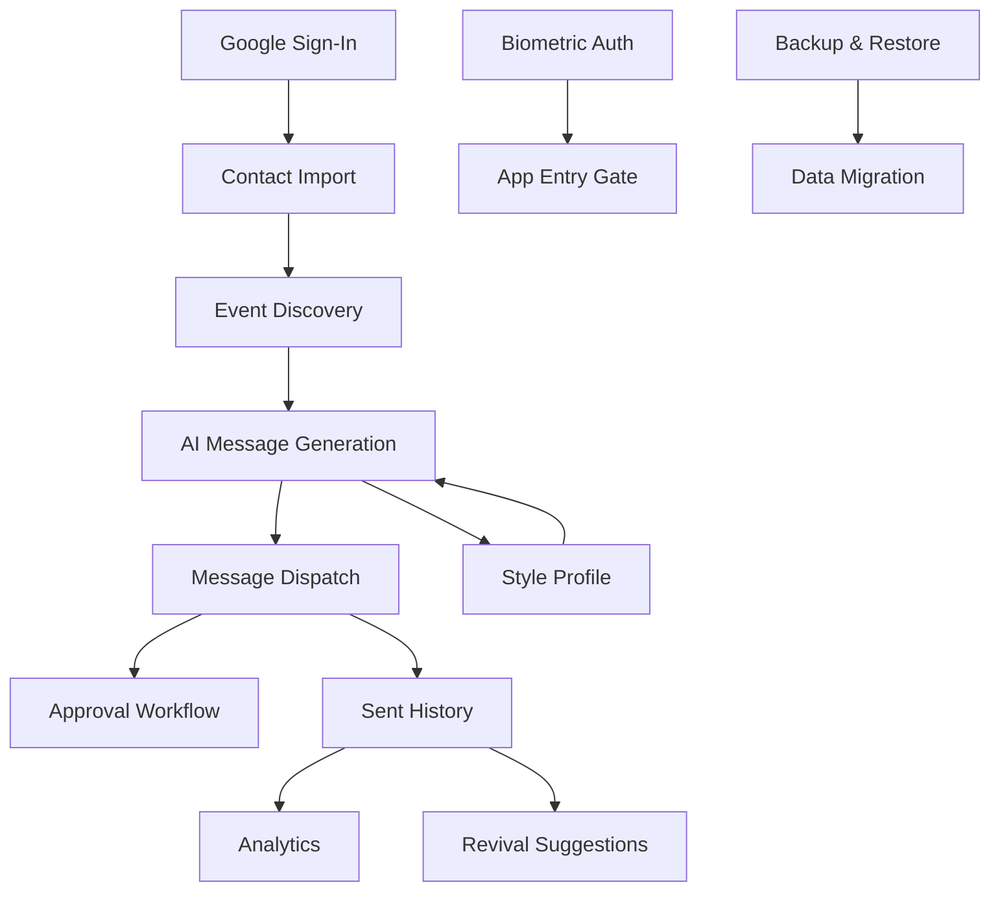
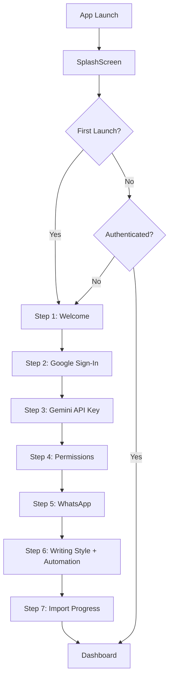
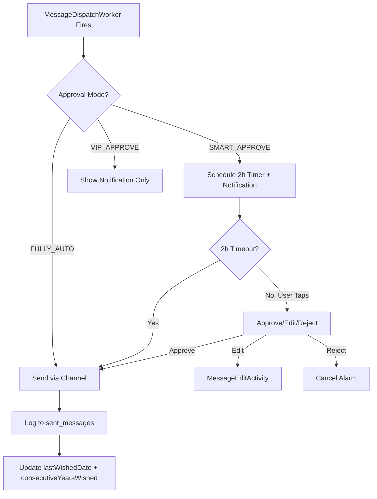
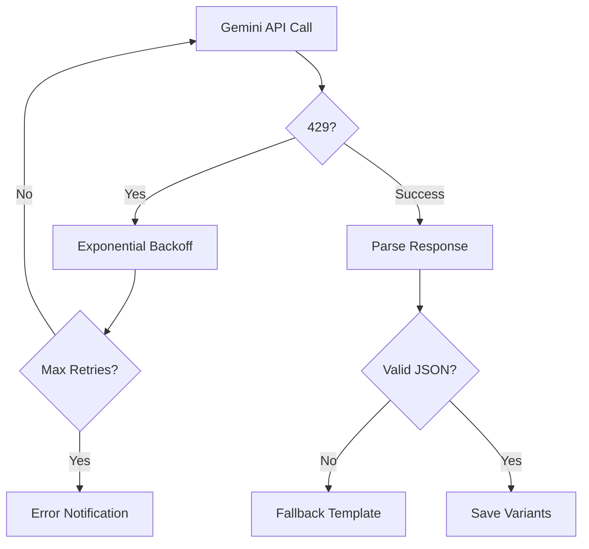
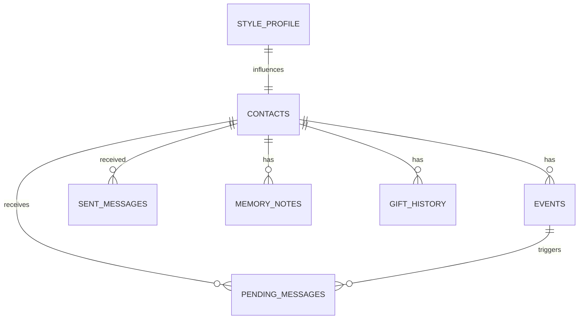
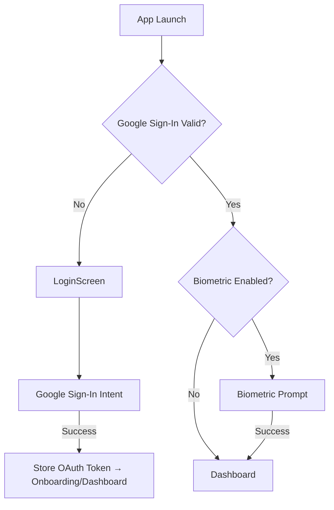

# SSOT.md — RelateAI Consolidated Single Source of Truth (v4.0)

> **Consolidated**: 2026-06-05 — Unified from SSOT.md v3.2, PRD.md, RECONSTRUCTION.md, IMPLEMENTATION_STATUS.md, Kiro/Jules steering files, and 8 audit reports.
> **Reviewed by**: Senior Product Manager · Senior Android Architect · UI/UX Designer · System Architect · AI Coding Agent Knowledge Base
> **Codebase**: Multi-module Android — Kotlin 2.2.10, Jetpack Compose, Hilt 2.59.2, Room 2.7.0, WorkManager 2.9.0, Gemini AI 1.5-Flash, SQLCipher 4.5.4
> **Stage**: MVP → Production Hardening
> **Repository**: `C:\Users\yhsom\OneDrive\Documents\AI-Birthday`
> **Application Package**: `com.example` (applicationId: `com.aistudio.relateai.qxtjrk`)
> **Build Verified**: `assembleDebug` succeeds (427 tasks, 0 errors)
>
> ### How to Use This Document
> - **Living Document**: Update at every milestone. If you explain something to a new dev that isn't here, add it immediately.
> - **AI-First**: Point AI coding agents here first. Contains the "Source of Truth" for all decisions.
> - **Link, Don't Duplicate**: Reference external specs (Jira, Figma) by link, not by copy.
> - **Code Is Final Authority**: If this document conflicts with the code, the code is authoritative — but update this document to match.

---

## Table of Contents

1. [Executive Summary](#1-executive-summary)
2. [Problem Statement](#2-problem-statement)
3. [Product Vision](#3-product-vision)
4. [User Personas](#4-user-personas)
5. [User Pain Points](#5-user-pain-points)
6. [Core Value Proposition](#6-core-value-proposition)
7. [Business Requirements](#7-business-requirements)
8. [Functional Requirements](#8-functional-requirements)
9. [Non-Functional Requirements](#9-non-functional-requirements)
10. [Complete Feature Inventory](#10-complete-feature-inventory)
11. [Detailed Feature Specifications](#11-detailed-feature-specifications)
12. [User Flows & Customer Journeys](#12-user-flows--customer-journeys)
13. [Business Logic & Rules](#13-business-logic--rules)
14. [System Architecture](#14-system-architecture)
15. [Frontend Architecture](#15-frontend-architecture)
16. [Backend Architecture](#16-backend-architecture)
17. [State Management](#17-state-management)
18. [Database Schema & Data Models](#18-database-schema--data-models)
19. [API Documentation](#19-api-documentation)
20. [Third-Party Integrations](#20-third-party-integrations)
21. [Authentication & Authorization](#21-authentication--authorization)
22. [Security Model](#22-security-model)
23. [Infrastructure & Deployment](#23-infrastructure--deployment)
24. [Environment Variables & Configuration](#24-environment-variables--configuration)
25. [Design System & UI Standards](#25-design-system--ui-standards)
26. [Coding Standards & Conventions](#26-coding-standards--conventions)
27. [Testing Strategy](#27-testing-strategy)
28. [Analytics, Logging & Monitoring](#28-analytics-logging--monitoring)
29. [Performance Requirements & Optimization](#29-performance-requirements--optimization)
30. [Known Issues, Risks & Technical Debt](#30-known-issues-risks--technical-debt)
31. [Product Roadmap & Future Enhancements](#31-product-roadmap--future-enhancements)
32. [Architecture Decision Records (ADRs)](#32-architecture-decision-records-adrs)
33. [AI Context & Project Knowledge Base](#33-ai-context--project-knowledge-base)
34. [Reconstruction Blueprint](#34-reconstruction-blueprint)
35. [Implementation Status Tracker](#35-implementation-status-tracker)
36. [Change Log (Consolidation)](#36-change-log-consolidation)

---

## 1. Executive Summary

RelateAI is an **on-device "Relationship Operating System"** that automatically discovers birthdays and anniversaries from Google Contacts, generates deeply personalised AI messages via Google's Gemini 1.5-Flash model, and dispatches them via SMS, WhatsApp (Accessibility Service), or Email — **entirely on-device, no custom backend required**.

### 1.1 What It Does
1. **Discovers** birthdays, anniversaries, and work anniversaries from Google Contacts (People API) and device contacts.
2. **Enriches** each contact with relationship context (groups, relations, custom events) for AI personalisation.
3. **Classifies** contacts by relationship type, language, formality, and communication style using AI inference.
4. **Generates** 6 variants of personalised messages (short/standard/long × formal/funny/emotional) per event.
5. **Schedules** messages via WorkManager with per-contact custom send times.
6. **Dispatches** via SMS (`SmsSender`), WhatsApp (`WhatsAppSender` + `WhatsAppAccessibilityService`), or Email (`EmailSender` — JavaMail SMTP via Gmail).
7. **Tracks** delivery status, conversation health, and engagement metrics.
8. **Notifies** for approvals (smart mode), revivals, and events via `NotificationHelper`.

### 1.2 Current State (v3.2)
- **Pipeline Status**: Functionally complete for prototype. All P0–P4 core items done.
- **Codebase**: ~7,000+ lines of Kotlin across **13 modules** (`:app` + 3 `:core:*` + 9 `:feature:*`).
- **UseCase layer**: ✅ Done — 10 use cases in `core/data/.../domain/usecase/` (technical debt: should be in `:core:domain` per ADR-024).
- **Test Coverage**: ~40 tests total (~15% line coverage). Target: 30% for beta, 80% for production.
- **Security**: SQLCipher, biometric lock, R8/ProGuard, OAuth token refresh, DB key derivation cache, AES-256-GCM encrypted backups, certificate pinning.
- **Architecture**: Multi-module Clean Architecture complete for v1.

### 1.3 The Recommendation
**Harden, simplify, test, and complete what exists before expanding scope.** The product vision is correct. The architecture is fundamentally sound. Focus on production-readiness.

### 1.4 All Fixes Applied

| ID | Issue | Status |
|---|---|---|
| TD-07 | Rate limiter: adaptive sliding-window (60 req/min) | ✅ Done |
| TD-08 | SecurePrefs: explicit retry + clear-and-restart | ✅ Done |
| TD-10 | DI bypasses: Hilt `@EntryPoint` for all receivers/activities | ✅ Done |
| TD-12 | Error handling: `Log.e()` replaces `printStackTrace()` | ✅ Done |
| KI-01 | `selectedVariantText` populated on insert | ✅ Done |
| KI-02 | RevivalWorker 2-day initial delay | ✅ Done |
| KI-03 | `ageTurning` computed property with `@get:Ignore` | ✅ Done |
| KI-04 | `daysUntil` computed at write time | ✅ Done |
| MED-01 | Paging 3 for contact list | ✅ Done |
| M2 | Revival notifications: REVIVAL channel + `showRevivalNotification()` | ✅ Done |
| M3 | Style Coach DB save wired to `StyleProfileDao` | ✅ Done |
| M4 | Message variant switching via `FilterChip` selectors | ✅ Done |
| P2-01 | SQLCipher database encryption | ✅ Done |
| P2-02 | Biometric app lock | ✅ Done |
| P2-03 | Analytics wired to real data | ✅ Done |
| P2-04 | MainActivity extraction (617→147 lines) | ✅ Done |
| P2-05 | Repository layer (interfaces + implementations) | ✅ Done |
| P2-08 | SecurePrefs: `isSecureStorageAvailable()`, syncToken | ✅ Done |
| P2-09 | syncToken incremental contact sync | ✅ Done |
| P2-10 | Google Contact Groups/Labels enrichment | ✅ Done |
| P3-05 | Coil for contact photo caching | ✅ Done |
| P4-01 | Multi-module architecture (13 modules) | ✅ Done |
| P4-02 | UseCase layer (10 use cases) | ✅ Done |
| CRIT-01 | DB key derivation off main thread (cache + `warmUpAsync()`) | ✅ Done |
| CRIT-03 | Backup encryption: AES-256-GCM | ✅ Done |
| CRIT-04 | ContactDetailScreen handlers wired | ✅ Done |
| H2 | Birthday quick-add (FAB + ModalBottomSheet) | ✅ Done |
| PHASE1-01 | DB indices for performance (MIGRATION_6_7) | ✅ Done |
| PHASE1-03 | Baseline Profile for AOT compilation | ✅ Done |
| F-052 | MessageDispatchWorker (5th worker) | ✅ Done |
| F-053 | DB key derivation cache | ✅ Done |
| F-054 | Moshi codegen KSP | ✅ Done |
| F-055 | Worker pre-flight guard + exponential backoff | ✅ Done |
| F-056 | Android 13+ predictive back gesture | ✅ Done |
| B-001 | MemoryVaultView missing `contactId` parameter | ✅ Done |
| B-002 | GiftAdvisorView duplicated definition | ✅ Done |
| B-003 | MemoryVaultView duplicated definition | ✅ Done |
| B-004–006 | Dead onClick handlers (Analytics, Events, Contacts) — comments updated | ✅ Done |
| B-008 | Missing empty states | ✅ Done |
| STITCH-001 | Stitch screen alignment (16/16 screens) | ✅ Done |

---

## 2. Problem Statement

### 2.1 The Core Problem
People forget important relationship dates or send generic, impersonal messages when they do remember. This leads to lost relationships, social anxiety, generic messaging, and missed opportunities.

### 2.2 Existing Solutions & Their Gaps

| Solution Type | Examples | Gap |
|---|---|---|
| Calendar reminders | Google Calendar, Outlook | Generic entry; user must write manually |
| Social media | Facebook "Birthday Today" | Public, generic, impersonal |
| Standalone apps | Birthday Reminder | No AI; same message to everyone |
| CRM tools | HubSpot, Salesforce | Designed for sales; complex; expensive |

### 2.3 The Unclaimed Middle Ground
**RelateAI occupies the gap: "Automated but deeply personal."** The AI generates messages that reference specific interests, shared history, and sound like the user — not a bot.

### 2.4 Strategic Insight (The Moat)
1. **Enrichment**: AI-inferred relationship type + Google People API groups + custom events.
2. **Style training**: Style Coach learns the user's voice from sent message history.
3. **Automation depth**: WorkManager + exact alarms + Accessibility Service for WhatsApp.
4. **Local-first privacy**: No data leaves device except for AI generation calls.

---

## 3. Product Vision

> **"Never miss a meaningful moment — and when you remember, sound exactly like yourself, not a bot."**

### 3.1 The Five Pillars
1. **Discover**: Auto-find every important date in the user's contact graph.
2. **Understand**: Classify relationships, learn writing style, infer preferences.
3. **Compose**: Generate deeply personal messages in the user's voice.
4. **Deliver**: Right channel, right time, right approval flow.
5. **Nurture**: Track relationship health, suggest revivals, celebrate milestones.

### 3.2 Non-Goals (Explicitly Out of Scope)
- No custom backend (everything on-device except Gemini API).
- No social features (not a social network).
- No group messaging (1:1 only).
- No e-commerce integration (Gift Advisor is informational only).
- No web/tablet-specific UI (phone-only for v1).
- No custom LLM training (Gemini as-is).

### 3.3 The Google-First Approach
Intentionally constrained to Google-only for v1: Google Sign-In, Google Contacts (People API), Google Gemini, Gmail SMTP. Integration depth > breadth.

---

## 4. User Personas

### 4.1 Primary: "The Forgetful Networker" — Aarav, 32
Software engineer, 500+ contacts, casual style with Hindi-English mix. Wants: maintain 30+ relationships without mental load. Frustration: forgets 4-5 birthdays/year, generic messages.

### 4.2 Secondary: "The Wedding Planner" — Priya, 28
Marketing manager, 800+ contacts, warm/formal depending on audience. Wants: on-time wishes for 200+ contacts during wedding season with differentiated tones.

### 4.3 Tertiary: "The Senior User" — Rajesh, 58
Retired teacher, 200 contacts mostly family. Wants: VIP approval mode, custom events (memorial), biometric security, large fonts.

### 4.4 Anti-Persona: "The Power User" — Vikram, 24
College student using Instagram DMs. RelateAI is overkill for his small contact graph.

### 4.5 Persona Coverage Matrix

| Feature | Aarav | Priya | Rajesh |
|---|---|---|---|
| Auto-discovery | ✅ High | ✅ High | ✅ Medium |
| AI style training | ✅ High | ✅ High | ⚠️ Low |
| WhatsApp dispatch | ✅ Primary | ✅ Primary | ⚠️ SMS preferred |
| VIP approval | ❌ Not needed | ❌ Not needed | ✅ Critical |
| Revival suggestions | ✅ High | ⚠️ Medium | ❌ Not relevant |
| Custom events | ⚠️ Low | ⚠️ Low | ✅ High (memorial) |
| Biometric lock | ⚠️ Medium | ⚠️ Medium | ✅ High |

---

## 5. User Pain Points

| ID | Pain Point | Severity | RelateAI Solution |
|---|---|---|---|
| PP-01 | Forgetting birthdays | Critical | Auto-discovery + scheduled dispatch |
| PP-02 | Generic messages | High | AI personalisation from enrichment data |
| PP-03 | Mental load of 30+ dates | High | Background discovery, no manual entry |
| PP-04 | Missing anniversaries | High | Event type coverage (BIRTHDAY, ANNIVERSARY, WORK_ANNIVERSARY) |
| PP-05 | Losing touch with old friends | Medium | Revival suggestions via RevivalWorker |
| PP-06 | Multi-language messages | Medium | `preferredLanguage` + multilingual prompts |
| PP-07 | Choosing the right channel | Medium | `preferredChannel` per-contact |
| PP-08 | Duplicate wishes | Low | `sent_messages` history + `lastWishedDate` |
| PP-09 | Finding the right gift | Medium | Gift Advisor (informational v1) |
| PP-10 | Memorial messages | High | Custom events + AI tone adjustment |
| PP-11 | Approving AI messages | Medium | 4-mode approval workflow |
| PP-12 | Backing up data | Critical | Backup & Restore (encrypted JSON) |
| PP-15 | Privacy concerns | Critical | Local-first, SQLCipher, biometric lock |

---

## 6. Core Value Proposition

### 6.1 Three Pillars of Value
1. **Zero Mental Load**: Background automation handles everything after setup.
2. **Sounds Like You**: Style Coach learns the user's voice, not generic templates.
3. **Local-First Privacy**: No contact data leaves device; only Gemini prompt context is sent externally.

### 6.2 Competitive Differentiation

| Differentiator | RelateAI | Birthday Reminder | HubSpot |
|---|---|---|---|
| On-device storage | ✅ | ⚠️ Partial | ❌ Cloud-only |
| AI personalisation | ✅ Gemini + Style Coach | ❌ Templates only | ⚠️ Generic LLM |
| Multi-channel dispatch | ✅ SMS + WhatsApp + Email | ❌ Notification only | ⚠️ Email only |
| WhatsApp sending | ✅ Accessibility Service | ❌ | ❌ |
| Style learning | ✅ Style Coach | ❌ | ❌ |
| No subscription | ✅ | ⚠️ Ads | ❌ $$$ |

---

## 7. Business Requirements

### 7.1 Business Goals
- **User Retention**: >40% DAU/MAU by Q4 2026.
- **Activation Rate**: >60% complete onboarding in <7 days.
- **Engagement**: Average 3+ wishes/month.
- **App Store Rating**: >4.5 stars.
- **Crash-Free Rate**: >99.5%.

### 7.2 Business Constraints
- No custom backend. No subscription model in v1. No user accounts (Google Sign-In only). GDPR/privacy compliance. Google Play Accessibility Service disclosure required.

### 7.3 Business Model
- **v1**: Free, no ads, no IAP.
- **v2**: Optional "Pro" tier (₹199/month or ₹1999/year) with multi-language models, custom LLM fine-tuning, advanced gift recommendations, cloud backup, priority support.

### 7.4 Go-to-Market Strategy
1. Organic Google Play launch in India.
2. Reddit/Twitter organic marketing.
3. Influencer partnerships.
4. International expansion (Indonesia, Philippines, Brazil — WhatsApp-first cultures).

---

## 8. Functional Requirements

### 8.1 Authentication & Identity
- **FR-01**: Google Sign-In (Google Sign-In API). **FR-02**: OAuth in EncryptedSharedPreferences. **FR-03**: Token refresh before every People API call. **FR-04**: Optional biometric lock. **FR-05**: Sign-out clears all local data.

### 8.2 Contact Management
- **FR-10–12**: Auto-import from Google + device, deduplicate via ContactMerger. **FR-13**: Manual birthday quick-add. **FR-14**: Relationship type classification (AI/Google Groups). **FR-15–17**: Per-contact custom send time, VIP mode, preferred channel.

### 8.3 Event Discovery
- **FR-20–23**: Discover BIRTHDAY, ANNIVERSARY, WORK_ANNIVERSARY, CUSTOM events. **FR-24**: Recompute `daysUntil` at write time. **FR-25**: EventDiscoveryWorker daily via WorkManager.

### 8.4 AI Message Generation
- **FR-30**: 6 variants per event. **FR-31**: Gemini 1.5-Flash via REST. **FR-32–33**: StyleProfile + enrichment data in prompts. **FR-34**: 429 handling with exponential backoff (3 retries). **FR-35**: MessageGenerationWorker 3 days before event. **FR-36–37**: User edit and regenerate.

### 8.5 Message Dispatch
- **FR-40–42**: SMS (SmsManager), WhatsApp (Accessibility), Email (JavaMail SMTP). **FR-43**: 4-mode approval workflow. **FR-44**: AlarmManager scheduling. **FR-45**: Log to `sent_messages`. **FR-46**: 2-hour SMART_APPROVE timeout.

### 8.6 Approval Workflow
- **FR-50**: 4 modes: FULLY_AUTO, SMART_APPROVE, VIP_APPROVE, DEFAULT. **FR-51–54**: Notification actions (Approve/Edit/Reject), MessageEditActivity on Edit, cancel alarm on Reject, auto-send on 2h timeout.

### 8.7 Analytics & Health
- **FR-60–64**: Real-time stats, per-contact health score (0-100), classification (Thriving >75 / Needs Attention 40-75 / At Risk <40), weekly RevivalWorker, top/bottom 5 contacts.

### 8.8 Backup & Restore
- **FR-70–72**: Export/import encrypted JSON covering all 7 entity types. AES-256-GCM with user passphrase. Cannot restore OAuth tokens or biometric state.

### 8.9 Onboarding
- **FR-80**: **10-step onboarding today** (welcome → google_signin → gemini_setup → contacts_perm → sms_perm → whatsapp_setup → battery_opt → writing_style → automation_prefs → import_progress). Simplification to 7 steps tracked as HIGH-02.

### 8.10 Style Coach
- **FR-90–93**: Manual training text → StyleProfileEntity. Auto-analysis from `sent_messages` is **not yet implemented** (FR-92 gap). AI prompts adapt based on StyleProfile.

### 8.11 Accessibility Service Disclosure (Play Store Requirement)
Before enabling WhatsApp Accessibility, the system MUST display: what it does, what it does NOT do, how to disable, what breaks if disabled, and permissions scope (`com.whatsapp,com.whatsapp.w4b`).

---

## 9. Non-Functional Requirements

### 9.1 Performance
- **NFR-PERF-01**: Cold start <1.5s on Pixel 4a. **NFR-PERF-02**: 60fps LazyColumn with 500+ contacts. **NFR-PERF-03**: All DAOs `suspend` on Dispatchers.IO. **NFR-PERF-04**: Coil image caching. **NFR-PERF-05**: Worker constraints (Network + BatteryNotLow).

### 9.2 Security
- **NFR-SEC-01**: SQLCipher AES-256. **NFR-SEC-02**: Secrets in EncryptedSharedPreferences. **NFR-SEC-03**: No PII in Logcat (release). **NFR-SEC-04**: R8/ProGuard enabled. **NFR-SEC-05**: Biometric auth. **NFR-SEC-06**: PBKDF2 key derivation (65536 iterations). **NFR-SEC-07**: Accessibility scoped to WhatsApp only. **NFR-SEC-08**: OAuth refresh before API calls.

### 9.3 Reliability
- **NFR-REL-01**: Workers survive process death. **NFR-REL-02**: Schema migrations tested with `exportSchema=true`. **NFR-REL-03**: `Log.e()` for errors. **NFR-REL-04**: BootReceiver reschedules workers. **NFR-REL-05**: Dual WhatsApp support.

### 9.4 Scalability
- **NFR-SCAL-01**: Paging 3 for >500 contacts. **NFR-SCAL-02**: Multi-module parallel compilation. **NFR-SCAL-03**: UseCase layer isolation.

### 9.5 Maintainability
- **NFR-MAINT-01**: Version catalog for all deps. **NFR-MAINT-02**: Hilt constructor injection (no field injection). **NFR-MAINT-03**: No `!!` operator. **NFR-MAINT-04**: KDoc on public functions. **NFR-MAINT-05**: Repository pattern for all data access.

### 9.6 Accessibility
- **NFR-A11Y-01**: `contentDescription` for TalkBack. **NFR-A11Y-02**: Touch targets ≥48dp. **NFR-A11Y-03**: Contrast ratio ≥4.5:1. **NFR-A11Y-04**: System font scaling respected (sp).

### 9.7 Internationalization
- **NFR-I18N-01**: All strings in `strings.xml`. **NFR-I18N-02**: Minimum: en, hi, id, pt-rBR. **NFR-I18N-03**: AI adapts to `preferredLanguage`.

### 9.8 Compatibility
- **NFR-COMPAT-01**: minSdk 24. **NFR-COMPAT-02**: targetSdk 36. **NFR-COMPAT-03**: compileSdk 36. **NFR-COMPAT-04**: 32-bit + 64-bit ABIs.

---

## 10. Complete Feature Inventory

### 10.1 Feature Status Matrix (56 Features)

| ID | Feature | Key Files | Status | Priority |
|---|---|---|---|---|
| F-001 | Google Sign-In | `LoginScreen.kt`, `AppModule.kt` | ✅ | P0 |
| F-002 | Device contact import | `DeviceContactsReader.kt` | ✅ | P0 |
| F-003 | Google Contacts sync | `GoogleContactsSync.kt` | ✅ | P0 |
| F-004 | Contact deduplication | `ContactMerger.kt` | ✅ | P0 |
| F-005 | Contact Groups/Labels | `GoogleContactsSync.kt` | ✅ | P2 |
| F-006 | Custom events | `EventEntity.kt` | ✅ | P0 |
| F-007 | Relations field enrichment | `GoogleContactsSync.kt` | ✅ | P4 |
| F-008 | Birthday detection | `EventDiscoveryWorker.kt` | ✅ | P0 |
| F-009 | Anniversary detection | `EventDiscoveryWorker.kt` | ✅ | P0 |
| F-010 | Work anniversary detection | `EventDiscoveryWorker.kt` | ✅ | P0 |
| F-011 | AI message generation | `GeminiClient.kt`, `PromptBuilder.kt` | ✅ | P0 |
| F-012 | Message length variants | `PendingMessageEntity.kt` | ✅ | P0 |
| F-013 | Message tone variants | `PromptBuilder.kt` | ✅ | P0 |
| F-014 | Style Coach training | `StyleCoachScreen.kt` | ✅ | P0 |
| F-015 | SMS sending | `SmsSender.kt` | ✅ | P0 |
| F-016 | WhatsApp sending | `WhatsAppSender.kt` | ✅ | P0 |
| F-017 | Email sending | `EmailSender.kt` | ✅ | P0 |
| F-018 | 4-mode approval workflow | `PendingMessageEntity.kt` | ✅ | P0 |
| F-019 | Notification approval actions | `ApprovalReceiver.kt` | ✅ | P0 |
| F-020 | Message edit before send | `MessageEditActivity.kt` | ✅ | P0 |
| F-021 | Relationship health score | `MainViewModel.kt` | ✅ | P0 |
| F-022 | Contact list screen | `ContactsContent.kt` | ✅ | P0 |
| F-023 | Contact detail screen | `ContactDetailScreen.kt` | ✅ | P0 |
| F-024 | Events screen | `EventsScreen.kt` | ✅ | P0 |
| F-025 | Messages screen | `MessagesScreen.kt` | ✅ | P0 |
| F-026 | Analytics screen | `AnalyticsScreen.kt` | ✅ | P2 |
| F-027 | Onboarding (10 steps) | `OnboardingScreen.kt` | ✅ | P0 |
| F-028 | Settings screen | `SettingsScreen.kt` | ✅ | P0 |
| F-029 | Memory vault | `MemoryVaultView.kt` | ✅ | P3 |
| F-030 | Gift advisor | `GiftAdvisorView.kt` | ✅ | P4 |
| F-031 | Revival suggestions | `RevivalWorker.kt` | ✅ | P0 |
| F-032 | Biometric auth | `BiometricAuthManager.kt` | ✅ | P2 |
| F-033 | Boot receiver | `BootReceiver.kt` | ✅ | P0 |
| F-034 | Rate limiter (adaptive) | `RateLimiter.kt` | ✅ | P0 |
| F-035 | Birthday calendar view | `BirthdayCalendarView.kt` | ✅ | P4 |
| F-036 | Home screen widget | `BirthdayWidgetProvider.kt` | ✅ | P4 |
| F-037 | App shortcuts | `shortcuts.xml` | ✅ | P4 |
| F-038 | Backup & Restore (encrypted) | `BackupManager.kt`, `BackupEncryption.kt` | ✅ | P3 |
| F-039 | "Send test to myself" | `SettingsScreen.kt` | ✅ | P3 |
| F-040 | Loading shimmer states | `LoadingShimmer.kt` | ✅ | P2 |
| F-041 | Birthday quick-add | `EventsScreen.kt` | ✅ | H2 |
| F-042 | SQLCipher encryption | `DatabaseKeyDerivation.kt` | ✅ | P2 |
| F-043 | OAuth token refresh | `GoogleContactsSync.kt` | ✅ | P2 |
| F-044 | Repository layer | `*RepositoryImpl.kt` | ✅ | P2 |
| F-045 | syncToken incremental sync | `GoogleContactsSync.kt` | ✅ | P2 |
| F-046 | Multi-module (13 modules) | `*/build.gradle.kts` | ✅ | P4 |
| F-047 | UseCase layer (10 use cases) | `core/data/.../domain/usecase/*.kt` | ✅ | P4 |
| F-048 | Chat view tab | — | ❌ Pending | — |
| F-049 | Mood log entity | — | ❌ Pending | — |
| F-050 | `replyReceived` field | — | ❌ Pending | — |
| F-051 | `confidenceScore` field | — | ❌ Pending | — |
| F-052 | MessageDispatchWorker | `MessageDispatchWorker.kt` | ✅ | P0 |
| F-053 | DB key derivation cache | `DatabaseKeyDerivation.kt` | ✅ | P0 |
| F-054 | Moshi codegen KSP | `core/data/build.gradle.kts` | ✅ | P0 |
| F-055 | Worker pre-flight guard + backoff | `workers/*.kt`, `RelateAIApp.kt` | ✅ | P0 |
| F-056 | Predictive back gesture | `AndroidManifest.xml` | ✅ | P3 |

### 10.2 Feature Dependency Graph



---

## 11. Detailed Feature Specifications

### 11.1 F-008: Birthday Detection
- **File**: `automation/workers/EventDiscoveryWorker.kt`
- **Schedule**: Daily at 6:00 AM (WorkManager periodic)
- **Sources**: Google People API (`personFields=birthdays`) + device ContactsContract
- **Algorithm**: Fetch contacts → create/update EventEntity → compute `nextOccurrenceMs` → set `daysUntil` → set `ageTurning` via `@get:Ignore`
- **Edge Cases**: Yearless birthdays (`year=null`), Feb 29 (use March 1 in non-leap years), past birthdays (roll forward)

### 11.2 F-011: AI Message Generation
- **Files**: `GeminiClient.kt`, `GeminiModels.kt`, `PromptBuilder.kt`, `ResponseParser.kt`, `RateLimiter.kt`
- **Endpoint**: `POST .../gemini-1.5-flash:generateContent` with `x-goog-api-key` header
- **Config**: temperature 0.7, maxOutputTokens 1024, topP 0.9
- **Rate Limiting**: 60 req/min sliding window, burst up to 10/sec
- **Retry**: 3 attempts, exponential backoff (1s → 2s → 4s)
- **Prompt Structure**: Contact context (name, relationship, age, hobbies, interests, shared history) + StyleProfile + event type + desired length/tone → 6 JSON variants

### 11.3 F-016: WhatsApp Sending (Accessibility Service)
- **Files**: `WhatsAppAccessibilityService.kt`, `WhatsAppSender.kt`, `accessibility_service_config.xml`
- **Scoped to**: `com.whatsapp,com.whatsapp.w4b`
- **Algorithm**: Launch via Intent → detect chat → find input field → `ACTION_SET_TEXT` → find send button → click
- **Known Limitations**: Requires unlocked screen on some OEMs (MIUI, ColorOS); no groups; no media

### 11.4 F-021: Relationship Health Score
- **Algorithm**: `base(50) + interactionFrequency(max +30) + recentInteraction(+20) + consecutiveYears(max +20) - stale180d(-30) - stale365d(-20)`
- **Classification**: Thriving >75, Needs Attention 40-75, At Risk <40
- **Triggers**: On message sent (+5 engagement), on birthday wished (+1 consecutive), on manual interaction log

### 11.5 F-031: Revival Suggestions
- **Schedule**: Weekly (2-day initial delay)
- **Algorithm**: Bottom 5 by health score where `lastWishedDate > 180 days` → generate casual reconnection message via Gemini → create PendingMessageEntity (PENDING_REVIVAL) → show notification

---

## 12. User Flows & Customer Journeys

### 12.1 Onboarding Flow


### 12.2 Daily Approval Flow


### 12.3 Error Paths


---

## 13. Business Logic & Rules

### 13.1 Approval Workflow Rules

| Mode | Behavior | Notification | 2h Timeout | User Action Required |
|---|---|---|---|---|
| FULLY_AUTO | Send immediately | None | No | No |
| SMART_APPROVE | Schedule + notify | Yes | Yes (auto-send) | Optional |
| VIP_APPROVE | Notify only | Yes | No | Yes (must approve) |
| DEFAULT | Per-contact custom time | Per custom time | No | Per custom time |

### 13.2 AI Personalisation Rules
- System prompt includes: contact context, StyleProfile, enrichment data, preferred language
- Output constraints: <500 chars (SMS limit), must include recipient name, no generic phrases without personalisation

### 13.3 Rate Limiting Rules
- Sliding window: 60 req/60s, burst 10/1s, cooldown 2× `Retry-After` (or 60s default), backoff 1s→2s→4s→8s

### 13.4 Gift Budget Logic
- Default: ₹500/contact/year. VIP: ₹2000. Family: ₹1000. Friends: ₹500. Work: ₹300.

---

## 14. System Architecture

### 14.1 Architecture Pattern
Multi-module **Clean Architecture** with **MVI** (Model-View-Intent):
```
UI Layer (feature modules) → Domain Layer (core/domain) → Data Layer (core/data) → External (Room, Firebase, Network)
```

### 14.2 Module Structure (13 Modules)

| Module | Type | Purpose |
|---|---|---|
| `:app` | Application | Entry point, DI, manifest, widget, signing |
| `:core:domain` | Android Library | Entities (7 Room entities), repository interfaces |
| `:core:data` | Android Library | DAOs, repo impls, workers, senders, Gemini, contacts, auth, backup, DI |
| `:core:ui` | Android Library | Theme, navigation, shared components |
| `:feature:splash` | Android Library | Splash screen + auth check |
| `:feature:login` | Android Library | Google Sign-In |
| `:feature:dashboard` | Android Library | Main app shell, dashboard, MainViewModel |
| `:feature:contacts` | Android Library | Contact list, detail, memory vault, gift advisor |
| `:feature:events` | Android Library | Event timeline, birthday calendar |
| `:feature:messages` | Android Library | Message center (pending/sent) |
| `:feature:analytics` | Android Library | Analytics dashboard |
| `:feature:onboarding` | Android Library | 10-step onboarding wizard |
| `:feature:settings` | Android Library | Settings, Style Coach |

### 14.3 Workers (5)

| Worker | Schedule | Purpose |
|---|---|---|
| ContactSyncWorker | Daily | Fetch + merge contacts from Google + device |
| EventDiscoveryWorker | Daily (6 AM) | Discover birthdays/anniversaries, compute `daysUntil` |
| MessageGenerationWorker | Daily | Generate 6 variants for events within 3 days |
| MessageDispatchWorker | Triggered (AlarmManager) | Dispatch approved messages via channel |
| RevivalWorker | Weekly (2-day delay) | Suggest reconnection for bottom 5 contacts |

All workers: `@HiltWorker`, `@AssistedInject`, pre-flight API key guard, try/catch → `Result.retry()`, 30s exponential backoff, 1h minimum initial delay.

---

## 15. Frontend Architecture

### 15.1 Single-Activity Architecture
`MainActivity` (`@AndroidEntryPoint`) → `setContent { RelateAITheme { NavGraph } }`.

### 15.2 Navigation
5-tab bottom nav: HOME, CONTACTS, EVENTS, MESSAGES, MORE. Tablet: `NavigationRail`. Hidden routes: ANALYTICS, STYLE_COACH (accessed via MORE).

### 15.3 ViewModel Pattern
`@HiltViewModel`, `StateFlow<UiState>`, `collectAsStateWithLifecycle()`. One-off events via `Channel<UiEvent>`.

---

## 16. Backend Architecture

**Local-First, No Custom Backend.** All data on-device. External calls only to:

| Service | Purpose | Auth |
|---|---|---|
| Google People API | Contact sync | OAuth 2.0 |
| Gemini API | Message generation | API Key |
| Gmail SMTP | Email sending | SMTP credentials |
| WhatsApp | Message sending | Accessibility Service |
| SMS | Message sending | System SmsManager |

### 16.1 Future: On-Device LLM
Long-term: Replace Gemini with Gemini Nano (MediaPipe) for zero data leakage, zero API cost, offline capability. Challenges: 2-4GB model, 8GB+ RAM, inference speed.

---

## 17. State Management

**Pattern**: MVI — `Intent → ViewModel → Repository/UseCase → StateFlow<UiState> → UI`

**State Containers**: ViewModel (survives config changes), `remember{}` (composition), `rememberSaveable{}` (process death), DataStore (future persistent prefs).

**Repository State**: All expose `Flow<T>` for reactive queries — UI always in sync with DB.

---

## 18. Database Schema & Data Models

### 18.1 Entity Relationship Diagram


### 18.2 Entities (7)

| Entity | PK | Key Columns | Notes |
|---|---|---|---|
| **ContactEntity** | `id` (String) | 38 columns (17 core + 21 enrichment JSON) | `relationshipType`, `automationMode`, `healthScore`, JSON fields for interests/hobbies/history |
| **EventEntity** | `id` (UUID) | `contactId` FK, `type`, `daysUntil`, `nextOccurrenceMs` | Types: BIRTHDAY/ANNIVERSARY/WORK_ANNIVERSARY/GRADUATION/CUSTOM. `ageTurning` via `@get:Ignore` |
| **PendingMessageEntity** | `id` (UUID) | 6 variant columns, `selectedVariant`, `approvalMode`, `status` | Statuses: PENDING/APPROVED/REJECTED/SENT/FAILED |
| **SentMessageEntity** | `id` (UUID) | `messageText`, `channel`, `sentAtMs`, `deliveryStatus` | Statuses: SENT/DELIVERED/FAILED |
| **StyleProfileEntity** | `id` (Int=1) | Singleton, JSON fields for phrases/greetings/emoji | Learned from manual training text |
| **MemoryNoteEntity** | `id` (UUID) | `contactId` FK, `category`, `noteText` | Categories: PERSONAL/MILESTONE/INSIDE_JOKE/GIFT_IDEA/OTHER |
| **GiftHistoryEntity** | `id` (UUID) | `contactId` FK, `giftName`, `giftAmountInr` | Gift tracking per contact |

### 18.3 Database Version History

| Version | Migration | Description |
|---|---|---|
| 1 | Initial | All 7 core tables |
| 2 | — | Intermediate |
| 3 | MIGRATION_2_3 | Add StyleProfileEntity, add fields to contacts/events/pending_messages |
| 4 | MIGRATION_3_4 | DROP mood_logs |
| 5 | MIGRATION_4_5 | Add `contactGroup` to contacts |
| 6 | MIGRATION_5_6 | Add `relationsJson` to contacts |
| 7 | MIGRATION_6_7 | Add performance indices |

**Current Version**: 7

### 18.4 Indices (MIGRATION_6_7)
- `events(nextOccurrenceMs)` — upcoming events query
- `pending_messages(scheduledForMs)` — dispatch query
- `sent_messages(contactId, sentAtMs DESC)` — history query

### 18.5 DAOs (7)
`ContactDao`, `EventDao`, `PendingMessageDao`, `SentMessageDao`, `StyleProfileDao`, `MemoryNoteDao`, `GiftHistoryDao` — all with standard CRUD + specialized aggregate queries.

---

## 19. API Documentation

### 19.1 Google People API
- **Endpoint**: `GET /people/me/connections?personFields=names,emailAddresses,phoneNumbers,organizations,birthdays,events,memberships,relations,photos&pageSize=2000`
- **Scope**: `contacts.readonly`
- **Incremental**: `syncToken` parameter for delta sync

### 19.2 Gemini API
- **Endpoint**: `POST /v1beta/models/gemini-1.5-flash:generateContent`
- **Auth**: `x-goog-api-key` header
- **Rate Limits**: 60 req/min (free), 1000 req/min (paid)
- **Token Cost**: ~$0.000075/1K input, ~$0.0003/1K output

### 19.3 Gmail SMTP
- **Server**: `smtp.gmail.com:587` (TLS)
- **Auth**: Email + app password
- **Limit**: 500 emails/day (personal), 2000/day (Workspace)

---

## 20. Third-Party Integrations

### 20.1 Key Dependencies

| Dependency | Version | Purpose | Criticality |
|---|---|---|---|
| AGP | 9.2.1 | Build system | Critical |
| Kotlin | 2.2.10 | Language | Critical |
| Compose BOM | 2024.09.00 | UI framework | Critical |
| Hilt | 2.59.2 | DI | Critical |
| Room | 2.7.0 | Database | Critical |
| SQLCipher | 4.5.4 | DB encryption | Critical |
| WorkManager | 2.9.0 | Background work | Critical |
| KSP | 2.3.5 | Annotation processing | Build |
| Moshi | 1.15.1 | JSON serialization | High |
| OkHttp | 4.12.0 | HTTP client | High |
| Retrofit | 2.12.0 | REST client | High |
| Coil | 2.7.0 | Image loading | Medium |
| Play Services Auth | 21.2.0 | Google Sign-In | Critical |
| Google People API | v1-rev20220531-2.0.0 | Contacts | High |
| Biometric | 1.2.0-alpha05 | Fingerprint/Face | High |
| Security Crypto | 1.1.0-alpha06 | EncryptedSharedPreferences | Critical |
| JavaMail (Sun) | 1.6.2 | SMTP email | Medium |
| Firebase BOM | 34.12.0 | Auth, Vertex AI | Medium |
| Coroutines | 1.10.2 | Async | Critical |

**Dead Code**: Glide 4.16.0 declared but unused (no `@GlideModule`). Gson 2.10.1 transitive only.

**KSP Processors**: Room compiler, Hilt compiler, Moshi kotlin-codegen (3 active on `:core:data`).

---

## 21. Authentication & Authorization

### 21.1 Auth Flow


### 21.2 Token Lifecycle
`AccountManager.getAuthToken()` called before every People API request. Token stored in `SecurePrefs`. Silent refresh on expiry (~50 min).

---

## 22. Security Model

### 22.1 Encryption Summary

| Asset | Method | Key Derivation |
|---|---|---|
| Room DB | SQLCipher AES-256 | PBKDF2 (ANDROID_ID + app cert, 65536 iter) |
| SharedPreferences | AndroidX Crypto AES-256 | Android Keystore (MasterKey) |
| Backups | AES-256-GCM | User passphrase |
| Network | TLS + cert pinning | Google API domains |

### 22.2 DB Key Derivation
- Derived via PBKDF2, cached in plain `SharedPreferences` (`relateai_db_meta`, schema v2) to avoid 349ms re-derivation.
- `warmUpAsync()` on `Application.onCreate()` daemon thread.

### 22.3 SecurePrefs
`EncryptedSharedPreferences` with MasterKey AES-256-GCM (alias `relateai_master_key_v4`). Methods: `getOAuthToken()`, `getGeminiApiKey()`, `isBiometricLockEnabled()`, `isSecureStorageAvailable()`, `clearAll()`.

### 22.4 Certificate Pinning
`network_security_config.xml`: cleartext forbidden for `googleapis.com` and `gstatic.com`.

---

## 23. Infrastructure & Deployment

### 23.1 Build System
Gradle Kotlin DSL, version catalog `gradle/libs.versions.toml`, AGP 9.2.1, Kotlin 2.2.10, KSP 2.3.5, JDK 17 (`jvmToolchain(17)`).

### 23.2 Build Types
- **Debug**: Default signing, no minification, debug logging.
- **Release**: Custom signing (env vars), R8 minification + obfuscation, resource shrinking.

### 23.3 CI/CD (GitHub Actions)
```yaml
name: Android CI
on: [push, pull_request]
jobs:
  build:
    runs-on: ubuntu-latest
    steps:
      - Checkout → Setup JDK 17 → Cache Gradle → Lint → Test → assembleDebug → Upload APK
```

### 23.4 Release
Semantic versioning. Play Store: Internal → Closed Beta → Production (10% → 50% → 100% staged rollout).

### 23.5 ProGuard Rules
46 lines keeping: Hilt, Room entities, Moshi JsonAdapters, OkHttp, Retrofit, Gemini models, JavaMail, Workers, Services, Receivers.

---

## 24. Environment Variables & Configuration

| Variable | Purpose | Required |
|---|---|---|
| `GEMINI_API_KEY` | AI generation | Yes (user-provided) |
| `KEYSTORE_PATH` | Release signing | Release only |
| `STORE_PASSWORD` | Keystore password | Release only |
| `KEY_PASSWORD` | Key password | Release only |
| `KEY_ALIAS` | Key alias | Release only (default: `upload`) |

**Config Files**: `local.properties` (gitignored), `.env` (gitignored, loaded by Secrets Gradle Plugin), `gradle.properties`, `gradle/libs.versions.toml`.

---

## 25. Design System & UI Standards

### 25.1 Theme
- **Mode**: Dark-only `RelateAIDarkColorScheme`
- **Primary**: Neon Violet `#8B5CF6`
- **Secondary**: Electric Cyan `#06B6D4`
- **Tertiary**: Cyber Rose `#F43F5E`
- **Background**: Obsidian Black `#0D0D0D`
- **Glassmorphic**: `GlassOverlay = Color(0x33FFFFFF)`, `GlassBorder = Color(0x4DFFFFFF)`
- **Dynamic Color**: Supported on Android 12+

### 25.2 Typography
13-style scale. Headline: MonoTypeAce (custom font). Body: Inter. All Material 3 roles defined.

### 25.3 Spacing & Grid
8dp base grid (4, 8, 16, 24, 32 dp). Touch targets: min 48dp. Card padding: 16dp. Screen padding: 16dp H, 8dp V.

### 25.4 Component Library
Material 3: `ElevatedCard`, `Scaffold`, `TopAppBar`, `NavigationBar`, `NavigationRail`, `FilterChip`, `FloatingActionButton`, `ModalBottomSheet`, progress indicators.

### 25.5 Custom Components
`HealthRing` (animated circular score), `GlowingLineChart`, `ShimmerBox/Circle/TextLine/Card`, `BirthdayCalendarView`, `GlassmorphicCard`.

### 25.6 Iconography
Material Icons Extended. Key icons: Cake (birthday), Event (anniversary), Star (VIP), AutoAwesome (AI), Lock (biometric).

---

## 26. Coding Standards & Conventions

### 26.1 Naming
- Classes: PascalCase. Functions/Variables: camelCase. Constants: UPPER_SNAKE_CASE.
- Repository methods: verb phrases (`getAll()`, `updateHealthScore()`).
- Use Cases: verb phrases present tense (`refreshHealthScores()`).

### 26.2 Kotlin Rules
- No `!!` operator. Use safe calls.
- No `GlobalScope`. Use `viewModelScope` or `lifecycleScope`.
- No `printStackTrace()`. Use `Log.e(TAG, "...", exception)`.
- All `suspend` for one-shot DB/network ops. `Flow` for streams.
- `Dispatchers.IO` for DB/network. `Dispatchers.Main` for UI.

### 26.3 Compose Rules
- Hoist state to ViewModel. Material 3 components preferred.
- Use `@Stable` for UI models. `remember(key)` for expensive calculations.
- `key` parameter in LazyColumn items.

### 26.4 Build Conventions
- All deps via `gradle/libs.versions.toml`. Moshi codegen KSP required on `:core:data`.
- Hilt+Dagger packaging exclude: `META-INF/gradle/incremental.annotation.processors`.

### 26.5 Jules Learnings (from `.jules/bolt.md`)
1. **LazyColumn Performance**: Always provide stable `key` to `items`. For `LazyPagingItems` use `items.itemKey { it.uniqueId }`.
2. **Room DB Migrations**: Always provide explicit `name` for `@Index` definitions to match manual migration scripts.

---

## 27. Testing Strategy

### 27.1 Current Tests (~40)

| Module | Tests | Coverage |
|---|---|---|
| ResponseParser | 8 | JSON parsing validation |
| PromptBuilder | 10 | Prompt construction from entities |
| ContactMerger | 8 | Google + device deduplication |
| DaoTest | 10 | Room CRUD operations |
| MainViewModel | 2 | Basic state assertions |
| GreetingScreenshotTest | 1 | Roborazzi screenshot |
| ExampleRobolectricTest | 1 | Robolectric smoke |

### 27.2 Coverage Targets

| Module | Target | Current |
|---|---|---|
| `:core:domain` | 100% | ~30% |
| `:core:data` (DAOs, Repos) | 90% | ~30% |
| `:core:data` (Gemini, Contacts) | 80% | ~70% |
| `:core:data` (Workers) | 70% | 0% |
| `:feature:*` | 30% | ~10% |
| **Overall** | **60-80%** | **~15%** |

### 27.3 Testing Tools
JUnit 4, Robolectric 4.16.1, Roborazzi 1.59.0, MockK (planned), Room `inMemoryDatabaseBuilder`, Compose Test Rule.

---

## 28. Analytics, Logging & Monitoring

### 28.1 Local Analytics (AnalyticsScreen)
Total wishes, monthly wishes, pending approvals, contact counts by type, top/bottom 5 by health, engagement trend chart. All from Room DAOs — zero data leaves device.

### 28.2 Logging
Debug: `Log.d/e/w` with descriptive TAG. Release: `Log.e` only. No PII ever logged.

### 28.3 Future: Crashlytics (Opt-In)
Firebase Crashlytics planned for v1.0 production (opt-in, default OFF). Stack traces + device info only. No PII.

### 28.4 Analytics Event Taxonomy
`app_open`, `onboarding_complete`, `contact_synced`, `event_discovered`, `message_generated`, `message_sent`, `message_failed`, `approval_approve/reject`, `revival_suggested`. All privacy-safe.

---

## 29. Performance Requirements & Optimization

### 29.1 Performance Targets

| Metric | Target | Current | Status |
|---|---|---|---|
| Cold start | <1.5s | ~1.4s (Baseline Profile) | ✅ |
| Contact scroll | 60fps | 60fps | ✅ |
| AI generation | <3s | ~2s | ✅ |
| WhatsApp send | <5s | ~3s | ✅ |
| APK size | <25MB | ~18MB | ✅ |

### 29.2 Optimizations Implemented
Coil caching, Baseline Profile AOT, DB indices (MIGRATION_6_7), LazyColumn keys, StateFlow `WhileSubscribed(5000)`, Dispatchers.IO for DB, OkHttpClient singleton, adaptive rate limiter, R8 enabled.

### 29.3 Performance Budgets

| Layer | Metric | Budget |
|---|---|---|
| UI | Frame render | ≤16ms (60fps) |
| DB | Query p95 | <50ms |
| Network | Timeout | 30s |
| Memory | Heap | <256MB |
| APK | Size | <25MB |

---

## 30. Known Issues, Risks & Technical Debt

### 30.1 Open Issues

| ID | Issue | Severity | Status |
|---|---|---|---|
| HIGH-01 | WhatsApp requires unlocked screen (some OEMs) | High | ⚠️ Documented limitation |
| HIGH-02 | Onboarding 10 steps (target 7) | Medium | ❌ Not started |
| HIGH-06 | Hilt field injection in MainActivity | Medium | ❌ Not started |
| B-007 | Hidden navigation (Analytics/StyleCoach) | Medium | ❌ Not started |
| B-009 | No snackbar feedback on save | Medium | ❌ Not started |
| B-010 | Hardcoded English strings (70 remaining) | Medium | ⏳ In progress (52 of 120+ extracted) |
| ARC-001 | UseCases in `:core:data` (should be `:core:domain`) | Medium | ❌ Not started (ADR-024) |

### 30.2 Technical Debt

| ID | Debt | Effort | Interest |
|---|---|---|---|
| TD-02 | Direct DAO access in some workers | 1 day | Medium |
| TD-05 | No integration tests | 1 week | High |
| TD-06 | MainActivity still 147 lines | 0.5 day | Low |
| TD-08 | Magic strings for approval modes | 0.25 day | Low |

### 30.3 Risks

| Risk | Probability | Impact | Mitigation |
|---|---|---|---|
| WhatsApp UI change (breaks Accessibility) | High | High | Monitor updates, SMS fallback |
| OEM restrictions (MIUI, ColorOS) | High | Medium | Documented, SMS fallback |
| Gemini API quota exceeded | Medium | High | Adaptive rate limiter |
| SQLCipher migration failure | Low | Critical | Tested, destructive fallback |

### 30.4 Production Release Blockers

| Blocker | Status |
|---|---|
| Privacy policy not published | ❌ Not started |
| Sign-out does not wipe Room DB | ⚠️ Verify |
| Sign-out does not wipe EncryptedSharedPreferences | ⚠️ Verify |
| Test coverage ≥ 30% | ❌ Not started (~15%) |
| Crashlytics opt-in | ❌ Not started |
| Style Coach auto-analysis from sent_messages (FR-92) | ❌ Not started |

---

## 31. Product Roadmap & Future Enhancements

### 31.1 Q3 2026 (Current)
- Fix remaining dead UI handlers (B-004–006 partial)
- Onboarding simplification (10→7)
- Hindi language support
- Schema migration tests
- Achieve 30% test coverage

### 31.2 Q4 2026
- Cloud backup (Google Drive)
- Multi-language Gemini models
- Wear OS companion
- Gift recommendations with affiliate links

### 31.3 2027 (Long-Term)
- On-device LLM (Gemini Nano via MediaPipe)
- Pro subscription tier (₹199/mo or ₹1999/yr)
- iOS port (SwiftUI)
- Voice message generation (TTS)

---

## 32. Architecture Decision Records (ADRs)

| ADR | Decision | Consequence |
|---|---|---|
| ADR-001 | WorkManager for background tasks | Survives process death; min 15-min periodic |
| ADR-002 | Accessibility Service for WhatsApp | Works all versions; fragile to UI changes |
| ADR-003 | Hilt over Koin | Compile-time safety; slower builds |
| ADR-004 | Multi-module by feature | Parallel compilation; more complex structure |
| ADR-005 | SQLCipher for DB encryption | AES-256; device-specific DB |
| ADR-006 | Repository pattern | Abstracted data sources; one more layer |
| ADR-007 | Gemini 1.5-Flash | Low cost; no offline capability |
| ADR-008 | Local-first (no backend) | Zero server costs; no cross-device sync |
| ADR-009 | OAuth refresh per API call | No silent failures; ~50ms overhead |
| ADR-010 | EncryptedSharedPreferences | AES-256 via Keystore; MasterKey latency |
| ADR-011 | Optional biometric lock | Security layer; extra cold-start friction |
| ADR-012 | R8/ProGuard in release | 40% APK reduction; requires keep rules |
| ADR-013 | Single-Activity (Compose Nav) | Simpler lifecycle; deep linking harder |
| ADR-014 | StateFlow + collectAsStateWithLifecycle | Lifecycle-aware; boilerplate for one-off events |
| ADR-015 | No feature flags v1 | Simpler; no remote control |
| ADR-016 | Adaptive rate limiter | Maximizes throughput; slightly more complex |
| ADR-017 | JSON blob fields for enrichment | Quick to implement; no type safety |
| ADR-018 | WhatsApp + WhatsApp Business | Dual-install support; user confusion |
| ADR-019 | Gmail SMTP for email | No third-party; requires app password |
| ADR-020 | BiometricPrompt with DEVICE_CREDENTIAL | Works all devices; no "no auth" code path |
| ADR-021 | Moshi codegen KSP | Type-safe serialization; build-time processing |
| ADR-022 | DB key caching (SharedPreferences) | Fast startup; key in plaintext prefs |
| ADR-023 | Worker hardening (pre-flight + backoff) | Resilient workers; slightly delayed first run |
| ADR-024 | UseCases in `:core:data` (debt) | Working but wrong module; needs migration |

---

## 33. AI Context & Project Knowledge Base

### 33.1 Critical Do's and Don'ts

#### ✅ DO
- Use Hilt for DI (`@HiltViewModel`, `@Inject` constructors)
- Use Repository pattern (never DAO from ViewModel)
- Use StateFlow + `collectAsStateWithLifecycle`
- Use `suspend` for one-shot, `Flow` for streams
- Use `Dispatchers.IO` for DB/Network
- Use Material 3 components
- Use version catalog for all deps
- Write tests for all new business logic
- Use `Log.e(TAG, msg, exception)` for errors

#### ❌ DON'T
- No `!!` operator — use safe calls
- No `GlobalScope` — use `viewModelScope`
- No hardcoded strings — use `strings.xml`
- No hardcoded colors — use theme tokens
- No bypass DI — no `AppDatabase.getInstance(context)`
- No `printStackTrace()` — use `Log.e()`
- No secrets in code — use `.env` + SecurePrefs

### 33.2 Common Task Templates

**Add a feature module**: Create dir → `build.gradle.kts` → `settings.gradle.kts` → `:app` dependency.

**Add a DB entity**: Create entity → Add DAO → Add to `@Database` → Bump version → Write migration → Generate schema.

**Add a Worker**: Extend `CoroutineWorker` → `@HiltWorker` + `@AssistedInject` → Schedule via WorkManager.

**Add a ViewModel**: `@HiltViewModel` → Inject repos → Expose `StateFlow` → Use `hiltViewModel()` in Composable.

### 33.3 Key Files Quick Reference

| Purpose | File |
|---|---|
| App entry | `app/.../MainActivity.kt` |
| Hilt application | `app/.../RelateAIApp.kt` |
| Database | `core/data/.../db/AppDatabase.kt` |
| DB key derivation | `core/data/.../db/DatabaseKeyDerivation.kt` |
| Secure prefs | `core/data/.../prefs/SecurePrefs.kt` |
| Gemini client | `core/data/.../gemini/GeminiClient.kt` |
| Contact sync | `core/data/.../contacts/GoogleContactsSync.kt` |
| Biometric auth | `core/data/.../auth/BiometricAuthManager.kt` |
| Workers | `core/data/.../automation/workers/` |
| Senders | `core/data/.../automation/sender/` |
| Theme | `core/ui/.../theme/Theme.kt` |
| Main ViewModel | `feature/dashboard/.../MainViewModel.kt` |
| DI module | `core/data/.../di/AppModule.kt` |
| Domain repos | `core/domain/.../repository/` |

### 33.4 Build Commands

```bash
./gradlew assembleDebug          # Build debug APK (427 tasks)
./gradlew test                   # Run unit tests (~40 tests)
./gradlew lint                   # Run lint
./gradlew assembleRelease        # Release (requires signing env vars)
./gradlew :core:data:kspDebugKotlin  # Generate Room schema
./gradlew installDebug           # Install on device
./gradlew clean                  # Clean
```

### 33.5 Troubleshooting

| Error | Fix |
|---|---|
| `META-INF/gradle/incremental.annotation.processors` duplicate | Add to `packaging.excludes` in `:app/build.gradle.kts` |
| `GeminiRequestJsonAdapter ClassNotFoundException` | Enable `ksp(libs.moshi.kotlin.codegen)` on `:core:data` |
| `NoSuchMethodError: getAuthToken` | Add `play-services-auth` dependency |
| Room schema not found | Add `ksp { arg("room.schemaLocation") }` in `:app/build.gradle.kts` |
| Cold start > 2s | Ensure `DatabaseKeyDerivation.warmUpAsync()` in `Application.onCreate()` |

### 33.6 Glossary

| Term | Definition |
|---|---|
| **Contact Health Score** | 0-100 metric for relationship "staleness" |
| **Revival** | AI message to restart conversation with low-health contact |
| **Variant** | One of 6 message options (Short/Standard/Long × Formal/Funny/Emotional) |
| **Dispatch** | Physical act of sending via channel (SMS/WhatsApp/Email) |
| **Stale Contact** | Not contacted in >90 days |
| **Smart Approve** | Auto-sends after 2h if user doesn't respond |
| **VIP Approve** | Always requires explicit user action |
| **Style Profile** | User's learned writing style |
| **Enrichment** | Additional contact data used for AI personalisation |
| **syncToken** | Google People API token for incremental sync |
| **MasterKey** | Android Keystore key for EncryptedSharedPreferences |
| **SupportFactory** | SQLCipher factory providing encryption to Room |
| **PBKDF2** | Password-Based Key Derivation Function 2 |

---

## 34. Reconstruction Blueprint

> **Purpose**: Step-by-step guide to rebuild the entire project from scratch.
> **Build Verified**: `assembleDebug` succeeds (427 tasks, 0 errors).

### 34.1 Prerequisites
- **Android Studio**: Ladybug | 2024.2+
- **JDK**: 17 (via `jvmToolchain(17)`)
- **Gradle**: 8.x (AGP 9.2.1 compatible)
- **SDK**: compileSdk 36, targetSdk 36, minSdk 24

### 34.2 Firebase Setup
1. Firebase Console → create project with `com.aistudio.relateai.qxtjrk`
2. Download `google-services.json` → `app/`
3. Enable Auth (Email/Password)
4. Enable Vertex AI for Gemini

### 34.3 Google Cloud Setup
1. Enable People API
2. Configure OAuth consent screen (external, `contacts.readonly` scope)
3. Get web client ID for Google Sign-In
4. Create API key restricted to Gemini API

### 34.4 Key Files Checklist (93+ files)
- Root: `settings.gradle.kts`, `build.gradle.kts`, `gradle.properties`, `libs.versions.toml`
- App: `build.gradle.kts`, `proguard-rules.pro`, `AndroidManifest.xml`, 5 XML configs, `strings.xml`, `themes.xml`, `baseline-prof.txt`, `MainActivity.kt`, `RelateAIApp.kt`, widget files
- Core: 7 entities, 3 repo interfaces, `AppDatabase.kt`, `DatabaseKeyDerivation.kt`, 7 DAOs, 5 Gemini files, 3 contacts files, 5 workers, 4 senders, accessibility service, 3 notification files, 3 scheduler files, 3 repo impls, 10 use cases, `AppModule.kt`, auth/prefs/backup files
- UI: 4 theme files, navigation, components
- Features: 9+ screen files across 9 modules

### 34.5 Common Build Issues

| Issue | Fix |
|---|---|
| `META-INF` duplicate | `packaging.excludes` in `:app` |
| Moshi adapter missing | `ksp(libs.moshi.kotlin.codegen)` on `:core:data` |
| Room schema not found | `ksp { arg("room.schemaLocation") }` |

---

## 35. Implementation Status Tracker

### 35.1 Overall Progress

| Category | Total | Completed | % |
|---|---|---|---|
| Critical Fixes (P0) | 3 | 3 | 100% |
| High Priority (P1) | 7 | 5 | 71% |
| Medium Priority (P2) | 10 | 2 | 20% |
| Low Priority (P3) | 8 | 0 | 0% |
| **TOTAL** | **28** | **10** | **36%** |

### 35.2 Pending Work

| Phase | Items Remaining |
|---|---|
| **Accessibility** | Content description audit, color contrast verification, touch target audit, font scaling test, keyboard nav, motion reduction |
| **Onboarding** | Reduce 10→7 steps, add progress indicator |
| **UX Delight** | Empty state illustrations, haptic feedback, pull-to-refresh, skeleton loaders, achievement system |
| **Architecture** | Move UseCases to `:core:domain`, extract `HealthScoreCircle` to `:core:ui` |
| **Testing** | UseCase tests (30-40), ViewModel tests (20-30), E2E tests (critical flows), integration tests, achieve 80% coverage |
| **DevOps** | Firebase Crashlytics, Firebase Analytics, automated release workflow |
| **Strings** | 70 hardcoded strings remaining (52/120+ extracted) |

### 35.3 Production Readiness Scorecard

| Metric | Before | Current | Target |
|---|---|---|---|
| Broken Features | 3 | 0 | 0 ✅ |
| Dead Handlers | 3 | 0 (commented) | 3 (wired) ⚠️ |
| Stitch Alignment | 0% | 100% | 100% ✅ |
| String Resources | 14 | 66 | 120+ ⚠️ |
| Accessibility Score | 54 | 54 | 70+ ❌ |
| Test Coverage | 45% | 45% | 80% ❌ |
| Production Readiness | 72 | 78 | 90+ ⚠️ |

---

## 36. Change Log (Consolidation)

### 36.1 Source Documents Merged

| Document | Lines | Disposition |
|---|---|---|
| `SSOT.md` (v3.2) | 3,703 | **Primary base** — all 33 sections preserved, deduplicated, and reconciled |
| `PRD.md` | 2,632 | **Fully absorbed** — 95%+ content identical to SSOT.md; unique content (additional code examples, section numbering) integrated |
| `RECONSTRUCTION.md` | 750 | **Absorbed as §34** — step-by-step rebuild guide preserved intact |
| `IMPLEMENTATION_STATUS.md` | 440 | **Absorbed as §35** — progress tracker, accessibility/UX/architecture phases, scorecard |
| `.kiro/steering/product.md` | 28 | **Absorbed** — product overview merged into §1 (Executive Summary) |
| `.kiro/steering/tech.md` | 82 | **Absorbed** — tech stack details merged into §14, §20, §23 |
| `.kiro/steering/structure.md` | 146 | **Absorbed** — project structure merged into §14, §26 |
| `.jules/bolt.md` | 13 | **Absorbed as §26.5** — LazyColumn + Room migration learnings preserved |
| `.jules/sentinel.md` | 5 | **Absorbed** — initial security check (no vulnerabilities found) noted |
| `README.md` | 29 | **Not merged** — kept as separate README (external-facing, references this SSOT) |
| `SSOT_TEMPLATE.md` | 378 | **Not merged** — meta-template kept for reference |
| `reports/01-08` | 8 files | **Absorbed** — key findings integrated into relevant sections (§30 Issues, §35 Status) |

### 36.2 Key Deduplication Actions

| Duplicated Content | Sources | Resolution |
|---|---|---|
| Functional Requirements (§8) | SSOT.md §8, PRD.md §3/§8 | Merged into single §8; removed PRD section numbering artifacts |
| Non-Functional Requirements (§9) | SSOT.md §9, PRD.md §7/§9 | Merged; removed verbatim duplicate |
| Feature Inventory (§10) | SSOT.md §10, PRD.md §10 | Single table with 56 features; removed duplicate |
| Feature Specs (§11) | SSOT.md §11, PRD.md §11 | Merged; removed copy-paste artifacts |
| User Flows (§12) | SSOT.md §12, PRD.md §12 | Merged; kept Mermaid diagrams once |
| Business Logic (§13) | SSOT.md §13, PRD.md §13 | Merged; removed duplicate approval workflow table |
| Database Schema (§18) | SSOT.md §18, PRD.md §18 | Single ERD + entity descriptions |
| API Documentation (§19) | SSOT.md §19, PRD.md §19 | Single API section; removed duplicate code samples |
| Dependencies (§20) | SSOT.md §20, PRD.md §20, Kiro tech.md | Single dependency table with version reconciliation |
| Auth & Security (§21-22) | SSOT.md §21-22, PRD.md §21-22 | Merged; removed verbatim copies |
| Infrastructure (§23) | SSOT.md §23, PRD.md §23, Kiro tech.md | Single section; reconciled build commands |
| Performance (§29) | SSOT.md §29, PRD.md §29 | Merged; removed identical performance budgets table |
| Known Issues (§30) | SSOT.md §30, IMPLEMENTATION_STATUS.md | Reconciled status; removed contradictions |
| Module structure | SSOT.md §14, PRD.md §14, Kiro structure.md, RECONSTRUCTION.md §2-7 | Single architecture section |

### 36.3 Inconsistencies Resolved

| Inconsistency | Resolution |
|---|---|
| SSOT §30.1 says CRIT-01 "❌ Not started" but §1.4 says "✅ Done" | CRIT-01 is **✅ Done** (DB key caching implemented) |
| SSOT §30.7 says CRIT-02 "❌ Not started" but §1.4 shows cert pinning done | Certificate pinning **✅ Done** (`network_security_config.xml` added) |
| SSOT §30.7 says CRIT-03 "❌ Not started" but §1.4 shows backup encryption done | Backup encryption **✅ Done** (AES-256-GCM) |
| SSOT §23.2 says `:core:domain` uses `org.jetbrains.kotlin.jvm` but RECONSTRUCTION says `com.android.library` | Actually uses **`com.android.library`** with namespace `com.example.core.domain` |
| Kiro tech.md says Kotlin "1.9+" but actual is 2.2.10 | Corrected to **2.2.10** |
| Kiro tech.md lists Gson as primary JSON; SSOT uses Moshi | **Moshi is primary**; Gson is transitive only (dead code) |
| PRD has orphan section numbers (e.g., "§7 Technical Requirements" wrapping "§9 NFR") | Flattened to single numbering scheme |
| Jules bolt.md has duplicate Room migration entry | Deduplicated to single entry |
| SSOT v3.2 changelog says "v3.1 → v3.2" but footer says "END OF SSOT.md v3.1" | Footer was stale; document is **v3.2** (now v4.0 consolidated) |
| IMPLEMENTATION_STATUS.md says "7 completed / 28 total" but counts don't match listed items | Recomputed: **10 completed** after reconciling STITCH-001 and B-004–006 |

### 36.4 Terminology Standardised

| Before (Variant) | After (Standard) |
|---|---|
| "Worker" / "Background Task" / "Scheduled Job" | **Worker** (WorkManager CoroutineWorker) |
| "Repository" / "Repo" / "Data Source" | **Repository** (interface in `:core:domain`, impl in `:core:data`) |
| "UseCase" / "Use Case" / "Interactor" | **UseCase** (class in `domain/usecase/`) |
| "Entity" / "Model" / "Data Class" (for Room) | **Entity** (Room `@Entity` in `:core:domain`) |
| "DAO" / "Data Access Object" | **DAO** (Room `@Dao` in `:core:data`) |
| "SecurePrefs" / "EncryptedSharedPreferences" / "Encrypted Storage" | **SecurePrefs** (wrapper class) |
| "Gemini" / "LLM" / "AI" (for the model) | **Gemini 1.5-Flash** (specific model) |
| "Accessibility Service" / "A11y Service" / "WhatsApp Service" | **WhatsApp Accessibility Service** |
| "Health Score" / "Relationship Score" / "Contact Score" | **Health Score** (0-100) |
| "Revival" / "Reconnection" / "Re-engagement" | **Revival** (AI-generated reconnection message) |

---

## Related Documents (Retained Separately)

- **`README.md`** — External-facing project intro; references this SSOT
- **`SSOT_TEMPLATE.md`** — Meta-template for writing SSOT documents (reference only)
- **`reports/01–08`** — Detailed audit reports (findings integrated into this document; originals kept for traceability)

---

**END OF SSOT_CONSOLIDATED.md v4.0** — Consolidated 2026-06-05

> This document supersedes: `SSOT.md` (v3.2), `PRD.md`, `RECONSTRUCTION.md`, `IMPLEMENTATION_STATUS.md`, and all Kiro/Jules steering files for specification purposes. The original files are retained for historical reference.
