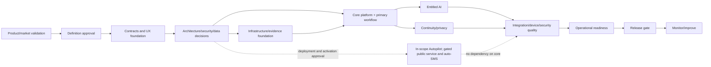

# Roadmap Map

```mermaid
flowchart LR
  V[Product/market validation] --> A[Definition approval]
  A --> R[Contracts and UX foundation]
  R --> X[Architecture/security/data decisions]
  X --> I[Infrastructure/evidence foundation]
  X --> C[Core platform + primary workflow]
  I --> C
  C --> E[Entitled AI]
  C --> P[Continuity/privacy]
  E --> Q[Integration/device/security quality]
  P --> Q
  Q --> O[Operational readiness]
  O --> L[Release gate]
  L --> M[Monitor/improve]
  X -. deployment and activation approval .-> AP[In-scope Autopilot; gated public service and auto-SMS]
  AP -. no dependency on core .-> Q
```

Calendar dates are intentionally absent. See [product roadmap](../08-roadmap/product-roadmap.md).
