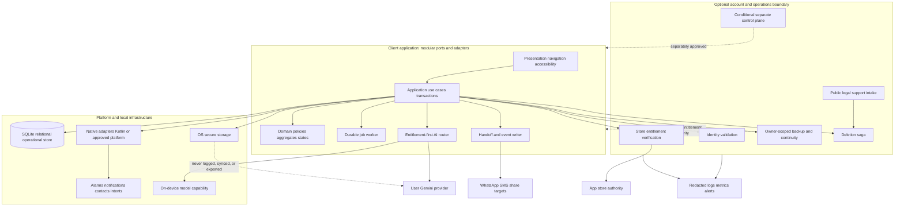

# Technical System and Security Map

**Diagram type:** Mermaid · **Status:** target blueprint view · **Authority:** supporting diagram; the linked specification remains authoritative.

```mermaid
flowchart TB
  subgraph Client[Client application: modular ports and adapters]
    UI[Presentation navigation accessibility]
    APP[Application use cases transactions]
    DOM[Domain policies aggregates states]
    JOB[Durable job worker]
    AI[Entitlement-first AI router]
    DELIVERY[Handoff and event writer]
    UI --> APP --> DOM
    APP --> JOB
    APP --> AI
    APP --> DELIVERY
  end
  subgraph Device[Platform and local infrastructure]
    DB[(SQLite relational operational store)]
    SEC[OS secure storage]
    AND[Native adapters Kotlin or approved platform]
    OS[Alarms notifications contacts intents]
    NANO[On-device model capability]
  end
  subgraph Backend[Optional account and operations boundary]
    ID[Identity validation]
    BILL[Store entitlement verification]
    CONT[Owner-scoped backup and continuity]
    DELAPI[Deletion saga]
    WEB[Public legal support intake]
    CTRL[Conditional separate control plane]
  end
  EXT1[User Gemini provider]
  EXT2[WhatsApp SMS share targets]
  STORE[App store authority]
  OBS[Redacted logs metrics alerts]
  APP --> DB
  APP --> SEC
  APP --> AND --> OS
  AI --> NANO
  AI --> EXT1
  DELIVERY --> EXT2
  APP --> ID
  APP --> BILL
  BILL --> STORE
  APP --> CONT
  APP --> DELAPI
  WEB --> DELAPI
  Client --> OBS
  Backend --> OBS
  CTRL -. "separately approved" .-> Client
  SEC -. "never logged, synced, or exported" .-> EXT1
  CONT -. "no secret or entitlement authority" .-> Client
  click UI "../03-technical-architecture.md" "Architecture"
  click APP "../05-security-operations.md" "Security and operations"
```
