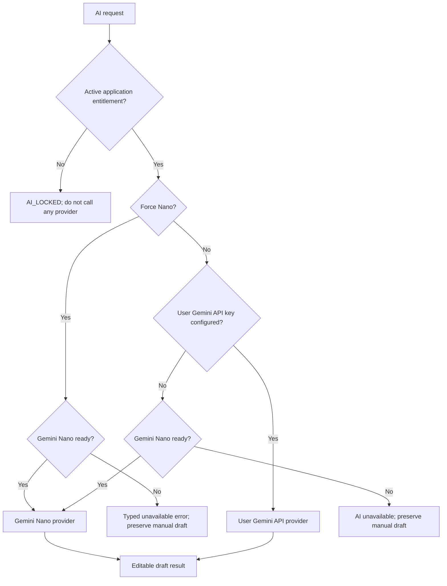

# AI Entitlement-First Routing

The entitlement check precedes all AI provider selection and invocation.

```mermaid
flowchart TD
    A[AI request] --> B{Active application entitlement?}
    B -->|No| C[AI_LOCKED; do not call any provider]
    B -->|Yes| D{Force Nano?}
    D -->|Yes| E{Gemini Nano ready?}
    E -->|Yes| F[Gemini Nano provider]
    E -->|No| G[Typed unavailable error; preserve manual draft]
    D -->|No| H{User Gemini API key configured?}
    H -->|Yes| I[User Gemini API provider]
    H -->|No| J{Gemini Nano ready?}
    J -->|Yes| F
    J -->|No| K[AI unavailable; preserve manual draft]
    F --> L[Editable draft result]
    I --> L
```
