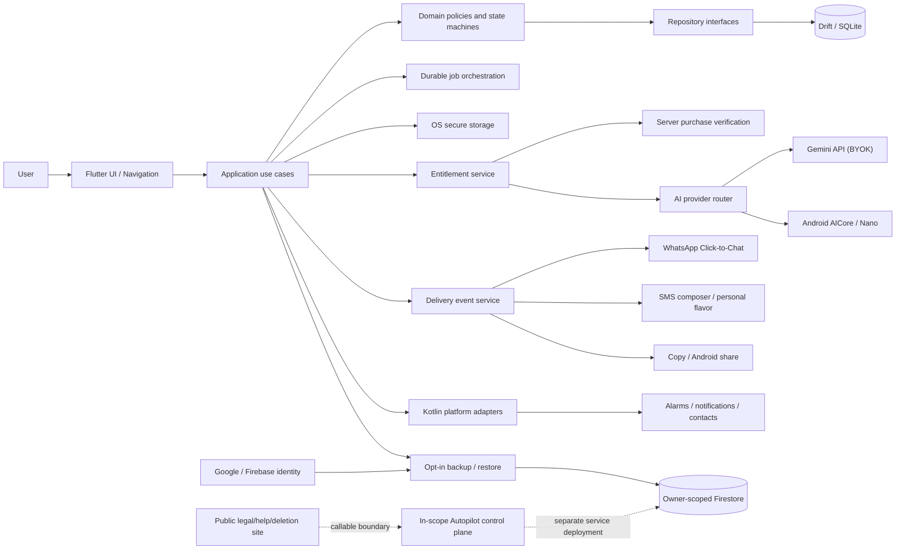

# Target Architecture Map

Target-state architecture map; implementation evidence remains separate.

```mermaid
flowchart LR
  USER["User"] --> UI["Flutter UI / Navigation"]
  UI --> APP["Application use cases"]
  APP --> DOMAIN["Domain policies and state machines"]
  APP --> JOBS["Durable job orchestration"]
  DOMAIN --> REPO["Repository interfaces"]
  REPO --> DB[("Drift / SQLite")]
  APP --> VAULT["OS secure storage"]
  APP --> ENT["Entitlement service"]
  ENT --> BILL["Server purchase verification"]
  ENT --> ROUTER["AI provider router"]
  ROUTER --> GEM["Gemini API (BYOK)"]
  ROUTER --> NANO["Android AICore / Nano"]
  APP --> DELIVERY["Delivery event service"]
  DELIVERY --> WA["WhatsApp Click-to-Chat"]
  DELIVERY --> SMS["SMS composer / personal flavor"]
  DELIVERY --> SHARE["Copy / Android share"]
  APP --> NATIVE["Kotlin platform adapters"]
  NATIVE --> OS["Alarms / notifications / contacts"]
  APP --> SYNC["Opt-in backup / restore"]
  SYNC --> FIRESTORE[("Owner-scoped Firestore")]
  AUTH["Google / Firebase identity"] --> SYNC
  CTRL["In-scope Autopilot control plane"] -. "separate service deployment" .-> FIRESTORE
  WEB["Public legal/help/deletion site"] -. callable boundary .-> CTRL
```
