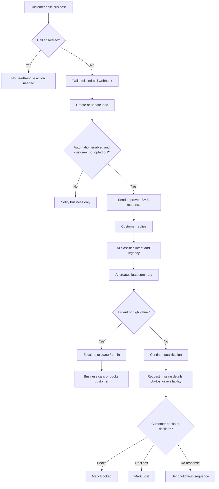
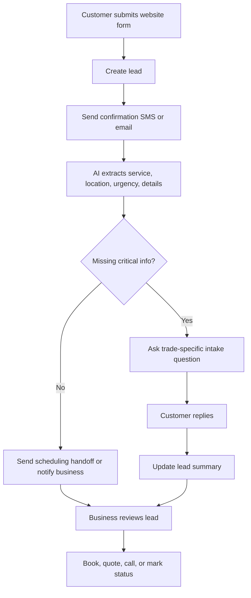
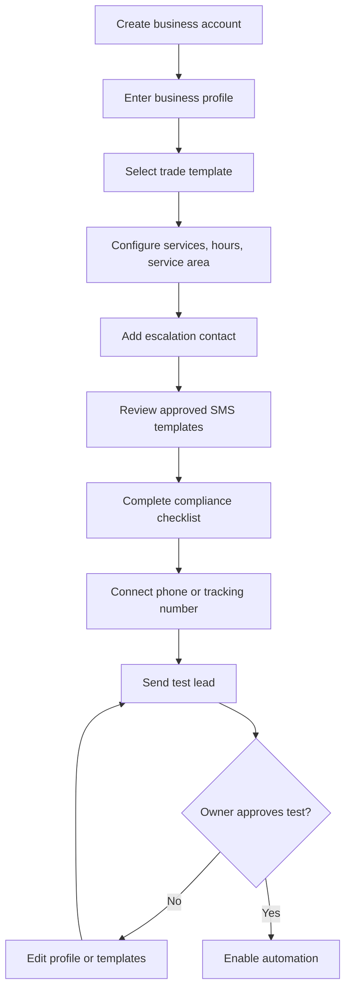
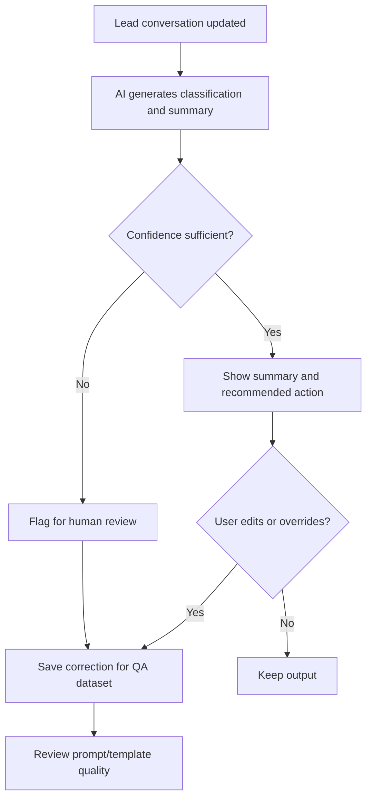

# Product Requirements Document: LeadRescue AI

Archived reference note: this document is a separate startup-idea artifact, not the implemented RelateAI Android product. It is retained only for historical ideation context and should not be read as an implementation contract for this repository.

Date: 2026-06-25

## Product Overview

LeadRescue AI is an AI-assisted lead response and follow-up platform for small home-service businesses. The product captures missed calls, website leads, voicemail inquiries, and inbound texts; sends fast SMS follow-up; asks trade-specific qualification questions; collects photos and availability; summarizes the lead for the business; and tracks the lead until it is booked, declined, opted out, or inactive.

The product should start as a lightweight overlay on top of existing tools. The MVP should not attempt to replace a full field-service-management system. It should solve one urgent workflow extremely well: respond to every lead quickly and keep follow-up moving until the customer takes the next step.

### Product Principles

- Speed matters: first response should happen within 60 seconds where technically possible.
- AI should assist, not make risky commitments.
- The business owner must control templates, tone, escalation rules, and automation state.
- The product should work with existing phone, calendar, email, and CRM habits.
- Every lead should have a clear status, next action, and history.
- Compliance, opt-out, and auditability are core product requirements, not later add-ons.

## User Stories and Use Cases

### User Stories

| ID | User | Story | Business Value |
| --- | --- | --- | --- |
| US-001 | Owner-operator | As an owner, I want missed callers to receive an immediate text so I do not lose jobs while I am on-site. | Increases lead engagement and conversion. |
| US-002 | Owner-operator | As an owner, I want each lead summarized so I can decide quickly who to call back first. | Saves time and improves prioritization. |
| US-003 | Dispatcher | As a dispatcher, I want all leads in one inbox so I can track follow-up status. | Reduces dropped leads and manual tracking. |
| US-004 | Customer | As a homeowner, I want to send job details and photos by text so I do not have to repeat myself on a call. | Improves customer experience and qualification quality. |
| US-005 | Business admin | As an admin, I want to approve message templates before automation starts. | Keeps brand voice and compliance under control. |
| US-006 | Business admin | As an admin, I want customers to opt out by texting STOP. | Supports compliance and customer trust. |
| US-007 | Owner | As an owner, I want urgent leads escalated immediately. | Helps respond to emergency or high-value work. |
| US-008 | Marketing agency | As an agency partner, I want reporting by client so I can prove lead response performance. | Supports partner-led distribution. |
| US-009 | Founder/support user | As an internal operator, I want AI outputs logged and reviewable so I can debug incorrect summaries or messages. | Improves AI reliability and customer support. |

### Primary Use Cases

| Use Case | Trigger | Product Behavior | Outcome |
| --- | --- | --- | --- |
| Missed-call rescue | A prospect calls and the business does not answer. | Create lead, send SMS, ask how the business can help, classify response, notify business. | Prospect receives fast response and business gets a summary. |
| Web-form follow-up | A prospect submits a form. | Create lead, send confirmation SMS/email, ask missing intake questions, add lead to inbox. | Form lead is engaged before it goes cold. |
| Photo intake | Prospect describes a repair or inspection. | Send secure photo upload link or MMS prompt. | Business receives useful context before callback. |
| Scheduling handoff | Prospect wants an appointment. | Offer approved scheduling link or ask for preferred windows, then notify business. | Lead moves toward booked status. |
| Quote reminder | Prospect received initial response but did not book. | Send approved follow-up messages until response, opt-out, or inactivity. | Follow-up becomes consistent and measurable. |
| Urgent escalation | Lead indicates emergency, active leak, no heat, safety issue, or similar urgent language. | Mark urgent, notify owner/admin immediately, pause risky automation if required. | Business can intervene quickly. |

## Functional Requirements

### Lead Capture

| ID | Requirement | Priority |
| --- | --- | --- |
| FR-001 | The system shall create a lead from a missed-call webhook. | Must-Have |
| FR-002 | The system shall create a lead from a hosted web form. | Must-Have |
| FR-003 | The system shall support inbound SMS replies from customers. | Must-Have |
| FR-004 | The system shall support manual lead creation by business users. | Should-Have |
| FR-005 | The system shall deduplicate leads by phone number and recent activity window. | Should-Have |
| FR-006 | The system shall preserve lead source, timestamp, phone number, name when available, message history, and status. | Must-Have |

### Automated SMS Follow-Up

| ID | Requirement | Priority |
| --- | --- | --- |
| FR-007 | The system shall send an approved SMS response within 60 seconds of a missed call or new web lead when automation is enabled. | Must-Have |
| FR-008 | The system shall use business-approved templates with variables for business name, service type, hours, and scheduling link. | Must-Have |
| FR-009 | The system shall stop automated messages immediately when a customer opts out. | Must-Have |
| FR-010 | The system shall support quiet hours and business-hour rules. | Must-Have |
| FR-011 | The system shall retry or alert on failed message delivery. | Should-Have |
| FR-012 | The system shall support MMS or secure upload links for photos. | Should-Have |

### AI Assistance

| ID | Requirement | Priority |
| --- | --- | --- |
| FR-013 | The system shall classify lead intent into categories such as emergency, quote request, repair, maintenance, estimate, scheduling, sales, spam, or unknown. | Must-Have |
| FR-014 | The system shall generate a concise lead summary for business users. | Must-Have |
| FR-015 | The system shall extract structured fields when available: job type, location, urgency, preferred time, photos provided, and customer question. | Must-Have |
| FR-016 | The system shall recommend the next best action, such as call now, send scheduling link, request photos, request address, or mark as spam. | Should-Have |
| FR-017 | The system shall never generate pricing, warranty, safety, legal, or availability commitments unless those claims are explicitly configured by the business. | Must-Have |
| FR-018 | The system shall provide confidence labels or fallback to human review when the AI cannot classify a lead reliably. | Should-Have |
| FR-019 | The system shall log AI inputs, outputs, model metadata, prompt version, and user overrides for debugging and quality review. | Must-Have |
| FR-020 | The system shall allow business users to edit AI-drafted messages before sending when manual approval mode is enabled. | Should-Have |

### Lead Inbox and Workflow

| ID | Requirement | Priority |
| --- | --- | --- |
| FR-021 | The system shall show leads in an inbox with status, urgency, source, customer name/phone, last message, and next action. | Must-Have |
| FR-022 | The system shall allow users to update lead status: New, Engaged, Needs Reply, Booked, Quoted, Won, Lost, Opted Out, Spam, Inactive. | Must-Have |
| FR-023 | The system shall show the full message timeline for each lead. | Must-Have |
| FR-024 | The system shall support owner/admin notifications by SMS and email. | Must-Have |
| FR-025 | The system shall provide daily digest reporting for unresolved leads. | Should-Have |
| FR-026 | The system shall allow assignment to a user or team member. | Nice-to-Have |

### Onboarding and Configuration

| ID | Requirement | Priority |
| --- | --- | --- |
| FR-027 | The system shall collect business profile data: business name, services, service area, hours, emergency availability, tone, scheduling link, and escalation contact. | Must-Have |
| FR-028 | The system shall provide default templates by trade. | Must-Have |
| FR-029 | The system shall require template approval before automated messaging starts. | Must-Have |
| FR-030 | The system shall support connecting or forwarding a phone number through Twilio. | Must-Have |
| FR-031 | The system shall provide a compliance checklist before launch. | Must-Have |
| FR-032 | The system shall support Stripe subscription setup. | Should-Have |

### Reporting

| ID | Requirement | Priority |
| --- | --- | --- |
| FR-033 | The system shall report first-response time, number of leads captured, number of automated messages sent, engagement rate, and unresolved leads. | Must-Have |
| FR-034 | The system shall show booked or won leads when users update status. | Should-Have |
| FR-035 | The system shall export leads as CSV. | Should-Have |
| FR-036 | The system shall support agency/client reporting views. | Nice-to-Have |

## Non-Functional Requirements

### Performance

- New lead creation from webhook should complete within 2 seconds under normal operating conditions.
- First automated SMS should be queued within 60 seconds of qualifying trigger events.
- Lead inbox should load in under 2 seconds for accounts with up to 10,000 leads.
- AI summary generation should complete in under 15 seconds for standard SMS-length conversations.

### Reliability

- Target application uptime: 99.5% for MVP, 99.9% after production hardening.
- Webhook processing must be idempotent to prevent duplicate messages.
- Failed SMS sends, failed AI calls, and failed notifications must be logged.
- System should degrade gracefully: if AI is unavailable, send safe default template and flag lead for review.

### Security and Privacy

- Encrypt sensitive data in transit using TLS.
- Encrypt sensitive data at rest where supported by infrastructure.
- Restrict user access by account and role.
- Store API keys and secrets in managed secret storage.
- Provide account-level data deletion on request.
- Avoid storing unnecessary payment data by using Stripe-hosted billing flows.

### Compliance

- Support STOP, START, and HELP SMS handling.
- Maintain opt-out status and suppress future automated messages to opted-out numbers.
- Support quiet hours and business-hour rules.
- Maintain message audit logs.
- Include onboarding guidance that customers must have appropriate consent for SMS workflows.
- Obtain legal review before broad production launch for TCPA, CTIA, and carrier registration requirements.

### AI Quality and Safety

- AI output must be constrained by business profile data and approved templates.
- AI must not invent pricing, discounts, availability, licensing, insurance, warranty terms, or emergency guarantees.
- AI must label uncertain classifications and fall back to human review for ambiguous messages.
- AI prompts and versions must be tracked so regressions can be debugged.
- A test set of representative lead conversations must be maintained for regression testing.
- Users must be able to disable AI-generated message drafting while keeping basic automation active.

### Accessibility and Usability

- Dashboard should meet WCAG 2.1 AA guidelines for color contrast, keyboard access, and focus states.
- Mobile layout must support owner use in the field.
- Core actions should be possible in under three taps on mobile: view lead, call customer, send message, mark status.

## MVP Scope

### In Scope

- Business account setup.
- Business profile and approved templates.
- Twilio-based missed-call trigger.
- Hosted web lead form.
- Automated SMS first response.
- Inbound SMS conversation capture.
- AI lead classification.
- AI lead summary.
- Lead inbox with status and timeline.
- Customer opt-out handling.
- Owner/admin notifications.
- Basic reporting.
- Stripe billing or manual billing for pilots.
- CSV export.

### Out of Scope for MVP

- Full AI voice receptionist.
- Autonomous quote generation.
- Dispatch optimization.
- Native mobile apps.
- Deep two-way CRM integrations.
- Technician route planning.
- Payment collection from homeowners.
- Complex multi-location enterprise permissions.
- White-label agency portal.
- Custom model training.

## Feature Prioritization (Must-Have, Should-Have, Nice-to-Have)

| Feature | Priority | Rationale |
| --- | --- | --- |
| Missed-call SMS response | Must-Have | Core revenue recovery workflow. |
| Web-form lead capture | Must-Have | Common lead source and simple to build. |
| Approved SMS templates | Must-Have | Required for control, trust, and compliance. |
| Opt-out handling | Must-Have | Compliance and customer trust requirement. |
| Lead inbox | Must-Have | Users need a central place to manage leads. |
| AI lead classification | Must-Have | Makes leads actionable and prioritizable. |
| AI lead summary | Must-Have | Saves owner/admin time. |
| Message timeline | Must-Have | Provides context and auditability. |
| Business profile setup | Must-Have | Constrains AI and personalizes messages. |
| Compliance checklist | Must-Have | Reduces SMS launch risk. |
| Photo request/upload | Should-Have | Valuable for many trades but not required for first pilot. |
| Calendar/scheduling link handoff | Should-Have | Moves qualified leads toward booking. |
| Daily unresolved-lead digest | Should-Have | Improves follow-up discipline. |
| AI next-best-action recommendations | Should-Have | Useful after classification and summary are stable. |
| Stripe self-serve billing | Should-Have | Helpful after pilot validation. |
| CRM exports/integrations | Should-Have | Supports customers with existing systems. |
| Agency/client reporting | Nice-to-Have | Useful for partner channel after direct validation. |
| Native mobile app | Nice-to-Have | Web app should be enough for MVP. |
| AI voice receptionist | Nice-to-Have | Higher complexity and compliance risk; defer. |
| Quote reminder automation | Nice-to-Have | Natural expansion after lead rescue works. |

## User Flow Diagrams

### Missed-Call Rescue Flow

### Web-Form Lead Flow

### Onboarding Flow

### AI Quality Review Flow

## Technical Requirements

### Recommended Architecture

| Layer | Recommendation |
| --- | --- |
| Frontend | React/Next.js web app optimized for desktop and mobile. |
| Backend | Node.js/TypeScript or Python API with webhook handlers. |
| Database | Postgres with account, user, lead, message, template, event, and audit tables. |
| Messaging | Twilio for SMS, MMS, phone numbers, and call webhooks. |
| Email/forms | Hosted forms for MVP; optional SendGrid inbound parse or Gmail integration later. |
| AI | LLM API for classification, summarization, field extraction, and draft recommendations. |
| Billing | Stripe subscriptions and customer portal. |
| Auth | Managed auth provider or secure session-based authentication. |
| Hosting | Vercel, Render, Fly.io, AWS, or similar managed platform. |
| Observability | Error tracking, structured logs, webhook event logs, AI output audit logs. |

### Core Data Entities

| Entity | Key Fields |
| --- | --- |
| Account | business name, trade, service area, hours, automation status, billing status. |
| User | name, email, role, phone, notification settings. |
| Lead | account, customer name, phone, source, status, urgency, job type, assigned user, next action. |
| Message | lead, direction, channel, body, delivery status, provider id, timestamp. |
| Template | account, trigger, body, variables, approval status, version. |
| AI Run | lead, task type, prompt version, input reference, output, confidence, model metadata, error. |
| Opt Out | phone number, account, opt-out status, timestamp, source. |
| Event Log | entity, action, user/system actor, timestamp, metadata. |

### AI Implementation Requirements

- Use deterministic schemas for AI outputs where possible, such as JSON with required fields.
- Validate AI responses server-side before saving or using them.
- Use safe fallback labels such as `unknown` when model output fails validation.
- Keep prompt templates versioned.
- Create a small regression dataset before launch with at least 50 representative conversations across emergency, quote, repair, spam, scheduling, and unclear cases.
- Run AI regression checks before prompt or model changes.
- Separate customer-facing messages from internal summaries. Customer-facing messages should be template-first, with AI used only inside approved constraints.
- Never allow AI to send pricing or availability promises unless the business has explicitly configured that exact content.

### Integrations

MVP:

- Twilio SMS and phone webhooks.
- Hosted web form.
- Stripe billing.
- Email notifications.

Post-MVP:

- Google Calendar.
- Calendly.
- Jobber export or integration.
- Housecall Pro export or integration.
- Zapier or Make connector.
- Google Business Profile call tracking imports if feasible.

## Development Roadmap

### Phase 0: Validation and Design - Weeks 1-2

Goals:

- Interview 30 target customers.
- Choose one beachhead vertical.
- Define pilot offer and onboarding script.
- Design lead inbox, onboarding, and missed-call flow.
- Build compliance checklist draft.

Deliverables:

- Clickable prototype or simple UI mockups.
- Final MVP requirements.
- Pilot customer list.
- Trade-specific SMS templates.

### Phase 1: Concierge MVP - Weeks 3-4

Goals:

- Run real lead follow-up with limited automation and manual oversight.
- Validate messaging, onboarding, and willingness to pay.

Deliverables:

- Twilio number setup.
- Basic lead creation.
- Manual dashboard or admin tool.
- Approved templates.
- AI summary prototype.
- Daily reporting for pilots.

Exit criteria:

- At least 3 pilot accounts live.
- At least 20 real leads processed.
- Median response time under 60 seconds.

### Phase 2: Self-Serve MVP - Weeks 5-8

Goals:

- Reduce manual work.
- Make the core product usable by paying customers.

Deliverables:

- Account onboarding.
- Business profile setup.
- Lead inbox and timeline.
- Missed-call and web-form triggers.
- Automated SMS.
- Opt-out handling.
- AI classification and summary.
- Basic reporting.
- Billing setup.

Exit criteria:

- 10 active pilot customers.
- 5 paying customers.
- AI summary accepted without edit in at least 80% of reviewed pilot samples.

### Phase 3: Paid Beta - Weeks 9-12

Goals:

- Improve reliability, reporting, and sales repeatability.

Deliverables:

- Failed-message alerts.
- AI audit logs.
- CSV export.
- Daily unresolved-lead digest.
- Improved onboarding checklist.
- ROI reporting.
- Case studies.

Exit criteria:

- $750+ MRR.
- Churn risk reasons documented.
- At least one repeatable acquisition channel identified.

### Phase 4: Growth Version - Months 4-6

Goals:

- Expand within first vertical and prepare partner distribution.

Deliverables:

- Scheduling integration.
- Photo intake.
- Agency reporting.
- More vertical templates.
- CRM export/integration.
- Usage-based billing controls.

Exit criteria:

- 50 paying customers.
- $5,000-$10,000 MRR.
- Onboarding time under 30 minutes.

## Acceptance Criteria

### Lead Capture

- Given a missed call webhook, when the phone number is valid and the account is active, then the system creates or updates a lead with source `missed_call`.
- Given a duplicate missed call from the same phone number within the configured deduplication window, then the system updates the existing lead instead of creating a duplicate.
- Given a website form submission, then the system creates a lead with all submitted fields and source metadata.

### Automated Messaging

- Given automation is enabled and the customer has not opted out, when a missed-call lead is created, then the system sends the approved first-response SMS within 60 seconds.
- Given a customer texts STOP, when the message is received, then the system marks the customer opted out and suppresses all future automated SMS for that account.
- Given a message fails delivery, then the system records the failure and alerts the account user or support workflow.

### AI Classification and Summary

- Given a representative emergency lead message such as "pipe burst and water is everywhere," then the AI classification returns emergency or urgent repair, not general inquiry.
- Given an unclear customer response, then the AI uses `unknown` or low confidence instead of inventing intent.
- Given a lead conversation, then the AI summary includes only facts present in the conversation or configured business profile.
- Given no configured pricing data exists, then AI output does not include price estimates, discounts, or final quote language.
- Given no configured availability exists, then AI output does not promise a specific appointment time.
- Given AI output fails schema validation, then the system discards it, logs the error, and falls back to human review or safe default messaging.
- Given a prompt or model version changes, then the regression dataset must be run and reviewed before release.

### Lead Inbox

- Given an authenticated account user, when they open the inbox, then they see only leads belonging to their account.
- Given a lead has unread customer replies, then the inbox clearly marks it as needing reply.
- Given a user updates a lead status to Booked, then reporting reflects the status change.

### Onboarding

- Given a new account, automation cannot be enabled until business profile, escalation contact, approved templates, and compliance checklist are complete.
- Given a test lead is sent during onboarding, then the account user can review the exact message content before enabling live automation.

### Security and Compliance

- Given a user from another account attempts to access a lead by ID, then access is denied.
- Given a customer requests deletion through support, then account data can be exported and deleted according to the retention policy.
- Given quiet hours are configured, then non-urgent automated messages are not sent during quiet hours.

## Future Enhancements

- AI voice receptionist for after-hours intake, with strong human escalation and compliance controls.
- Quote follow-up automation after estimates are sent.
- Maintenance reminder campaigns for seasonal services.
- Review request and review response assistant.
- Customer reactivation campaigns.
- Deeper CRM integrations with Jobber, Housecall Pro, ServiceTitan, Workiz, and HubSpot.
- Call transcript summarization.
- Lead source ROI attribution.
- Multi-location account support.
- Agency white-label portal.
- Mobile app for owners and technicians.
- AI coaching for response quality and close-rate improvement.
- Dynamic templates by trade, season, urgency, and lead source.
- Benchmark reporting across similar businesses.
