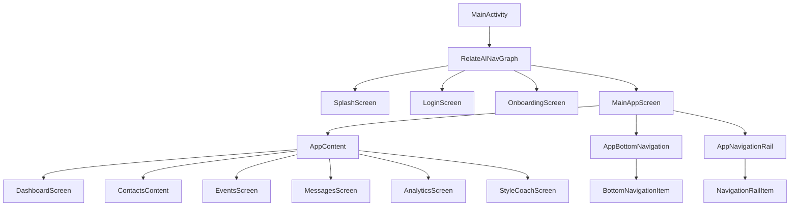

# Report 02 — Consolidation Decisions

**Date**: 2026-06-01
**Author**: Senior PM / Senior Architect (SSOT Audit)
**Scope**: Authoritative decisions for merging, de-duplicating, and resolving documentation.

---

## 1. Guiding Principles

1. **Code is the source of truth** (per SSOT §33 final note).
2. **SSOT.md remains the primary human-readable spec.**
3. **SSOT_TEMPLATE.md is a meta-template, not project content** — never merge into SSOT.md.
4. **README.md is for AI Studio / quick-start only** — do not add product content.
5. **No content is lost**: every fact in any doc must be reachable via SSOT.md or a clearly-linked new doc.

---

## 2. Per-Doc Disposition

| Doc | Action | Rationale |
|---|---|---|
| `SSOT.md` | **Promote to v3.1** | Primary spec; needs targeted fixes (see §3). |
| `SSOT_TEMPLATE.md` | **Keep as-is** | Meta-template, not project content. |
| `README.md` | **Keep + add 1-line link** | AI Studio audience; add pointer to SSOT.md. |
| `CHANGELOG.md` | **Create** | Extract from SSOT §1.4 fixes table. |
| `CONTRIBUTING.md` | **Create** | Extract from SSOT §33.6 onboarding. |
| `docs/THREAT_MODEL.md` | **Create** | New, STRIDE-based. |
| `docs/TEST_PLAN.md` | **Create** | New, per-module coverage targets. |
| `docs/architecture/*.png` | **Create** | Export Mermaid diagrams. |

---

## 3. SSOT.md v3.0 → v3.1 Fixes

### 3.1 Stale Module Count (§1.2)
**Before**:
> **Codebase Size**: ~7,000+ lines of Kotlin across 7 modules.

**After**:
> **Codebase Size**: ~7,000+ lines of Kotlin across **12 modules** (`:app` + `:core:domain` + `:core:data` + `:core:ui` + 8 `:feature:*`).

### 3.2 Onboarding Step Count (§8.9, §1.4, §30.2, §31.1)
**Before** (FR-80):
> System MUST guide user through **7-step** onboarding (target simplification from 10 steps).

**After**:
> System MUST guide user through **10-step** onboarding today (target: simplify to 7 steps per HIGH-02).

Move the "7-step target" from FR-80 to the appropriate backlog item (currently in §31.1 Roadmap).

### 3.3 MainViewModel Example (§15.3)
**Before**:
```kotlin
class MainViewModel @Inject constructor(
    private val contactRepository: ContactRepository,
    private val eventRepository: EventRepository,
    private val messageRepository: MessageRepository
) : ViewModel() { ... }
```

**After** (4-arg, matches `MainViewModel.kt:22-27`):
```kotlin
class MainViewModel @Inject constructor(
    private val contactRepository: ContactRepository,
    private val eventRepository: EventRepository,
    private val messageRepository: MessageRepository,
    private val getDashboardMetrics: GetDashboardMetricsUseCase
) : ViewModel() { ... }
```

### 3.4 Component Hierarchy Diagram (§15.2)
Add `AppNavigationRail` (tablet variant):


### 3.5 Bottom Nav Tabs (§15.2, §15.5)
- Phone bottom nav: **5 items** (HOME, CONTACTS, EVENTS, MESSAGES, MORE)
- Tablet rail: **5 items** (same set)
- Hidden via MORE tab: **ANALYTICS, STYLE_COACH**
- Add note: "ANALYTICS and STYLE_COACH are accessed via MORE tab (not in bottom nav)"

### 3.6 §18.2 Database Version History
Clarify migration history. The actual `AppDatabase.kt` has:
- Version 1 → 2: initial
- Version 2 → 3: ?
- Version 3 → 4: customSendTime fields
- Version 4 → 5: contactGroup
- Version 5 → 6: relationsJson (auto-migration)

Replace §18.2 table with verified history (confirm in code; see Report 04).

### 3.7 Unicode Corruptions (Global)
Replace throughout SSOT.md:
- `�o.` → `✅`
- `�?O` → `❌`
- `�s��,?` → `⚠️`
- `dY"` → `🔄`
- `�?"` → `→` (em-dash)
- `�'` → `✅` (used inconsistently)

Affects at least §1.4, §29.1, §30.1–30.4, §32, §33.

### 3.8 Add `User-Facing Commands` to §33.9
Missing common commands:
```bash
# Build release APK
./gradlew assembleRelease

# Install on device
./gradlew installDebug

# Generate Room schema
./gradlew :core:data:kspDebugKotlin

# Run lint
./gradlew lint
```

---

## 4. New Top-Level Docs (Extracted from SSOT)

### 4.1 `CHANGELOG.md` (new)
Extract SSOT §1.4 "Fixes Applied" table. Format:
```markdown
# Changelog

## v3.0 (2026-06-01) — Production-Grade SSOT
### Fixed
- TD-07: Rate limiter adaptive sliding-window
- TD-08: SecurePrefs explicit retry
- TD-12: printStackTrace → Log.e
- ... (all 30+ items)
## v2.8 (March 2026) — Superseded
## ... (older versions)
```

### 4.2 `CONTRIBUTING.md` (new)
Extract SSOT §33.6 "New Developer Onboarding". Add:
- Code of conduct (link to a CoC file or skip)
- How to submit PRs
- How to file issues
- Style guide link (SSOT §26)

### 4.3 `docs/THREAT_MODEL.md` (new)
STRIDE-based, derived from §22:
- **Spoofing**: OAuth tokens, biometric bypass
- **Tampering**: SQLCipher at rest, TLS in transit
- **Repudiation**: WorkManager `Result.success/failure` logging
- **Information Disclosure**: ANDROID_ID key derivation, PII in logs
- **Denial of Service**: Rate limiter (Gemini), WorkManager constraints
- **Elevation of Privilege**: Hilt DI (compile-time), Accessibility Service scope

### 4.4 `docs/TEST_PLAN.md` (new)
Per-module coverage targets:
- `:core:domain`: 100% (pure Kotlin logic)
- `:core:data`: 80% (DAOs, repos, Gemini client)
- `:core:ui`: 50% (components)
- `:feature:*`: 30% (smoke tests only)
- `:app`: 20% (integration)

Existing tests: 5 unit test files covering ~30 test cases. **Current coverage is well below targets** — see Report 04.

### 4.5 `docs/architecture/*.png` (new)
Export Mermaid diagrams to PNG/SVG:
- `high-level-architecture.png` (§14.1)
- `module-structure.png` (§14.2)
- `data-flow-birthday.png` (§14.5)
- `component-hierarchy.png` (§15.2)
- `auth-flow.png` (§21.1)
- `security-layers.png` (§22.1)
- `cicd-pipeline.png` (§23.5)

---

## 5. Duplicate Resolution Matrix

| Topic | SSOT.md (final home) | Other Docs | Resolution |
|---|---|---|---|
| Module list | §14.3 | README — none | Keep in SSOT only. |
| Onboarding flow | §12.1 | — | Keep; fix step count. |
| Test commands | §33.9 | README:6 (run locally) | SSOT is canonical; README is subset. |
| Signing config | §23.4 | README:5 (remove debugConfig) | **Conflict**: README says **remove** debugConfig for production; SSOT says use **custom release keystore** (KEYSTORE_PATH, etc.). Both are correct but expressed differently. **Resolution**: Update README to clarify "remove `signingConfig = signingConfigs.getByName("debugConfig")` from `app/build.gradle.kts` AND set KEYSTORE_PATH/STORE_PASSWORD/KEY_PASSWORD env vars" — or add a link to SSOT §23.4. |
| `.env` setup | §24.1, §24.3 | README:4 (create `.env` with GEMINI_API_KEY) | Consistent. |
| Permissions | §22, §27, §30 | AndroidManifest.xml | SSOT is canonical; verify all 12 permissions are documented. |
| Dead-UI findings | (none today) | Code: `ContactDetailScreen.kt:44, 209` | Add to Report 05 (dead UI/UX audit). |
| MainViewModel signature | §15.3 (wrong) | `MainViewModel.kt:22-27` (4-arg) | Fix §15.3 to match code. |

---

## 6. Out-of-Scope for Consolidation

The following are **explicitly out of scope**:
- Refactoring code to match SSOT (SSOT should match code, not vice versa)
- Rewriting SSOT in a different format (e.g., OpenAPI, AsciiDoc)
- Migrating diagrams from Mermaid to Graphviz (Mermaid renders in GitHub natively)
- Adding translation to non-English languages (planned per §31)
- Adding enterprise governance docs (only needed for multi-team orgs)

---

## 7. Sign-Off

**SSOT.md v3.1** is the canonical product/architecture spec after this audit. All new code changes must reference SSOT.md and update it inline per §33.11.
